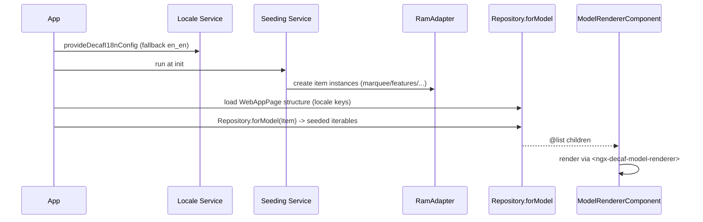

# DECAF-49: Decaf Web Page — for-angular Marketing Site

## Paperclip Snapshot

| Field | Value |
| --- | --- |
| Task type | `specification` |
| Status | blocked |
| Priority | medium |
| Assignee | CEO (SAA-107 owner) |
| Parent | none (domain root) |
| Blocked by | SAA-110 (this initialize milestone) — resolves on completion |
| Observed at | 2026-08-20T02:40:00Z |

Paperclip is authoritative for all lifecycle fields in this snapshot.

> **Approval provenance.** Product scope was approved by Product Manager on [SAA-108](/SAA/issues/SAA-108) (status `done`). Technical governance / architecture was approved by CTO on [SAA-109](/SAA/issues/SAA-109) (status `done`). The verbatim approved statements remain on their source issues; the approved deltas are summarized below. Implementation is delegated by CEO under separate Paperclip children created after this initialize milestone, each carrying specification `DECAF-49`. Jira is **disabled** (local `DECAF-` spec identity; no Jira/Xray synchronization).

## 1. Overview

Convert the `web-page` package into a **for-angular based web application** that is a **pixel-perfect match** of the existing `web-page/www` static mock (the decaf-ts marketing site: `index` + `marquee` + `features` + `modules` + `tutorials` + `examples`; locales `en_en` / `en_us` / `pt_br` / `pt_pt`). The for-angular production build output becomes the new `www`, served as the GitHub Page.

The application is **pure-decaf / model-driven**: every rendered component is a `@uimodel`-decorated `Model`; page structure is generated from locale JSON; iterable content is seeded into a `RamAdapter` and fetched via `Repository.forModel` (never embedded in JSON or templates); a service layer owns non-animation, non-component-specific logic (e.g. slogan selection/loading); routing is manual (no route generation).

### Source package reality (CEO-confirmed)

- The package is the `web-page` submodule, whose `package.json` is named **`@decaf-ts/ts-workspace`** (repo `git+https://github.com/decaf-ts/ts-workspace.git`, branch `master`). The source request's `@decaf-ts/ts-workspace` / `decaf-ts/wep-page.git` references are to be reconciled: the operative target is the **`web-page` submodule** at the `master` branch; `wep-page.git` appears to be a typo (confirm exact repo/branch before starting).
- `web-page/src` is a non-functional placeholder (`index.ts` only). The "existing code" to convert is the **`www/` static mock** (~3378 lines: `index.html` ~1480 lines plus ~3108 lines of JS across `features/modules/tutorials/examples/marquee/banner/content/locale.js`; styles inlined; four locale files `en_en`/`en_us`/`pt_br`/`pt_pt`).
- `web-page` currently has **no Angular tooling** (only `build-scripts`/jest). The implementer adds Angular CLI + `@angular/build` + `@angular-builders/custom-webpack` + `@decaf-ts/for-angular` + peers, matching `for-angular/package.json` versions.

## 2. Goals

* [ ] Reproduce all five mock pages pixel-perfectly (`index`, `features`, `modules`, `tutorials`, `examples`) at the mock's breakpoints.
* [ ] Reproduce all four locales (`en_en`, `en_us`, `pt_br`, `pt_pt`) via the for-angular locale service, all visible strings sourced only from locale JSON.
* [ ] Implement the model-driven segmentation hierarchy `WebApp → WebAppPage → Section → marquee/lists/items → leaf fields`, with header/footer/content.
* [ ] Seed all iterable content into a `RamAdapter` and load via `Repository.forModel`; no hardcoded JSON/template iterables.
* [ ] Move slogan selection/loading and all non-animation logic into a service layer.
* [ ] Produce a for-angular production build (`optimization: {scripts:true, styles:true, fonts:true}`, `outputHashing: "all"`) that outputs to `www`, served as the GitHub Page; preserve the mock as `www-mock`.
* [ ] Apply `ModelRendererComponent`-centric template reuse and subclass existing components where sensible to minimize app size.
* [ ] Manual routing only (no route generation).
* [ ] Pass component/service/model unit tests (jest) and Playwright visual-diff against `www-mock` (run in the workspace runtime).

## 3. Non-Goals

* No new design language — use `@decaf-ts/styles` classes with overridden values for pixel-perfect match; no bespoke CSS framework.
* No backend / API integration beyond the in-memory `RamAdapter` (no server, no HTTP persistence).
* No deletion of the mock; `www` is renamed to `www-mock` and preserved as the pixel-perfect reference.
* No CRUD machinery — the site is read-only display; do not subclass `CrudFormComponent`/`CrudFieldComponent` for marketing display.
* No route generation mechanism — manual `Routes` array only.
* Do not merge with [DECAF-25](./DECAF_25.md) (a different deliverable: refactor of the `for-angular` demo app's webpage). Cross-reference only.

## 4. User Stories / Requirements

* **US-1 — Visitor (landing):** As a visitor, I want the `index` page (marquee + hero + slogan) to render pixel-perfectly in my locale so the marketing landing matches the existing mock.
* **US-2 — Visitor (section pages):** As a visitor, I want the `features`, `modules`, `tutorials`, and `examples` section pages to render pixel-perfectly in my locale, each driven by the same model/RamAdapter/locale patterns as the landing.
* **US-3 — Locale switching:** As a visitor, I want to switch between `en_en`, `en_us`, `pt_br`, `pt_pt` and see all visible strings, page structure, and iterable content update from locale JSON / RamAdapter sources.
* **Req-1:** Every component must be a `@uimodel`-decorated `Model` (container) or `@uilistmodel`-decorated `Model` (leaf list item), with attributes decorated (`@uielement`, `@required`, `@minlength`, `@list`, `@prop`, `@pk`, …) referencing for-angular web-component tags. Do **not** put `@uimodel` on a model whose only render role is a list item (use `@uilistmodel` there).
* **Req-2:** Page model tree must be `WebApp` (`@list(() => WebAppPage)`) → `WebAppPage` (header `Section`, sections `@list(() => Section)`, footer) → `Section` (renders marquee/lists via `ModelRendererComponent`) → list/marquee components → leaf items (e.g. `UIMarqueeItem` with `title`/`description`/`icon`).
* **Req-3:** Page structure (which pages, sections, nav, CTAs) must be generated from locale JSON keys.
* **Req-4:** All iterable content (marquee items, feature/module/tutorial/example list items) must be seeded into a `RamAdapter` and fetched via `Repository.forModel(Model[, flavour])`; none embedded in JSON or templates. Item models need identity (`@pk`) for repo storage.
* **Req-5:** A seeding service runs at app init and creates item instances in the RAM repo from the locale/structured content (not random `FakerRepository` data).
* **Req-6:** Translations only from locale JSON; responsive; use for-angular locale service.
* **Req-7:** A `@service()`-decorated `ClientBasedService` (or `Service` extending the adapter) owns slogan selection/loading and all non-animation, non-component-specific logic, following decaf service rules (context args + `logCtx`, decaf errors only, no `console.*`).
* **Req-8:** Routing is a manual `Routes` array with `loadComponent` lazy standalone routes (index/marquee, features, modules, tutorials, examples, plus locale switch) — no route generation.
* **Req-9:** Production build must use the for-angular production config exactly (`optimization: {scripts:true, styles:true, fonts:true}`, `outputHashing: "all"`, `defaultConfiguration: "production"`), no `fileReplacements` or custom mangling.
* **Req-10:** Built `www` is served as the GitHub Page; `www-mock` retained as reference; app `baseHref`/`deployUrl` set for the actual GitHub Page URL (user page `/` vs project page `/<repo>/` — confirm exact URL).

## 5. Functional Requirements

| ID | Requirement | Priority | Acceptance evidence |
| --- | --- | --- | --- |
| FR-1 | Five mock pages reproduced pixel-perfectly at mock breakpoints | Must | Side-by-side visual comparison vs `www-mock`; Playwright visual-diff per page |
| FR-2 | Responsive behavior matches mock breakpoints | Must | Visual-diff across breakpoints |
| FR-3 | Four locales wired via for-angular locale service; strings only from JSON | Must | Locale switch E2E; no hardcoded strings in templates |
| FR-4 | Model-driven segmentation hierarchy implemented | Must | Model decoration unit tests |
| FR-5 | Iterables seeded in RamAdapter, loaded via `Repository.forModel` | Must | Seeding + read/query unit tests |
| FR-6 | Service layer owns slogan selection/loading and non-animation logic | Must | Service unit tests |
| FR-7 | Manual routing only | Must | Routes array inspection; no generation mechanism |
| FR-8 | Production build outputs to `www` with prod config | Must | `ng build` artifact inspection |
| FR-9 | `www` served as GitHub Page; `www-mock` retained | Must | Deployed Page + `www-mock` present |
| FR-10 | Reuse existing components / `ModelRendererComponent` templates to minimize size | Should | Template reuse review |

## 6. Non-Functional Requirements

| ID | Area | Requirement | Verification |
| --- | --- | --- | --- |
| NFR-1 | Performance | Production build optimized (bundling + mangling on) matching for-angular | `ng build` bundle inspection |
| NFR-2 | Maintainability | Same `ModelRendererComponent` template across section child-list renders; one renderer per section | Code review |
| NFR-3 | Convention | Decorators precise (`@uimodel` for containers, `@uilistmodel` for leaf items); RAM models use `@prop`/`@pk`, not `@column`/`@table` | Decoration unit tests + curator confirmation |
| NFR-4 | Convention | Custom display components extend `NgxComponentDirective`; reuse built-in `ngx-decaf-list-item` for simple rows | Code review |
| NFR-5 | i18n | Sub-locale codes (`en_en`/`pt_br`) resolve via the locale loader | Locale unit/E2E |
| NFR-6 | Testability | jest unit + Playwright E2E/visual-diff (workspace runtime, not local sandbox) | Test runs |

## 7. Architecture And Design

### 7.1 Model-driven segmentation

```
WebApp (@list(() => WebAppPage))
  └─ WebAppPage
       ├─ header: Section
       ├─ sections: @list(() => Section)
       │     └─ Section (renders marquee/lists via <ngx-decaf-model-renderer>)
       │           └─ list/marquee components
       │                 └─ leaf items (e.g. UIMarqueeItem: title/description/icon)
       └─ footer
```

- Page/container models bind to a component via `@uimodel('<selector>')`; child collections are `@list(() => ChildModel)` rendered recursively through `ModelRendererComponent` (`for-angular/src/lib/components/model-renderer/model-renderer.component.ts`).
- Leaf list items bind via `@uilistmodel('<selector>')` and surface fields via `@uilistprop` (see `CategoryModel.ts:13-15` which declares both).
- One `<ngx-decaf-model-renderer>` per section renders its `@list` children; no hand-written per-section Angular templates.

### 7.2 Components

- Custom display components extend `NgxComponentDirective` (`for-angular/src/lib/engine/NgxComponentDirective.ts:74`) — the same base `HeaderComponent` uses (`header.component.ts:131`) — bound via `@uimodel`/`@uilistmodel`.
- Reuse the built-in `ngx-decaf-list-item` for simple list rows; define a custom list-item component (e.g. `app-marquee-item`) only where the layout genuinely differs.
- Do **not** subclass `CrudFormComponent` (`ngx-decaf-crud-form`) / `CrudFieldComponent` (`ngx-decaf-crud-field`) — those are form/field CRUD machinery, not read-only display.

### 7.3 Locale & data strategy

- Use the for-angular locale service (`@ngx-translate` + custom `I18nLoader`/`I18nParser` in `for-angular/src/lib/i18n/Loader.ts`, wired via `provideDecafI18nConfig`). Move the four mock locale JSONs into the app's i18n assets (loader fetches `./assets/i18n/<lang>.json` and merges library-bundled keys).
- Sub-locale codes are supported (loader keys off the `lang` string). Configure e.g. `provideDecafI18nConfig({ fallbackLang: 'en_en', lang: 'en_en' }, [{ prefix: './assets/i18n/' }])` (default locale `en_en`; confirm default).
- Page structure (which pages, sections, nav, CTAs) generated from locale keys.

### 7.4 RamAdapter-seeded iterables

- Provide the `RamAdapter` as the DB adapter (the demo app's RamAdapter provider is commented out at `app.config.ts:33` — the web-page app must **enable** it; no HTTP backend).
- Seeding service runs at app init and creates item instances in the RAM repo from the locale/structured content (not random `FakerRepository` data).
- Item models need identity: `@pk` for the primary key. Because there is no SQL persistence, use the decoration-level `@prop()` (`decoration/src/shared/core.ts:80`) for plain attributes — **not** `@column`/`@table` (db-decorators persistence decorators implying a real table). Verify the exact RAM-model decoration set against the `core-ram-fs-adapters` skill.

### 7.5 Service layer

- Slogan selection/loading and non-animation, non-component-specific logic move to a `@service()`-decorated `ClientBasedService` (or `Service` extending the adapter) per core-services convention.
- Apply decaf service rules: context args + `logCtx`, decaf errors only, no `console.*`.
- Animation/visual-only JS logic stays in components.

### 7.6 Routing

- Manual `Routes` array with `loadComponent` lazy standalone routes, mirroring `for-angular/src/app/app.routes.ts`. Routes: index/marquee, features, modules, tutorials, examples, plus locale switch.

### 7.7 Build / deploy

- `for-angular-app` writes to `outputPath: "www"` (`for-angular/angular.json:93`). The static mock lives at `web-page/www/`. **Before any for-angular build runs in `web-page`, rename `web-page/www` → `web-page/www-mock`** (preserve as pixel-perfect reference). The new app then writes production output to `web-page/www` (the GitHub Page source). Sequence this as the **first** implementation step and gate the build on it.
- Bootstrap a `for-angular-app`-style Angular application project inside `web-page` (an `angular.json` with an application project + library reference to `@decaf-ts/for-angular`), mirroring `for-angular/angular.json`.
- Production config (match for-angular exactly, no `fileReplacements`):
  ```json
  "configurations": {
    "production": {
      "outputHashing": "all",
      "optimization": { "scripts": true, "styles": true, "fonts": true }
    }
  }
  ```
  `defaultConfiguration: "production"`.
- GitHub Page serving from `www`: set `baseHref`/`deployUrl` for the actual GitHub Page URL (user/`<user>.github.io` page uses `/`; project page needs `/<repo>/`) — confirm exact URL. Add a serve script (`http-server www -p <port>`) for local verification, mirroring `for-angular`'s `pwa` script (`for-angular/package.json:60`).

### 7.8 Page generation flow



## 8. Data, Security, And Privacy

- Data model: in-memory `RamAdapter` only; no SQL persistence, no migrations, no network calls. RAM models use `@prop`/`@pk` (not `@column`/`@table`).
- Authorization and threat considerations: none — public marketing site, read-only, no auth, no user data.
- Sensitive-data handling and retention: none.

## 9. Dependencies And Blockers

- **SAA-108** (PM scope approval) — `done`. Approved scope, acceptance criteria, locale set, priority.
- **SAA-109** (CTO technical governance) — `done`. Approved architecture, build/deploy, locale/RamAdapter strategy, testing strategy, decomposition recommendation.
- External: `@decaf-ts/for-angular` (v0.5.20), `@decaf-ts/styles`, `@decaf-ts/core` (`RamAdapter`), `@angular/*`, `@angular-builders/custom-webpack`, `@angular/build`. Match `for-angular/package.json` versions.
- Reference: `for-angular/src/app` (demo app) and `for-angular/src/lib`. Route any divergence between the example and the `for-angular-*`/`core-*` skills to the Decaf Standards Curator (decaf correction handoff), per CTO guidance.

## 10. Delivery And Rollback

1. Rename `web-page/www` → `web-page/www-mock`; commit the reference. (Gates everything else.)
2. Bootstrap Angular app inside `web-page` (angular.json, for-angular wiring, prod config).
3. Models + decorators (`WebApp`/`WebAppPage`/`Section`/item models, `@uimodel`/`@uilistmodel`/`@list`/`@uielement`/`@pk`/`@prop`).
4. Custom display components extending `NgxComponentDirective` + `ModelRendererComponent` templates.
5. RamAdapter provider + seeding service + `Repository.forModel` reads.
6. Locale service wiring + page generation from locale JSON.
7. Manual routing + locale switch.
8. jest unit + Playwright visual-diff (workspace runtime) + prod build to `www`.
9. Deploy built `www` as the GitHub Page.
- **Rollback:** revert the build commit; `www-mock` is always retained as the pixel-perfect reference, so the site can be re-served from the mock at any time.

## 11. Observability And Operations

- Telemetry and logs: decaf `ctx.logger` via service `logCtx`; no `console.*`.
- Alerting and thresholds: none (static site).
- Operational documentation: this specification + implementation child comments; GitHub Pages deploy notes.

## 12. Acceptance Criteria

- [ ] Pixel-perfect: each rendered page matches its `www-mock` counterpart visually (layout, spacing, typography, color) at the mock's breakpoints — verified by side-by-side comparison.
- [ ] Responsive: matches the mock's responsive behavior across its breakpoints.
- [ ] Locales: 4 locales (en_en, en_us, pt_br, pt_pt) fully wired via the for-angular locale service; all visible strings sourced only from locale JSON.
- [ ] Model-driven: every component is a `@uimodel`/`@uilistmodel` `Model`; segmentation hierarchy implemented.
- [ ] RamAdapter-seeded iterables: all iterable content seeded into a RamAdapter and loaded via `Repository.forModel` — none hardcoded in JSON or templates.
- [ ] Service layer: slogan selection/loading and all non-animation logic live in services, not components.
- [ ] Routing: manual routing only (no route generation mechanism).
- [ ] Tests: component/service/model tests pass; RamAdapter seeding and locale loading covered.
- [ ] Production build: for-angular prod config `optimization: {scripts:true, styles:true, fonts:true}` (+ `outputHashing: all`) succeeds; build outputs to `www`.
- [ ] GitHub Page: built `www` is served as the GitHub Page; `www-mock` retained as reference.
- [ ] Reuse/minimal app size: existing components subclassed and `ModelRendererComponent` template reuse applied where possible.

## 13. Verification Plan

| Check | Command or method | Expected result | Owner |
| --- | --- | --- | --- |
| Model decorations resolve | jest unit (`*.test.ts`) | `@list`/`@uimodel`/`@uilistmodel`/`@uielement`/`@pk`/`@prop`/`@required`/`@minlength` bind | Front-End Developer |
| RamAdapter seeding + reads | jest unit | `Repository.forModel` returns seeded items; queries return expected sets | Front-End Developer |
| Slogan service logic | jest unit | Selection logic matches mock behavior | Front-End Developer |
| Locale → page-structure generation | jest unit | Page structure derives from locale keys; 4 locales load | Front-End Developer |
| Per-page pixel-perfect | Playwright visual-diff vs `www-mock` (workspace runtime) | Visual match per page per locale | Front-End Developer |
| Locale switch + routing | Playwright E2E (workspace runtime) | Switch + nav correct for 4 locales | Front-End Developer |
| Production-build parity | `ng build` (prod config) + `http-server www` smoke test | `www/` with `outputHashing: all` + optimized bundles | Front-End Developer |

> **Playwright sandbox caveat (SAA-14):** Playwright cannot launch Chromium in the opencode_local sandbox (`libglib-2.0.so.0` missing). Playwright E2E + visual-diff must run in the **for-angular workspace runtime** (managed service), not from a local heartbeat. The implementer owns that verification; governance accepts the reported result.

## 14. Risks And Open Questions

| Item | Impact | Owner | Mitigation or resolution condition |
| --- | --- | --- | --- |
| Build collision: `www` overwrite (critical) | Destroys the only pixel-perfect reference | Front-End Developer | Rename `www`→`www-mock` first; gate all builds on it |
| Prod-config parity drift | Bundle won't match for-angular | Front-End Developer | Copy `optimization`/`outputHashing` exactly; no `fileReplacements`/custom mangling |
| Naming/repo discrepancy (`web-page` ≠ `@decaf-ts/web-page`; `wep-page.git` typo) | Wrong target | CEO / Front-End Developer | Confirm `web-page` submodule, `@decaf-ts/ts-workspace`, `ts-workspace.git`, `master` before starting |
| GitHub Page `baseHref` unknown | Broken asset paths | CEO / Front-End Developer | Confirm exact GitHub Page URL (user page `/` vs project page `/<repo>/`) |
| RAM-model decoration convention (`@prop` vs `@column`/`@table`) | Off-convention | DDS / Decaf Standards Curator | Confirm against `core-ram-fs-adapters` skill |
| Skill/example drift (`for-angular/src/app` vs skills) | Off-convention | Decaf Standards Curator | Route divergence as decaf correction handoff; do not silently follow one |
| DECAF-25 scope confusion | Duplicate/merged work | DDS | Cross-reference only; do not merge (DECAF-25 = `for-angular` demo app refactor) |
| Default locale confirmation | i18n default mismatch | DDS / PM | Confirm default `en_en` at initialize (PM suggested; DDS to confirm) |
| Playwright-in-sandbox | Cannot run E2E locally | Front-End Developer | Run E2E/visual-diff in the workspace runtime |

## 15. Paperclip Work Breakdown

Internal children are tracked only in Paperclip and do not own separate domain
records. Per CTO decomposition recommendation, this is a **frontend-dominant**
deliverable (no backend); assign a **single implementation child** to the
Front-End Developer (no separate Back-End slice). Paperclip identifiers are TBD —
the CEO creates the implementation child(ren) after this initialize milestone
completes, each carrying `Specification: DECAF-49`.

| Paperclip child | Work item | Priority | Status snapshot | Blocked by |
| --- | --- | --- | --- | --- |
| TBD (CEO to create) | Phase 1 MVP: `www`→`www-mock` rename; Angular app bootstrap in `web-page`; models + decorators; custom display components (`NgxComponentDirective`) + `ModelRendererComponent` templates; RamAdapter provider + seeding service + `Repository.forModel`; locale service + 4 locales; `index` landing page (marquee + hero + slogan); service layer (slogan); manual routing + locale switch; jest unit; prod build → `www`; GitHub Page serving | high | not created | none |
| TBD (CEO to create) | Phase 2: `features`, `modules`, `tutorials`, `examples` section pages (same model-driven / RamAdapter / locale patterns), each verified pixel-perfect against `www-mock`; Playwright visual-diff (workspace runtime) per page per locale | high | not created | Phase 1 child |

> Phasing is implementation sequencing inside this one specification; the spec's acceptance criteria require all five pages complete before the spec itself is closed.

## 16. Decisions

| Date | Owner | Decision | Rationale |
| --- | --- | --- | --- |
| 2026-08-20 | Product Manager (SAA-108) | All five mock pages in scope; all four locales (`en_en`/`en_us`/`pt_br`/`pt_pt`); default `en_en`; high priority; single spec with phased implementation | Faithful reproduction of a mock that ships all five pages and four full locale files |
| 2026-08-20 | CTO (SAA-109) | `@uimodel` for containers, `@uilistmodel` for leaf items; custom components extend `NgxComponentDirective` (not `CrudFormComponent`); `www` rename first; prod-config parity; manual routing; RamAdapter enabled (no HTTP); `@prop`/`@pk` (not `@column`/`@table`); single Front-End implementation child | on-convention; over-engineering avoided; pixel-perfect reference preserved |
| 2026-08-20 | DDS (SAA-110) | Allocate local spec ID `DECAF-49` (max existing numeric ref `48` + 1); Jira disabled → `jiraSyncState: "disabled"` | Jira gate not `true`; unique local identity |
| 2026-08-20 | DDS (SAA-110) | Cross-reference [DECAF-25](./DECAF_25.md) as related, do not merge | DECAF-25 is a different deliverable (`for-angular` demo app refactor) |

## 17. Execution Log

### 2026-08-20T02:40:00Z - Delivery Documentation Specialist

- Initialized specification `DECAF-49` from the template on the basis of approved PM scope ([SAA-108](/SAA/issues/SAA-108)) and CTO technical governance ([SAA-109](/SAA/issues/SAA-109)).
- Allocated spec ID `DECAF-49` (max existing numeric ref across `workdocs/ai/project/specifications/DECAF_*.md` is `48`; validated uniqueness — no `DECAF_49` existed).
- Populated goals, non-goals, user stories/requirements, functional/non-functional requirements, architecture & design (model-driven segmentation, components, locale & data strategy, service layer, routing, build/deploy), acceptance criteria, verification plan, risks/open questions, and a work-breakdown table with Paperclip identifiers TBD (CEO to create implementation children after this milestone).
- Left repository edits uncommitted for the technical commit owner.

## 18. Changed Artifacts

| Path | Purpose |
| --- | --- |
| `workdocs/ai/project/specifications/DECAF_49.md` | New specification domain record (this file) |

## 19. Verification Evidence

| Time | Executor | Check | Result | Evidence |
| --- | --- | --- | --- | --- |
| 2026-08-20T02:40:00Z | DDS | Spec ID uniqueness: `ls workdocs/ai/project/specifications/DECAF_*.md` max numeric ref | Pass | Max existing = `DECAF_48`; `DECAF_49` did not exist |
| 2026-08-20T02:40:00Z | DDS | Pre-conditions: SAA-108 & SAA-109 status `done` | Pass | `heartbeat-context` `blockedBy` both `done` |

## 20. Result

Specification `DECAF-49` ("Decaf Web Page — for-angular Marketing Site") initialized. Awaiting CEO to apply the `delivery-docs` mapping on [SAA-107](/SAA/issues/SAA-107) and create the implementation child(ren) carrying `Specification: DECAF-49`. Remaining: implementation (Front-End Developer) and downstream CTO PR review against the [SAA-109](/SAA/issues/SAA-109) verdict.
