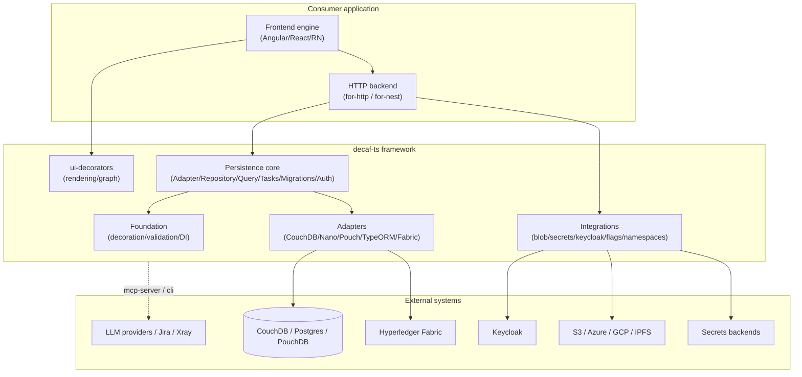

# 00 — Overview

## What decaf-ts is

decaf-ts is a **model-driven, decorator-first TypeScript application framework**
that spans the full stack — from in-process persistence and a transport-agnostic
HTTP layer, through a metadata-driven UI rendering engine, to per-framework
frontend engines (Angular, React, React Native) and operational tooling
including an MCP server. Its defining idea is that a single decorated `Model`
class is the source of truth for validation, persistence, serialization,
hashing, and UI rendering: write the model once, and every layer consumes the
same reflection metadata rather than re-declaring schemas per concern.

The framework is published as a family of small, single-purpose npm packages
under the `@decaf-ts` scope, composed into a layered dependency stack (see
[Layer architecture](./01-layer-architecture.md)). It targets
enterprise-grade applications — multi-tenant authorization, transactions,
migrations, webhooks, secrets, and feature flags are first-class — while
remaining usable as a lightweight in-memory stack via the built-in RAM and
filesystem adapters.

## Design philosophy

- **One model, many concerns.** A decorated model declares its fields, validation
  rules, persistence mapping, relations, and UI hints once. Each layer reads the
  metadata it needs through a shared `Metadata` store. This is the central
  trade-off: higher upfront coupling to a reflection model in exchange for no
  duplicated schemas and consistent behaviour across layers.
- **Behaviour lives in adapters, contracts live in core.** `core` defines the
  abstract contract (`Adapter`/`Context`/`Dispatch`/`Sequence`/`Statement`/
  `Paginator`/`Repository`); each `for-*` package supplies a concrete
  implementation for one storage technology. Swapping CouchDB for TypeORM (or
  Hyperledger Fabric) means swapping one adapter flavour, not rewriting models.
- **Flavours, not subclasses, for cross-cutting metadata.** The `Decoration`
  builder is flavour-aware: an adapter registers a flavour, models declare
  `@uses(flavour)`, and decorator metadata is resolved/overridden per flavour.
  This lets `for-typeorm` re-route decaf decorators into TypeORM's own metadata
  without subclassing the model.
- **Self-registration at import, protected from tree-shaking.** Packages call
  `Metadata.registerLibrary` and augment `Metadata`/`Model`/`ModelBuilder`
  through `declare module` overrides plus runtime monkey-patching. `sideEffects`
  is declared deliberately (where it is correct) so this load-time registration
  survives bundlers.
- **Dependency injection by decorator.** `injectable-decorators` provides a
  singleton/on-demand container keyed by `Symbol.for(...)`, with `@inject`
  property injection. The core replaces the default registry so a model resolves
  to its repository automatically.
- **Never versioned documentation.** This handbook and the Design Specification
  are kept current in place; they are not dated snapshots.

## System context

decaf-ts is a framework, not a single deployed system, so its "context" is the
set of external technologies and boundaries its packages integrate with.

Trust boundaries: the adapter is the boundary to a data store; the HTTP
`AuthHandler` is the boundary to an identity provider; the integrations'
secret/blob providers are the boundary to cloud backends. Inside the framework,
models carry authorization metadata (`@allowIf`/`@blockIf`, `@createdBy`/
`@updatedBy`) that the persistence and HTTP layers enforce.

## The three bundled distributions

decaf-ts ships as one scope with three logical distributions a consumer
composes from:

1. **Persistence distribution** — `decoration` + `decorator-validation` +
   `injectable-decorators` + `db-decorators` + `transactional-decorators` +
   `core` + one or more `for-*` adapters. Use this for any service that
   persists models, with or without an HTTP surface. The RAM and filesystem
   adapters make it runnable with zero external infrastructure.
2. **Backend distribution** — the persistence distribution plus `for-http`
   (REST adapters, server controllers, webhooks, SSE events) and, optionally,
   `for-nest` (NestJS module bootstrapping, request pipeline, auth, controller
   generation from models). Use this to expose models as a REST API.
3. **Full-stack distribution** — the backend distribution plus `ui-decorators`
   (model-driven rendering, graph workflows, user-requests), a frontend engine
   (`for-angular`, `for-react`, or `for-react-native`), `styles`, and the
   `integrations` cloud glue. Use this to build a model-driven application end
   to end, as the `web-page` and `demo` apps demonstrate.

Tooling (`utils`, `cli`, `mcp-server`, `with-ai`, reusable actions, templates)
is cross-cutting and supports all three distributions rather than belonging to
any one of them.

## Key objectives and technology summary

| Attribute | Description |
|---|---|
| Platform type | TypeScript application framework (monorepo of scoped npm packages) |
| Primary technologies | TypeScript, `reflect-metadata`, Axios, NestJS, Angular/Ionic, React, React Native, TypeORM, PouchDB/CouchDB, Hyperledger Fabric SDK |
| Core capabilities | Model-driven validation/persistence/rendering; flavour-based adapter swap; transactions; migrations; task engine; auth/identity; webhooks; SSE; feature flags; multi-tenant namespaces; blob/secrets; graph workflows; MCP tooling |
| Deployment models | Consumer applications (decaf-ts is a library); reference apps run as Angular/Ionic SPAs or Node/Nest services; local dev via RAM/FS adapters |
| Integration interfaces | REST (for-http/for-nest), database drivers (CouchDB/Nano/Pouch/TypeORM), blockchain (Fabric), identity (Keycloak), cloud blob/secrets, MCP (stdio) |
| Data zones | Per-adapter store; multi-tenant segregation via `namespaces` (tenant/org-unit/role/permission/resource); Fabric private-data collections |

## Where to go next

- For how the packages stack and depend on each other: [Layer architecture](./01-layer-architecture.md).
- For the reflection/validation/DI bedrock: [Foundation](./02-foundation.md).
- For the persistence contract and runtime: [Persistence core](./03-persistence-core.md).
- For the technical design (entity relationships, functional requirements,
  environment, E2E): the [Design Specification](../design-specification/README.md).
