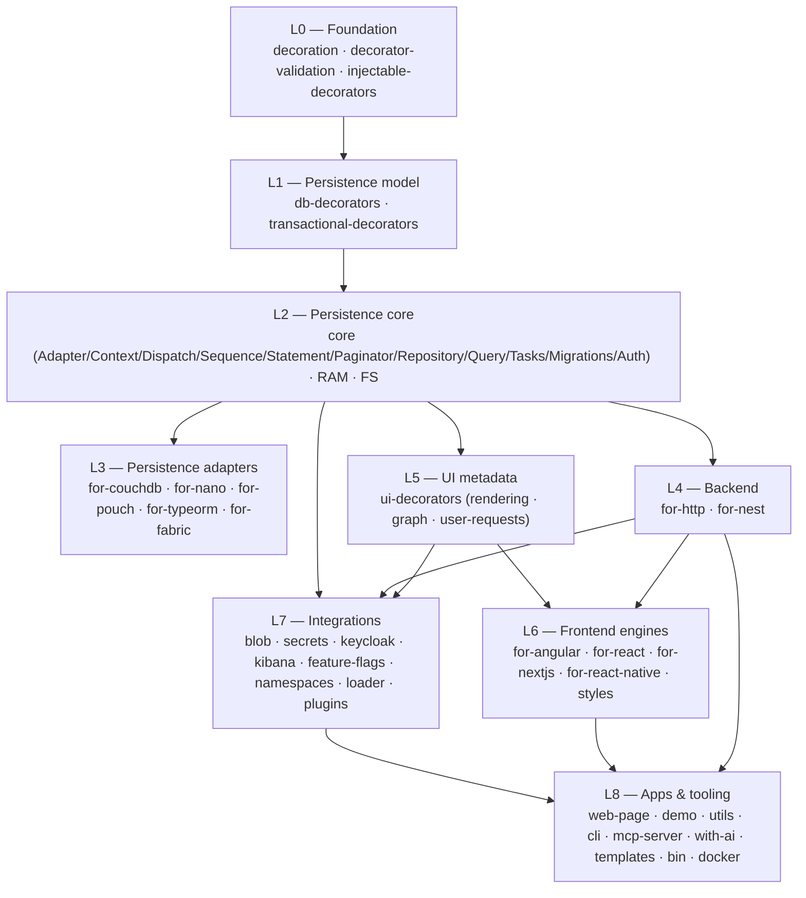

# 01 — Layer Architecture

decaf-ts is a strict, upward-only dependency stack. Lower layers know nothing
about higher layers; higher layers depend downward on the contracts below. This
section lays out the layers, the dependency edges, and *why* the stack is shaped
this way.

## The layers

> `logging` and `crypto` are cross-cutting: `logging` sits just above foundation
> (consumed by `db-decorators`, `core`, and most layers for context loggers);
> `crypto` builds on `db-decorators` lifecycle hooks and is consumed by the
> `integrations` secrets subsystem. See [Cross-cutting concerns](./11-cross-cutting-concerns.md).

## Dependency edges (what depends on what)

| Layer | Packages | Depends on |
|---|---|---|
| L0 Foundation | `decoration`, `decorator-validation`, `injectable-decorators` | `reflect-metadata`; `decoration` only. (`injectable-decorators` imports `decorator-validation` at runtime but mis-classifies it as a devDep — recorded inaccuracy.) |
| L1 Persistence model | `db-decorators`, `transactional-decorators` | L0 + `logging`. `transactional-decorators` depends on `db-decorators`. |
| L2 Persistence core | `core` (incl. `./ram`, `./fs` subpaths) | L1 + L0; replaces the global `Injectables` registry and monkey-patches `Decoration.flavourResolver`. |
| L3 Adapters | `for-couchdb`, `for-nano`, `for-pouch`, `for-typeorm`, `for-fabric` | L2 (+ L0/L1). `for-fabric` extends `CouchDBAdapter` to reuse Mango query. |
| L4 Backend | `for-http`, `for-nest` | L2 (+ L0/L1). `for-nest` depends on `for-http` (server controllers, auth handlers). |
| L5 UI metadata | `ui-decorators` | L0 + L1 (`db-decorators` for operation keys/errors); `user-requests` also uses `core` (`Service`/`Context`). |
| L6 Frontend engines | `for-angular`, `for-react`, `for-nextjs`, `for-react-native`, `styles` | L5 + L0/L1; `for-angular`/`for-react` also consume L4 (`for-http` Axios adapter). `styles` is pure CSS (no JS deps). |
| L7 Integrations | `integrations` (blob/secrets/keycloak/kibana/feature-flags/namespaces/loader/plugins/docker/nest) | L2 (+ L1) and `crypto`; `nest` auth integrates with L4. The graph *execution* engine lives here (`integrations/graph`), separate from the `ui-decorators` graph *metadata*. |
| L8 Apps & tooling | `web-page`, `demo`, `utils`, `cli`, `mcp-server`, `with-ai`, reusable-actions, templates, `bin`, `docker` | Compose the layers above. `utils` is a near-leaf (depends on `logging`); `cli` composes `utils`; `mcp-server` is a leaf app. |

## Why the stack is shaped this way

### Contracts in core, behaviour in adapters (L2/L3 split)
`core` owns the abstract `Adapter`/`Context`/`Dispatch`/`Sequence`/`Statement`/
`Paginator`/`Repository` contract and the generic `RamAdapter`/`FilesystemAdapter`
runtimes. Every `for-*` adapter implements that contract for one storage
technology. The benefit: a model and its repository code do not change when the
database changes — only the adapter flavour does. The cost: the contract must
be general enough to span document stores, relational stores, and a blockchain
ledger, which is why `Statement`/`Paginator` are abstract and adapters extend
them (Mango, SQL, Fabric contract statements).

### Connection state vs per-operation state (Adapter/Context split)
`Adapter` holds long-lived connection/config state; `Context` holds per-operation
flags and the transactional lock. Splitting them lets a single adapter serve
many concurrent operations with isolated contexts, and lets `ContextLock`
coordinate transactions without coupling the connection lifecycle to a request.

### Flavours instead of subclassing for metadata
Rather than subclass a model per database, decaf uses flavour-aware decoration:
an adapter registers a flavour string, a model declares `@uses(flavour)`, and
`Decoration.flavouredAs(flavour).for(...)` resolves/overrides decorator
metadata per flavour. `for-typeorm` uses this to re-route decaf decorators into
TypeORM's own metadata via `overrides/`. The trade-off is a global, mutable
flavour resolver (monkey-patched by `core`) — powerful, but it means import
order and `sideEffects` matter.

### A task engine inside the persistence layer
The task engine (`TaskEngine`, `@task`, workers) lives in `core` because tasks
are persisted as models and executed against adapters — the same persistence
contract as any other model. This keeps long-running, retryable, leased work
first-class rather than bolted on, at the cost of coupling scheduling semantics
to the persistence layer.

### UI metadata decoupled from any one framework (L5/L6 split)
`ui-decorators` defines the *rendering contract* (`RenderingEngine`, field
definitions, list items, graph metadata) with no framework dependency. Each
frontend engine (L6) implements `RenderingEngine` for one framework. This lets
the same decorated model render in Angular, React, or React Native, and lets
the graph *metadata* (ports/workflows/snapshots) live in L5 while the graph
*execution* engine lives in L7 — they meet only at runtime.

### Integrations as optional cloud glue (L7)
Blob, secrets, Keycloak, Kibana, feature flags, namespaces, and the loader are
optional and subpath-exported so importing `@decaf-ts/integrations` does not
force every cloud SDK into the bundle (the briefs note the blob factory still
eager-loads providers — a recorded inaccuracy). Namespaces (tenant/org-unit/
role/permission/resource authorization) build on the persistence model and are
consumed by the HTTP auth layer.

### Tooling is cross-cutting, not a layer
`utils` (CLI command framework, fs/http helpers, release-chain, test reporting)
underpins `cli`, the build scripts, and the MCP server but is not part of the
runtime stack an application depends on. The MCP server exposes decaf-ts
tooling (and Jira/Xray/agent integration) over the Model Context Protocol.

## Coupling notes and known friction

- **Global mutable state**: the flavour resolver, the `Injectables` registry,
  and `Metadata`/`Model`/`ModelBuilder` overrides are global. Import order and
  `sideEffects` declarations are load-bearing; several packages mis-declare
  `sideEffects: false` despite load-time registration (recorded inaccuracies).
- **Two `@transactional` decorators**: one in `transactional-decorators`
  (`SynchronousLock`) and one in `core` (`ContextLock`); they are not
  interchangeable and consumers must import from `core`. This is documented as a
  divergence to fix, not a design intent.
- **Graph is split across three layers**: metadata in `ui-decorators` (L5),
  execution in `integrations/graph` (L7), and the in-browser editor in
  `for-angular` (L6, in-repo and not published). The boundaries are deliberate
  but make the full graph story hard to follow without this map.

## Where to go next

Each layer has its own chapter with the real public API, patterns, flows, and
usage examples: [Foundation](./02-foundation.md),
[Persistence core](./03-persistence-core.md),
[Persistence adapters](./04-persistence-adapters.md),
[HTTP backend](./05-http-backend.md), [UI layer](./06-ui-layer.md),
[Integrations](./07-integrations.md), [Frontend engines](./08-frontend-engines.md),
[Tooling & infrastructure](./09-tooling-infra.md),
[Apps & demos](./10-apps-demos.md).
