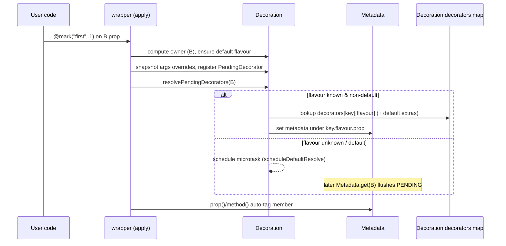
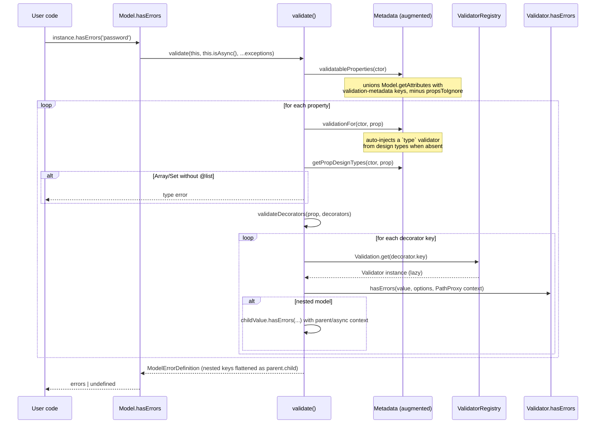
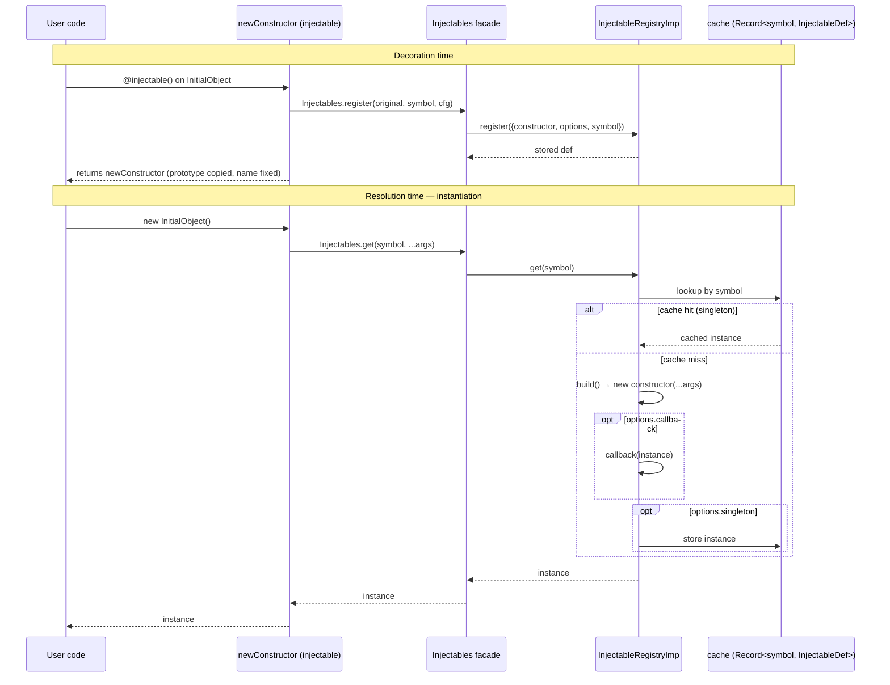
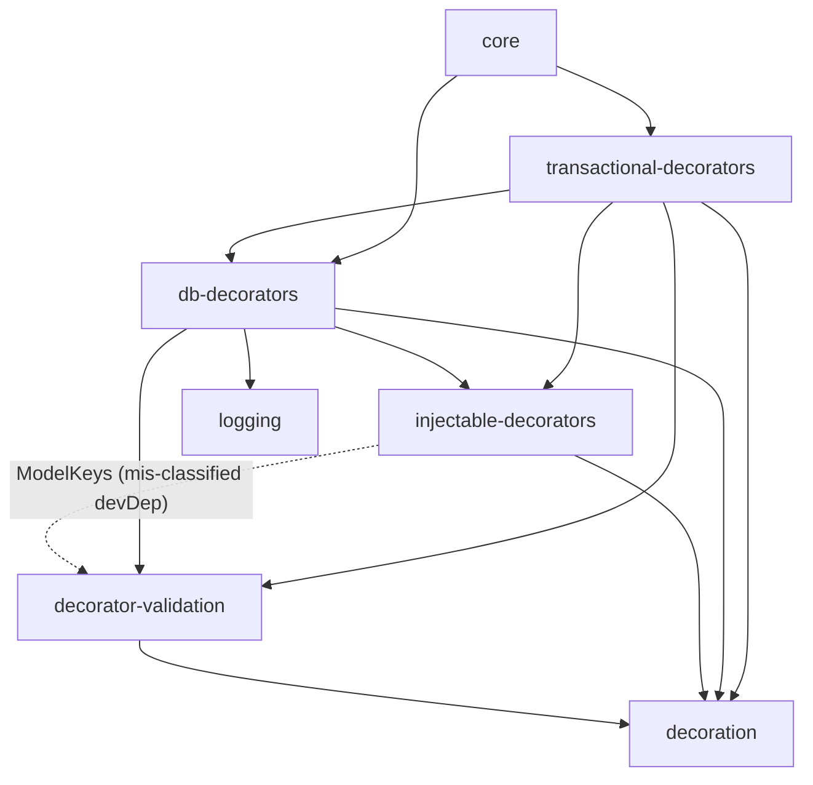

# Foundation Layer

This chapter covers the lowest decorator/metadata layer of decaf-ts: the
`decoration` package (reflection metadata + flavour-aware decoration), the
`decorator-validation` package (decorator-driven validation and the `Model`
base class), and the `injectable-decorators` package (singleton dependency
injection). Everything higher in the stack — `db-decorators`,
`transactional-decorators`, `core`, and the driver/HTTP/graph modules — is
built on these three. The rationale for the layering is the recurring theme of
this chapter: keep reflection and metadata self-registration in one leaf
module so that validation, DI, persistence, and transactions can each be
expressed purely as decorators that *register themselves* against that shared
metadata store.

> Scope note. This chapter is grounded in the per-module research brief at
> `workdocs/ai/project/technical-docs/_research-briefs/01-foundation.md`.
> Where the brief is thin or self-contradictory, the text says so explicitly
> rather than inventing APIs. The brief also reviews `db-decorators` and
> `transactional-decorators`; those are summarised here only as *consumers* of
> the foundation (see [Relationships](#relationships)) and documented fully in
> their own chapters.

---

## 1. Overview and layering rationale

The foundation layer is a three-step ladder. Each rung is intentionally
separate so that the concern below is not leaked into the concern above:

| Rung | Package | Owns | Why it is separate |
|------|---------|------|--------------------|
| 1 | `@decaf-ts/decoration` | A runtime `Metadata` store keyed by constructor symbols, and a flavour-aware `Decoration` builder/registry. | Reflection and metadata *registration* is a single, dependency-free primitive. Every higher decorator module needs it; none should reimplement it. Isolating it means there is exactly one place where `reflect-metadata` is consumed and exactly one place where the "which flavour wins?" rule is decided. |
| 2 | `@decaf-ts/decorator-validation` | A decorator-driven validation engine, a `Validator` registry, and a `Model` base class with validation/(de)serialization/hashing/equality. | Validation is a distinct concern from reflection: the same metadata store can host validation rules, UI hints, or DB column metadata. Putting validation in its own package keeps the rule set, the `Validator` classes, and the `Model` lifecycle together but *out* of the reflection core, so non-model use of `decoration` (e.g. DI) is not forced to pull validation in. |
| 3 | `@decaf-ts/injectable-decorators` | Singleton/on-demand DI: `@injectable`/`@singleton`/`@onDemand` class decorators, `@inject` property decorator, and an `Injectables` facade over a swappable registry. | DI is orthogonal to validation: a class can be injectable without being a `Model`, and a `Model` need not be injectable. A dedicated, tiny DI container keeps the contract explicit and avoids the "everything is a service" coupling that comes from bolting DI onto the model base class. |

The seam between rungs is **self-registration against `Metadata` and
`Decoration`**. Each higher package registers its decorators via
`Decoration.for(key).define(...).apply()` and stores/retrieves its metadata via
`Metadata.get`/`Metadata.set`, so the lower package never has to know about the
higher one. This is also why the foundation is the natural place for the
**cross-cutting concerns** of metadata self-registration (and, transitively,
logging and the `as-zod` bridge, which read this metadata) — see
[Cross-cutting concerns](#cross-cutting-concerns).

```mermaid
graph TD
  subgraph "Foundation (this chapter)"
    DECO["@decaf-ts/decoration<br/>Metadata + Decoration + flavours"]
    VAL["@decaf-ts/decorator-validation<br/>Validator registry + Model"]
    INJ["@decaf-ts/injectable-decorators<br/>Injectables DI container"]
  end
  subgraph "Higher layers (documented elsewhere)"
    DB["@decaf-ts/db-decorators"]
    TX["@decaf-ts/transactional-decorators"]
    CORE["@decaf-ts/core"]
  end
  VAL -->|Metadata/Decoration/apply| DECO
  INJ -->|Metadata/Decoration/apply| DECO
  INJ -.->|ModelKeys at runtime<br/>(mis-classified devDep)| VAL
  DB --> VAL
  DB --> DECO
  DB --> INJ
  TX --> DB
  TX --> VAL
  TX --> DECO
  TX --> INJ
  CORE --> TX
  CORE --> DB
```

Note the dotted edge: `injectable-decorators` imports `ModelKeys` from
`decorator-validation` at runtime but declares that package as a
`devDependency`. This is a dependency-classification defect (recorded in
[Inaccuracies](#inaccuracies)); conceptually DI should not depend on validation.

---

## 2. `@decaf-ts/decoration` — reflection and flavour-aware decoration

### 2.1 Identity and purpose

`decoration` is the leaf of the stack: it has no `@decaf-ts/*` runtime
dependencies and a single third-party runtime dependency (`reflect-metadata`).
It provides two complementary, low-level capabilities that everything else is
built on:

1. **A centralised runtime `Metadata` store** keyed by constructor symbols,
   backed by `reflect-metadata` for design-time type hints
   (`design:type`, `design:paramtypes`, `design:returntype`). This is the
   single place where decaf-ts reads and writes reflective metadata.
2. **A flavour-aware `Decoration` builder/registry** that lets the *same
   semantic decorator key* resolve to *different concrete decorators per
   flavour* (e.g. per framework or per DB driver) at runtime. Flavours are the
   integration seam between the foundation and concrete driver modules.

The package is ESM-first, dual CJS/ESM, MIT-licensed, and targets
`node>=20` / `npm>=10`.

### 2.2 Why metadata-as-decoration

The deliberate design choice is that **metadata is not read directly off
`reflect-metadata` by consumers**; instead, `reflect-metadata` is wrapped by
the `Metadata` static store, which adds:

- **Nested-path access** via `getValueBySplitter`/`setValueBySplitter` using
  `ObjectKeySplitter` (`"."`), so a decorator can write
  `Metadata.set(ctor, Metadata.key("mark", "prop"), value)` and later read it
  back without each caller reimplementing path logic.
- **Constructor-chain inheritance merging**: `collectConstructorChain` walks
  the prototype chain and `mergeMetadataChain` deep-merges with child
  precedence, so subclass decorators inherit and override parent metadata
  predictably.
- **Mirroring**: when `Metadata.mirror` (default `true`) the metadata object is
  also exposed on the constructor as a non-enumerable, non-configurable,
  non-writable property under `DecorationKeys.REFLECT` (`__decaf`), giving
  consumers a plain-property handle to the metadata for debugging or external
  tooling.
- **Library self-registration**: `Metadata.registerLibrary(name, version)`
  records which decaf packages are loaded, and the package calls it for itself
  at module load.

Wrapping reflection this way means the *whole stack* has one metadata model,
one inheritance rule, and one "is this constructor decorated?" check, rather
than each module re-deriving it from raw `reflect-metadata` symbols.

### 2.3 Why flavours

A "flavour" is a string tag (`DefaultFlavour = "decaf"`) attached to a class
via the `@uses(flavour)` class decorator. The `Decoration` builder registers
concrete decorators per `(key, flavour)` in a static
`Decoration.decorators` map. At application time `Decoration.flavourResolver(target)`
picks a flavour; if the resolved flavour has overrides they replace the base,
otherwise the default-flavour base is used, and `extras` from the default
and/or resolved flavour are appended.

This solves a concrete problem: the *same* `@id` or `@required` decorator
should mean different things to, say, a SQL driver and a document driver.
Rather than subclassing decorators or branching inside them, the foundation
lets each driver register flavour-specific overrides, and consumers tag their
models with `@uses("sql")` / `@uses("doc")`. The decorator call site stays
unchanged; the resolution is data-driven.

### 2.4 Public API surface

The barrel (`src/index.ts`) re-exports four groups. Only these are documented;
nothing else should be assumed to exist.

| Group | Key symbols |
|-------|-------------|
| **Metadata store** | `Metadata` (static: `get`/`set`, `properties`, `methods`, `type`, `params`/`param`, `return`, `description`, `constr`, `flavourOf`, `flavouredAs`, `registeredFlavour`, `registerLibrary`, `libraries`, `key`, `Symbol`; configurable `splitter`/`baseKey`/`mirror`/`allowReregistration`); `getValueBySplitter`, `setValueBySplitter`; types `BasicMetadata`, `Constructor` |
| **Decoration builder** | `Decoration` (instance `for`/`define`/`extend`/`apply`; static `for`, `flavouredAs`, `setResolver`, `defaultFlavour`); `assignFlavour`; `resolveFlavour`, `registerFlavourResolver`, `registerPendingResolver`, `resolvePendingDecorators`; builder-stage interfaces `IDecorationBuilder`, `DecorationBuilderStart/Mid/End/Build`, `FlavourResolver`; types `DecoratorTypes`, `DecoratorFactory`, `DecoratorFactoryArgs`, `DecoratorData`, `ExtendDecoratorData` |
| **Decorator utilities** | `metadata`, `metadataArray`, `prop`, `method`, `param`, `paramMetadata`, `propMetadata`, `methodMetadata`, `apply`, `uses`, `description` |
| **Constants/types** | `DefaultFlavour`, `ObjectKeySplitter`, `DecorationKeys`, `DecorationState`, `DefaultMetadata`, `VERSION`, `COMMIT`, `FULL_VERSION`, `PACKAGE_NAME` |

> Note on the flavour resolver setter. The README/workdocs prose refers to a
> method named `setFlavourResolver`, which does not exist in the public API.
> The actual public method is `Decoration.setResolver`. See
> [Inaccuracies](#inaccuracies).

### 2.5 Architectural patterns

**Builder pattern with staged interfaces.** `Decoration` exposes
`for(key) → define()/extend() → apply()`, modelled by
`DecorationBuilderStart/Mid/End/Build` so the type system enforces call
ordering — you cannot `apply()` without first `define()`-ing, and you cannot
`define()` twice on the same builder. This is what makes the
`Decoration.for(key).define({...}).apply()` idiom ubiquitous and safe across
the stack.

**Deferred / pending decorator resolution.** TypeScript evaluates property and
parameter decorators *before* the class decorator that assigns a flavour. To
bridge this, member decorations are queued in a per-owner
`TargetDecorationState` and resolved lazily — synchronously when a flavour is
already known, or via a microtask (`scheduleDefaultResolve`,
`Promise.resolve().then(...)`) otherwise. Critically, `Metadata.get` *also*
triggers `resolvePendingDecorators` for any `PENDING` constructor in the chain,
so **reads can have resolution side effects**. This is intentional (it keeps
the model consistent) but is a sharp edge for consumers.

**Overridable decorator factories.** The `{ decorator, args }` form
(`DecoratorFactoryArgs`) defers factory invocation so flavour overrides can
re-invoke the factory with the original `args`. Metadata diffs and
property-descriptor snapshots are recorded so entries can be reverted and
re-applied when a flavour changes.

**Global resolver indirection.** `metadataLink.ts` holds module-level
`flavourResolver`/`pendingResolver` function pointers; `Decoration`'s static
initializer registers its implementations into them. This decouples `Metadata`
from `Decoration` to avoid a circular import while still allowing
`Metadata.get`/`Metadata.flavourOf` to trigger resolution.

### 2.6 Lifecycle and configuration

There is no explicit `init()`. Importing the package:

- runs `Metadata.registerLibrary(PACKAGE_NAME, VERSION)` at module load, and
- executes `Decoration`'s `static { … }` block, which registers the flavour and
  pending resolvers.

Configurable knobs (all static, all global):

| Knob | Default | Effect |
|------|---------|--------|
| `Metadata.splitter` | `"."` | Nested-key separator for `getValueBySplitter`/`setValueBySplitter` |
| `Metadata.baseKey` | `DecorationKeys.REFLECT` | Root key under which metadata is stored on a constructor |
| `Metadata.mirror` | `true` | Whether the `__decaf` mirror property is defined on the constructor |
| `Metadata.allowReregistration(value)` | `false` | Whether duplicate `registerLibrary` calls throw |
| `Decoration.defaultFlavour` | `"decaf"` | Mutable static; the flavour used when none is assigned |
| `Decoration.setResolver(fn)` | internal | Replaces the global flavour resolver |

The `VERSION`/`COMMIT`/`FULL_VERSION`/`PACKAGE_NAME` exports are build-time
placeholders (`##VERSION##` etc. in source, replaced during `build:prod`).

### 2.7 Data and control flow

A typical `@decorator` application on a member proceeds as follows:

1. `apply()` returns a `wrapper` that, when applied to a property/method,
   computes the `owner` constructor and ensures a default flavour if none is
   set.
2. It snapshots any factory `args` overrides and registers a
   `PendingDecorator` callback (closing over
   `this.decoratorFactory(key, resolvedFlavour, argsOverride)`).
3. It calls `resolvePendingDecorators(owner)`, which either applies
   immediately (non-default flavour known) or schedules a microtask.
4. It auto-tags the member via `prop()`/`method()`.
5. When `decoratorFactory` runs it looks up
   `Decoration.decorators[key][flavour]` (falling back to the default
   flavour's decorators), collects `extras`, and invokes each decorator in
   sequence — threading class-replacement constructors and method-replacement
   descriptors through.



The `@uses(flavour)` class decorator runs *after* member decorators. It
assigns the flavour in the registry and either resolves pending decorators
immediately (non-default flavour) or marks the owner pending (default flavour).

### 2.8 Minimal usage examples

Flavour-aware property decorator with override and `@uses` (from
`tests/unit/flavour-override.test.ts`):

```ts
import { Decoration, DefaultFlavour, Metadata, uses } from "@decaf-ts/decoration";

const mark = (name: string, num: number) =>
  Decoration.for("TEST").define({
    decorator: (n: string, i: number) => (target: any, key?: string) =>
      Metadata.set(target.constructor, Metadata.key("mark", key!), { n, i }),
    args: [name, num],
  }).apply();

Decoration.flavouredAs("2").for("TEST")
  .define({ decorator: (n: string, i: number) => (t: any, k?: string) =>
    Metadata.set(t.constructor, Metadata.key("mark", k!), "flavour2") })
  .apply();

class A { @mark("first", 1) prop!: string; }
@uses("2") class B { @mark("first", 2) prop!: string; }

Metadata.flavourOf(A); // DefaultFlavour ("decaf")
Metadata.flavourOf(B); // "2"
```

Capturing design types via `@prop`/`@method` (from `tests/unit/methods.test.ts`):

```ts
import { method, Metadata } from "@decaf-ts/decoration";
class MethodClass {
  @method() method(arg1: string): Promise<void> { return Promise.resolve(); }
}
Metadata.params(MethodClass, "method"); // [String]
Metadata.return(MethodClass, "method"); // Promise
```

### 2.9 Consumer notes and trade-offs

- **Global mutable state.** `Decoration.decorators`,
  `Decoration.flavourResolver`, `Decoration.defaultFlavour`,
  `Metadata._metadata`, and the `metadataLink` resolver pointers are global
  singletons. Tests must save and restore them; cross-test contamination is a
  real risk.
- **Lazy resolution side effects.** `Metadata.get` flushes pending decorators
  for `PENDING` constructors, so reading metadata can mutate state.
- **Microtask timing.** When no non-default flavour is resolved, pending
  decorators are flushed on `Promise.resolve().then(...)`. Code that assumes
  decorators have run synchronously after class declaration may need to
  `await`.
- **Mirroring is one-shot.** `Metadata.set` only defines the `__decaf` mirror
  if it is not already owned; later writes mutate the existing bucket in place,
  so mirror consistency relies on bucket object identity being preserved.
- **Duplicate library registration throws** by default; opt out with
  `Metadata.allowReregistration(true)`.
- **`sideEffects: false` is misleading.** `package.json` declares
  `"sideEffects": false` despite load-time `Metadata.registerLibrary` and the
  `Decoration` static initializer. Bundlers that honour `sideEffects: false`
  may drop registration.
- **Maturity.** Stable, small API; the pending-resolution machinery is
  intricate and undertested (microtask path and revert/re-apply on flavour
  change have no dedicated unit tests).

---

## 3. `@decaf-ts/decorator-validation` — decorator-driven validation and `Model`

### 3.1 Identity and purpose

`decorator-validation` is a decorator-driven validation and model framework.
It lets you declare validation rules on class properties via decorators
(`@required`, `@min`, `@pattern`, …), back them with a registry of `Validator`
classes, and provides a `Model` base class with validation, (de)serialization,
hashing, equality/compare, and a model registry for rebuild flows. It depends
*only* on `@decaf-ts/decoration` at runtime and is itself a foundation consumed
by `db-decorators` and `transactional-decorators`.

### 3.2 Why a dedicated validation layer

Validation could in principle be folded into `decoration` as "just more
metadata". The foundation deliberately keeps it separate for three reasons:

1. **Validation carries behaviour, not just metadata.** A `Validator` is a
   class with a `hasErrors(value, options, context)` method, error-message
   templates, comparison-target resolution, and sync/async variants. That
   behaviour does not belong in a reflection leaf.
2. **Validation implies a model lifecycle.** `Model` defines
   `(de)serialization`, `hash`, `equals`, `compare`, and a registry for
   dynamic class rebuilding. These are cohesive with validation (you validate
   the thing you serialize) but not with reflection.
3. **Validation is optional for non-model consumers.** `injectable-decorators`
   and other reflection-only consumers should not be forced to pull in
   validators, serializers, and date utilities. A separate package keeps the
   dependency graph honest — modulo the `ModelKeys` leak noted in
   [Inaccuracies](#inaccuracies).

### 3.3 Architecture

`src/` is organised into subsystems:

- `constants/` — `errors.ts` (`COMPARISON_ERROR_MESSAGES`), `validation.ts`
  (`VALIDATION_PARENT_KEY`, `ASYNC_META_KEY` symbols).
- `validation/` — `Validation.ts` (static registry namespace), `decorators.ts`
  (property-decorator factories), `types.ts`, and `Validators/*` (one file per
  validator, plus `BaseValidator`, `Validator`, `AsyncValidator`,
  `ValidatorRegistry`, `constants.ts` with `ValidationKeys`/
  `DEFAULT_ERROR_MESSAGES`/`DEFAULT_PATTERNS`, `decorators.ts` with the
  `@validator` class decorator, and `utils.ts`).
- `model/` — `Model.ts` (abstract base), `ModelRegistry.ts`
  (`ModelRegistryManager` + `bulkModelRegister`), `Builder.ts`
  (`ModelBuilder`/`AttributeBuilder` for dynamic class synthesis),
  `decorators.ts` (`@model`, `@hashedBy`, `@serializedBy`), `construction.ts`
  (`construct`, `bindModelPrototype`), `validation.ts` (`validate`,
  `validateDecorators`, `validateChildValue`), `ModelErrorDefinition.ts`,
  `constants.ts` (`Primitives`, `ReservedModels`, `jsTypes`), `types.ts`,
  `utils.ts`.
- `overrides/` — `Metadata.ts` (module augmentation declaring extra `Metadata`
  methods) and `overrides.ts` (monkey-patches those methods onto the
  `Metadata` class at import time, e.g. `validationFor`,
  `validatableProperties`, `getPropDesignTypes`, `isModel`, `getAttributes`).
  `src/overrides/index.ts` side-effect-imports `./overrides`.
- `utils/` — `strings.ts` (`sf`/`stringFormat`), `dates.ts`, `DateBuilder.ts`,
  `PathProxy.ts` (`PathProxyEngine` for dot/`../` path resolution used by
  comparison validators), `equality.ts` (`isEqual`), `hashing.ts` (`hashCode`,
  `hashObj`, `Hashing`), `serialization.ts` (`Serialization`),
  `serializers.ts` (`JSONSerializer` + cache seeding), `registry.ts`
  (`IRegistry`, `BuilderRegistry`), `constants.ts` (`ModelKeys`), `types.ts`
  (`Serializer`).
- `types/` — `ConditionalAsync<Async,T>` and `ModelConditionalAsync`
  (deprecated).

### 3.4 Public API surface

Re-exported via the barrel (`src/index.ts`), grouped:

- **Model base class & lifecycle**: `Model` (abstract; `hasErrors`, `equals`,
  `compare`, `serialize`, `hash`, static `build`/`register`/`get`/`fromObject`/
  `fromModel`/`setBuilder`/`setRegistry`/`serialize`/`deserialize`/`isModel`/
  `getAttributes`); `ModelErrorDefinition`; `ModelRegistryManager`,
  `ModelRegistry`, `bulkModelRegister`; `ModelBuilder`/`AttributeBuilder`;
  interfaces `Validatable`, `Serializable`, `Hashable`, `Comparable`,
  `ModelArg`, `ModelConstructor`, `ModelBuilderFunction`, `Comparison`,
  `Builder`.
- **Class decorators**: `model()`, `hashedBy`, `serializedBy`,
  `modelBaseDecorator`, and `validator(...keys)`.
- **Property validator decorators**: `required`, `min`, `max`, `step`,
  `minlength`, `maxlength`, `pattern`, `email`, `url`, `type`, `date`,
  `password`, `list`, `set` (wrapper for `list(...,"Set")`), `option` (enum),
  and the cross-property comparison decorators `eq`, `diff`, `lt`, `lte`, `gt`,
  `gte`. Plus `async()` class flag helper, and low-level
  `validationMetadata`/`innerValidationDecorator`.
- **Validation engine**: `Validation` (static: `setRegistry`, `get`,
  `register`, `key`, `keys`, `registerDecorator`, `decoratorFromKey`);
  `Validator` (sync abstract), `AsyncValidator` (async abstract),
  `BaseValidator`; `ValidatorRegistry` implementing `IValidatorRegistry`;
  `validate`, `validateDecorators`, `validateChildValue`,
  `getChildNestedPropsToIgnore`.
- **Concrete validators**: `RequiredValidator`, `MinValidator`, `MaxValidator`,
  `StepValidator`, `MinLengthValidator`, `MaxLengthValidator`,
  `PatternValidator`, `EmailValidator`, `URLValidator`, `PasswordValidator`,
  `TypeValidator`, `DateValidator`, `ListValidator`, `OptionValidator`,
  `EqualsValidator`, `DiffValidator`, `LessThanValidator`,
  `LessThanOrEqualValidator`, `GreaterThanValidator`,
  `GreaterThanOrEqualValidator`.
- **Constants/utilities**: `ValidationKeys`, `ComparisonValidationKeys`,
  `DEFAULT_ERROR_MESSAGES`, `DEFAULT_PATTERNS`, `MONTH_NAMES`,
  `DAYS_OF_WEEK_NAMES`, `ModelKeys`, `Primitives`, `ReservedModels`, `jsTypes`,
  `COMPARISON_ERROR_MESSAGES`, `VALIDATION_PARENT_KEY`, `ASYNC_META_KEY`;
  utils `sf`/`stringFormat`, `formatDate`/`parseDate`/`dateFromFormat`/
  `bindDateToString`/`isValidDate`/`twoDigitPad`, `DateBuilder` (+ `Dates`,
  `Now`, `Tomorrow`, …), `PathProxyEngine`/`PathProxy`, `isEqual`,
  `hashCode`/`hashObj`/`Hashing`, `Serialization`/`JSONSerializer`/`Serializer`,
  `IRegistry`/`BuilderRegistry`, `ConditionalAsync`, `DefaultSerializationMethod`,
  `DefaultHashingMethod`.
- **Build placeholders**: `VERSION`, `COMMIT`, `FULL_VERSION`, `PACKAGE_NAME`.

> Naming caveat. The exported length decorators are lowercase `minlength`/
> `maxlength` (not `minLength`/`maxLength`), and the comparison decorators are
> `eq`/`diff`/`lt`/`lte`/`gt`/`gte` (long forms like `equals`/`greaterThan`
> exist only as `AttributeBuilder` method names). The README documents the
> long forms; see [Inaccuracies](#inaccuracies).

### 3.5 Architectural patterns

**Decorators via `Decoration.for(key).define(...).apply()`.** Most property
decorators build metadata through `innerValidationDecorator`, which calls
`Validation.registerDecorator(key, dec)` (so the decorator can later be looked
up by key for dynamic building) and stores metadata under reflect key
`` `${ValidationKeys.REFLECT}.${prop}.${key}` `` (i.e. `validation.<prop>.<key>`).

**Validator registry / service locator.** `Validation` is a static namespace
holding a lazily-created `ValidatorRegistry`. Validators self-register at
import time via the `@validator(key)` class decorator, which calls
`Validation.register({validator, validationKey, save:true})`. `Validation.get(key)`
returns the validator instance (lazily instantiating constructor-stored
entries). **First registration wins; duplicate keys are silently ignored.**

**Model base class.** `Model` is abstract with a `protected constructor` and
implements `Validatable`, `Serializable`, `Hashable`, `Comparable`. `@model()`
replaces the constructor: it calls `construct(...)`, `bindModelPrototype(...)`
(injects `Model.prototype` into the prototype chain so non-`extends Model`
classes still gain model utilities), runs the global `ModelBuilderFunction` if
set, and registers the constructor in the `ModelRegistryManager`.

**Validation engine.** `validate(model, async, ...propsToIgnore)` iterates
`Metadata.validatableProperties`, fetches per-prop validation metadata via
`Metadata.validationFor`, enforces that `Array`/`Set`-typed properties carry a
`@list` decorator, runs `validateDecorators` (which calls each validator's
`hasErrors` via `validateDecorator`), recurses into nested models with a
temporary `VALIDATION_PARENT_KEY`/`ASYNC_META_KEY` context, and aggregates
errors into a `ModelErrorDefinition` (nested keys flattened with dot notation).
Sync and async (`Promise.allSettled`) paths are both supported; async
decorators are skipped when `async` is false.

**Comparison validators + PathProxy context.** `eq`/`diff`/`lt`/`lte`/`gt`/
`gte` receive a `PathProxy` accessor (created in `validateDecorator` via
`PathProxyEngine.create`) and resolve the comparison target through
`accessor.getValueFromPath(path)`, supporting dot-notation and `../` parent
traversal.

**Overrides pattern.** Rather than subclassing `Metadata`, the module uses
TypeScript module augmentation (`src/overrides/Metadata.ts`) to declare extra
`Metadata.*` signatures, and `overrides.ts` monkey-patches the implementations
onto the imported `Metadata` class at load time. This is imported for side
effects via `src/overrides/index.ts` and re-exported through the barrel, so any
consumer that loads `@decaf-ts/decorator-validation` transparently gains the
augmented `Metadata.validationFor`/`validatableProperties`/`getPropDesignTypes`/
`isModel`/`isPropertyModel`/`getAttributes`/`modelName`/`allowedTypes` methods.

**Pluggable registries/algorithms.** `Validation.setRegistry`,
`Model.setRegistry`, `Serialization.register`, `Hashing.register` allow
swapping implementations; `@hashedBy`/`@serializedBy` attach per-class
algorithm metadata read by `Model.hash`/`Model.serialize`/`Model.deserialize`.

**Dynamic model building.** `ModelBuilder`/`AttributeBuilder` build classes at
runtime (extending `ObjectAccumulator` from `typed-object-accumulator`),
applying `prop()` and validator decorators to synthesized properties, then
wrapping with `model()`. `ModelBuilder.from(meta, name)` reconstructs a class
from `ExtendedMetadata` (used by deserialization/registry flows and
`Validation.decoratorFromKey` fallback).

> Dependency caveat. `Builder.ts` imports `ObjectAccumulator` from
> `typed-object-accumulator`, but that package is **not** declared in
> `package.json`. It is only present via monorepo hoisting; a standalone
> install of `@decaf-ts/decorator-validation` would fail to load `ModelBuilder`.
> See [Inaccuracies](#inaccuracies).

### 3.6 Lifecycle and configuration

No explicit boot/init. Importing the package side-effect-imports `./validation`
so that all `@validator`-decorated classes register themselves, and runs
`Metadata.registerLibrary(PACKAGE_NAME, VERSION)`.

`package.json` declares a `sideEffects` array covering the ESM/CJS entry,
validation, validation/Validators, validation globs, and overrides files;
tree-shakers must preserve these to keep validator registration and the
`Metadata` monkey-patches.

Defaults:

| Concern | Default |
|---------|---------|
| Serialization method | `"json"` (`DefaultSerializationMethod`) with `JSONSerializer` seeded into `Serialization.cache` |
| Hashing method | `"default"` → `hashObj` |
| Global model builder | `ModelRegistryManager.fromModel` |

Flavours come from `@decaf-ts/decoration`'s `@uses(...)` / `Metadata.flavourOf`,
not from this module. No environment variables are read by library source.

### 3.7 Data and control flow: validation



Key behaviours visible in the diagram:

- `Metadata.validatableProperties` and `Metadata.validationFor` are
  *augmented* methods (overrides pattern), not part of bare `decoration`.
- A `type` validator is auto-injected from design types when one is absent.
- `Array`/`Set`-typed properties without `@list` produce a `type` error.
- Nested model properties recurse with parent/async context symbols set and
  cleaned up.
- Async mode wraps results in `Promise.allSettled`.

### 3.8 Minimal usage example

From `tests/unit/validation.test.ts`:

```typescript
import { model, Model, required, max, min, step, minlength, maxlength,
  pattern, email, url, type, list, option, ModelArg } from "../../src";
import { prop } from "@decaf-ts/decoration";

@model()
class InnerTestModel extends Model { constructor() { super(); } }

@model()
class TestModel extends Model {
  @type([String, Number]) @required() id!: string | number;
  @prop() irrelevant?: string;
  @required() @max(100) @step(5) @min(0) prop1!: number;
  @maxlength(10) @minlength(5) prop2?: string;
  @pattern(/^\w+$/g) prop3?: string;
  @email() prop4?: string;
  @url() prop6?: string;
  @type(InnerTestModel) prop7?: InnerTestModel;
  @type(Array) @list(InnerTestModel) prop8?: InnerTestModel[];
  constructor(model?: ModelArg<TestModel>) { super(model); }
}

const errors = new TestModel({ prop1: 3 }).hasErrors(); // prop1 fails @step(5) and @min(0)
```

Custom validators use `@validator("key")` on a `Validator` subclass plus
`apply(innerValidationDecorator(...), type([String, Number]))` — *not* the
pattern documented in the README (see [Inaccuracies](#inaccuracies)).

### 3.9 Consumer notes and trade-offs

- **Importing has side effects.** Validator self-registration and the
  `Metadata` augmentation run at load; do not rely on tree-shaking the
  validation/overrides subtrees (`package.json` `sideEffects` already marks
  them).
- **Decorator names are short and lowercase.** `minlength`/`maxlength`/`eq`/
  `diff`/`lt`/`lte`/`gt`/`gte`. The README uses long forms that do not exist as
  decorators.
- **`Model` has a `protected` constructor.** Subclasses must declare a
  constructor calling `super(arg)`.
- **`Validator`/`AsyncValidator` have `protected` constructors.** Custom
  validators must extend them and use `@validator(key)` (or
  `Validation.register({validator, validationKey, save})`). Registering a bare
  instance via `Validation.register(new MyValidator())` stores it under key
  `undefined`, and first registration wins so re-registration is a no-op.
- **`Array`/`Set` properties require `@list`** or validation emits a `type`
  error.
- **`@date` redefines the property** with a `WeakMap`-backed getter/setter that
  parses via `parseDate(format, value)` and silently swallows parse errors
  (logs to `console.error`).
- **`JSONSerializer` uses native `JSON.stringify`** (non-deterministic key
  order); explicitly noted as unsuitable for hashing.
- **Maturity.** ~86% statement coverage, ~71% branch coverage; below the
  repo's stated 95% target. Several dead/stale paths exist (see
  [Inaccuracies](#inaccuracies)).

---

## 4. `@decaf-ts/injectable-decorators` — singleton dependency injection

### 4.1 Identity and purpose

`injectable-decorators` is a lightweight dependency-injection layer: TS
decorators to mark classes as injectable (singleton or on-demand) and to
inject dependencies into class properties, backed by a static `Injectables`
facade over a swappable registry. It sits below domain modules (e.g.
`db-decorators`, `transactional-decorators`) as a foundational DI primitive,
and builds on `@decaf-ts/decoration`.

The barrel describes it as "a simple Injectables implementation to create
singleton instances … and easily inject it into other objects."

### 4.2 Why a DI container

A DI container answers a concrete question: where do collaborators come from
in a decorator-heavy stack? Without one, every class either `new`s its
dependencies (coupling to a concrete implementation) or accepts them via a
hand-rolled factory. `injectable-decorators` provides the minimum needed:

- A **registry** keyed by `Symbol.for(...)` so categories are global and
  survive minification if a string/constructor category is passed.
- A **singleton-by-default** lifecycle, with opt-in on-demand instances.
- **Lazy, per-instance property injection** via `@inject`, so an injectable is
  resolved only when first read on a given owning object.

Keeping this in its own package (rather than on `Model`) means a class can be
injectable without being a model, and a model need not be injectable.

### 4.3 Architecture

`src/` contains nine files in three subsystems:

- **Decorators** (`decorators.ts`): `injectable`/`singleton`/`onDemand` class
  decorators and the `inject` property decorator, each split into a
  `*BaseDecorator` implementation wrapped by a
  `Decoration.for(...).define().apply()` facade from `@decaf-ts/decoration`.
- **Container/registry** (`Injectables.ts`, `registry.ts`, `types.ts`): the
  static `Injectables` facade, the `InjectablesRegistry` interface, and the
  default `InjectableRegistryImp` with a `cache: Record<symbol, InjectableDef>`.
- **Reflection glue** (`constants.ts`, `utils.ts`): metadata key constants
  (`InjectablesKeys`, `TypeKey`) and `getInjectKey` prefix helper.
- **Optional `Metadata` extension** (`overrides.ts`, `Metadata.ts`): a runtime
  monkey-patch adding `Metadata.injectables`/`Metadata.injected` plus a TS
  module augmentation. **Neither is wired into the barrel** (see
  [Inaccuracies](#inaccuracies)) — the augmentation is advertised but
  unreachable from the public entry.

### 4.4 Public API surface

The barrel re-exports `constants`, `decorators`, `Injectables`, `registry`,
`types`, `utils`, plus build placeholders `VERSION`/`COMMIT`/`FULL_VERSION`/
`PACKAGE_NAME`. Notable symbols:

| Symbol | Role |
|--------|------|
| `injectable(category?, cfg?)` | Class decorator that registers the class and replaces its constructor with one returning a registry instance. |
| `singleton(category?, cfg?)` / `onDemand(category?, cfg?)` | Convenience wrappers forcing `singleton:true`/`false`. |
| `inject(category?, cfg?)` | Property decorator that lazy-resolves an injectable via a per-instance `WeakMap` getter. |
| `Injectables` | Static facade: `get`, `register`, `build`, `setRegistry`, `reset`, `selectiveReset`. |
| `InjectablesRegistry` (interface), `InjectableRegistryImp` (default impl) | Swappable registry contract and default. |
| `Injectable<T>` type | Registry value type. |
| `InjectableConfig`, `InjectOptions`, `InstanceTransformer`, `InstanceCallback`, `InjectableOptions`, `InjectableDef`, `InjectableMetadata` | Configuration/value types. |
| `InjectablesKeys`, `DefaultInjectablesConfig`, `TypeKey` | Constants. |
| `getInjectKey` | Prefix helper. |

> Unreachable API. `Metadata.injectables`/`Metadata.injected` are declared
> (type augmentation in `src/Metadata.ts`, runtime in `src/overrides.ts`,
> `sideEffects` in `package.json`) but the barrel never imports `./Metadata`
> or `./overrides`, so the patch does not load. Coverage of `overrides.ts` is
> 0%. See [Inaccuracies](#inaccuracies).

### 4.5 Architectural patterns

**Singleton DI container.** `Injectables` is a private-constructor static
class holding an `actingInjectablesRegistry`, lazily defaulted to
`InjectableRegistryImp`. The cache is keyed by `Symbol.for(...)` so categories
are global.

**`@injectable` class decorator.** `injectableBaseDecorator` defines
`InjectableMetadata` (`{class, symbol}`) on both the original and replacement
constructor, builds a `newConstructor` whose body is
`return Injectables.get(symbol, ...args)`, copies the prototype for
`instanceof`, fixes `name`, registers the original constructor, and returns
the new constructor. `metadata(ModelKeys.CONSTRUCTOR, original)(newConstructor)`
links the replacement back to the original for the decoration framework.

**`@inject` property decorator.** `injectBaseDecorator` resolves the
injectable key from an explicit category or
`Metadata.type(lookupConstructor, propertyKey)` (throws if undeterminable),
stores inject metadata, and defines a getter/setter backed by a closure-scoped
`WeakMap`. The getter calls `Injectables.get(name, ...config.args)`, optionally
applies `config.transformer`, and caches per consumer instance — i.e. lazy,
per-instance resolution.

**Registry.** `InjectableRegistryImp.get` normalises string/constructor keys
to symbols, returns cached singletons or calls `build`; `build` instantiates,
caches when `options.singleton`, and runs `options.callback`; `register`
stores `{instance, constructor, options}`.

**Overrides pattern.** `overrides.ts` patches `Metadata` with
`injectables`/`injected` accessors; `Metadata.ts` augments the
`@decaf-ts/decoration` `Metadata` namespace with matching typings. Intended to
be loaded for side effects (`package.json` `sideEffects`) — but, as noted, the
entry never imports it.

### 4.6 Lifecycle and configuration

No boot/init, flavours, or env vars. Configuration is per-decorator via
`InjectableConfig` (`{singleton, callback?}`) and `InjectOptions`
(`{args?, transformer?}`). Defaults: `DefaultInjectablesConfig = { singleton: true }`.

`package.json` declares `sideEffects` for the `overrides` ESM/CJS files so
bundlers preserve the `Metadata` patch — however the entry never imports
`overrides`, so the patch does not actually load. On import of the barrel,
`Metadata.registerLibrary(PACKAGE_NAME, VERSION)` runs.

### 4.7 Data and control flow: DI resolution



Property injection (`@inject`) is a separate, lazy path: `obj.prop` triggers
the getter, which on a `WeakMap` miss calls `Injectables.get(name, ...args)`,
optionally applies `config.transformer`, caches per consumer instance, and
returns. For an on-demand injectable this means the instance is fresh *per
owning object*, not per access.

### 4.8 Minimal usage examples

From `tests/unit/injectables.test.ts`:

```ts
@injectable()
class InitialObject { doSomething() { return 5; } }

class Controller {
  @inject() repo!: InitialObject;
}
const c = new Controller();
expect(c.repo).toEqual(Injectables.get(InitialObject));
```

On-demand with constructor args:

```ts
@onDemand()
class FreshObject2 { constructor(...args: any[]) { /* ... */ } }
class FreshParent2 { @inject({ args: ["a", "b"] }) freshObject!: FreshObject2; }
```

### 4.9 Consumer notes and trade-offs

- **Default lifecycle is singleton.** Use `@onDemand()` or
  `@injectable(category, {singleton:false})` (second-arg form) for fresh
  instances.
  > Caveat: `@injectable({singleton:false})` (config object in the category
  > slot, as the README suggests) is silently forced back to singleton because
  > `Object.assign({singleton:false}, {singleton:true})` overwrites the user's
  > `false`. See [Inaccuracies](#inaccuracies).
- **Property injection is lazy and cached per consumer instance**, so an
  on-demand injectable is fresh per owning object, not per access.
- **Only concrete classes are supported** (no generics).
- **For minified builds**, pass an explicit string/constructor `category` to
  keep symbol keys stable.
- **`Injectables.reset()` clears the registry; `selectiveReset(pattern)` only
  works with the default `InjectableRegistryImp`** (reaches into its private
  `cache` via `any`).
- **`Metadata.injectables`/`Metadata.injected` are advertised but unreachable**
  from the public entry.
- **`@decaf-ts/decorator-validation` is mis-classified as a `devDependency`**
  but is imported at runtime for `ModelKeys`. Consumers installing
  `--omit=dev` will fail to load the module. See [Inaccuracies](#inaccuracies).
- **Maturity.** v1.19.0, but release notes/CHANGELOG only document v0.0.5 and
  the dependency report references v1.9.10 — release notes are stale.

---

## 5. Relationships

The foundation is consumed upward by the rest of the decaf-ts stack. The
arrows below are "depends on" (runtime):



Concrete dependency roles (from the brief):

- **`db-decorators`** builds on `decoration` (reflection, `Decoration.for(...).define(...).apply()`,
  `Metadata`, `propMetadata`, `apply`, `Constructor`) and `decorator-validation`
  (`Model`, `Validation`, `Validator`/`@validator`, `Hashing`, `Serializer`,
  `@model`/`@required`/`@list`/`@type`/`@date`, `ModelErrorDefinition`,
  `ModelBuilder`), which it extends via module augmentation rather than
  subclassing. It uses `@decaf-ts/logging` for context loggers and
  `@decaf-ts/injectable-decorators` (referenced in tests). It exports the
  storage-agnostic contracts (`IRepository`, `CrudOperator`, `BulkCrudOperator`,
  `Contextual`) and the CRUD lifecycle machinery that drivers extend.
- **`transactional-decorators`** consumes `decoration` (metadata + decorator
  framework; this module augments its `Metadata`), `db-decorators` (`DBKeys`,
  `InternalError`, `Repository`, `IRepository`, `NotFoundError`, `DBOperations`,
  `id`/`readonly`/`timestamp` decorators), `decorator-validation` (`Model`,
  `@model`, `@required`, `@minlength`), and `injectable-decorators`
  (`Injectables.reset()` in test setup). It provides the `Transaction` class,
  the `@transactional` method decorator, and lock implementations
  (`Lock`, `MultiLock`, `SynchronousLock`). The README "Related" section pins
  `decaf-ts`, `core`, `decorator-validation`, `db-decorators`, indicating
  `core` is the primary downstream consumer.
- **`core`** is the primary consumer of the foundation + persistence +
  transaction layers, building repository/persistence abstractions on top.

The **flavour mechanism is the integration seam**: downstream modules register
flavour-specific overrides (e.g. for different DB drivers or DI frameworks)
and consumers tag classes with `@uses(flavour)`. The **overrides pattern**
(module augmentation + runtime monkey-patching of `Metadata`/`Model`/`ModelBuilder`)
is how `decorator-validation`, `db-decorators`, and `transactional-decorators`
all extend the foundation's `Metadata` without subclassing it.

---

## 6. Cross-cutting concerns

Several cross-cutting concerns are rooted in the foundation. The
foundation APIs that feed each are noted so a dedicated "Cross-cutting
concerns" chapter can reference them.

### Metadata self-registration

This is the defining cross-cutting mechanism of the stack. Every foundation
package (and every higher package) calls
`Metadata.registerLibrary(PACKAGE_NAME, VERSION)` at module load, and every
decorator package registers its concrete decorators via
`Decoration.for(key).define(...).apply()`, storing metadata under
`Metadata`/`DecorationKeys` tokens.

- **Feeds:** `Metadata.registerLibrary`, `Metadata.libraries`,
  `Decoration.for/define/extend/apply`, `Decoration.decorators`,
  `DecorationKeys`, `Validation.register`/`@validator` (self-registration of
  validators), `Validation.registerDecorator` (key→decorator lookup for
  dynamic building), `Injectables.register` (DI registration).
- **Why it matters for cross-cutting work:** any tool that walks the loaded
  decaf-ts graph (a `as-zod` bridge, a documentation generator, a test
  harness) can discover "what is registered" via `Metadata.libraries` and
  "what decorators apply to this class" via `Metadata.get`/`Metadata.properties`/
  `Metadata.methods` plus the per-package reflect keys (`ValidationKeys.REFLECT`,
  `ModelKeys`, `DBKeys`, `TransactionalKeys`, `InjectablesKeys`). The brief
  does not document a single unified introspection API; consumers must know
  each package's reflect-key namespaces.

### Logging

`decoration` itself does **not** depend on `@decaf-ts/logging`; logging is
introduced at the `db-decorators` layer (`Logging.get()` for context loggers).
`transactional-decorators` lists `@decaf-ts/logging` as a `devDependency`
(`LoggedClass`, `Logging`, `LogLevel`, `getObjectName`, `isBrowser`, `sf`) and
uses it for the `Transaction.log` proxy (a no-op unless `Transaction.debug`
is true). The foundation therefore does not provide a logging API; it is a
cross-cutting concern that *consumes* the foundation's `Metadata` to attach
loggers (e.g. `Metadata.flavourOf` could drive per-flavour logger selection,
though the brief does not document such a pattern).

### Crypto / hashing

`decorator-validation` provides the hashing primitive (`hashObj`/`hashCode`/
`Hashing`), the pluggable `Hashing.register`/`@hashedBy` machinery, and the
explicit warning that `JSONSerializer` is non-deterministic and unsuitable
for hashing. `db-decorators` builds `@hash` and `@id`/`@generated` on top of
this. There is no `@decaf-ts/crypto` dependency at the foundation level in the
brief; the `crypto-security`/`crypto-cli` concerns belong to a separate layer.

### as-zod bridge

The brief for the foundation does not document an `as-zod`/Zod integration.
Conceptually, such a bridge would read `Metadata.validationFor`/
`Metadata.validatableProperties`/`Metadata.getPropDesignTypes` (all augmented
onto `Metadata` by `decorator-validation`'s overrides) and translate them to
Zod schemas. The foundation APIs that would feed an `as-zod` chapter are
therefore: `Metadata.validationFor`, `Metadata.validatableProperties`,
`Metadata.getPropDesignTypes`, `Metadata.type`, `ValidationKeys`,
`Validation.get`/`Validation.decoratorFromKey`, and `Model.getAttributes`. The
brief is thin here — an `as-zod` chapter should be grounded in the
`as-zod`/`as-zod-model-bridge` package briefs, not this one.

### Versioning

`VERSION`/`COMMIT`/`FULL_VERSION`/`PACKAGE_NAME` are exported by every
foundation package as build-time placeholders (`##VERSION##` etc. in source,
replaced during `build:prod`). `Metadata.registerLibrary(PACKAGE_NAME,
VERSION)` records them at load, and `Metadata.libraries` exposes the loaded
set. This is the foundation-level hook for any "what versions are loaded?"
introspection. Note the brief records that committed `lib/` artifacts can lag
the declared `package.json` version (see [Inaccuracies](#inaccuracies)).

---

## 7. Inaccuracies

Recorded verbatim from the brief's own "Inaccuracies found" sections for the
three foundation packages, plus any noted inline above. Format:
`**[<module>]** <area> — <what> | Evidence: <file:line> | Suggested fix:
<short>`. **Nothing is fixed here; this is documentation only.**

### decoration

- **[decoration]** README/workdocs prose — the flavour resolver setter is named `setFlavourResolver`, which does not exist in the public API. | Evidence: `README.md:54` and `workdocs/4-Description.md:16` say "a global flavour resolver (setFlavourResolver) decides…"; the actual public method is `Decoration.setResolver` (`src/decoration/Decoration.ts:1039`, confirmed in `lib/types/decoration/Decoration.d.mts:189`). The only `setFlavourResolver`-like symbol is the internal `registerFlavourResolver` in `src/decoration/metadataLink.ts:18`. | Suggested fix: change prose to "Decoration.setResolver" (the README code example at line 184 already uses the correct name).
- **[decoration]** README/workdocs prose — "Static convenience API backed by a singleton instance" for `Metadata`. | Evidence: `README.md:65`, `workdocs/4-Description.md:27`. `Metadata` has a `private constructor()` (`src/metadata/Metadata.ts:164`) and is never instantiated; all state is in `private static` fields. | Suggested fix: describe it as "a static class with static storage" rather than "backed by a singleton instance".
- **[decoration]** Built artifacts vs package version — committed `lib/` declares `VERSION = "0.18.2"` and `FULL_VERSION = "0.18.2-6404c8a"` while `package.json` is `0.18.3`. | Evidence: `lib/cjs/version.cjs:11,25`, `lib/types/version.d.mts:8,22` vs `package.json:3`. | Suggested fix: rebuild before publish or remove committed `lib/` from version control so shipped artifacts match the declared version.
- **[decoration]** `DefaultMetadata` does not conform to its declared type `BasicMetadata<any>`. | Evidence: `src/constants.ts:70-72` only sets `properties: []` and casts via `as unknown as BasicMetadata<any>`; `BasicMetadata` requires `flavour: string`, `[DecorationKeys.CLASS]`, `[DecorationKeys.PROPERTIES]`, and `[DecorationKeys.METHODS]` (`src/metadata/types.ts:15-37`). The cast hides the missing fields. | Suggested fix: either make `BasicMetadata` fields optional or populate `DefaultMetadata` with all required keys.
- **[decoration]** `Decoration` class JSDoc example is incomplete/misleading. | Evidence: `src/decoration/Decoration.ts:281-295` shows `new Decoration().for('component').define(customComponentDecorator)` then `@componentDecorator class MyComponent {}` without ever calling `.apply()` — `define()` returns a builder, not a decorator, so `componentDecorator` would be a builder instance, not a usable decorator. | Suggested fix: add `.apply()` to each builder chain in the example.
- **[decoration]** Stale generated reports in `workdocs/reports/`. | Evidence: `workdocs/reports/DEPENDENCIES.md:7` references `@decaf-ts/decoration@0.8.7`; `workdocs/reports/RELEASE_NOTES.md:1` references "v0.0.5"; neither matches the current `0.18.3`. | Suggested fix: regenerate reports (`npm run coverage` / release-notes) or remove stale reports from the tree.
- **[decoration]** README cosmetic "5.5 KB kb gzipped". | Evidence: `README.md:36`. Double unit ("KB kb"). | Suggested fix: "5.5 KB gzipped".
- **[decoration]** `package.json` declares `"sideEffects": false` (`package.json:104`) but the module has load-time side effects: `Metadata.registerLibrary(PACKAGE_NAME, VERSION)` runs at import (`src/metadata/Metadata.ts:638`) and `Decoration`'s `static { … }` block registers global resolvers (`src/decoration/Decoration.ts:340-345`). | Evidence: as cited. | Suggested fix: set `"sideEffects": ["./lib/esm/metadata/Metadata.js"]` (or list the side-effectful entry) to prevent bundlers from dropping registration.

### decorator-validation

- **[decorator-validation]** README/decorator naming — The README lists `@minLength`, `@maxLength`, `@equals`, `@greaterThan`, `@greaterThanOrEqual`, `@lessThan`, `@lessThanOrEqual` and imports `minLength`, but the actual exported decorators are `minlength`, `maxlength`, `eq`, `gt`, `gte`, `lt`, `lte` (`src/validation/decorators.ts:221,250,622,654,685,716,747,778`). | Evidence: `README.md:23,34` vs `src/validation/decorators.ts:221`. | Suggested fix: Replace README examples with `minlength`/`maxlength`/`eq`/`gt`/`gte`/`lt`/`lte`.
- **[decorator-validation]** `Model.ANCHOR` does not exist — README's `Model.build({ [Model.ANCHOR]: 'User', ... })` references a static that is not defined on `Model`; the anchor constant lives on `ModelKeys.ANCHOR` (`"__model"`). | Evidence: `README.md:175`; `src/model/Model.ts` has no `ANCHOR` static; `src/utils/constants.ts:25`. | Suggested fix: Use `ModelKeys.ANCHOR` (and re-export it, which is already done).
- **[decorator-validation]** Custom-validator README example is wrong — It calls `super('my-custom-validator', 'Invalid value')` but `Validator`'s constructor signature is `(message, ...acceptedTypes)` (`src/validation/Validators/Validator.ts:50-55`), so the first arg is the message, not a key; it declares `validate(value): boolean` which is not a method (the abstract method is `hasErrors`); it registers via `Validation.register(new MyCustomValidator())` which stores under `undefined` key because instances lack `validationKey`; and it imports `metadata` from the package, but `metadata` is **not** re-exported by the barrel (only imported internally from `@decaf-ts/decoration`). | Evidence: `README.md:186-214`; `src/validation/Validators/Validator.ts:50-55`, `src/validation/Validators/ValidatorRegistry.ts:65-70`; grep shows no `export … metadata` in `src`. | Suggested fix: Replace with the working pattern from `tests/unit/custom-validation.test.ts` (`@validator(key)` + `innerValidationDecorator`), and import `metadata` from `@decaf-ts/decoration`.
- **[decorator-validation]** `DateBuilder` README example does not compile — `new DateBuilder()` is impossible (the constructor is `private` — `src/utils/DateBuilder.ts:102`) and `addDays(5)` does not exist (the chain method is `Days(5)`, with static entry points like `DateBuilder.Days(5)`). | Evidence: `README.md:223` vs `src/utils/DateBuilder.ts:102,212`. | Suggested fix: Use `DateBuilder.Days(5).from(new Date())` or `new DateBuilder()` → `DateBuilder.Days(5).build()` via the static API.
- **[decorator-validation]** Undeclared runtime dependency on `typed-object-accumulator` — `src/model/Builder.ts:3` imports `ObjectAccumulator` from `typed-object-accumulator`, but `package.json` only declares `@decaf-ts/decoration` as a runtime dependency (`package.json:96-98`). The package is only present via monorepo hoisting (`/workspaces/decaf-ts/node_modules/typed-object-accumulator`); a standalone install of `@decaf-ts/decorator-validation` would fail to load `ModelBuilder`. | Evidence: `src/model/Builder.ts:3`; `package.json:96-98`; `npm ls typed-object-accumulator` returns empty. | Suggested fix: Add `typed-object-accumulator` to `dependencies` (or vendor/replace the accumulator).
- **[decorator-validation]** `Serialization.setDefault` / `Hashing.setDefault` are broken — Both assign the resolved instance/function to `this.current` (`serialization.ts:38-40`, `hashing.ts:146-148`), but `serialize`/`hash` without an explicit method call `this.get(this.current)` expecting a string key; with an object key, `key in this.cache` is false and they throw `"No serialization/hashing method registered under [object Object]"`. The `setDefault` parameter inside `register(...)` is correct (sets `this.current = key`), only the public `setDefault(method)` methods are wrong. | Evidence: `src/utils/serialization.ts:28-40`; `src/utils/hashing.ts:141-148`. | Suggested fix: `setDefault(method) { this.current = method; }`.
- **[decorator-validation]** MCP tooling claim is unsubstantiated by source — README states "Optionally expose validation as MCP tools for automation workflows" (`README.md:9`), but `src/` contains no `mcp/` or `ni/` directory and no MCP/`FastMCP` references. The coverage report even lists `src/mcp/ModelContextProtocol.ts` and `src/ni/` (`workdocs/reports/coverage/lcov-report/src/mcp/...`), i.e. the report is stale relative to the current source tree. | Evidence: `README.md:9`; `find src` shows no `mcp`/`ni`; coverage HTML references `src/ni/ModelContextProtocol.ts`. | Suggested fix: Remove the MCP claim from the README or restore the MCP source; regenerate coverage.
- **[decorator-validation]** Dead/misleading branch in `validateDecorator` — The branch `decorator.key === ModelKeys.TYPE` (`src/model/validation.ts:153-162`) never triggers during validation because `decorator.key` is the validation metadata key (`ValidationKeys.TYPE` = `"type"`), while `ModelKeys.TYPE` = `DecorationKeys.DESIGN_TYPE` (e.g. `"design:type"`); the two constants are unequal, so the `TypeValidatorOptions`-shaping branch is dead code and `validatorOptions` always falls through to the whole decorator object. | Evidence: `src/model/validation.ts:153-162`; `src/utils/constants.ts:23`; `src/validation/Validators/constants.ts:63,76`. | Suggested fix: Compare against `ValidationKeys.TYPE` or remove the dead branch.
- **[decorator-validation]** `DEFAULT_PATTERNS` contains a stray `asd` key — `src/validation/Validators/constants.ts:209` defines a `asd` string property holding an escaped URL regex duplicate, unrelated to any validator and not part of the documented `DefaultPatterns`. | Evidence: `src/validation/Validators/constants.ts:209`. | Suggested fix: Remove the `asd` entry.
- **[decorator-validation]** `RequiredValidator` boolean/number branch is unreachable — Inside `case "boolean": case "number":` it tests `typeof value === "undefined"` (`src/validation/Validators/RequiredValidator.ts:84-89`), which can never be true after the `typeof` switch, so `0`/`false` always pass but the "checks if undefined" doc logic is misleading no-op. | Evidence: `src/validation/Validators/RequiredValidator.ts:84-95`. | Suggested fix: Either drop the redundant branch or document that numbers/booleans are always considered present.

### injectable-decorators

- **[injectable-decorators]** Public API — `Metadata.injectables`/`Metadata.injected` are advertised (type augmentation in `src/Metadata.ts:4-17`, runtime in `src/overrides.ts:5-31`, `sideEffects` in `package.json:100-103`) but never reachable: `src/index.ts:12-17` does not re-export or import `./Metadata` or `./overrides`, and the compiled `lib/esm/index.js` / `lib/cjs/index.cjs` / `dist/injectable-decorators.js` contain no `overrides` import (verified). Coverage of `overrides.ts` is 0%. | Evidence: `src/index.ts:10-17`; `package.json:100-103`; coverage report `overrides.ts` 0%. | Suggested fix: add `import "./overrides";` (and `import "./Metadata";` for the augmentation) to `src/index.ts`, or export them.
- **[injectable-decorators]** Decorator behavior — `@injectable({singleton:false})` (config object in the category slot, as the README suggests) is silently forced back to singleton. `injectableBaseDecorator` computes `cfg = cfg || (typeof category === "object" ? Object.assign(category, DefaultInjectablesConfig) : DefaultInjectablesConfig)`; `Object.assign({singleton:false}, {singleton:true})` overwrites the user's `false` with the default `true`. | Evidence: `src/decorators.ts:32-36`; README `README.md:130` ("by passing a configuration object to `@injectable`"). | Suggested fix: `Object.assign({}, DefaultInjectablesConfig, category)` so user values win, or only fill missing keys.
- **[injectable-decorators]** Dependency classification — `@decaf-ts/decorator-validation` is listed as a `devDependency` (`package.json:86`) but is imported at runtime in `src/decorators.ts:12` (`ModelKeys`). Consumers installing `--omit=dev` will fail to load the module. | Evidence: `package.json:85-89` vs `src/decorators.ts:12`. | Suggested fix: move `@decaf-ts/decorator-validation` to `dependencies`.
- **[injectable-decorators]** Type inconsistency — `InjectableOptions<T>` requires `callback: InstanceCallback<T>` (`src/types.ts:24-27`) while `InjectableConfig` makes `callback` optional (`src/decorators.ts:23-26`); `registry.register` is typed against the stricter `InjectableOptions<T>` (`src/registry.ts:46-51`) but receives `Partial<InjectableConfig>` via `Injectables.register` (`src/Injectables.ts:84-89`). | Evidence: `src/types.ts:24-27`, `src/decorators.ts:23-26`, `src/Injectables.ts:84-89`. | Suggested fix: align the two option types (make `callback` optional in `InjectableOptions` or required in `InjectableConfig`).
- **[injectable-decorators]** Dead/undocumented surface — `InjectableRegistryImp.has` (`src/registry.ts:110-113`) is not part of the `InjectablesRegistry` interface, is not used internally, and is untested; `Injectables.selectiveReset` (`src/Injectables.ts:138-146`) reaches into the registry's private `cache` via `any` casts and only functions with the default implementation (also untested, contributing to `Injectables.ts` 62.5% coverage). | Evidence: `src/registry.ts:110-113`, `src/Injectables.ts:138-146`; coverage report. | Suggested fix: add `has` to the interface or remove it; document/contract `selectiveReset`'s dependency on `InjectableRegistryImp` or implement it via a registry method.
- **[injectable-decorators]** Stale web test — `tests/web/test-script.js:1-3` imports from `./bundles/injectable-decorators.esm.js` (directory does not exist) and logs `UpdateValidator`/`ReadOnlyValidator`, which are not exported by this package (they belong to `@decaf-ts/decorator-validation`). | Evidence: `tests/web/test-script.js:1-3`; `ls tests/web/bundles` → not found; `src/index.ts` exports no such symbols. | Suggested fix: delete or rewrite the web smoke test against this module's actual exports.
- **[injectable-decorators]** Doc drift — `workdocs/reports/CHANGELOG.md:3`, `RELEASE_NOTES.md:1`, and `DEPENDENCIES.md:7` reference v0.0.5 / v1.9.10 while the package is v1.19.0; the README header (`README.md:6`) claims "Release docs refreshed on 2025-11-26" yet the reports are unchanged. | Evidence: `workdocs/reports/CHANGELOG.md:3`, `RELEASE_NOTES.md:1`, `DEPENDENCIES.md:7`, `package.json:3`. | Suggested fix: regenerate release notes/CHANGELOG/dependency report during the release pipeline.
- **[injectable-decorators]** JSDoc mismatch — `Injectables.get` JSDoc states the return type is `Injectable<T> | undefined` (`src/Injectables.ts:67`) while the actual signature returns `T | undefined` (`src/Injectables.ts:69-74`); `InjectablesRegistry.get` carries the same doc error (`src/registry.ts:27-28` vs `31-34`). | Evidence: `src/Injectables.ts:61-74`, `src/registry.ts:22-34`. | Suggested fix: correct the `@return` to `T | undefined`.

### Higher-layer inaccuracies referenced from this chapter

The brief also records inaccuracies for `db-decorators` (10) and
`transactional-decorators` (9); those are out of scope for this chapter and
are documented in their respective chapters. Two are surfaced here only
because they directly affect the foundation's *consumers* and are relevant to
cross-cutting concerns:

- The `db-decorators` README imports `id` from `@decaf-ts/decorator-validation`,
  but `id` is exported by `@decaf-ts/db-decorators`, not `decorator-validation`
  — relevant to any reader tracing the foundation's public API surface.
- The `transactional-decorators` README documents a `transactionalSuperCall()`
  utility and a `MultiLock` concurrency-limit API that do not match the
  source — relevant to readers expecting the foundation's DI/lock primitives
  to be reusable as documented.

The full lists are in the brief's `db-decorators` and `transactional-decorators`
sections and should be carried into their chapters verbatim.
