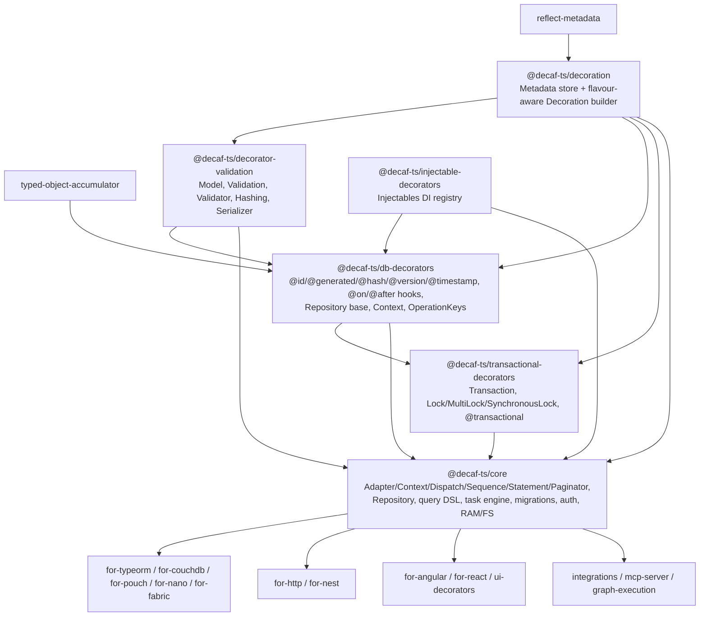
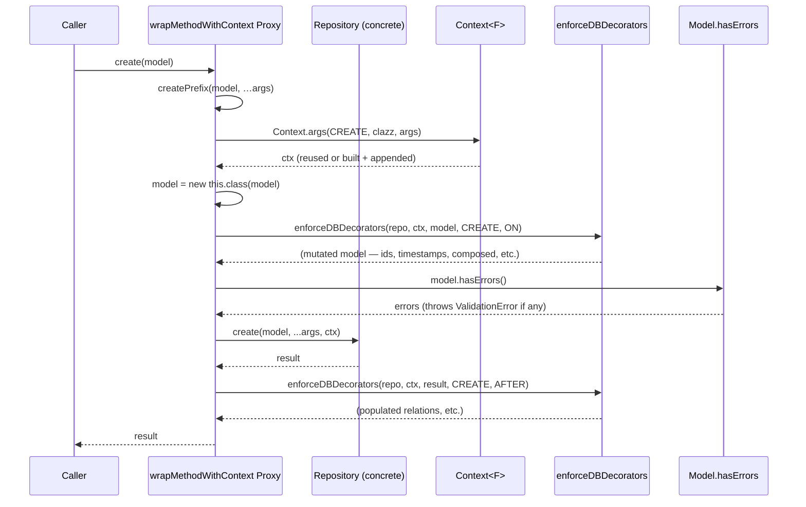
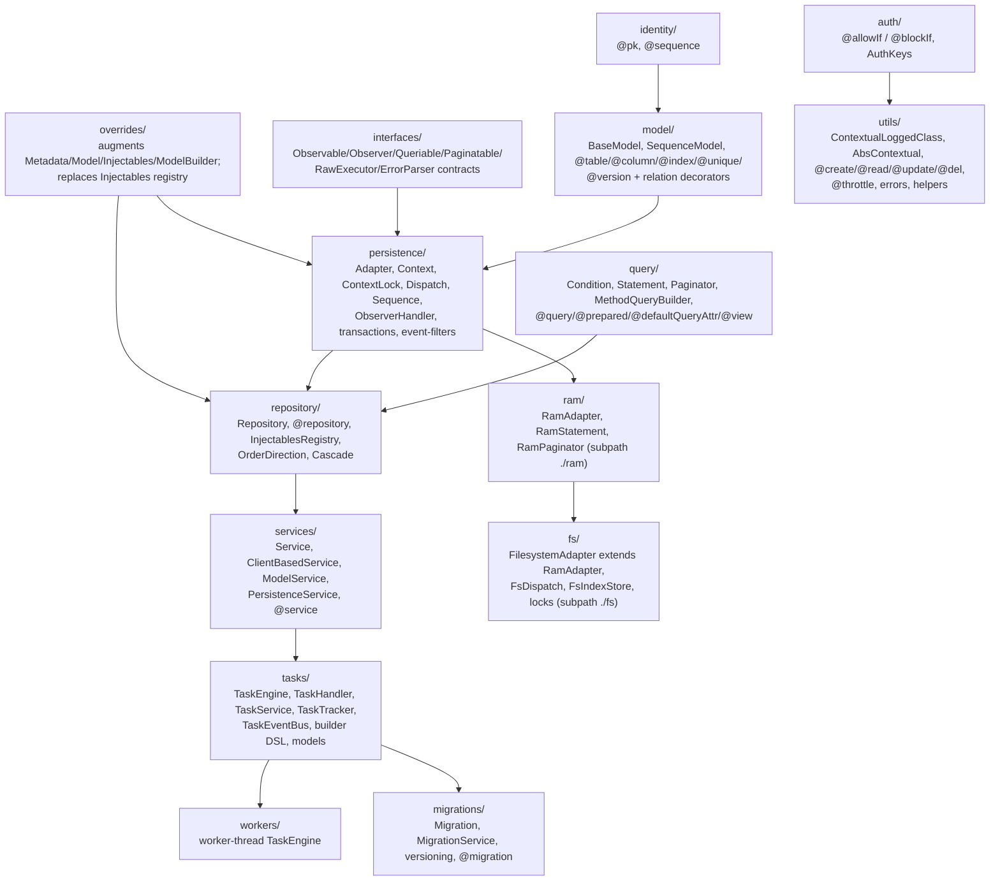
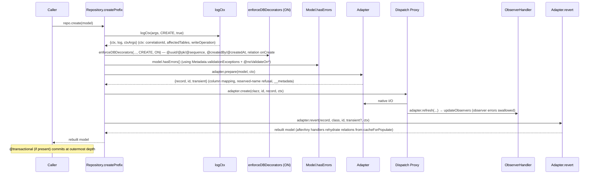
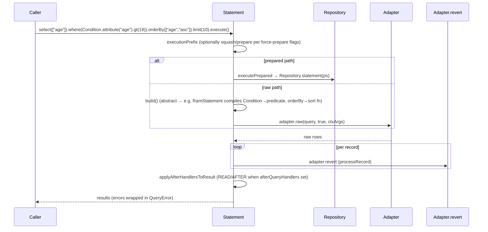
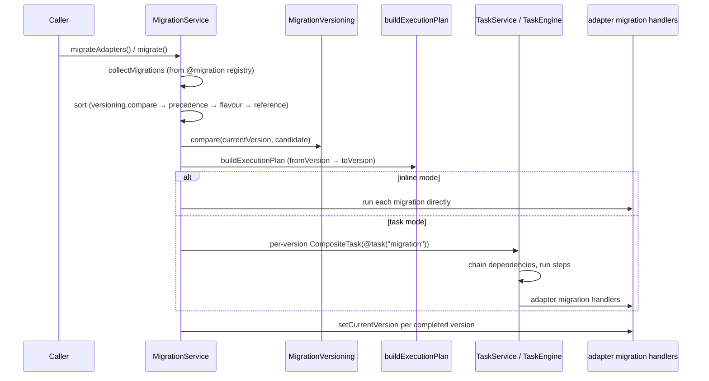

# Persistence Core

> Architecture handbook chapter. Covers the decaf-ts persistence core: the
> `db-decorators` and `transactional-decorators` foundation modules, the
> `@decaf-ts/core` persistence spine (`Adapter` / `Context` / `Dispatch` /
> `Sequence` / `Statement` / `Paginator`), the `Repository` pattern and query
> API, the task engine, migrations, auth, and the built-in RAM/FS runtimes.
>
> Every statement here is grounded in the research briefs
> (`02-core.md`, `01-foundation.md`). Where a brief is thin or where briefs
> disagree, this is stated explicitly rather than papered over. No source or
> test files were modified; nothing was built or run.

## Scope and source briefs

This chapter draws on two research briefs:

- `workdocs/ai/project/technical-docs/_research-briefs/02-core.md` — the
  `@decaf-ts/core` module (the persistence spine, repository, query, tasks,
  migrations, auth, RAM/FS runtimes).
- `workdocs/ai/project/technical-docs/_research-briefs/01-foundation.md` —
  the `db-decorators` and `transactional-decorators` modules that `core`
  consumes and augments.

> Note on inputs: the task brief named `03-libs.md` as covering
> `db-decorators`/`transactional-decorators`, but that file actually covers
> `logging`, `crypto`, and `as-zod`. The dedicated `db-decorators` and
> `transactional-decorators` material lives in `01-foundation.md`, which is
> used here. `03-libs.md` is not a source for this chapter (it is referenced
> only in the cross-cutting note at the end). This mismatch is recorded as an
> inaccuracy below.

## 1. Layering overview

The persistence core is a stack of five packages, each a strict layer over the
one below. `core` is the leaf that every concrete database adapter, the
HTTP/Nest server packages, and the UI packages point at.



The rationale for the split:

- `decoration` owns the reflection store (`Metadata`) and the flavour-aware
  decorator builder (`Decoration.for(key).define(...).apply()`). Everything
  else builds decorators on top of it.
- `decorator-validation` adds the `Model` base class, the validation
  vocabulary, and serializers.
- `db-decorators` adds storage-agnostic persistence semantics — DB model
  decorators (`@id`, `@generated`, `@hash`, `@composed`, `@version`,
  `@timestamp`, `@transient`, `@readonly`, `@serialize`), the operation-hook
  registry (`@on`/`@after` and the CRUD-specific conveniences), and the
  abstract `Repository<M,C>` with its `Context<F>` flag accumulator. It has no
  driver; drivers extend it.
- `transactional-decorators` adds the `Transaction` primitive, the `Lock` /
  `MultiLock` / `SynchronousLock` concurrency primitives, and the
  `@transactional` method decorator. It is consumed upward by `core`.
- `core` is the façade: it turns the abstract `Repository` into a runnable
  persistence layer by introducing the `Adapter` (a real connection), the
  `Context`/`Dispatch`/`Sequence`/`Statement`/`Paginator` spine, a composable
  query DSL, a task engine, migrations, auth guards, and two concrete
  runtimes (RAM, FS).

## 2. db-decorators — persistence decoration and the repository base

### Identity

`@decaf-ts/db-decorators` (`/workspaces/decaf-ts/db-decorators`), described as
"Agnostic database decorators and repository". It sits above
`decorator-validation`/`decoration` and below the driver modules. There is no
dedicated `Model` subclass in this package; instead it augments
`decorator-validation`'s `Model.prototype` and `Model` statics via TypeScript
module augmentation (`declare module`) plus runtime assignment in
`src/overrides/`. Importing the barrel (or `Repository.ts`) is what activates
those overrides.

### Public API surface

| Group | Notable exports |
|---|---|
| Identity | `id()` (composite `required + readonly + id-metadata`) |
| Interfaces | `CrudOperator<M>`, `BulkCrudOperator<M>`, `IRepository<M,C>`, `Contextual<C>`, `FlagsOf` |
| Model decorators | `generated(type?)`, `hash()`, `composed(args, sep?, filterEmpty?, hash?, prefix?, suffix?, groupsort?)`, `composedFromKeys`, `composedFrom`, `version()`, `transient()`; handlers `hashOnCreateUpdate`, `composedFromCreateUpdate`, `versionCreateUpdate`, `composeAttributeValue` |
| Constants | `DBKeys`, `DefaultSeparator`, `DEFAULT_TIMESTAMP_FORMAT` |
| Update validation | `validateCompare`, `validateDecorators`, `validateDecorator`, `getValidatableUpdateProps` |
| Operations | `Operations` (static register/get/key), `OperationsRegistry`; decorators `on`, `after`, `onCreate`, `onUpdate`, `onCreateUpdate`, `onRead`, `onDelete`, `onAny`, `afterCreate`, `afterUpdate`, `afterCreateUpdate`, `afterRead`, `afterDelete`, `afterAny`, `operation`, `BlockOperations`, `BlockOperationIf`; constants `OperationKeys`, `ModelOperations`, `CrudOperations`, `BulkCrudOperationKeys`, `BulkCrudOperations`, `DBOperations` |
| Repository | `Repository<M,C>` (abstract), `Context<F>`, `ContextFactory`, `DefaultContextFactory`, `RepositoryFlags`, `DefaultRepositoryFlags`, `ContextFlags`; wrappers `prefixMethod`, `suffixMethod`, `wrapMethodWithContext`, `wrapMethodWithContextForUpdate`; utils `enforceDBDecorators`, `getDbDecorators`, `reduceErrorsToPrint` |
| Errors | `BaseError`, `BreakError`, `BadRequestError`, `ValidationError`, `InternalError`, `SerializationError`, `NotFoundError`, `ConflictError` |
| Overrides (augmented onto `Model`/`Metadata`/`ModelBuilder`) | `Model.pk`/`pkProps`/`isTransient`/`segregate`/`merge`/`composed`/`generated`/`shouldGenerate`/`versionProp`/`versionOf`/`propSerializedBy`/`hasErrors`; `Metadata.saveOperation`/`readOperation`/`pk`/`isTransient`; `ModelBuilder.generated/hash/composed/composedFromKeys/version/transient` |
| Validation | `UpdateValidator` (abstract), `ReadOnlyValidator`, `TimestampValidator`; decorators `readonly`, `timestamp`, `serialize`; `Validation.updateKey`; `UpdateValidationKeys`, `DEFAULT_ERROR_MESSAGES` |

### Key patterns

**Repository as the lifecycle spine.** `Repository<M,C>` is abstract and
declares `create`/`read`/`update`/`delete`. Its constructor wraps those four
methods with Proxy-based prefix/suffix wrappers (`wrapMethodWithContext` for
create/read/delete, `wrapMethodWithContextForUpdate` for update). Each call
therefore runs `*Prefix` → concrete op → `*Suffix`. The prefix builds a
`Context`, instantiates `new this.class(model)`, runs `enforceDBDecorators(
..., OperationKeys.ON)` (the "before" hooks) and `model.hasErrors()`; the
suffix runs `enforceDBDecorators(..., OperationKeys.AFTER)`. The update prefix
additionally reads the old model when `applyUpdateValidation` is set, merges,
and threads `oldModel` into ON/AFTER handlers and `hasErrors(oldModel)`.

**Context flag accumulator.** `Context<F>` wraps an `ObjectAccumulator`
holding `RepositoryFlags` (logger, timestamp, operation, validation toggles,
parent/child contexts). `Context.args(operation, clazz, args)` pops the last
argument: if it is already a `Context` it is reused, otherwise a new context is
created via `Context.factory` (default `DefaultContextFactory`) and appended.
This is what lets a caller pass an explicit context through a call chain or let
one be created implicitly — the same mechanism `core` later generalises into
its `ContextualLoggedClass.logCtx`.

**Operations registry.** `Operations` (static facade) holds a single
`OperationsRegistry` nested cache keyed by
`[className][propKey][compoundOperation][flavour][handlerName]`. `@on`/`@after`
are the primitives; `onCreate`/`onUpdate`/… are convenience wrappers selecting
`DBOperations` groups. Handlers are resolved through the prototype chain with a
flavour bucket (`Metadata.flavourOf` → `Decoration.defaultFlavour` → first
available), which is what lets a driver flavour override a property hook.

**Update validation.** `Model.hasErrors(oldModel?, …exclusions)` runs normal
validation, then `validateCompare` against the old version: it iterates
validatable update props, deserialises serialized props, enforces `@list` for
`Array`/`Set`, runs `validateDecorators` (looking up `UpdateValidator`s via
`Validation.get`), recurses into nested models, and aggregates
`ModelErrorDefinition`. `ReadOnlyValidator` (deep-equality mismatch) and
`TimestampValidator` (new timestamp must be greater) ship built-in.

### Flow: `repo.create(model)`



### Usage example

From `tests/unit/composed.test.ts`:

```typescript
import { model, Model, ModelArg } from "@decaf-ts/decorator-validation";
import { id, composed, timestamp, DBOperations, readonly } from "@decaf-ts/db-decorators";
import { RamRepository } from "./RamRepository"; // test helper

@model()
class ComposedModel extends Model {
  @id() id!: string;
  @composed(["id", "name"]) composedValue?: string;
  @timestamp() updatedOn!: Date;
  @timestamp(DBOperations.CREATE) @readonly() createdOn!: Date;
  name?: string;
  constructor(arg?: ModelArg<ComposedModel>) { super(arg); }
}

class ComposedRepo extends RamRepository<ComposedModel> {
  constructor() { super(ComposedModel); }
}

const repo = new ComposedRepo();
const created = await repo.create(new ComposedModel({ id: "1", name: "test" }));
// created.composedValue === "1_test"; created.updatedOn / createdOn are Dates
```

### Consumer notes / trade-offs

- **Importing the barrel is required** to register `ReadOnlyValidator` /
  `TimestampValidator` and to apply the `Model`/`Metadata`/`ModelBuilder`
  overrides. Deep-path imports may skip those side effects unless the
  side-effect module is also imported (`package.json` declares `sideEffects`
  for the barrel, `validation/*`, and `overrides/*`).
- **Default bulk operations bypass the bulk prefix/suffix machinery.**
  `createAll`/`readAll`/`updateAll`/`deleteAll` default to
  `Promise.all(models.map(m => this.create(m,…)))`; the `*AllPrefix`/`*AllSuffix`
  hooks (with aggregated validation via `reduceErrorsToPrint`) only fire if a
  subclass overrides the bulk methods to call them.
- **`applyUpdateValidation` defaults to `true`**, so `update` triggers an extra
  `read` to fetch the old model and runs update validators + optimistic-lock
  checks. Set it (or `ignoreValidation`/`ignoreHandlers`) `false` via context
  overrides to skip.
- **Anonymous handler functions** passed to `@on`/`@after` trigger a console
  warning and are deduped by a hash of their source; prefer named functions.
- **`Repository<M,C>` requires both type parameters** (`C` has no default).
  Some unit tests use a single type argument and only pass type-checking
  because `tsconfig.json` `include` is `["src"]` (tests are not compiled by
  `tsc`).

## 3. transactional-decorators — transactions and locks

### Identity

`@decaf-ts/transactional-decorators` (`/workspaces/decaf-ts/transactional-decorators`),
described as "Locking and transactions". It depends on `db-decorators`,
`decoration`, `decorator-validation`, and `injectable-decorators`, and is
consumed upward by `core`. There are no non-decaf runtime dependencies.

### Public API surface

| Group | Notable exports |
|---|---|
| Transaction | `Transaction<R>` — `new Transaction(source, method?, action?, metadata?)`; static `setLock`, `getLock`, `submit`, `release`, `push`, `run` (overloaded), `contextTransaction`; instance `fire`, `wait`, `release`, `getMetadata`, `bindTransaction`, `bindToTransaction`, `toString`; static config `debug` (default `false`), `globalTimeout` (default `-1`) |
| Locks | `Lock` (base mutex: `acquire`/`release`/`execute`, `queue`/`locked`); `MultiLock` (per-name `Lock` registry: `execute(func, name)`/`acquire(name)`/`release(name)`/`lockFor(name)`); `SynchronousLock` (the default `TransactionLock`: concurrency `counter`, `onBegin`/`onEnd` hooks) |
| Interface | `TransactionLock` — `currentTransaction?`, `submit<R>(transaction): Promise<R>`, `release(err?): Promise<void>` |
| Decorator | `transactional(...data)` — method decorator |
| Errors | `TimeoutError` (extends `InternalError`, HTTP 500) |
| Constants / types | `TransactionalKeys` (`TRANSACTIONAL`), `LockCallable` |
| Overrides | `Metadata.transactionals(...)`, `Metadata.isTransactional(...)` |

### Key patterns

**Lock-based concurrency.** `Lock` is a single-writer mutex: `acquire()` either
takes the lock immediately or queues a `LockCallable` resolver; `release()`
shifts the next resolver and dispatches it via `process.nextTick` (Node) or
`setTimeout(_,0)` (browser). `SynchronousLock` wraps a `Lock` to protect its
own state (`currentTransaction`, `counter`, `pendingTransactions`) and
implements `TransactionLock`: on `submit`, if a slot is free (`counter > 0`) it
decrements and fires the transaction; otherwise it queues and returns
`transaction.wait()`. `release` clears the current transaction, calls `onEnd`,
then either schedules the next pending transaction or increments `counter`.
Re-entrant submit (same `transaction.id`) re-fires without re-queuing.

**Context binding via Proxy.** `bindToTransaction(obj)` introspects the
constructor through `Metadata.transactionals`/`Metadata.properties`/
`Metadata.type` (cached in a `metadataCache` WeakMap) and returns a `Proxy`
over `obj` whose `get` trap (a) wraps transactional methods in an `apply`
proxy that prepends the active `Transaction` as the first argument, (b)
recursively re-binds transactional-typed properties, and (c) tags the proxy
(`__transactionProxy`, `__transactionTarget`, `DBKeys.ORIGINAL`) and registers
it in the static `contexts` WeakMap so `Transaction.contextTransaction(proxy)`
can recover the transaction.

**`@transactional` decorator.** Records metadata under
`Metadata.key(TransactionalKeys.TRANSACTIONAL, propertyKey)` and replaces
`descriptor.value` with a `Proxy` whose `apply` trap strips leading
`Transaction` instances from the args, determines the active transaction from
the first arg or from `Transaction.contextTransaction(thisArg)`, and either
chains onto the active transaction (`bindTransaction` + `fire`) or creates and
`submit`s a new one.

### Flow: nested `@transactional` call

```mermaid
sequenceDiagram
  participant Caller
  participant Dec as @transactional apply Proxy
  participant Txn as Transaction
  participant Lock as SynchronousLock
  participant Method as bound proxy → original method

  Caller->>Dec: caller.runPromise(model)
  Dec->>Dec: scan leading Transaction args (none)
  Dec->>Txn: Transaction.contextTransaction(thisArg) → undefined
  Dec->>Txn: new Transaction(action = Reflect.apply(orig, bindToTransaction(thisArg), …))
  Dec->>Txn: Transaction.submit(txn)
  Txn->>Lock: getLock().submit(txn)
  alt counter > 0
    Lock->>Lock: counter--; currentTransaction = txn; onBegin
    Lock->>Txn: txn.fire()
  else no slot
    Lock->>Lock: queue txn; return txn.wait()
  end
  Txn->>Method: run action against bound proxy
  Note over Method: inner @transactional calls are intercepted;<br/>active txn prepended as first arg → bindTransaction child, fire()
  Method-->>Txn: result
  Txn->>Lock: release() (idempotent)
  Lock->>Lock: onEnd; schedule next pending or counter++
  Txn-->>Caller: result
```

### Usage example

From `tests/unit/transactions.test.ts` and `tests/unit/repositories.ts`:

```typescript
class TransactionalRepository extends RamRepository<TestModelAsync> {
  @transactional()
  async create(model: TestModelAsync): Promise<TestModelAsync> {
    const result = await super.create(model);
    await new Promise((r) => setTimeout(r, this.timeout));
    return result;
  }
}

// Compound transaction spanning two repos
class GenericCaller {
  @transactional()
  async runPromise(model: TestModelAsync) {
    const created1 = await this.repo1.create(model);
    const created2 = await this.repo2.create(model);
    return { created1, created2 };
  }
}

// Configurable concurrency
Transaction.setLock(new SynchronousLock(5, onBeginPromise, onEndPromise));
const result = await Transaction.run(caller, async function () { return this.runPromise(tm); });
```

### Consumer notes / trade-offs

- The default lock (`SynchronousLock` with `counter=1`) serialises all
  transactions globally; concurrency must be opted into via
  `Transaction.setLock(new SynchronousLock(n, ...))`.
- `globalTimeout` defaults to `-1` (disabled); a positive ms enables
  per-transaction timeouts that reject with `TimeoutError` and force-release
  the lock.
- `@transactional` auto-injects the active `Transaction` as the first parameter
  when invoked through a bound proxy; that leading arg is stripped before the
  original method runs.
- `release()` is idempotent per transaction.
- `Transaction.id = Date.now()`, so transactions created in the same millisecond
  share an id (relevant only to the re-entrancy check).

## 4. core — the persistence spine

### Identity

`@decaf-ts/core` (`/workspaces/decaf-ts/core`), described as "Core persistence
module for the decaf framework". It consumes and *augments* the foundation
packages via `src/overrides/` (imported first by the barrel), then layers the
persistence spine on top.

### Internal structure



### Public API surface

`package.json` exposes seven entrypoints: `.` (main), `./migrations`,
`./migrations/SemverMigrationVersioning`, `./ram`, `./fs`, `./tasks`,
`./workers`. The main barrel re-exports everything **except** `ram` (commented
out) and `fs` (never added) — those are subpath-only.

| Subsystem | Notable exports |
|---|---|
| persistence | `Adapter<CONF,CONN,QUERY,CONTEXT>`, `Context<F>`, `ContextLock`, `SimpleConcurrencyLock`, `Dispatch<A>`, `Sequence<A>`, `ObserverHandler`, `@transactional` + `resolveTransactionLock`, `@uuid` + `UUID`/`Serial` generators, `UnsupportedError`, `MigrationError`, `PersistenceKeys`, `DefaultAdapterFlags`, `DefaultContextFlags`, `TransactionOperationKeys` |
| repository | `Repository<M,A>`, `@repository(model, flavour?)`, `InjectablesRegistry`, `OrderDirection` (`ASC`/`DSC`), `Cascade`, `DefaultCascade`, `ObserverError` |
| model / identity | `BaseModel` (`createdAt`/`updatedAt`), `SequenceModel` (`@table("??sequence")`); `@table`, `@column`, `@unique`, `@createdAt`, `@updatedAt`, `@createdBy`, `@updatedBy`, `@version`, `@persistentVersion`, `@index`, `@oneToOne`, `@oneToMany`, `@manyToOne`, `@manyToMany`, `@relation`, `@noValidateOn*`; `@pk(opts?)`, `@sequence(opts?, update?)`, `ensureSequenceOptions` |
| auth | `@allowIf(handler, ...args)`, `@blockIf(handler, ...args)`, `AuthKeys` (`AUTH`/`ROLES`/`NAMESPACE`) |
| query | `Statement<M,A,R,Q>` (fluent builder), `Condition<M>` + `Condition.builder()`/`Condition.attribute()`, `Paginator<M,R,Q>`, `MethodQueryBuilder`, `OperatorsMap`, `@query`, `@prepared`, `@defaultQueryAttr`, `@view`, `Operator`/`GroupOperator`, `PreparedStatementKeys`, `QueryClause`, `QueryAction`, `QueryOptions`, `QueryError`, `PagingError` |
| services | `Service<C>`, `ClientBasedService<CLIENT,CONF,C>`, `ModelService<M,R>`, `PersistenceService<A>`, `@service(key?)` |
| tasks | `TaskEngine<A,C>`, `TaskHandler<I,O>`, `@task(key)`, `TaskHandlerRegistry`, `TaskService<A>`, `TaskTracker<O>`, `TaskEventBus`, `TaskEventService`, `TaskContext`, `CleanUpTask`; builders `TaskBuilder`, `TaskBackoffBuilder`, `CompositeTaskBuilder`, `TaskStepSpecBuilder`; models `TaskModel`, `TaskEventModel`, `TaskStepSpecModel`, `TaskStepResultModel`, `TaskErrorModel`, `TaskBackoffModel`, `TaskLogEntryModel`, `TaskIOSerializer`; enums `TaskStatus`, `TaskType`, `TaskEventType`, `BackoffStrategy`, `JitterStrategy`, `DefaultTaskEngineConfig` |
| workers (subpath `./workers`) | `TaskEngine<A>` (extends `tasks.TaskEngine`), `WorkThreadEnvironment`, `DefaultWorkThreadEnvironment`, `workerThread.ts` entry, `messages.ts` wire protocol |
| migrations (subpath `./migrations`) | `AbsMigration<A,R>` / `Migration` interface, `@migration(reference, ...)`, `MigrationService<PERSIST,A,R>`, `MigrationTaskBuilder`, `MigrationTask` (`@task("migration")`), `StandardMigrationVersioning`, `SemverMigrationVersioning`, `MigrationVersioning`, `DefaultMigrationConfig`, `PersistenceMigrationConfig`, `MigrationConfig`, `MigrationRule`, `AdapterMigrationHandlers` |
| ram (subpath `./ram`) | `RamAdapter`, `RamStatement`, `RamPaginator`, `RamFlavour="ram"`, `createdByOnRamCreateUpdate`, `RamConfig`/`RamStorage`/`RawRamQuery`/`RamFlags`/`RamContext` |
| fs (subpath `./fs`) | `FilesystemAdapter`, `FilesystemConfig`, `FsIndexStore`, helpers `encodeId`/`serializeId`/`deserializeId`/`atomicWrite`/`ensureDir`. Note: `FsDispatch`, `FilesystemLock`, `FilesystemMultiLock` are **not** exported from the `./fs` barrel. |
| utils | `ContextualLoggedClass<C>`, `AbsContextual<C>`, `@create`/`@read`/`@update`/`@del`, `@service`, `@auth`, `@roles`, `@route`, `@throttle` + `ThrottleMode`/`splitByCount`/`splitBySize`, `AuthorizationError`, `ForbiddenError`, `ConnectionError` |
| interfaces | `ErrorParser`, `Executor`, `Observable`, `Observer`, `Queriable`, `RawExecutor`/`RawPagedExecutor`, `SequenceOptions`. `ContextuallyLogged` and `Paginatable` exist as files but are **not** re-exported from the interfaces barrel. |

### 4.1 Adapter — the façade

`Adapter<CONF,CONN,QUERY,CONTEXT extends Context<AdapterFlags>>` is the central
façade. It owns the native connection (`CONN`), the flavour registry, CRUD/raw
I/O, observer fan-out, impersonation, and factory methods. `core` declares
private statics `_baseRepository`/`_baseSequence`/`_baseDispatch`; `Repository`,
`Sequence`, and `Dispatch` self-assign them at import time, breaking what would
otherwise be a circular dependency.

**Why the Adapter/Context split.** `Adapter` is *stateful I/O* (the connection,
flavour, flags, observer handler); `Context<F>` is *per-operation state*
(correlation id, affected tables, write flag, parent/child chaining, pending
tracking, an `override()` Proxy). Every operation threads a `Context` as its
trailing argument. This separation lets one adapter serve many concurrent
operations without per-call allocation of connection state, and lets
transactions nest by chaining contexts rather than by re-entering the adapter.

**Flavour system.** Each adapter instance has a `flavour` (e.g. `"ram"`,
`"fs"`, `"typeorm"`) and optional `alias`. Adapters self-register in
`Adapter._cache` keyed by alias; the first constructed adapter becomes the
implicit `Adapter.currentFlavour`. `core` monkey-patches
`Decoration.flavourResolver` at module load so decoration flavour lookups route
through the adapter cache. Models bind to flavours via `@uses(flavour)` /
`Metadata.flavourOf`; `Repository.forModel` resolves the chain
(`Metadata.registeredFlavour` → `Metadata.flavourOf` →
`Adapter.currentFlavour`).

**prepare / revert.** `Adapter.prepare(model, ctx)` segregates a model into
`{record, id, transient}` (mapping property→column, dropping reserved names,
carrying `__metadata`); `Adapter.revert(...)` reconstructs the model, reattaching
transient props only when `ctx.get("rebuildWithTransient")`. All CRUD goes
through this loop, so drivers stay column-oriented while callers stay
model-oriented.

### 4.2 Context and ContextLock

`Context<F>` (a flag bag with parent/child chaining and pending tracking) is the
cross-cutting backbone: `ContextualLoggedClass.logCtx(args, operation,
allowCreate, overrides?)` extracts-or-creates the `Context`, binds a logger to
the operation, and returns `{ctx, log, ctxArgs}`. `Adapter`, `Repository`,
`Dispatch`, `Sequence`, `Statement`, and `Service` all use it. `isContextLike`
duck-types rather than `instanceof` to survive duplicate `Context` constructors
in linked monorepo builds.

`ContextLock` coordinates transactions. The default `ContextLock` is a no-op
(`maxConcurrentTransactions = -1`); `0` disables transactions (throws
`UnsupportedError`); `>0` engages a per-adapter `SimpleConcurrencyLock` FIFO
semaphore (`WeakMap`-keyed). Native adapters override `transactionLock()` to
wrap real `BEGIN`/`COMMIT`/`ROLLBACK`.

**Why ContextLock exists.** A repository call is not inherently atomic across
multiple statements or across multiple repositories. The lock serialises
overlapping transactions on the same adapter and lets nested `@transactional`
calls share a single `begin`/`commit`/`rollback` pair by tracking `lock.depth`
— `begin`/`commit`/`rollback` fire only at the outermost depth. This is the
`core` analogue of `transactional-decorators`' `SynchronousLock`, but bound to
an adapter and depth-aware.

`@transactional` (in `core`) wraps a method in a Proxy that resolves the
adapter's `ContextLock` via `resolveTransactionLock` (walking `ModelService` →
`Repository` → `Adapter`), increments `lock.depth`, and calls `begin`/`commit`/
`rollback` only at the outermost depth. **`@transactional` must be imported from
`@decaf-ts/core`**, not from `@decaf-ts/transactional-decorators`; the base
package re-registers its own decorator and would override `core`'s.

### 4.3 Dispatch — the observer trap layer

`Adapter.observe()` lazily creates an `ObserverHandler` and a `Dispatch`.
`Dispatch` wraps the six mutating CRUD methods (`create`/`update`/`delete` plus
their bulk variants) in Proxy traps that fire `adapter.refresh(...)` →
`updateObservers` after success. Observer failures are caught and logged so
they never fail the CRUD op. `ObserverFilter`s (`event-filters.ts`:
`onlyOnCreate/Update/Delete/Transactional/Single/Bulk`, `getFilters`) restrict
events to model/operation.

### 4.4 Sequence — identity generation

`Sequence<A>` is a sequence generator (Number/BigInt/String/uuid/serial)
backed by `SequenceModel` (`@table("??sequence")`). `@pk(opts?)` defaults to
`Number`, `generated: true`; `@sequence(opts?, update?)` normalises options via
`ensureSequenceOptions`. `Serial` zero-pads to 14 digits. The `UUID` generator
uses `Math.random()` (not cryptographic) — fine for non-security IDs only.

### 4.5 Statement and Paginator — the query DSL

`Statement<M,A,R,Q>` is a fluent builder with `select`/`distinct`/`max`/`min`/
`sum`/`avg`/`count`/`from`/`where`/`orderBy`/`thenBy`/`groupBy`/`limit`/`offset`/
`execute`/`raw`/`prepare`/`paginate`. `build()` is abstract (subclasses compile
to a native query). `Condition<M>` (with `Condition.builder()` /
`Condition.attribute()`) is a composable condition tree
(`eq`/`dif`/`gt`/`lt`/`gte`/`lte`/`in`/`between`/`regexp`/`startsWith`/`endsWith`/
`and`/`or`/`not`).

**Query squashing.** When `forcePrepareSimpleQueries` /
`forcePrepareComplexQueries` flags are set, `Statement.executionPrefix` calls
`squash()`/`prepare()` to reduce the query to a `PreparedStatement`
(a `{class, method, args, params}` shape) dispatched through
`Repository.statement`. `MethodQueryBuilder` parses method names
(`findByXAndAgeGreaterThanOrderByAgeAsc`) into a structured `QueryAssist` so
`@query`-decorated repository methods work; `OperatorsMap` maps operator
suffixes to `Condition`s.

`Paginator<M,R,Q>` is the abstract cursor/offset pagination base with
`serialize`/`apply`/`deserialize` and `next`/`previous`/`page`.

### 4.6 Repository and the query API

`Repository<M,A>` (the `core` repository, distinct from the `db-decorators`
`Repository<M,C>` base it builds on) adds CRUD, bulk CRUD, fluent query,
prepared statements, observers, and `forModel`/`register`/`get`/`statements`/
`queries`. `@repository(model, flavour?)` is a dual-purpose property-inject /
class-register decorator. `InjectablesRegistry` (which `core` installs as the
global `Injectables` registry) auto-resolves repositories by model, falling
back to `Repository.forModel` when an explicit registration is missing.

High-level query conveniences include `findBy(key, value, ref?, ...args)`,
`findByPaginate(key, value, ref?, ...args)`, and `paginateBy(...)`, generated
from `MethodQueryBuilder` prefixes (`findBy`/`pageBy`/`countBy`/`sumBy`/`avgBy`/
`minBy`/`maxBy`/`distinctBy`/`groupBy`).

### Flow: repository CRUD through Adapter → Context → Dispatch



### Flow: a query



### 4.7 Services

`Service<C>` is the abstract lifecycle/observer service with static
`boot`/`shutdown` orchestrators and `Service.get(name)`. `ClientBasedService`
adds `initialize()` → `{config, client}` plus `boot()`/`config`/`client`
getters. `ModelService<M,R>` wraps a repository, exposing the full
CRUD/query/observer API; `ModelService.forModel` lazily resolves its repository
via `Repository.forModel`. `PersistenceService<A>` bootstraps a set of adapters
from `[Constructor, Config, ...args][]` tuples. `@service(key?)` is the
class/property DI decorator.

`Service.boot()` iterates `Injectables.services()` and boots each
`ClientBasedService` (reverse-order `shutdown()`).

### 4.8 Task engine

`TaskEngine<A,C>` is a polling engine with `push`/`schedule`/`track`/`cancel`/
`start`/`stop`. It supports composite steps, retries/backoff, dependencies,
locks, and auto-shutdown.

**Why a task engine exists in the persistence core.** Migrations, scheduled
jobs, and long-running maintenance work all need the same machinery: claim a
unit of work atomically, run it with retries and backoff, persist status/log
progress, and emit events. Rather than reimplement that per use case, `core`
ships a reusable engine that migrations (and downstream consumers like
`integrations` and `graph-execution`) build on. A `Migration` is literally a
`CompositeTask` in task mode.

Handlers register via `@task("type")`; `TaskHandlerRegistry` bootstraps from
`Metadata.tasks()`. Composite tasks support `steps`, `dependsOn`, per-step
`maxAttempts`/`backoff`/`canFail`, and `scheduleSteps` for dynamic step
insertion. `TaskStateChangeError` thrown from a handler triggers
`cancel`/`retry`/`reschedule`. The task error taxonomy is
`TaskControlError`/`TaskFailError`/`TaskRetryError`/`TaskCancelError`/
`TaskRescheduleError` (`isTaskError`).

`TaskService<A>` is a `ClientBasedService` wrapping an engine and auto-starting
on push. `TaskTracker<O>` awaits terminal status and attaches log/status pipes
plus `onSucceed`/`onFailure`/`onCancel`/`onUpdate`. `TaskEventBus` (extends
`ObserverHandler`) and `TaskEventService` (a `ModelService` over
`TaskEventModel`) handle event emission and persistence.

`DefaultTaskEngineConfig`: `workerId:"default-worker"`, `concurrency:10`,
`maxConcurrentCompositeSteps:-1`, `leaseMs:60000`, `pollMsIdle:1000`,
`pollMsBusy:500`, `logTailMax:100`, `gracefulShutdownMsTimeout:120000`,
`autoShutdown:{enabled:false, backoffStepMs:1000, maxIdleDelayMs:60000}`.

**Worker threads.** The `./workers` `TaskEngine` extends the base engine and
dispatches *atomic* handlers to Node `worker_threads`, posting `execute` jobs
and receiving `ready`/`log`/`progress`/`heartbeat`/`result` messages. Composite
tasks still run on the main thread (the worker override builds the `TaskContext`
without `stepWriteLock`/`scheduleCompositeSteps`).

### Flow: task execution

```mermaid
sequenceDiagram
  participant Pusher
  participant Engine as TaskEngine
  participant Store as tasks.create (TaskModel)
  participant Loop as polling loop
  participant Reg as TaskHandlerRegistry
  participant Hdl as handler.run
  participant Bus as TaskEventBus
  participant Persist as TaskEventService

  Pusher->>Engine: push(task)
  Engine->>Store: create TaskModel (PENDING)
  Engine->>Loop: start polling
  Loop->>Store: claim runnable (PENDING / WAITING_RETRY past nextRunAt / expired lease / due SCHEDULED) via optimistic update
  Loop->>Loop: tryClaim → RUNNING + lease
  Loop->>Loop: executeClaimed: build TaskContext
  Loop->>Reg: registry.get(classification)
  Reg-->>Loop: handler
  Loop->>Hdl: handler.run(input, ctx)
  Hdl-->>Loop: progress / logs / result
  Loop->>Persist: persist TaskEventModel(s)
  Loop->>Bus: emit events
  alt success
    Loop->>Store: mark SUCCEEDED
  alt handler throws TaskStateChangeError
    Loop->>Store: cancel / retry / reschedule
  alt other error
    Loop->>Loop: apply backoff → WAITING_RETRY (or FAILED)
  end
```

### 4.9 Migrations

`@migration(reference, precedence?, flavour?, rules?)` registers migration
classes. `MigrationService<PERSIST,A,R>` orchestrates the run:
`collectMigrations` → `sort` (by `versioning.compare` → precedence tokens →
flavour → reference) → `buildExecutionPlan` (filtered by `fromVersion`/
`toVersion`) → run inline or as per-version `CompositeTask`s through a
`TaskService` (task mode), chaining dependencies and calling `setCurrentVersion`
per completed version.

Two versioning strategies ship: `StandardMigrationVersioning` (lexical) and
`SemverMigrationVersioning` (semver; requires the optional `semver` dependency,
falls back to lexical ordering otherwise). `SemverMigrationVersioning` is
reachable only via the dedicated `./migrations/SemverMigrationVersioning`
subpath — the `./migrations` barrel omits it.

### Flow: migration run



### 4.10 Auth

`@allowIf(handler, ...args)` and `@blockIf(handler, ...args)` are method auth
guards; the semantic difference (allow vs block) is encoded by the user
handler. `AuthKeys` (`AUTH`, `ROLES`, `NAMESPACE`) is defined but unused by the
decorators themselves. The `utils` package adds `@auth`, `@roles` (and
`@route`) plus `AuthorizationError`/`ForbiddenError`. The default
`@createdBy`/`@updatedBy` handlers throw `AuthorizationError` ("This adapter
does not support user identification") unless the adapter overrides them; RAM/FS
provide `createdByOnRamCreateUpdate` via `decoration()`.

### 4.11 RAM and filesystem runtimes

**RAM.** `RamAdapter` (subpath `./ram`) is the in-memory runtime, with
`RamStatement` (compiles `Condition`→predicate, `orderBy`→sort fn) and
`RamPaginator`. `RamFlavour="ram"`. It is **not** in the main barrel (commented
out) — import it from `@decaf-ts/core/ram`.

**Filesystem.** `FilesystemAdapter` (subpath `./fs`) extends `RamAdapter` and
adds restart-safe persistence: `FsDispatch`, `FsIndexStore`, and lockfiles
(`FilesystemLock`/`FilesystemMultiLock`, which are **not** exported from the
`./fs` barrel). `rootDir` defaults to `path.join(os.tmpdir(), "decaf-fs-adapter")`;
`watch` defaults to `true` (`watch !== false`); `watchDebounceMs` default `50`;
`alias` default `"fs"`. The `"fs"` flavour has no exported constant (the literal
`"fs"` is used inline), in contrast to `ram/constants.ts` which exports
`RamFlavour`.

### Usage examples (core)

Minimal CRUD with the RAM runtime (from `tests/unit/RamAdapter.test.ts` and
`repository.test.ts`):

```typescript
import { Repository } from "@decaf-ts/core";
import { RamAdapter } from "@decaf-ts/core/ram";
import { table, pk, prop, required } from "@decaf-ts/db-decorators";

@table("users")
class User {
  @pk() id!: string;
  @required() name!: string;
  @prop() age!: number;
}

const adapter = new RamAdapter({ user: "tester" });           // flavour "ram", becomes current
const repo = Repository.forModel(User);                        // resolves adapter + repo

const created = await repo.create({ name: "alice", age: 30 }); // @pk generates a uuid
const read = await repo.read(created.id);
await repo.update({ ...read, age: 31 });
await repo.delete(read.id);                                    // subsequent read throws NotFoundError
```

Prepared-statement / method-name query (from `tests/unit/Pagination.test.ts`
and `MethodQueryBuilder.new-prefixes.test.ts`):

```typescript
import { query, prepared, Repository, Condition, OrderDirection } from "@decaf-ts/core";

class UserRepo extends Repository.forModel(User) {
  @query()                                                     // parses method name → Statement
  async findByNameAndAgeGreaterThan(name: string, age: number, order?: OrderDirection) { /* overridden */ }

  @prepared()                                                  // callable via repo.statement("paginateByAgeBiggerAndName", ...)
  async paginateByAgeBiggerAndName(age: number, name: string, params: { limit: number; offset: number }) {
    return this.select().where(Condition.attribute("age").bigger(age)).paginate(params.limit);
  }
}

const users = await repo.findBy("name", "alice");
const page = await repo.paginateBy("age", OrderDirection.DSC, { limit: 20, offset: 2 });
```

### Consumer notes / trade-offs (core)

- **Import paths matter.** `RamAdapter` is at `@decaf-ts/core/ram` (not the
  root). `FilesystemAdapter` is at `@decaf-ts/core/fs` (the README example
  importing it from `@decaf-ts/core` is wrong). `./tasks`, `./workers`,
  `./migrations`, `./migrations/SemverMigrationVersioning` are dedicated
  subpaths.
- **First adapter wins.** The first constructed `Adapter` becomes
  `Adapter.currentFlavour`; `Repository.forModel` falls back to it when a model
  has no explicit flavour. Call `Adapter.setCurrent(flavour)` to change it.
- **`OrderDirection` is `ASC`/`DSC` (not `DESC`)** — `OrderDirection.DESC`
  yields `undefined`.
- **`maxConcurrentTransactions`:** `-1` (default) = no locking; `0` =
  transactions disabled (throws `UnsupportedError`); `>0` = per-adapter FIFO
  semaphore. Native adapters that override `ContextLock.begin/commit/rollback`
  without `super.*()` opt out of the semaphore entirely.
- **Observer failures never fail CRUD** (caught/logged in `Dispatch`). Note the
  bug below: `ObserverHandler.updateObservers` indexes the filtered list but
  logs against the unfiltered list, so the wrong observer is reported when
  filters excluded some.
- **`Paginator.validatePage` is defined but never called** by `page()` /
  `pagePrepared`; bounds are not enforced by the base paginator. `next()`
  before the first `page()` yields `NaN`.
- **`@manyToMany` is under development** (`console.warn` on create/update/delete);
  use with caution.
- **`FilesystemAdapter` does not override `shutdown()`** — base `shutdown()` only
  closes proxies/dispatch; `FSWatcher`s and lockfiles are not closed. Call
  `stopWatching()` explicitly.
- **`UUID` generator uses `Math.random()`** — non-security IDs only.

## 5. Architectural patterns and rationale

| Pattern | Why it holds |
|---|---|
| Adapter / Context split | `Adapter` is connection state (shared); `Context` is per-operation state (threaded). Separation avoids per-call connection allocation and lets transactions nest by chaining contexts. |
| Lazy base-class wiring (`_baseRepository`/`_baseSequence`/`_baseDispatch`) | `Repository`, `Sequence`, `Dispatch` self-assign into `Adapter`'s private statics at import time, breaking a circular dependency without a separate composition root. |
| Flavour system + `Decoration.flavourResolver` monkey-patch | One semantic decorator key (e.g. an `@on` hook) can resolve to different concrete implementations per adapter flavour, selected at runtime through the adapter cache. |
| `prepare`/`revert` loop | Drivers stay column-oriented (they see `{record, id, transient}`); callers stay model-oriented. Reserved names are dropped and `__metadata` is carried through. |
| Dispatch as a Proxy trap layer | Observer fan-out is decoupled from CRUD; observer errors are swallowed so they never break persistence. |
| ContextLock (depth-aware) | Nested `@transactional` calls share one `begin`/`commit`/`rollback` pair via `lock.depth`; the per-adapter semaphore serialises overlapping transactions. This is `core`'s depth-aware analogue of `transactional-decorators`' `SynchronousLock`. |
| `@transactional` re-exported from `core` | The base `transactional-decorators` package re-registers its own decorator; `core` must own the decorator so it resolves the *adapter* lock rather than the global `Transaction` lock. |
| ContextualLoggedClass / logCtx | One mechanism extracts-or-creates the trailing `Context` and binds a logger across `Adapter`, `Repository`, `Dispatch`, `Sequence`, `Statement`, `Service` — the cross-cutting backbone. `isContextLike` duck-types to survive duplicate `Context` constructors in linked builds. |
| Statement squashing / prepared statements | When force-prepare flags are set, a `Statement` reduces to a `{class, method, args, params}` shape dispatched through `Repository.statement`, amortising query compilation. |
| MethodQueryBuilder | Method names (`findByXAndAgeGreaterThanOrderByAgeAsc`) become structured `QueryAssist`, so `@query`-decorated repository methods work without hand-written builders. |
| Task engine in the persistence core | Migrations, scheduled jobs, and maintenance work share claim/retry/backoff/event machinery; a `Migration` is a `CompositeTask` in task mode. |
| Worker-thread `TaskEngine` for atomic handlers | CPU-isolation for atomic handlers; composite tasks stay on the main thread (the worker `TaskContext` drops `stepWriteLock`/`scheduleCompositeSteps`). |
| Overrides / module augmentation | `core`'s `src/overrides` augments `Metadata`/`Model`/`Injectables`/`ModelBuilder` from external packages so persistence-aware methods (`tableName`, `sequenceFor`, `merge`, `indexes`, `relations`, `services()`, `repositories()`) are available throughout `core` despite living in external packages. `Injectables.setRegistry(new InjectablesRegistry())` enables model→repository auto-resolution. |

## 6. Relationships to other modules

- **Foundation (consumed and augmented).** `decoration` (reflection, `Decoration`
  builder), `decorator-validation` (`Model`, validation, serializers),
  `injectable-decorators` (`Injectables` DI), `db-decorators` (DB decorators,
  `Repository` base, `Context`, operation hooks), `transactional-decorators`
  (`Transaction`, `Lock`/`MultiLock`/`SynchronousLock`). `core` consumes these
  *and* augments them via `src/overrides`.
- **`logging` / `utils`** are `devDependencies` in-repo but runtime dependencies
  for consumers; `ContextualLoggedClass` extends `LoggedClass` from
  `@decaf-ts/logging`.
- **Concrete adapters** (`for-typeorm`, `for-couchdb`, `for-pouch`, `for-nano`,
  `for-fabric`) subclass `Adapter`, implement the abstract CRUD/raw/Statement/
  Paginator/`parseError`/`getClient` surface, and typically override
  `transactionLock`, `Context`, `prepare`/`revert`, `getClient`, plus native
  indexing.
- **`for-http` / `for-nest`** expose repositories/services via controllers using
  `core`'s operation/context model and `@route`/auth decorators.
- **`for-angular` / `for-react` / `ui-decorators`** consume `Model`/`Repository`/
  `Statement` metadata for rendering; `ModelService` is the common injection
  point.
- **`integrations` / `mcp-server` / `graph-execution`** build services/tasks on
  the `core` service/task substrate (`PersistenceService`/`ModelService`/task
  engine/migrations for Keycloak, Docker, namespaces, feature flags, etc.).

## 7. Cross-cutting topics touched by these briefs

- **Logging.** `core`'s `ContextualLoggedClass` extends `LoggedClass` from
  `@decaf-ts/logging`; `logCtx` binds a per-operation logger. `db-decorators`
  uses `Logging.get()` for context loggers. (Full `logging` detail is in
  `03-libs.md`, out of scope for this chapter.)
- **Crypto.** Not part of the persistence core; `@decaf-ts/crypto`'s `@encrypt`
  decorator composes `db-decorators` lifecycle hooks (`onCreate`/`onUpdate`/
  `afterRead`) and is consumed by `integrations`. Documented in `03-libs.md`.
- **Versioning.** Two meanings appear here: (a) build-placeholder version
  constants (`VERSION`/`COMMIT`/`FULL_VERSION`/`PACKAGE_NAME`) replaced at
  publish, with `Metadata.registerLibrary(PACKAGE_NAME, VERSION)` at import;
  (b) migration versioning (`StandardMigrationVersioning` lexical vs
  `SemverMigrationVersioning` semver).
- **Metadata self-registration.** Every package in the stack calls
  `Metadata.registerLibrary(PACKAGE_NAME, VERSION)` at module load.
  `db-decorators`, `transactional-decorators`, and `core` additionally augment
  `Metadata`/`Model`/`ModelBuilder` via `declare module` + runtime assignment
  (`overrides/`), which is why `package.json` files declare `sideEffects` for
  those entry files. `core` further replaces the global `Injectables` registry
  with `InjectablesRegistry` and monkey-patches `Decoration.flavourResolver`.

## 8. Inaccuracies

All entries are reproduced from the briefs' own "Inaccuracies found" sections
plus cross-brief discrepancies observed during this synthesis. Nothing is
fixed.

### Brief-input mismatch

- **[inputs]** brief scope — The task named `03-libs.md` as covering `db-decorators`/`transactional-decorators`, but that file covers `logging`/`crypto`/`as-zod`. The dedicated `db-decorators`/`transactional-decorators` material lives in `01-foundation.md`, used here. | Evidence: `03-libs.md:1-12` (logging/crypto/as-zod) vs task "What this file must cover". | Suggested fix: correct the task input label or rename `03-libs.md`.

### db-decorators (from `01-foundation.md`)

- **[db-decorators]** README/Description — claims an abstract `BaseRepository` class exists. | Evidence: `README.md:50` and `workdocs/4-Description.md:9` vs `src/repository/Repository.ts:106` (only `export abstract class Repository`). | Suggested fix: replace `BaseRepository` with `Repository` in docs/JSDoc, or rename the class.
- **[db-decorators]** README Context example — uses `context.set('user', 'admin')`, but `Context` has no `set` method. | Evidence: `README.md:178` and `workdocs/5-HowToUse.md:100` vs `src/repository/Context.ts` (exposes `accumulate`, `get`, `logger`, `timestamp`, static `childFrom`/`from`/`args`/`factory`). | Suggested fix: use `context.accumulate({ user: 'admin' })` or document `accumulate`.
- **[db-decorators]** README operation-decorator example — applies `onCreate(...)` as a class decorator, but it returns a property decorator. | Evidence: `README.md:156-167` and `workdocs/5-HowToUse.md:78-90` vs `src/operations/decorators.ts:365-371`. | Suggested fix: show `@onCreate(handler)` applied to a model property.
- **[db-decorators]** README/HowToUse first example — imports `id` from `@decaf-ts/decorator-validation`, but `id` is exported by `@decaf-ts/db-decorators`. | Evidence: `README.md:93` / `workdocs/5-HowToUse.md:15` vs `src/identity/decorators.ts:13`. | Suggested fix: import `id` from `@decaf-ts/db-decorators`.
- **[db-decorators]** `Model.versionProp` implementation returns the wrong key. | Evidence: `src/overrides/overrides.ts:288-295` returns `Object.keys(meta)[0]` (first class-metadata key, e.g. `id`); `version()` only writes prop-level metadata (`model/decorators.ts:367-374`), so `meta[DBKeys.VERSION]` is typically undefined and `versionProp` throws. `Model.versionOf` (`overrides.ts:297-304`) is therefore also unusable. | Suggested fix: resolve the version property by scanning `Metadata.key(DBKeys.VERSION, prop)` across properties.
- **[db-decorators]** `validateCompare` deletes the wrong "duplicate type error" key. | Evidence: `src/model/validation.ts:358-361` `delete propErrors[ModelKeys.TYPE]` (which is `"design:type"`) while the duplicate is under `ValidationKeys.TYPE` (`"type"`). | Suggested fix: `delete propErrors[ValidationKeys.TYPE]`.
- **[db-decorators]** README "Minimal size: 8.9 KB kb gzipped" — duplicated unit. | Evidence: `README.md:39`. | Suggested fix: "8.9 KB gzipped".
- **[db-decorators]** Stale generated docs/coverage artifacts reference source files that no longer exist; release notes describe `v0.0.5` and dependency report `db-decorators@0.8.16` while package is `0.18.0`. | Evidence: `docs/workdocs/reports/coverage/lcov-report/src/` lists `identity/utils.ts.html`, `model/overrides.ts.html`, `repository/BaseRepository.ts.html`, `repository/OldRepo.ts.html`, etc.; `workdocs/reports/RELEASE_NOTES.md` / `DEPENDENCIES.md`. | Suggested fix: regenerate coverage/docs and refresh reports on release.
- **[db-decorators]** `Contextual` interface is exported and referenced but never implemented by `Repository`. | Evidence: `src/interfaces/Contextual.ts:15`; `src/repository/Context.ts:213-222` accepts an optional `contextual?: Contextual<C>` but `Repository` never passes itself, so the branch is unreachable. | Suggested fix: have `Repository` implement `Contextual`, or document it as a consumer opt-in and remove the dead branch.
- **[db-decorators]** Tests reference single-argument `Repository<T>`/`DbRepository<Rm>` which do not satisfy the class's two required generic parameters. | Evidence: `tests/unit/repository.base-and-repository.test.ts:24`, `tests/unit/repository.repository-exposed.test.ts:27` vs `src/repository/Repository.ts:106-109`. Compiles only because `tsconfig.json` `include` is `["src"]`. | Suggested fix: add the context generic or give `C` a default.

### transactional-decorators (from `01-foundation.md`)

- **[transactional-decorators]** README Decorators section — documents a `transactionalSuperCall()` utility that does not exist in `src/`. | Evidence: `README.md:56` vs no match in `src/`. | Suggested fix: remove the bullet or implement/export the helper.
- **[transactional-decorators]** README MultiLock description — claims `MultiLock` is a concurrency-limited `TransactionLock` and shows `Transaction.setLock(new MultiLock(5))`; `MultiLock` does not implement `TransactionLock`, has no `submit`, and its constructor takes no parameters. | Evidence: `README.md:15,104-113` vs `src/locks/MultiLock.ts:3-9` and `src/Transaction.ts:232` (`setLock(lock: TransactionLock)`). | Suggested fix: describe `MultiLock` as a named-key lock registry and remove the `setLock(new MultiLock(5))` example.
- **[transactional-decorators]** README Core Components — misspells the default lock as `SyncronousLock`. | Evidence: `README.md:52` vs `src/locks/SynchronousLock.ts:18`. | Suggested fix: `SynchronousLock`.
- **[transactional-decorators]** `Transaction.getLock` JSDoc — same misspelling "SyncronousLock". | Evidence: `src/Transaction.ts:238`. | Suggested fix: `SynchronousLock`.
- **[transactional-decorators]** Tutorial `workdocs/tutorials/01-transactions.md` — references APIs that no longer exist: `@Transactional` class decorator, `transactionalSuperCall`, `FunctionType`, `Callback`, `@repository`, `@inject`, imports from `./transactions`/`./decorators`. | Evidence: `workdocs/tutorials/01-transactions.md:26-27,32,38,56-57,99-101,103` vs `src/` (only `transactional`; `Callback` commented out in `src/types.ts:11-18`). | Suggested fix: rewrite the tutorial against the current API or mark it legacy.
- **[transactional-decorators]** README "Release docs refreshed on 2025-11-26" points to `workdocs/reports/RELEASE_NOTES.md`, which only documents v0.0.5. | Evidence: `README.md:7` vs `workdocs/reports/RELEASE_NOTES.md:1`. | Suggested fix: regenerate release notes for 0.12.0 or remove the pointer.
- **[transactional-decorators]** Circular imports — `Transaction.ts` imports `./locks/SynchronousLock` while `SynchronousLock.ts` imports `../Transaction`, and `interfaces/TransactionLock.ts` also imports `../Transaction`. | Evidence: `src/Transaction.ts:2`; `src/locks/SynchronousLock.ts:1`; `src/interfaces/TransactionLock.ts:1`. | Suggested fix: break the cycle via an abstract `Transaction` type/interface.
- **[transactional-decorators]** `complex-transactions.test.ts` is entirely skipped (`describe.skip` + inner `it.skip`). | Evidence: `tests/unit/complex-transactions.test.ts:18,38`. | Suggested fix: re-enable and fix, or remove the dead file.
- **[transactional-decorators]** `Transaction.id = Date.now()` can collide for transactions created in the same millisecond, and `id` is the re-entrancy key in `SynchronousLock.submit`. | Evidence: `src/Transaction.ts:109`; `src/locks/SynchronousLock.ts:59-65`. | Suggested fix: use a monotonic counter or UUID for `id`.

### core (from `02-core.md`)

- **[core]** README import path for `FilesystemAdapter` — README imports it from `@decaf-ts/core`, but `src/index.ts` does not re-export `./fs` (and `./ram` is commented out). | Evidence: `README.md:197` vs `src/index.ts:30` and absence of `./fs` in the main barrel. | Suggested fix: change the README import to `@decaf-ts/core/fs`.
- **[core]** README `Adapter` generic parameters are wrong — README documents `Adapter<N, Q, R, Ctx>`; actual signature is `Adapter<CONF, CONN, QUERY, CONTEXT extends Context<AdapterFlags>>` (no `R`). | Evidence: `README.md:108` vs `src/persistence/Adapter.ts:231-236`. | Suggested fix: update the generic list to `<CONF, CONN, QUERY, CONTEXT>`.
- **[core]** README "Extending the Adapter" example omits required abstract members — example implements only `create`; the code also requires `Statement`, `Paginator`, `parseError`, `getClient`. | Evidence: `README.md:304-320` vs abstract methods at `Adapter.ts:426-434, 473, 797-802, 857-861, 911-916, 969-973, 1021-1025, 1259`. | Suggested fix: list all abstract members in the example.
- **[core]** README `create` example signature drops the required trailing `Context` arg — README shows `async create<M>(clazz, id, model)`; abstract signature requires `...args: ContextualArgs<CONTEXT>`. | Evidence: `README.md:309-313` vs `Adapter.ts:797-802`. | Suggested fix: add `...args: ContextualArgs<any>` and forward it.
- **[core]** README native-transaction example uses wrong `begin`/`commit`/`rollback` signatures — README shows `begin()` with no args; actual methods are `begin(context)`, `commit(context)`, `rollback(err, context)`. | Evidence: `README.md:383-403` vs `ContextLock.ts:112, 141, 151`. | Suggested fix: add the `context` (and `err` for `rollback`) parameters.
- **[core]** README `FilesystemAdapter.shutdown()` comment is inaccurate — says it closes file handles; `FilesystemAdapter` does not override `shutdown()` and base `shutdown()` does not close `FSWatcher`s or lockfiles. | Evidence: `README.md:215` vs `FilesystemAdapter.ts` (no `shutdown` override) and `Adapter.ts:359-389`. | Suggested fix: correct the comment and document `stopWatching()`.
- **[core]** README uses `OrderDirection.DESC` which is `undefined` — the enum is `ASC`/`DSC` (no `DESC` member); README examples use `OrderDirection.DESC` in three places. | Evidence: `README.md:662, 675, 704` vs `src/repository/constants.ts:12-15`. | Suggested fix: change to `OrderDirection.DSC`.
- **[core]** README places `@prepared()` under `repository/decorators` — `@prepared` is exported from `src/query/decorators.ts:26`; `repository/decorators.ts` only exports `@repository`. | Evidence: `README.md:85-87` vs `src/query/decorators.ts:26-40`. | Suggested fix: move the bullet to the query decorators section.
- **[core]** README omits `findByPaginate` from the high-level query method list. | Evidence: `README.md:66-76` (no `findByPaginate`) vs `Repository.ts:1338`. | Suggested fix: add `findByPaginate(key, value, ref?)`.
- **[core]** README `Repository.for(config, ...args)` described as static but is an instance method; the static factory is `Repository.forModel`. | Evidence: `README.md:81` vs `Repository.ts:393-402` (instance) and `:1730` (`forModel` static). | Suggested fix: describe `for` as instance and `forModel` as static.
- **[core]** `Adapter.static get` JSDoc says it returns `undefined` when missing; code throws `InternalError`. | Evidence: `src/persistence/Adapter.ts:1207-1214`. | Suggested fix: correct the JSDoc to state it throws.
- **[core]** `Adapter.repository()` error message is stale — says the base "will be replaced lazily" but `repository()` only throws. | Evidence: `src/persistence/Adapter.ts:297`. | Suggested fix: remove the "replaced lazily" claim.
- **[core]** `Dispatch.close()` JSDoc vs body mismatch — JSDoc says "Performs any necessary cleanup"; body is an intentional no-op with a typo comment. | Evidence: `src/persistence/Dispatch.ts:307-314`. | Suggested fix: note the base is a no-op that subclasses may override.
- **[core]** `ObserverHandler.updateObservers` indexes the filtered list but logs against the unfiltered list — the wrong observer is reported when filters excluded some. | Evidence: `src/persistence/ObserverHandler.ts:147-170`. | Suggested fix: capture the filtered array and index into it.
- **[core]** `errors.ts` `UnsupportedError` example references non-existent APIs (`adapter.supportsTransactions()`, `adapter.beginTransaction()`); the API is `transactionLock()`. | Evidence: `src/persistence/errors.ts:11-23` vs `Adapter.ts`. | Suggested fix: rewrite the example using `transactionLock()`/`maxConcurrentTransactions`.
- **[core]** `Statement.prepareCondition` `BIGGER_EQ` branch drops the comparison value — unlike `SMALLER_EQ`, the `>=` path does not push `comparison` into `args`, so squashed `where(attr.gte(x))` loses the bound value. | Evidence: `src/query/Statement.ts:571-573` vs `:578-581`. | Suggested fix: add `args.push(condition.comparison)` to the `BIGGER_EQ` branch.
- **[core]** `Statement.prepare` sets `params.skip` while `DirectionLimitOffset`/`Paginator` use `offset` — prepared statements built via `prepare()` may have `offset` undefined. | Evidence: `src/query/Statement.ts:955` vs `src/query/types.ts:31-37` and `src/query/Paginator.ts:160, 207`. | Suggested fix: use `offset` consistently (or read both).
- **[core]** `Repository.deleteAll` logs under the wrong operation key — calls `this.logCtx(args, this.create, ...)` instead of `this.delete`, so bulk-delete events are mislabelled as `create`. | Evidence: `src/repository/Repository.ts:979`. | Suggested fix: change `this.create` to `this.delete`.
- **[core]** `@manyToMany` JSDoc is copy-pasted from `@manyToOne`. | Evidence: `src/model/decorators.ts:646-673`. | Suggested fix: rewrite the `manyToMany` JSDoc.
- **[core]** `SequenceModel` JSDoc says "@category Ram" / "RAM sequence model" but the class lives in the generic `model/` module and is used across adapters. | Evidence: `src/model/SequenceModel.ts:8,14`. | Suggested fix: correct the category/description to "model".
- **[core]** `Sequence.parseValue` has unreachable `toLowerCase()` branches — `Number.name || Number.name.toLowerCase()` always returns `"Number"`. | Evidence: `src/persistence/Sequence.ts:475, 481, 483`. | Suggested fix: remove the dead `||` branches or invert the logic.
- **[core]** `Sequence.range()` throws `UnsupportedError` for `uuid`/`serial` with a TODO ("just generate valid uuids/serials"). | Evidence: `src/persistence/Sequence.ts:259-262`. | Suggested fix: implement or clearly document the limitation.
- **[core]** `interfaces/index.ts` omits `ContextuallyLogged` and `Paginatable` — both interface files exist but are unreachable through `@decaf-ts/core`. | Evidence: `src/interfaces/index.ts:6-12`. | Suggested fix: add the re-exports or remove the unused files.
- **[core]** `AdapterFlags.lock` field appears unused/dead — only `ContextFlags.transactionLock` is read by `@transactional`. | Evidence: `src/persistence/types.ts:189` vs `transactions.ts:46`. | Suggested fix: remove `lock` or document its intended use.
- **[core]** `@manyToMany` runtime is under development with `console.warn` on create/update/delete instead of using the context logger. | Evidence: `src/model/construction.ts:897, 1144, 1162`. | Suggested fix: complete the implementation or mark experimental; replace `console.warn` with the context logger.
- **[core]** `construction.ts` contains large blocks of dead/commented code and `console.*` calls. | Evidence: `src/model/construction.ts:114-175, 541-599, 1058, 1067, 1069`. | Suggested fix: remove dead code; replace `console.*` with the context logger.
- **[core]** README "48 KB kb gzipped" is a double-unit typo. | Evidence: `README.md:42`. | Suggested fix: "48 KB gzipped".
- **[core]** `RamAdapter.flags` UUID fallback has an operator-precedence bug — `this.config.user || "" + Date.now()` evaluates `"" + Date.now()` first, so the `user` fallback never participates. | Evidence: `src/ram/RamAdapter.ts:133`. | Suggested fix: parenthesize as `this.config.user || ("" + Date.now())`.
- **[core]** `FilesystemLock.release` is fire-and-forget and can race — `super.release` is not awaited and runs after the lockfile is removed. | Evidence: `src/fs/locks/FilesystemLock.ts:54-56`. | Suggested fix: await the chain or release the in-process lock before removing the lockfile.
- **[core]** `TaskService.track` calls `logCtx(...).for(this.push)` instead of `this.track` — copy-paste bug. | Evidence: `src/tasks/TaskService.ts:128`. | Suggested fix: change `this.push` to `this.track`.
- **[core]** `TaskEventBus.listeners` is declared but never read/written (dead code). | Evidence: `src/tasks/TaskEventBus.ts:15`. | Suggested fix: remove the field or wire it.
- **[core]** `Injectables.repositories<R>(flavour)` declared signature takes a `flavour` param but the runtime patch takes none. | Evidence: `src/overrides/injectables.ts:9-11` vs `src/overrides/overrides.ts:310-317`. | Suggested fix: align the signature.
- **[core]** `workdocs/reports/coverage/lcov-report` references a `LegacyMigrationVersioning.ts` that is not in `src/migrations/` (stale generated docs). | Evidence: `workdocs/reports/coverage/lcov-report/src/migrations/LegacyMigrationVersioning.ts.html` vs `src/migrations/`. | Suggested fix: regenerate the docs/coverage.
- **[core]** `migrations/index.ts` does not re-export `SemverMigrationVersioning` — only reachable via the dedicated subpath. | Evidence: `src/migrations/index.ts:17` vs `package.json` subpath export. | Suggested fix: add it to the `./migrations` barrel or document the subpath-only support.
- **[core]** `Paginator.isPreparedStatement()` returns a regex match array, not a boolean. | Evidence: `src/query/Paginator.ts:114-125`. | Suggested fix: coerce with `!!` or rename/retype.

### Cross-brief discrepancy

- **[core vs transactional-decorators]** `@transactional` ownership — `core` re-registers its own `@transactional` and consumers must import it from `@decaf-ts/core`; importing from `@decaf-ts/transactional-decorators` would override `core`'s adapter-lock-aware decorator with the global-`Transaction`-lock decorator. The two packages' decorators target different lock systems (`ContextLock` vs `SynchronousLock`) and are not interchangeable. | Evidence: `02-core.md:96-107, 344` vs `01-foundation.md` transactional-decorators §6. | Suggested fix: document the divergence explicitly in both packages' READMEs.
