# Persistence Adapters

This chapter covers the concrete persistence adapter family of decaf.ts: the
CouchDB family (`for-couchdb`, `for-nano`, `for-pouch`), the SQL adapter
(`for-typeorm`), and the Hyperledger Fabric integration (`for-fabric`). Each
adapter implements the abstract `Adapter` / `Repository` / `Statement` /
`Paginator` / `Sequence` contracts defined in `@decaf-ts/core` against a
specific storage engine, while preserving a single uniform Decaf data-access
API for application code.

The material here is grounded in the research briefs under
`workdocs/ai/project/technical-docs/_research-briefs/04-adapters-sql-nosql.md`
and `.../05-fabric.md`. Those briefs are read-only reviews of `src/`, `tests/`,
README, `package.json`, and `workdocs/`; no tests or builds were run and nothing
was modified. Where a brief's coverage is thin or unverified, this document
says so explicitly rather than fabricating detail.

---

## 1. Why a per-database adapter family

Decaf.ts deliberately splits persistence into one adapter package per storage
engine rather than shipping a single "universal" driver. The rationale, as it
emerges from the briefs, is:

- **Storage fidelity.** Each engine has a distinct query model (Mango for
  CouchDB, SQL for TypeORM, chaincode world-state for Fabric), a distinct error
  vocabulary, a distinct identity/revision scheme, and distinct indexing
  primitives. Forcing all of them through one abstraction would either leak
  engine specifics into application code or throw away engine capabilities.
- **Shared contracts, engine-specific implementations.** All adapters extend
  the same `@decaf-ts/core` `Adapter<CONF, CONN, QUERY, C>` base and return the
  same `Repository<M>` / `Statement<M, R>` / `Paginator<M>` shapes, so
  application code (`Repository.forModel(M)`, `repo.create`, `repo.select()…`)
  is engine-agnostic and portable. Engine specifics live behind the adapter.
- **Layered reuse.** A "driver-agnostic" base adapter can capture everything
  that is genuinely shared by a *family* of engines and let thin subclasses
  plug in only the driver. `for-couchdb` is exactly that base for the
  CouchDB-compatible family; `for-nano`, `for-pouch`, and `for-fabric` are
  thin specializations on top of it.
- **Independent maturity and bundling.** Each adapter ships its own
  `package.json`, peer dependencies, and bundle, so an application only pulls
  in the engine it actually uses. `for-fabric` takes this further by exposing
  two entry points (`./client` and `./contracts`) because the client and the
  chaincode run in different processes with different dependencies.

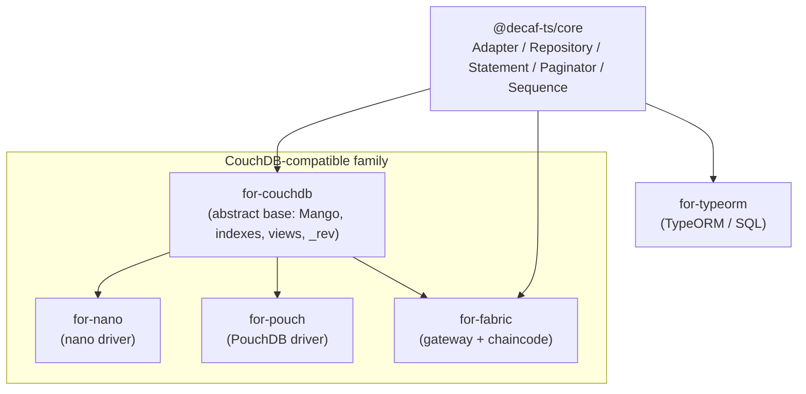

`for-couchdb` is the only abstract adapter in the family: its constructor is
`protected` and it declares abstract CRUD/index/raw/view methods, so it cannot
be instantiated directly. Every concrete CouchDB-compatible adapter subclasses
it and supplies a real driver exposing the duck-typed surface
`insert / bulk / fetch / createIndex / get / put / destroy / find / view`
(probed by `wrapDocumentScope`). `for-typeorm` and the Fabric adapters, by
contrast, extend `core`'s `Adapter` directly (Fabric's adapters still extend
`CouchDBAdapter` for shared Mango logic, see §6).

---

## 2. Adapter comparison

| Adapter | Package | Flavour | Storage target | Extends | Driver / external deps |
|---|---|---|---|---|---|
| `for-couchdb` | `@decaf-ts/for-couchdb` | — (abstract) | CouchDB (any compatible client) | `core.Adapter` | none declared; driver duck-typed by `wrapDocumentScope` |
| `for-nano` | `@decaf-ts/for-nano` | `"nano"` | CouchDB via `nano` | `CouchDBAdapter` | `nano ^10.1.4` |
| `for-pouch` | `@decaf-ts/for-pouch` | `"pouch"` | PouchDB (local or remote CouchDB-compatible) | `CouchDBAdapter` | `pouchdb-core`, `pouchdb-find`; storage adapters as peers |
| `for-typeorm` | `@decaf-ts/for-typeorm` | `"type-orm"` | Relational DB via TypeORM | `core.Adapter` | `typeorm ^0.3.27`; `pg` peer (other drivers installed by consumer) |
| `for-fabric` | `@decaf-ts/for-fabric` | `"hlf-fabric"` | Hyperledger Fabric ledger (CouchDB state DB) | `CouchDBAdapter` (both client & contract adapters) | `@hyperledger/fabric-gateway`, `fabric-network` (legacy), `fabric-ca-client`, `fabric-contract-api`/`fabric-shim-api`, `@grpc/grpc-js` |

All five depend on `@decaf-ts/core` and the shared decaf decoration stack
(`db-decorators`, `decoration`, `decorator-validation`, `logging`). All are
pre-1.0 and pin their decaf dependencies to `"latest"`, which the briefs flag
as a reproducibility hazard.

---

## 3. for-couchdb — the abstract CouchDB base

### 3.1 Role

`for-couchdb` provides the database-specific glue between the generic
persistence abstractions and CouchDB's Mango query / document model. It
translates Decaf `Condition`s into Mango selectors, generates CouchDB indexes
and design-doc views from model metadata, and normalises CouchDB errors into
Decaf `BaseError` types. It is intentionally **driver-agnostic**: it bundles
neither `nano` nor `pouchdb`, and is consumed by `for-nano`, `for-pouch`, and
`for-fabric`.

### 3.2 Public API surface

From `src/index.ts` (re-export list documented in the brief):

- **Adapter / Repository**: `CouchDBAdapter` (abstract; subclass and implement
  `index`, `raw`, `view`, `create`, `read`, `update`, `delete`),
  `CouchDBRepository<M, A>`.
- **Query**: `CouchDBStatement`, `CouchDBPaginator`, `translateOperators`,
  `CouchDBOperator`, `CouchDBGroupOperator`, `CouchDBConst`,
  `CouchDBQueryLimit`; planner helpers (`attachGeneratedUseIndex`,
  `requireGeneratedUseIndex`, `resolveGeneratedIndexForQuery`,
  `buildGeneratedIndexCandidates`, `findGeneratedIndexCandidateByName`,
  `getRequiredMangoIndexShape`,
  `reverseRequiredShapeToIndexDeclaration`, `getSortFields`, `getSortDirection`,
  `getEqualitySelectorFields`, `getRangeSelectorFields`, `normalizeSortField`,
  `warnScanProneMangoOperators`, `ensureDeterministicSort`,
  `enableMangoExecutionStats`); range helpers (`nextLexicographicString`,
  `prefixRange`).
- **Indexes**: `generateIndexes`, `generateIndexName` (the `string[]`-signature
  variant), `generateModelIndexName`.
- **Views**: `generateViews`, `generateViewIndexes`, `generateViewName`,
  `generateDesignDocName`, `findViewMetadata`, `collectViewMetadata`,
  `viewIndexDefinition` and types `CouchDBViewOptions`,
  `CouchDBViewMetadata`, `CouchDBViewDefinition`, `AggregateOptions`,
  `CouchDBDesignDoc`, `ViewIndexDefinition`.
- **Errors**: `IndexError`, `IndexPlanningError` (+ `IndexPlanningSuggestion`).
- **Decorators**: `groupBy`, `count`, `sum`, `max`, `min`, `distinct`.
- **Constants**: `CouchDBKeys`, `reservedAttributes`.
- **Types**: `MangoQuery`, `MangoSelector`, `MangoOperator`, `MangoResponse`,
  `MangoExecutionStats`, `CreateIndexRequest`, `MangoValue`, `SortOrder`,
  `ViewRow`, `ViewResponse`, `CouchDBFlags`.
- **Metadata helpers**: `setMetadata`, `getMetadata`, `removeMetadata`.
- **Utils (named export)**: `reAuth`, `wrapDocumentScope`,
  `testReservedAttributes`, `generateIndexDoc`.
- **Build metadata**: `VERSION`, `COMMIT`, `FULL_VERSION`, `PACKAGE_NAME`.

The brief notes the exported surface is "broad and unmarked `@internal`"; treat
anything beyond `CouchDBAdapter` / `CouchDBRepository` / `CouchDBStatement` /
`CouchDBPaginator` / `generateIndexes` / `MangoQuery` as potentially unstable.

### 3.3 How it implements the core Adapter contract

- **Adapter + flavour.** `CouchDBAdapter` extends
  `Adapter<CONF, CONN, MangoQuery, C>`. The constructor takes a `flavour`
  string and optional `alias`; concrete subclasses pass their own flavour.
  There is **no flavour decorator or `init()`/`boot()`** in this module —
  flavour is a plain string supplied by the subclass.
- **Method-prefix weaving.** The constructor wraps `create/createAll/
  update/updateAll` via `prefixMethod` (`@decaf-ts/logging`) to call
  `*Prefix` hooks first. The prefix hooks inject the discriminator fields
  `??table` and the generated `_id`/`_rev` *after* `Object.assign`, so model
  data cannot forge table membership (a security guard enforced by `isReserved`).
- **Discriminator multi-table-on-one-DB.** Every document carries
  `??table = tableName`; the document `_id` is `${tableName}__${pk}`. Queries
  auto-inject `??table`, and `raw()` is force-scoped via `scopeToTable` to
  prevent cross-table leaks.
- **Metadata = `_rev`.** The revision is carried on model instances as a
  non-enumerable `PersistenceKeys.METADATA` property; `assignMetadata`
  propagates it for optimistic concurrency.
- **`initialize()`.** Gathers `Adapter.models(this.flavour)` and calls the
  abstract `index(...models)`; subclasses iterate `generateIndexes(models)` and
  call `db.createIndex`.

### 3.4 Adapter-specific extensions to Statement / Paginator

`CouchDBStatement` is a fluent Mango builder with `parseCondition`, an
aggregate/view pipeline, and a manual-aggregation fallback. The translation
table documented in the brief:

| Decaf operator | Mango |
|---|---|
| `EQUAL`/`DIFFERENT`/`GREATER`/`GREATER_EQUAL`/`LOWER`/`LOWER_EQUAL` | `$eq`/`$ne`/`$gt`/`$gte`/`$lt`/`$lte` |
| `NOT` | `$not` |
| `IN` | `$in` |
| `STARTS_WITH` | lexicographic `$gte`/`$lt` range via `nextLexicographicString` |
| `ENDS_WITH` | end-anchored `$regex` |
| `BETWEEN` | `$gte`/`$lte` |
| groups | `$and` / `$or` |

`CouchDBPaginator` is **bookmark-based and forward-only**: random page access
without a cached bookmark throws `PagingError`, and `skip` is stripped.
`CouchDBFlags.forceNamedIndexes` (default `true`) gates the index planner,
which scores candidate indexes (equality×30, range×25, sort×20) and attaches
`use_index`; in strict mode it throws `IndexPlanningError` with a ready-to-paste
`@index(...)` suggestion.

### 3.5 Lifecycle and data flow

`adapter.initialize()` → `index(...)` for all managed models. The default Mango
`limit` is `CouchDBQueryLimit = 250` (not CouchDB's 25); the `_id` separator is
`"__"`. No environment variables are read by `src/`; connection/auth config
arrives through the user-supplied `scope`.

Create flow:

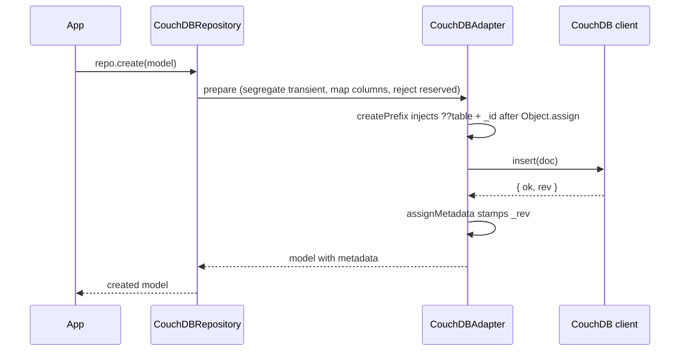

Update flow (revision-conflict handling):

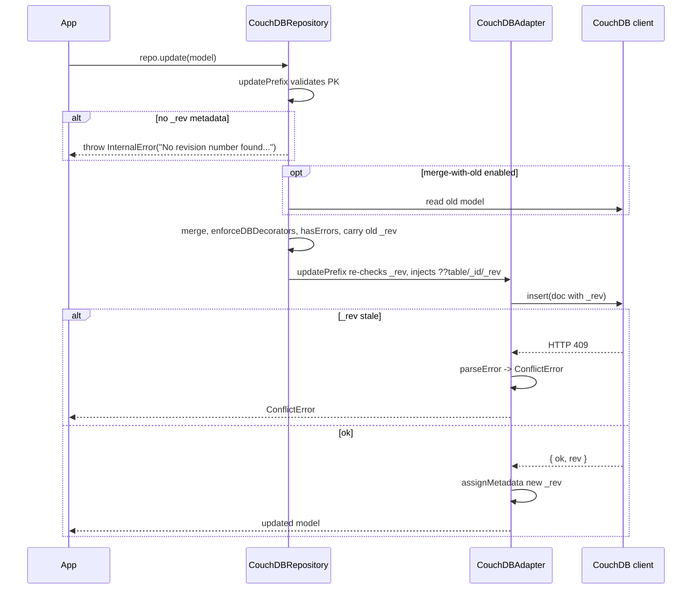

Error translation (`parseError`): HTTP 401/412/409 → `ConflictError`; 404 →
`NotFoundError`; 400 → `InternalError`/`IndexError`; `ECONNREFUSED` →
`ConnectionError`, plus string heuristics. (The 400→`IndexError` branch is
unreachable — see inaccuracies.)

### 3.6 Minimal usage example

From `tests/unit/query/statement.test.ts` — building a `STARTS_WITH` Mango
range:

```typescript
const statement = new CouchDBStatement({} as any);
(statement as any).fromSelector = GtinStatementModel;
const query = (statement as any).parseCondition(
  Condition.attribute<GtinStatementModel>("productCode").startsWith("98765432109879")
);
// query.selector.productCode.$gte === "98765432109879"
// query.selector.productCode.$lt  === "98765432109880"
```

Attaching a generated `use_index` from `@index` metadata
(`tests/unit/query/planner.test.ts`):

```typescript
jest.spyOn(Model, "tableName").mockReturnValue("assets");
jest.spyOn(Model, "indexes").mockReturnValue({
  owner: { index: { directions: [OrderDirection.ASC], compositions: ["createdAt"] } },
} as any);
const query: MangoQuery = {
  selector: { "??table": "assets", owner: "alice", createdAt: { $gt: "2026-01-01" } },
  sort: [{ createdAt: "asc" }],
};
attachGeneratedUseIndex(Asset, query, undefined, { forceNamedIndexes: true });
// query.use_index === ["assets_owner_createdAt_asc_index", "assets_owner_createdAt_asc_index"]
```

The brief notes no standalone runnable example app exists; the README adapter
example is illustrative and contains the inaccuracies listed in §10.

### 3.7 Consumer notes

- You must subclass `CouchDBAdapter` (protected constructor, abstract
  CRUD/index/raw/view); no ready-to-use adapter ships.
- Bring your own driver exposing
  `insert/bulk/fetch/createIndex/get/put/destroy/find/view` (missing methods
  are silently skipped).
- Default `limit` is **250**, not CouchDB's 25; set an explicit `limit` or use
  the paginator for large reads.
- Pagination is bookmark-based and forward-only; `skip` is stripped.
- Updates require a `_rev`; `updatePrefix` throws `InternalError` otherwise.
- Reserved attributes (`^_.*$`, `??table`, `??sequence`) are rejected.
- Maturity is pre-1.0; `tests/integration/` is empty; coverage reports are
  stale; there is a stray `console.log` in `views/generator.ts:292`.

---

## 4. for-nano — the `nano` CouchDB driver

### 4.1 Role

`for-nano` plugs the `nano` CouchDB client into the decaf-ts data stack behind
the standard `Adapter`/`Repository` abstractions, exposing CRUD, bulk, Mango
queries, indexes/views, a change-feed dispatcher, and CouchDB admin helpers.
It is a thin, flavour-specific specialization: `NanoAdapter extends
CouchDBAdapter` and reuses `for-couchdb`'s `MangoQuery`, `CouchDBKeys`,
`generateIndexes`, `generateViews`, and `wrapDocumentScope`. It is the concrete
`"nano"` flavour.

### 4.2 Public API surface

From `src/index.ts`:

- **Flavour/constant**: `NanoFlavour` (`"nano"`).
- **Types**: `NanoFlags`, `NanoConfig`.
- **Adapter**: `NanoAdapter` (instance CRUD/bulk/raw/view/index/shutdown;
  protected `getClient/flags/Dispatch/repository`; static
  `connect/createDatabase/deleteDatabase/closeConnection/createUser/deleteUser/
  decoration`); `createdByOnNanoCreateUpdate` (exported helper).
- **Repository**: `NanoRepository<M>`.
- **Build metadata**: `VERSION`, `COMMIT`, `FULL_VERSION`, `PACKAGE_NAME`.

`NanoDispatch` is imported by `adapter.ts` but **not re-exported by
`index.ts`**; it is effectively internal (accessed only via `repo.observe`).

### 4.3 Adapter-specific metadata and extensions

- `NanoFlags` extends `AdapterFlags` and requires `user: { name, roles? }`.
- `NanoConfig` carries `couchUser`, `couchPassword`, `host`, `dbName`,
  `protocol`.
- `Decoration.flavouredAs(NanoFlavour).for(key).define(handler,
  propMetadata).apply()` wires `created_by`/`updated_by` hooks;
  `createdByOnNanoCreateUpdate` reads `context.get("user")` and writes
  `user.name`, throwing `UnsupportedError` if no user is present.
- `NanoDispatch` subscribes to CouchDB continuous `_changes`, parses frames,
  groups by `table` (split on `CouchDBKeys.SEPARATOR`) and operation (CREATE
  rev `1-` / DELETE / UPDATE), calls `updateObservers`, and retries up to 3
  times with a `timeout` (default 5000 ms).
- The `nano` flavour is registered on import via `Adapter.setCurrent(NanoFlavour)`
  (an import side effect).

`NanoAdapter` inherits all CouchDB query/pagination logic from `for-couchdb`
and does **not** extend `Statement`/`Paginator` itself; the inherited
`CouchDBStatement`/`CouchDBPaginator` are used unchanged.

### 4.4 Lifecycle and data flow

Import runs `NanoAdapter.decoration()` and `Adapter.setCurrent(NanoFlavour)`.
The consumer calls `NanoAdapter.connect(user, pass, host="localhost:5984",
protocol, agent?)`, optionally creates the DB/user via static helpers, then
constructs `new NanoAdapter({ couchUser, couchPassword, host, dbName, protocol },
alias?)`. `adapter.initialize()` lazily materialises the `DocumentScope` and
starts the change feed; `adapter.shutdown(...)` closes the agent, clears
`_client`, and disposes the feed.

Bulk flow:

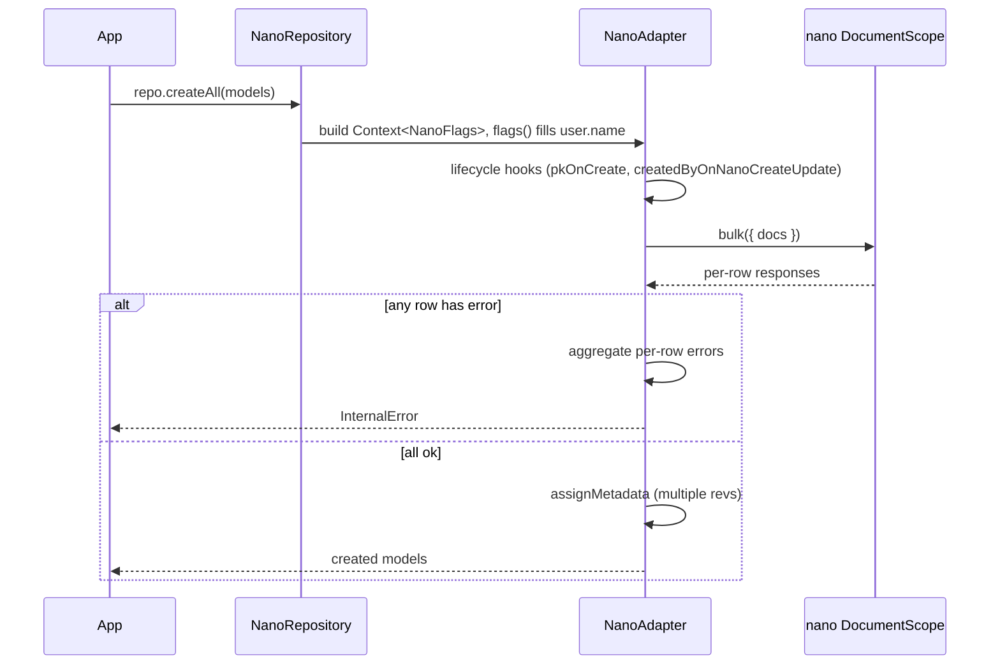

Env vars are only read by the test harness (`NANO_ADMIN_USER`,
`NANO_ADMIN_PASSWORD`, `NANO_HOST`, `NANO_PROTOCOL`,
`NANO_CLEANUP_DELAY_MS`); `src/` reads none.

### 4.5 Minimal usage example

From `tests/TestModel.ts` + `tests/helpers/repository.ts`:

```typescript
@uses(NanoFlavour) @table("tst_user") @model()
export class TestModel extends BaseModel {
  @pk() id!: number;
  @column("tst_name") @required() name!: string;
  @column("tst_nif") @unique() @minlength(9) @maxlength(9) @required() nif!: string;
  @column("tst_created_by") @createdBy() createdBy!: string;
  constructor(arg?: ModelArg<TestModel>) { super(arg); }
}
const repo = Repository.forModel(TestModel) as NanoRepository<TestModel>;
```

Booting an adapter and running CRUD (`tests/helpers/nanoSetup.ts` +
`tests/integration/adapter.test.ts`):

```typescript
const adapter = new NanoAdapter({
  couchUser: "nano-user", couchPassword: "nano-pass",
  host: "localhost:10010", dbName: "mydb", protocol: "http",
}, "mydb");
await adapter.initialize();
const created = await repo.create(new TestModel({ id: 1, name: "Ada", nif: "123456789" }));
const loaded = await repo.read(1);
await adapter.shutdown();
```

### 4.6 Consumer notes

- Flavour auto-registration is an import side effect; in multi-adapter apps
  import order matters (`Adapter.setCurrent` is last-wins; tests reset it).
- `NanoFlags.user` is required (defaults to `config.couchUser`;
  `createdByOnNanoCreateUpdate` throws `UnsupportedError` otherwise).
- Revisions live in `PersistenceKeys.METADATA`, not `_rev`; the safe pattern is
  read → mutate → `update`.
- Bulk ops aggregate per-row errors into one `InternalError`.
- `index()` throws `ConflictError` on pre-existing indexes (not idempotent) —
  catch on re-runs.
- `forceNamedIndexes` passes through `flags()` but is unused in this module.
- All decaf deps are pinned `"latest"` and there is no `peerDependencies`
  block (non-reproducible); Node ≥20.

---

## 5. for-pouch — the PouchDB driver

### 5.1 Role

`for-pouch` plugs PouchDB (local or remote CouchDB-compatible) into the decaf-ts
data stack. It provides a concrete `PouchAdapter` (extending `CouchDBAdapter`)
plus a thin `PouchRepository`, exposing CRUD (single+bulk), Mango queries,
indexes/views, error mapping, and flavour-specific `createdBy`/`updatedBy`
decoration. Because PouchDB is CouchDB-compatible, most query/index logic is
inherited from `for-couchdb`; only the driver calls are overridden. It is the
`"pouch"` flavour.

### 5.2 Public API surface

From `src/index.ts`:

- **Adapter**: `PouchAdapter` (constructor `(config, alias?)`; CRUD/bulk/raw/
  view; instance `parseError`; static `parseError`/`decoration`);
  `createdByOnPouchCreateUpdate`.
- **Repository**: `PouchRepository<M extends Model>` (extends
  `CouchDBRepository<M, PouchAdapter>`; overrides `override(flags)`).
- **Types**: `PouchFlags`, `PouchConfig`.
- **Constants**: `PouchFlavour`, `DefaultLocalStoragePath`.
- **Build metadata**: `VERSION`, `COMMIT`, `FULL_VERSION`, `PACKAGE_NAME`.

Not re-exported (internal): `IndexError` (`IndexError.ts`).

### 5.3 Adapter-specific metadata and extensions

- `PouchFlags` extends `AdapterFlags`; required `UUID: string`, optional
  `forceNamedIndexes?`.
- `PouchConfig` carries connection + plugins; the brief notes the credential
  fields are mid-migration — prefer `couchUser`/`couchPassword`; `user`/
  `password` are deprecated but still used as fallbacks.
- `PouchAdapter.decoration()` registers, for the pouch flavour, handlers that
  populate `CREATED_BY`/`UPDATED_BY` via `createdByOnPouchCreateUpdate`,
  copying `context.get("UUID")` onto the model. The barrel calls `decoration()`
  on import.
- `getClient()` builds the `PouchDB` instance once; `registerPlugins()`
  registers `pouchdb-mapreduce`/`replication`/`find` plus user plugins,
  ignoring "redefine property" duplicates. An admin client is built only when
  `adminUser` is configured.
- `flags()` seeds `config.user` with `randomUUID()` if absent and injects
  `UUID` for the decoration handlers. (The JSDoc claim that it "extracts the
  user ID from the database URL" is inaccurate — see §10.)
- `index()` calls `generateIndexes`/`generateViews` from `for-couchdb`,
  dedupes against existing `_index` listings, retries on HTTP 500 by removing
  the design doc, and tolerates 409.

`PouchAdapter` does not extend `Statement`/`Paginator` itself; it inherits
`CouchDBStatement`/`CouchDBPaginator` unchanged.

### 5.4 Lifecycle and data flow

Import: `PouchAdapter.decoration()` → `Adapter.setCurrent(PouchFlavour)` →
`Metadata.registerLibrary`. Construction is `new PouchAdapter(config, alias?)`
with no I/O until `getClient()` (lazy), which registers plugins and builds a
`PouchDB` for a remote URL (`${protocol}://${user:pass@host/dbName`) or a local
path (`${storagePath||"local_dbs"}/${dbName}`). `adapter.initialize()`
(inherited) drives `index(...)` for registered models.

Query flow:

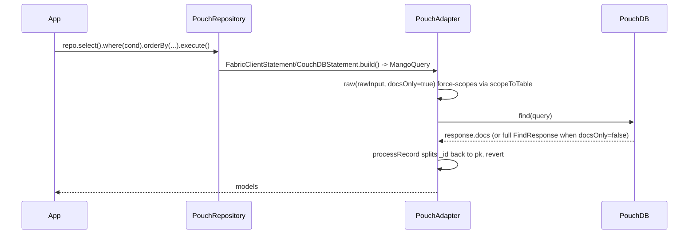

Env vars are read only by the test harness (`POUCH_ADMIN_USER`,
`POUCH_ADMIN_PASSWORD`, `COUCHDB_ADMIN_USER`, `COUCHDB_ADMIN_PASSWORD`,
`POUCH_HOST`, `POUCH_PROTOCOL`, `POUCH_CLEANUP_DELAY_MS`); `src/` reads none.
Defaults: local storage path `"local_dbs"`, protocol `"http"`; admin client
falls back to the regular client when `adminUser` is unset; admin password
falls back to `config.password`.

### 5.5 Minimal usage example

HTTP adapter + CRUD (`tests/integration/adapter.test.ts` + `tests/pouch.ts`):

```typescript
const adapter = await getHttpPouch("adapter_db", "couchdb.admin", "couchdb.admin");
const repo = new Repository(adapter, TestPouchModel);
const created = await repo.create(new TestPouchModel({ id: Date.now(), name: "test_name", nif: "123456789" }));
const read = await repo.read(created.id as number);
const updated = await repo.update(new TestPouchModel({ ...created, name: "new_test_name" }));
const deleted = await repo.delete(created.id as number);
```

Memory adapter + error parsing (`tests/integration/adapter-client.test.ts` +
`adapter-error-paths.test.ts`):

```typescript
const memory = (await import("pouchdb-adapter-memory")).default;
const adapter = new PouchAdapter({ dbName: "local_mem_db", plugins: [memory] }, "mem-local");
const client: any = (adapter as any).client; // triggers getClient() + plugin registration
await client.put({ [CouchDBKeys.ID]: "t1", type: "test" });
await expect(adapter.create("tbl", "t1", { [CouchDBKeys.ID]: "t1", type: "x" }))
  .rejects.toBeInstanceOf(BaseError);
```

### 5.6 Consumer notes

- Import side effects (`Adapter.setCurrent("pouch")` + decoration registration)
  mean `package.json` `sideEffects: false` is **misleading** — bundlers may
  tree-shake the registration if the barrel is not fully evaluated.
- `PouchConfig.plugins` is required (even for remote-only use, pass
  `plugins: []` and add the adapter plugin dynamically).
- `flags()` mutates `config.user` with `randomUUID()` when unset; set
  `couchUser`/`user` explicitly for deterministic authorship.
- Indexes are required for sorting/aggregation; call `adapter.initialize()`
  after registering models. `index()` swallows failures with `console.warn`
  and proceeds without indexes, so a missing index may surface later.
- Pagination is essentially untested (the `paginate` test is `it.skip`).
- Pre-1.0 (`0.9.5`); release notes stale; many skipped tests; decaf deps
  pinned `latest`; Node 20+. `pouchdb-adapter-idb` is browser-only.

---

## 6. for-typeorm — the SQL/relational adapter

### 6.1 Role

`for-typeorm` is the SQL/relational persistence adapter in decaf.ts. It
implements the abstract `Adapter`/`Repository`/`Statement`/`Paginator`/
`Sequence` contracts from `@decaf-ts/core` on top of a TypeORM `DataSource`,
providing a uniform Decaf data-access API over relational databases while
delegating connection management, entity metadata, and SQL generation to
TypeORM. Its core contribution is the decorator-wiring layer
(`TypeORMAdapter.decoration()`) that re-routes Decaf model decorators
(`@table`, `@pk`, `@column`, `@oneToOne`, …) into TypeORM's metadata storage,
so users write only Decaf decorators. It is the `"type-orm"` flavour.

### 6.2 Public API surface

From `src/index.ts`:

- **Adapter / repository**: `TypeORMAdapter`, `TypeORMRepository<M>`,
  `TypeORMContext` (type alias `Context<TypeORMFlags>`).
- **Transactions / events**: `TypeORMContextLock`, `TypeORMDispatch`,
  `TypeORMEventSubscriber`.
- **Query**: `TypeORMStatement<M, R>`, `TypeORMPaginator<M>`,
  `translateOperators`, `TypeORMOperator`, `TypeORMGroupOperator`,
  `TypeORMConst`, `TypeORMQueryLimit`.
- **Sequences / indexes**: `TypeORMSequence`, `generateIndexes`.
- **Types / constants / errors / utils**: `SQLOperator`, `TypeORMQuery`,
  `TypeORMFlags`, `TypeORMTableSpec`, `TypeORMDriver`, `TypeORMEventMode`,
  `detectTypeORMDriver`, `reservedAttributes`, `TypeORMFlavour`,
  `TypeORMKeys`, `IndexError`, `convertJsRegexToPostgres`,
  `splitEagerRelations`.

Sub-barrels exist for `query/`, `sequences/`, `indexes/`. The `overrides/`
directory (local re-implementations of TypeORM decorators) has no barrel and is
**not exported**. Raw Postgres types in `raw/postgres.ts` are also not
re-exported (the README claim that they are is inaccurate — see §10).

### 6.3 How it implements the core Adapter contract

`TypeORMAdapter` extends `Adapter<DataSourceOptions, DataSource, TypeORMQuery,
TypeORMContext>`. It holds the `TypeORMDriver`, builds the `DataSource` from
`Adapter.models(alias)` entities (`getClient`), overrides CRUD + `*All`, `raw`,
`initialize`, `prepare`/`revert`, `parseError`, and exposes static Postgres
DB/user/schema helpers (`connect`, `createDatabase`, `createUser`,
`deleteUser`, `createNotifyFunction`, `getCurrentUser`) and the multi-driver
type/validation/relation→DDL translators (`parseTypeToDriver`/
`parseValidationToDriver`/`parseRelationsToDriver`, private static).

The **decorator wiring** is the defining pattern: for each Decaf persistence
key (`TABLE`, `ID`, `COLUMN`, `UNIQUE`, `REQUIRED`, `VERSION`, `TIMESTAMP`,
the four relation keys, `INDEX`, `CREATED_BY`/`UPDATED_BY`) the adapter
registers a flavour-specific implementation via
`Decoration.flavouredAs(...).for(key).define(...).apply()` that emits **both**
Decaf metadata (`propMetadata`, `relation`) **and** TypeORM metadata (via the
local `overrides/`, which push into `getMetadataArgsStorage()` and use
`aggregateOrNewColumn` to merge duplicate column/relation metadata). Run once
at import via `decoration()`.

Transactions: `transactionLock()` returns a `TypeORMContextLock` backed by a
TypeORM `QueryRunner` (real `BEGIN`/`COMMIT`/`ROLLBACK`); when active,
`getRepository(m, ctx)` resolves the TypeORM repo from `lock.manager()` so all
CRUD inside `@transactional()` shares one transaction.
`TypeORMContextLock` fully overrides `begin/commit/rollback` without `super`,
so core's `maxConcurrentTransactions` semaphore is bypassed (documented in the
README).

### 6.4 Adapter-specific extensions to Statement / Paginator / Sequence

`TypeORMStatement<M, R>.build()` produces a TypeORM `SelectQueryBuilder`. It
supports `COUNT`/`COUNT DISTINCT`/`SUM`/`AVG`/`MAX`/`MIN`/`DISTINCT`,
`GROUP BY`, multi-key `ORDER BY`, `LIMIT` (default 250), and `OFFSET`. The
recursive `parseCondition` / `parseConditionForPagination` translation:

| Decaf operator | SQL |
|---|---|
| `EQUAL`/`DIFFERENT` against `null` | `IS [NOT] NULL` |
| `BETWEEN` | `BETWEEN :a AND :b` |
| `IN` (variadic) | `IN (:...param)` |
| `STARTS_WITH` / `ENDS_WITH` | `LIKE 'pattern%'` / `LIKE '%pattern'` |
| `NOT` | **not implemented** (brief flags this) |

`raw()` checks `ctx.get("allowRawStatements")`, then uses `getRawOne`/
`getRawMany` for aggregations or `getMany()` otherwise.

`TypeORMPaginator<M>` uses `repo.findAndCount` with `skip`/`take` and maps via
`adapter.revert` (offset-based paging, in contrast to CouchDB's bookmark
paging).

`TypeORMSequence extends Sequence`; `current`/`increment`/`next`/`range`/
`ensureAtLeast` use **Postgres-specific** SQL (`last_value`/`is_called`,
`setval`, `CREATE SEQUENCE IF NOT EXISTS`, `to_regclass`). `pkDec` records
`SEQUENCE` metadata so `Model.generatedBySequence`/`sequenceFor` work for bulk
id allocation in `createAllPrefix`.

### 6.5 Lifecycle and data flow

Import: `TypeORMAdapter.decoration()` + `Adapter.setCurrent(TypeORMFlavour)` +
`Metadata.registerLibrary`. Construct `new TypeORMAdapter(dataSourceOptions,
alias?)`; `detectTypeORMDriver(options)` sets the driver; `getClient()`
lazily builds the `DataSource` aggregating entities from `Adapter.models(alias)`.
`await adapter.initialize()` calls `ds.initialize()`.

Create flow:

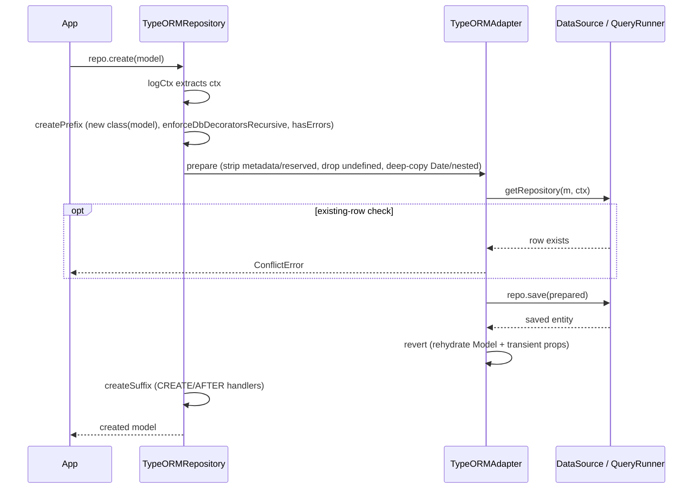

Transaction flow (nested `@transactional()`):

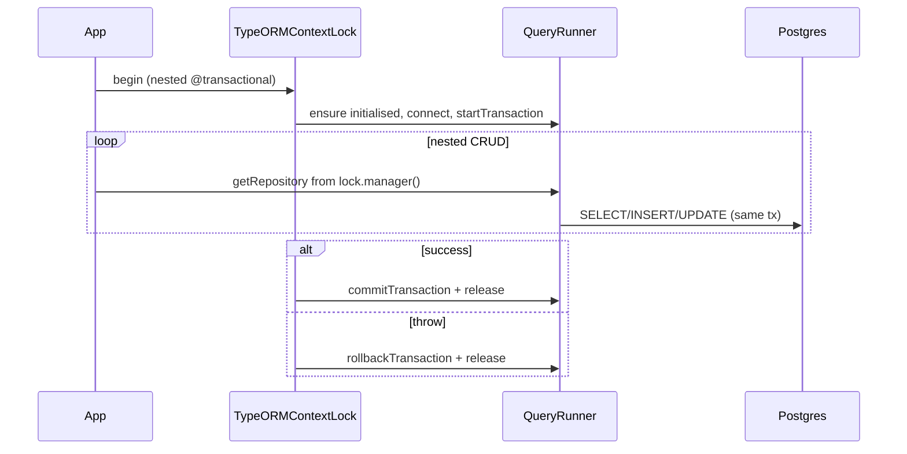

Error translation (`parseError`) maps Postgres SQLSTATE: `23505`/`23503`/
`42P07` → `ConflictError`; `42P01`/`42703` → `NotFoundError`; `42P16` →
`IndexError`; `ECONNREFUSED` → `ConnectionError`, plus string heuristics.

Env vars: `src/` reads none; docker-compose reads `POSTGRES_USER`/
`POSTGRES_password`/`POSTGRES_VERSION`/`POSTGRES_PORT`/`POSTGRES_VECTOR`/`TZ`;
CI gating uses `process.env.CI`. Defaults: query limit 250; `user` flag =
`config.username`; event mode `SUBSCRIBER`; driver `POSTGRES`; default ordering
= pk ASC when no `orderBy`/not aggregation; `@pk` for `Number`/`BigInt`
defaults `generated=true`, for `String` `false`, `uuid`/`serial` force `true`.
`synchronize: true` in test configs; production should use
`synchronize: false` + `migrationsRun: true`.

### 6.6 Minimal usage example

From `tests/integration/minimal.test.ts`:

```typescript
@uses(TypeORMFlavour) @table("tst_user") @model()
class TestModelRepo extends Model {
  @pk({ type: "Number" }) id!: number;
  @column("created_on") @createdAt() createdAt!: Date;
  @column("updated_on") @updatedAt() updatedAt!: Date;
  constructor(arg?: ModelArg<TestModelRepo>) { super(arg); }
}
const adapter = new TypeORMAdapter({
  type: "postgres", host: "localhost", port: 5432,
  username: "repo_user_minimal", password: "password",
  database: "repository_db_minimal", synchronize: true, logging: false,
});
await adapter.initialize();
const repo: TypeORMRepository<TestModelRepo> = Repository.forModel(TestModelRepo);
const created = await repo.create(new TestModelRepo({ name: "test_name" }));
// observers fire with (constructor, OperationKeys.CREATE, 1, entity, Context)
```

Transactions: a `TypeORMRepository` subclass method decorated with
`@transactional()` forwards `...args` across multiple `create`/`update` calls
sharing one `TypeORMContextLock`/Postgres transaction, rolling back together
(per `transaction.nested.integration.test.ts` and README `:486-529`).

### 6.7 Consumer notes

- Import side effects: `decoration()` wires decorators globally and
  `Adapter.setCurrent("type-orm")` changes the process default.
- Use Decaf decorators, not TypeORM's, to avoid double-registering metadata
  (the overrides dedupe only when both go through them).
- **Postgres bias**: `TypeORMSequence`, static schema/user helpers,
  `convertJsRegexToPostgres`, `~`/`~*` regex, `parseError` SQLSTATE mapping,
  `CREATE SEQUENCE`/`setval`/`to_regclass` are Postgres-specific. Multi-driver
  support is real at the `DataSource`/CRUD level (detection + private DDL
  translators exist for mysql/mariadb/sqlite/mssql) but sequences and several
  helpers won't work on non-Postgres.
- Peer dep declares only `pg`; using sqlite/mysql/mssql requires installing the
  driver yourself.
- `synchronize: true` is the test default; production should use
  `synchronize: false` + `migrationsRun: true`.
- `maxConcurrentTransactions` is ignored by `TypeORMContextLock` (Postgres
  governs concurrency).
- Default query limit 250; set explicit `.limit()`.
- `allowRawStatements` defaults `true`; `raw` still throws
  `UnsupportedError` if false. `NOT` condition operator is unsupported.
- `nativeRepo()`/`queryBuilder()` are broken as shipped (they reference a
  non-existent `adapter.dataSource` — see inaccuracies); use
  `adapter.client.getRepository(...)` directly.
- Pre-1.0 (`0.11.1`); dead/stale code present (`decorators.ts` fully commented,
  ~210-line commented `createTable` block in `TypeORMAdapter.ts:1137-1346`).

---

## 7. for-fabric — Hyperledger Fabric client + contracts

### 7.1 Role and the two-sided architecture

`for-fabric` adapts Hyperledger Fabric (both the modern `@hyperledger/
fabric-gateway` SDK and the legacy `fabric-network` SDK) to the decaf-ts
persistence layering. It lets a decaf model be stored, queried, and observed
against a Fabric ledger exactly like any other decaf adapter, while also
providing the chaincode-side building blocks (`ContractAdapter`,
`FabricCrudContract`, repositories, sequences) so the same models can serve as
smart-contract state.

The module is deliberately **two-sided**:

- The *client* adapter (`FabricClientAdapter`) talks to a running Fabric network
  via the gateway SDK and runs off-ledger.
- The *contract* adapter (`FabricContractAdapter`) runs *inside* chaincode and
  uses the `ChaincodeStub` as its state store.

Both extend `CouchDBAdapter` because Fabric chaincode state is typically backed
by CouchDB, so the Mango query model and the CouchDB statement/paginator are
reused. The root barrel re-exports `client` and `shared` only; the
`./contracts` export is intentionally a separate entry point (`export * from
"./contracts"` is commented out in `src/index.ts:6`) because contracts run
inside chaincode while client/shared run off-ledger. Pulling the contracts
barrel into a client bundle would drag in `fabric-contract-api`/
`fabric-shim-api`.

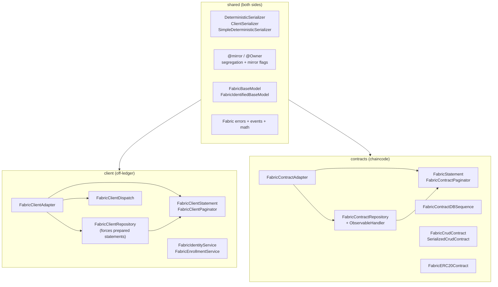

### 7.2 Public API surface

Root barrel (`@decaf-ts/for-fabric`) re-exports `client` + `shared`:

- **Client adapter/core**: `FabricClientAdapter`, `FabricClientContext`,
  `FabricClientDispatch`, `FabricClientRepository`, `FabricClientStatement`,
  `FabricClientPaginator`.
- **Client services**: `FabricIdentityService`, `FabricEnrollmentService`,
  `RegistrationRequestBuilder`.
- **Client fs/crypto**: `getIdentity`, `getSigner`, `readFile`, `getCAUser`,
  `getFirstDirFileName`, `getFirstDirFileNameContent`, `extractPrivateKey`,
  `CoreUtils` (HSM-aware), `CryptoUtils`, `BaseEncoder`, `BASE_ALPHABET`,
  `getAkiAndSerialFromCert`.
- **Client ERC20**: `FabricERC20ClientRepository`.
- **Client index/collection generation**: `generateModelIndexes`,
  `generateModelDesignDocs`, `readModelFolders`, `writeIndexes`,
  `writeDesignDocs`, `extractIds`.
- **Shared serializers**: `ClientSerializer`, `DeterministicSerializer`,
  `SimpleDeterministicSerializer`.
- **Shared decorators/helpers**: `@mirror()`, `@Owner()`,
  `DefaultContractResolver`, `ChaincodeResolver`, `applyMirrorFlags`,
  `applySegregationFlags`, `extractMspId`.
- **Shared models**: `FabricBaseModel`, `FabricIdentifiedBaseModel`,
  `Identity`, `IdentityCredentials`.
- **Shared constants/types**: `FabricFlavour`, `FabricModelKeys`,
  `IdentityType`, `FabricFlags`, `PeerConfig`, `MspDetails`, `HSMOptions`,
  `SegregatedModel`.
- **Shared errors**: `OverflowError`, `BalanceError`, `AllowanceError`,
  `RegistrationError`, `QueryResultTooLargeError`, `MissingContextError`,
  `NotInitializedError`, gateway error wrappers (`EndorsementError`,
  `EndorsementPolicyError`, `MvccReadConflictError`, `PhantomReadConflictError`,
  `TransactionTimeoutError`).
- **Shared events**: `generateFabricEventName`, `parseEventName`.
- **Shared math**: `add`, `sub`, `safeParseInt`.
- **Shared interfaces/types**: `Checkable`, `healthcheck`, CA fabric-types.
- **Shared overrides**: `Model.isShared`/`isPrivate`/`segregate` patches.

Contracts barrel (`@decaf-ts/for-fabric/contracts`):

- `FabricContractAdapter`, `FabricContractContext`,
  `FabricContractRepository`, `FabricContractRepositoryObservableHandler`,
  `FabricStatement`, `FabricContractPaginator`, `FabricContractDBSequence`,
  `MigrationContract`.
- `FabricCrudContract`, `SerializedCrudContract`.
- `FabricERC20Contract`, `ERC20Token`, `ERC20Wallet`, `Allowance`.
- `ContractLogger`.
- Auth: `hlfAllowIf`, `mspHandler`.
- Re-exports `shared` overrides.

Bootstrap (`@decaf-ts/for-fabric/contracts/bootstrap`): side-effect import that
loads all decaf-ts core modules + shared + overrides for a chaincode bundle.

### 7.3 Why shared / mirrored models + deterministic payloads

Fabric imposes constraints that pure SQL/CouchDB adapters do not, and these
drive the `shared` subsystem:

- **Deterministic serialization.** Fabric requires all endorsing peers to
  produce identical ledger bytes for a given transaction. `DeterministicSerializer`
  sorts keys recursively (`sortKeysOnlyRecursive`) and uses a stable
  `JSON.stringify` (via `json-stringify-deterministic`). `uuidFromSeed`
  (SHA-256-based, UUID-v5-style) replaces `UUID.prototype.generate` inside
  chaincode (`contracts/overrides.ts`) so generated IDs are reproducible across
  peers. The client side instead uses `ClientSerializer`, which embeds a class
  anchor so the off-ledger client can reconstruct model instances.
- **Private data collections (segregation).** `Model.segregate` (patched in
  `shared/overrides`) and `applySegregationFlags` split a model into public +
  private collection parts. `FabricContractFlags` carries
  `segregateWrite`/`segregateRead`/`fullySegregated`/`segregatedData`/
  `sequenceSegregation` maps. Collections can be static strings or resolver
  functions `(model, msp, ctx) => string`.
- **Mirroring.** `@mirror(collection, msp?, anchor?, allow?)` lets a model
  maintain a mirrored copy of private data in a shared/public collection.
  `applyMirrorFlags` configures the adapter to read/write the mirror. The
  `allow` predicate (4th arg) conditionally disables mirroring per context;
  when it returns false, mirroring is skipped entirely (not just no-oped).
- **MSP-aware ownership.** `@Owner()` and the flavour-bound `createdBy`/
  `updatedBy` populate the submitting identity's MSP/id. `extractMspId(ctx.
  identity)` resolves the MSP used for collection resolution.
- **Chaincode events.** Contracts emit events via
  `FabricContractRepositoryObservableHandler` → `stub.setEvent(eventName,
  payload)`, where `eventName = generateFabricEventName(table, event, owner)`
  (a `table~event~owner` string). The client `FabricClientDispatch` listens
  for these events and dispatches to registered observers; `parseEventName`
  decodes them client-side. Synthetic events can be generated client-side when
  the flag is set.

### 7.4 How it implements the core Adapter contract

- **Client side.** `FabricClientAdapter extends CouchDBAdapter`; manages gRPC
  `Client`/`Gateway`/`Network`/`Contract` connections (modern and legacy),
  builds identities/signers from files or PEM content, submits transactions,
  runs rich (Mango) queries via chaincode, supports transient maps, mirroring
  and segregation, and exposes `view()` for CouchDB design-doc views.
  `FabricClientRepository` **forces prepared statements**
  (`forcePrepareSimpleQueries`/`forcePrepareComplexQueries`) and **disables raw
  statements and generation override** on the client side. `FabricClientPaginator`
  raw paging throws `UnsupportedError` by design — only prepared statements are
  natively available.
- **Contract side.** `FabricContractAdapter extends CouchDBAdapter`; uses the
  `ChaincodeStub` as the state store, supports private data collections,
  transient maps, and segregation/mirroring-aware reads/writes.
  `FabricContractRepository` applies segregation + mirror flags per operation
  and uses `FabricContractRepositoryObservableHandler` to emit Fabric events.
  `FabricContractStatement` (alias `FabricStatement`) extends `CouchDBStatement`
  and applies segregation/mirror flags before execution.
- **Sequences.** `FabricContractDBSequence` provides world-state-backed
  incremental sequences (for auto-increment IDs) inside chaincode;
  `CustomizableSequence` (`PrivateSequence.ts`) is the backing model.

### 7.5 Adapter-specific extensions to Statement / Paginator

- `FabricClientStatement` extends `Statement`; builds Mango queries, supports
  `STARTS_WITH`/`ENDS_WITH`/`BETWEEN`, view-based aggregates
  (count/sum/min/max/distinct/avg), and prepared-statement squashing.
- `FabricClientPaginator` extends `Paginator`; **raw-query paging throws
  `UnsupportedError`** (only prepared statements are natively available).
- `FabricContractStatement` extends `CouchDBStatement`; applies segregation/
  mirror flags before execution; builds Mango queries with table filter and
  aggregation support.
- `FabricContractPaginator` extends `CouchDBPaginator`; bookmark-based paging
  with segregation/mirror flag application and a private pagination tie-breaker.

### 7.6 Lifecycle and data flow

**Bootstrap (chaincode).** Importing `@decaf-ts/for-fabric/contracts/bootstrap`
loads all core decaf modules, shared serializers/overrides, and sets
`ContractLogger` as the default `Logging` factory. `contracts/overrides.ts`
replaces `UUID.prototype.generate` with `uuidFromSeed`. A chaincode contract
class extends `FabricCrudContract<M>` (or `Contract`) and is exported as the
chaincode entrypoint.

**Client init.** `new FabricClientAdapter(config, alias?)` with a `PeerConfig`
(`mspId`, `peerEndpoint`, `channelName`, `chaincodeName`, `contractName`,
TLS/cert/key paths, CA config). The adapter lazily builds a gRPC `Client`,
connects a `Gateway`, gets the `Network`/`Contract`, and caches them. Legacy
gateway (`fabric-network`) is supported behind a flag
(`DefaultFabricClientFlags` legacy option).

Client create + contract create (one invocation end-to-end):

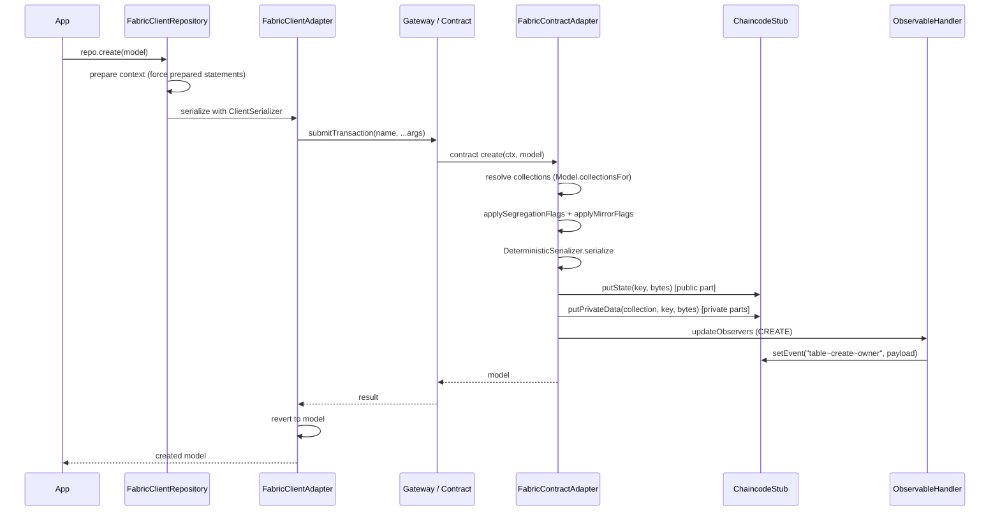

Contract query flow:

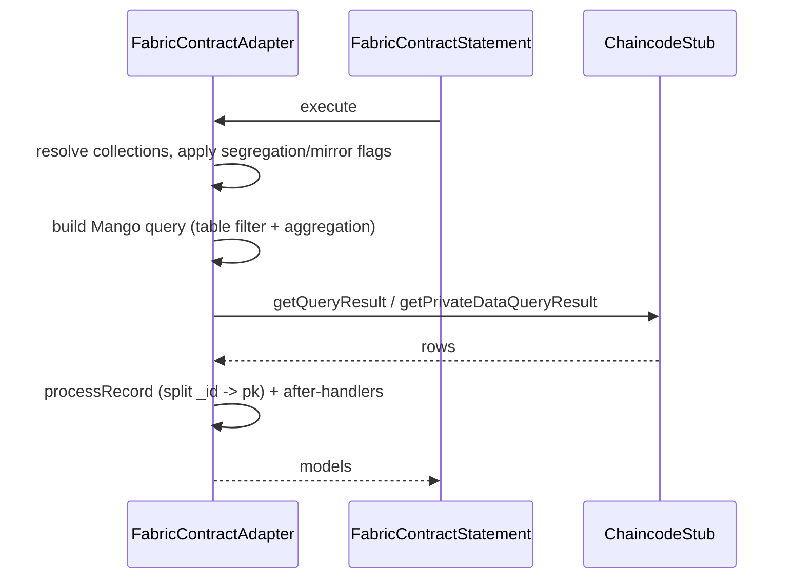

Events: contract emits → client `FabricClientDispatch` (started via
`dispatch.start()`) registers a chaincode event listener
(`contract.addEventListener`); incoming events are parsed (`parseEventName`) and
dispatched to registered observers keyed by table/event. Synthetic events can be
emitted client-side when the flag is enabled.

### 7.7 Minimal usage examples

Client-side CRUD + event listening (derived from `workdocs/5-HowToUse.md` and
tests):

```typescript
import { FabricClientAdapter, FabricClientDispatch, PeerConfig } from '@decaf-ts/for-fabric';

const config: PeerConfig = {
  mspId: 'Org1MSP', peerEndpoint: 'localhost:7051',
  channelName: 'mychannel', chaincodeName: 'mycc', contractName: 'mycontract',
  tlsCertPath: '/path/to/tls/cert',
  certDirectoryPath: '/path/to/cert/dir', keyDirectoryPath: '/path/to/key/dir',
};
const adapter = new FabricClientAdapter(config, 'org1-adapter');

// Listen for chaincode events
const client = await FabricClientAdapter.getClient(config);
const dispatch = new FabricClientDispatch(client);
dispatch.configure(config);
dispatch.observe('assets', 'create', (id) => console.log('Asset created:', id));
await dispatch.start();
```

Chaincode CRUD contract (derived from `workdocs/5-HowToUse.md` and
`src/contracts/crud/crud-contract.ts`):

```typescript
import { Context, Info, Transaction } from 'fabric-contract-api';
import { FabricCrudContract } from '@decaf-ts/for-fabric/contracts';
import { model, ModelArg, required } from '@decaf-ts/decorator-validation';
import { BaseModel, pk } from '@decaf-ts/core';

@model()
class Person extends BaseModel {
  @pk({ type: 'Number' }) id!: number;
  @required() name!: string;
  constructor(arg?: ModelArg<Person>) { super(arg); }
}

@Info({ title: 'PersonContract', description: 'Person CRUD contract' })
export class PersonContract extends FabricCrudContract<Person> {
  constructor() { super('PersonContract', Person); }

  @Transaction(false)
  async ping(ctx: Context): Promise<string> { this.logFor(ctx).info('ping'); return 'pong'; }
}
```

Serialized contract for simple JSON-string clients:

```typescript
import { SerializedCrudContract } from '@decaf-ts/for-fabric/contracts';
export class TestModelContract extends SerializedCrudContract<TestModel> {
  constructor() { super('TestModelContract', TestModel); }
}
// Client submits JSON string: const res = await contract.create(ctx, model.serialize());
```

### 7.8 Consumer notes

- **Two entry points matter**: import client/shared from
  `@decaf-ts/for-fabric`; import chaincode classes from
  `@decaf-ts/for-fabric/contracts`. The root barrel intentionally omits the
  contracts re-export.
- **Determinism is mandatory on-chain**: always use `DeterministicSerializer`
  (the contract adapter does by default) and never `JSON.stringify` with
  insertion-order keys inside chaincode, or endorsements will mismatch.
  `uuidFromSeed` replaces random UUIDs for the same reason.
- **Client queries are prepared-statement-only**: `FabricClientRepository`
  disables raw statements and forces preparation; `FabricClientPaginator` raw
  paging throws `UnsupportedError`. Custom query/paging must be implemented as
  chaincode transactions invoked via prepared statements.
- **Private data requires collection setup**: segregation/mirroring needs the
  `collections` configuration in the chaincode deployment and matching
  `META-INF` collection definitions; `writeIndexes`/`writeDesignDocs` accept a
  `collection` argument for collection-scoped artifacts.
- **Mirroring is conditional**: `@mirror`'s 4th argument (`allow`) gates
  whether mirror reads/writes/flags occur per context; when it returns false,
  mirroring is fully skipped.
- **Legacy vs modern gateway**: the adapter supports both
  `@hyperledger/fabric-gateway` (modern, default) and `fabric-network` (legacy,
  behind a flag). Legacy support adds bundle weight; new consumers should use
  the modern path.
- **HSM**: HSM-backed identities are supported via `CoreUtils` (not the simpler
  `fabric-fs.ts` helpers); requires `HSMOptions` (library, slot, tokenLabel,
  pin, keyIdHex).
- **Browser support**: `crypto.ts` and `utils.ts` branch on `isBrowser()` for
  SubtleCrypto access, so the client side can run in a browser context (with
  appropriate Fabric gateway proxying).
- Pre-1.0 (`0.16.3`); the `.testtt.ts` typo and commented-out `raw` method in
  `SerializedCrudContract` suggest active development.

---

## 8. Relationships and dependencies

All five adapters depend on `@decaf-ts/core` (`Adapter`, `Repository`,
`Statement`, `Paginator`, `Sequence`, `Context`, `Condition`,
`Operator`/`GroupOperator`, `Adapter.models`, errors) and the shared decaf
decoration stack (`db-decorators`, `decoration`, `decorator-validation`,
`logging`, `injectable-decorators`, `transactional-decorators`).

Layering:

- `for-couchdb` is the abstract base for the CouchDB-compatible family.
- `for-nano`, `for-pouch`, and `for-fabric` all subclass `CouchDBAdapter` and
  reuse `MangoQuery`, `CouchDBKeys`, `generateIndexes`, `generateViews`, and
  `wrapDocumentScope` from `for-couchdb`.
- `for-typeorm` extends `core.Adapter` directly; it does **not** depend on
  `for-couchdb` at runtime (it appears only in `devDependencies` for
  cross-adapter/migration tests).
- `for-fabric` is a leaf module: nothing else in the monorepo imports it at the
  library level; downstream consumers are applications/deployed chaincodes.

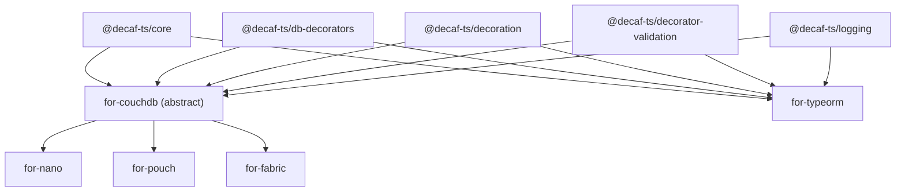

---

## 9. When to choose which adapter

| Need | Choose | Why |
|---|---|---|
| CouchDB server, server-side Node service | `for-nano` | Thin `nano` driver on the abstract CouchDB base; adds admin helpers and a `_changes` dispatch feed. |
| Local-first or browser PouchDB, or remote CouchDB-compatible via HTTP | `for-pouch` | PouchDB driver with pluggable storage adapters (memory/leveldb/idb/http). |
| Custom CouchDB-compatible client (not `nano`/`pouchdb`) | `for-couchdb` subclass | Driver-agnostic base; bring any client exposing the duck-typed surface. |
| Relational database (Postgres best; mysql/mariadb/sqlite/mssql partially) | `for-typeorm` | TypeORM `DataSource` under the Decaf API; decorator wiring so you write only Decaf decorators. Postgres-biased for sequences/schema helpers. |
| Hyperledger Fabric ledger, off-ledger app | `for-fabric` client | Gateway SDK adapter; prepared-statement queries against chaincode; CA identity services; event dispatch. |
| Hyperledger Fabric chaincode | `for-fabric` contracts | `FabricContractAdapter` over `ChaincodeStub`; deterministic serialization; segregation/mirroring; `FabricCrudContract` base. |

---

## 10. Inaccuracies

Recorded verbatim from the briefs' "Inaccuracies found" sections, in the
required format. Nothing here is fixed; this is documentation only.

### for-couchdb

**[for-couchdb]** README/Description — claims a "Sequence Management" subsystem ("CouchDBSequence … Sequence Model") that does not exist in `src/`. | Evidence: `README.md:56-59`, `workdocs/4-Description.md:18-20`; `find src -iname "*sequence*"` returns nothing. | Suggested fix: remove the section or implement/export a `CouchDBSequence`.

**[for-couchdb]** README adapter example — generic-parameter names disagree with the class signature (`MyFlags` vs `CONN`). | Evidence: `README.md:100` `CouchDBAdapter<MyScope, MyFlags, MyContext>`; actual `CouchDBAdapter<CONF, CONN, C extends Context<any>>` (`src/adapter.ts:74-78`). | Suggested fix: rename `MyFlags` to `MyConnection`.

**[for-couchdb]** README adapter example — method signatures use `tableName: string` but abstracts use `Constructor<M>` + `PrimaryKeyType`. | Evidence: `README.md:133,142,152,161` vs `src/adapter.ts:284-289,330-334`. | Suggested fix: update example signatures to `Constructor<M>`/`PrimaryKeyType`.

**[for-couchdb]** README repository example — wrong generic arity for `CouchDBRepository` (4 type params vs 2). | Evidence: `README.md:221` `CouchDBRepository<User, MyScope, MyFlags, MyContext>`; actual `CouchDBRepository<M, A>` (`src/repository.ts:17-20`). | Suggested fix: `CouchDBRepository<User, typeof adapter>`.

**[for-couchdb]** README error example imports `ConflictError`/`NotFoundError` from this package, but they are not re-exported. | Evidence: `README.md:361`; `src/index.ts:3-13` only re-exports `./errors` (`IndexError`, `IndexPlanningError`); `ConflictError`/`NotFoundError` come from `@decaf-ts/db-decorators`. | Suggested fix: import from `@decaf-ts/db-decorators` or re-export them.

**[for-couchdb]** README utility example calls `generateIndexName('email','users',['firstName'],'asc')` (utils signature) but the *exported* `generateIndexName` has signature `(name: string[], direction?, compositions?, separator?)`. | Evidence: `README.md:416`; exported from `src/indexes/generator.ts:20-32`; the utils variant (`src/utils.ts:129-140`) is module-private. | Suggested fix: `generateIndexName(['email','users'],'asc',['firstName'])`.

**[for-couchdb]** README imports `* as nano from 'nano'` but `nano` is not a dependency. | Evidence: `README.md:86`; `package.json` has no `nano`. | Suggested fix: state the driver must be installed by the consumer, or add `nano` as a peer.

**[for-couchdb]** README index example calls `adapter.db.createIndex(...)` but `db` is declared `private` in the same example. | Evidence: `README.md:101` vs `README.md:349-350`. | Suggested fix: expose `db` as `protected`/`readonly` or call `createIndex` inside `index()`.

**[for-couchdb]** `MangoQuery.limit` JSDoc says `@default 25`, but the applied default is 250. | Evidence: `src/types.ts:161` vs `src/query/constants.ts:9` + `src/query/Statement.ts:264-271`. | Suggested fix: change the JSDoc default to `250` (or reference `CouchDBQueryLimit`).

**[for-couchdb]** `parseError` — the 400 → `IndexError` branch is unreachable. | Evidence: `src/adapter.ts:568-571` matches `code.toString()` (which is `"400"`) against `/No\sindex\sexists/g`; `code` is the HTTP status string set at `adapter.ts:554-555`, never the message. | Suggested fix: match against `reason`/`err.message` instead of `code`.

**[for-couchdb]** `utils.generateIndexDoc` builds `partialFilterSelector` but never attaches it (the line is commented out). | Evidence: `src/utils.ts:188-192` builds it; `src/utils.ts:218` `// partial_filter_selector: partialFilterSelector,`. | Suggested fix: uncomment to enable partial indexes or delete the dead construction.

**[for-couchdb]** Production `console.log` left in the view generator. | Evidence: `src/views/generator.ts:292` `console.log("generateViews", tableName, metas.length);`. | Suggested fix: remove or route through the module logger.

**[for-couchdb]** JSDoc typo `ConuchDB`. | Evidence: `src/query/Paginator.ts:14` `@summary Paginator for ConuchDB query results`. | Suggested fix: spell "CouchDB".

**[for-couchdb]** `CouchDBKeys` JSDoc typedef is stale — missing `VIEW`. | Evidence: `src/constants.ts:11-23` `CouchDBKeysType` omits `VIEW`; the runtime object at `constants.ts:32-46` includes `VIEW: "view"`. | Suggested fix: add `VIEW` to the typedef.

**[for-couchdb]** Stale workdocs reports contradict `package.json`. | Evidence: `package.json:3` is `0.14.6`; `workdocs/reports/RELEASE_NOTES.md:3` "Last tag: v0.4.5", `DEPENDENCIES.md:7` `@0.4.32`; coverage table 0/0. | Suggested fix: regenerate reports against the current version.

**[for-couchdb]** README repository example asserts `CouchDBRepository<...>` type on `Repository.forModel(...)` without a cast. | Evidence: `README.md:221-222`; the factory returns `CouchDBRepository as unknown as Constructor<R>` (`src/adapter.ts:121-125`). | Suggested fix: show the idiomatic lookup with a cast or document the registry contract.

### for-nano

**[for-nano]** package metadata — `repository.url`/`bugs.url`/`homepage` point at the `for-couchdb` repo. | Evidence: `package.json:59,85,87` (`git+https://github.com/decaf-ts/for-couchdb.git`, …) vs README/npm name `for-nano`. | Suggested fix: update to `decaf-ts/for-nano` URLs.

**[for-nano]** README "How to Use" imports `uses` from `@decaf-ts/core`. | Evidence: `README.md:91` (and `workdocs/5-HowToUse.md:17-22`); `uses` is exported by `@decaf-ts/decoration` (`decoration/src/decorators.ts:27`), not core; tests import it correctly (`tests/TestModel.ts:11`). | Suggested fix: import `uses` from `@decaf-ts/decoration`.

**[for-nano]** README claims `NanoFlags extends RepositoryFlags`. | Evidence: `README.md:58` (mirrored `workdocs/4-Description.md:26`); actual `NanoFlags extends AdapterFlags` (`src/types.ts:1,9`); no `RepositoryFlags` exists in core. | Suggested fix: state `extends AdapterFlags`.

**[for-nano]** `NanoConfig` JSDoc lists wrong property names (`user`/`password`/`host`/`dbName`). | Evidence: `src/types.ts:31-37` vs actual `:39-45` (`couchUser`/`couchPassword`/`host`/`dbName`/`protocol`); README omits `protocol` (`README.md:59`). | Suggested fix: correct `@property` names and add `protocol`.

**[for-nano]** `NanoRepository` JSDoc calls it a `@typedef` alias, but it is a class. | Evidence: `src/NanoRepository.ts:11-29` (a `class extends CouchDBRepository<M, NanoAdapter>` with a constructor + `override(flags)`). | Suggested fix: document it as a class.

**[for-nano]** `NanoDispatch` is not part of the public barrel but is documented as first-class. | Evidence: `src/index.ts:7-11` does not re-export it; `README.md:48-52` documents it; `src/index.ts:15` `@module` summary names it. | Suggested fix: re-export it or clarify it is internal (accessed via `repo.observe`).

**[for-nano]** Stale generated reports. | Evidence: `workdocs/reports/DEPENDENCIES.md:3` `@0.5.1`, `RELEASE_NOTES.md:3` "Last tag: v0.2.2" vs `package.json:3` `0.13.0`. | Suggested fix: regenerate during the release pipeline.

**[for-nano]** README example uses string literal `"nano"` while tests/recommended usage use the `NanoFlavour` constant. | Evidence: `README.md:97` `@uses("nano")` vs `tests/TestModel.ts:14` `@uses(NanoFlavour)`; README itself exports `NanoFlavour` for this. | Suggested fix: use `@uses(NanoFlavour)`.

**[for-nano]** `index.ts` registers the library with placeholder strings (`##PACKAGE##`/`##VERSION##`) unless the build substitutes them. | Evidence: `src/index.ts:25-52`. | Suggested fix: confirm the `build-scripts --prod` flow replaces the placeholders, or register from `package.json` data.

**[for-nano]** `connect` JSDoc omits the optional `agent` parameter. | Evidence: `src/adapter.ts:685-699` (signature accepts `agent?: any` used for keep-alive, destroyed by `closeConnection`); README admin example also omits it. | Suggested fix: document `agent`.

### for-pouch

**[for-pouch]** `PouchFlags` documented as `extends RepositoryFlags`. | Evidence: `README.md:62`, `workdocs/4-Description.md:25`; actual `extends AdapterFlags` (`src/types.ts:10`). | Suggested fix: `extends AdapterFlags` and document optional `forceNamedIndexes`.

**[for-pouch]** `PouchRepository` documented as a type alias `Repository<M, MangoQuery, PouchAdapter>`. | Evidence: `README.md:75`, `workdocs/4-Description.md:38`; actual `export class PouchRepository<M> extends CouchDBRepository<M, PouchAdapter>` (`src/PouchRepository.ts:13`) with an `override()`. | Suggested fix: document as a class.

**[for-pouch]** `PouchConfig` documented with only `user`/`password`/`host`/`protocol`/`port`/`dbName`/`storagePath`/`plugins`. | Evidence: `README.md:65-72`, `workdocs/4-Description.md:27-35`; actual also defines `couchUser`, `couchPassword`, `adminUser`, `adminPassword` (`src/types.ts:36-55`). | Suggested fix: document preferred `couchUser`/`couchPassword` + admin creds; mark `user`/`password` deprecated.

**[for-pouch]** `index(models)` documented as returning `Promise<CreateIndexResponse[]>`. | Evidence: `README.md:88`, `workdocs/4-Description.md:51`; actual `protected override async index<M>(...models): Promise<void>` (`src/adapter.ts:286-288`). | Suggested fix: `Promise<void>` + varargs form.

**[for-pouch]** `flags(...)` documented as returning `Context<PouchFlags>` synchronously. | Evidence: `README.md:86`, `workdocs/4-Description.md:49`; actual returns `Promise<PouchFlags>` (`src/adapter.ts:249-267`). | Suggested fix: `Promise<PouchFlags>` (async).

**[for-pouch]** `raw(rawInput, process: boolean)` documented with a `process` param. | Evidence: `README.md:101`, `workdocs/4-Description.md:64`; actual `raw<V>(rawInput, docsOnly = true, ...args)` (`src/adapter.ts:791-795`). | Suggested fix: rename to `docsOnly` with default `true`.

**[for-pouch]** `flags()` JSDoc says it "extracts the user ID from the database URL or generates a random UUID". | Evidence: `src/adapter.ts:242-243`; code (`:255`) only generates `randomUUID()` into `config.user` and never parses the URL. | Suggested fix: rewrite to state it seeds `config.user` with `randomUUID()` when unset.

**[for-pouch]** `parseError` 400→`IndexError` branch is unreachable. | Evidence: `src/adapter.ts:913-916` matches `code.toString()` (`"400"`) against `/No\sindex\sexists/g`; `tests/integration/parse-error.test.ts:29-33` comments "IndexError branch is unreachable". | Suggested fix: match against `err.message`/`reason`, or remove the dead branch + `IndexError.ts`.

**[for-pouch]** `package.json` `"sideEffects": false` is inaccurate. | Evidence: `for-pouch/package.json:22`; `src/index.ts:4` calls `PouchAdapter.decoration()` and `src/adapter.ts:948` calls `Adapter.setCurrent(PouchFlavour)` at load. | Suggested fix: `"sideEffects": ["./src/index.ts"]` (or built equivalent).

**[for-pouch]** README "Related" badge for "for nano" is mislabeled/mislinked. | Evidence: `README.md:462` — alt "for nano", image `repo=for-pouch`, link to `for-nano`. | Suggested fix: make the badge self-consistent and add a separate correct one.

**[for-pouch]** Release docs stale. | Evidence: `workdocs/reports/RELEASE_NOTES.md`/`CHANGELOG.md` "Last tag: v0.3.2" vs `package.json:3` `0.9.5`. | Suggested fix: regenerate from the current tag.

**[for-pouch]** `IndexError` is internal but referenced by error-mapping behaviour. | Evidence: `src/IndexError.ts` imported by `adapter.ts:43` but not re-exported by `index.ts`. | Suggested fix: re-export or document as internal.

**[for-pouch]** `PouchFlags.forceNamedIndexes` declared but never used. | Evidence: `src/types.ts:14`; no reference in `src/` or `tests/`. | Suggested fix: implement in `index()` or remove the dead field.

**[for-pouch]** `getLocalPouch` is dead code referencing a browser-only adapter. | Evidence: `tests/pouch.ts:47-57` imports `pouchdb-adapter-idb`; no caller anywhere. | Suggested fix: remove or convert to a Node-runnable adapter.

**[for-pouch]** README "Minimal size: 2.3 KB kb gzipped" is unverifiable/stale and redundantly phrased. | Evidence: `README.md:35`. | Suggested fix: regenerate from build output and fix unit phrasing.

**[for-pouch]** `bin/releases/dist-pouchdb/package.json` pins `0.9.3` while source is `0.9.5`. | Evidence: `bin/releases/dist-pouchdb/package.json:44`. | Suggested fix: rebuild the bundle against the current version.

### for-typeorm

**[for-typeorm]** repository — `nativeRepo()`/`queryBuilder()` reference a non-existent `adapter.dataSource` member. | Evidence: `src/TypeORMRepository.ts:170` `(this.adapter as any).dataSource.getRepository(clazz)`; base `Adapter` only defines `get client()` (`core/src/persistence/Adapter.ts:1262`); `TypeORMAdapter` adds no `dataSource` getter. No test calls them (only a commented reference at `tests/integration/query.test.ts:290`). | Suggested fix: use `this.adapter.client.getRepository(clazz)` (or add a `dataSource` alias getter).

**[for-typeorm]** README exports — raw Postgres types documented as exported but are not. | Evidence: README `:143` lists `FieldDef, QueryResultBase, QueryResult, QueryArrayResult`; `src/index.ts` has no `export * from "./raw/postgres"`; the interfaces exist in `src/raw/postgres.ts:7-42`. | Suggested fix: add the export or remove the claim.

**[for-typeorm]** README exports — decorator overrides listed as exported are not; also claims a `JoinColumn` override that has no file. | Evidence: README `:138` lists `Entity, Column, …, JoinColumn, …, aggregateOrNewColumn`; `src/index.ts` exports none; `src/overrides/` has no `JoinColumn`. | Suggested fix: correct the README to state these are internal, or export them.

**[for-typeorm]** README API — schema helpers reference non-existent Postgres-named methods + a commented-out `createTable`. | Evidence: README `:63` "parseTypeToPostgres, parseValidationToPostgres, parseRelationsToPostgres, createTable"; actual statics are `parseTypeToDriver`/`parseValidationToDriver`/`parseRelationsToDriver` (`TypeORMAdapter.ts:900,1008,1110`); `createTable` is entirely commented out (`:1137-1346`). | Suggested fix: rename to `*ToDriver` and drop `createTable`.

**[for-typeorm]** README usage — `TypeORMEventSubscriber` example has the wrong constructor signature (omits required `adapter`). | Evidence: README `:625` `new TypeORMEventSubscriber((table, op, ids) => {...})`; actual `constructor(protected adapter, protected readonly handler)` (`src/TypeORMEventSubscriber.ts:44-52`) throws `InternalError("Missing adapter…")` if absent. | Suggested fix: pass an adapter as the first argument.

**[for-typeorm]** index generator docstrings incorrectly say "CouchDB"/`for-couchdb`. | Evidence: `src/indexes/generator.ts:9-10,12,33-39,70`. | Suggested fix: replace with "TypeORM"/`for-typeorm`.

**[for-typeorm]** index generator — `CREATE INDEX $1 ON $2 ($3)` uses Postgres parameter placeholders for identifiers, which Postgres does not support. | Evidence: `src/indexes/generator.ts:104-106` `query: "CREATE INDEX $1 ON $2 ($3);", values: [name, tableName, key]` executed via `client.query(index.query, index.values)` (`TypeORMAdapter.ts:325`); the sibling default-query branch correctly uses string interpolation (`:125`). | Suggested fix: interpolate quoted identifiers directly, consistent with the default-query branch.

**[for-typeorm]** index generator — first "table index" is an empty no-op query. | Evidence: `src/indexes/generator.ts:82-87` creates `{ query: "", values: [] }` keyed by `generateIndexName([TypeORMKeys.TABLE])` and never populates it; `TypeORMAdapter.index()` will execute `client.query("")` (`TypeORMAdapter.ts:322-328`). | Suggested fix: populate it or skip empty queries in the adapter loop.

**[for-typeorm]** `detectTypeORMDriver` — redundant equality checks against already-lowercased input. | Evidence: `src/types.ts:128` lowercases, then `:130` checks `type === TypeORMDriver.POSTGRES || type === "postgres" || type === "pg"`; `TypeORMDriver.POSTGRES === "postgres"` makes the middle clause redundant (same for MYSQL/MARIA/SQLITE/SQLSERVER). | Suggested fix: simplify to the enum + genuinely distinct aliases.

**[for-typeorm]** `decorators.ts` is 310 lines of entirely commented-out dead code. | Evidence: `src/decorators.ts:1-310`; not imported or exported. | Suggested fix: delete the file.

**[for-typeorm]** `TypeORMAdapter` contains a ~210-line commented-out `createTable` block. | Evidence: `src/TypeORMAdapter.ts:1137-1346`. | Suggested fix: remove the dead block.

**[for-typeorm]** README example — `UserProfile` declares `updatedAt` twice and puts `@createdAt()` on an `updatedAt`-named field. | Evidence: README `:310-316` (`@column("created_at") @createdAt() updatedAt: Date;` followed by `@column("updated_at") @updatedAt() updatedAt: Date;`). | Suggested fix: rename the first field to `createdAt`.

**[for-typeorm]** `package.json` description is stale/minimal vs README. | Evidence: `package.json:4` `"decaf typeorm wrapper"` vs README headline/module docstring (`src/index.ts:18-20`). | Suggested fix: update `description` to match the README summary.

**[for-typeorm]** `TypeORMDispatch` TRIGGER-mode MySQL/Maria/SQLServer DDL is untested and likely invalid. | Evidence: `src/TypeORMDispatch.ts:180-202` emits `JSON_OBJECTIFY(NEW)` (non-standard), `GET_LOCK` plumbing, and a SQLServer `sp_notify_db_change` that is not a built-in; only SUBSCRIBER mode is covered (`dispatch-subscriber.test.ts`). | Suggested fix: test/validate against live MySQL/MSSQL, or mark TRIGGER Postgres-only and throw `UnsupportedError` for others (as done for SQLite at `:192`).

### for-fabric

**[for-fabric]** README title vs package — The `README.md` is titled "Hyperledger Fabric Contracts for DECAF", but the package covers both the client and contracts sides (and the root barrel primarily exports client + shared). The README scope is narrower than the module. | Evidence: `for-fabric/README.md` title line vs `for-fabric/package.json` exports (`./client`, `./shared`, `./contracts`) | Suggested fix: rename/broaden the README to cover the full client+contracts+shared module, or split docs.

**[for-fabric]** `5-HowToUse.md` references non-existent export `FabricAdapter` — the client-side example imports `{ FabricAdapter, PeerConfig }` and uses `FabricAdapter.getClient`, `new FabricAdapter(...)`, but the actual exported class is `FabricClientAdapter`. `FabricAdapter` does not exist in `src/client/index.ts`. | Evidence: `for-fabric/workdocs/5-HowToUse.md:14,36,71,75` vs `src/client/index.ts` (exports `FabricClientAdapter`) | Suggested fix: replace `FabricAdapter` with `FabricClientAdapter` throughout the how-to.

**[for-fabric]** `5-HowToUse.md` references non-existent export `FabricDispatch` — the event example imports `{ FabricAdapter, FabricDispatch }` and uses `new FabricDispatch(client)`. The actual exported class is `FabricClientDispatch`. | Evidence: `for-fabric/workdocs/5-HowToUse.md:71` vs `src/client/index.ts` (exports `FabricClientDispatch`) | Suggested fix: replace `FabricDispatch` with `FabricClientDispatch`.

**[for-fabric]** `5-HowToUse.md` client adapter CRUD signature mismatch — the example calls `adapter.create('assets', 'asset1', asset, {}, mySerializer)` / `adapter.read('assets', id, mySerializer)` / `adapter.delete('assets', id, mySerializer)`, implying direct low-level adapter CRUD with a serializer argument. `FabricClientAdapter` is meant to be used through `FabricClientRepository` (which prepares statements and forces prepared queries); direct adapter CRUD signatures and the serializer-last-argument pattern do not match the repository-based flow shown elsewhere in the same doc and in tests. | Evidence: `for-fabric/workdocs/5-HowToUse.md:41-65` vs `src/client/FabricClientRepository.ts` (prepared-statement flow) | Suggested fix: rewrite the client example to use `FabricClientRepository` and the standard decaf repository API.

**[for-fabric]** `5-HowToUse.md` `FabricContractRepository` example uses `require('@decaf-ts/for-fabric').contracts.FabricContractAdapter` — the `contracts` namespace is not exported from the root barrel (`src/index.ts` comments out `export * from "./contracts"`), so `.contracts.FabricContractAdapter` would be `undefined`. The correct import is `from '@decaf-ts/for-fabric/contracts'`. | Evidence: `for-fabric/workdocs/5-HowToUse.md:421` vs `src/index.ts:6` (commented out) and `package.json` exports (`./contracts`) | Suggested fix: change the import to `from '@decaf-ts/for-fabric/contracts'`.

**[for-fabric]** `5-HowToUse.md` `FabricStatement` constructor signature mismatch — the example does `new FabricStatement<MyModel, MyModel[]>(adapter, ctx)`, passing the context `ctx` as the 2nd constructor arg. The actual constructor is `constructor(adapter, overrides?: Partial<AdapterFlags>)` (`FabricContractStatement.ts:56`); context is passed to `raw(...)`/`execute(...)`, not the constructor. | Evidence: `for-fabric/workdocs/5-HowToUse.md:491` vs `src/contracts/FabricContractStatement.ts:56-64` | Suggested fix: change to `new FabricStatement(adapter)` and pass `ctx` to `stmt.raw(query, ctx)`.

**[for-fabric]** `5-HowToUse.md` `FabricContractRepositoryObservableHandler.updateObservers` signature mismatch — the example calls `handler.updateObservers(log, 'assets', OperationKeys.CREATE, 'asset1', ctx)`, passing a logger as the first arg. The actual signature is `updateObservers(clazz, event, id, ...args)` where `log`/`ctx` come from `Adapter.logCtx(...)` inside the method (no logger argument); `clazz` (table/ctor) is first. | Evidence: `for-fabric/workdocs/5-HowToUse.md:530` vs `src/contracts/FabricContractRepositoryObservableHandler.ts:83-88` | Suggested fix: drop the leading `log` argument; call `handler.updateObservers('assets', OperationKeys.CREATE, 'asset1', ctx)`.

**[for-fabric]** Test file with `.testtt.ts` extension — `tests/unit/contracts-contract-private-data-adapter.testtt.ts` has a triple-`t` extension (`.testtt.ts`) which most test runners (mocha/jest globbing `*.test.ts` or `*.spec.ts`) will not pick up, so this private-data-adapter test is effectively dead. | Evidence: `for-fabric/tests/unit/contracts-contract-private-data-adapter.testtt.ts` filename | Suggested fix: rename to `*.test.ts` (or confirm it is intentionally disabled and mark it `.skip`/move to a `disabled/` dir).

**[for-fabric]** `SerializedCrudContract.raw` is commented out — `src/contracts/crud/serialized-crud-contract.ts:159-169` has the `raw` override fully commented out, so `SerializedCrudContract` does not expose a `raw` transaction. The base `FabricCrudContract` may still declare `raw`, but the serialized variant silently drops it, which could surprise consumers expecting JSON-string raw queries. | Evidence: `for-fabric/src/contracts/crud/serialized-crud-contract.ts:159-169` | Suggested fix: either implement the serialized `raw` or document that it is unavailable on `SerializedCrudContract`.

**[for-fabric]** `SerializedCrudContract.healthcheck` TODO — `serialized-crud-contract.ts:178` has `//TODO: TRIM NOT WORKING CHECK LATER` above the `healthcheck` override, indicating a known unverified behavior left in the shipped code. | Evidence: `for-fabric/src/contracts/crud/serialized-crud-contract.ts:178` | Suggested fix: resolve the trim issue or document the limitation.

**[for-fabric]** `erc20/models.ts` `ERC20Token` constructor param type — `ERC20Token`'s constructor is `constructor(m?: ModelArg<ERC20Wallet>)` (note `ERC20Wallet`, not `ERC20Token`). This is a copy-paste type error: the token model's constructor accepts a `ModelArg<ERC20Wallet>`. | Evidence: `for-fabric/src/contracts/erc20/models.ts:55` | Suggested fix: change to `ModelArg<ERC20Token>`.

**[for-fabric]** `Allowance` model primary key is ambiguous/stacked — the `@pk({ type: String })` decorator (line 130) is immediately followed by a JSDoc describing an "Allowance unique identifier / Primary key", then `@column()`/`@required()` and a second JSDoc describing "Owner wallet identifier", then `owner!: string` (line 141). Both `@pk` and `@column` therefore stack onto `owner`, making `owner` both the primary key and a regular column. The first JSDoc block (lines 131-134) describes an intended separate `id` field that was never declared. This is almost certainly a copy-paste/missing-field bug: an allowance approval keyed only by `owner` cannot represent multiple distinct spender approvals for the same owner. | Evidence: `for-fabric/src/contracts/erc20/models.ts:130-141` | Suggested fix: add an explicit `id!: string` field decorated with `@pk()` (composite of owner+spender is typical for ERC20 allowances), or move `@pk` onto the intended field and drop it from `owner`.

**[for-fabric]** `Checkable` interface return type references undeclared `healthcheck` type before its declaration — `Checkable.healthcheck` returns `Promise<string | healthcheck>` where `healthcheck` is a type declared *after* the interface (line 21). TypeScript hoists types so this compiles, but it is confusing and the interface/type share a name with the method, reducing readability. | Evidence: `for-fabric/src/shared/interfaces/Checkable.ts:18` (uses `healthcheck`) vs `:21` (declares `export type healthcheck`) | Suggested fix: rename the type (e.g. `HealthcheckResult`) to avoid the name clash with the method.

**[for-fabric]** `extractPrivateKey` in `fabric-fs.ts` has dead commented code and hardcoded browser path — the function has commented-out `isBrowser()` branching (`// if (isBrowser()) { ...`) and always uses `globalThis.crypto.subtle`, with a leading `let subtle` that the commented block never reassigns. The richer `utils.ts`/`CoreUtils.extractPrivateKey` handles both browser and Node correctly. | Evidence: `for-fabric/src/client/fabric-fs.ts:196-206` | Suggested fix: remove the dead commented block or restore the proper branching, and prefer `CoreUtils` for new code.

**[for-fabric]** `CryptoUtils.encrypt`/`decrypt` use `ECDSA` as the encrypt/decrypt algorithm name — ECDSA is a signature algorithm, not an encryption algorithm; `subtle.encrypt({ name: "ECDSA" }, ...)` will throw in standard WebCrypto. The `encryptPin`/`decryptPin` methods correctly use `AES-GCM`, but the public `encrypt`/`decrypt` are effectively broken. | Evidence: `for-fabric/src/client/crypto.ts:299,321` (`name: "ECDSA"` in encrypt/decrypt) | Suggested fix: use `AES-GCM` (or RSA-OAEP) for `encrypt`/`decrypt`, or remove these methods if unused.
