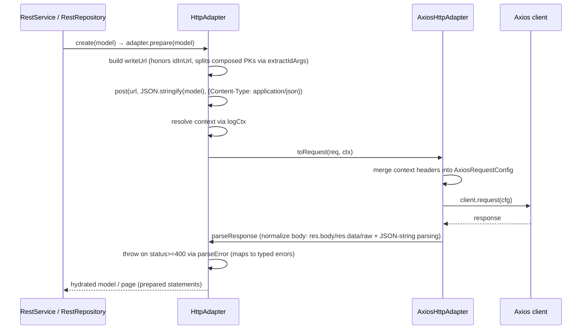
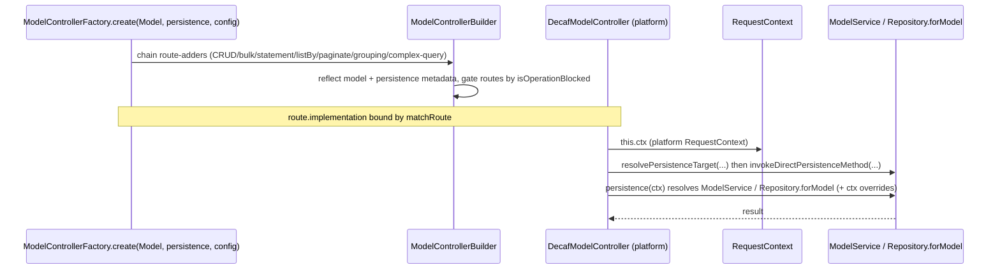
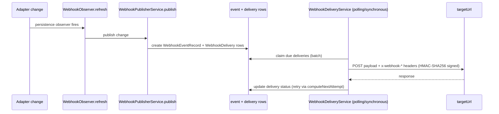
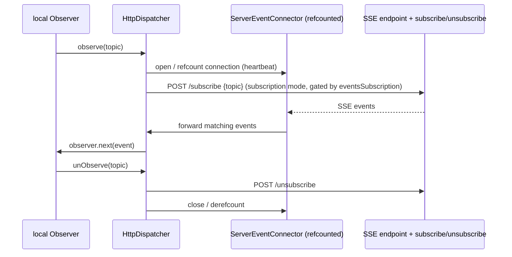

# 05 — HTTP & NestJS Backend

> Source: research brief `workdocs/ai/project/technical-docs/_research-briefs/06-http-nest.md` (read-only review; no tests/builds run; no source modified). Every statement is grounded in that brief; where the brief is thin, it says so explicitly.

## 1. Overview

The HTTP/NestJS backend of decaf-ts is split across two sibling packages:

- **`for-http` (`@decaf-ts/for-http`)** — the HTTP/REST integration layer. Provides a transport-agnostic REST adapter abstraction over `@decaf-ts/core`, a concrete Axios implementation, client-side `RestService`/`RestRepository`, a server-side controller/route builder toolset, an auth base handler, a webhook pub/sub engine, and an SSE event bridge. Sits between `core` and every platform integration.
- **`for-nest` (`@decaf-ts/for-nest`)** — the NestJS integration layer. Binds `for-http`'s server abstractions onto the NestJS runtime: a DecafModel → NestJS controller factory, module wiring, request-context pipeline, auth guards/interceptors, an SSE events module, a webhooks module, OpenAPI/Swagger tooling, an exception filter, a fluent bootstrap helper, and a CLI.

`for-nest` is essentially the Nest-binding of `for-http`'s server abstractions; the two are intentionally separated so the server primitives remain reusable by future adapters (e.g. `for-express`).

## 2. for-http

### 2.1 Identity

| Field | Value |
|:------|:------|
| Directory | `for-http` |
| Package | `@decaf-ts/for-http` |
| Description | `"http wrappers for decaf-ts"` |
| Type / license | ESM / MIT |
| Engines | `node>=20`, `npm>=10` |
| Subpath exports | `.`, `./axios`, `./server`, `./hooks` |

**Note (per brief):** there is **no** `./event` subpath export, even though `src/index.ts` re-exports the event module. Event symbols are reachable only via the root barrel.

### 2.2 Purpose & Role

`for-http` is the HTTP/REST integration layer of decaf-ts. It maps REST CRUD + bulk onto decaf repositories/services via a client-agnostic `HttpAdapter` abstraction over `core`'s `Adapter`, ships a concrete `AxiosHttpAdapter`, the `RestService`/`RestRepository` pair, a server-side controller/route builder toolset plus an auth base handler and request-context, a webhook pub/sub engine, and an SSE event bridge (`HttpDispatcher` / `ServerEventConnector`). It sits between `core` and the platform integrations (`for-nest`, `for-angular`, `for-nextjs`, `for-react`, `for-react-native`), all of which depend on it.

### 2.3 Source Layout

| Area | Files | Responsibility |
|:-----|:------|:----------------|
| Root barrel | `index.ts` | Re-exports axios/adapter/constants/HttpPaginator/HttpStatement/RestRepository/RestService/types/event; build placeholders + library registration |
| Adapter core | `adapter.ts` | `HttpAdapter` abstract base: CRUD/bulk, URL building, error parsing, SSE-aware `observe`/`unObserve`, `@query` decoration |
| Dispatch | `HttpDispatcher.ts` | `extends Dispatch`; opens `ServerEventConnector`, forwards SSE events to observers, syncs topic subscriptions via `subscribe`/`unsubscribe` POSTs |
| Pagination / statements | `HttpPaginator.ts`, `HttpStatement.ts` | Paging derived only from `findBy`/`listBy`; `build()`/`parseCondition()` throw `UnsupportedError` (prepared statements only) |
| Repositories | `RestRepository.ts`, `RestService.ts` | Statement-based find/page/listBy/findBy/findOneBy + aggregations (`countOf/maxOf/minOf/avgOf/sumOf/distinctOf/groupOf`); `allowRawStatements:false`. `RestService` adds `ignoreValidation`/`ignoreHandlers` overrides |
| Constants / types | `constants.ts`, `types.ts` | `DecafHeaders` (`x-pending-task`, `x-correlation-id`), `KeepAliveOperation`; `HttpConfig`, `HttpMethod`, `HttpRequestTransform`, `HttpRequestOptions`, `HttpResponse`, `HttpFlags`, `ResponseParser` |
| `axios/` | `axios.ts`, `constants.ts`, `types.ts`, `index.ts` | `AxiosHttpAdapter` (`getClient` builds `new Axios({baseURL})`, `toRequest` overloads, `request`, `parseResponse`, `parseError`); `AxiosFlavour`, `TaskResponseParser` (parses `x-pending-task`), `AxiosFlags` |
| `event/` | `ServerEventConnector.ts`, `types.ts`, `index.ts` | Refcounted `EventSourcePlus` connections with heartbeat; `ServerEventType`, `ServerEvent`, `SingleServerEvent`, `BulkServerEvent`, … |
| `server/` | barrel + subdirs | Controllers/transformers/constants/decorators/types/logging/auth (does **not** re-export `./hooks`) |
| `server/auth/` | `AuthHandler.ts`, etc. | Abstract `AuthHandler` (`extractFromRequest`, `requestFromContext`, `isPublicRequest`, `authorize`, role/namespace checks), `AUTH_NAMESPACE_KEY`, `AuthRequestLike`/`UserData`/`AuthData` |
| `server/controllers/` | `ControllerBuilder.ts`, `ModelControllerBuilder.ts`, `ModelControllerFactory.ts`, `RequestContex.ts`, `RouteBuilder.ts`, `controllers.ts`, `models.ts` | `ServerControllerBuilder` / `ServerMethodBuilder`; `ModelControllerBuilder` builds CRUD/bulk/statement/listBy/paginate/grouping/complex-query routes by reflecting model + persistence metadata (respects `isOperationBlocked`); `ModelControllerFactory.create`; `RequestContext`/`RequestFlags`/`RequestLogger` (IP from `x-forwarded-for`/`x-real-ip`); `DecafController`/`DecafModelController` (persistence resolution) |
| `server/transformers/` | `context.ts`, `ram.ts` | `RequestToContextTransformer` + `requestToContextTransformer(flavour)` decorator; `RamTransformer` registered for `"ram"` |
| `server/hooks/` | `constants.ts`, `decorators.ts` (`@hook`), `middleware.ts` (`WebhookSignatureMiddleware`, HMAC-SHA256), `observers.ts`, `utils.ts`, `DeliveryService.ts`, `PublisherService.ts`, `SubscriptionService.ts`, `WebhookWorkerService.ts` (almost entirely commented out — only `WebhookWorkerConfig` type exported), `models/`, `overrides/` | Webhook engine |
| Logging | `server/logging/params.ts` | Registers `ip` log parameter (side-effect import) |

**Notes (per brief):** there is no `src/overrides/` directory, despite `package.json` `sideEffects` referencing `./lib/{esm,cjs}/overrides/*`.

### 2.4 Public API Surface

Only what the brief documents is listed here.

**Client REST (`.`):** `HttpAdapter` (abstract REST adapter base), `RestRepository` (statement-based queries/aggregations), `RestService` (default repo; skips validation/handlers), `HttpStatement`, `HttpPaginator`, `HttpDispatcher` (SSE `Dispatch` bridge), `HttpConfig`/`HttpFlags`/`HttpMethod`/`HttpRequestOptions`/`HttpResponse`/`HttpRequestTransform`/`ResponseParser`, `DecafHeaders`/`KeepAliveOperation`, `ServerEventConnector` + event types (`ServerEvent`, `SingleServerEvent`, `BulkServerEvent`, `ServerEventType`, `EventHandlers`), `VERSION`/`COMMIT`/`FULL_VERSION`/`PACKAGE_NAME`.

**Axios adapter (`./axios`):** `AxiosHttpAdapter` (concrete adapter; `getClient` builds `new Axios({baseURL})`, `toRequest` overloads, `request`, `parseResponse`, `parseError`), `AxiosFlavour = "axios"`, `TaskResponseParser` (parses `x-pending-task` header), `AxiosFlags`.

**Server controllers (`./server`):** `ServerControllerBuilder`, `ModelControllerBuilder`, `ModelControllerFactory`, `ServerMethodBuilder`, `DecafController`, `DecafModelController`, `RequestContext`/`RequestFlags`/`RequestLogger`, `ServerRoute`/`RouteParam`/`RouteResponse`, `GroupingQueryFlags`/`BulkStatementFlags`/`AuthConfig`/`ModelControllerFactoryConfig`, `route`/`get`/`post`/`put`/`patch`/`del` decorators, `RequestToContextTransformer`/`requestToContextTransformer`, `RamTransformer`, `ServerKeys`/`HttpVerbs`/`ServerApiProperty`/`ServerModelRoute`/`ServerParamProps`/`ServerRouteDecOptions`, auth: `AuthHandler`/`AuthData`/`UserData`/`AuthRequestLike`/`AUTH_NAMESPACE_KEY`.

**Server hooks (`./hooks`):** `WebhookDeliveryService`, `WebhookPublisherService`/`PublishDto`, `WebhookSubscriptionService`, `WebhookSignatureMiddleware`, `WebhookObserver`/`eventToTopic`/`getWebhookFilter`, `hook` decorator, `matchesTopic`/`signWebhookPayload`/`verifyWebhookSignature`/`computeNextAttempt`/`keyToTopic`/`collectPagedResults`, `WebhookStatus`/`WebhookDeliveryMode`/`HookKey`/`DefaultHookTopics`, `WebhookAction`/`WebhookTopic`/`WebhookEnvelope`/`DeliveryServiceConfig`/`WebhookSignatureMiddlewareConfig`, models `WebhookSubscription`/`WebhookEventRecord`/`WebhookDelivery`, `WebhookWorkerConfig` (type only — the service class is commented out and not exported).

### 2.5 Architectural Patterns (and Why)

- **Transport-agnostic REST adapter.** `HttpAdapter extends Adapter<CONF,CON,REQ,Q,C>` decouples REST semantics (CRUD/bulk, URL building, error parsing, SSE-aware `observe`) from any particular HTTP client. *Why:* lets decaf swap transports (Axios today, fetch/node-fetch tomorrow) and reuse the same repository/service contracts across client SDKs (`for-angular`/`for-react`/…) without forking the persistence model. Only `request`/`toRequest` are abstract; CRUD + bulk are implemented on `HttpAdapter` and overridable.
- **Prepared-statement-only queries.** `HttpStatement.build()`/`parseCondition()` throw `UnsupportedError`; `RestRepository.statement()` builds a `PreparedStatement` routed through `adapter.toRequest`. *Why:* HTTP is a stateless transport — there is no SQL dialect to compile ad-hoc conditions against, so only the prepared-statement contract (a serialized query payload) is meaningful over the wire. `Sequence()`, raw statements, and `parseCondition()` are unsupported natively.
- **Dispatch bridge for SSE.** `HttpDispatcher extends Dispatch` opens a `ServerEventConnector` (refcounted `EventSourcePlus` connection with heartbeat), forwards SSE events to local observers, and syncs topic subscriptions via `subscribe`/`unsubscribe` POSTs when `observe`/`unObserve` fire. *Why:* lets core's `Observer`/`Dispatch` machinery transparently receive server-pushed changes, so client repositories/services stay reactive without each one owning a socket.
- **Server controllers generated from models.** `ModelControllerFactory.create(Model, persistence, config)` chains `ModelControllerBuilder` route-adders; each route's `implementation` resolves the persistence target and invokes the direct persistence method, using the platform `DecafModelController`/`RequestContext`. Route generation is gated by `isOperationBlocked`. *Why:* declarative CRUD/bulk/statement/listBy/paginate/grouping/complex-query routes are derived from model + persistence metadata, eliminating boilerplate and guaranteeing route surface parity across platforms (Nest today, Express tomorrow).
- **Request → context transformers.** `RequestToContextTransformer` + `requestToContextTransformer(flavour)` register per-flavour transformers (`RamTransformer` for `"ram"`). *Why:* platform requests carry transport-specific shape (headers, IP, body) that must be normalized into a decaf `Context` before persistence runs; per-flavour registration keeps the mapping open for extension.
- **Decorators powered by `Decoration.for(...).define().apply()`.** Powers `@query` (`PersistenceKeys.QUERY`), `@route`/`get`/…, `@hook` (topics under `HookKey`), and `requestToContextTransformer(flavour)`. *Why:* uniform metadata mechanism across decaf so builders can reflect model/persistence metadata uniformly.
- **Observer-based webhooks with delivery engine.** `WebhookObserver implements PersistenceObserver`; delivery has two modes (`POLLING`/`SYNCHRONOUS`); `getWebhookFilter` requires the `observeFullResult` context flag. *Why:* decouples "something changed" (observer) from "deliver it" (delivery engine with batching, retry via `computeNextAttempt`, replay, graceful shutdown), and signs payloads HMAC-SHA256 so receivers can verify authenticity.
- **Inbound signature verification.** `WebhookSignatureMiddleware.verify` looks up subscription by URL and verifies the signature (constant-time). *Why:* lets decaf also *receive* webhooks safely, not just emit them.

### 2.6 Lifecycle / Configuration / Environment

- Construction: `AxiosHttpAdapter(config, alias?)` → `super(config, AxiosFlavour, alias)`; base constructor defaults `headers` and `events` to `true` when undefined.
- Client: `AxiosHttpAdapter.getClient()` returns `new Axios({ baseURL: `${protocol}://${host}` })` — uses the `Axios` class, not the shared default instance.
- No adapter-level `build()` config method exists; `build()` exists only on builders and `HttpStatement.build()` (which throws).
- `HttpConfig`: required `protocol`/`host`; optional `parsers`, `eventsListenerPath`, `headers`, `events`, `eventsSubscription`, `eventHeaderResolver`, `idInUrl` (default `true`).
- Flavours: `AxiosFlavour = "axios"`; custom adapters pass their own flavour string.
- **Env vars: none — no `process.env` usage anywhere in `src/`.**
- SSE lifecycle: `HttpDispatcher.initialize()`→`startListening()` requires `eventsListenerPath` (else throws `InternalError`); `events:false` disables SSE; `eventsSubscription` gates subscription mode; `close()` unsubscribes + closes the connector.

### 2.7 Data & Control Flow

#### Client REST request



`parseError` maps status codes to typed errors: 404→`NotFoundError`, 409→`ConflictError`, 400→`BadRequestError`, 422→`ValidationError`, plus `QueryError`/`PagingError`/`UnsupportedError`/`AuthorizationError`/`ForbiddenError`/`ConnectionError`/`SerializationError`, fallback `InternalError`.

#### Server controller → repository → persistence



#### Webhook delivery



Inbound: `WebhookSignatureMiddleware.verify` looks up the subscription by URL and verifies the signature (constant-time).

#### SSE subscription (client side, via HttpDispatcher)



### 2.8 Testing

Per brief: ~22 suites / 133 passing tests (green); coverage thresholds intentionally low (branches 20, functions 30, lines 42, statements 41).

- `tests/unit/`: adapter, aggregation, auth-primitives, composed-model, debug-metadata, `HttpDispatcher` start-listening, `ModelControllerFactory`, repository, rest, `server-controller-builder`, server-decorators, `server-model-controller-builder`, `server-ram-transformer`, `webhook-signature-middleware`.
- `tests/integration/`: axios adapter (+ prepared), http-query, http.adapter, rest.service (+ rest.service2), webhook-engine, webhook-index, webhook-signature-middleware. Helpers `FastifyAdapter.ts`/`FastifyRepo.ts` use the `fastify` **devDependency** (no runtime Fastify adapter exists).
- Notable gaps: `HttpDispatcher` has only one unit test (start-listening); no tests for `syncSubscriptions`, subscription POSTs, `close` cleanup, or event-forwarding errors; `ServerEventConnector` has no dedicated test; `WebhookWorkerService` is commented out (untested, non-functional); `DecafController`/`DecafModelController.logCtx` overrides have no direct tests; all integration tests use mocked clients (no real-server tests).

### 2.9 Usage Example (real, from tests)

```ts
// tests/integration/axios.adapter.integration.test.ts:9-30 (abridged)
class TestAxiosAdapter extends AxiosHttpAdapter {
  private impl: any;
  constructor(config: HttpConfig, impl: any, alias?: string) {
    super(config, alias);
    this.impl = impl;
  }
  protected override getClient(): any { return this.impl; } // stub the axios client
}
const config: HttpConfig = { protocol: "https", host: "example.com" };
const adapter = new TestAxiosAdapter(
  config,
  { request: async (d: any) => ({ ok: true, d }) },
  `axios-${Math.random()}`
);
const ctx = new Context().accumulate({ logger: Logging.get() });
const res = await adapter.request<any>({ url: "https://example.com" } as any, ctx);
expect(res.ok).toBe(true);
```

```ts
// tests/unit/adapter.test.ts:18-51 (abridged) — AxiosHttpAdapter with a mocked client
adapter = new AxiosHttpAdapter({ protocol: "http", host: "localhost:8080" });
requestMock = jest.spyOn(adapter.client as Axios, "request");
requestMock.mockImplementation(async (details: any) => ({
  status: 200,
  body: { method: details.method, url: details.url, data: details.data },
}));
```

### 2.10 Relationships

| Module | Relationship |
|:-------|:-------------|
| `core` | Foundational — `HttpAdapter extends Adapter`, `RestRepository extends Repository`, `HttpDispatcher extends Dispatch`, `HttpStatement extends Statement`, `HttpPaginator extends Paginator`; uses `Context`, `PreparedStatement`, `Observer`/`ObserverFilter`, `ModelService`, `Service`, `ClientBasedService`, `Repository.forModel`, `isOperationBlocked`, `Lock` |
| `db-decorators` | Error classes (`NotFoundError`, `ConflictError`, `BadRequestError`, `ValidationError`, `InternalError`, …), `OperationKeys`/`BulkCrudOperationKeys`, `PrimaryKeyType`, `DBKeys.COMPOSED`, `Contextual`, `wrapMethodWithContext` |
| `decoration` | `Metadata`, `Decoration.for(...).define().apply()`, `methodMetadata`, `Constructor`, `uses` — powers `@query`/`@route`/`@hook`, `Model.hooks` override, `requestToContextTransformer` |
| `decorator-validation` | `Model`, `ModelConstructor`, `ModelArg`, validation decorators, `Serialization` (used in `ServerEventConnector`) |
| `injectable-decorators` / `logging` / `transactional-decorators` | DI, `Logger`/`Logging`/`logParameterRegistry`/`toKebabCase`, `Lock` for `ServerEventConnector` and `WebhookDeliveryService` |
| `for-nano` (devDep) | Used in webhook tests/examples as the persistence adapter |
| `for-nest` | Primary server-side consumer (uses `AuthHandler`, `ModelControllerFactory`/builders, `RequestContext`, `DecafController`, the webhook engine, and the SSE bridge) |
| `for-angular` / `for-nextjs` / `for-react` / `for-react-native` | Depend on the client REST stack |

### 2.11 Consumer Notes / Trade-offs

- Defaults: `idInUrl` defaults `true`; `config.headers`/`config.events` default `true`; webhook `maxAttempts` default 12; `pollIntervalMs` 5000, `batchSize` 50, `gracefulShutdownMsTimeout` 30000.
- `RestService` sets `ignoreValidation:true`/`ignoreHandlers:true` — server-side validation/decoration is skipped by default; use `RestRepository` when you need decoration logic.
- `Sequence()`, `parseCondition()`, `HttpStatement.build()` throw `UnsupportedError` — HTTP adapters only support prepared statements natively.
- SSE requires `eventsListenerPath` (else `startListening` throws); subscription mode requires server `subscribe`/`unsubscribe` endpoints.
- `WebhookDeliveryService.refresh` requires the `observeFullResult` context flag.
- `WebhookWorkerService` is commented out / non-functional (only a type is exported).
- `RequestContext`/`DecafController` are abstract; platform integrations must subclass them.
- Maturity signals: ~22 suites/133 passing tests (green); coverage thresholds intentionally low; many `as any` casts and `eslint-disable` markers. All `@decaf-ts/*` deps pinned to `"latest"` (drift risk).

## 3. for-nest

### 3.1 Identity

| Field | Value |
|:------|:------|
| Directory | `for-nest` |
| Package | `@decaf-ts/for-nest` |
| Description | `"NestJS decaf integration"` |
| Type / license | ESM / MIT |
| Engines | `node>=20`, `npm>=10` |
| Subpath exports | `.`, `./cli`, `./webhooks` |
| Bin | `for-nest` → `lib/cjs/bin/cli.cjs` |

### 3.2 Purpose & Role

`for-nest` is the NestJS integration layer of decaf-ts. It adapts decaf's persistence/observer/auth stack onto the NestJS runtime: a DecafModel→NestJS controller factory (turning decorated decaf `Model`s into fully wired `@Controller` classes with CRUD/bulk/statement/aggregation/query routes and Swagger metadata), module wiring (`DecafModule`/`DecafCoreModule`), auth guards/interceptors, a request-context pipeline, an SSE events module, a webhooks module, OpenAPI/Swagger tooling, an exception filter, a fluent bootstrap helper, and a CLI (`boot`/`migrate`/`export-api`). It sits on top of `core`/`db-decorators`/`decorator-validation`/`decoration`/`injectable-decorators`/`logging`/`transactional-decorators` and especially `for-http`, whose server abstractions it binds to Nest.

### 3.3 Source Layout

| Area | Files | Responsibility |
|:-----|:------|:----------------|
| Root barrel | `index.ts` | Side-effect-imports `./decoration`; aggregates sub-barrels; registers the library (`Metadata.allowReregistration` toggle); build placeholders. **`// export * from "./webhooks";` is commented out (`index.ts:41`) — webhooks are subpath-only** |
| Constants / types | `constants.ts`, `types.ts` | DI tokens (`DECAF_MODULE_OPTIONS`, `DECAF_ADAPTER_ID`, `DECAF_TASK_SERVICE_ID`, `DECAF_HANDLERS`, `DECAF_EXPOSE`, `DECAF_CONTROLLER_CONFIG`, `DECAF_ROUTE`, `DECAF_CONTEXT_KEY`) + `DecafServerFlags`/`DecafServerCtx`; `DecafRequestHandler`, `ObserverEventsOptions` (incl. `subscriptionMode`), `DecafModuleOptions`, `AuthHandler` alias |
| Controllers | `controllers.ts` | Abstract `DecafController` and `DecafModelController<M>` (persistence resolution) |
| Module | `module.ts`, `core-module.ts` | `DecafModule` (static `forRootAsync`; empty `runMigrations()` stub); `@Global()` `DecafCoreModule` — `forRoot`, `bootPersistence` (PersistenceService + transformer registration), `APP_INTERCEPTOR` registration, `OnApplicationShutdown` |
| CLI | `cli-module.ts`, `bin/cli.ts` | Commander `nest` CLI (`boot`/`migrate`/`export-api`) + helpers (`resolveInputPath`, `buildOutputFilePath`, `resolveMigrateCommandConfig`, `buildFileVersionHandlers`); `bin/cli.ts` imports the default `nest()` and `parseAsync(process.argv)` |
| DI bridge | `decorators.ts`, `decoration.ts` | `@Service(key?)`/`@Repository(model, flavour?)` parameter decorators + `getRegisteredDecafProviders()`; `Decoration.for(...).extend(...)` for Injectables/Inject + validation keys → `ApiProperty`; `PersistenceKeys.AUTH` → `Auth` |
| Swagger / utils | `swagger-types.ts`, `utils.ts` | Local Swagger type interfaces; `repoForModel(modelName)` |
| `decaf-model/` | `DecafModelModule.ts`, `FromModelController.ts`, `types.ts`, `utils.ts`, `decorators/` | `getModuleFor(flavour)` → per-flavour `@Module` with `forRoot` generating controllers; `FromModelController.create(model,…)` produces a Nest `@Controller` with CRUD/bulk/statement/aggregation/query routes + Swagger; `matchRoute` routing table; complex-query handlers; decorators (`ApiOperationFromModel`/`BulkApiOperationFromModel`, `ApiParamsFromModel`, `DecafBody`, `DecafParams`/`DecafQuery`/`OrderedParams`, `controllerConfig`, `expose`, `Auth`, …) |
| `auth/` | `AuthInterceptor.ts`, `AuthMiddleware.ts`, `DecafAuthHandler.ts`, `DecafAuthModule.ts`, `decorators.ts`, `constants.ts`, `index.ts` | Request-scoped `AuthInterceptor` (`authorize` + `applyTransformers`); request-scoped `AuthMiddleware` (contextualize + `prime`); `DecafAuthHandler` (Bearer-as-role) + `DecafRoleAuthHandler` alias; `DecafAuthModule.forRoot` (registers interceptor/middleware; global `APP_INTERCEPTOR` when `global`); `Auth`/`Public`/`RequireRoles`/`RequireNamespaces` |
| `request/` | `DecafRequestContext.ts`, `DecafHandlerExecutor.ts`, `DecafResponseInterceptor.ts`, `contextualize.ts`, `DecafAuthHandler.ts` (re-export shim), `index.ts` | `DecafRequestContext` (request-scoped, extends for-http `RequestContext`); `DecafHandlerExecutor` (runs `DecafRequestHandler[]`); `DecafResponseInterceptor`; `contextualizeRequestContext` + `extractIp` |
| `interceptors/` | `DecafRequestHandlerInterceptor.ts`, `index.ts` | Global contextualize+exec interceptor (re-exports it + `AuthInterceptor`) |
| `overrides/` | `overrides.ts`, `Adapter.ts`, `ModelBuilderExtensions.ts`, `decoration.ts`/`constants.ts`/`helpers.ts` (Swagger metadata writers), `logging.ts`, `index.ts` | Monkey-patches `Adapter.transformerFor`/`flavoursToTransform` and `Context.prototype.toResponse`; `ModelBuilder.Auth(model)` + class-decorator-aware `build()`; `logging.ts` side-effect: `import "@decaf-ts/for-http/server"` |
| `events-module/` | `DecafStreamModule.ts`, `EventsController.ts`, `EventsSubscriptionController.ts`, `ObserverSubscriptionRegistry.ts`, `constant.ts`, `utils.ts`, `index.ts` | `DecafStreamModule.forFlavours(flavours, path, options)`; `EventsController` `@Sse() listen()` + `@Sse("/:model") listenForModel(model)` (observer registration, heartbeat, fingerprint claim/release, subscription filtering); `EventsSubscriptionController` `POST subscribe`/`unsubscribe`; in-memory topic/connection registry; `LISTENING_ADAPTERS_FLAVOURS`/`OBSERVER_EVENTS_OPTIONS`; `resolveRequesterFingerprint`, `eventTopicFor` |
| `webhooks/` | `DecafWebhookModule.ts`, `controllers.ts`, `types.ts`, `index.ts` | `forRoot`/`forRootAsync` (boots own persistence; generates `FromModelController` CRUD for the three webhook models + action controllers; alias `DecafWebhooksModule`; empty `runWebhooksMigrations` stub); `WebhookSubscriptionActionsController` deactivate/reactivate, `WebhookEventActionsController` replay; `DecafWebhookModuleOptions` |
| `factory/` | `NestBootstraper.ts`, `errors/cors.ts` (`CorsError`), `errors/throttling.ts` (`ToManyRequestsError` — **not re-exported**), `exceptions/DecafErrorFilter.ts`, `exceptions/decorators.ts` (`UseDecafFilter`/`UseDecafHeaders`), `openapi/SwaggerBuilder.ts`, `openapi/DtoBuilder.ts` (`DtoFor(op, model)`), `openapi/SwaggerCustomUI.ts`, `openapi/constants.ts`, barrels | Fluent static bootstrapper; exception filter maps `HttpException`→`BaseError`; OpenAPI builders |

### 3.4 Public API Surface

**DecafModel controllers/factory:** `FromModelController`, `getModuleFor(flavour)`, `expose`, `controllerConfig`, `Auth`, `ApiOperationFromModel`/`BulkApiOperationFromModel`, `ApiParamsFromModel`, `DecafBody`, `DecafParams`/`DecafQuery`/`OrderedParams`, `DecafParamProps`, route/decorator helpers (`applyApiDecorators`, `createRouteHandler`, `defineRouteMethod`, `getApiDecorators`, `resolvePersistenceMethod`).

**Auth:** `DecafAuthHandler`/`DecafRoleAuthHandler`, `AuthInterceptor`, `AuthMiddleware`, `DecafAuthModule`, decorators `Auth`/`Public`/`RequireRoles`/`RequireNamespaces`, tokens (`AUTH_HANDLER`, `AUTH_META_KEY`, `IS_PUBLIC_KEY`, `REQUIRED_ROLES_KEY`, `REQUIRED_NAMESPACES_KEY`, `SKIP_MODEL_ROLES_KEY`, `SKIP_MODEL_NAMESPACES_KEY`), re-exported for-http types (`AuthHandler as AuthHandlerBase`, `AuthData`, `UserData`, `AuthRequestLike`).

**Events/SSE:** `DecafStreamModule`, `EventsController`, `EventsSubscriptionController`, `ObserverSubscriptionRegistry`, tokens `LISTENING_ADAPTERS_FLAVOURS`/`OBSERVER_EVENTS_OPTIONS`.

**Webhooks (`./webhooks` subpath only):** `DecafWebhookModule` (+ alias `DecafWebhooksModule`), `WebhookSubscriptionActionsController`, `WebhookEventActionsController`, `DecafWebhookModuleOptions`.

**Interceptors/request pipeline:** `DecafRequestHandlerInterceptor`, `AuthInterceptor`, `DecafRequestContext`, `DecafHandlerExecutor`, `DecafResponseInterceptor`, `contextualizeRequestContext`.

**Decorators (DI bridge):** `Service`, `Repository`, `getRegisteredDecafProviders`.

**Core/module:** `DecafModule.forRootAsync`, `DecafCoreModule`, `runMigrations` (empty stub), `DecafModuleOptions`/`ObserverEventsOptions`/`DecafRequestHandler`, `DecafController`/`DecafModelController`, DI tokens.

**Factory/bootstrap/OpenAPI/exceptions:** `NestBootstraper` + `SwaggerSetupOptions`, `SwaggerBuilder`, `DtoFor`, `SwaggerCustomUI`, `SwaggerOptions`/`SWAGGER_UI_CONSTANTS`, `DecafExceptionFilter`, `UseDecafFilter`/`UseDecafHeaders`, `CorsError`. **`ToManyRequestsError` is not re-exported** through `factory/errors/index.ts` (only `cors` is).

**CLI (`./cli` subpath):** default `nest()` program + `migrateCommand`/`bootCommand` + helpers.

**Overrides:** `Adapter` augmentation, `DECORATORS`/`DECORATORS_PREFIX`, `ApiProperty`/`createApiPropertyDecorator`/`createPropertyDecorator`/`getEnumValues`, `ModelBuilder` extensions (side-effect).

**Swagger types:** `SecuritySchemeObject`, `SchemaObject`, `ReferenceObject`, `EnumAllowedTypes`, `EnumSchemaAttributes`, `SchemaObjectMetadata`, `SwaggerEnumType`.

### 3.5 Architectural Patterns (and Why)

- **DecafModel controller factory.** `DecafModelModule.forRoot(flavour, options)` filters `Adapter.models(flavour)` by exposure (`isExposed`, honoring `controllerExposure` overrides or `@expose`), warms `ModelService.forModel`, optionally creates `${ModelName}Service` providers, then maps each model through `FromModelController.create(model, controllerConfig, globalDefaults)`. `create` resolves persistence (`getPersistence`: `Service.get` → `ModelService.getService` → `Repository.forModel`), merges config (module defaults ⊕ `@controllerConfig` ⊕ per-model), delegates CRUD route generation to `ModelControllerFactory` (from `for-http/server`), then attaches Nest verb decorators + Swagger + param decorators via `matchRoute`. Class-level auth is applied via `applyClassAuth`. Complex `@query`/`@route` methods become routes via `createQueryRoutesFromRepository`/`createComplexQueryHandler`. *Why:* a single declarative entry point produces a fully wired, Swagger-documented Nest controller surface from a decorated model, with per-model config overrides and operation-blocking respected.
- **Auth guards/interceptors.** `AuthInterceptor` is request-scoped; reads reflector metadata, calls `authHandler.authorize(...)`, then `applyTransformers()` (iterating `Adapter.flavoursToTransform()` accumulating `transformer.from(requestContext)`). `AuthMiddleware` contextualizes the request context and best-effort `authHandler.prime`. `DecafAuthModule.forRoot` registers the interceptor/middleware and (when `global`) a global `APP_INTERCEPTOR`. *Why:* Nest's middleware→interceptor→guard pipeline is the natural place to convert an inbound HTTP request into a decaf auth context and run role/namespace checks before any handler runs.
- **NestJS module wiring.** `DecafModule.forRootAsync` first `await DecafCoreModule.bootPersistence` (creates `PersistenceService`, boots adapters, registers `RequestToContextTransformer`s, runs `options.initialization()`), then builds imports — optionally per-flavour `DecafModelModule`s (when `autoControllers`) and `DecafStreamModule` (when `observerOptions.enableObserverEvents`). `DecafCoreModule` is `@Global()`, provides the request-context pipeline, registers the global `DecafRequestHandlerInterceptor`, drains `getRegisteredDecafProviders()`, and implements `OnApplicationShutdown`. *Why:* a single `forRootAsync` composes persistence, controllers, events, and DI registration so a Nest app can boot decaf with one import.
- **Request-context pipeline.** `DecafRequestContext` is request-scoped (`@Inject(REQUEST)`). `contextualizeRequestContext` accumulates `DefaultAdapterFlags`, `headers`, `logger` (IP-scoped), `timestamp`, `operation`, guarded by `__decafRequestContextContextualized` (runs once). `DecafRequestHandlerInterceptor` contextualizes then `executor.exec` runs the handler chain. *Why:* every decaf persistence call needs a `Context`; centralizing contextualization (once per request) and running a pluggable handler chain keeps handlers thin and context consistent.
- **SSE events module.** `DecafStreamModule.forFlavours` registers `EventsController` (+ subscription controller in subscription mode) under a `RouterModule` prefix. `EventsController.listen()` resolves a requester fingerprint (`resolveRequesterFingerprint`), claims a single connection per fingerprint via the registry (else `ConflictError`), registers an `Observer` per adapter (with a topic `ObserverFilter` in subscription mode), merges a 15s heartbeat, and tears down `unObserve`+`releaseConnection`. *Why:* SSE gives decaf a server-push channel for observer events; fingerprint-claiming prevents runaway connections and subscription mode enables per-subscriber topic filtering.
- **Webhooks.** `DecafWebhookModule` boots its own `PersistenceService` (separate from `DecafModule`), mutates `Adapter._cache` with webhook keys, registers transformers, and builds controllers for the three webhook models plus action controllers, mounted under `webhookApiPath`. *Why:* webhooks are a self-contained subsystem with their own persistence and action routes; isolating its persistence avoids coupling to the app's main adapters.
- **Decorators/DI bridge.** `@Service`/`@Repository` register Nest factory providers under `${ModelName}Service`/`${ModelName}Repository` then apply `@Inject(token)`. `decoration.ts` makes decaf validation decorators also emit Swagger metadata via local `ApiProperty`. `overrides/overrides.ts` monkey-patches `Adapter`/`Context`. *Why:* bridges decaf's decorator-based DI onto Nest's DI and makes a single model decoration drive both validation and OpenAPI documentation.

### 3.6 Lifecycle / Configuration / Environment

- Bootstrap: `DecafModule.forRootAsync(options)` (returns `Promise<DynamicModule>`) → `DecafCoreModule.bootPersistence` (PersistenceService + transformers + `initialization()`) → `DecafCoreModule.forRoot` (global interceptor + providers) → per-flavour controller modules → shutdown via `OnApplicationShutdown` (adapter + `Service.shutdown()`).
- `forRoot`/`forRootAsync` patterns: `DecafModule.forRootAsync`, `DecafCoreModule.forRoot`/`bootPersistence`, `DecafAuthModule.forRoot`, `DecafStreamModule.forFlavours`, `DecafWebhookModule.forRoot`/`forRootAsync`, `getModuleFor(flavour).forRoot(...)`.
- Flavours drive controller generation (`Adapter.models(flavour)`), SSE listeners (`LISTENING_ADAPTERS_FLAVOURS`), transformer registration, and `controllerExposure` arrays.
- **Env/`process.env` (from brief):** `NestBootstraper.start` reads `process.env.PORT` (default 3000); `DecafExceptionFilter` reads `LoggedEnvironment.env === "production"` (via decaf logging env); CLI migrate reads `package.json` `decaf.migration` config; `test:manual` uses `MANUAL_INSPECT`/`MANUAL_INSPECT_TIMEOUT`. No other `process.env` reads in `src/`.
- OpenAPI: `NestBootstraper.setupSwagger` → `SwaggerBuilder` → `SwaggerModule.setup` + optional JSON/YAML raw routes. CLI `export-api` boots a headless Nest context and writes OpenAPI JSON.
- CLI: `nest` program (`boot`/`migrate`/`export-api`) published as bin `for-nest` and `./cli` subpath.

### 3.7 Data & Control Flow (auto-generated controller request)

```mermaid
sequenceDiagram
    participant Req as HTTP request
    participant Middleware as AuthMiddleware
    participant AuthInt as AuthInterceptor
    participant ReqInt as DecafRequestHandlerInterceptor
    participant Route as route handler (matchRoute)
    participant Ctrl as DecafModelController.persistence(ctx)
    participant Persist as Adapter (Ram/Nano/TypeORM/Fabric)
    participant Resp as DecafResponseInterceptor
    Req->>Middleware: contextualize request context + authHandler.prime
    Middleware->>AuthInt: (skips on @Public())
    AuthInt->>AuthInt: authHandler.authorize(...) + applyTransformers()
    AuthInt->>ReqInt: contextualize(req) then executor.exec(req,res) runs DecafRequestHandler[]
    ReqInt->>Route: bound route.implementation (standard CRUD) or createComplexQueryHandler (@query)
    Note over Route: param decorators supply body (DecafBody=new ModelConstr(body)), ordered path params (DecafParams/OrderedParams), parsed query (DecafQuery)
    Route->>Ctrl: resolvePersistenceTarget(...) then invokeDirectPersistenceMethod(...)
    Ctrl->>Persist: ModelService / Repository.forModel (+ ctx.toOverrides())
    Persist-->>Ctrl: result
    Ctrl-->>Resp: response
    Resp->>Resp: ctx.toResponse(response) (monkey-patched; adds x-pending-task when pending)
    Note over Resp: on error → DecafExceptionFilter maps/logs
```

### 3.8 Testing

Per brief: broad e2e/integration coverage; pre-1.0 maturity.

- `tests/unit/`: `DecafExceptionFilter`, `DtoFor` (+ swagger), auth-module, cli-boot/cli-exported-swagger/cli-migrate/cli-module commands, controller-find-page, controller-persistence-binding, model-builder.extensions, model-controller-builder-parity, observer-subscription-registry, request-contextualize, webhooks-module (+ model fixtures).
- `tests/integration/`: multi-adapter/task/migration tests (`cli-migrate.multi-adapter`, `decaf-model-exposure`, `migration.*`, `service-repository-decorators`, `task-events`, `task-model-observables`, `webhooks-module`) + `helpers/`/`fixtures/`.
- `tests/e2e/`: supertest/eventsource end-to-end (`AuthExecutionOrder`, `AuthHandler`, `DecafExceptionFilter-logging`, `DecafModelModule(-byAdapter)`/`(-openApi)`, `DecafRequestHandlerInterceptor`, `NestBootstraper`, `request-logger-propagation`, `sse-concurrency-regression`, `swagger`, `task-events`, `events-subscriptions`, `listen-server-events`, `listen-service-events(-multi-adapter)`), plus the headline `decaf-model-controller-builder.e2e.test.ts` (gated by `MANUAL_INSPECT` for manual Swagger inspection) and `fakes/` fixtures.
- `test:manual` runs the controller-builder e2e with `MANUAL_INSPECT=true`.
- Notable gaps: e2e file name references `DecafModelControllerBuilder` (no such class — builder is `FromModelController`); no dedicated unit tests for `SwaggerBuilder`/`SwaggerCustomUI`/`NestBootstraper`/`DecafResponseInterceptor`/`WebhookEventActionsController.replay`; stale coverage HTML references files no longer in `src/`.

### 3.9 Usage Examples (real, from tests)

```ts
// tests/app.ts:18-32 (abridged) — minimal bootstrap (auto controllers + Swagger)
const app = await NestFactory.create(
  DecafModule.forRootAsync({
    conf: [[RamAdapter, {}, new RamTransformer()]],
    autoControllers: true,
    autoServices: false,
  })
);
const documentFactory = () => SwaggerModule.createDocument(app, config);
SwaggerModule.setup("api", app, documentFactory);
app.useGlobalFilters(new DecafExceptionFilter(app.get(ModuleRef, { strict: false })));
await app.init();
```

```ts
// tests/e2e/NestBootstraper.e2e.test.ts:27-41 (abridged) — fluent bootstrap
const nest = await NestBootstraper.initialize(app)
  .enableLogger().enableCors("*").useHelmet()
  .setupSwagger({ title: "Test API", description: "Test Swagger setup", version: "1.0.0",
                  path: "api", openApiJsonPath: "api-json", openApiYamlPath: "/api-yaml" })
  .useGlobalFilters();
nest.start(3000, "0.0.0.0");
```

```ts
// tests/e2e/decaf-model-controller-builder.e2e.test.ts:178-222 (abridged) — exposed model
@uses(RamFlavour) @table("cfg_order") @model() @expose("ram")
@controllerConfig({
  allowBulkStatement: { create: true, read: true, update: false, delete: false },
  allowGroupingQueries: { count: true, sum: true, avg: true, max: false, min: false, distinct: false, group: false },
})
class ConfigOrder extends Model {
  @pk({ type: String, generated: false }) @composed(["orderCode", "customerId"], ":", true) id!: string;
  @defaultQueryAttr() @column() @required() orderCode!: string;
  @defaultQueryAttr() @column() @required() customerId!: string;
  @defaultQueryAttr() @column() @required() amount!: number;
  @manyToOne(() => ConfigCustomer, { update: Cascade.CASCADE, delete: Cascade.CASCADE }, false) customer?: string | ConfigCustomer;
  constructor(arg?: ModelArg<ConfigOrder>) { super(arg); }
}
```

### 3.10 Relationships

| Module | Relationship |
|:-------|:-------------|
| `core` | `Adapter`, `PersistenceService`, `ModelService`, `Repository`, `Service`, `Context`, `UUID`, `Observer`/`ObserverFilter`, `PersistenceKeys`/`PreparedStatementKeys`, `DefaultAdapterFlags`, `TaskModel`, `isOperationBlocked`, migrations (`SemverMigrationVersioning`, `MigrationService`), `RamAdapter` (in tests) |
| `db-decorators` | Error classes, `OperationKeys`/`BulkCrudOperationKeys`, `DBKeys`, `BlockOperations` (error mapping, DTO building, operation-blocking) |
| `for-http` (closest sibling) | `DecafController` (HTTP base), `RequestContext`, `AuthHandler`/`AuthData`/`UserData`/`AuthRequestLike`, `RequestToContextTransformer`/`requestToContextTransformer`, `ModelControllerFactory`/`ModelControllerFactoryConfig`/`AuthConfig`/`ServerRoute`/`ServerApiProperty`/`ServerParamProps`/`HttpVerbs`, `RamTransformer`, `matchesTopic`, webhook models `WebhookSubscription`/`WebhookEventRecord`/`WebhookDelivery`/`WebhookStatus`/`collectPagedResults`. for-nest is essentially the Nest-binding of for-http's server abstractions |
| `decoration` / `decorator-validation` / `injectable-decorators` / `logging` / `transactional-decorators` | `Metadata`/`Decoration.for(...).extend().apply()`; `Model`/`ModelBuilder` (extended in `ModelBuilderExtensions`); mapped onto Nest `@Injectable`/`@Inject`; context-bound loggers; transactional wiring via core |
| NestJS | `@nestjs/common`/`core`/`swagger` — modules, DI, interceptors/middleware/filters, `RouterModule`, `NestFactory`, route/param decorators, `Sse`/`MessageEvent`, `DocumentBuilder`/`SwaggerModule`/`Api*`. External: `commander` (CLI), `yaml` (OpenAPI YAML), `lodash` (overrides helpers), `helmet` (optional, dynamically required) |
| Consumer: `integrations` | `integrations/src/nest/` adds `namespace`, `keycloakAuthHandler`, `keycloakModule` |

### 3.11 Consumer Notes / Trade-offs

- **Webhooks are not in the main barrel.** `src/index.ts:41` has `// export * from "./webhooks";` commented out — import from `@decaf-ts/for-nest/webhooks`.
- `DecafModule.forRootAsync` returns `Promise<DynamicModule>`; Nest tolerates a `Promise` in `imports`, but be aware the call is async.
- `DecafWebhookModule` boots its own persistence (separate from `DecafModule`) and mutates `Adapter._cache` with webhook keys — do not share adapter aliases blindly.
- `DecafAuthModule` does not re-register the request-handler interceptor (`DecafCoreModule` does that globally); it only adds `AuthInterceptor` as a global `APP_INTERCEPTOR` when `global:true`.
- Auth default: when `AuthConfig` is omitted on a model, `@Auth(Model)` is applied by default (auth + model-level role checks required).
- Defaults: `autoServices` false; `aggregations` behaviourally true (only `false` disables); `observerApiPath` `/events`; `webhookApiPath` `/webhooks`; `NestBootstraper.start` port `process.env.PORT || 3000`.
- `ToManyRequestsError` is not re-exported through `factory/errors` (only `cors`); it is internal to `DecafErrorFilter`.
- Empty stubs: `runMigrations()` and `runWebhooksMigrations()` are no-ops exported in the public surface — likely placeholders.
- `sideEffects`: `decoration.js`, `overrides/index.js`, `overrides/overrides.js` are marked side-effectful (they install `Decoration.for(...).extend` and `Adapter`/`Context` patches) — tree-shakers must not drop them.
- Maturity signals: pre-1.0; broad e2e/integration coverage; CI badges; migration/task CLI present but `DecafCoreModule.migrate` documented in README does not exist in code (see inaccuracies).

## 4. Inaccuracies (from brief, not fixed)

Recorded exactly as the brief lists them. Nothing was fixed.

### for-http

1. **[for-http] HttpAdapter generic signature wrong in docs** — README/Description list `HttpAdapter<Y, CON, Q, F, C>`. Actual is `<CONF extends HttpConfig, CON, REQ, Q extends PreparedStatement, C extends Context<HttpFlags>>` (`adapter.ts:116-122`); docs omit `REQ`, mislabel `Q`, and invent a standalone `F`. | Evidence: `README.md:48`; `workdocs/4-Description.md:14`; `src/adapter.ts:116-122` | Suggested fix: document generics as `<CONF, CON, REQ, Q, C>`, drop `F`.
2. **[for-http] RestService/RestRepository generic signature wrong in docs** — README lists `RestService<M, Q, A, F, C>` / `RestRepository<M, Q, A, F, C>`. Actual is `<M, A, Q>` only. | Evidence: `README.md:55,59`; `src/RestService.ts:54-58`; `src/RestRepository.ts:51-55` | Suggested fix: update to `<M, A, Q>`.
3. **[for-http] "Declares abstract request(), create(), read(), update(), delete()" is false** — only `request`/`toRequest` are abstract; CRUD + bulk are implemented in `HttpAdapter`. | Evidence: `README.md:52`; `src/adapter.ts:403-417,579-770` | Suggested fix: state only `request`/`toRequest` are abstract; CRUD is implemented/overridable.
4. **[for-http] "parseError() currently returns the error unchanged" is false** — `parseError` maps messages to typed errors (404→`NotFoundError`, 409→`ConflictError`, 400→`BadRequestError`, 422→`ValidationError`, plus `QueryError`/`PagingError`/`UnsupportedError`/`AuthorizationError`/`ForbiddenError`/`ConnectionError`/`SerializationError`, fallback `InternalError`). | Evidence: `README.md:79`; `src/adapter.ts:853-886` | Suggested fix: describe the actual mapping.
5. **[for-http] HttpFlags base class wrong in docs** — docs say "Extends RepositoryFlags". Actual `HttpFlags extends AdapterFlags`. | Evidence: `README.md:47`; `src/types.ts:86` | Suggested fix: replace `RepositoryFlags` with `AdapterFlags`.
6. **[for-http] AuthHandler example uses non-existent method `extractFromAuth`** — the abstract method is `extractFromRequest(request: AuthRequestLike)`; the example also omits required abstracts `requestFromContext` and `isPublicRequest`, so it would not compile. | Evidence: `README.md:289`; `src/server/auth/AuthHandler.ts:45,57,115` | Suggested fix: rename to `extractFromRequest`, add the missing abstracts.
7. **[for-http] README subclassing example passes wrong generics/signatures** — declares `extends HttpAdapter<HttpConfig, MyClient, MyRequestConfig, MyFlags, MyContext>` (4th generic is `Q`, not flags) and overrides `create(table: string, …)` with `string` tables, but real signatures use `Constructor<M>`. | Evidence: `README.md:327`; `src/adapter.ts:116-122,579-701` | Suggested fix: use correct generics and `Constructor<M>` table param.
8. **[for-http] "RestService manages observers" overstates RestService** — `RestService` adds no observer logic; those are inherited from core `Repository`/`Adapter` + `HttpDispatcher`. | Evidence: `README.md:58`; `src/RestService.ts` | Suggested fix: clarify observers are inherited, not implemented by `RestService`.
9. **[for-http] "Bulk ops delegate to base Adapter (expected to exist)" is misleading** — bulk methods are concretely implemented on `HttpAdapter` (`createAll`/`readAll`/`updateAll`/`deleteAll`) using `/bulk` segments. | Evidence: `README.md:82`; `src/adapter.ts:595-758` | Suggested fix: state bulk ops are implemented on `HttpAdapter`.
10. **[for-http] `fastify` is a keyword but only a devDependency** — there is no runtime Fastify adapter; `fastify` appears only in devDependencies and test helpers. | Evidence: `package.json:103,122`; `tests/integration/FastifyAdapter.ts` | Suggested fix: remove `"fastify"` from keywords (or add a runtime adapter + dependency).
11. **[for-http] Duplicated "## Constants and Types (axios)" header** — same heading twice. | Evidence: `README.md:842-843` | Suggested fix: remove the duplicate line.
12. **[for-http] Unreplaced build placeholder in README** — `Minimal size: ##PACKAGE_SIZE## kb gzipped`. | Evidence: `README.md:32` | Suggested fix: substitute at build time or remove.
13. **[for-http] `package.json` `sideEffects` references non-existent `overrides` paths** — `./lib/{esm,cjs}/overrides/*` are listed but no `src/overrides/` exists and nothing builds there. | Evidence: `package.json:146-149`; no `src/overrides/` dir | Suggested fix: remove the four stale `overrides` `sideEffects` entries.
14. **[for-http] Stale coverage HTML references files that no longer exist in `src/`** — `workdocs/reports/coverage/lcov-report/` contains `src/ResponseParser.ts.html`, `src/context-utils.ts.html`, `src/server/overrides/Model.ts.html`, etc., none of which exist. | Evidence: `workdocs/reports/coverage/lcov-report/` HTML files | Suggested fix: regenerate coverage or remove stale HTML.
15. **[for-http] Stale release reports inconsistent with version 0.19.0** — `RELEASE_NOTES.md` "Last tag: v0.3.2", `CHANGELOG.md` "v0.3.2 → next", `DEPENDENCIES.md` "@decaf-ts/for-http@0.3.37", all contradict `package.json:3` (`0.19.0`). | Evidence: `workdocs/reports/RELEASE_NOTES.md:3`, `workdocs/reports/CHANGELOG.md:3`, `workdocs/reports/DEPENDENCIES.md:7` | Suggested fix: regenerate release reports at publish.
16. **[for-http] `WebhookWorkerService` is dead code but still re-exported** — the file is ~95% commented out (only `WebhookWorkerConfig` type exported) yet `src/server/hooks/index.ts:21` re-exports it. | Evidence: `src/server/hooks/WebhookWorkerService.ts`; `src/server/hooks/index.ts:21` | Suggested fix: finish the worker or remove the file + barrel export.
17. **[for-http] `HttpStatement` error-message typo** — "This method is only called is prepared statements are not used." should be "…if prepared statements are not used." | Evidence: `src/HttpStatement.ts:20,31` | Suggested fix: correct the typo.
18. **[for-http] `url()` query-param encoding claim is wrong** — README says spaces encoded as `%20`; implementation uses `URLSearchParams` which encodes spaces as `+`. | Evidence: `README.md:78`; `src/adapter.ts:386-398` | Suggested fix: drop the `%20` claim or switch to explicit `%20` encoding.
19. **[for-http] SSE/Dispatcher machinery is undocumented** — `HttpDispatcher`, `ServerEventConnector`, `DecafHeaders.CORRELATION_ID`, `eventsListenerPath`/`eventsSubscription`/`eventHeaderResolver`, and the `./event` module are not mentioned anywhere in README/workdocs. | Evidence: absence in `README.md` vs `src/HttpDispatcher.ts`, `src/event/*` | Suggested fix: add an SSE event-bridge section.
20. **[for-http] `./event` has no subpath export** — `src/index.ts:20` re-exports `./event` but `package.json` `exports` defines only `.`, `./axios`, `./server`, `./hooks`. | Evidence: `src/index.ts:20`; `package.json:6-51` | Suggested fix: add an `./event` subpath export or document that event symbols are reachable only via the root barrel.

### for-nest

1. **[for-nest] README "Description" section is generic template boilerplate** — `## Typescript Template` / "This repository is meant to provide an enterprise template…", contradicting `package.json:4` "NestJS decaf integration". | Evidence: `README.md:2,4-5`; `workdocs/4-Description.md:3-5` | Suggested fix: replace with the actual module purpose.
2. **[for-nest] `DecafWebhookModule` documented as importable from the main barrel, but webhooks are commented out of `src/index.ts`** — README example `import { DecafWebhookModule } from "@decaf-ts/for-nest";`, but `src/index.ts:41` is `// export * from "./webhooks";` (the `./webhooks` subpath exists). | Evidence: `README.md:330`; `src/index.ts:41`; `package.json:29-39` | Suggested fix: change the import to `@decaf-ts/for-nest/webhooks`.
3. **[for-nest] `DecafCoreModule.migrate` is documented but does not exist in source** — README documents `DecafCoreModule.migrate(...)` in multiple places; `src/core-module.ts` defines only `forRoot`/`bootPersistence`/`onApplicationShutdown`. Migration actually lives in the CLI (`cli-module.ts` `migrateCommand` calling `MigrationService.migrateAdapters`). | Evidence: `README.md:357,360,392,407`; `src/core-module.ts:55,90,143` | Suggested fix: replace with the CLI `migrate` command / `MigrationService.migrateAdapters`, or implement the static.
4. **[for-nest] README claims the CLI migrate "creates a `RamAdapter` task engine (`decaf-cli-task-engine`)"** — `cli-module.ts` only does `Service.get(TaskModel)` and throws if none is registered; it creates no `RamAdapter`/`decaf-cli-task-engine`. | Evidence: `README.md:405`; `src/cli-module.ts:293-304` | Suggested fix: correct to state the CLI resolves an already-registered `TaskService` via `Service.get(TaskModel)`.
5. **[for-nest] README Auth Handler method `extractFromAuth(ctx: EC)` does not match the actual abstract method `extractFromRequest(request)`** — the for-http base defines `extractFromRequest` plus `requestFromContext(ctx)`; for-nest's `DecafAuthHandler` overrides those, not `extractFromAuth`. | Evidence: `README.md:255,266-271`; `for-http/src/server/auth/AuthHandler.ts:45,57`; `src/auth/DecafAuthHandler.ts:23-36` | Suggested fix: rename to `extractFromRequest(request)` and show `requestFromContext(ctx)`.
6. **[for-nest] README attributes logger enrichment to `AuthInterceptor`, but it does no logger enrichment** — `AuthInterceptor` only calls `authHandler.authorize(...)` and `applyTransformers()`; logger binding occurs inside the for-http base `AuthHandler.authorize`. | Evidence: `README.md:314-315`; `src/auth/AuthInterceptor.ts:38-98` | Suggested fix: move the logger-enrichment note to the auth-handler flow.
7. **[for-nest] README `ObserverEventsOptions` table omits `subscriptionMode`** — table lists only `enableObserverEvents`/`observerFlavours`/`observerApiPath`; `subscriptionMode?: boolean` exists and gates the subscription controller + per-subscriber filtering. | Evidence: `README.md:138-142`; `src/types.ts:26-28`; `src/events-module/DecafStreamModule.ts:52-54` | Suggested fix: add a `subscriptionMode` row.
8. **[for-nest] README "Minimal size" placeholder is unreplaced** — `Minimal size: ##PACKAGE_SIZE## kb gzipped`. | Evidence: `README.md:31` | Suggested fix: substitute at build time or remove.
9. **[for-nest] Stale coverage report references files that no longer exist in `src/`** — lcov HTML references `src/decaf-model/DecafModelControllerBuilder.ts`, `src/decaf-model/decorators/route.ts`, `src/decaf-model/query-routes.ts`, `src/events-module/events.controller.ts`, `src/hooks/*`, `src/migrations/*`, `src/ram/RamRequestTransformer.ts`, `src/nest-decorators.ts`, `src/nest-service.ts`, `src/overrides/Model.ts`, `src/request/RamRequestTransformer.ts`, etc. — none of which exist. | Evidence: `workdocs/reports/coverage/lcov-report/` HTML | Suggested fix: regenerate coverage to match the current source layout; delete stale HTML.
10. **[for-nest] E2E test file name references a class that no longer exists** — file is `decaf-model-controller-builder.e2e.test.ts` but the builder class is `FromModelController` (no `DecafModelControllerBuilder` symbol exists). | Evidence: `tests/e2e/decaf-model-controller-builder.e2e.test.ts` (filename); `src/decaf-model/FromModelController.ts:73` | Suggested fix: rename the test file (and update `package.json:69` `test:manual` path).
11. **[for-nest] `ToManyRequestsError` is not re-exported through `factory/errors`** — `src/factory/errors/index.ts` only re-exports `./cors`; `throttling.ts` defines `ToManyRequestsError` used internally by `DecafErrorFilter`. | Evidence: `src/factory/errors/index.ts:1`; `src/factory/errors/throttling.ts:3`; `src/factory/exceptions/DecafErrorFilter.ts:26` | Suggested fix: add `export * from "./throttling";` or document it as internal.
12. **[for-nest] README CLI invocation `npx decaf nest migrate` does not match this package's published bin** — this package's bin is `for-nest` (`package.json:42`) running the `nest` program; `decaf` is a separate package (`@decaf-ts/cli`). The `extract:api` script uses `node ./lib/bin/cli.cjs export-api`. | Evidence: `README.md:373,389,407`; `package.json:42,63` | Suggested fix: document `npx for-nest migrate …` / `for-nest export-api …`; clarify the relationship to the `decaf` CLI only if it proxies it.
13. **[for-nest] `runMigrations` / `runWebhooksMigrations` are exported empty stubs** — both are no-op functions yet appear in the public surface. | Evidence: `src/module.ts:61`; `src/webhooks/DecafWebhookModule.ts:149` | Suggested fix: implement (delegating to `MigrationService`) or remove to avoid misleading consumers.
14. **[for-nest] README "Auth Interceptor Flow" diagram omits `AuthMiddleware`** — README shows `Request → AuthInterceptor → DecafRequestHandlerInterceptor → Controller`, but `AuthMiddleware` runs first (bound to all routes). | Evidence: `README.md:306`; `src/auth/DecafAuthModule.ts:47-49`; `src/auth/AuthMiddleware.ts:22-32` | Suggested fix: update to `Request → AuthMiddleware → AuthInterceptor → DecafRequestHandlerInterceptor → Controller`.
