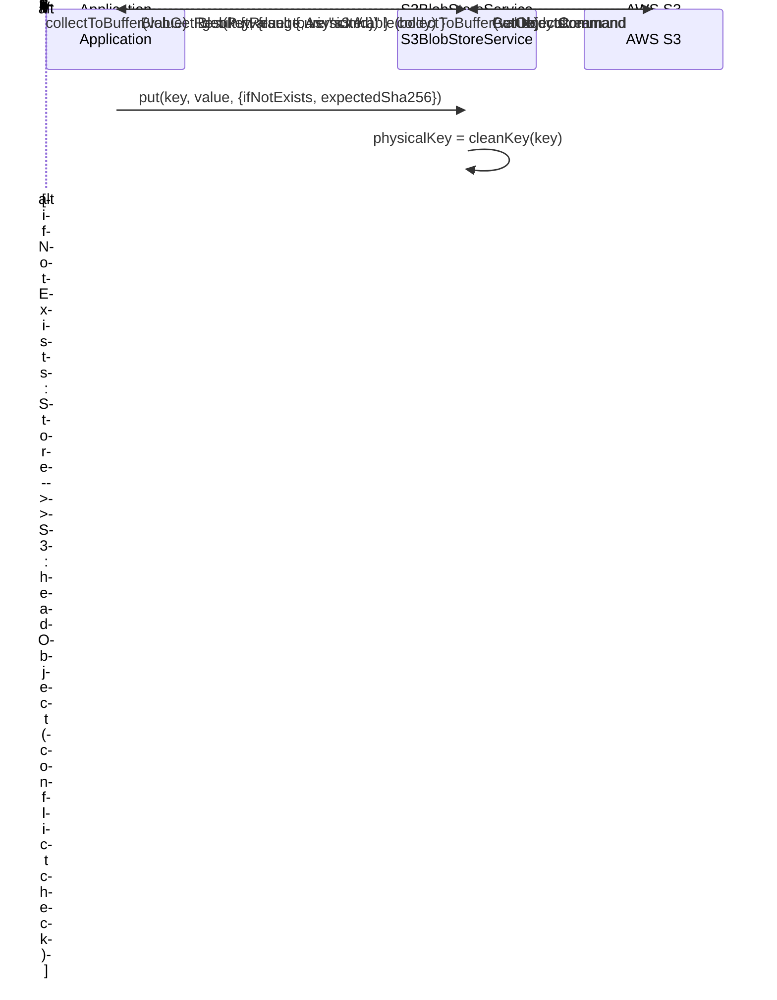
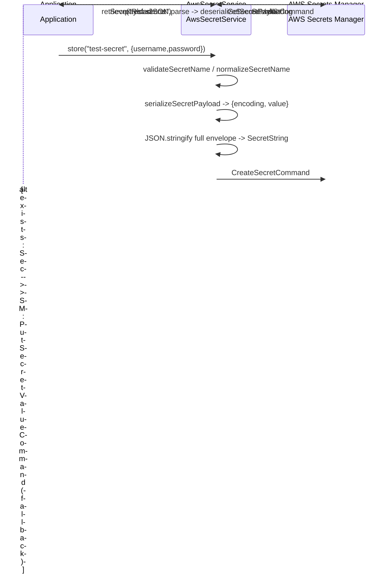
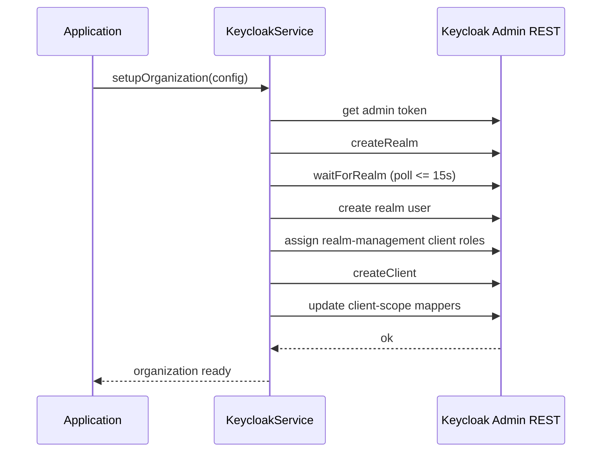
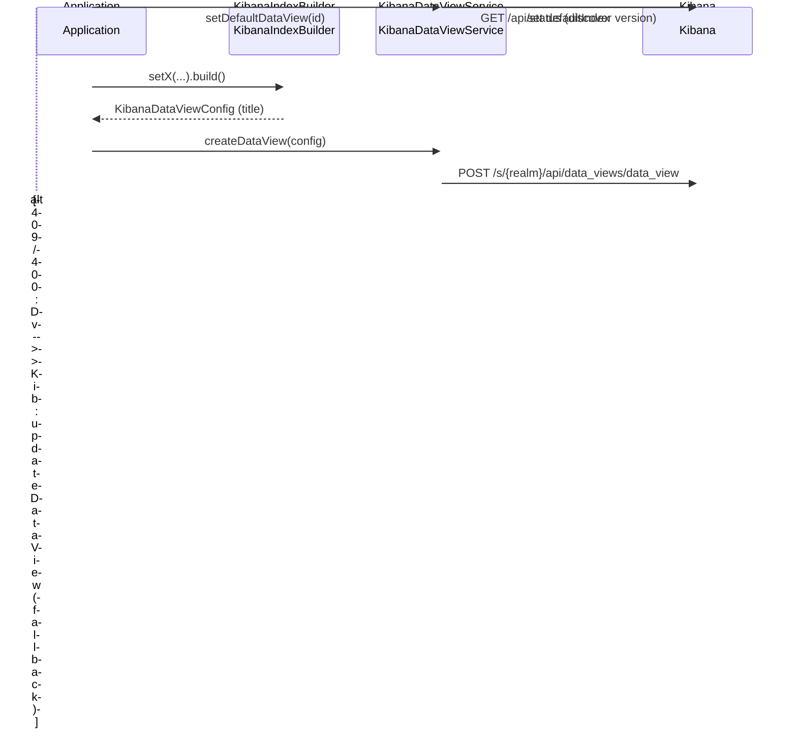
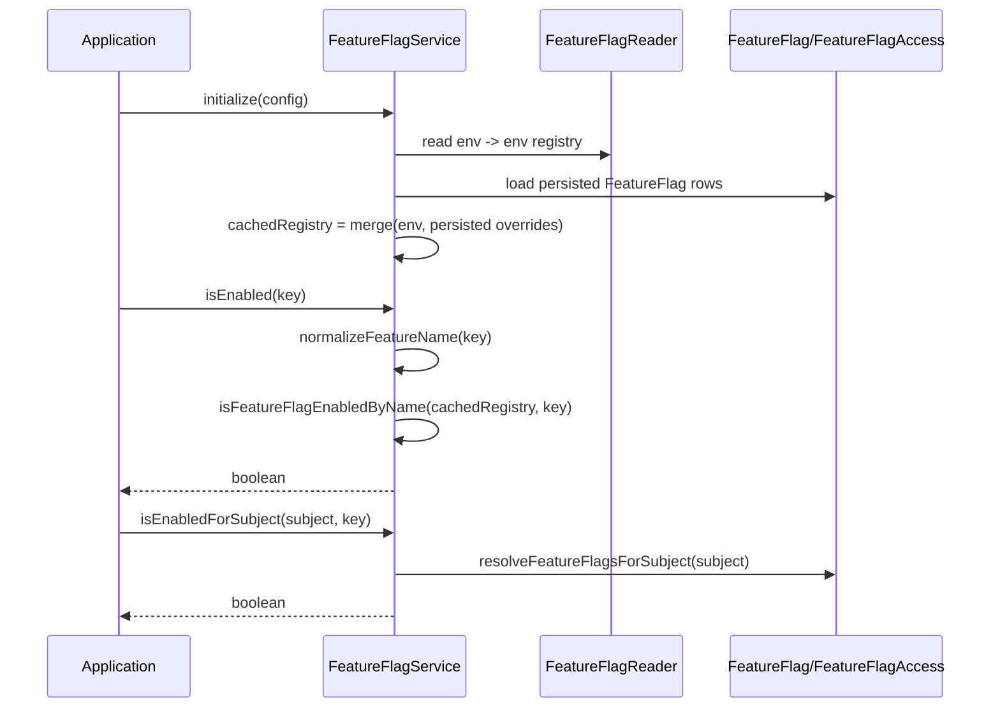
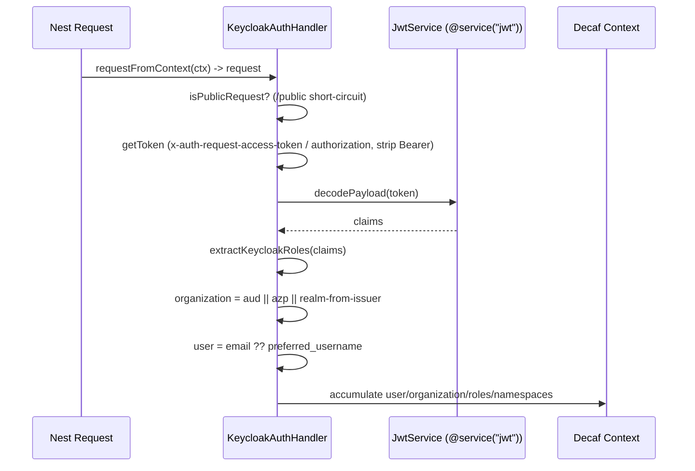
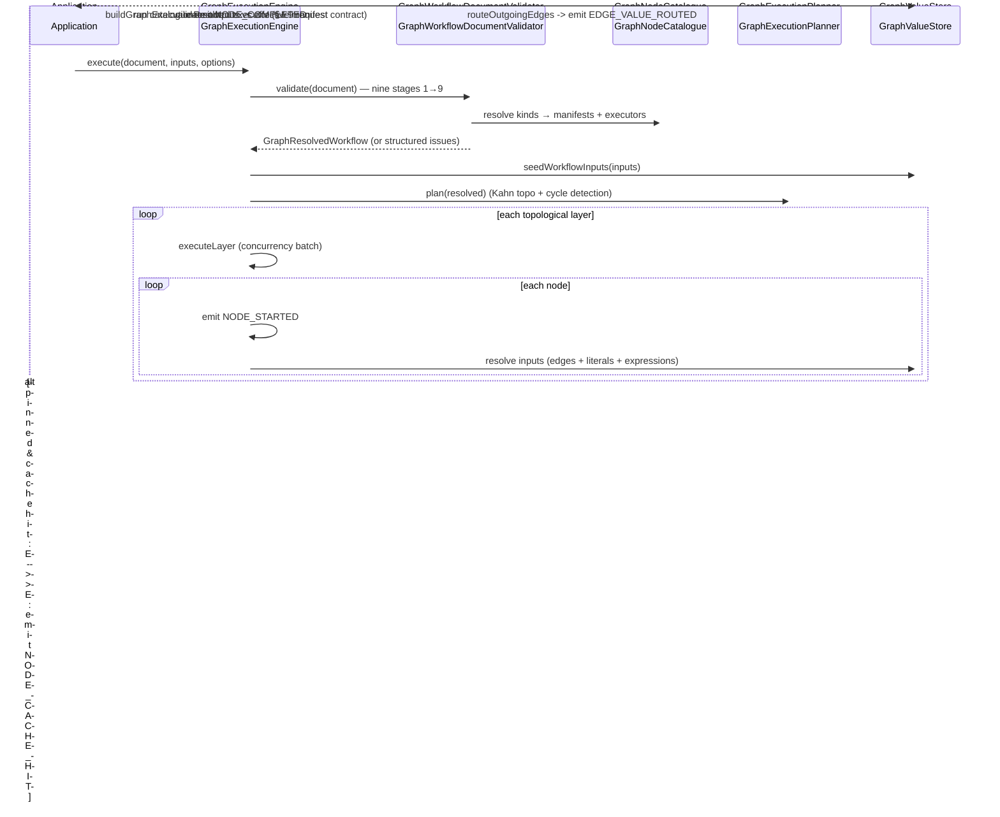
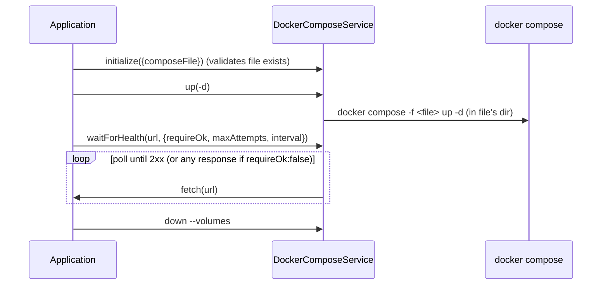

# 07 — Integrations

This chapter documents the `@decaf-ts/integrations` package: the cross-cutting "glue" layer that sits above the core persistence/transport packages and below application code. It provides provider-agnostic abstractions for binary blobs and secrets, provisioning helpers for Keycloak and Kibana, a NestJS-friendly auth handler, an org-based multi-tenant authorization scaffold, declarative feature flags, a dynamic object loader, a reference graph-workflow engine, BI dashboard embed plugins, and Docker compose orchestration.

The package is pre-1.0 (`0.7.0`). Several subsystems contain stubs and divergent error models; those are noted where relevant and consolidated in the inaccuracies list at the end of this document. This chapter records what the package *is*, not what prior doc versions claimed.

> **Scope note:** This chapter is grounded in the read-only research brief `workdocs/ai/project/technical-docs/_research-briefs/08-integrations.md`. The brief's own "Inaccuracies found" entries are reproduced verbatim in the final section. Nothing in the package was modified.

---

## 1. Identity & Role

`@decaf-ts/integrations` bundles integration helpers that are reusable across Decaf applications. Consumers import only the subpaths they need; cloud SDKs are declared as `optionalDependencies` so an application pays the install cost only for the providers it actually uses (`README.md:29`, `package.json:421-433`).

- **Package:** `@decaf-ts/integrations`, ESM (`"type": "module"`), `main = lib/index.js`.
- **Description field:** absent from `package.json`; the root barrel self-describes the package as "Package entry point for shared integration helpers" (`src/index.ts:4`).
- **Subpath exports (selected):** `.` (utils/namespaces/feature-flags), `./kibana`, `./docker`, `./keycloak`, `./nest`, `./nest/graph`, `./loader`, `./namespaces`, `./feature-flags`, `./user-requests`, `./secrets` (+ per-provider secret subpaths), `./blob` (+ per-provider blob subpaths), `./graph`, `./graph/shared`, `./plugins`, `./plugins/kibana`, `./plugins/superset` (`package.json:7-316`).

The root `src/index.ts` re-exports only `./utils`, `./namespaces`, and `./feature-flags`, plus build-time version placeholders (`VERSION`/`COMMIT`/`FULL_VERSION`/`PACKAGE_NAME`) (`src/index.ts:6-16`). All other subsystems are reachable only through their explicit subpaths.

### Relationships

| Direction | Package | What is consumed |
|:----------|:--------|:-----------------|
| Depends on | `@decaf-ts/core` | `ClientBasedService`, `Service`, `ModelService`, `Repository`, `Context`, `Observable`/`Observer` |
| Depends on | `@decaf-ts/crypto` | `CryptoService`, `JwtService` (via `@decaf-ts/crypto/integration`) |
| Depends on | `@decaf-ts/db-decorators` | `@repository`, repository hooks |
| Depends on | `@decaf-ts/decorator-validation` | `Model` base (builders) |
| Depends on | `@decaf-ts/ui-decorators` | graph `@node`/`@pinnable`/port decorators; `user-requests` passthrough |
| Depends on | `@decaf-ts/transactional-decorators` | `@transactional` in namespaces |
| Peers | `@decaf-ts/for-nest`, `@decaf-ts/for-http`, `jose` | Nest graph backend + SSE; optional peers |
| Peers | `@decaf-ts/as-zod` | required peer |
| Consumed by | Application code (Nest-based apps, graph consumers, namespaces scaffold, BI plugins) | auth handler, namespaces, graph engine, blob/secret providers, BI plugins |

External runtime deps of note: `axios` (Keycloak/Kibana HTTP), `acorn`/`acorn-walk` + `typescript` (graph code-sandbox AST validation/transpilation), `isolated-vm` (graph sandboxed execution), `node-fetch`, `uuid`, `tslib`.

---

## 2. Architectural Patterns

Several patterns recur across the package and explain *why* it is shaped the way it is.

### 2.1 `ClientBasedService` lifecycle

**What:** Blob, secret, Keycloak, and Kibana providers all extend `ClientBasedService<TClient, TConfig>` from `@decaf-ts/core`. They are constructed with no arguments, then `await service.initialize(config)` builds the native SDK client and stores both config and client. Operations log contextually via `logCtx(...)`.

**Why:** A single uniform lifecycle lets application bootstrap code treat every infrastructure provider identically — construct, initialize, use — regardless of whether the underlying SDK is AWS, Azure, GCP, Vault, or a local filesystem. It also makes the providers trivially testable: tests construct, call `initialize` with a local/emulator config, and assert.

### 2.2 Provider factories vs. direct construction

**What:** Blob uses a `BlobStoreFactory.create(config)` that switches on `config.provider` (`BlobStoreFactory.ts:23-50`). Secrets intentionally have *no* factory — each secret provider is imported from its own subpath and constructed directly.

**Why (factory):** Blob has a closed, enumerated `BlobProvider` union (`s3|minio|r2|azure-blob|gcs|local|ipfs|memory`), so a single factory is a natural dispatch point and lets callers hold a config-driven `BlobStoreService` without importing a concrete class.

**Why (no factory, secrets):** Secret backends have heterogeneous config shapes (AWS region vs. Azure URL vs. Vault token), and the abstract `SecretService` is currently documentary only — no provider extends it (see inaccuracies §11). Direct construction keeps each provider's config type honest and avoids a factory that would have to import every cloud SDK. Both designs rely on optional SDK deps so unused providers never need to be installed.

> **Trade-off / caveat:** The blob core barrel re-exports `BlobStoreFactory`, which *statically* imports every provider module today (`BlobStoreFactory.ts:9-16`). Importing `@decaf-ts/integrations/blob` therefore transitively loads `@aws-sdk/*`, `@azure/*`, `@google-cloud/storage`, and `kubo-rpc-client`, contradicting the barrel's stated intent (`src/blob/index.ts:4-5`). This is recorded as an inaccuracy (§blob-1).

### 2.3 Runtime production resolvers

**What:** Keycloak and Kibana inner services share an internal `runtime.ts` pattern: a module-level resolver set by the orchestrator's `initialize`, queried on every HTTP request to toggle `https.Agent.rejectUnauthorized` based on `NODE_ENV` (`src/keycloak/services/runtime.ts`, `src/kibana/services/runtime.ts`).

**Why:** TLS verification must be relaxed for local/emulator development but enforced in production. Centralizing this in a per-request resolver keeps the production decision out of each call site and lets the orchestrator own the `isProduction()` predicate. The config types do not currently declare `isProduction` even though tests supply it (see inaccuracies §keycloak-30, §kibana-36).

### 2.4 Builder pattern (Kibana index patterns)

**What:** `KibanaIndexBuilder` is a `@decaf-ts/decorator-validation` `Model` with fluent `setX(): this` setters and a terminal `build()`. It composes index-pattern titles in three match modes — `EXACT`, `PREFIX`, `LOGGER_GENERATED` — with optional compounding. `KibanaIndexBuilderCollection.build()` validates and maps many builders (`KibanaIndexBuilder.ts:175-229`).

**Why:** Composing Kibana index-pattern titles from many independent inputs (name, prefix, separator, log-pattern segments) is error-prone when done ad hoc. A validating fluent builder makes invalid combinations fail at `build()` time with model-validation errors rather than producing malformed titles at runtime, and lets a collection of builders map cleanly to a `KibanaDataViewConfig[]` consumed by `KibanaDataViewService`.

### 2.5 Org-based authorization (namespaces)

**What:** Namespaces model tenants → org-unit closure tables → principals/memberships → roles/permissions/role-assignments → protected resources/resource-grants → materialized effective permissions, with inheritance blocks and Postgres row-level security (`sql/002_rls.sql`). `AuthzService` is a repository-agnostic policy engine (`canAccess`, `requireAccess`, `buildAccessContext`/`buildArangoContext`/`buildQdrantFilter`); `BaseModelService<M>` is the shared CRUD base; `BootstrapService` templates a full tenant setup transactionally; `@transactional` guards multi-write services.

**Why:** Multi-tenant authorization is a cross-cutting concern that must answer the same question — "can principal P perform action A on resource R within tenant T?" — for many storage backends (relational tables, ArangoDB graph filters, Qdrant vector filters). Modeling it once as a normalized schema with a materialized effective-permission projection lets the policy engine stay repository-agnostic while each backend gets a purpose-built context/filter builder. RLS enforces tenant isolation at the database layer so a misconfigured query cannot leak across tenants.

### 2.6 Feature flags: persisted + environment-driven + reader-pluggable

**What:** Decorator-gated model members (`featureFlags`/`featureAuth`/`blockFeatureOperations`/`renderIfFeature`/`hideOnFeature`) store `FeatureFlagRule` metadata. A swappable `FeatureFlagReader` (default `EnvironmeFlagReader`) feeds a cached registry that merges environment defaults with persisted `FeatureFlag`/`FeatureFlagAccess` overrides. `FeatureFlagService.isEnabled`/`isEnabledForSubject` answer synchronous queries.

**Why:** Feature gating must be fast (synchronous, cached) and must work before any database is available (environment-driven defaults) while still allowing per-subject overrides persisted in the database. The pluggable reader lets tests inject a fixed registry without touching `process.env`. Decorators keep the gating declaration co-located with the model member it protects.

> **Note:** The concrete reader class is misspelled `EnvironmeFlagReader` (missing `nt`) (`src/feature-flags/readers/FeatureFlagReader.ts:29`). The constant `FEATURE_FLAG_ENV_PREFIX = "FEATURE_FLAG"` is declared but never wired — nothing reads `process.env.FEATURE_FLAG_*` (see inaccuracies §feature-flags-40, §feature-flags-41).

### 2.7 Nest auth handler

**What:** `KeycloakAuthHandler` extends Decaf's `AuthHandler`, injects `JwtService` via `@service("jwt")`, decodes the token, and accumulates `user`/`organization`/`roles`/`namespaces` onto the request context. `KeycloakNamespaceAuthHandler` adds namespace-scope extraction. `KeycloakModule.create()` wraps the handler (it is *not* a Nest `@Module` — it is a plain class whose `create()` returns a `KeycloakNamespaceAuthHandler`).

**Why:** NestJS requests arrive as framework-native objects; Decaf services operate against a `Context`. The handler bridges the two by translating a Keycloak JWT into Decaf auth data, so downstream Decaf services never see Keycloak-specific token shapes. Keeping it a plain wrapper (not a `@Module`) lets callers compose it into whatever Nest module structure they already have.

### 2.8 Graph engine

**What:** `GraphExecutionEngine` executes canonical `GraphWorkflowDocument`s: a nine-stage validation gate resolves every node kind against the trusted `GraphNodeCatalogue` (one kind → manifest+executor+methods registration; fail-fast on drift) into a backend-only `GraphResolvedWorkflow`, the planner builds topological layers (Kahn cycle detection) from resolved workflows only, and the engine seeds inputs into a `GraphValueStore`, executes layer-by-layer with concurrency, validates outputs against effective manifests, routes values along edges, and emits structured events. Pinning is all-or-nothing across upstream pin sets with TTL'd cached values (fingerprints exclude presentation-only UI state). Loops re-enter the engine with nested canonical documents and `parentRunId` propagation. The Nest module adds the manifests-only catalogue API, canonical persistence, and the asynchronous run lifecycle (`POST /graph/runs` → `202`, run-scoped authorized replayable SSE). Code/Switch nodes run through a pluggable `CodeSandboxEvaluator`; `IsolatedVmCodeSandboxEvaluator` transpiles TS, validates the AST (blocking `eval`/`new Function`/imports/exports/blocked identifiers), and runs in an `isolated-vm` isolate with timeout/memory limits.

**Why:** A reference execution engine that is backend-agnostic (the engine takes a catalogue-backed registry, a value store, and a sandbox evaluator as injected dependencies) lets the same canonical documents run in-process for tests and behind a Nest controller in production. Making the backend catalogue the only source of node behavior (kind → registration, client definitions rejected) removes the trust gap where client-provided definitions could mislead planning. Sandboxing untrusted code via `isolated-vm` with AST validation is the safe-by-default answer to running user-authored node bodies; the engine does *not* wire it by default — consumers must pass `codeSandboxEvaluator` or Code/Switch nodes throw `GRAPH_CODE_SANDBOX_NOT_CONFIGURED`.

> The graph engine's design and acceptance criteria are detailed in the [Design Specification — Graph Design](../design-specification/08-graph-design.md) and the graph handbook chapter. This chapter covers only its integrations-package surface.

### 2.9 BI embed plugins

**What:** A single DOM-free `DashboardEmbedPlugin` contract. Kibana uses a generated-source + installer strategy (writes a versioned Kibana plugin + `postMessage` switching). Superset uses a patch-and-build strategy (Python/Bash patches that add `switchDashboard` to Superset's Switchboard channel + embedded SDK, then build SDK/frontend or a Docker image). Both are org-agnostic (no space switching).

**Why:** Kibana and Superset have fundamentally different extension models — Kibana has a real plugin system, Superset does not — so a single abstract contract with two concrete strategies lets the host application switch dashboards identically (`buildEmbedUrl` + `sendSwitchDashboardMessage`) regardless of the BI backend. Keeping `integrations` DOM-free (`lib: ["es2022"]`) confines all iframe/React code to gitignored plugin output and the Angular host in `for-angular`.

### 2.10 Object loader

**What:** ESM dynamic `import()` of normalized sources (paths → `file:` URLs, bare specifiers passed through), with ordered post-load hooks. `withHooks`/`withOptions` return a *new* immutable instance. Family subclasses fix the `family` and expose a family-verb loader.

**Why:** Dynamic discovery of models, adapters, repositories, services, controllers, environments, Angular components, and graph nodes lets an application assemble itself from configuration rather than static imports. The immutable `withHooks`/`withOptions` design prevents a shared loader instance from accumulating hooks across unrelated call sites. Family subclasses give each domain a typed, named loader verb instead of a generic `load(family, ...)`.

---

## 3. Blob Store

### 3.1 Backends and when to use which

| Provider key | Class | When to use |
|:-------------|:------|:------------|
| `memory` | `MemoryBlobStoreService` | Unit tests and ephemeral in-process storage; no external dependencies. |
| `local` | `LocalBlobStoreService` | Self-hosted single-node deployments; atomic write + path-traversal protection. |
| `s3` | `S3BlobStoreService` | AWS S3 (or any S3-compatible API via `endpoint`). |
| `minio` | `MinioBlobStoreService` | Self-hosted S3-compatible MinIO (marker subclass of S3). |
| `r2` | `R2BlobStoreService` | Cloudflare R2 (marker subclass of S3). |
| `azure-blob` | `AzureBlobStoreService` | Azure Blob Storage. |
| `gcs` | `GcsBlobStoreService` | Google Cloud Storage. |
| `ipfs` | `IpfsBlobStoreService` | Content-addressed storage; logical keys→CIDs via a pluggable `IpfsKeyIndex`. |

The IPFS provider maps logical keys to CIDs through an `IpfsKeyIndex` with three backends — `MemoryIpfsKeyIndex`, `PostgresIpfsKeyIndex`, `LocalJsonIpfsKeyIndex` — selected via `createIpfsKeyIndex`. **Only the memory index is implemented**; the postgres and local-json indexes are stubs whose every method throws `InternalError("Implement ...")` (see inaccuracies §blob-3).

### 3.2 Public API

`./blob` (core): `BlobStoreService` (abstract: `initialize/put/get/has/stat/delete/copy/list/url`), `BlobStoreFactory`, `BlobKey`/`BlobValue` helpers, `BlobTypes` (configs/results/options + `BlobProvider` union), `BlobErrors` + `translateBlobError` (`src/blob/core/index.ts:6-11`). Provider implementations are intentionally *not* re-exported from the core barrel (`src/blob/index.ts:4-7`); per-provider subpaths export the concrete services (`./blob/s3` → `S3BlobStoreService`/`MinioBlobStoreService`/`R2BlobStoreService`, `./blob/azure`, `./blob/gcp`, `./blob/local`, `./blob/ipfs` + `IpfsKeyIndex`/`createIpfsKeyIndex`, `./blob/memory`).

### 3.3 Upload/retrieve flow (S3)



IPFS differs: it maps logical keys → CIDs via the `IpfsKeyIndex` and streams `client.cat(cid)` instead of keying objects directly. Note IPFS `get` silently ignores `BlobGetOptions` (`void options;`) and reports `sha256: undefined` in metadata (see inaccuracies §blob-6, §blob-7).

### 3.4 Usage example

From `tests/unit/blob/BlobServiceContract.test.ts:209-219`:

```ts
const factory = new BlobStoreFactory();
const store = factory.create({ provider: "memory", sourceId: "factory-test" });
await store.initialize({ provider: "memory", sourceId: "factory-test" });
await store.put("k", Buffer.from("v"));
expect(await store.has("k")).toBe(true);
```

> `BlobStoreFactory.create` returns the abstract `BlobStoreService`; cast or hold the concrete subclass if you need provider-specific members (inaccuracy §blob-10).

---

## 4. Secrets

### 4.1 Providers

| Provider key | Class | Notes |
|:-------------|:------|:------|
| `model` | `ModelSecretService` | Encrypted-at-rest via `@decaf-ts/crypto` `CryptoService`; persists `{encryptedPayload, encryption:{keyId,iv}}` on the `Secret` model. |
| `aws-secrets-manager` | `AwsSecretService` | AWS Secrets Manager (LocalStack-compatible via `endpoint`). |
| `azure-key-vault` | `AzureKeyVaultSecretService` | Azure Key Vault. |
| `gcp-secret-manager` | `GcpSecretManagerService` | Google Secret Manager. |
| `hashicorp-vault` | `VaultSecretService` | Raw `fetch` against the Vault HTTP API (the `hashicorp-vault` npm dep is unused — inaccuracy §secrets-19). |
| `1password` | `OnePasswordSecretService` | 1Password. |
| `memory` | — | Literal present in `SecretProvider` but no `MemorySecretService` exists (inaccuracy §secrets-22). |

There is **no secret factory**. Each provider is imported from its subpath and constructed directly: `new AwsSecretService()` then `await initialize(config)`. No provider `extends SecretService` — the abstract contract is documentary only (inaccuracy §secrets-11).

### 4.2 Public API

`./secrets` (core + model): `SecretService` (abstract: `store/retrieve/delete/exists/list/metadata` + optional `rotate`), `SecretName`/`SecretReference`/`SecretSerialization`, `SecretErrors`/`translateError`, `SecretTypes`; `model/` → `ModelSecretService`, `Secret` model, `ModelSecretServiceConfig` (`src/secrets/index.ts:6-7`). Per-provider subpaths (`./secrets/aws|azure|gcp|vault|oneppassword`) export the cloud services + their config types.

> The `onepassword` export is misspelled `oneppassword` in `package.json:162` (inaccuracy §secrets-12); there is no valid `./secrets/onepassword` export entry.

### 4.3 Store/retrieve flow (AWS)



The model provider encrypts `serialized.value` via `CryptoService` and persists `{encryptedPayload, encryption:{keyId,iv}}` on the `Secret` model. **Known correctness issue:** `ModelSecretService.retrieve` (and `OnePasswordSecretService.retrieve`) hardcode `encoding: "utf8"`, dropping the original serialization encoding, so JSON/binary secrets come back as strings (inaccuracies §secrets-14, §secrets-25).

### 4.4 Usage example

From `tests/integration/aws-secrets-manager.test.ts:31-59`:

```ts
const secrets = new AwsSecretService();
await secrets.initialize({ provider: "aws-secrets-manager", region: "us-east-1",
  endpoint: "http://localhost:4566", credentials: { accessKeyId: "test", secretAccessKey: "test" } });
await secrets.store("test-secret", { username: "testuser", password: "password123" });
const data = await secrets.retrieve("test-secret") as Record<string, unknown>;
expect(data.username).toBe("testuser");
```

> `rotate(...)` is recommended in the SKILL/docs but never implemented by any provider (inaccuracy §secrets-17).

---

## 5. Keycloak

### 5.1 Public API

`./keycloak`: `KeycloakService` orchestrator; `KeycloakAuthService`/`ClientService`/`IdentityProviderService`/`RealmService`/`RoleService`/`UserService` (six `ClientBasedService` classes); `buildBrokerIdentityProviderPayload`; broker helpers (`getBrokerExternalIdentityKey`, `isLocalKeycloakIssuer`); config types (`KeycloakSetupConfig`, `KeycloakBrokerSetupConfig`, etc.) (`src/keycloak/index.ts:1-3`, `src/keycloak/services/index.ts:6-11`).

### 5.2 Provisioning flow



`KeycloakService.setupOrganization` creates realm + realm user + realm-management client roles + client + scope mappers — **not** roles/IdPs/dashboards as some docs claim (inaccuracy §keycloak-31). `setupKeycloak` only adds the admin user and grants the `admin` realm role (inaccuracy §keycloak-32).

### 5.3 Consumer notes

- Requires `initialize(config)` and an `isProduction()`-aware TLS setting; supply `isProduction: () => false` in tests. The config type omits `isProduction` today (inaccuracy §keycloak-30).
- HTTP 401/403 are mapped to `NotFoundError` in every service's `handleHttpResponse`/`parseError` (inaccuracy §keycloak-33).
- `keycloak-admin` is an unused optional dependency (inaccuracy §keycloak-28).

---

## 6. Kibana

### 6.1 Public API

`./kibana`: `KibanaService` orchestrator; `KibanaSpaceService`/`DataViewService`/`RoleService`/`UserService`/`DashboardService`/`AuthService`; `KibanaIndexBuilder`/`KibanaIndexBuilderCollection`; `createDefaultKibana*` helpers; `KibanaIndexMatchMode` enum; config types (`src/kibana/index.ts:1-4`, `src/kibana/services/index.ts:6-12`).

### 6.2 Index pattern builder

`KibanaIndexBuilder.build()` validates and composes a title:

- `EXACT` → `indexName` (no `*`).
- `PREFIX` → `prefix + sep + "*"` (exactly one trailing `*`).
- `LOGGER_GENERATED` → `segments.join(sep) + sep + "*"`.

Optional compounding appends logger-rendered segments onto any base mode (uses `@decaf-ts/logging` `compileLogPattern` + `logParameterRegistry.render`). `KibanaIndexBuilderCollection.build()` validates and maps many builders → `KibanaDataViewConfig[]`.

### 6.3 Data view flow



### 6.4 Consumer notes

- `initialize` example requires `id` (`KibanaSetupConfig.id`) which docs often omit (inaccuracy §kibana-35). `KibanaSetupConfig` does not declare `isProduction` though tests supply it (inaccuracy §kibana-36).
- `KibanaSpaceService` also implements `deleteSpace`, which docs understate (inaccuracy §kibana-39). A doc-advertised `deleteDataView` does not exist (inaccuracy §kibana-34).
- Every kibana service `@service()`-injects a `KibanaAuthService` that is never referenced (inaccuracy §kibana-37); HTTP 401/403 → `NotFoundError` (inaccuracy §kibana-38).

---

## 7. Feature Flags

### 7.1 Public API

`./feature-flags`: `FeatureFlagService` + config; `FeatureFlag`/`FeatureFlagAccess` models; `FeatureFlagReader`/`EnvironmeFlagReader`; decorators `featureFlags`/`featureAuth`/`blockFeatureOperations`/`renderIfFeature`/`hideOnFeature` + `getFeatureGateMetadata`/`shouldExposeForFeatures`/`shouldHideForFeatures`; `FeatureFlagEnvironment` + env loaders; utils (`normalizeFeatureRegistry`, `isFeatureFlagEnabledByName`, etc.) (`src/feature-flags/index.ts:6-14`).

### 7.2 Resolution flow



Subject-scoped resolution lists enabled `FeatureFlagAccess` rows for the subject, collects `featureKey`s, queries enabled `FeatureFlag` rows, and returns a `{key: config??true}` registry.

### 7.3 Consumer notes

- The concrete reader is misspelled `EnvironmeFlagReader` (inaccuracy §feature-flags-40).
- `FEATURE_FLAG_ENV_PREFIX` is declared but never wired — no `process.env.FEATURE_FLAG_*` reading exists (inaccuracy §feature-flags-41).
- `grantFeatureAccess`/`revokeFeatureAccess` ignore the feature key when looking up existing access (inaccuracy §feature-flags-42).

---

## 8. Namespaces (Authorization Scaffold)

### 8.1 Public API

`./namespaces`: `types` (enums `IsolationTier`/`MembershipStatus`/`PrincipalKind`/`ScopeKind`/`PermissionCategory`/`ResourceVisibility`/`StorageKind`/`StorageBindingKind` + DTOs + `AuthzDataSources`/`AccessContext`/`ArangoAuthContext`/`QdrantAuthFilter`); `utils` (`BaseModelService`, `buildAccessContext`/`buildArangoContext`/`buildQdrantFilter`, `sameTenant`, relation policy constants); `models` (21 models); `services` (24 services incl. `AuthzService`, `BootstrapService`, `EffectivePermissionService`, `OrgUnitService`, `SystemManagementService`, `ResourceLifecycleService`) (`src/namespaces/index.ts:6-9`).

Three legacy monolith files (`org-based-authorization-system*.ts`) exist but are dead, divergent duplicates not exported from the public barrel (inaccuracy §namespaces-46).

### 8.2 Effective-permission rebuild

```mermaid
sequenceDiagram
    participant App as Application
    participant Eps as EffectivePermissionService
    participant Repo as RoleAssignment repository
    participant EP as EffectivePermission repository
    App->>Eps: rebuildForPrincipal(principal)
    Eps->>EP: delete existing rows for principal
    Eps->>Repo: collect direct + group-derived RoleAssignments
    loop each assignment
        Eps->>Eps: expand scope
        alt Tenant scope: Eps->>Eps: -> tenant
        alt Resource scope: Eps->>Eps: -> resource
        alt OrgUnit non-inheriting: Eps->>Eps: -> single scope
        alt OrgUnit inheriting: Eps->>Eps: -> all closure descendants (skip InheritanceBlock categories)
        end
    end
    Eps->>EP: write EffectivePermission rows
```

`AuthzService.canAccess` short-circuits on owner → explicit `ResourceGrant`s → visibility-driven effective-permission lookup. The scope branch does not currently enforce tenant scoping (inaccuracy §namespaces-48).

### 8.3 Provisioning & consumer notes

- Provision the Postgres schema plus `sql/001_constraints.sql`, `sql/002_rls.sql` (RLS), and `sql/003_indexes.sql`; set `app.principal_id` for RLS-scoped reads. `sql/003_indexes.sql` is currently an empty placeholder (inaccuracy §namespaces-47).
- `AuthzService` must be fed by repository-backed data sources, never fixtures.
- `BootstrapService.bootstrapTenantFromTemplate` templates a full tenant setup transactionally.

### 8.4 Usage example

From `workdocs/5-HowToUse.md:48-77`:

```ts
const { tenantId } = await new BootstrapService().bootstrapTenantFromTemplate({
  tenant: { slug: "acme", name: "Acme" }, rootOrgUnit: { name: "Root" },
  permissions: [{ key: "resource.read", category: PermissionCategory.ContentRead }],
  roles: [{ key: "owner", name: "Owner", permissionKeys: ["resource.read"] }],
  ownerUser: { displayName: "Admin", email: "admin@acme.example" }, ownerRoleKey: "owner",
});
```

---

## 9. Nest Auth Integration

### 9.1 Public API

`./nest`: `KeycloakAuthHandler`/`KeycloakNamespaceAuthHandler`/`KeycloakAuthData`; `KeycloakModule`/`AuthModule`; `namespace()` decorator + `AUTH_NAMESPACE_KEY`; utils `extractKeycloakRoles`/`extractKeycloakNamespaces`/`getRealmFromIssuer`/`getClientRoles`; types (`src/nest/index.ts:1-7`).

`./nest/graph`: `GraphExecutionController`/`GraphExecutionModule` (deprecated synchronous path), `GraphNodeCatalogueController` (manifests API, ETag digest), `GraphRunController`/`GraphRunModel`/`GraphRunModelService` (async run lifecycle), `GraphWorkflowController`/`GraphWorkflowService`/`GraphWorkflowModel`/`GraphWorkflowDocumentLimits`, `GraphResultService`/`GraphExecutionResultModel`, `GraphExecutorRegistryFactory` (`createGraphNodeCatalogue`, `createGraphExecutorRegistry`, `createDemoEngineConfig`) (`src/nest/graph/index.ts`).

### 9.2 Request → context flow



### 9.3 Consumer notes

- `KeycloakModule`/`AuthModule` are plain classes (not `@Module()`-decorated) whose `create()` returns a `KeycloakNamespaceAuthHandler` (inaccuracy §nest-56, §nest-57).
- `KeycloakAuthHandler` has a no-arg constructor and requires `JwtService` injected via `@service("jwt")` (inaccuracies §nest-53, §nest-54). A doc-claimed `AuthService` does not exist (inaccuracy §nest-50).
- Importing `./nest` registers logging side-effects that add `user`/`organization` log params (`src/nest/logging.ts:14-38`).
- Graph `main.ts` honors `GRAPH_BACKEND_PORT`/`argv[2]`/default `3000`.

---

## 10. Object Loader

### 10.1 Public API

`./loader`: `ObjectLoader` + `createLoaderHookContext`; family loaders `ModelObjectLoader`/`AdapterObjectLoader`/`RepositoryObjectLoader`/`ServiceObjectLoader`/`ControllerObjectLoader`/`EnvironmentObjectLoader`/`AngularComponentObjectLoader`/`GraphNodeObjectLoader`; `ObjectLoaderFamily`/`ObjectLoaderHook`/options types (`src/loader/index.ts`).

### 10.2 Discovery flow

```mermaid
sequenceDiagram
    participant App as Application
    participant L as ObjectLoader
    participant Mod as ESM module
    App->>L: new ObjectLoader({family:"service"}) or family subclass
    App->>L: withHooks([...]) -> new immutable loader
    App->>L: withOptions({...}) -> new immutable loader
    App->>L: load(source, selection?)
    L->>L: normalize source (path -> file: URL; bare specifier passthrough)
    L->>Mod: import(normalized)
    Mod-->>L: module namespace
    L->>L: select export (default | named | single-named fallback)
    loop ordered hooks
        L->>L: hook(value, ctx)
    end
    L-->>App: loaded value (+ preserved metadata)
```

### 10.3 Consumer notes

- `withHooks`/`withOptions` return a *new* immutable instance; the original loader is unaffected (inaccuracy §loader-61).
- `load()` defaults to the `default` export (`ObjectLoader.ts:113-118,160-175`).

---

## 11. Graph Engine (integrations surface)

The graph system lives in `src/graph/` (`engine/`, `shared/`, `log/`) and is exported via `./graph` and `./graph/shared`. Since the canonical cutover the engine executes `GraphWorkflowDocument`s only: `engine/catalog/` holds the trusted `GraphNodeCatalogue` (one kind → manifest+executor+methods registration, fail-fast validation), `engine/validation/` the nine-stage document gate producing backend-only `GraphResolvedWorkflow`, `engine/runs/` the asynchronous run lifecycle (run service, executor, event publisher, event/run stores), and `engine/` the planner (resolved workflows only), pinning, value store, loops, executors, registry facade, events, and snapshots (`src/graph/engine/index.ts`). `./graph/shared` exposes the frontend-safe built-in node manifests, run wire contracts (`GraphRunStatus`/`GraphRunEventEnvelope`), `GraphExecutionStateMapper`, and visual-state styles.



### Usage example

Adapted from `tests/unit/graph/GraphExecutionEngine.test.ts` and `src/nest/graph/GraphExecutorRegistryFactory.ts`:

```ts
const catalogue = new GraphNodeCatalogue();
registerBuiltInGraphNodes(catalogue); // built-in manifest+executor pairs (fail-fast on drift)
catalogue.registerExecutor("math.add", { execute: (r) => ({ sum: Number(r.inputs.a) + Number(r.inputs.b) }) });
catalogue.registerExecutor("math.multiply", { execute: (r) => ({ product: Number(r.inputs.x) * 2 }) });
const engine = new GraphExecutionEngine({ registry: new GraphNodeExecutorRegistry(catalogue) });
const result = await engine.execute(linearDocument(), { a: 2, b: 3 }); // nine-stage gate runs first
```

### Consumer notes

- The engine does **not** wire `IsolatedVmCodeSandboxEvaluator` by default; pass `codeSandboxEvaluator` in config or Code/Switch nodes throw `GRAPH_CODE_SANDBOX_NOT_CONFIGURED` (inaccuracy §graph-72). `isolated-vm` is a native addon requiring a build toolchain.
- Run options default `concurrency=4`, `failFast=true`, `usePinnedValues=true`. Validation is wired into the path: the nine-stage gate runs on every `execute()` and at every persistence boundary (the former silently-ignored `validateInputs/Outputs` gap, §graph-70, was fixed by the canonical cutover).
- The Nest module exposes the catalogue API (`GET /graph/node-types*`, ETag-stable), canonical persistence (`PUT|GET /graph/workflows/{id}`, `POST /graph/workflows/validate`), and the async run lifecycle (`POST /graph/runs` → `202` + run-scoped authorized replayable SSE). `POST /graph/execute` and the global `GET /graph/events` are deprecated (kept, not removed).

---

## 12. BI Dashboard Embed Plugins

### 12.1 Public API

- `./plugins`: `DashboardEmbedPlugin` contract + message helpers (`createSwitchDashboardMessage`/`sendSwitchDashboardMessage`/guards).
- `./plugins/kibana`: `KibanaDashboardEmbedPlugin`, `buildKibanaEmbedUrl`, `sendKibanaSwitchDashboardMessage`, manifest builder, plugin files.
- `./plugins/superset`: `SupersetDashboardEmbedPlugin`, `buildSupersetEmbedUrl`, `sendSupersetSwitchDashboardMessage`, manifest, patch files, `SupersetInstallOptions`.

### 12.2 Embed URL composition

- Kibana: `buildKibanaEmbedUrl` → `//<host>/<basePath>/app/org_dashboard_embed?dashboardId=...&parentOrigin=...`; switching via `postMessage`.
- Superset: `buildSupersetEmbedUrl` → `//<host>/<basePath>/embedded/<dashboardId>?parentOrigin=...`; switching via the SDK handle's `switchDashboard(dashboardId, guestToken)`.

### 12.3 Consumer notes

- Both plugins are org-agnostic (no space switching); space comes from the backend proxy/session.
- Superset is pinned to `6.1.x` via a hard-named patch script; Kibana target is `8.14.3`.
- `boot:plugins:*` only materializes files; the real build happens inside `docker compose build` (inaccuracy §plugins-78).

---

## 13. Docker Compose Orchestration

### 13.1 Public API

`./docker`: `DockerComposeService` with `up`/`down`/`restart`/`waitForHealth`/`execInContainer`/`getLogs`/`isRunning`.

### 13.2 Lifecycle



### 13.3 Consumer notes

- `DockerComposeServiceConfig` and `DockerHealthCheckOptions` are declared without `export`, so the barrel does not surface them (inaccuracy §docker-65).
- `waitForHealth` supports `requireOk:false` (any HTTP response = healthy) — useful for emulators — but this is undocumented (inaccuracy §docker-66). No tests exist for `DockerComposeService` (inaccuracy §docker-67).

---

## 14. Lifecycle, Configuration & Environment

- **Boot/init:** Nest auth is pure import (registers `user`/`organization` log params). Graph `main.ts` honors `GRAPH_BACKEND_PORT`/`argv[2]`/default `3000` (`src/nest/graph/main.ts:15`). Blob/secret/Keycloak/Kibana services boot via `new X()` + `await initialize(config)`.
- **Flavours:** Blob `BlobStoreFactory` keys = `s3|minio|r2|azure-blob|gcs|local|ipfs|memory` (`BlobTypes.ts:6-14`); secret providers = `model|aws-secrets-manager|azure-key-vault|gcp-secret-manager|hashicorp-vault|1password` (plus an unused `"memory"` literal). Each provider config carries a `provider` discriminator.
- **Env vars read by integrations code:** None of the blob/secret code reads `process.env` directly — credentials come via config objects / SDK default chains. Feature flags read from `FeatureFlagEnvironment.featureFlag` (env root `featureFlag`); the `FEATURE_FLAG_ENV_PREFIX` constant is declared but never wired. Keycloak/Kibana `isProduction()` defaults to `NODE_ENV` not in `["development","local"]`. Graph isolated-vm is opt-in (consumer passes `codeSandboxEvaluator`).
- **Defaults:** Graph run options default `concurrency=4`, `failFast=true`, `usePinnedValues=true`, `validateInputs/Outputs=true` (`GraphExecutionEngine.ts:726-741`). IPFS API defaults to `http://localhost:5001` (`IpfsBlobStoreService.ts:55`). BI plugin boot targets Kibana `8.14.3` / Superset `6.1.0` (`package.json:327-328`).

---

## 15. Testing Posture

Test layout mirrors `src/`: `tests/unit/<subsystem>/`, `tests/integration/`, `tests/e2e/` (plus Playwright for plugins). Jest runs with `--experimental-vm-modules`; the `test` script builds then runs all with coverage (`package.json:330`).

| Subsystem | Unit coverage | Integration/e2e coverage | Notable gaps |
|:----------|:--------------|:-------------------------|:-------------|
| blob | `BlobServiceContract`, `BlobBundling` | minio-s3, azure-blob, gcs, ipfs (Dockerized) | No R2 test; no live `url()` for Azure/GCS; postgres/local-json IPFS indexes are stubs. |
| secrets | `SecretServiceContract` (core utilities only) | aws/gcp/vault (LocalStack/emulator/Vault) | No Azure/1Password/model integration; no provider extends `SecretService`. |
| keycloak | broker config | keycloak + broker-compose | No unit tests for orchestration/inner-service methods, `setupOrganization`, legacy IdP path. |
| kibana | defaults, builders (thorough) | space/role/user/data-view | `KibanaAuthService`, dashboard clone/embed, `setDefaultDataView`, `setupOrganization` e2e. |
| feature-flags | env normalization, decorators, rule eval, reader swap, subject access | — | `syncFromEnvironment`/grant/revoke/find/list, `blockFeatureOperations`, `getFeatureGateMetadata`. |
| namespaces | pure helpers + `canAccess` visibility; services (tenant tier, storage, group principal) | — | `BootstrapService`, `EffectivePermissionService.rebuildForPrincipal`, `OrgUnitService` closure ops, `RoleAssignmentService`, `SystemManagementService`, `ResourceLifecycleService`. |
| nest | JWT extraction, handler paths, `namespace()`; graph-execution-module | sse-auth-extraction, graph full-stack, graph-execution | `logging.ts`, `KeycloakModule.create()`, `getClientRoles`, `main.ts`. |
| loader | default/named export, identity, hook ordering, all 8 family loaders | — | URL/`data:` sources, single-named-export fallback, `withOptions`, `createLoaderHookContext`. |
| graph | engine, planner, topology, nine-stage validator, catalogue + registrations + manifest resolver + method registry, pinning, value store, code/switch/foreach/condition/log executors, isolated-vm sandbox, events, state mapper, run logger, errors | nest: catalogue API (controller suite), run lifecycle (202/SSE/replay/ownership), workflow persistence, graph-execution module | `While/Until` executors, snapshot mapper. |
| plugins | contract/kibana/superset (constants, manifest, file gen, embed URL, install) | Playwright kibana/superset (+visual) | Superset `build:true` in-process path; `boot-plugin.mjs`. |
| docker/shared/user-requests | `shared/runtime` (basic parse/serialize) | — | `DockerComposeService` untested; `user-requests` barrel untested. |

---

## 16. Consumer Notes & Trade-offs (consolidated)

- Import only the subpath you need; cloud SDKs are `optionalDependencies` — install the ones for your providers. **Caveat:** importing `./blob` pulls every provider SDK transitively today because `BlobStoreFactory` statically imports them (inaccuracy §blob-1). Import a provider subpath directly to avoid this.
- There is no secret factory: import the provider's subpath, `new X()`, then `await initialize(config)`. No provider `extends SecretService`, so the abstract contract is documentary only (inaccuracy §secrets-11).
- `BlobStoreFactory.create` returns the abstract base; cast or hold the concrete subclass for provider-specific members (inaccuracy §blob-10).
- For namespaces, provision the Postgres schema + RLS SQL and set `app.principal_id` for RLS-scoped reads; `AuthzService` must be fed by repository-backed data sources, never fixtures.
- The graph engine does not wire `IsolatedVmCodeSandboxEvaluator` by default — pass `codeSandboxEvaluator` or Code/Switch nodes throw. `isolated-vm` needs a build toolchain. Backend run stores are in-memory reference implementations; durable run/event history across restarts needs a persistent `GraphRunStore`/`GraphRunEventStore`.
- Keycloak/Kibana services require `initialize(config)` and an `isProduction()`-aware TLS setting; supply `isProduction: () => false` in tests (the config type omits this field — inaccuracies §keycloak-30, §kibana-36).
- BI plugins are org-agnostic; Superset is pinned to 6.1.x via a hard-named patch script. `boot:plugins:*` only materializes files; the real build happens inside `docker compose build`.
- Maturity: package is `0.7.0` (pre-1.0); several subsystems have stubs (IPFS postgres/local-json indexes, Superset manifest "stub" wording) and divergent error models (cloud secret providers throw Decaf errors while 1Password/model throw `SecretError` — inaccuracy §secrets-26).

---

## 17. Inaccuracies Found

Reproduced verbatim from the research brief. Nothing was modified.

### blob

**[blob]** core entry eagerly loads all provider SDKs despite documented intent — `src/blob/index.ts:4-5` claims the core entry "does not eagerly load optional provider SDKs", but `src/blob/core/BlobStoreFactory.ts:9-16` statically imports every provider implementation, so importing `@decaf-ts/integrations/blob` transitively loads `@aws-sdk/*`, `@azure/*`, `@google-cloud/storage`, and `kubo-rpc-client`. | Evidence: src/blob/index.ts:4-5, src/blob/core/BlobStoreFactory.ts:9-16 | Suggested fix: make `BlobStoreFactory` lazy-load providers per case, or move the factory out of the core barrel.

**[blob]** bundling test is misleading — `tests/unit/blob/BlobBundling.test.ts:17-31` only asserts provider class symbols are absent from the core namespace, not that SDK modules aren't loaded (which they are, per #1). | Evidence: tests/unit/blob/BlobBundling.test.ts:17-31 | Suggested fix: assert no provider module side effects, or fix the factory to lazy-load.

**[blob]** SKILL presents stub IPFS key indexes as usable — `SKILL.md:55,80` lists `LocalJsonIpfsKeyIndex`/`PostgresIpfsKeyIndex` alongside `MemoryIpfsKeyIndex`; both are stubs whose every method throws `InternalError("Implement ...")`. | Evidence: src/blob/ipfs/LocalJsonIpfsKeyIndex.ts:17-53, PostgresIpfsKeyIndex.ts:19-49 | Suggested fix: mark them unimplemented in the SKILL or implement them.

**[blob]** package README omits the blob subsystem entirely — `README.md:5-15`/`17-24` never mention the `./blob*` subpaths despite `package.json:184-260`. | Evidence: README.md:5-15, README.md:17-24, package.json:184-260 | Suggested fix: add blob subpaths + descriptions to the README.

**[blob]** `LocalBlobStoreService` duplicates value-collection/sha256 logic — `src/blob/local/LocalBlobStoreService.ts:329-350` re-implements `collectToBuffer`/sha256 instead of using the shared `collectToBuffer`/`computeSha256` (`src/blob/core/BlobValue.ts:58-78`); the local copy doesn't handle sync iterables. | Evidence: src/blob/local/LocalBlobStoreService.ts:329-350, src/blob/core/BlobValue.ts:58-78 | Suggested fix: import and use the shared helpers.

**[blob]** IPFS `get` silently ignores `BlobGetOptions` — `src/blob/ipfs/IpfsBlobStoreService.ts:144` does `void options;`, so `range`/`versionId` are accepted by type but never honored. | Evidence: src/blob/ipfs/IpfsBlobStoreService.ts:144 | Suggested fix: implement or throw `UnsupportedError` when supplied.

**[blob]** IPFS `put` reports `sha256: undefined` in metadata — `src/blob/ipfs/IpfsBlobStoreService.ts:109` sets `sha256: undefined` even though bytes are buffered and `computeSha256` is available; other providers populate it. | Evidence: src/blob/ipfs/IpfsBlobStoreService.ts:109 | Suggested fix: compute and store sha256 in the index metadata.

**[blob]** `MemoryIpfsKeyIndex.stat` throws a plain `Error`, not `NotFoundError` — `src/blob/ipfs/MemoryIpfsKeyIndex.ts:60` vs the subsystem's `NotFoundError` standard. | Evidence: src/blob/ipfs/MemoryIpfsKeyIndex.ts:60 | Suggested fix: throw `NotFoundError`.

**[blob]** `LocalBlobStoreService.parseError` pass-through guard is incomplete — `src/blob/local/LocalBlobStoreService.ts:257-264` only checks `NotFoundError`/`ConflictError`/`ValidationError`/`InternalError`, so a `ForbiddenError`/`ConnectionError` would be reclassified as `InternalError`; other providers check the full set (e.g. `S3BlobStoreService.ts:361-372`). | Evidence: src/blob/local/LocalBlobStoreService.ts:257-264, src/blob/s3/S3BlobStoreService.ts:361-372 | Suggested fix: add the missing DECAF error classes or use `translateBlobError`.

**[blob]** `BlobStoreFactory.create` return type erases the concrete service type — `src/blob/core/BlobStoreFactory.ts:19-21` always returns `BlobStoreService`. | Evidence: src/blob/core/BlobStoreFactory.ts:19-21 | Suggested fix: overload `create` per `provider` literal.

### secrets

**[secrets]** `SecretService` abstract is never implemented by any provider — every provider extends `ClientBasedService`, not `SecretService`. | Evidence: AwsSecretService.ts:48, AzureKeyVaultSecretService.ts:30, GcpSecretManagerService.ts:26, VaultSecretService.ts:113, OnePasswordSecretService.ts:22, ModelSecretService.ts:36 | Suggested fix: have providers extend `SecretService` (aligning signatures incl. `options`/`rotate`) or drop the unused abstract.

**[secrets]** package.json export path typo — `package.json:162` declares `./secrets/oneppassword` (extra `p`) but the source directory is `src/secrets/onepassword/`; there is no `./secrets/onepassword` export entry. | Evidence: package.json:162 | Suggested fix: rename the export key to `./secrets/onepassword` and fix the `lib/...` paths.

**[secrets]** SKILL imports 1Password from the broken typo path — `integrations-secrets SKILL.md:43` uses `@decaf-ts/integrations/secrets/oneppassword`. | Evidence: integrations-secrets SKILL.md:43 | Suggested fix: change to `.../onepassword`.

**[secrets]** `ModelSecretService.retrieve` hardcodes `encoding: "utf8"`, dropping the original serialization encoding — only `serialized.value` is encrypted/persisted; retrieve rebuilds `{encoding:"utf8", value}` unconditionally, so JSON/binary secrets come back as strings. | Evidence: ModelSecretService.ts:71, ModelSecretService.ts:82-94, ModelSecretService.ts:178-183 | Suggested fix: persist `encoding` on the `Secret` model and restore it on retrieve.

**[secrets]** docs say to pass config to the constructor, but no provider accepts constructor args — actual path is `new AwsSecretService()` + `await initialize(config)`. | Evidence: SKILL.md:48, SKILL.md:53-57, workdocs/services/secrets.md:72-77, aws-secrets-manager.test.ts:31-32 | Suggested fix: update docs.

**[secrets]** workdocs use invalid `provider` value `"aws"` — `SecretProvider`/`AwsSecretServiceConfig` require `"aws-secrets-manager"`. | Evidence: workdocs/services/secrets.md:75, SecretTypes.ts:10, AwsSecretServiceConfig.ts:9 | Suggested fix: change to `"aws-secrets-manager"`.

**[secrets]** `rotate(...)` is recommended but never implemented — the only `rotate` occurrence is the optional abstract at `SecretService.ts:61-65`; no provider implements it. | Evidence: SKILL.md:31, SKILL.md:69, SecretService.ts:61-65 | Suggested fix: implement for versioned backends or remove the recommendation.

**[secrets]** `@grpc/grpc-js` imported but not declared — `GcpSecretManagerService.ts:2,49` imports `@grpc/grpc-js`, which is absent from `package.json` deps (resolves only transitively). | Evidence: GcpSecretManagerService.ts:2, GcpSecretManagerService.ts:49 | Suggested fix: add to `optionalDependencies` or drop the direct import.

**[secrets]** dead optional dependency `hashicorp-vault` — `package.json:430` lists it, but `VaultSecretService.ts` uses raw `fetch` and never imports it. | Evidence: package.json:430, VaultSecretService.ts | Suggested fix: remove the dependency.

**[secrets]** dead code `ModelSecretCrypto.ts` — defines `encryptPayload`/`decryptPayload`/`deriveKeyFromSecret` but is neither exported from `src/secrets/model/index.ts:6-8` nor used by `ModelSecretService` (which uses `CryptoService`); `workdocs/services/secrets.md:31` points readers at it as the crypto provider. | Evidence: ModelSecretCrypto.ts:9-122, src/secrets/model/index.ts:6-8, workdocs/services/secrets.md:31 | Suggested fix: wire it in and export it, or delete it.

**[secrets]** `parseSecretReference` regex cannot match the `1password` provider — uses provider class `[a-z-]+` (excludes digits), so `secrets/1password/foo` is unparseable/invalid even though `isValidProvider` allow-lists `"1password"`. | Evidence: SecretReference.ts:9-10, SecretReference.ts:62-70 | Suggested fix: widen the capture group to `[a-z0-9-]+`.

**[secrets]** unused `SecretProvider` literal `"memory"` — `SecretTypes.ts:8`/`SecretReference.ts:63` include `"memory"` but no `MemorySecretService` exists. | Evidence: SecretTypes.ts:8, SecretReference.ts:63 | Suggested fix: add a memory provider or remove the literal.

**[secrets]** AWS `list` no-op ternary — `AwsSecretService.ts:288` writes `version: secret.LastChangedDate ? undefined : undefined`. | Evidence: AwsSecretService.ts:288 | Suggested fix: populate `version` meaningfully or drop the field.

**[secrets]** Azure `delete` ignores `force` — both branches of `if (options.force)` call `beginDeleteSecret`. | Evidence: AzureKeyVaultSecretService.ts:150-156 | Suggested fix: purge the deleted secret when `force`, or document soft-delete semantics.

**[secrets]** 1Password `retrieve` loses original payload encoding — stores only `serialized.value` and reconstructs `{encoding:"utf8", value}` on read. | Evidence: OnePasswordSecretService.ts:69, OnePasswordSecretService.ts:186-189 | Suggested fix: store `encoding` alongside the value.

**[secrets]** error model inconsistency — core `translateError`/`translateNameError`/`translateSerializationError`/`translateCryptoError` are never called; cloud providers return Decaf errors while 1Password/model return `SecretError`. | Evidence: SecretErrors.ts:38-146 | Suggested fix: standardize on `SecretError` (or `translateError`) across providers.

**[secrets]** workdocs understate Azure — `workdocs/services/secrets.md:44-45` omits `exists`, which is implemented. | Evidence: workdocs/services/secrets.md:44-45, AzureKeyVaultSecretService.ts:162-199 | Suggested fix: add `exists` to the Azure blurb.

### keycloak

**[keycloak]** unused optional dependency `keycloak-admin` — `package.json:431`; never imported in `src/`/`tests/` (all Admin REST calls are raw Axios). | Evidence: package.json:431 | Suggested fix: remove or document as reserved.

**[keycloak]** workdoc/SKILL config example is not type-valid — show `realm:"acme"` (not a `KeycloakSetupConfig` field), omit required `id`/`client`, and `KeycloakUser` objects omit required `apiClientId`. | Evidence: workdocs/services/keycloak.md:25-39, integrations-keycloak SKILL.md:22-38, src/keycloak/types.ts:162-183, src/keycloak/types.ts:6-9 | Suggested fix: provide a type-valid `KeycloakSetupConfig`.

**[keycloak]** `KeycloakSetupConfig` does not declare `isProduction`, yet tests/users supply it. | Evidence: src/keycloak/types.ts:162-183, tests/integration/keycloak.test.ts:36, tests/e2e/keycloak-model-suite.e2e.test.ts:152, keycloak-role-permissions.e2e.test.ts:201 | Suggested fix: add optional `isProduction?: () => boolean`.

**[keycloak]** doc misdescribes `setupOrganization` — claims it creates roles/IdPs/dashboards together; actual creates realm + realm user + realm-management client roles + client + scope mappers. | Evidence: workdocs/services/keycloak.md:63, SKILL.md:43, KeycloakService.ts:277-332 | Suggested fix: correct the description.

**[keycloak]** doc misdescribes `setupKeycloak` — calls it the "full bootstrap"; `setupKeycloak` only adds the admin user and grants the `admin` realm role. | Evidence: workdocs/services/keycloak.md:19, SKILL.md:42, KeycloakService.ts:100-121 | Suggested fix: reword.

**[keycloak]** error-mapping smell — HTTP 401/403 map to `NotFoundError` in every service's `handleHttpResponse`/`parseError`. | Evidence: KeycloakAuthService.ts:210-212, KeycloakAuthService.ts:232-238 | Suggested fix: map 401→`UnauthorizedError`/403→`ForbiddenError`.

### kibana

**[kibana]** workdoc advertises a `deleteDataView` method that doesn't exist — `KibanaService` exposes only create/update/createDataViews/setDefaultDataView. | Evidence: workdocs/services/kibana.md:73, KibanaService.ts:178-228 | Suggested fix: remove it or implement it.

**[kibana]** workdoc/SKILL `initialize` example omits required `id`. | Evidence: workdocs/services/kibana.md:25-34, integrations-kibana SKILL.md:19-29, src/kibana/types.ts:75-90 | Suggested fix: add `id`.

**[kibana]** `KibanaSetupConfig` does not declare `isProduction`, yet the integration test supplies it. | Evidence: src/kibana/types.ts:75-90, tests/integration/kibana.test.ts:36 | Suggested fix: add optional `isProduction?: () => boolean`.

**[kibana]** dead `@service() authService` injection — `KibanaAuthService` is `@service()`-injected as `protected authService` in five services but is never referenced (all use `this.config.adminApiUser` directly). | Evidence: KibanaDashboardService.ts:26-27, KibanaDataViewService.ts:24-25, KibanaRoleService.ts:19-20, KibanaSpaceService.ts:23-24, KibanaUserService.ts:19-20 | Suggested fix: remove the injection or route auth through `KibanaAuthService`.

**[kibana]** error-mapping smell — HTTP 401/403 → `NotFoundError` in every kibana service's `parseError`. | Evidence: KibanaAuthService.ts:118-124 | Suggested fix: map 401/403 to unauthorized/forbidden errors.

**[kibana]** workdoc understates `KibanaSpaceService` — says "create and update spaces", but it also implements `deleteSpace`. | Evidence: workdocs/services/kibana.md:39, KibanaSpaceService.ts:94-114, KibanaService.ts:168-176 | Suggested fix: mention deletion.

### feature-flags

**[feature-flags]** public API typo — the concrete reader class is named `EnvironmeFlagReader` (missing `nt`). | Evidence: src/feature-flags/readers/FeatureFlagReader.ts:29, FeatureFlag.service.ts:14, FeatureFlag.service.ts:44, FeatureFlag.service.ts:61, tests/unit/feature-flags.test.ts:4, tests/unit/feature-flags.test.ts:172 | Suggested fix: rename to `EnvironmentFlagReader`.

**[feature-flags]** dead/misleading constant — `FEATURE_FLAG_ENV_PREFIX = "FEATURE_FLAG"` is only re-exported; nothing reads `process.env.FEATURE_FLAG_*`, implying an env-var parsing capability that doesn't exist. | Evidence: constants.ts:7 | Suggested fix: implement prefix-based loading or remove the constant.

**[feature-flags]** `grantFeatureAccess`/`revokeFeatureAccess` ignore the feature key when looking up existing access — both call `findFeatureAccess(input)` carrying `featureKey` (singular), but `buildAccessCondition` only filters on `query.featureKeys` (plural array), so the lookup may match/update/revoke the wrong feature's row. | Evidence: FeatureFlag.service.ts:215-216, FeatureFlag.service.ts:232-235, FeatureFlag.service.ts:154-160 | Suggested fix: map `featureKey`→`featureKeys:[featureKey]` or add a `featureKey` branch.

**[feature-flags]** README "Exports" omits `./feature-flags`. | Evidence: README.md:7-15, package.json:96-106 | Suggested fix: add it.

**[feature-flags]** stale empty directory `src/feature-flags/repositories/` (no files, unreferenced). | Evidence: src/feature-flags/repositories/ | Suggested fix: remove or populate it.

### namespaces

**[namespaces]** SQL closure-table unique index column names don't match the model's FK columns — `sql/001_constraints.sql:8` indexes `(tenant_id, ancestor_org_unit_id, descendant_org_unit_id)`, but `OrgUnitClosure` declares `ancestor`/`descendant` `@manyToOne` (generated FK columns `ancestor_id`/`descendant_id`). | Evidence: sql/001_constraints.sql:8, src/namespaces/models/org-unit-closure.model.ts:19-24 | Suggested fix: rename model props to `ancestorOrgUnit`/`descendantOrgUnit` or update the SQL index columns.

**[namespaces]** three legacy monolith files are dead, divergent duplicates — only imported by each other, absent from the public barrel; the monolith `OrgUnitService.renameOrgUnit` is buggy (both branches call `this.orgUnitPath(undefined, name)`). | Evidence: src/namespaces/org-based-authorization-system.ts:525-541, services/org-unit.service.ts:120-127, src/namespaces/index.ts:6-9 | Suggested fix: delete the monolith files.

**[namespaces]** `sql/003_indexes.sql` is a placeholder with no indexes, despite being listed as a prerequisite artifact. | Evidence: sql/003_indexes.sql, workdocs/5-HowToUse.md:7 | Suggested fix: implement the indexes or drop the file/requirement.

**[namespaces]** `AuthzService.canAccess` scope branch doesn't enforce tenant scoping — when `scopeKind`+`scopeId` are provided, it matches only on `permissionKey` + time window without verifying `permission.tenantId === input.tenantId`. | Evidence: authz.service.ts:31-43, authz.service.ts:52 | Suggested fix: add the tenant predicate.

**[namespaces]** `ResourceLifecycleService.unregisterResource` (and others) are not `@transactional` despite multi-step destructive sequences. | Evidence: resource-lifecycle.service.ts:6-10, org-unit.service.ts:179-189 | Suggested fix: annotate with `@transactional()`.

### nest

**[nest]** workdocs claim `AuthService` exists in `src/nest` — it does not; the actual verification is `JwtService` injected via `@service("jwt")`. | Evidence: workdocs/services/nest.md:7, workdocs/services/nest.md:30, workdocs/Readme.md:38 | Suggested fix: remove the `AuthService`/`AuthServiceOptions`/verify/decode-mode section; document `JwtService` injection.

**[nest]** stale coverage HTML references a removed file — `workdocs/coverage/src/nest/authService.ts.html` exists while the source does not; the coverage dir also lacks `decorators.ts.html`/`logging.ts.html`/`types.ts.html`/`graph/`. | Evidence: workdocs/coverage/src/nest/authService.ts.html | Suggested fix: regenerate coverage.

**[nest]** `KeycloakAuthData` field table in `nest.md` is wrong — the interface only adds `token`/`isPublic`; `user`/`organization`/`roles`/`namespaces` come from base `AuthData`, and `email`/`preferred_username` are collapsed into `user`. | Evidence: src/nest/keycloakAuthHandler.ts:29-34, src/nest/keycloakAuthHandler.ts:79 | Suggested fix: correct the table.

**[nest]** `KeycloakAuthHandler` constructor signature in `nest.md` is fabricated — doc says `new KeycloakAuthHandler(authService?, authServiceOptions?)`; actual is `constructor() { super(); }`. | Evidence: src/nest/keycloakAuthHandler.ts:41-43 | Suggested fix: document the no-arg constructor + `@service("jwt")` requirement.

**[nest]** `nest.md` describes a `validate(...)` override calling `AuthService.assertValidToken`; the actual override is `validateAuth(data, _request)` calling `this.jwt().decodeAuthToken(...)`; no `assertValidToken`/`verifyToken`/`JWKS` symbol exists. | Evidence: src/nest/keycloakAuthHandler.ts:88-96 | Suggested fix: replace with the actual `validateAuth` behavior.

**[nest]** `nest.md` names the extension point `extractFromAuth(ctx)`; actual is `extractFromRequest(request)` with `requestFromContext` doing ctx→request adaptation. | Evidence: src/nest/keycloakAuthHandler.ts:57-59, src/nest/keycloakAuthHandler.ts:84-86 | Suggested fix: rename.

**[nest]** `nest.md:10` lists export as `keycloakModule` (lowercase) and implies a Nest `@Module`; actual exports are classes `KeycloakModule`/`AuthModule`, neither decorated `@Module()` (plain wrappers whose `create()` returns a `KeycloakNamespaceAuthHandler`). | Evidence: src/nest/keycloakModule.ts:8, src/nest/keycloakModule.ts:19 | Suggested fix: rename to `KeycloakModule`/`AuthModule` and clarify.

**[nest]** `nest.md` omits `KeycloakNamespaceAuthHandler`, which is what `KeycloakModule.create()` actually instantiates. | Evidence: src/nest/keycloakModule.ts:13-16 | Suggested fix: document it.

**[nest]** `getClientRoles` is re-exported twice from the nest barrel — via `export * from "./utils"` and an explicit `export { getClientRoles } from "./utils"` at `src/nest/keycloakAuthHandler.ts:129` (redundant). | Evidence: src/nest/index.ts:2, src/nest/keycloakAuthHandler.ts:129 | Suggested fix: drop line 129.

**[nest]** `GraphWorkflowModel` declares `workflowId`/`name`/`document`/`owner` (plus the transitional `snapshot`) but `GraphWorkflowService` still sets/constructs an `updatedAt` field relying on an undeclared inherited `BaseModel` field. | Evidence: src/nest/graph/GraphWorkflowModel.ts, GraphWorkflowService.ts (saveDocument/saveSnapshot) | Suggested fix: explicitly declare `@column() updatedAt`.

### loader

**[loader]** `ObjectLoaderExportSelection` exported twice from the same barrel — via `export * from "./types"` and `export type { ObjectLoaderExportSelection }` at `src/loader/ObjectLoader.ts:193` (redundant). | Evidence: src/loader/index.ts:8, src/loader/ObjectLoader.ts:193 | Suggested fix: drop line 193.

**[loader]** SKILL example omits non-obvious behaviors — `new ObjectLoader({ family: "service" })` works, but the skill doesn't note that `withHooks`/`withOptions` return a *new* immutable instance or that `load()` defaults to the `default` export. | Evidence: ObjectLoader.ts:113-118, ObjectLoader.ts:160-175 | Suggested fix: add an immutability note.

### user-requests

**[user-requests]** barrel undocumented in root README and workdocs `Readme.md` export lists. | Evidence: README.md:5-15, package.json:107-117 | Suggested fix: add `@decaf-ts/integrations/user-requests`.

**[user-requests]** no tests exercise the barrel (e.g. asserting it re-exports the expected symbols). | Evidence: tests/ (absent) | Suggested fix: add a smoke test.

### shared

**[shared]** `src/shared/runtime.ts` has no public import path — `package.json` `exports` defines no `./shared` subpath, and `src/index.ts:6-8` doesn't re-export `./shared`; the test imports the source path directly. | Evidence: src/shared/runtime.ts, tests/unit/shared/runtime.test.ts:4, src/index.ts:6-8 | Suggested fix: add a `./shared` subpath + barrel, or re-export from the root.

### docker

**[docker]** `DockerComposeServiceConfig` and `DockerHealthCheckOptions` are declared without `export` — the barrel `export *` doesn't surface them; consumers can't type the `initialize`/`waitForHealth` args. | Evidence: src/docker/DockerComposeService.ts:13, src/docker/DockerComposeService.ts:18 | Suggested fix: add `export` to both interfaces.

**[docker]** workdoc omits `waitForHealth` options — says health checks rely on HTTP status only, but the impl supports `requireOk`/`maxAttempts`/`interval`; `requireOk:false` (any HTTP response = healthy) is undocumented. | Evidence: workdocs/services/docker-compose.md:38, workdocs/services/docker-compose.md:46, DockerComposeService.ts:18-27, DockerComposeService.ts:116-144 | Suggested fix: document the options and the emulator use case.

**[docker]** no tests exist for `DockerComposeService`, yet `workdocs/coverage/src/docker/` is present (stale coverage). | Evidence: tests/ (absent), workdocs/coverage/src/docker/ | Suggested fix: add tests and regenerate coverage.

**[docker]** root README "Exports" omits `@decaf-ts/integrations/docker`. | Evidence: README.md:5-15, package.json:30-40, workdocs/Readme.md:27 | Suggested fix: add it.

**[docker]** unclear "double assignment" comment — `this._config = config; // double assignment but allows tests to be cleaner`. | Evidence: DockerComposeService.ts:61 | Suggested fix: remove the redundant assignment or document precisely why both are needed.

### graph

> Entries §graph-70 (validation options silently ignored), §graph-71 (event `nodeId` inconsistency), and §graph-75 (README omitted the graph subpaths/engine) were fixed by the DECAF-50 canonical cutover and removed from this register: validation is wired (nine-stage gate on every execute), `GraphExecutionContext.emit` now uses the plan node's `id`, and the README documents `./graph`, `./graph/shared`, `./nest/graph` and the graph modules.

**[graph]** `IsolatedVmCodeSandboxEvaluator` described as "the default" but isn't wired by default — `GraphExecutionEngine` leaves `codeSandboxEvaluator` `undefined` unless supplied; Code/Switch nodes throw `GRAPH_CODE_SANDBOX_NOT_CONFIGURED` out of the box. | Evidence: src/graph/shared/nodes/flow-control.ts:380-382, GraphExecutionEngine.ts:93-101 | Suggested fix: document explicit registration or default to it when `isolated-vm` is available.

**[graph]** `GraphTopology.isBoundary` hard-codes `"$workflow"` instead of `GRAPH_WORKFLOW_BOUNDARY`. | Evidence: GraphTopology.ts:63-65, constants.ts:13 | Suggested fix: import and compare against the constant.

**[graph]** dead import — `GraphPinningService` imports `GRAPH_PINNING_METADATA_KEY` only to `void` it at module end. | Evidence: GraphPinningService.ts:15, GraphPinningService.ts:271 | Suggested fix: remove the unused import.

### plugins

**[plugins]** Superset manifest doc/comment is stale — says "stub"/"deferred"/"to be ignored for now" and carries `status:"stub"`, but the plugin is fully implemented. | Evidence: src/plugins/superset/manifest.ts:3-7, src/plugins/superset/manifest.ts:22, src/plugins/superset/installer.ts:127-271, src/plugins/superset/templates.ts:840-850 | Suggested fix: drop the stub wording and `status:"stub"` field; describe the patch-and-build strategy.

**[plugins]** `SupersetDashboardEmbedPlugin.install` narrows the parameter to `SupersetInstallOptions` while the contract declares `install(options: PluginInstallOptions)`; tests work around it with `as SupersetInstallOptions` casts. | Evidence: contract.ts:191, superset/installer.ts:127-129 | Suggested fix: keep the public signature as `PluginInstallOptions` or add a typed `installSuperset` method.

**[plugins]** `boot-plugin.mjs` never passes `build:true` to `plugin.install`, so the Superset installer's entire in-process `build:true` branch is dead relative to the documented boot script (building happens inside `docker compose build`). | Evidence: bin/boot-plugin.mjs:52-56, src/plugins/superset/installer.ts:168-296 | Suggested fix: document that `boot:plugins:*` only materializes files, or add an opt-in env var for the in-process build path.

### package-wide

**[package]** `package.json` has no `description` field, so the npm registry description will be empty. | Evidence: package.json (no description) | Suggested fix: add a `description`.
