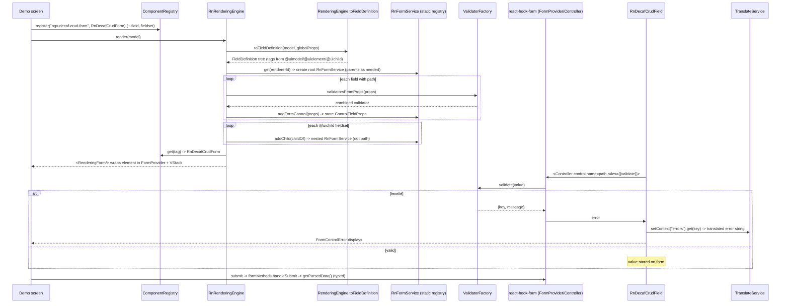

# 08 — Frontend Engines

This handbook documents the decaf-ts frontend rendering layer: the per-framework
engines (`for-angular`, `for-react`, `for-nextjs`, `for-react-native`) that turn
decorated decaf models into UIs, the shared `styles` design system they consume,
and the Angular-only graph workflow editor. All statements are grounded in the
research briefs for [`for-angular`](../_research-briefs/11-angular.md),
[`for-react`/`for-nextjs`/`styles`](../_research-briefs/12-react-next-styles.md),
and [`for-react-native`](../_research-briefs/13-react-native.md). Where a brief
is thin or notes a module is not yet a consumable library, that is stated
explicitly rather than fabricated.

## 1. Layering and the engine contract

decaf separates *what a UI renders* from *which framework renders it*. The
contract lives in `@decaf-ts/ui-decorators`, which defines:

- `RenderingEngine<V, FieldDefinition>` — the abstract base every engine
  extends; it owns `toFieldDefinition(model, globalProps)` (reads model UI
  metadata) and a static flavour cache so `RenderingEngine.get()` returns the
  booted engine.
- `FieldDefinition` / `FieldProperties` — the framework-agnostic tree the
  engine walks.
- `Renderable` — the interface a decorated model satisfies (`model.render(...)`).
- `DecafComponent`, `DecafEventHandler`, `IDecafRouter`/`Spinner`/`Toast`/`Modal`
  — the host-service contracts an engine implements.
- `@uimodel` / `@uilayout` / `@uielement` / `@uichild` (and the `ui-decorators/graph`
  subpath: `@graph` / `@node` / `@input` / `@output`) — the model metadata that
  drives rendering.

Each `for-*` package supplies one *flavour* of that contract. An engine is
constructed with a flavour string (`AngularEngineKeys.FLAVOUR = 'angular'`,
`ReactEngineKeys.FLAVOUR = 'react'`, the literal `"react-native"`); the base
self-registers the instance so `RenderingEngine.get()` works. Engines depend on
`ui-decorators` + `decorator-validation` + `db-decorators` + `core`; the
graph editor additionally depends on `integrations` and `for-http`.

**Why a per-framework engine.** Model-driven rendering needs to create real
framework components (Angular `ComponentRef`s, React elements, RN components)
and bind real framework form state (Angular `FormGroup`, `react-hook-form`,
custom static registries). The `FieldDefinition` tree and the decorator metadata
are framework-agnostic; only the leaf resolution ("which component class for
this tag", "which form primitive for this control") is framework-specific. One
shared contract plus one thin flavour each lets the same decorated model render
on web (Angular/Ionic), on React (web), and on React Native, without duplicating
the metadata-reading or validation logic.

```mermaid
flowchart LR
  subgraph Contracts["ui-decorators (framework-agnostic)"]
    RE[RenderingEngine]
    FD[FieldDefinition / FieldProperties]
    UI[@uimodel / @uilayout / @uielement / @uichild]
  end
  subgraph Foundation["decorator-validation / db-decorators / core"]
    M[Model + Validation keys]
    CRUD[CrudOperations / OperationKeys]
    Repo[Repository / ModelService]
  end
  UI --> RE
  RE --> FD
  M --> UI
  CRUD --> UI
  Repo --> UI
  FD --> FA[for-angular: NgxRenderingEngine flavour 'angular']
  FD --> FR[for-react: RgxRenderingEngine flavour 'react']
  FD --> RN[for-react-native: RnRenderingEngine flavour 'react-native']
  FD --> FNX[for-nextjs: no engine yet - scaffold]
  FA --> AppA[Angular / Ionic apps]
  FR --> AppR[React apps]
  RN --> AppN[RN / Expo apps]
  FNX --> AppX[Next.js app shell only]
  styles[@decaf-ts/styles - dcf-* tokens/classes] -. consumed at app level .-> AppA
  styles -. declared, unused .-> AppR
```

## 2. Engine comparison

| Engine | Package / flavour | Maturity | Public barrel? | Form primitive | i18n | Graph editor | Consumable as a library today? |
|:--|:--|:--|:--|:--|:--|:--|:--|
| for-angular | `@decaf-ts/for-angular`, flavour `'angular'` | Mature (demo, Storybook, E2E) | Yes (single ng-packagr entry) | Angular `FormGroup`/`FormArray` via static `NgxFormService` | `@ngx-translate/core` + custom `I18nLoader` | Yes (in-repo `src/graph`, not published) | Yes |
| for-react | `@decaf-ts/for-react`, flavour `'react'` | Early port, working core | Partial (components not exported from barrel) | Static `RgxFormService` (dot-path, nested children) | `I18nLoader` (HTTP fetch + built-in `en.json` merge) | No | No (broken `files`, missing `lib/`, missing faker dep) |
| for-nextjs | `@decaf-ts/for-nextjs` | Scaffold only (`create-next-app`) | No entry point at all | None | None | No | No (app shell only) |
| for-react-native | `@decaf-ts/for-react-native`, flavour `'react-native'` | Early/scaffold (one demo screen) | No barrel (Expo app entry) | `react-hook-form` (`RnFormService`) | `i18next` + `TranslateService` | No | No (app, not installable library) |
| styles | `@decaf-ts/styles` | Mature, in active use | CSS entry (`dist/main.min.css`) | n/a | n/a | n/a | Yes (via `dist/main.css` subpath) |

## 3. for-angular

### 3.1 Identity and purpose

`for-angular` is the Angular rendering engine of decaf. It converts model
decorator metadata (`@uimodel`/`@uilayout`/`@uielement`) into dynamically
created Angular/Ionic components, so a decorated model renders as a full CRUD
UI (form, fieldset, list, table, modal, stepped form) with no hand-written
templates. It also ships a second, large subsystem — `src/graph` — an
ng-diagram-based visual workflow editor that is a *document-native client* of
the graph backend in `@decaf-ts/integrations`: it edits a canonical
`GraphWorkflowDocument`, discovers nodes from backend manifests, and drives
the asynchronous run lifecycle over HTTP + run-scoped SSE.

`package.json` has no `description` field; the README's description is wrong
(see Inaccuracies). Engines: node >=20, npm >=10.

### 3.2 Public API surface

The published bundle has a single ng-packagr entry (`src/lib/public-apis.ts`).
The graph subsystem (`src/graph`) is **not** published — there is no secondary
entry point and the FESM contains no graph code.

- **Modules.** `ForAngularCommonModule` (imports/exports `CommonModule`,
  `FormsModule`, `ReactiveFormsModule`, `TranslateModule`, `TranslatePipe` and
  boots the engine at module load; provides `forRoot()`),
  `ForAngularComponentsModule` (aggregates standalone components).
- **Rendering engine.** `NgxRenderingEngine` (`render`/`registerComponent`/
  `destroy`/`createComponent` + static `get()` from the base), `DynamicModule`
  (abstract marker base), `Dynamic()` decorator, `injectService()` /
  `injectRepository()` property-initializer helpers.
- **Base directive chain (exported).** `NgxComponentDirective`,
  `NgxPageDirective`, `NgxModelPageDirective`, `NgxParentComponentDirective`,
  `NgxFormDirective`, `NgxFormFieldDirective`, `NgxEventHandler`. Internal (in
  the bundle but not exported): `NgxRepositoryDirective`,
  `NgxRenderableComponentDirective`, `ValidatorFactory`. Entirely absent from
  the bundle: `NgxSessionAdapter`.
- **Components (exported classes).** `ModelRendererComponent`,
  `ComponentRendererComponent`, `CrudFieldComponent`, `CrudFormComponent`,
  `EmptyStateComponent`, `ListComponent`, `ListItemComponent`,
  `SearchbarComponent`, `PaginationComponent`, `FieldsetComponent`,
  `LayoutComponent`, `FilterComponent`, `SteppedFormComponent`,
  `IconComponent`, `CardComponent`, `FileUploadComponent`, `TableComponent`,
  `ModalComponent`, `ModalConfirmComponent`, `ModelBuilderComponent`,
  `ContainerComponent`, `CronSelectorComponent`, `CronSelectorFieldComponent`;
  plus modal factory functions (`presentModalConfirm`, `presentModalAlert`,
  `getNgxModalComponent`, `getNgxModalCrudComponent`, `presentNgxLightBoxModal`,
  `presentNgxInlineModal`, `getNgxInlineModal`, `getNgxSelectOptionsModal`).
- **Services.** `NgxFormService` (static form registry: `createForm`,
  `addControlFromProps`, `validateFields`, `getFormData`, `cloneFormControl`),
  `NgxRouterService` (implements `IDecafRouter`), `NgxMediaService` (dark
  mode/resize/SVG). `NgxTranslateService` is **not** in the public barrel.
- **Pipes / directives.** `DecafTranslatePipe`, `DecafTruncatePipe`,
  `NgxSvgDirective` (`[ngx-decaf-svg]`), `DecafTooltipDirective`
  (`[ngx-decaf-tooltip]`).
- **i18n.** `I18nLoader`, `I18nLoaderFactory`, `I18nParser`,
  `provideDecafI18nConfig`, `provideDecafI18nLoader`, `getLocaleContext`,
  `getLocaleContextByKey`; bundled library keys in `i18n/data/{en,pt}.json`.
- **Utils.** `NgxSpinner`/`NgxToast` (+ `getNgxSpinner`/`getNgxToast` lazy
  factories) and ~25 helpers (`isDevelopmentMode`, `getWindow`/`setOnWindow`/
  `getOnWindow`, `getLocaleFromClassName`, `generateRandomValue`, `isValidDate`,
  `formatDate`, `dateFromString`, `itemMapper`/`dataMapper`, `getByPath`,
  `stringToBoolean`, `isValidBase64`, `stripHTML`, `asLength`,
  `windowEventEmitter`, `removeFocusTrap`, `getMenuIcon`, `filterString`,
  `cleanSpaces`, `isDarkMode`, …).
- **Engine providers/helpers.** `provideDecafDbAdapter`,
  `provideDecafDynamicComponents`, `provideDecafPageTransition`,
  `provideDecafDarkMode`, `decafPageTransition`, `getModelAndRepository`,
  `getDbAdapterFlavour`, `getLogger`.
- **Tokens & constants.** `DB_ADAPTER_FLAVOUR_TOKEN`, `DB_ADAPTER_PROVIDER_TOKEN`,
  `LOCALE_ROOT_TOKEN`, `I18N_CONFIG_TOKEN`, `CPTKN`, `AngularEngineKeys`,
  `BaseComponentProps`, `ComponentsTagNames`, `ListComponentsTypes`,
  `RouteDirections`, `ActionRoles`, `WindowColorSchemes`, `ListItemPositions`,
  `CssClasses`, `DefaultListEmptyOptions`, `DefaultModalOptions`,
  `DefaultFormButtonsOptions`, `SelectFieldInterfaces`,
  `ErrorCodesTranslationKeys`, `InputComponentErrors`, `HTTPMethods`,
  `patternValidators`.
- **Types/interfaces.** `AngularDynamicOutput`, `IComponentProperties`,
  `IFormComponentProperties`, `ICrudFormEvent`, `IBaseCustomEvent`,
  `IFilterQuery`, `IListItemCustomEvent`, `IPaginationCustomEvent`,
  `IRenderedModel`, `I18nToken`, `I18nResourceConfig`, `ITooltipConfig`,
  `IWindowResizeEvent`, `IMenuItem`, `ICrudFormButtons`, `IListEmptyOptions`,
  `ILayoutModelContext`, `DecafRepository`, `DecafRepositoryAdapter`,
  `FormParent`, `KeyValue`, `AngularFieldDefinition`.
- **Overrides.** `DecafAxiosHttpAdapter` (bookmark pagination + SSE observer
  wiring).
- **Not exported.** `I18nFakeLoader`, `MockedEnTranslations`,
  `DecafFakerRepository`, `getFakerData` (test/demo helpers); the entire
  `src/graph` subsystem.

### 3.3 Architectural patterns and why

**Model-driven rendering.** A model class decorated with ui-decorators metadata
is turned into a `FieldDefinition` tree by the base `RenderingEngine.toFieldDefinition`
(reading `Model.uiModelOf`/`uiListModelOf`/`uiHandlersFor`/`uiLayoutOf`); then
`NgxRenderingEngine.fromFieldDefinition` maps each node's `tag` to a registered
component and creates it. `ModelRendererComponent` calls
`model.render(globals, vcr, injector, inner, projectable)` — the `Renderable`
interface. *Why:* the same model declaration drives data, validation, and UI, so
the UI cannot drift from the model and there are no hand-written templates per
form.

**`@Dynamic()` component registry.** `Dynamic()` must sit above `@Component`;
it reflects the component metadata and registers the class in the engine's
static registry under its selector. Duplicate registration throws
`InternalError`. The registry is a plain static `Record<string, { constructor }>`.
*Why:* a string-tagged registry decouples the metadata tree (which only knows
tags) from the concrete Angular components, letting apps swap/extend components
without touching model metadata.

**Engine flavour & singleton.** The constructor passes `AngularEngineKeys.FLAVOUR`
to the base; the base keeps a flavour cache and `RenderingEngine.get()` returns
the booted engine. Boot is idempotent via a window flag (`AngularEngineKeys.LOADED`,
`engineLoaded`) set at module-evaluation time. *Why:* one engine per page,
created on module import, regardless of how many modules import the engine.

**Directive inheritance chain.** `DecafComponent` (ui-decorators) →
`NgxRepositoryDirective` (repository access, query/paginate/observe, transaction
hooks) → `NgxComponentDirective` (shared inputs: model, mapper, pk, props,
operations, handlers/events, locale, dark mode; `handleEvent`, `parseProps`,
`changeOperation`) → branches: `NgxPageDirective` (page title/menu) →
`NgxModelPageDirective` (CRUD read/submit over a repository) →
`NgxRenderableComponentDirective` (dynamic render + event subscription); and
`NgxParentComponentDirective` (children/pages/cols/rows) → `NgxFormDirective`
(form group lifecycle, `submitEvent`) and `NgxFormFieldDirective`
(`ControlValueAccessor` + decaf field validation surface). *Why:* all dynamic
components share lifecycle, event dispatch, and repository access via a single
inheritance spine instead of duplicated boilerplate.

**Static form registry.** `NgxFormService` is a pure static class: a
`WeakMap<AbstractControl, FieldProperties>` for control metadata and a
`Map<string, FormParent>` of forms keyed by id. The engine creates a form per
render, registers each child control via `addControlFromProps`, validates with
`validateFields`, and extracts typed values with `getFormData` (number/date
parsing, HTML escaping). *Why:* a static registry lets the engine and any
component reach any form/control by id without Angular DI plumbing, which is
needed because components are created imperatively by `createComponent`.

**Handlers & events.** Components accept `handlers`/`events` props (functions
or `NgxEventHandler` subclasses); `NgxComponentDirective.handleEvent` dispatches
to a handler or re-emits on the `listenEvent` output, bubbling through the
component tree. `ComponentEventNames` (ui-decorators) names standard events
(Render, Submit, BackButtonClick, ValidationError, …). *Why:* a single event
contract lets page-level handlers react to arbitrary nested components without
per-component `@Output` wiring.

**decaf DI bridge.** `injectService()` / `injectRepository()` resolve decaf
`ModelService`/`Service`/`Repository` singletons from decaf's own registries
(`ModelService.forModel`, `CoreService.get`, `CoreRepository.forModel`) inside
Angular property initializers — no Angular provider registration needed. *Why:*
decaf services are framework-agnostic singletons; bridging them into Angular
property initializers keeps the engine's components declarative while reusing
the decaf registry.

### 3.4 Model-driven form render flow

```mermaid
sequenceDiagram
    participant Page as Page template
    participant MRC as ModelRendererComponent
    participant Model as Renderable model
    participant Base as RenderingEngine.toFieldDefinition
    participant Engine as NgxRenderingEngine
    participant Form as NgxFormService
    participant VCR as ViewContainerRef
    Page->>MRC: <ngx-decaf-model-renderer [model] [globals]>
    MRC->>Model: model.render(globals, vcr, injector, inner, projectable)
    Model->>Engine: render(model, globalProps)
    Engine->>Engine: store model, generate form id, capture operation
    Engine->>Base: toFieldDefinition(model, globalProps)
    Base-->>Engine: FieldDefinition tree (tags from @uielement/@uichild)
    Engine->>Form: createForm() -> FormGroup/FormArray
    loop each definition node
        Engine->>Engine: registry lookup by tag -> reflectComponentType
        Engine->>VCR: vcr.clear() + createComponent(cmpClass)
        Engine->>Engine: setInputs (only inputs in component mirror; props deep-applied)
        alt node has path/name and operation is editable
            Engine->>Form: addControlFromProps -> register child control
        end
        Engine->>Engine: recurse children
    end
    Engine-->>MRC: AngularDynamicOutput (instance, inputs, injector, children)
    MRC-->>Page: rendered component tree; (listenEvent) bubbles events
    Note over Engine: destroy(formId) clears registry + (optional) form
```

### 3.5 CRUD submit flow

`CrudFormComponent`/`SteppedFormComponent`/`FieldsetComponent` submit →
`NgxFormDirective.submit` → `NgxFormService.validateFields` (recursive
touch/dirty/validate; invalid → re-enable controls, return false) → `getFormData`
(typed extraction) → `submitEventEmit` emits `ICrudFormEvent` → page-level
`NgxModelPageDirective.handleEvent` → `submit()` performs
`create/createAll/update/delete/deleteAll` on the resolved repository, translates
`operations.{op}.success|error`, maps HTTP error codes via
`ErrorCodesTranslationKeys`, and re-emits `listenEvent`.

### 3.6 List flow

`ListComponent` (infinite or paginated) queries the repository (`paginate` /
infinite scroll with bookmark support), renders `ListItemComponent` rows, and
navigates to `/model/{Model}/{operation}/{id}` via
`NgxComponentDirective.changeOperation`.

### 3.7 i18n

`provideDecafI18nConfig` wires `@ngx-translate/core` with a custom `I18nParser`
(interpolation via decaf `sf`) and `I18nLoader`, which HTTP-fetches
`{prefix}{lang}{suffix}` per resource, recursively merges over the bundled
`src/lib/i18n/data/en.json` keys, and caches per language.

*Why translation loading this way:* decaf ships a base set of library keys
(errors, default buttons, empty states) so library components always have
translatable strings; apps layer their own resource files on top and the loader
deep-merges so app keys override library keys without forking the bundle. The
custom parser keeps decaf's `sf` interpolation syntax consistent across UI and
logs.

```mermaid
sequenceDiagram
    participant App as App bootstrap
    participant Prov as provideDecafI18nConfig
    participant TX as @ngx-translate/core
    participant Loader as I18nLoader
    participant Bundled as i18n/data/en.json
    participant HTTP as App assets/i18n/{lang}.json
    App->>Prov: provideDecafI18nConfig({fallbackLang, lang}, [{prefix, suffix}])
    Prov->>TX: register TranslateLoader=I18nLoader, TranslateParser=I18nParser
    TX->>Loader: getTranslation(lang)
    Loader->>Bundled: load bundled library keys (en baseline)
    Loader->>HTTP: fetch prefix+lang+suffix
    HTTP-->>Loader: app resource JSON
    Loader->>Loader: deep-merge app keys over bundled keys (per-lang cache)
    Loader-->>TX: merged translation object
    TX-->>App: TranslateService ready; pipes/components resolve keys
```

Note: the `I18nLoaderFactory` default prefix is `./app/assets/i18n/`, which does
not match the demo app's `./assets/i18n/`; consumers who omit the resource config
will 404 (see Inaccuracies).

### 3.8 Graph workflow editor

The graph editor lives in `src/graph` and is **not** part of the published
package. Since the canonical cutover it is document-native and manifest-driven:
the editor's state is one `GraphWorkflowDocument`
(`@decaf-ts/ui-decorators/graph`), node discovery comes from backend
`GraphNodeManifest[]`, and no node constructors, legacy config-store state, or
engine code reach the browser (`src/graph/bundle-wall.spec.ts` asserts both a
static import wall and a runtime symbol wall over the production bundle).

- **Node palette & catalogue.** `GraphNodeCatalogService` loads/refreshes
  manifests from the backend `GraphNodeCatalogApi` merged with offline
  `GraphNodeManifestFixtures` via `GraphNodeCatalogCompositeSource`; the
  palette renders manifests and `GraphNodePaletteFactory` turns a pick into a
  `GraphNodeInstance` + `node.add` command.
- **Document store & canvas.** `GraphWorkflowDocumentStore` holds the canonical
  document; every semantic mutation is a command (`GraphDocumentCommands`).
  `GraphDiagramAdapter` is the only document⇄ng-diagram bridge — projection is
  a pure function of (document, manifest reader), canvas gestures go through
  `GraphDiagramMutationTranslator` and become document commands, and the
  diagram is re-projected from the store, never the reverse. Positions commit
  on drag-end; the viewport lives in the document's `ui` block.
- **Parameter renderers.** `GraphParameterRendererRegistry` resolves typed
  renderers per `GraphParameterDefinition` (text, multiline, number, boolean,
  static/dynamic options, collection, object, code, expression, resource
  locator, credential, notice, hidden) with generic fallback; visibility is
  the declarative DSL evaluated by `GraphParameterVisibilityEvaluator`;
  `GraphParameterValidationMapper` applies manifest validation.
- **Execution bridge.** Execution is *remote and asynchronous*:
  `GraphRunClient.createRun({workflow: document, inputs})` → `202` with
  `eventsUrl`/`resultUrl`; `GraphRunEventClient` replays run events from
  sequence zero, reconnects from the last sequence (bounded retry budget),
  falls back to run-status polling, and stops after the terminal event;
  `GraphRunStateStore` folds envelopes into node/edge UI states. The
  deprecated `GraphExecutionService.executeDocument` path
  (`POST /graph/execute`) is retained for compatibility only.
- **Persistence & history.** Save/history/autosave/mutation services
  (`GraphSaveService`, `GraphHistoryService`, `GraphAutoSaveService`,
  `GraphMutationDetectorService`) read from the document store; snapshots are
  `{document, editor}` wrappers and legacy snapshots load through lossless
  read-path conversion.

*Why a canonical document contract:* the editor, the persistence layer, and
the backend all consume the same `GraphWorkflowDocument`, so displayed state
and executed state cannot silently diverge — the editor never re-implements
workflow semantics, it projects a document, edits it through commands, and
ships the exact same document to the backend's run lifecycle over HTTP/SSE.

```mermaid
sequenceDiagram
    participant User
    participant Store as GraphWorkflowDocumentStore
    participant Adapter as GraphDiagramAdapter
    participant Page as GraphPage
    participant RC as GraphRunClient
    participant EC as GraphRunEventClient
    participant Backend as NestJS graph backend
    participant RS as GraphRunStateStore
    User->>Adapter: canvas gesture (add node / draw edge / drag)
    Adapter->>Store: document command (node.add / edge.add / moveNode)
    Store-->>Adapter: re-project diagram from store (never reverse)
    User->>Page: Run
    Page->>Store: snapshot() — current canonical document
    Page->>RC: POST /graph/runs {workflow, inputs}
    alt POST fails
        RC-->>Page: GraphBackendUnavailableError
    else 202 Accepted
        Backend-->>RC: {runId, eventsUrl, resultUrl}
        RC->>EC: connect eventsUrl?afterSequence=0
        Backend-->>EC: replay buffered envelopes, then live events
        EC->>RS: fold node/edge UI state; append run log
        Backend-->>EC: terminal event (completed|failed|cancelled)
        Page->>RC: GET resultUrl → results -> graphInspection
    end
    RS-->>Page: node/edge templates read state reactively
```

### 3.9 Lifecycle, configuration, environment

- **Boot.** Importing `ForAngularCommonModule` (or any engine module) evaluates
  the window-flag guard and instantiates the `NgxRenderingEngine` singleton.
  `initialize()` is a no-op flag setter. `destroy(formId?)` clears the instance,
  parent props, and optionally the form registry.
- **App-level providers** (canonical set): `provideIonicAngular({ mode: 'md' })`,
  `provideDecafDbAdapter(RamAdapter, { user, dbName })` (sets the DB flavour on
  `window` via `DB_ADAPTER_FLAVOUR_TOKEN`), `provideRouter(routes,
  withComponentInputBinding())`, `provideDecafPageTransition()`,
  `provideDecafDynamicComponents(...)` (registers app components with the
  engine), `provideDecafI18nConfig({ fallbackLang, lang }, [{ prefix, suffix }])`.
- **DB adapter flavour** is read from `window` (`getDbAdapterFlavour`); the demo
  uses `RamFlavour`.
- **Environment variables actually read.**
  - `GRAPH_BACKEND_URL` (default `http://localhost:3000`) — graph execution
    backend.
  - `GRAPH_HISTORY_LIMIT` (default `10`) — graph undo history depth.
  - `GRAPH_AUTOSAVE_DEBOUNCE_MS` (default `500`) — graph auto-save debounce.
  - `process.env.NODE_ENV` plus `window.env.CONTEXT`/hostname — only indirectly,
    via `isDevelopmentMode`.
  - `window.ENV` is read by `src/environments/environment.ts`, but that file is
    dead/broken (see Inaccuracies #16).
- **Ports.** Dev server 8110, PDM dev 8130, PTP dev 8131, PWA preview 8110,
  Storybook 6006, graph backend 3000.

### 3.10 Relationships

- `@decaf-ts/ui-decorators` — the contract provider (`RenderingEngine`,
  `DecafComponent`, `DecafEventHandler`, `DecafTranslateService`, `Renderable`,
  `FieldProperties`, `IDecafRouter/Spinner/Toast/Modal`, `UIModelMetadata`,
  `ComponentEventNames`, `UIKeys`, and the `ui-decorators/graph` subpath).
- `@decaf-ts/decorator-validation` — `Model`, `Validation`, `Primitives`,
  `ModelKeys`, `DEFAULT_PATTERNS`; drives field types and validators.
- `@decaf-ts/db-decorators` — `OperationKeys`, `CrudOperations`, `InternalError`.
- `@decaf-ts/core` — `Repository`, `ModelService`, `Service`, `Adapter`,
  `Condition`, `Paginator`; `core/ram` provides `RamAdapter`/`RamFlavour`.
- `@decaf-ts/integrations` — graph only (`integrations/graph/shared` types and
  the NestJS graph backend run by `npm run start:backend`).
- `@decaf-ts/for-http` — `AxiosHttpAdapter`/`AxiosFlavour` (base of
  `DecafAxiosHttpAdapter`) and `ServerEventConnector` (SSE).
- `@decaf-ts/decoration`, `@decaf-ts/logging`, `@decaf-ts/transactional-decorators`
  (`Lock`/`MultiLock` in `NgxSessionAdapter`), `@decaf-ts/injectable-decorators`
  (`InjectablesRegistry`).
- Upstream consumers: `demo`, `demo/angular/ew`, `demo/angular/ionic`, `web-page`
  (the decaf-ts website is itself a for-angular app), `bin/releases/dist-angular`.

### 3.11 Real usage examples

Render a model in a page (from the demo app):

```html
<ngx-decaf-model-renderer
  [model]="model"
  (listenEvent)="handleSubmit($event)"
  [globals]="globals"
></ngx-decaf-model-renderer>
```

Register a custom dynamic component:

```typescript
@Dynamic()
@Component({
  selector: 'ngx-decaf-decorator-test-form-field-component',
  standalone: true,
  imports: [ForAngularCommonModule, IonInput, /* ... */],
})
class DecoratorTestFormFieldComponent extends CrudFieldComponent {}
```

Application bootstrap (abridged):

```typescript
provideIonicAngular({ mode: 'md' }),
provideDecafDbAdapter(RamAdapter, { user: 'user', dbName: 'for-angular' }),
provideRouter(routes, withComponentInputBinding()),
provideDecafPageTransition(),
provideDecafDynamicComponents(AppExpiryDateFieldComponent, AppSwitcherComponent,
  AppSelectFieldComponent, CronSelectorFieldComponent),
provideDecafI18nConfig({ fallbackLang: 'en', lang: 'en' },
  [{ prefix: './assets/i18n/', suffix: '.json' }]),
```

i18n in a test (using the test fake loader):

```typescript
const imports = [
  ForAngularCommonModule,
  ListComponent,
  TranslateModule.forRoot({
    loader: { provide: TranslateLoader, useClass: I18nFakeLoader },
  }),
];
```

### 3.12 Consumer notes / trade-offs

- **Unpinned decaf peers:** every decaf peer dependency is `"latest"`; consumers
  get whatever is current on the registry.
- **Angular 21 + Ionic 8 + standalone components**, but the library still
  exposes NgModules — import `ForAngularCommonModule` in the root for
  forms/translation + engine boot.
- **`@decaf-ts/overrides/ui-decorators`** is a bare side-effect import present
  in the published FESM, but `@decaf-ts/overrides` is *not* an npm package
  (registry 404); it resolves only via the monorepo's tsconfig `paths` alias.
  External consumers must replicate that alias or the import fails.
- **Graph is not published.** Graph consumers must work from the monorepo (the
  demo app imports via the `src/graph` path alias).
- **Security:** `DecafAxiosHttpAdapter.token` is a hardcoded, now-expired
  Keycloak JWT shipped in source and dist — do not reuse this adapter pattern;
  rotate the credential.
- **i18n default prefix** `./app/assets/i18n/` does not match the demo app's
  `./assets/i18n/` — omitting the resource config in a stock app layout will 404.
- **Schematics** are minimal: a stub `schematics` command, a `component`
  generator (alias `c`), and a `page` generator that also edits `app.routes.ts`.
- **Coverage is low** (~30% lines, ~11% branches) and the core engine has no
  direct unit test.

## 4. for-react

### 4.1 Identity and purpose

`for-react` (`@decaf-ts/for-react` v0.0.1) is the React implementation of the
decaf rendering-engine layer — the React counterpart of `for-angular`. It
extends the framework-agnostic `RenderingEngine` from `@decaf-ts/ui-decorators`
with flavour `"react"`, converting decorated decaf models into React element
trees. It is clearly early-stage: v0.0.1, one unit-test file, and packaging that
does not yet produce a consumable artifact.

### 4.2 Public API surface

From `src/lib/index.ts` → `public-apis.ts`:

- **Engine.** `RgxRenderingEngine` (render model → React node),
  `RgxComponentRegistry` (register/get/clear tag→component), `RgxFormService`
  (get/remove/mountFormIdPath; controls, values, submit/reset/setValue/
  getValues/getParsedData), `ValidatorFactory` (spawn/supportedKeys/
  validatorsFromProps), `RgxEventEmitter`, directive base classes
  (`RgxComponentDirective`, `RgxParentComponentDirective`, `RgxFormDirective`,
  `RgxFormFieldDirective`, `RgxPageDirective`, `RgxModelPageDirective`,
  `RgxRenderableComponentDirective`), `Dynamic()` (no-op), `DynamicModule`
  (placeholder).
- **Constants.** `ReactEngineKeys` (FLAVOUR=`"react"`, CHILDREN, `__rgxChildren`,
  DARK_PALETTE_CLASS, …), `BaseComponentProps` enum, `CssClasses`,
  `FormConstants`, `ComponentEventNames`, `RouteDirections`,
  `ListComponentsTypes`, `DefaultFormReactiveOptions`, `DefaultListEmptyOptions`,
  `ActionRoles`, `WindowColorSchemes`, `ElementSizes`, `ElementPositions`,
  `LayoutGridGaps`, `ListItemPositions`.
- **Types/interfaces.** `KeyValue`, `ControlFieldProps`, `RgxCrudFieldProps`,
  `Option`, `FieldUpdateMode`, `DecafRepository`, `IBaseCustomEvent`,
  `ICrudFormOptions`, `IListEmptyOptions`, `IComponentProperties`,
  `IFilterQuery`, `IPaginationCustomEvent`, `I18nResourceConfig`, etc.
- **Directives.** `RgxSvgDirective` (abstract; `injectSvg` via media service).
- **Services.** `RgxMediaService` (onResize/onColorSchemeChange/isDarkMode/
  toggleDarkPalette/loadSvg/dispose), `RgxFormService` (re-export).
- **Utils.** `getWindow`, `getWindowDocument`, `getOnWindow`, `setOnWindow`,
  `getWindowWidth`, `getOnWindowDocument`, `isDevelopmentMode`,
  `windowEventEmitter`, `getInjectablesRegistry`, `isNotUndefined`,
  `getLocaleFromClassName`, `getLocaleLanguage`, `generateRandomValue`,
  `stringToBoolean`, `isValidDate`, `formatDate`, `parseToValidDate`,
  `itemMapper`, `dataMapper`, `removeFocusTrap`, `cleanSpaces`, `isDarkMode`,
  `filterString`.
- **i18n.** `I18nLoader` (getTranslation merging built-in `en.json` with fetched
  resources), `I18nFakeLoader`, `getLocaleContext`, `getLocaleContextByKey`,
  `provideI18nLoader`.
- **for-react-common.** `DB_ADAPTER_PROVIDER`, `LOCALE_ROOT_TOKEN`,
  `I18N_CONFIG_TOKEN` (symbols), `provideDynamicComponents`, `getLogger`,
  `getModelRepository`, `provideDbAdapter`.

**Not exported from the barrel:** the entire `components/` group — `RgxCard`,
`RgxComponentRenderer`, `RgxCrudField`, `RgxCrudForm`, `RgxLayout`,
`RgxModelRenderer`, `RgxIcon`, `RgxEmptyState`, `RgxPagination`, `RgxSearchbar`,
and `registerDefaultComponents` (deep imports only).

### 4.3 Patterns and why

- **Rendering-engine flavour.** `RgxRenderingEngine` extends
  `RenderingEngine<ReactNode, FieldDefinition>` with flavour `"react"`; the base
  constructor self-registers and logs "decaf's react rendering engine loaded".
  `render(model, globalProps)` delegates model→`FieldDefinition` conversion to
  the base (`toFieldDefinition`), then maps the tree to React elements. *Why:*
  reuse the same metadata reading as Angular; only leaf rendering differs.
- **Tag-based component registry.** `RgxComponentRegistry` is a static
  `Map<string, ReactComponent>` looked up at render time by `def.tag`;
  `registerDefaultComponents()` (idempotent via a module flag) registers the 10
  built-ins under Angular-style tags (`ngx-decaf-card`, `ngx-decaf-crud-field`,
  …). *Why:* API parity with for-angular and a stable string-tag contract so
  models don't reference React components directly.
- **Form service (static, per renderer).** `RgxFormService.get(id)` lazily
  creates forms keyed by renderer id (default `"root"`). Controls are keyed by
  the last dot-path token; `childOf` delegates control creation to child form
  services (`addChild`); `getControl` supports the `$parent` token.
  `getParsedData()` recurses into child forms and type-converts values (number →
  `parseToNumber`, date/datetime-local → `Date`, other strings → `escapeHtml`).
- **Validator factory.** Reads validation keys present on field props
  (`ValidatorFactory.supportedKeys()` = `Validation.keys()`), spawns per-key
  validators (with default patterns for `password`/`email`/`url`), composes them
  first-error-wins; the composed `validateFn` is attached to the control by
  `RgxFormService.addFormControl`.
- **DB adapter bridging via window.** `provideDbAdapter(AdapterClass, options,
  flavour?)` instantiates an adapter and stores its flavour on
  `window[DB_ADAPTER_PROVIDER]`; `getModelRepository(model)` resolves the model
  constructor via `Model.get`, applies `uses(flavour)` when present, returns
  `Repository.forModel(constructor)`. *Why:* mirrors Angular's window-global
  flavour mechanism without an Angular provider system.
- **Event emitter.** Minimal `RgxEventEmitter` (Set of listeners, `subscribe`
  returns unsubscribe) used for component events and form submit events — the
  React replacement for Angular's `EventEmitter`.
- **Directive base classes.** The Angular `Ngx*` directive hierarchy is ported
  as plain TypeScript abstract base classes carrying shared state (uid, locale,
  model, operations, layout metadata) with no Angular dependency.

### 4.4 Lifecycle / environment

- **Boot.** Importing the package has a side effect — `RgxModelRenderer.tsx`
  creates a module-level `defaultEngine = new RgxRenderingEngine()` and calls
  `initialize()` at import time. Host apps call `registerDefaultComponents()` (or
  register custom tags) and, when persisting, `provideDbAdapter(...)`.
- **Flavours.** Rendering flavour `ReactEngineKeys.FLAVOUR = "react"`; DB
  adapter flavour via `window[DB_ADAPTER_PROVIDER]`.
- **Environment variables actually read.** None. Configuration is
  window-global based (`DB_ADAPTER_PROVIDER`); `isDevelopmentMode` checks
  `process.env.NODE_ENV` plus `window.env.CONTEXT`/hostname.
- **Defaults.** `DefaultFormReactiveOptions` (Submit/Clear buttons),
  `DefaultListEmptyOptions`, `pk = "id"`, locale from `navigator.language`
  (fallback `"en"`), searchbar debounce 500 ms, `translatable = true`,
  `enableDarkMode = true`.

### 4.5 Data & control flow

- **Model rendering.** `<RgxModelRenderer model={X} globals={...}/>` → if `model`
  is a string, `Model.build({}, model)` → `engine.render(instance, globals)` →
  base `toFieldDefinition` (metadata-driven) → `fromFieldDefinition`: resolve
  `rendererId` (or random), fetch/create `RgxFormService`, merge `def.props`,
  extract children definitions (`__rgxChildren` / `children`), call
  `form.addFormControl` when the control has `path`/`name` (attaching
  validators), look up the component in the registry by `def.tag` (warn + `null`
  if missing), render children recursively, return
  `<Component key={rendererId.path}>`.
- **CRUD form flow.** `RgxCrudForm` (operation CREATE/UPDATE/DELETE/READ;
  READ/DELETE render a non-form section) renders children plus a button grid
  (Delete for DELETE, Submit for CREATE/UPDATE, Clear when configured). Fields
  (`RgxCrudField`) write through `formProvider.setValue(path, value)`; submit →
  `formProvider.getParsedData()` (typed) → `onSubmit(data)` and
  `submitEvent.emit`; reset → `formProvider.reset()` + `onCancel()`.
- **Media/theme.** `RgxIcon`/`RgxMediaService` subscribe to `window` resize and
  `matchMedia("(prefers-color-scheme: dark)")`; `toggleDarkPalette` toggles the
  `dcf-palette-dark` class consumed by the `styles` package.

### 4.6 Real usage examples

Render a field definition through the engine + registry (from
`tests/unit/engine.spec.ts`):

```tsx
const Tag = ({ children }: { children?: React.ReactNode }) => (
  <div data-testid="rendered">{children}</div>
);
RgxComponentRegistry.register("demo", Tag);
const engine = new RgxRenderingEngine();
engine.initialize();
const node = (engine as any).fromFieldDefinition({
  tag: "demo",
  props: { name: "demoField" },
  children: [],
});
// node is a valid React element
```

Form state with typed parsing:

```ts
const form = RgxFormService.get("test");
form.addFormControl({ name: "age", type: HTML5InputTypes.NUMBER, defaultValue: "42" });
form.setValue("age", "10");
form.getParsedData(); // { age: 10 }  (string "10" parsed to number)
```

### 4.7 Relationships and consumer notes

- **Extends** `RenderingEngine` from `@decaf-ts/ui-decorators` (same abstraction
  as for-angular; flavour `"react"` distinguishes the two). **Uses**
  `decorator-validation`, `db-decorators`, `core`, `logging`,
  `injectable-decorators`. **Sibling:** `for-angular` (mirrors `Ngx*`→`Rgx*`
  naming and keeps `ngx-decaf-*` tags). `styles` is declared but never imported
  in `src/`; the `dcf-*` classes come from `styles` at the app level.
- **Pre-release (v0.0.1):** treat as experimental; API is not stable.
- **React is a devDependency**, not a dependency/peer — a host that installs the
  package without its own React 19 will not get React from it.
- **Packaging is broken as committed:** `exports`/`types` point at `lib/` which
  only exists after `build:prod`, and the `files` whitelist excludes all source.
- **Version drift:** installed published deps are far older than the workspace
  sources (e.g. `ui-decorators` 0.5.32 installed vs 0.19.1 in the workspace);
  against the workspace `ui-decorators`, `RgxRenderingEngine` would not compile
  (missing abstract `getModal`/`getToast`/`getSpinner`/`router`).
- **Angular carry-over:** `ngx-decaf-*` tags, "React equivalent of the Angular …"
  comments, and a no-op `Dynamic()`/`DynamicModule` for API parity.
- **CRA boilerplate mixed into the library** (`src/App.tsx`, `src/index.tsx`,
  `reportWebVitals.ts`, `public/`, committed `build/` output).

## 5. for-nextjs

### 5.1 Identity and purpose

`for-nextjs` (`@decaf-ts/for-nextjs`) is **intended** as the Next.js
rendering-engine counterpart of `for-angular`/`for-react`, but the package
currently contains **no decaf engine code at all**: `src/` is a stock
`create-next-app` scaffold (Next.js App Router, React, Tailwind CSS v4, React
Compiler enabled) whose only page is the default "Create Next App" landing page.
It functions today as a placeholder/starter app, not as a library.

### 5.2 Public API surface

**None.** With no `main`/`exports`/`types` fields, `@decaf-ts/for-nextjs` is not
importable as a library; consumers can only run it as a Next.js application
(`next dev`/`next build`/`next start`).

### 5.3 Patterns and environment

- Standard Next.js App Router patterns: root layout with `next/font/google`
  (Geist variable fonts), server-component home page, `Metadata` export.
- Tailwind CSS v4 CSS-first configuration (`@import "tailwindcss"` +
  `@theme inline`).
- React Compiler enabled (`next.config.ts` sets `reactCompiler: true`).
- No decaf patterns (no flavours, registries, decorators, or services) are
  present. No env vars beyond Next.js defaults; page metadata is hard-coded.

### 5.4 Relationships and consumer notes

- **Intended sibling** of `for-angular`/`for-react` in the rendering-engine
  layer (third framework target), but with no code relationship today. Declared
  decaf dependencies mirror for-react's list verbatim (template inheritance);
  none are used. Not consumed by any other module.
- **Not consumable as a library** (no entry point); the version is anomalous
  versus 0.x siblings.
- Installed decaf deps are old published versions unrelated to workspace source.

## 6. for-react-native

### 6.1 Identity and purpose

`for-react-native` (`@decaf-ts/for-react-native` v1.0.0) is the React Native
(Expo) flavour of the decaf UI layer. It provides a model-driven rendering
pipeline that turns decaf `Model` instances (decorated with
`decorator-validation` and `ui-decorators` metadata) into React Native forms
using a `RenderingEngine` subclass (`RnRenderingEngine`), a
`react-hook-form`-backed form service (`RnFormService`), a decorator-aware
validator factory (`ValidatorFactory`), and a runtime component registry
(`ComponentRegistry`). The UI primitives are Gluestack UI v2 components wrapped
with NativeWind/Tailwind styling, plus an i18n layer (`i18next` +
`TranslateService`). In the framework layering it sits above
`ui-decorators`/`decorator-validation`/`db-decorators` as the platform-specific
rendering target, analogous to how `for-angular` targets the web/Angular
platform.

### 6.2 Public API surface

There is **no library barrel** re-exporting the engine/core/models. `src/index.ts`
contains only `import "expo-router/entry"`; the package `main` is
`expo-router/entry`. The engine/core/models/components are consumed via path
aliases (`@/src/engine`, `@engine`, `@/src/core`, `@/src/models`, `@components`).
The effectively public symbols, grouped by subsystem:

**`@/src/engine` (`engine/index.ts`)**
- `ComponentRegistry` — static tag→component registry (`register`, `get`).
- `RnRenderingEngine` — `RenderingEngine` subclass; `render(model, globalProps)`
  returns a React element wrapping the rendered form in `FormProvider`.
- `RnFormService` — form state manager; instance API `getControl`, `submit`,
  `reset`, `getValues`, `getParsedData`, `getMethods`, `addChild`,
  `addFormControl`, `getFormIdPath`; static API `get`/`has`/`addRegistry`/
  `removeRegistry`/`validateFields`/`mountFormIdPath`/`getFormIdPath`.
- `ValidatorFactory` — `validatorsFromProps(props)`,
  `combineValidators(validators)`.
- `RnCrudFormField` — implements `FieldProperties`; a field state holder
  (`writeValue`/`registerOnChange`/`registerOnTouched`/`getValue`/`isValid`/…).
- types: `RnDecafCrudFieldProps`, `ControlFieldProps`, `Option`,
  `PossibleInputTypes`, `Validator`, `ValidatorKeyProps`.
- utils: `PARENT_TOKEN` (`"../"`), `tokenizePath(path)`.

**`@/src/core` (`core/index.ts`)**
- `TranslateService` (singleton instance) — `get`, `setContext`,
  `changeLanguage`, `getCurrentLanguage`, `getAvailableLanguages`,
  `setFallbackLanguage`, `getTranslations`, `setCurrentLocaleKey`, `subscribe`,
  `unsubscribe`.
- `useTranslate(key, fallback?)` hook.
- `ILocaleService`, `SupportedLocales`, `LocaleValue`, `LocaleDictionary`.
- default `i18n` instance (re-exported from `core/i18n`).

**`@/src/models`** — example models: `UserProfileModel`, `AddressModel`,
`ProfessionalInfoModel`.

**`@/src/components`** — `RnDecafCrudForm`, `RnDecafCrudField`, `RnFieldset`,
plus legacy `EditScreenInfo`, `ExternalLink`, `StyledText`, `Themed` helpers.

**`@components/ui/*`** — ~53 Gluestack UI v2 wrapper components (Button/Text/
Icon/Group, Input, Textarea, Checkbox, Radio, Select, Slider, FormControl,
Modal, Toast, etc.) and `GluestackUIProvider` with `config` (light/dark
NativeWind vars).

**`@/src/constants`** — `Theme` (legacy light/dark color object).

### 6.3 Patterns and why

- **Model-driven rendering.** Domain models are decorated with `@model()` /
  `@uimodel("ngx-decaf-crud-form")` and per-field
  `@uielement("ngx-decaf-crud-field", {...})` /
  `@uichild(ModelName, "ngx-decaf-fieldset")`. The engine's inherited
  `toFieldDefinition` reads that metadata to produce a `FieldDefinition` tree
  whose `tag`s are resolved by `ComponentRegistry` at render time. *Why:* same
  model-driven principle as the web engines; the `ngx-` tag prefixes are
  inherited from the Angular lineage of the decorators.
- **Tag registration by string.** Consumers must register the concrete RN
  components against the decorator tags before rendering. The `component(tag)`
  decorator helper is defined but commented out. *Why:* keeps the engine
  framework-agnostic about which RN component renders which tag.
- **react-hook-form integration.** `RnFormService` holds the `UseFormReturn`
  (shared with nested children via the parent's methods). `RnRenderingEngine.render`
  wraps the tree in `<FormProvider {...methods}>`. `RnDecafCrudField` uses
  `<Controller>` with a `rules.validate` that runs the `ValidatorFactory`-built
  validator and maps the returned `{key,message}` to a translated error via
  `TranslateService.setContext("errors").get(key)`. *Why:* reuse a mature RN
  form library rather than reimplementing form state — unlike the static
  registries in for-angular/for-react.
- **Nested forms via dot paths + `../`.** `addChild(path)` creates/retrieves
  child `RnFormService` instances keyed by dotted ids; `getControl` supports a
  `../` parent token (`PARENT_TOKEN`) for cross-form comparison validators
  (e.g. `@diff("../specialization")`).
- **Validator bridging.** `ValidatorFactory.spawn` resolves each supported key
  through `Validation.get(key)`, parses values with
  `parseValueByType`/`parseToNumber`, and for comparison keys
  (`eq`,`diff`,`lessThan`,…) wraps the form service in a `PathProxy`
  (`PathProxyEngine.create`) so validators can read sibling field values and the
  parent service. `email`/`password`/`url` are remapped to `pattern` validators
  with `DEFAULT_PATTERNS`.
- **i18n.** `i18next` is initialized synchronously with bundled `en`/`pt` JSON.
  `TranslateService` is a singleton wrapper exposing
  subscribe/unsubscribe on `languageChanged`; `useTranslate` re-renders on
  language change. *Why:* RN has no HTTP translate loader convention; bundling
  keys and exposing a synchronous service keeps field labels/errors available at
  first render.
- **Theming.** `GluestackUIProvider` sets NativeWind `colorScheme` from a `mode`
  prop and applies a `config[colorScheme]` vars object. The legacy
  `constants/theme.ts` `Theme` object is independent and unused by the engine
  demo.

### 6.4 Lifecycle / environment

- **Boot.** App boots via Expo Router: `src/app/_layout.tsx` loads fonts
  (SpaceMono + FontAwesome), prevents the splash screen, wraps the `Slot` in
  `GluestackUIProvider` (mode from `useColorScheme`) and React Navigation's
  `ThemeProvider`. `src/app/index.tsx` imports `reflect-metadata` (needed for
  the decorator metadata used by the engine) and re-imports
  `expo-router/entry`.
- **Engine initialization.** `RnRenderingEngine` extends `RenderingEngine`; its
  `initialize(...)` sets `this.initialized = true` and is idempotent. The demo
  constructs a module-level singleton and registers components at module load.
- **i18n init.** Side-effectful at first import of `core/i18n/i18n.ts`
  (`i18n.use(initReactI18next).init({...})`), default `lng: "en"`,
  `fallbackLng: "en"`.
- **Flavours.** The rendering flavour is the literal `"react-native"` passed to
  `super("react-native")` in `RnRenderingEngine`'s constructor.
- **Environment variables actually read.** `DARK_MODE=media` is set by the
  `start` script. No other engine env vars. CI/release tokens (`.npmtoken`,
  `.token`, etc.) are referenced only by helper scripts.
- **Defaults.** `RnDecafCrudField` defaults: `operation = OperationKeys.CREATE`,
  `inputType = "text"`, `size = "md"`, `space = "sm"`, `variant = "underlined"`,
  `required = false`, `readonly = false`. Read-only mode is forced for `READ`/
  `DELETE` operations.

### 6.5 Data & control flow (render a model end-to-end)



### 6.6 Real usage examples

Register components, build a model, and render (from the demo screen
`src/app/tabs/(tabs)/index.tsx`):

```tsx
import "reflect-metadata";
import { ComponentRegistry, RnRenderingEngine } from "@/src/engine";
import { RnDecafCrudField, RnDecafCrudForm, RnFieldset } from "@/src/components";
import { UserProfileModel, ProfessionalInfoModel } from "@/src/models";

ComponentRegistry.register("ngx-decaf-crud-form", RnDecafCrudForm);
ComponentRegistry.register("ngx-decaf-crud-field", RnDecafCrudField);
ComponentRegistry.register("ngx-decaf-fieldset", RnFieldset);

const model = new UserProfileModel({
  fullName: "John Smith",
  age: 18,
  birthDate: "1985-05-15",
  email: "john.smith@example.com",
  password: "P@ssw0rd01",
  phone: "(11) 98765-4321",
  gender: "male",
  address: { street: "Main Street", complement: "Apt 101", zipCode: "12345-000", city: "New York" },
  professionalInfo: new ProfessionalInfoModel({ position: 3, company: "Tech Solutions Inc." }),
  acceptTerms: true,
});

const renderingEngine = new RnRenderingEngine();
export default function Home() {
  return <ScrollView><Center>{renderingEngine.render(model)}</Center></ScrollView>;
}
```

i18n usage:

```ts
import { TranslateService, useTranslate } from "@/src/core";

await TranslateService.changeLanguage("pt");
const msg = TranslateService.get("user.fullName.label");
// in a component:
const label = useTranslate("user.email.label", "Email");
```

### 6.7 Relationships and consumer notes

- `@decaf-ts/ui-decorators` — base layer (`RenderingEngine`, `FieldDefinition`,
  `FieldProperties`, `HTML5InputTypes`, `HTML5CheckTypes`, `parseValueByType`,
  `parseToNumber`, `escapeHtml`, and the `@uimodel`/`@uielement`/`@uichild`
  decorators).
- `@decaf-ts/decorator-validation` — `Model` base class, all field validators,
  `Validation` (key registry + `get`), `ValidationKeys`, `ComparisonValidationKeys`,
  `DEFAULT_PATTERNS`, `PathProxy`/`PathProxyEngine`, `sf`. `ValidatorFactory` is
  the bridge to react-hook-form.
- `@decaf-ts/db-decorators` — `CrudOperations` / `OperationKeys` (drive
  read-only vs. editable field rendering).
- Conceptual siblings `for-angular` / `for-react`; the `ngx-` tag prefixes are
  inherited from the Angular lineage. No reverse dependencies within the
  monorepo.
- **App, not a library.** The package `main` is `expo-router/entry`; there is no
  exported barrel for engine/core/models/components. Consumers must import via
  the configured path aliases. Treating this as an installable library would not
  work without the alias setup.
- **Manual component registration required.** The decorator tags (`ngx-*`) are
  inert until `ComponentRegistry.register(tag, Comp)` is called; nothing is
  auto-registered. The `component()` decorator that would automate this is
  commented out.
- **Path aliases must be configured in three places** (`tsconfig.json`,
  `babel.config.js`, `metro.config.js`) and they are **not identical** across
  them — easy to hit resolution errors, especially for `@/src/...` imports under
  Metro.
- **Decorator metadata requires `reflect-metadata`** and the legacy/loose Babel
  decorator plugins; `tsconfig.json` sets `experimentalDecorators`/
  `emitDecoratorMetadata`.
- **Maturity:** early-stage/scaffold module — a single demo screen, no real
  tests, template-inherited docs, and several declared dependencies that are
  unused. Several field input types are incomplete (date renders `null`).
- **Static registries.** `ComponentRegistry` and `RnFormService.formRegistry`
  are module-level singletons with no teardown/clear API beyond
  `RnFormService.removeRegistry(id)`. Long-lived app sessions or tests that
  re-render models with generated ids will accumulate entries; duplicate form
  ids throw.
- **i18n keys must exist** for labels/options/errors or you get the raw key
  string; the bundled `en.json`/`pt.json` are parity (94 flat keys each) and
  include an `errors.*` namespace consumed by `RnDecafCrudField` validation.

## 7. styles

### 7.1 Identity and purpose

`styles` (`@decaf-ts/styles`) is the SCSS design-system/theme package for decaf
UIs. It defines the `dcf-*` design tokens (colors, spacing, radii, shadows,
breakpoints) as CSS custom properties, a UIKit-inspired utility class set (grid,
flex, width, spacement, visibility, animations), Ionic component overrides for
the decaf look, and the dark theme (`.dcf-palette-dark`). It sits at the bottom
of the front-end layering — pure framework-agnostic presentation consumed by the
rendering engines' host apps (primarily `for-angular`/Ionic). It is the most
mature and self-contained of the modules in brief 12.

### 7.2 Public API surface

Not a JS API — the surface is CSS:

- **Entries.** `main.css` (dev) / `main.min.css` (prod, generated), `core.css`,
  per-component CSS under `dist/components/`.
- **Subpath exports.** `@decaf-ts/styles/dist/*` with `style`/`sass` conditions
  (e.g. `@forward "@decaf-ts/styles/dist/main.css"` as used by for-angular).
- **CSS custom properties (tokens).** `--dcf-color-*`
  (primary/secondary/tertiary/success/warning/danger/light/medium/dark +
  gray-0…10, each with `-rgb`/`-contrast`/`-shade`/`-tint`),
  `--dcf-spacement*`/`--dcf-margin*`/`--dcf-padding*`, `--dcf-border-radius*`,
  `--dcf-box-shadow*`, `--dcf-width-*`, `--dcf-default-dynamic-font`,
  `--dcf-input-fill-background`, `--dcf-card-background`,
  `--dcf-content-background`, `--dcf-text-color`.
- **Utility classes.** `.dcf-grid*`, `.dcf-flex*`, `.dcf-width-*`/
  `.dcf-child-width-*`, `.dcf-margin-*`/`.dcf-padding-*`, `.dcf-animation-*`,
  visibility utilities, `.dcf-hidden`, `.dcf-invisible`, `.dcf-disabled`,
  `.dcf-tooltip*`, `.dcf-input-error`/`.dcf-input-helper`.
- **Theme hooks.** `.dcf-palette-dark` class (dark mode), `--ion-color-*` bridge
  variables.

### 7.3 Patterns and why

- **Token-based theming.** SCSS variables (`$dcf-*` in `variables/decaf.scss`)
  are compiled into `:root` CSS custom properties in `core.scss`, so consumers
  can override at runtime without recompiling. *Why:* runtime-overridable tokens
  let apps theme without a SCSS build step.
- **Ionic bridge.** `variables/ionic.scss` maps `--ion-color-*` to `--dcf-color-*`;
  `core.scss` styles Ionic parts (`ion-select`, `ion-textarea`, `ion-popover`,
  `ion-button`, `ion-searchbar`) to the decaf look, including validation-state
  colors. *Why:* for-angular uses Ionic components; bridging Ionic's color
  variables to decaf tokens keeps a single source of palette truth.
- **Dark theme.** Toggled by adding `.dcf-palette-dark` to an element (the
  engines' media services do this — e.g. for-react
  `RgxMediaService.toggleDarkPalette`); `decaf-dark.scss` additionally defines
  iOS dark step colors. Note `decaf-dark.scss` is **not** forwarded by
  `main.scss` — it is a separate opt-in file.
- **UIKit-inspired utilities.** `main.scss` header comments state the base is
  derived from uikit (grid/flex/width/spacing utilities).
- **Build pipeline.** Custom Node script (`bin/build.js`): dev = `sass` per
  file; prod = `sass` + `postcss --use autoprefixer --use cssnano` → `.min.css`;
  then mirrors `package.json`/`dist`/`src` into `lib/` for the `npm link`
  workflow.

### 7.4 Lifecycle / environment

- **Build.** `npm run build` (dev), `npm run build:prod` (minified), `npm run
  watch` (chokidar on `src/`, rebuild).
- **No env vars, no runtime configuration** — theming is class/variable based at
  CSS level.
- **Consumption.** Host apps import the built CSS (for-angular:
  `@forward "@decaf-ts/styles/dist/main.css"` in global styles); the `sass`
  field/exports allow SCSS-level consumption of `src/`.

### 7.5 Real usage examples

```scss
// Global styles of for-angular (for-angular/src/assets/main.scss:24)
@forward "@decaf-ts/styles/dist/main.css";
```

```ts
// Dark palette toggle as used by the for-react engine
element.classList.toggle("dcf-palette-dark", shouldEnable);
```

### 7.6 Relationships and consumer notes

- **Consumed by:** `for-angular` (primary consumer, global stylesheet),
  `demo/angular/ew`, `demo/angular/ionic`, `web-page`. **Declared (unused) by:**
  `for-react`, `for-nextjs`.
- **Layering:** bottom of the front-end stack — presentation tokens/utilities
  with no JS; the rendering engines reference its class names (`dcf-card`,
  `dcf-grid`, `dcf-palette-dark`, …) but do not import the package in code.
- **Root entry points are prod-only:** `main`/`style` → `dist/main.min.css`, but
  the committed `dist/` is a dev build with no `.min.css` files; consumers must
  run `build:prod` (or use the `dist/main.css` subpath, as for-angular does).
- **Dark theme is opt-in:** `decaf-dark.scss` is not part of `main.scss`; apps
  needing the iOS dark step palette must import it separately (undocumented).
- **Remote font:** `core.scss` `@import`s Inter from fonts.googleapis.com — a
  runtime network dependency (offline/air-gapped apps will fall back).
- **Stale `lib/`:** committed `lib/` is from an older build — `npm link` serves
  stale code until `npm run build` re-mirrors.
- **Filename typo:** `spacement.scss` (for "spacing") — internally consistent
  but misleading.
- **Known CSS bugs:** undefined `--dfc-*` variables and undefined
  `--dcf-font-family` (see Inaccuracies) — some utility rules silently fall
  back.

## 8. When to choose which engine

- **Angular/Ionic web app** → `for-angular`. The only mature, published,
  full-featured engine (CRUD, lists, tables, modals, stepped forms, graph
  editor, Storybook, E2E). Choose it for production web UIs today.
- **React web app** → `for-react` is the conceptual target, but it is v0.0.1
  with broken packaging, an unexported component barrel, missing faker dep, and
  version drift against workspace `ui-decorators`. Not consumable as a library
  today; treat as an early port to track, not to build on.
- **Next.js web app** → `for-nextjs` has no decaf engine code; it is a
  `create-next-app` scaffold. There is no engine to choose yet.
- **React Native (Expo) app** → `for-react-native` has a working
  model-driven core (engine, form service over `react-hook-form`, validator
  factory, registry, i18n) and a demo screen, but it is structured as an Expo
  *app* (no library barrel, path-alias imports, manual component registration,
  no real tests). Treat as an app scaffold/reference, not an installable engine.
- **Cross-engine model reuse** → the decorated model and `ui-decorators`
  metadata are the portable layer. The same model can in principle render on
  Angular, React, and RN because `toFieldDefinition` is inherited from the base;
  only the tag→component registration and form primitive differ. In practice
  only for-angular is production-ready.

## 9. Inaccuracies

Recorded verbatim from the research briefs. No fixes were applied.

### for-angular

**[for-angular]** README/package description — "A very versatile persistence layer. from smart contracts, Digital wallets or just regular database access" describes a persistence package, not an Angular UI library. | Evidence: `workdocs/4-Description.md:3` (compiled into `README.md:41`); `package.json` has no `description` field. | Suggested fix: replace with an accurate one-liner about the Angular rendering engine + graph editor.

**[for-angular]** workdocs/graph import path — docs show `import ... from "@decaf-ts/for-angular/graph"`, but no such entry point exists: `ng-package.json` has a single entry (`src/lib/public-apis.ts`), `public-apis.ts` does not export graph, and the FESM bundle contains no graph code. | Evidence: `workdocs/graph/execution-events.md:10,35,79`; `ng-package.json:5-7`; `dist/lib/fesm2022/decaf-ts-for-angular.mjs` (0 matches for `GraphExecutionService`). | Suggested fix: document that graph is in-repo only (imported via `src/graph` in the demo) or add a secondary entry point.

**[for-angular]** workdocs/graph pinning API — `pinning-ui.md` documents `GraphExecutionService.pinNode()`/`unpinNode()` and a `GraphPinningError`; none exist. The only `pinNode` is a local CSS-class toggle on the node template. | Evidence: `workdocs/graph/pinning-ui.md:7,26-34,85`; `src/graph/components/graph-node-template/graph-node-template.component.ts:407`. | Suggested fix: rewrite around the real mechanism (`node.pinned`/`node.unpinned` events → `graphExecutionState`), or implement the documented API.

**[for-angular]** workdocs/graph engine-config token — `execution-events.md` documents a `GRAPH_EXECUTION_ENGINE_CONFIG` token and `GraphNodeExecutorRegistry` for custom engine configuration; neither exists anywhere in `src/`. | Evidence: `workdocs/graph/execution-events.md:76-89`; grep over `src/` returns no matches. | Suggested fix: remove, or document the actual `GRAPH_BACKEND_URL` token (`src/graph/execution/GraphExecutionService.ts:26-29`).

**[for-angular]** workdocs/graph "wraps the engine" — "The GraphExecutionService is an Angular @Injectable() that wraps the engine" is misleading: it is an HTTP+SSE client to a remote NestJS backend; no engine code runs in the browser. | Evidence: `workdocs/graph/execution-events.md:7` vs `src/graph/execution/GraphExecutionService.ts:4-8` ("No execution engine code runs in the browser"). | Suggested fix: reword as a remote-execution client.

**[for-angular]** For Developers tutorial — build system — claims `build`/`build:prod` run "via gulp `gulpfile.js`" and lists `gulpfile.js` in the repo structure; no gulpfile exists; the build is `ng build` + ng-packagr. | Evidence: `workdocs/tutorials/For Developers.md:53-54,213`; `package.json:21-22`. | Suggested fix: update to ng-packagr/`ng build`.

**[for-angular]** For Developers tutorial — test scripts — claims `test` defaults to `test:unit` and that `test:unit`/`test:integration`/`test:circular` exist; the actual scripts are `test` → `test:all` (Jest), plus `test:components`, `test:services`, `test:single`. | Evidence: `workdocs/tutorials/For Developers.md:55-59,92-96`; `package.json:27-30,59`. | Suggested fix: list the real scripts.

**[for-angular]** For Developers tutorial — release script name — documents `./bin/tag_release.sh`; the actual script is `./bin/tag-release.sh`. | Evidence: `workdocs/tutorials/For Developers.md:66`; `package.json:36`. | Suggested fix: correct the filename.

**[for-angular]** For Developers tutorial — `do-install` env var — claims `do-install` "sets a `TOKEN` environment variable to the contents of `.token`"; the script actually sets `NPM_TOKEN` from `.npmtoken`. | Evidence: `workdocs/tutorials/For Developers.md:45`; `package.json:13`. | Suggested fix: correct env var and file name.

**[for-angular]** For Developers tutorial — repo structure — lists `bin/tag_release.cjs`, `bin/template-setup.cjs`, a `.run` folder, and `tests/unit|integration|bundling`; none of these exist (actual `bin/` = `build-schematics.js`, `build-scripts.cjs`, `tag-release.cjs`, `tag-release.sh`, `update-scripts.cjs`; `tests/` = Playwright only). | Evidence: `workdocs/tutorials/For Developers.md:224-249`. | Suggested fix: regenerate the structure listing from the repo.

**[for-angular]** Contributing tutorial — "We don't have any useful tests yet, contributions are welcome!" contradicts the 37 Jest spec files and 13 Playwright specs in the repo. | Evidence: `workdocs/tutorials/Contributing.md:33`. | Suggested fix: remove or update the note.

**[for-angular]** DECORATORS_USAGE.md import — `import { Service, Repository } from '@decaf-ts/for-angular'` — neither `Service` nor `Repository` is exported by the for-angular barrel; they come from `@decaf-ts/core` (imported aliased, not re-exported). | Evidence: `DECORATORS_USAGE.md:8`; `src/lib/engine/decorators.ts:2`; dist export list (no `Service`/`Repository`). | Suggested fix: import them from `@decaf-ts/core`.

**[for-angular]** version drift in release docs — "Last tag: v0.0.47" and `@decaf-ts/for-angular@0.0.80` vs the actual `0.5.20`. | Evidence: `workdocs/reports/RELEASE_NOTES.md:3`; `workdocs/reports/DEPENDENCIES.md:7`; `package.json:3`. | Suggested fix: regenerate the release reports.

**[for-angular]** README package-size placeholder — `##PACKAGE_SIZE##` is never substituted; the compiled README shows "Minimal size: unknown kb gzipped". | Evidence: `workdocs/2-Badges.md:30`; `README.md:36`. | Suggested fix: fill in the real size or drop the line.

**[for-angular]** stale Karma test wiring — the `angular.json` test target points at `"main": "src/test.ts"`, a file that does not exist (only `src/karma-test.ts` exists); `karma.conf.js` is a leftover while Jest is the active runner. | Evidence: `angular.json:185`; `jest.config.ts:1-6`. | Suggested fix: remove the Karma target/config or fix the main file.

**[for-angular]** dead/broken environments file — `src/environments/environment.ts` is imported nowhere; its header claims `ng build` replaces it with `environment.prod.ts`, which does not exist (and `angular.json` has no `fileReplacements`); additionally `env.api.host + '/v1' || 'localhost:3000'` is a dead fallback that would throw when `window.ENV` is unset. | Evidence: `src/environments/environment.ts:1-12` (no importers found by grep). | Suggested fix: wire it into the app or delete it.

**[for-angular]** graph module JSDoc copy-paste — `for-angular-graph-components.module.ts` JSDoc describes lib components ("re-exports components like `ListComponent`, `PaginationComponent`, `SearchbarComponent`") that it does not contain. | Evidence: `src/graph/components/for-angular-graph-components.module.ts:2-9`. | Suggested fix: rewrite the doc comment for the graph module.

**[for-angular]** selector collision — both `GraphRendererComponent` and `GraphRenderer2Component` declare `selector: 'app-graph-renderer'`. | Evidence: `src/graph/components/graph-renderer/graph-renderer.component.ts:57`; `src/graph/components/renderer/renderer.component.ts:21`. | Suggested fix: rename one selector.

**[for-angular]** duplicate module entry — `ForAngularComponentsModule` lists `CrudFormComponent` twice in its component array. | Evidence: `src/lib/components/for-angular-components.module.ts:35,44`. | Suggested fix: remove the duplicate.

**[for-angular]** hardcoded JWT in published code — `DecafAxiosHttpAdapter.token` contains a hardcoded Keycloak bearer token (expired ~2026-07-12) shipped in source and the dist bundle. | Evidence: `src/lib/engine/overrides.ts:32-33`. | Suggested fix: move the credential to runtime config and rotate it.

**[for-angular]** unresolvable bare import in the published bundle — the FESM contains `import '@decaf-ts/overrides/ui-decorators'`, but `@decaf-ts/overrides` is not an npm package (registry 404); it resolves only via the monorepo's tsconfig `paths` alias. | Evidence: `dist/lib/fesm2022/decaf-ts-for-angular.mjs:11`; `tsconfig.json:34-35`; `npm view @decaf-ts/overrides` → 404. | Suggested fix: publish the overrides package or resolve/inline the alias at build time.

**[for-angular]** skipped decorator spec — the only test in `decorators.spec.ts` is `xit`, so the `@Dynamic()` decorator has no active test. | Evidence: `src/lib/engine/decorators.spec.ts:53`. | Suggested fix: enable/fix the test.

**[for-angular]** i18n default resource prefix — `I18nLoaderFactory` falls back to `./app/assets/i18n/`, which does not match the demo app layout (`./assets/i18n/`); consumers who omit the resource config will 404. | Evidence: `src/lib/i18n/Loader.ts:77`; `src/app/app.config.ts:53-65`. | Suggested fix: align the default with the documented layout or document it explicitly.

**[for-angular]** `NgxSessionAdapter` not in the public API — a full localStorage-persisted adapter implementation that is exported from no barrel and is tree-shaken out of the dist bundle (unreachable from the entry point). | Evidence: `src/lib/engine/index.ts` (no export); `dist/lib/fesm2022/decaf-ts-for-angular.mjs` (no `class NgxSessionAdapter`). | Suggested fix: export it if intended as public API, or move it to the demo app.

### for-react

**[for-react]** README/workdocs — README and workdocs describe a generic "Typescript Template", not a React rendering engine; no module-specific documentation exists. | Evidence: `README.md:2-4` ("## Typescript Template … enterprise template for any standard Typescript project"); `workdocs/4-Description.md` identical. | Suggested fix: replace with a real README for `@decaf-ts/for-react` (install, boot, engine usage, component list).

**[for-react]** package entry points — `exports`/`types` reference `./lib/index.cjs`, `./lib/esm/index.js`, `lib/index.d.ts`, but no `lib/` directory exists in the repo (only CRA `build/` output); the package is unimportable until `build:prod` runs. | Evidence: `package.json:6-10`; `ls lib` → "No such file or directory". | Suggested fix: commit or generate `lib/` in CI before publish, or point exports at committed output.

**[for-react]** npm `files` whitelist — `files` lists only `workdocs/assets/slogans.json`, which does not exist in the repo, so `npm pack` would publish a package containing no source at all. | Evidence: `package.json:126-128`; `ls workdocs/assets/slogans.json` → "No such file or directory". | Suggested fix: include `lib` (and/or `dist`) in `files`; add or drop the slogans entry.

**[for-react]** missing dependency — `@faker-js/faker` is imported but declared nowhere and not installed; `DecafFakerRepository` cannot resolve at build/runtime. | Evidence: `src/lib/utils/DecafFakerRepository.ts:1` (`import { faker } from '@faker-js/faker'`); no `faker` in `package.json`; no `@faker-js` in `node_modules`. | Suggested fix: add `@faker-js/faker` to dependencies (or remove the faker repository).

**[for-react]** react/react-dom classification — a runtime rendering engine lists `react`/`react-dom` only in devDependencies. | Evidence: `package.json:89-90` (devDependencies); `src/lib/engine/RgxRenderingEngine.tsx:1` (`import React from "react"`). | Suggested fix: move to `peerDependencies` (with dev range for local tests).

**[for-react]** public barrel — `public-apis.ts` does not export `./components`, so all 10 `Rgx*` components and `registerDefaultComponents` are unreachable from the package entry (deep imports only). | Evidence: `src/lib/public-apis.ts:8-12` (exports engine/directives/services/utils/i18n/for-react-common only) vs `src/lib/components/index.ts:1-10`. | Suggested fix: add `export * from "./components";` or document deep-import paths.

**[for-react]** stale JSDoc — helper docs are copied from for-angular and repeatedly claim `@memberOf module:for-angular`. | Evidence: `src/lib/utils/helpers.ts:31,50,76,105,122,139,157,173` (and more). | Suggested fix: regenerate/fix module tags to `module:for-react`.

**[for-react]** dependency version drift — package resolves published `@decaf-ts/ui-decorators@0.5.32` while the workspace source is 0.19.1, whose `RenderingEngine` adds abstract `getModal`/`getToast`/`getSpinner`/`router` that `RgxRenderingEngine` does not implement (compile break against workspace source). | Evidence: `for-react/node_modules/@decaf-ts/ui-decorators/package.json:3` (0.5.32); `ui-decorators/src/ui/Rendering.ts:91-100` (abstract members); `for-react/src/lib/engine/RgxRenderingEngine.tsx` (implements only `initialize`/`render`). | Suggested fix: align dep resolution with the workspace (or implement the new abstract members).

**[for-react]** dead comparison in form service — `addFormControl` tests `childOf !== this.getFormIdPath().path`, but `getFormIdPath()` returns `{ formId }`, so `.path` is always `undefined` and the guard reduces to `childOf` truthiness. | Evidence: `src/lib/engine/RgxFormService.ts:43-45` vs `:71`. | Suggested fix: compare against `this.formId` (or remove the comparison).

**[for-react]** CRA boilerplate in library source — demo app files and committed build output ship inside the library package tree. | Evidence: `src/App.tsx:1-30` (CRA "Edit src/App.tsx" demo), `src/index.tsx` (ReactDOM.createRoot), `build/` (CRA output, dated 2026-03-03), `package.json:21-22` (`start`/`build` = react-scripts). | Suggested fix: move the demo app out of `src/` (e.g. `examples/`) and gitignore `build/`.

**[for-react]** test coverage — only the engine core is tested; components, i18n, media service, faker repository, and utils have zero tests; integration dir is empty. | Evidence: `tests/` tree (single `tests/unit/engine.spec.ts`; `tests/integration/.gitlock`). | Suggested fix: add component/service/i18n specs (delegate to Tester).

**[for-react]** tutorial vs scripts — the developer tutorial says `build` runs `npx build-scripts --dev` producing `lib`+`dist`, but this package's `build` script is `react-scripts build` (CRA). | Evidence: `workdocs/tutorials/For Developers.md` ("build – runs `npx build-scripts --dev`…") vs `package.json:22` (`"build": "react-scripts build"`); only `build:prod` uses build-scripts. | Suggested fix: update the tutorial or the script to match.

**[for-react]** unused declared dependencies — `styles`, `reflection`, `for-http`, `transactional-decorators`, `decoration` are declared but never imported in `src/`. | Evidence: dependency list in the `package.json` vs import grep (only ui-decorators, decorator-validation, db-decorators, core, logging, injectable-decorators appear). | Suggested fix: prune the dependency list to what the code imports.

### for-nextjs

**[for-nextjs]** package description vs reality — description claims "decaf-ts rendering engine for next-js", but no engine code exists; `src/` is the unmodified create-next-app shell. | Evidence: `package.json:4`; `src/app/layout.tsx:16-17` (metadata "Create Next App" / "Generated by create next app"); `src/app/page.tsx:8-10` ("To get started, edit the page.tsx file."). | Suggested fix: either implement the engine or change the description to "Next.js starter/scaffold".

**[for-nextjs]** README/workdocs — generic "Typescript Template" text identical to the ts-workspace template; says nothing about Next.js or decaf. | Evidence: `README.md:2-4`; `workdocs/4-Description.md`. | Suggested fix: write a module-specific README stating the current scaffold status.

**[for-nextjs]** unused declared dependencies — 11 `@decaf-ts/*` runtime dependencies are declared but imported nowhere in `src/`. | Evidence: `package.json` dependencies block; grep of `src/` for `@decaf-ts` returns nothing. | Suggested fix: remove unused deps or implement the engine that needs them.

**[for-nextjs]** no library entry point — no `main`/`exports`/`types` fields, yet the package is published under the `@decaf-ts` scope. | Evidence: `package.json` (fields absent). | Suggested fix: add entry points when/iff library code exists; otherwise mark the package as an app.

**[for-nextjs]** version anomaly — v3.9.7 while all sibling engine packages are 0.x. | Evidence: `package.json:3` vs `for-react/package.json:3` (0.0.1), `for-angular/package.json:3` (0.5.20). | Suggested fix: re-version to the 0.x line.

**[for-nextjs]** npm `files` whitelist — lists only `workdocs/assets/slogans.json`, which does not exist; a publish would ship no source. | Evidence: `package.json:80-82`; `ls workdocs/assets/slogans.json` → "No such file or directory". | Suggested fix: fix `files` (or drop it for an app package).

**[for-nextjs]** zero tests — `tests/` holds only `.gitlock`, while package scripts assume a full jest suite and `lib`/`dist` targets. | Evidence: `tests/integration/.gitlock` (only file); `package.json` `test:dist` (`TEST_TARGET=lib`/`dist`), `coverage`. | Suggested fix: add tests or trim the template scripts.

**[for-nextjs]** broken Dockerfile — template Dockerfile copies a non-existent `./.mpmrc` and sets `ENTRYPOINT ["node", "lib/cli.cjs"]`, but no `lib/` exists (a Next.js app should run `next start`). | Evidence: `Dockerfile:14` (`COPY ./.mpmrc`), `Dockerfile:42`; no `.mpmrc` in repo; no `lib/` dir. | Suggested fix: replace with a Next.js Dockerfile (multi-stage `next build` + `next start`).

**[for-nextjs]** duplicate ESLint configs — both a template flat config (`eslint.config.js`) and the create-next-app one (`eslint.config.mjs`) exist; ESLint 9 loads one, making the other dead and the lint behavior ambiguous. | Evidence: `eslint.config.js:1-30` (template flat config) and `eslint.config.mjs:1-15` (`eslint-config-next`) both present. | Suggested fix: keep one config (the Next.js one) and delete the template copy.

**[for-nextjs]** `test:circular` target missing — script runs `dpdm` against `./src/index.ts`, which does not exist. | Evidence: `package.json:24`; `src/` contains only `app/` and `assets/`. | Suggested fix: remove the script or point it at a real entry.

**[for-nextjs]** typecheck depends on build output — `next-env.d.ts` imports `./.next/types/routes.d.ts`, a generated artifact, so `tsc` fails on a clean checkout without a prior Next build. | Evidence: `next-env.d.ts:3`. | Suggested fix: standard create-next-app behavior, but document it; ensure CI builds before typecheck.

**[for-nextjs]** dependency version drift — installed decaf deps are old published versions unrelated to workspace source (core 0.6.0 vs 0.29.0, ui-decorators 0.5.32 vs 0.19.1, styles 0.0.21 vs 0.7.3). | Evidence: `for-nextjs/node_modules/@decaf-ts/*/package.json` versions vs workspace `package.json` versions. | Suggested fix: align resolution (workspace links or matching versions) once real code lands.

### styles

**[styles]** package description — "template for ts projects" is leftover ts-workspace template text; the package is an SCSS design system. | Evidence: `package.json:4`. | Suggested fix: "decaf-ts SCSS design system and themes".

**[styles]** entry points vs committed dist — `main`/`style` point to `./dist/main.min.css`, but the committed `dist/` contains only the dev build (no `.min.css` anywhere), so the declared entry file is missing until `build:prod` runs. | Evidence: `package.json:5-6`; `find dist -name "*.min.css"` → empty. | Suggested fix: commit a prod build, or point `main`/`style` at `dist/main.css`.

**[styles]** undefined CSS variables (typo) — `base.scss` uses `--dfc-color-dark-tint`, `--dfc-color-medium`, `--dfc-color-medium-shade` (prefix `dfc`), which are defined nowhere; the design system defines `--dcf-*`. `.dcf-text-lead`/`.dcf-text-meta` colors therefore resolve invalid. | Evidence: `src/components/base.scss:14,19,22,25`; no `--dfc-` definitions in `src/`. | Suggested fix: rename to `--dcf-color-dark-tint` / `--dcf-color-medium(-shade)`.

**[styles]** undefined `--dcf-font-family` — `base.scss` sets `font-family: var(--dcf-font-family)` on `html, body, *`, but no rule in the package defines `--dcf-font-family` (core.scss defines `--dcf-default-dynamic-font`/`--dcf-dynamic-font` instead). | Evidence: `src/components/base.scss:6`; grep for `--dcf-font-family` finds only usages, no definition. | Suggested fix: define `--dcf-font-family` in `core.scss` or reference the existing variable.

**[styles]** README links — "How to Use" links to `./tutorials/For Developers.md#…`, but no `tutorials/` dir exists at the package root (the file lives at `./workdocs/tutorials/For Developers.md`). | Evidence: `README.md:42-52`; `ls tutorials` → no such directory. | Suggested fix: fix link prefixes to `./workdocs/tutorials/…`.

**[styles]** stale committed `lib/` — `lib/package.json` says v0.7.0 (package is 0.7.3) and `lib/src/main.scss` differs from `src/main.scss`; the `npm link` flow would serve stale assets. | Evidence: `lib/package.json:3`; `diff lib/src/main.scss src/main.scss` → differ. | Suggested fix: regenerate `lib/` via `npm run build` before release (or gitignore it).

**[styles]** filename typo — `components/spacement.scss` (for "spacing") is referenced consistently but misleading. | Evidence: `src/components/spacement.scss`; `src/main.scss:7` (`@forward "components/spacement.scss"`). | Suggested fix: rename to `spacing.scss` (update the forward).

**[styles]** stale generated reports — `DEPENDENCIES.md` lists `@decaf-ts/styles@0.1.4` and `RELEASE_NOTES.md` says "Last tag: v0.1.0 / No DECAF tickets matched", both far behind v0.7.3. | Evidence: `workdocs/reports/DEPENDENCIES.md:7`; `workdocs/reports/RELEASE_NOTES.md:3,7`. | Suggested fix: regenerate reports at release time.

**[styles]** dark theme not in main entry — `decaf-dark.scss` is built standalone but never forwarded by `main.scss`, and nothing documents that consumers must import it separately for the iOS dark step palette. | Evidence: `src/main.scss:3-10` (forwards list omits decaf-dark); `dist/components/variables/decaf-dark.css` exists as a separate file. | Suggested fix: forward it from `main.scss` or document the separate import.

**[styles]** test scope — the only test is a build smoke test that shells out to `npm run build`/`build:prod`; there is no verification of CSS content (tokens, utilities, dark theme). | Evidence: `tests/system/build.test.ts:1-22`. | Suggested fix: add snapshot/content assertions on built CSS (delegate to Tester).

**[styles]** remote font dependency — `core.scss` pulls Inter from Google Fonts via `@import url(...)`, making the "design system" depend on network availability at page load. | Evidence: `src/core.scss:3`. | Suggested fix: self-host the font or make it an opt-in partial.

### for-react-native

**[for-react-native]** README Description — Wrong module description. README "Description" says *"A very versatile persistence layer. from smart contracts, Digital wallets or just regular database access"* (`README.md:33-35`), which is a copy-paste from a persistence module and has nothing to do with a React Native UI/rendering module. | Evidence: `README.md:33-35` vs `package.json:3` ("TypeScript utilities and compatibility layer..."). | Suggested fix: Replace with an accurate description matching `package.json` (model-driven RN form rendering over Gluestack UI).

**[for-react-native]** README License — License mismatch. README states *"This project is released under the [MIT License]"* (`README.md:82-83`) but `package.json:70` declares `"license": "MPL-2.0 OR AGPL-3.0"` and the repo ships `LICENSE.md` accordingly. | Evidence: `README.md:83` vs `package.json:70`. | Suggested fix: Update README license section to MPL-2.0 OR AGPL-3.0.

**[for-react-native]** workdocs/4-Description.md — Description is `ts-workspace` template boilerplate, not this module's description: *"No one needs the hassle of setting up new repos every time. Now you can create new repositories from this template..."* (`workdocs/4-Description.md:1-6`). | Evidence: `workdocs/4-Description.md`. | Suggested fix: Write a real module description.

**[for-react-native]** workdocs/6-Related.md — "Related" links only to the `ts-workspace` template repo (`workdocs/6-Related.md:1-3`), not to the actual related Decaf modules. The README itself lists `decaf-ts`, `ui-decorators`, `styles`, `decorator-validation`, `db-decorators` (`README.md:44-48`). | Evidence: `workdocs/6-Related.md` vs `README.md:44-48`. | Suggested fix: Replace the template card with the actual related Decaf modules.

**[for-react-native]** package.json dependencies — Six declared Decaf runtime dependencies are never imported in `src/`: `@decaf-ts/cli`, `@decaf-ts/core`, `@decaf-ts/decoration`, `@decaf-ts/for-http`, `@decaf-ts/injectable-decorators`, `@decaf-ts/logging` (`package.json:76-84`). A `grep` of `src/**/*.{ts,tsx}` shows only `ui-decorators`, `decorator-validation`, and `db-decorators` are used. | Evidence: `package.json:76,77,79,81,82,83` vs absence of those imports in `src/`. | Suggested fix: Remove unused Decaf deps (or mark them as needed only by build/scripts with justification).

**[for-react-native]** package entry / barrel — `package.json:4` sets `"main": "expo-router/entry"` and `src/index.ts` is just `import "expo-router/entry"`. There is no public barrel re-exporting `engine`/`core`/`models`/`components`; the `description` claims a "compatibility layer for using @decaf-ts in React Native apps" implying a consumable library, but the package is structured as an Expo app entry. | Evidence: `package.json:4`, `src/index.ts:1`. | Suggested fix: Either document explicitly that this is an app scaffold (not an installable library) or add a library barrel/build output.

**[for-react-native]** RnDecafCrudField min/maxLength casing — The component destructures camelCase `minLength` and `maxLength` (`RnDecafCrudField.tsx:44-45`) and passes them to `InputField`/`TextareaInput` `maxLength`. However, the model decorators emit **lowercase** `minlength`/`maxlength` (confirmed: `Validation.keys()` returns `...maxlength,max,minlength,min...`; models use `@minlength(5)`/`@maxlength(36)` in `UserProfileModel.ts:24-25`). `RnCrudFormField` itself declares the lowercase `maxlength`/`minlength` fields (`RnCrudFormField.ts:24-25`). Because `RnDecafCrudField` reads camelCase, `maxLength`/`minLength` will always be `undefined` for fields driven by the model metadata. | Evidence: `RnDecafCrudField.tsx:44-45` vs `RnCrudFormField.ts:24-25` and `UserProfileModel.ts:24-25`. | Suggested fix: Use lowercase `minlength`/`maxlength` (or map both) when destructuring.

**[for-react-native]** RnDecafCrudField Rules-of-Hooks violations — `useTranslate` is a React hook (it calls `useState`/`useEffect`), but it is called inside the `renderLabel()` closure (conditionally, only when `label` is truthy — `RnDecafCrudField.tsx:65-70`) and inside `.map()` option loops (checkbox `RnDecafCrudField.tsx:141`, radio `:162`, select `:176,190,191`). Calling hooks in loops/conditionals violates the Rules of Hooks: the number of hook invocations per render depends on whether a label exists and on the number of options, which can change between renders. | Evidence: `RnDecafCrudField.tsx:68,121,141,162,176,190,191` (each `useTranslate(...)` call). | Suggested fix: Resolve translated strings via `TranslateService.get(key)` (non-hook) inside callbacks/maps, or restructure so hooks are called unconditionally at the top of the component.

**[for-react-native]** RnDecafCrudForm renders invalid `<form>` element — `RnDecafCrudForm.tsx:22` renders `<form>{children}</form>`. There is no `form` primitive in React Native; on native this is not a valid host component (only `react-native-web` would tolerate an unknown tag, and even then it is not a real form). | Evidence: `RnDecafCrudForm.tsx:22`. | Suggested fix: Replace `<form>` with a `View`/`VStack` (the outer `VStack` already wraps it) or use `react-hook-form`'s `handleSubmit` on a `Pressable` submit button instead of an HTML form.

**[for-react-native]** RnDecafCrudField `date` input renders nothing — The `case "date":` branch returns `component = null` (`RnDecafCrudField.tsx:244-246`), so model fields typed as `date` (e.g. `UserProfileModel.birthDate` with `@date("yyyy-MM-dd")`) render no input at all. | Evidence: `RnDecafCrudField.tsx:244-246` vs `UserProfileModel.ts:41-45`. | Suggested fix: Implement a date picker (e.g. a `DateTimePicker`/select) or fall back to a text input with the configured format.

**[for-react-native]** RnFormService.validateFields is misnamed/misleading — `validateFields(formId)` only checks whether a form is present in the registry (`if (!formMethods) return false; return true;`, `RnFormService.ts:281-285`) and never runs validation. Its JSDoc says *"Validates fields of a form"* / *"Checks if a form with the given ID exists...returning true if it is valid"*, conflating existence with validity. | Evidence: `RnFormService.ts:276-285`. | Suggested fix: Rename to `has`/`exists` or actually invoke validation; fix the JSDoc.

**[for-react-native]** engine/index.ts duplicate export — `RnRenderingEngine` is re-exported twice (`engine/index.ts:3` and `:6`). Harmless but sloppy. | Evidence: `engine/index.ts:3,6`. | Suggested fix: Remove the duplicate line 6.

**[for-react-native]** ComponentRegistry has no isolation/unregister — `ComponentRegistry` is a static module-level `Map` with only `register`/`get` (`ComponentRegistry.ts:49-60`); there is no `clear`/`unregister`, and `get` logs a `console.warn` for every miss. Because it is global, multiple apps/tests/engines share one registry and cannot reset it. | Evidence: `ComponentRegistry.ts:48-61`. | Suggested fix: Add `unregister`/`clear` (and/or instance-based registry) and make the missing-tag warning opt-in.

**[for-react-native]** Inconsistent path-alias config across tooling — `tsconfig.json` and `babel.config.js` define aliases for `@`, `@app`, `@components`, `@constants`, `@hooks`, `@engine`, and `tailwind.config` (`tsconfig.json:25-47`, `babel.config.js:42-54`). `metro.config.js` defines only `@app`, `@components`, `@constants`, `@hooks`, `@engine` and omits `@` and `tailwind.config` (`metro.config.js:6-12`). Yet `@/src/...` imports are used throughout (e.g. `RnDecafCrudField.tsx:32`, `LanguageSelector.tsx:3`, `RnFieldset.tsx:6`, `tabs/(tabs)/index.tsx:5-9`). Under Metro these `@/...` imports rely solely on the Babel resolver running, which is fragile/inconsistent. | Evidence: `metro.config.js:6-12` vs `babel.config.js:42-54` and `tsconfig.json:25-47`. | Suggested fix: Align the alias set across all three configs (add `@` and `tailwind.config` to Metro, or standardize on one resolver).

**[for-react-native]** Duplicate useColorScheme — `src/hooks/useColorScheme.ts` and `src/components/useColorScheme.ts` are byte-identical (`export { useColorScheme } from "react-native"`), with `.web.ts` companions in both locations. The root layout imports the `components/` copy (`app/_layout.tsx:8`). | Evidence: `hooks/useColorScheme.ts:1` vs `components/useColorScheme.ts:1`; `app/_layout.tsx:8`. | Suggested fix: Keep one canonical location (e.g. `hooks/`) and re-export or remove the duplicate.

**[for-react-native]** AddressModel.state label is a copy-paste of `address.street.label` — The `state` select field is decorated with `label: "address.street.label"` (`AddressModel.ts:39`), duplicating the street field's label instead of a `address.state.label` key. | Evidence: `AddressModel.ts:39` vs `AddressModel.ts:9` (street uses the same key). | Suggested fix: Use a distinct `address.state.label` key (and add it to the i18n resources).

**[for-react-native]** Option.value typed `string` but models use numeric option values — `Option.value` is typed `string` (`RnCrudFieldProps.ts:9-11`), but `ProfessionalInfoModel.position` select options use numeric values `{ value: 1, text: ... }` … `{ value: 0, ... }` (`ProfessionalInfoModel.ts:13-17`), and `position` is typed `number` (`:19`). This type mismatch is unguarded (`noImplicitAny:false` etc.) and breaks the `option.value === value` comparison in `RnDecafCrudField`'s select branch (`RnDecafCrudField.tsx:172`). | Evidence: `RnCrudFieldProps.ts:9-11` vs `ProfessionalInfoModel.ts:13-19` and `RnDecafCrudField.tsx:172`. | Suggested fix: Widen `Option.value` to `string | number` and ensure comparison is type-coherent.

**[for-react-native]** RnDecafCrudField select uses translated text as `selectedValue` — In the select branch, `selectedValue={useTranslate(selectedOption?.text || "")}` (`RnDecafCrudField.tsx:176`) sets the selected value to the **translated label text** rather than the option's `value`. `SelectItem value={option.value}` (`:191`) uses the raw value, so the displayed selection will not match the option values (broken selection display). | Evidence: `RnDecafCrudField.tsx:176` vs `:191`. | Suggested fix: `selectedValue` should be the option `value` (translated text belongs only on the item `label`).

**[for-react-native]** RnCrudFormField.getErrors / getProps are stubs with misleading JSDoc — `getErrors(parent: HTMLElement): string | void {}` has an empty body yet its JSDoc says *"Retrieves all errors...returns An array of error objects"* (`RnCrudFormField.ts:98-102`); `getProps()` returns nothing with a commented-out body (`:116-118`). | Evidence: `RnCrudFormField.tsx:98-102,116-118`. | Suggested fix: Implement or remove, and correct the JSDoc return-type descriptions.

**[for-react-native]** Inconsistent model constructor patterns — `UserProfileModel` uses `super(arg)` with `ModelArg<UserProfileModel>` (`UserProfileModel.ts:109-111`), while `AddressModel` and `ProfessionalInfoModel` call `super()` then `Model.fromObject(this, args)` with `args: Partial<...>` (`AddressModel.ts:49-52`, `ProfessionalInfoModel.ts:60-63`). The demo passes `address` as a plain object but `professionalInfo` as a `new ProfessionalInfoModel(...)` (`tabs/(tabs)/index.tsx:25-47`). | Evidence: `UserProfileModel.ts:109-111` vs `AddressModel.ts:49-52` / `ProfessionalInfoModel.ts:60-63`. | Suggested fix: Standardize on one construction pattern across the example models.
