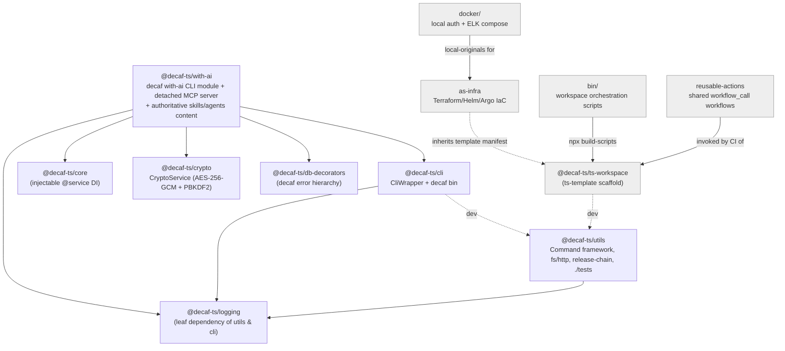
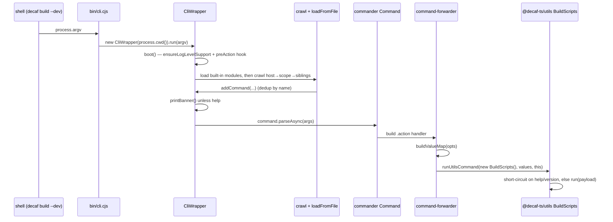
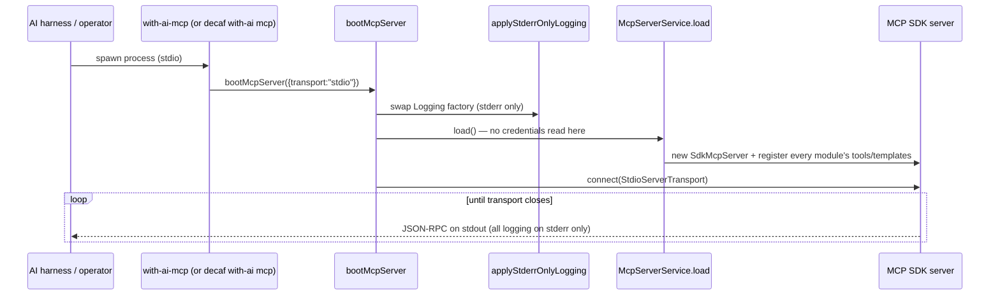
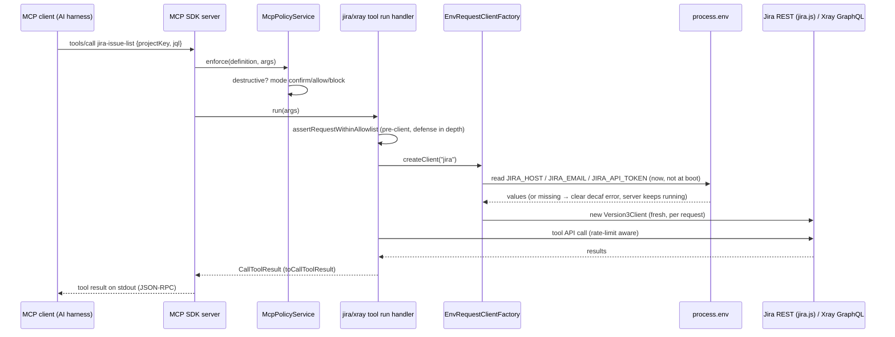

# 09 — Tooling, CLI, MCP Server & Infra

This chapter documents the tooling / DevOps / infra layer of the decaf-ts
monorepo, including the decaf CLI + MCP tooling surface delivered in
`with-ai`. It was originally grounded in two read-only research briefs:

- `_research-briefs/09-mcp-server.md` — the retired `@decaf-ts/mcp-server`
- `_research-briefs/10-tooling-infra.md` — `utils`, `cli`, `with-ai`,
  `reusable-actions`, `ts-template`, `as-infra`, `bin`, `docker`

Sections 4 and 5 have since been brought current with the DECAF-51 port
(retire `mcp-server`; redesign its capability surface into `with-ai`) by
direct source review of the `with-ai` submodule. The approved scope, goals,
requirements, and decision provenance live in the specification record
[`workdocs/ai/project/specifications/DECAF_51.md`](../../specifications/DECAF_51.md)
(domain root [SAA-560](/SAA/issues/SAA-560)) — this chapter documents the
delivered architecture and does not restate them. Where a brief is thin or
self-contradictory, this handbook says so explicitly rather than fabricating.

## 1. Layering & Relationships

The tooling layer sits at the workspace edge of the decaf-ts monorepo and is
consumed by — but does not import — the framework packages.



Key relationship facts (from the briefs, updated for the DECAF-51 port):

- **`utils` is the foundation.** It depends only on `@decaf-ts/logging` and is
  consumed by virtually every sibling package for CLI scaffolding, release
  automation, credentials, and the shared `./tests` harness. Its `build-scripts`
  bundler is the canonical monorepo build pipeline.
- **`cli` sits on `utils` + `logging`.** `@decaf-ts/cli` wraps Commander with a
  discovery layer; its built-in `build`/`release`/`utils` modules forward to
  `@decaf-ts/utils` command classes.
- **`mcp-server` is retired.** Its capability surface was redesigned and
  ported into `with-ai` (§4–§5) under specification DECAF-51; it is no longer
  part of the workspace submodule manifest (`.gitmodules`), and nothing in
  the monorepo depends on it at runtime.
- **`with-ai` is the decaf CLI/MCP tooling package and the authoritative
  content bundle.** It is a decaf-cli module package (`decaf with-ai
  <command>`), hosts the detached MCP server (`src/mcp/`), and remains the
  single authoritative source for skills/agents/markdown. It consumes the
  decaf-ts foundation (`logging`, `core`, `crypto`, `db-decorators`, `cli`)
  as runtime dependencies; no decaf-ts module imports it (see §5).
- **`ts-template` is the scaffold** every decaf-ts TS package is created from.
- **`as-infra` is the deployment layer** (Terraform/Helm/Argo) beneath the
  application repos; it is a deployment target, not a library import.
- **`bin/`, `reusable-actions/`, `docker/`** are workspace-edge infra with no
  npm package and no runtime importers.

## 2. utils — `@decaf-ts/utils`

> "module management utils for decaf-ts" — `package.json:5`. ESM-first, dual
> CJS/ESM export map. Engines Node `>=20`, npm `>=10`. Two export paths: `"."`
> and `"./tests"`.

### 2.1 Purpose & role

`utils` standardizes APIs across the monorepo and provides a reusable
foundation for CLI applications and CI/CD scripting: an abstract command
framework, eleven shipped bin entrypoints, interactive prompting / argument
parsing, fs/package/http helpers, output-writer abstractions, a performance
benchmark harness, and a release-chain orchestration layer. It is a leaf
utility; the README positions it as "a light version of the Decaf CLI tool".

### 2.2 Architecture & structure

`src/` follows the namespace-by-folder convention (one class per file; types in
`types.ts`; constants/enums in `constants.ts`; barrels per folder). The top
barrel aggregates six subpackages via wildcard re-exports — `./cli`, `./input`,
`./output`, `./utils`, `./writers`, `./release-chain` — plus four build-time
placeholder constants (`VERSION`/`COMMIT`/`FULL_VERSION`/`PACKAGE_NAME`) whose
`##...##` tokens are substituted at publish time.

| Folder | Contents |
|---|---|
| `src/cli/` | `Command<I,R>` (abstract base), `commands/` (11 concrete commands) |
| `src/input/` | `UserInput`, `ParseArgsOptionsConfig` |
| `src/output/` | `printBanner` + slogan rendering |
| `src/utils/` | `constants`, `fs`, `http` (`HttpClient`), `types`, `utils` (`lockify`, `chainAbortController`, `spawnCommand`, `runCommand`), `performanceRunner`, plus unre-exported `md.ts`/`timeout.ts` |
| `src/writers/` | `OutputWriter`, `StandardOutputWriter`, `RegexpOutputWriter` |
| `src/release-chain/` | `ReleaseChainRunner`, `runReleaseChain`, `dispatchReleaseChainWorkflow` |
| `src/bin/` | per-bin entrypoint shims |
| `src/tests/` | `TestReporter`, `Consumer`, `jestPerformanceRunner`, utils (reachable only via `./tests`) |
| `src/assets/` | `slogans.ts` for `printBanner` |

### 2.3 Public API surface

From the main barrel:

- **CLI framework** — `Command<I,R>` (abstract; subclasses implement
  `run(answers)` and optionally `help()`; `execute()` orchestrates parsing →
  help/version short-circuit → prompt for missing answers → `run`); plus
  `CommandOptions`, `ParseArgsOptionsConfig`. Concrete commands: `BuildScripts`,
  `ReleaseScript`, `ReleaseChainCommand`, `ModulesCommand`, `NpmLinkCommand`,
  `NpmTokenCommand`, `RunAllCommand`, `TagReleaseCommand` (shell variant),
  `CredentialsCommand` (+ `resolveSecret`/`hasSecret`), `CompileMatrixCommand`,
  `MirrorRepoCommand`.
- **Input** — `UserInput` (builder methods; static `ask`, `askText`, `askNumber`,
  `askConfirmation`, `insistForText`, `parseArgs`).
- **Output** — `printBanner(logger?)`.
- **Utils** — constants (`Encoding`, `SemVersionRegex`, `SemVersion`, skip-CI
  flags, `Tokens`, `AbortCode`); fs (`patchFile`, `readFile`, `writeFile`,
  `getAllFiles`, `copyFile`, `renameFile`, `deletePath`, `getPackage`,
  `setPackageAttribute`, `getPackageVersion`, `getDependencies`,
  `installDependencies`, `listFolder`, `listNodeModulesPackages`);
  `HttpClient.downloadFile`; types (`PromiseExecutor`, `CommandResult`,
  `Environment`, `DependencyMap`); utils (`lockify`,
  `chainAbortController`, `spawnCommand`, `runCommand`); `PerformanceRunner`
  + scenario/phase types.
- **Writers** — `OutputWriter` (interface), `StandardOutputWriter`,
  `RegexpOutputWriter`.
- **Release chain** — `ReleaseChainRunner`, `runReleaseChain`,
  `dispatchReleaseChainWorkflow`.
- **Build placeholders** — `VERSION`, `COMMIT`, `FULL_VERSION`, `PACKAGE_NAME`
  (literal `"##...##"` in source; only meaningful in a built `build-scripts`
  bundle).
- Secondary entrypoint `@decaf-ts/utils/tests` — `TestReporter`, `Consumer`,
  `jestPerformanceRunner`, utils.

### 2.4 Patterns and WHY

- **Template Method (`Command<I,R>`).** Subclasses override `run`; `execute()`
  owns the cross-cutting lifecycle (parse → help/version short-circuit → prompt
  → run). This guarantees every command gets uniform arg parsing, help, and
  dry-run handling without each subclass reinventing it.
- **Strategy family (`OutputWriter`).** `StandardOutputWriter` logs and
  accumulates; `RegexpOutputWriter` resolves the executor on the first regex
  match. Decoupling process-output handling lets callers observe child-process
  output by pattern without parsing it themselves.
- **Chain-of-Responsibility (`CredentialsCommand`).** Credentials resolve env
  var → OS keychain → legacy plaintext file. This makes CI (env) and local dev
  (keychain) first-class while keeping a deprecated fallback.
- **Mutex/composition (`lockify`, `chainAbortController`).** Concurrency
  primitives reused across commands and release-chain steps.
- **Workflow chaining (`ReleaseChainRunner`/`runReleaseChain`/`dispatchReleaseChainWorkflow`).**
  Encodes multi-step release pipelines as composable, abortable units.
- **Build-time token substitution** (`##...##` placeholders). Keeps version/commit
  metadata out of source; injected by `build-scripts` at bundle time so the
  published artifact carries the real `package.json` version.
- **`"sideEffects": false`** enables tree-shaking for library consumers.

### 2.5 Data & control flow

Three principal channels:

1. **CLI arg flow** — `process.argv` → `UserInput.parseArgs` (wraps Node
   `util.parseArgs`) → typed `answers` → `Command.run`; missing required
   answers trigger interactive `prompts`.
2. **Child-process output flow** — `spawnCommand`/`runCommand` spawn a process,
   route stdout/stderr chunks to an `OutputWriter`; `StandardOutputWriter`
   logs+accumulates, `RegexpOutputWriter` resolves the executor on first regex
   match; on exit the executor resolves/rejects.
3. **Build-time token flow** — placeholder constants are substituted by
   `build-scripts` at bundle time. The release-chain channel routes workflow
   steps through `dispatchReleaseChainWorkflow` → `runReleaseChain` →
   `ReleaseChainRunner`.

### 2.6 Lifecycle / env / bin

Eleven bin entrypoints: `modules`, `run-all`, `npm-link`, `npm-token`,
`tag-release`, `build-scripts`, `credentials`, `release-chain`,
`release-chain-dispatch`, `compile-matrix`, `mirror-repo`. Binaries point at
`lib/cjs/bin/*.cjs` — build/install before use. The `build`/`build:prod` scripts
run the in-package rollup bundler then `add:shebang` (injects
`#!/usr/bin/env node` + `chmod +x`). Coverage writes to
`./workdocs/reports/data`; releases via `./bin/tag-release.sh` and
`clean-publish`.

Environment variables actually read by `utils` (per brief):

- `NPM_TOKEN` (token-authenticated install/publish via `CredentialsCommand` /
  `bundle.js` / `bin/tag-release.sh`).
- Credentials resolution order: env var → OS keychain → deprecated legacy file
  (with warning). No other `utils`-owned env vars are documented in the brief.

### 2.7 Testing

`tests/` split into `unit/` (16 files) and `integration/` (5 files), plus a
`module-router.ts` helper that selects between `src`/`lib`/`dist` import roots.
Jest config uses `ts-jest`, Node env, `--runInBand`, coverage from `src/**`
excluding `src/bin`. A `trivy` security-scan fixture lives under the tests
tree. Several `ReleaseScript`-related suites are `.skip`ped (the tag-release
path has reduced automated coverage). Circular deps checked via `dpdm`. Gaps:
skipped release tests; `md.ts`/`timeout.ts` untested (and unre-exported).

### 2.8 Minimal usage examples

Custom command (from `workdocs/5-HowToUse.md:14-74`):

```ts
class MyCommand extends Command<MyCommandOptions, string> {
  constructor() {
    super('my-command', { /* CommandOptions map */ });
  }
  async run(answers: MyCommandOptions): Promise<string> { /* ... */ return 'ok'; }
}
await new MyCommand().execute();
```

Credentials:

```bash
credentials --action get --name npm      # prints the token
credentials --action setup --rm          # enroll built-in secrets in OS keychain, remove legacy files
```

Programmatic: `resolveSecret('npm')` / `hasSecret('github')` follow env →
keychain → legacy-file order.

Filesystem:

```ts
import { patchFile, getAllFiles } from '@decaf-ts/utils';
patchFile(path, { '{{name}}': 'John' });
getAllFiles(dir, filter);
```

### 2.9 Consumer notes / trade-offs

- Two entrypoints: main barrel vs `./tests` subpath (separate export map, not
  reachable from the main import). The `./tests` subpath is undocumented in the
  README.
- Build placeholders are literal `"##...##"` in source — only meaningful in a
  built `build-scripts` bundle.
- All deps are runtime (no `devDependencies`/`peerDependencies` split) — library
  consumers pull the entire build/test/lint toolchain transitively.
  `@decaf-ts/logging` and `typed-object-accumulator` use floating `latest` (a
  reproducibility hazard).

## 3. cli — `@decaf-ts/cli`

> "cli for decaf-ts projects". ESM, dual CJS/ESM. Bin `decaf` →
> `lib/cjs/bin/cli.cjs`. Pre-1.0 (`0.12.0`) — API may change between minor bumps.

### 3.1 Purpose & role

Provides the unified `decaf` CLI entrypoint for the monorepo. It wraps
Commander.js with a discovery layer (`CliWrapper`) that crawls the filesystem
and `node_modules/@decaf-ts/*` (and sibling packages) for files named
`cli-module.[cm]js`, dynamically loads each as a Commander subcommand, and
registers built-in modules (`build`, `release`, `utils`). Relied on by most
sibling packages (e.g. `with-ai`, `for-fabric`, `for-nest`, `for-angular`) to
drive build/docs/release flows via the `decaf` bin.

### 3.2 Architecture & structure

| File | Role |
|---|---|
| `src/CliWrapper.ts` | central class: module discovery, loading, registration, banner/slogan rendering, log-level wiring, `run()` entry |
| `src/Command.ts` | a custom `Command` subclass of commander's `Command` with an `action()` override (exported but unused internally — see inaccuracies) |
| `src/constants.ts` | `CLI_FILE_NAME = "cli-module"` |
| `src/environment.ts` | `DecafCliEnvironment` type, `DefaultCliEnvironment`, `DecafCLieEnvironment` accumulated instance (note identifier typo) |
| `src/types.ts` | `CliModule` function type |
| `src/utils.ts` | `CLIUtils` static helper (`loadFromFile`, `normalizeImport`, `initialize`, `packageVersion`, `packageName`, `getPackage`) |
| `src/logging.ts` | `getCmdLogger(cmd)` |
| `src/slogans.ts`, `src/banners.ts` | slogan/banner gathering + rendering |
| `src/version.ts` | build placeholders + `Metadata.registerLibrary` side-effect (orphaned — see inaccuracies) |
| `src/bin/cli.ts` | the `decaf` bin: `new CliWrapper(process.cwd()).run(process.argv)` |
| `src/build-module/cli-module.ts` | built-in `build` subcommand → `@decaf-ts/utils` `BuildScripts` |
| `src/release-module/cli-module.ts` | built-in `release` group (`chain`/`dispatch`) |
| `src/utils-module/cli-module.ts` | built-in `utils` group (`libraries`, `environment-export`, `print-all-banners`, `modules`, `run-all`, `npm-link`, `npm-token`, `tag-release`, `credentials`) |
| `src/utils/command-forwarder.ts` | `OptionSpec`, `buildValueMap`, `runUtilsCommand`, `parseOptionalBoolean` — bridges commander options onto `@decaf-ts/utils` command classes' `.run(payload)` |

### 3.3 Public API surface

The barrel `src/index.ts` re-exports exactly three modules:

- `CliWrapper` — constructor `(basePath?, crawlLevels=4)`; `run(args?)`; static
  `accumulateEnvironment(obj)`; static `getEnv()`.
- The custom `Command` class (`src/Command.ts:5`).
- `DecafCliEnvironment` (type), `DefaultCliEnvironment`, `DecafCLieEnvironment`.

**Not** exported from the barrel (despite docs claiming otherwise): `CLIUtils`,
`CLI_FILE_NAME`, `CliModule`, `VERSION`/`COMMIT`/`FULL_VERSION`/`PACKAGE_NAME`,
slogan/banner helpers, `getCmdLogger`. The `decaf` bin is the other public
surface; subcommands `build`, `release` (chain/dispatch), `utils.*`.

### 3.4 Patterns and WHY

- **CliWrapper extends `LoggedClass`**, lazily builds a root commander `Command`
  (`command` getter), initializing it via `CLIUtils.initialize` which hard-codes
  `command.name("decaf")`. Lazy construction keeps `import` cheap.
- **Module registration via discovery.** `crawl(basePath, levels)` recursively
  scans for `${CLI_FILE_NAME}\.[cm]js$`; each hit is `import()`-ed via
  `CLIUtils.loadFromFile`/`normalizeImport` (handles CJS `default` unwrapping);
  loaded modules may be a `Function` (invoked) or `Promise` (awaited) and must
  resolve to a commander `Command`. This lets any decaf-ts package extend the
  `decaf` CLI by shipping a `cli-module.cjs`/`.mjs` — no central registry edit
  needed.
- **Built-in modules** (`INCLUDED_MODULE_FACTORIES = [buildModule,
  releaseModule, utilsModule]`) load first so the core commands always exist
  even before discovery.
- **Discovery scope**: host path → `@decaf-ts/*` scope roots → sibling packages
  in the enclosing `node_modules`; a `seen` set dedups by resolved path.
- **Commander composition (not subclassing).** `CliWrapper` composes a
  commander tree and calls `parseAsync`. The custom `Command` subclass is
  exported but unused internally.
- **Banners/slogans.** On `run()`, if enabled and not a help invocation, a
  random ASCII banner is rendered with a random slogan gathered from
  `workdocs/assets/slogans.json`.

### 3.5 CLI dispatch data & control flow



### 3.6 Lifecycle / configuration / environment

`run(args)` → `boot()`: `ensureLogLevelSupport` adds `--logLevel` + a `preAction`
hook; default `DEFAULT_LOG_LEVEL = LogLevel.info`; loads built-in modules then
crawls host/scope/sibling paths. Constructor defaults: `basePath =
DecafCLieEnvironment.cliModuleRoot`, `crawlLevels = 4` (the bin passes
`process.cwd()`). Environment: `DefaultCliEnvironment = { banner: true,
cliModuleRoot, style: true }`.

Environment variables actually read by `cli`:

- `CLI_MODULE_TOOT` — overrides `cliModuleRoot` (note: the env var name is a
  typo for `CLI_MODULE_ROOT`; the field is `cliModuleRoot`).

`decaf` subcommands: `build`; `release` (children `chain` alias `run`,
`dispatch`); `utils` (children `libraries`, `environment-export`,
`print-all-banners`, `modules`, `run-all`, `npm-link`, `npm-token`,
`tag-release`, `credentials` with `get`/`store`/`setup`/`git-helper`), plus any
discovered modules.

### 3.7 Testing

`tests/unit/` only (no `integration/` dir despite a `test:integration` script).
Files cover help output, crawl/load/boot, banner randomization, slogans, module
loading, and the built-in modules. Coverage gaps: `Command.ts` 27% stmt,
`slogans.ts` 17%, `utils/command-forwarder.ts` 14%, no tests for `release`
chain/dispatch, `utils` credential commands, `runUtilsCommand` help/version
short-circuits, `accumulateEnvironment`/`getEnv`, scope/sibling discovery,
`--logLevel` hook, or the custom `Command`.

### 3.8 Minimal usage examples

Programmatic `CliWrapper` (from `tests/unit/cli.test.ts:55-61`):

```ts
import { CliWrapper } from '@decaf-ts/cli';
const cli = new CliWrapper('./');
await cli.run(['node', 'cli', '-h']); // prints "Usage: decaf [options] [command]"
```

Built-in subcommand via CLI (from `tests/unit/cli-slogans.test.ts:49`):

```bash
decaf utils print-all-banners
```

### 3.9 Consumer notes / trade-offs

- Discovery only finds `cli-module.cjs`/`cli-module.mjs` (regex
  `${CLI_FILE_NAME}\.[cm]js$`), **not** `.js`; crawl depth defaults to 4.
- Default crawl root is `process.cwd()`, override via the (misnamed)
  `CLI_MODULE_TOOT` env var.
- `CLIUtils` and `VERSION` are documented as importable from `@decaf-ts/cli` but
  are not exported from the barrel.
- Banner suppressed for `-h`/`--help`/`help`; disable globally via
  `DecafCLieEnvironment.banner = false`.
- `utils.credentials` commands print secrets to stdout with no trailing newline
  (safe for `$(decaf utils credentials get --name npm)`).
- Published bin is the CJS bundle; build scripts rewrite it to add the shebang —
  consumers building themselves must run the documented `build`/`build:prod`
  scripts (not just `tsc`).

## 4. mcp-server — `@decaf-ts/mcp-server` (retired)

> **Retired.** The legacy MCP server package is retired from the decaf-ts
> architecture: it is no longer part of the workspace submodule manifest
> (`.gitmodules`), and its entire user-facing capability surface was
> redesigned and ported into `with-ai` (§5) under specification DECAF-51.
> The approved goals, requirements, user stories, and the disposition of
> every legacy tool/prompt/resource/module live in the specification record
> [`workdocs/ai/project/specifications/DECAF_51.md`](../../specifications/DECAF_51.md)
> (domain root [SAA-560](/SAA/issues/SAA-560)); this section records the
> retirement and the capability mapping only. The legacy package directory
> may still exist on disk in a workspace checkout, but nothing in the
> monorepo architecture depends on it, and the npm deprecation/publish
> disposition of the legacy package name remains an open operational
> question tracked in that record (§6 there).

### 4.1 Capability mapping

Loss is measured at the **capability level**, not the tool level: where a
legacy tool is dropped from the MCP surface, the with-ai skills catalog plus
Paperclip orchestration demonstrably cover the capability (validated in the
DECAF-51 legacy-functionality inventory, Req-8 of the record).

| Legacy `@decaf-ts/mcp-server` capability | Disposition |
|---|---|
| MCP server boot (`McpServer.boot`, `decaf-mcp start`) | Ported — detached boot in `with-ai`: `decaf with-ai mcp` or the `with-ai-mcp` bin (`with-ai/src/mcp/McpBoot.ts`) |
| Jira tooling (~25 tool modules, zod input schemas, rate limiting, Markdown↔ADF pipeline, `XrayClient`) | Ported — `with-ai/src/mcp/jira/` (21 jira tools, ADF↔markdown pipeline, per-request clients) and `with-ai/src/mcp/xray/` (4 step tools) |
| Jira ticket-template resources | Ported — template resources read from the canonical skills assets (`skills/common/maintain-domain-docs/assets`), single-sourced, never duplicated |
| Central `registerTools`/`registerResources` registration | Replaced — per-module self-registration (`@mcpModule()` decorator + `McpModuleRegistry`); see §5.4 |
| Asset obfuscation (`obfuscate-prompts.cjs`, raw node crypto: `scryptSync` + AES-256-GCM) | Replaced — `with-ai/src/crypto/EncryptionService.ts` on `@decaf-ts/crypto` `CryptoService` (AES-256-GCM + PBKDF2, JSON envelope); see §5.6 |
| Prompts (interactive-jsdoc, JSDoc prompts, Jira/summarization prompts) | Dropped, not ported — with-ai exposes no prompts; capability covered by the skills catalog + Paperclip orchestration |
| Agent orchestration (GOAP planner, mistreevous behavior trees, agent-mode assets, provider shell-out) | Dropped, not ported — replaced by the skills catalog + Paperclip orchestration |
| Summarization (`file-summarizer`), server-info, repo-metadata | Dropped — protocol- or harness-native capabilities |
| `JIRA__*` / `XRAY__*` env contract incl. the single-project `JIRA__PROJECT_KEY` lock | Replaced — new `JIRA_*` / `XRAY_*` names and the `JIRA_PROJECT_KEYS` multi-project allowlist; see §5.5 |

The research brief `_research-briefs/09-mcp-server.md` and the §11.1
inaccuracies below remain as the historical record of the retired package;
they describe code that is no longer part of this architecture.

## 5. with-ai — `@decaf-ts/with-ai`

> "Expose decaf-ts related skills and agents for selected decaf-ts developers,
> plus a lightweight MCP and CLI path for future tooling." ESM, MIT. Node
> `>=20`, npm `>=10`. Bin `with-ai-mcp` → `lib/cjs/bin/mcp.cjs`.

### 5.1 Purpose & role

`with-ai` is the single authoritative source for decaf skills, agents, and
markdown content — and, since the DECAF-51 port, also the home of the decaf
CLI/MCP tooling surface. It is a decaf-cli module package: its command modules
live under `src/cli/` and are auto-picked-up by the `decaf` CLI
(`@decaf-ts/cli` discovery) as `decaf with-ai <command>`. It additionally
hosts a fully detached MCP server (`src/mcp/`) exposing jira/xray/common
tooling for AI harnesses. The published package now carries the real product
code — CLI commands, the MCP runtime, the `@decaf-ts/crypto`-based encryption
pipeline, and the symlinking skill installer — alongside the operational
bundle (`agents/`, `skills/`, `company/`, docker orchestration). It consumes
the decaf-ts foundation (`logging`, `core`, `crypto`, `db-decorators`, `cli`)
as runtime dependencies; no decaf-ts module imports it.

The approved scope, goals, requirements, and decision provenance live in the
DECAF-51 specification record
[`workdocs/ai/project/specifications/DECAF_51.md`](../../specifications/DECAF_51.md);
this chapter documents the delivered architecture only.

### 5.2 Architecture & structure

| Area | Contents |
|---|---|
| `src/cli/` | `cli-module.ts` (the `decaf with-ai` command group auto-discovered by `@decaf-ts/cli`) and `commands/`: `mcp` (boots the MCP server), `encrypt-assets` (build-time content encryption), `install-skills` (harness skill installation) |
| `src/mcp/` (core) | `McpBoot.ts` (detached boot + transport selection), `McpServerService.ts` (SDK server + the per-module registration surface), `McpModuleRegistry.ts` (`@mcpModule()` self-registration), `McpPolicyService.ts` (destructive-tool policy), `RequestClientFactory.ts` (per-request lazy-credential clients), `StderrLogging.ts` (stderr-only logger factory), `McpContentResolver.ts` (packaged-content reader with `.enc` decryption), `McpTypes.ts` (module/tool/template contracts), `modules.ts` (the module manifest) |
| `src/mcp/common/` | `CommonModule` — the `with-ai-ping` health-check/reference tool |
| `src/mcp/jira/` | `JiraModule` (21 tools + ticket-template resources), `JiraClientFactory` (per-request `Version3Client`/`XrayClient` builders), `JiraEnvironment` (lazy credentials, multi-project allowlist, defaults, rate-limit delay), `JiraErrors`, `JiraLogging` (axios logging), `rate-limit`, `create-issue`, `ticket-create`, `ticket-templates` (canonical skills-asset templates), `tool-result`, `adf/` (markdown→ADF pipeline), `markdown/` (ADF→markdown), `schemas/` (zod input schemas ported from the legacy jira module), `tools/` (one file per tool) |
| `src/mcp/xray/` | `XrayModule` (4 tools: `jira-xray-step-{add,update,list,delete}`), `XrayStepApi`, `tools/` |
| `src/crypto/` | `EncryptionService` — `@decaf-ts/crypto` `CryptoService.encrypt/decrypt`, JSON envelope, `encryptTree`/`decryptTree` |
| `src/skills/` | `SkillInstaller` — decrypt-at-install + symlink into harness skill directories |
| `src/bin/` | `mcp.ts` — the standalone `with-ai-mcp` bin (boots the MCP server without the decaf CLI wrapper) |
| `src/index.ts`, `src/utils.ts`, `src/namespace/`, `src/version.ts` | template scaffold barrel (`complexFunction` etc.) + the `VERSION` build placeholder |

Top-level data dirs (`agents/`, `skills/`, `company/`, `paperclip/`,
`projects/`, `helm/`, `terraform/`, `vendor/`, `docker/`, `bin/`) are the
operational Paperclip bundle described in the original research brief; the
docker/company orchestration is unchanged by the DECAF-51 port.

### 5.3 The CLI/MCP split

Two invocation surfaces share one package but are strictly detached:

- **CLI surface** — `decaf with-ai mcp|encrypt-assets|install-skills`,
  registered through standard decaf-cli discovery (`src/cli/cli-module.ts`).
- **MCP surface** — everything under `src/mcp/`, booted either via
  `decaf with-ai mcp` or the standalone `with-ai-mcp` bin.

Detachment rules (DECAF-51):

- **MCP code must not import CLI command modules** — no shared
  process-lifecycle state. Enforced by an ESLint `no-restricted-imports` rule
  scoped to `src/mcp/**/*.ts` that forbids `**/cli/**` and `**/cli-module*`
  imports. The dependency direction is one-way: the `mcp` CLI command is a
  thin launcher that calls `bootMcpServer`; the MCP runtime never references
  the CLI layer.
- **stdout is reserved for MCP JSON-RPC under the stdio transport** (Req-4).
  Under stdio, `applyStderrOnlyLogging()` swaps the decaf `Logging` factory
  to a stderr-writing `MiniLogger` subclass for every logging context in the
  process, before anything else happens at boot — no log level can ever
  pollute the protocol channel.
- **The decaf CLI wrapper prints a farewell to stdout when a command
  resolves**, so under `decaf with-ai mcp` the command action stays pending
  until the transport closes — stdout stays pure JSON-RPC for the entire
  session. The `with-ai-mcp` bin (`src/bin/mcp.ts`) avoids the wrapper
  entirely and is the entry point harnesses should spawn directly.
- **Transports** — stdio (default) and Streamable HTTP
  (`StreamableHTTPServerTransport`, JSON-response mode, UUID session ids,
  default port 3111; the bin reads `MCP_PORT`). Any other transport value
  fails with a clear decaf error. The port is specified in
  `workdocs/ai/project/specifications/DECAF_51.md`; the two transports carry
  different security postures:

  - **stdio is unaffected by the http security model** — the process pipe is
    the protocol channel, so no token is required and logging is
    stderr-only.
  - **The http transport binds loopback only by default** (`127.0.0.1`);
    binding any other interface is an explicit `--host` opt-in.
  - **The http transport requires a bearer token** — `--token <value>` or
    the `WITH_AI_MCP_TOKEN` environment variable (the `with-ai-mcp` bin
    also honors `--host`/`MCP_HOST`); boot fails fast when neither is
    given. Every request is authenticated before it reaches the transport:
    a timing-safe `Bearer` comparison rejects missing/wrong tokens with
    `401` plus a `WWW-Authenticate` challenge, and any request carrying a
    browser `Origin` header is rejected with `403` (the surface targets
    programmatic clients, for which an `Origin` header is always
    cross-origin).



### 5.4 Per-module self-registration

MCP capabilities are organized per module under `src/mcp/{jira,xray,common}`
and self-register against the server core (Req-2: adding a module requires no
core changes):

- `@mcpModule()` is a class decorator that instantiates the decorated
  `McpModule` implementation and registers it in the shared
  `defaultMcpModuleRegistry` at import time.
- `src/mcp/modules.ts` is the module manifest; `McpServerService.load()`
  imports it purely for its side effects, then iterates whatever is
  registered. The core never references concrete modules.
- Each module receives an `McpModuleContext` registration surface —
  `registerTool`, `registerTemplate`, plus the shared
  per-request `clientFactory`. Modules never touch the SDK server directly.
- **Failure isolation:** a module whose `register()` throws is logged and
  skipped; it never takes the server down. Credentials are never read during
  registration.
- **Tools** are defined by name/title/description, a zod `inputSchema`
  (normalized to a raw zod shape for the SDK), MCP SDK annotations
  (`readOnlyHint`, `destructiveHint`, `idempotentHint`, `openWorldHint`), and
  a `run` handler.
- **Templates** are registered both in an in-memory registry and as MCP
  resources under the `with-ai://templates/{id}` URI scheme with
  `text/markdown` content.
- **Prompts:** none — per the DECAF-51 scope amendment the prompts
  registration surface was removed from `McpServerService` entirely;
  `McpModuleContext` exposes a tools/templates-only surface.

**Adding a new module** requires no core changes: create `src/mcp/<name>/`,
implement `McpModule` (a `name` plus `register(context)`), decorate the class
with `@mcpModule()`, and add one export line to `src/mcp/modules.ts`.

**Destructive-tool policy (US-5).** `McpPolicyService` flags destructive
tools in their advertised description (a `[DESTRUCTIVE]` prefix plus a policy
note, so they are clearly displayed even in MCP clients that ignore SDK
annotations) and gates every invocation server-side before the module handler
runs: tool calls must pass `confirm: true`, or the operator sets
`MCP_DESTRUCTIVE_POLICY` to `allow` (disable the gate) or `block`
(hard-fail). The mode is resolved per call, never cached, so operators can
flip the variable without restarting the server.

### 5.5 Per-request clients and the Jira allowlist

**Per-request client construction with lazy credentials** is a hard
requirement of the DECAF-51 delivery: boot must never read credentials, and
missing or invalid credentials must never break boot — they fail only the
individual tool call while the server keeps running.

- `EnvRequestClientFactory` (the default `RequestClientFactory`) holds one
  builder per client kind (`jira`, `xray`). Modules register their builders
  at boot; registering a builder reads no credentials.
- `createClient(kind)` is invoked inside each tool's `run` handler: it reads
  the kind's credential variables from the environment at that moment
  (`JIRA_HOST`/`JIRA_EMAIL`/`JIRA_API_TOKEN` for jira;
  `XRAY_HOST`/`XRAY_CLIENT_ID`/`XRAY_CLIENT_SECRET` for xray), throws a clear
  decaf error naming the missing variables when incomplete, and otherwise
  builds a fresh client for the request.
- `JiraClientFactory` builds a `jira.js` `Version3Client` (basic auth, host
  normalization, axios logging attached) and the GraphQL `XrayClient` (default
  host `https://eu.xray.cloud.getxray.app`) per request.
- The xray module builds its jira client even more lazily — only when a step
  request actually needs to resolve an issue key to its id.
- Optional per-kind credential providers can override environment resolution
  (`registerCredentialProvider`).

**Multi-project Jira allowlist.** The legacy single-project
`JIRA__PROJECT_KEY` lock is gone: one server operates across projects/spaces
of a Jira instance, optionally constrained by `JIRA_PROJECT_KEYS`
(comma- or whitespace-separated project keys; unset/empty means unrestricted
multi-project access).

- `JiraModule` pre-checks project-sensitive arguments against the allowlist
  **before** the per-request client is built — a disallowed project fails
  with the allowlist error even when credentials are also missing — and the
  tools re-check internally (defense in depth).
- JQL arguments are scanned for `project = "X"` / `project in (A, B)` clauses
  and each referenced project is allowlist-checked; list queries can be
  constrained with a generated `project IN (...)` clause.
- `JIRA_DEFAULT_PROJECT_KEY` / `JIRA_DEFAULT_ISSUE_TYPE` provide create-time
  fallbacks (the default project key must be inside the allowlist when one is
  configured); `JIRA_RATE_LIMIT_RETRY_DELAY_MS` (default 3000) governs
  rate-limit retries.

### 5.6 Encryption pipeline and skill installation

**Build-time encryption (`src/crypto/`).** `EncryptionService` wraps
`@decaf-ts/crypto`'s `CryptoService.encrypt/decrypt` (AES-256-GCM with
PBKDF2-SHA256 key derivation), replacing the legacy raw-node-crypto
`obfuscate-prompts.cjs`. Every encrypted file is a JSON envelope
(`{v, alg, kdf, salt, data}`) where `data` holds the base64 IV+ciphertext and
`salt` is the PBKDF2 salt required for decryption. The key is the
out-of-band `ENCRYPTION_KEY` environment variable; a missing key fails fast
with a clear error.

- `decaf with-ai encrypt-assets [--targets skills,agents] [--out dist/content]
  [--in-place] [--remove-original]` encrypts every file under each target
  tree. Out-mode (the default `--out dist/content` flow) writes only the
  `.enc` envelopes — plaintext is never materialized in the output tree at
  all, so even an interrupted build cannot ship cleartext AI content, and
  `--remove-original` is a no-op there; `--in-place` writes `.enc` files
  next to their sources instead.
- `build:public` = `build:prod` + `encrypt-assets --targets skills,agents
  --out dist/content --remove-original` — the public npm artifact ships ALL
  AI-value content encrypted; only decryption-key holders can use the CLI and
  decrypt/link skills.
- Repo-access users keep seeing/editing cleartext markdown in the repo;
  generated `.enc` outputs and the `.decrypted/` staging directory are
  gitignored and never committed (Req-6).

**Skill installation (`src/skills/`).** `SkillInstaller` installs skills into
an AI harness by decrypting the packaged `.enc` content **at install time,
inside the installed `@decaf-ts/with-ai` node_modules package**, then
symlinking harness skill-directory entries to the decrypted markdown (US-3;
installation is gated on holding the decryption key):

1. Resolve the installed package root (walking up from the module location;
   `--package-dir` overrides).
2. Locate the encrypted content root (`dist/content` or `lib/content`).
3. Fail fast when `ENCRYPTION_KEY` is missing or invalid.
4. Decrypt the tree into `<package>/.decrypted/content` (gitignored).
5. Discover skill directories (directories containing a `SKILL.md`) and
   symlink each wanted skill into the harness skills directory
   (`--harness claude|codex|opencode`; default target `.claude/skills`,
   `.codex/skills`, or `.opencode/skills`; `--target` overrides; `--skills`
   selects a subset). An existing real (non-symlink) directory at a target is
   refused rather than overwritten.

**Packaged-content reads (`McpContentResolver`).** MCP-side content (e.g.
ticket templates) resolves from the first available content root:
`WITH_AI_CONTENT_ROOT` override → installed `dist/content` → `lib/content` →
the repo package root (plaintext). Each candidate path is tried
plaintext-first, then as `.enc` (decrypted via `EncryptionService`). The
canonical ticket templates live once in the skills catalog —
`skills/common/maintain-domain-docs/assets/{bug,incident,release,specification,test}-template.md`
— and `jira-ticket-create` reads them from there; no duplicate ticket-template
copies exist anywhere (Req-3; the `feature` ticket type is backed by the
`specification` domain-record template, the catalog's canonical name for
product/feature work).

### 5.7 MCP tool invocation flow



### 5.8 Lifecycle / configuration / environment

CLI/MCP lifecycle and environment:

- **Boot**: `decaf with-ai mcp
  [--transport stdio|http] [--port] [--host] [--token] [--endpoint]` or the
  `with-ai-mcp` bin (stdio by default; `--transport http` with
  `MCP_PORT`/`MCP_HOST`/`WITH_AI_MCP_TOKEN` — loopback bind and a bearer
  token are required, see §5.3). `npm run mcp` is `BANNER=false decaf with-ai mcp`.
- **Build**: `npm run build` (dev) / `build:prod`; `npm run build:public`
  produces the encrypted public artifact.
- **Tests**: `test:unit` / `test:all` (jest; the default test regex covers
  `tests/` only); `test:dist-assets` validates the production artifact
  (`RUN_DIST_TEST=1`); `server:inspect` / `server:inspect:dist` run the MCP
  inspector against the dev/production artifact; `test:live:jira` /
  `test:live:xray` run the idempotent, self-reverting live suites with
  manually injected credentials (their npm scripts also accept the legacy
  `JIRA__*`/`XRAY__*` variable names as fallbacks).

Environment variables read by the with-ai CLI/MCP surface:

| Area | Env vars |
|---|---|
| Jira credentials (lazy, per request) | `JIRA_HOST`, `JIRA_EMAIL`, `JIRA_API_TOKEN` |
| Jira policy | `JIRA_PROJECT_KEYS` (multi-project allowlist; unset = unrestricted), `JIRA_DEFAULT_PROJECT_KEY`, `JIRA_DEFAULT_ISSUE_TYPE`, `JIRA_RATE_LIMIT_RETRY_DELAY_MS` (default 3000) |
| Xray credentials (lazy, per request) | `XRAY_HOST` (default `https://eu.xray.cloud.getxray.app`), `XRAY_CLIENT_ID`, `XRAY_CLIENT_SECRET` |
| MCP policy | `MCP_DESTRUCTIVE_POLICY` (`confirm` default / `allow` / `block`) |
| Content / crypto | `WITH_AI_CONTENT_ROOT` (override the packaged-content root), `ENCRYPTION_KEY` (out-of-band; required for encrypt/decrypt/install) |
| Transport | `MCP_PORT` (HTTP port for the `with-ai-mcp` bin), `MCP_HOST` (HTTP bind address; loopback default), `WITH_AI_MCP_TOKEN` (mandatory http bearer token; stdio needs none) |
| Inspector | `DANGEROUSLY_OMIT_AUTH` |

Operational (Paperclip bundle) lifecycle:

- **Init**: `npm run init` → `bin/init.mjs` (interactive; writes `.env.secret`
  chmod 0600 and `.env.projects`).
- **Env files**: `.env` is tracked and holds non-secret Paperclip config (image
  tags, ports, `PAPERCLIP_HARNESS=opencode`, `USER_UID/GID=1001`, host-tool mount
  paths, feature flags `JIRA_ENABLED`/`PR_ENABLED`/
  `DIRECT_RELEASE_ENABLED` defaulting `false`, `ENV_TARGET`); `.env.secret` and
  `.env.projects` are gitignored but present — `.env.secret` holds
  `BETTER_AUTH_SECRET`, `PAPERCLIP_AGENT_JWT_SECRET`,
  `PAPERCLIP_TOOL_ACTION_SIGNING_SECRET`, `DECAF_MCP_ENCRYPTION_KEY` and
  external MCP tokens; `.env.projects` holds personal workspace paths.
- **direnv** (`.envrc`) exports only `.env.projects` and warns against exporting
  `.env`/`.env.secret` (they set `HOME=/paperclip` which breaks host CLIs).
- **Compose profiles**: `agent-pixels-plugin` is gated behind `--profile ui`;
  `company-skills-sync` starts with every `up`.
- Key env vars: `PAPERCLIP_HARNESS` (default `opencode` in compose, `claude` in
  bootstrap fallback `docker/bootstrap-company.sh:139`), `PAPERCLIP_DATA_DIR`,
  `COMPANY_REPOSITORY_PATH`, `DECAF_TS_PATH`, `PAPERCLIP_PORT` (`.env` uses 3110
  host → 3100 container), `PAPERCLIP_STALE_ALIVE_GRACE_MS` (300000),
  `PAPERCLIP_ISOLATED_WORKSPACES_ALLOWED`.

### 5.9 Data & control flow (Paperclip bundle)

Booting the Paperclip dev harness: `npm run boot:opencode` →
`ensure-env-files.sh` materializes missing gitignored files → `docker compose ...
up --build` builds `docker/Dockerfile` (image `as-a-company-paperclip:local`),
starts `paperclip`, `company-skills-sync`, and `docker-socket-proxy`. The
container entrypoint `docker/bootstrap-company.sh` adjusts the `node` UID/GID,
seeds `/company` from the immutable `/opt/company` bundle if `COMPANY.md` is
absent (copying the selected `<harness>.yaml` to `/company/.paperclip.yaml`),
and on first boot (no `.company-imported` marker) starts a loopback-only
bootstrap Paperclip server on `PAPERCLIP_BOOTSTRAP_PORT` (3101) in
`local_trusted` mode, runs `company import` via the in-container CLI, writes the
marker, then `exec`s the real upstream entrypoint; it also backgrounds the
stuck-agent reconciler loop (20s poll), Playwright browser-cache warm-up, and
the isolated-workspace gate. Host credential dirs (`~/.codex`, `~/.claude`,
`~/.config/opencode`, …) are bind-mounted so agents reuse the operator's
authenticated CLI sessions. `company:sync` runs `sync-company.mjs` twice — it
`docker exec`s the in-container CLI, compares repo `skills/`+`agents/` against
live state, and mutates only diffs.

### 5.10 Testing

`tests/unit/` (jest + ts-jest, CJS mode with targeted transpiling of the
ESM-only unified/remark packages pulled in by the ADF pipeline) covers the
ported surface: `crypto/` (EncryptionService), `skills/` (SkillInstaller),
`mcp/` (McpBoot, McpContentResolver, McpPolicyService, McpRegistration,
RequestClientFactory, CommonModule), `mcp/jira/` (ADF conversion, allowlist,
client factory, environment, per-request client, tool handlers/registration,
link utils, rate limit, ticket templates), and `mcp/xray/` (module
registration, per-request clients, step API, tools).
`tests/unit/mcp-dist-assets.test.ts` (ported from the legacy package)
validates the production artifact when `RUN_DIST_TEST=1`. `live/jira-live.test.ts`
and `live/xray-live.test.ts` are the idempotent, self-reverting live suites
(create → verify → delete, loud user-facing warning on cleanup failure); they
require manually injected credentials, sit outside the default jest test
regex, and run only via their explicit npm scripts. The pre-existing suites
remain: `tests/unit/ts-workspace.test.ts` (template scaffold smoke test) and
`tests/integration/fable-method.bulk.test.ts` (vendored eval bulk audit). The
operational bundle (docker orchestration, bin scripts, agents/skills content)
is not covered by these suites.

### 5.11 Minimal usage examples

CLI/MCP surface (from `package.json` scripts and the command modules):

```bash
decaf with-ai mcp                                # boot the MCP server over stdio
with-ai-mcp                                      # standalone bin, no CLI wrapper
decaf with-ai mcp --transport http --port 3111   # Streamable HTTP transport
npm run build:public                             # build + encrypt AI content for npm
decaf with-ai encrypt-assets --in-place          # .enc next to sources (gitignored)
decaf with-ai install-skills --harness claude    # decrypt + symlink all skills
npm run server:inspect                           # MCP inspector against the dev artifact
JIRA_HOST=... JIRA_EMAIL=... JIRA_API_TOKEN=... npm run test:live:jira
```

Operational bundle (from `package.json` scripts, real):

```bash
npm run init            # initialize env files and boot a harness interactively
npm run boot:opencode   # boot the opencode harness directly
npm run company:sync    # reconcile repo skills/agents onto the live instance
```

### 5.12 Consumer notes / trade-offs

- The MCP surface is tools/templates only — **no prompts** (scope amendment);
  dropped prompt/command capabilities are covered by the with-ai skills
  catalog plus Paperclip orchestration.
- Under stdio, nothing may ever write to stdout except the SDK: the stderr
  logger swap happens first at boot, and the CLI action stays pending until
  the transport closes so the wrapper's farewell cannot pollute the channel.
- Credentials are read from the environment per tool request; there is no
  credential caching layer — rotating credentials takes effect on the next
  tool call without a restart (same for `MCP_DESTRUCTIVE_POLICY`).
- The public npm artifact ships AI-value content encrypted; only
  `ENCRYPTION_KEY` holders can use the CLI skill decrypt/install and read
  packaged templates. Repo-access users see cleartext; `.enc` outputs and
  `.decrypted/` are gitignored.
- The template scaffold (`src/index.ts`, `src/utils.ts`, `src/namespace/`)
  still ships alongside the real product code; the ts-workspace unit test
  remains as the multi-target loader smoke test.
- The operational bundle still requires Docker, a host `decaf-ts` checkout,
  and pre-authenticated Claude/Codex/OpenCode CLI sessions; secret hygiene
  for `.env.secret`/`.env.projects` (gitignored) and the tracked `.env` is
  unchanged.
- The in-container `docker/mcp/managed-mcp.json` allowlist still routes its
  jira/xray entries through `@decaf-ts/mcp-server@latest` (with a temporary
  routing note in the file); migrating that allowlist to the with-ai MCP
  server is follow-up work outside the DECAF-51 delivered surface.

## 6. reusable-actions — `@decaf-ts/reusable-actions` (no npm package)

### 6.1 Purpose & role

A dedicated repository of *reusable* (`workflow_call`) GitHub Actions workflows
shared by every decaf-ts package repo. It centralizes the CI/CD baseline
(build, test/coverage, CodeQL, Snyk, Trivy, Renovate, Pages, release, publish)
so each consumer repo keeps only thin caller workflows. It sits at the workspace
edge rather than in the framework's runtime layer.

### 6.2 Architecture & structure

No `package.json` (only `README.md` + `.github/`). `.github/workflows/`:

| Workflow | Role |
|---|---|
| `codeql-analysis.yml` | CodeQL JS analysis (`workflow_call` + `workflow_dispatch`) |
| `jest-coverage.yaml` | build + coverage + 80% threshold report + GH status |
| `nodejs-build-prod.yaml` | build + `test:all` |
| `pages.yaml` | build + docs + GitHub Pages deploy (`github-pages` environment) |
| `publish-on-release.yaml` | npm publish on release, skip-CI aware |
| `release-on-merge-pr.yml` | PR-merge auto tag bump/build/commit/push |
| `release-on-tag.yaml` | GitHub Release from tag |
| `snyk-analysis.yaml` | Snyk → SARIF → Code Scanning |
| `trivy-scan.yml` | Trivy fs scan, uploads `trivy-report.json`, dispatches renovate |
| `renovate.yml` | Renovate run with `overrides`/`bump-dependents`/`both` strategies |

### 6.3 Public API surface (workflow inputs/secrets)

- `trivy-scan.yml` — `scan-type` (`vuln`|`dep`, default `vuln`), `severity`
  (`HIGH,CRITICAL`), `ignore-unfixed` (`true`), `exit-code` (`1`),
  `upload-artifact` (`true`), `target-branch` (`master`); secret `GH_PAT`
  (optional).
- `renovate.yml` — `pr-strategy` (`overrides`|`bump-dependents`|`both`, default
  `bump-dependents`), `clear-stale-overrides` (`false`),
  `renovate-config-file` (`renovate.json`), `target-branch` (`master`),
  `severity` (`HIGH,CRITICAL`); secrets `RENOVATE_TOKEN`, `GH_PAT`.
- `jest-coverage.yaml` — threshold `80`. The other workflows expose no inputs
  (`workflow_call` only).

### 6.4 Patterns and WHY

- **Composite-by-`workflow_call`** — every shared workflow uses
  `on: workflow_call` (+ `workflow_dispatch`), so callers invoke with
  `uses: ...@main` and `secrets: inherit`. WHY: a single declarative reuse
  boundary keeps repo-specific triggers in the caller and shared steps here.
- **Skip-CI normalization** — workflows rely on GitHub's native `[skip ci]`
  skipping for push/PR events; `publish-on-release.yaml:15` is the exception
  (release events aren't natively skipped, so it explicitly checks
  `!endsWith(github.event.release.body, '[skip ci]')`). This pairs with
  `bin/tag-release.sh:56-94` which normalizes `-no-ci`/`[skip ci]`/`[ci skip]`/
  etc. to a canonical `[skip ci]` before tagging. WHY: one canonical skip-CI
  token across the monorepo + reusable-actions keeps publish/release gates
  consistent.
- **Trivy→Renovate pairing** — `trivy-scan.yml` uploads `trivy-report.json`
  then dispatches `renovate-trigger` (vuln) or `renovate-dep-trigger` (dep) via
  `gh api .../dispatches`; `renovate.yml` reads `trivy-report.json` to scope
  `matchPackageNames` to vulnerable packages at the configured severity and to
  prune stale `package.json` `overrides` entries. WHY: drive security PRs only
  for actually-vulnerable packages at the configured severity.
- **Concurrency groups** keyed by `${{ github.repository }}-${{ github.ref }}`
  with `cancel-in-progress` (except `pages.yaml:9` which sets it `false`).

### 6.5 Lifecycle / configuration / environment

No boot/init code. Configuration is purely declarative YAML inputs. Secrets
convention: `secrets: inherit` from caller. `jest-coverage.yaml`/
`nodejs-build-prod.yaml`/`pages.yaml` run on Node 22, cache `~/.npm`+
`node_modules` and `lib`/`dist` keyed on `package-lock.json` hashes.
`pages.yaml:23-25` requires the `github-pages` environment.

### 6.6 Data & control flow

A PR opens in a consumer repo → its thin `.github/workflows/<x>.yaml` calls
`decaf-ts/reusable-actions/.github/workflows/jest-coverage.yaml@main` with
`secrets: inherit`. The reusable workflow checks out, restores caches, `npm ci`,
builds (`build:prod`), runs `coverage`, posts a `success`/`failure` status to
the commit, and emits an 80%-threshold coverage comment. For security, a
scheduled/PR trivy vuln scan produces `trivy-report.json`; on findings it
dispatches `renovate-trigger`; `renovate.yml` consumes that report to scope and
open automerge-able security PRs.

### 6.7 Testing

None. This is a workflow-only repo; there is no test harness and no
`package.json`/`jest.config`. The only validation surface is the README
"Validation Checklist" (manual). Gap: no automated linting of YAML or dry-run
validation of the workflows.

### 6.8 Minimal usage example

From `README.md:76-88` (caller pattern):

```yaml
name: "Test Coverage"
on:
  pull_request:
    branches: [ master, main ]
  workflow_dispatch:
jobs:
  coverage:
    uses: decaf-ts/reusable-actions/.github/workflows/jest-coverage.yaml@main
    secrets: inherit
```

### 6.9 Consumer notes / trade-offs

- Pin to a stable branch/tag, not `@main`, for production callers.
- `release-on-merge-pr.yml:14` checks only the PR *title* for a trailing
  `-no-ci` (not the commit body).
- `release-on-merge-pr.yml:22` uses Node `22.x` while all other workflows use
  bare `22` (minor matrix inconsistency).
- No automated tests; workflow changes are validated manually via the README
  checklist.

## 7. ts-template — `@decaf-ts/ts-workspace`

> "template for ts projects". An enterprise TypeScript repository
> scaffold/template; new decaf-ts repos are created from this template so
> build/test/lint/docs/CI/Docker/publish tooling is pre-wired.

### 7.1 Architecture & structure

`src/`: `index.ts` (barrel; re-exports `./utils` and `./namespace`, plus
`export const VERSION = "##VERSION##"`); `utils.ts` (`complexFunction(arg1=
"default")` → `"Hello World"+arg1`); `bin/cli.ts` (example CLI: a 60s countdown
timer); `namespace/` (`Class`, `Interface`, `type.ts`, `children/{ChildClass,
ChildInterface, Enum, function}`). Config: `tsconfig.json`, `jest.config.cjs`,
`eslint.config.js`, `Dockerfile`, `.prettierrc`, `renovate.json`, `.npmrc`,
ignores, `.github/`, `.gitlab-ci.yml`, `.idea/`, `.vscode/`, `workdocs/`.

### 7.2 Public API surface

`complexFunction(arg1?: string): string`; `class Class implements Interface` (+
static `method()`); `interface Interface { method<T>(arg1: T): Promise<string>
}`; `type Type<T> = string | T`; `class ChildClass<T> extends Class implements
ChildInterface<T>`; `interface ChildInterface<T> extends Interface {
method2(arg1: T): Promise<string> }`; `enum Enum { OPTION1 = "something" }`;
`function something<T extends Class, V>(this: T, ...args: V[]): Type<T>`; `const
VERSION: string` (placeholder replaced at build).

### 7.3 Patterns and WHY

- **Scaffolding conventions** — barrel `src/index.ts` re-exports submodules;
  nested `namespace`/`children` demonstrates the recommended folder hierarchy.
  Every export carries heavy JSDoc with `@mermaid`/`@example` blocks — the docs
  pipeline (`npm run docs` → `build-scripts --docs`) consumes these.
- **Build versioning** — `VERSION = "##VERSION##"` is a placeholder replaced
  with `pkg.version` during build (`bin/build-scripts.cjs:9741`).
- **Multi-target testing** — `tests/workspace-target.ts` lets the same unit
  tests run against `src`, `lib` (CJS), or `dist` via `TEST_TARGET` env;
  `test:dist` runs both `lib` and `dist`. WHY: one suite validates source and
  both publish artifacts.
- **Script contract** — `build`/`build:prod`/`test:all`/`coverage`/`docs`/
  `prepare-pr`/`prepare-release`/`release` are the shared lifecycle every
  decaf-ts package inherits.

### 7.4 Lifecycle / configuration / environment

First-run: `npm run on-first-run` → `npx update-scripts --boot`. Install:
`npm run do-install` reads `NPM_TOKEN=$(cat .npmtoken)`. Build modes:
`--dev`/`--prod`/`--docs` flags to `build-scripts`. Test targets: `TEST_TARGET`
∈ {`src`,`lib`,`dist`}; coverage gate 80%. Env-required secrets files: `.token`
(git), `.npmtoken` (npm), `.dockertoken`, `.dockeruser`, `.confluence-token`.
Engines: Node `>=20`, npm `>=10`. Codex prompts under `./.codex/prompts/`
synced to `~/.codex/prompts` via `bin/sync-codex.sh`.

### 7.5 Minimal usage example

From `tests/unit/ts-workspace.test.ts:81-97` (real assertions against the
template's own exports):

```ts
const { complexFunction } = workspaceModule;
expect(complexFunction()).toBe('Hello Worlddefault');

const { Class, ChildClass, something } = workspaceModule;
const a = new Class(1, 'string');
expect(Class.method).toThrow();
const b = new ChildClass('string', 'string');
expect(await b.method()).toEqual('ok');
expect(something.call(a)).toEqual(a);
```

### 7.6 Consumer notes

The template ships placeholder `complexFunction`/`Class`/`ChildClass` —
consumers replace these; the unit test is a smoke test for the multi-target
loader, not application logic. `VERSION` is a build-time placeholder; importing
it before `build` yields `"##VERSION##"`. The `repo:*` scripts shell out to
`codex` and require `.codex/prompts/*.md`. `docker:build-base`/
`docker:publish-base` hardcode image `ghcr.io/decaf-ts/ts-workspace:base-...` —
consumers must change the image name. Secrets files (`.token`, `.npmtoken`) are
read by scripts; ensure they are git-ignored.

## 8. as-infra — IaC (no real npm package)

> The directory is `as-infra`; the upstream repo is
> `github.com/decaf-ts/as-infrastructure`. There is **no `src/` directory**; the
> real content is IaC (`terraform/`, `charts/`, `infrastructure/`, `bin/`,
> `tests/`). The `package.json` is a verbatim copy of `ts-template`'s manifest
> and does **not** describe this repo (see inaccuracies).

### 8.1 Purpose & role

Infrastructure-as-Code for the decaf-ts / "PTP" / "Paperclip" platform: Helm
charts, Terraform (local Minikube), Argo CD `Application` manifests, and
bootstrap scripts. It deploys `auth` (Keycloak + Traefik + oauth2-proxy),
`observability` (Elasticsearch/Kibana/beats via ECK), `ptp-backend`,
`ptp-frontend`, and `paperclip` to both Minikube (local) and AWS EKS (cloud)
from the same charts. It is the deployment layer beneath the application repos.

### 8.2 Architecture & structure

- `terraform/local/` — single module declaring six `helm_release` resources
  (`localstack`, `auth`, `observability`, `ptp_backend`, `ptp_frontend`,
  `paperclip`), each chart resolved via `${path.module}/../../charts/<name>`
  and layered with `values.yaml` + `values-local.yaml` plus a `yamlencode`
  secret-name block; `secrets.tf` declares `random_password` resources for every
  credential and namespaces; `localstack-secrets.tf` creates the LocalStack
  AWS-creds `kubernetes_secret`, four `aws_secretsmanager_secret[_version]`, and
  the `paperclip-backups` S3 bucket; `providers.tf` points AWS at LocalStack
  with `test`/`test` creds; Kubernetes/Helm target `var.kube_context` (default
  `minikube`).
- `charts/` — five charts (`auth`, `observability`, `ptp-backend`,
  `ptp-frontend`, `paperclip`), each with `Chart.yaml`, `README.md`,
  `values.yaml`, `values-local.yaml`, `values-aws.yaml`, `templates/`.
- `infrastructure/` — `argocd/` (Argo CD v3.5.0 bootstrap), `apps/` (root
  kustomizations for `local`/`aws`), and per-app `application.yaml` (local) +
  `application-aws.yaml` (destination `name: aws-eks`).
- `bin/` — `sync-codex.sh`, `tag-release.sh` (template copies). `tests/` —
  `integration/` (empty), `unit/` (empty), `trivy-fixture/`, `workspace-target.ts`
  (references nonexistent `../src`).

### 8.3 Public API surface

No exported TS symbols (no `src/index.ts`). The "surface" is the IaC resources:
Terraform module outputs (`localstack_endpoint`,
`localstack_port_forward_command`, `auth_secret_name`,
`observability_secret_name`, `ptp_backend_secret_name`,
`paperclip_secret_name`, `paperclip_database_url` (sensitive)); Terraform
variables; five Helm charts with `values.yaml`/`values-local.yaml`/
`values-aws.yaml` value keys; Argo CD `Application`s.

### 8.4 Patterns and WHY

- **One chart, three value files** — each chart ships `values.yaml`
  (cloud/AWS-shaped defaults) + `values-local.yaml` (Minikube overrides) +
  `values-aws.yaml` (explicit cloud overrides). Environment differences belong
  in overrides/`--set`, never as a second copy of templates. WHY: same chart
  deploys unchanged to local and cloud.
- **Portable secrets model** — charts never own secret material. AWS profile
  renders an ESO `SecretStore` (IRSA via ServiceAccount
  `eks.amazonaws.com/role-arn`) + `ExternalSecret` syncing from AWS Secrets
  Manager; local profile sets `secretStore.enabled: false` and pre-creates the
  `<release>-secrets` Secret out-of-band (Terraform writes them into LocalStack
  Secrets Manager, ESO mirrors them). WHY: no secret material in charts or
  git.
- **Terraform drives Helm** — a single `terraform/local` module installs
  LocalStack + all five charts in dependency order. WHY: one declarative
  provisioning entrypoint for local.
- **Two-step bootstrap** — `scripts/bootstrap-cluster.sh` prepares Minikube +
  cluster operators (CSI hostpath, Traefik CRDs/RBAC, ESO, ECK); then
  `terraform apply` installs the apps.
- **Argo CD GitOps** — `infrastructure/apps/{local,aws}/kustomization.yaml`
  apply the per-app `Application`s; charts live in this repo so chart changes
  ship in the same commit; manual sync only.

### 8.5 Lifecycle / configuration / environment

Terraform vars (`variables.tf`): `kube_context` (default `minikube`),
`localstack_namespace` (`localstack`), `localstack_repository_url`,
`localstack_chart_name`, `localstack_services` (`s3,secretsmanager`),
`auth_namespace` (`auth`), `observability_namespace`, `ptp_backend_namespace`,
`ptp_frontend_namespace`, `paperclip_namespace`, `paperclip_extra_secrets`
(`map(string)`, sensitive, default `{}`), `ptp_backend_extra_secrets`
(sensitive). No `terraform.tfvars` committed; defaults suffice for local
(sensitive extra-secrets supplied via `-var`/`TF_VAR_`). Helm values: per chart;
required-for-cloud keys marked `REQUIRED`. Bootstrap env: `MINIKUBE_PROFILE/
DRIVER/CPUS/MEMORY/CNI`, `TRAEFIK_VERSION`, `TRAEFIK_CRD_URL`,
`TRAEFIK_RBAC_URL`.

### 8.6 Minimal usage example

From `terraform/local/README.md:30-60`:

```sh
minikube start --driver=docker --cni=calico
MINIKUBE_CPUS=8 MINIKUBE_MEMORY=12288 ./scripts/bootstrap-cluster.sh
terraform init
terraform apply
kubectl get pods -A
kubectl -n localstack port-forward svc/localstack 4566:4566
```

From `infrastructure/apps/README.md:65-71`:

```sh
kubectl apply -k infrastructure/apps/local      # Minikube
kubectl apply -k infrastructure/apps/aws        # AWS (needs aws-eks registered in Argo CD)
```

### 8.7 Consumer notes

The `package.json` is a leftover from `ts-template` and does not describe this
repo. Build/test scripts (`build`, `test:all`, `coverage`, `docs`) will fail or
no-op — there is no `src`. Do not `npm run build` here. `terraform/local` is
Minikube-only; AWS provisioning is via Argo CD `Application`s + ESO/IRSA.
All credentials are randomly generated by Terraform for local; for AWS, secrets
must pre-exist in AWS Secrets Manager. Chart `version` fields are `0.1.0` —
early/maturity caveat. The `Dockerfile` here is the template's and is not used
by the IaC pipeline (it copies `./src/` which doesn't exist).

## 9. bin — workspace-level scripts (no npm package)

### 9.1 Purpose & role

Workspace-automation layer above the submodules: orchestrating builds/tests
across all submodules (`run-all.js`), linking local decaf packages into each
submodule's `node_modules` (`npm-link.js`, `npm-token.js`), bundling and
publishing aggregate `@decaf-ts/dist-*` packages (`bundle.js` + `releases/`),
collecting slogans, copying AI docs, syncing codex prompts, and tagging
releases. Also vendors the `build-scripts`/`update-scripts` CLIs that every
package's `npm run build` invokes.

### 9.2 Architecture & structure

- `modules.js` (5 lines) — parses `.gitmodules` for submodule paths.
- `run-all.js` — runs a given command in each submodule's cwd, exits 1 on first
  failure.
- `npm-link.js` — per-submodule, for each `@decaf-ts/*` dependency, symlinks
  `node_modules/<d>/<lib|dist>` to the workspace source; skips
  `@decaf-ts/utils` and `@decaf-ts/logging`; supports `--link`/`--unlink`.
- `npm-token.js` — per-submodule, symlinks `.token` and `.npmtoken` to the
  workspace root copies.
- `collect-slogans.js` — aggregates `slogans.json`/`slogans.ts` from each
  submodule into `all_slogans.json`.
- `bundle.js` — reads `releases/bundles.json` + `releases/package-template.json`
  + root `package.json`; for each bundle builds a `@decaf-ts/<bundle>`
  `package.json`, resolves dependency versions from local submodule
  `package.json`s, merges `overrides` (incl. transitive), runs `npm install`
  then `npm publish --access public`, with `DRY_RUN=1` mode and a `TIMEOUT` env
  between bundles.
- `copy-ai-docs.sh` — copies `logging/AGENTS.md` and `logging/workdocs/ai/`
  into every `.gitmodules` submodule (skipping `logging`).
- `sync-codex.sh` — copies `./.codex/prompts/*.md` to `$HOME/.codex/prompts/`.
- `tag-release.sh` — branch guard (master/main only), interactive prompts,
  skip-CI normalization, `--public`/`--private` access flag, derives semver
  bump from message suffix, `npm version`, token-authenticated
  `git push --follow-tags`, `npm publish` (prerelease→`--tag prerelease`) only
  when skip-CI present.
- `build-scripts.cjs` (~1.1MB) — vendored/bundled `build-scripts` CLI
  (rollup/tsc-based); defines `Modes` (CJS/ESM), `Commands`, options.
- `update-scripts.cjs` — vendored `update-scripts` CLI (first-run bootstrapping).

### 9.3 Public API surface (effective CLI)

- `node bin/run-all.js <command...>` — run a command in every submodule.
- `node bin/npm-link.js [--link|--unlink]` — link/unlink `@decaf-ts/*` deps.
- `node bin/npm-token.js` — symlink token files into submodules.
- `node bin/collect-slogans.js [outPath]` — aggregate slogans.
- `node bin/bundle.js` (env `DRY_RUN`, `TIMEOUT`) — build+publish dist bundles.
- `build-scripts --dev|--prod|--docs|--commands|--banner` — the build CLI.
- `./bin/tag-release.sh [--public|--private] [tag] [message...]` — release
  helper.

### 9.4 Patterns and WHY

- **Submodule-driven orchestration** — `modules.js` is the single source of
  truth for "what's in the workspace"; every other script consumes it. WHY:
  one enumeration of the workspace modules.
- **Local linking instead of publishing for dev** — `npm-link.js` symlinks
  `node_modules/@decaf-ts/<dep>/lib` to the workspace source so submodules
  consume each other's latest code without `npm publish`.
- **Aggregate dist bundling** — `bundle.js` + `releases/bundles.json` produce
  meta-packages (`@decaf-ts/dist-lite`, `dist-base`, `dist-nano`, `dist-pouchdb`,
  `dist-typeorm`, `dist-nestjs`, `dist-hlf-fabric`, `dist-angular`) that group
  related decaf modules for end users (e.g. `dist-base` = `dist-lite` +
  `injectable-decorators` + `transactional-decorators` + `core`). WHY: one
  install for a coherent decaf-ts preset.
- **Skip-CI contract** — `tag-release.sh` normalizes multiple skip-CI spellings
  to a single `[skip ci]` before commit/tag, matching the assumption baked into
  `reusable-actions` workflows. WHY: one canonical skip-CI token across local
  release and CI.
- **Vendored tooling** — `build-scripts.cjs`/`update-scripts.cjs` are large
  bundled outputs (not source) committed here so submodules can
  `npx build-scripts`/`npx update-scripts` without a separate install.

### 9.5 Lifecycle / configuration / environment

Env vars: `DRY_RUN=1` (`bundle.js:34,323`), `TIMEOUT` (seconds, default 20 —
`bundle.js:7`), `TOKEN`/`NPM_TOKEN` (`bundle.js:334,350`), `VERSION` (docker tag
override). Implicit inputs: root `package.json` (scope + `version` + `overrides`),
`.gitmodules` (`modules.js:1`), `bin/releases/bundles.json`,
`bin/releases/package-template.json`. `tag-release.sh` reads `.token` (git push)
and `.npmtoken` (npm publish); requires branch `master`/`main`. `sync-codex.sh`
reads `./.codex/prompts/*.md`; `copy-ai-docs.sh` requires `logging/AGENTS.md` +
`logging/workdocs/ai/`.

### 9.6 Minimal usage example

```sh
node bin/run-all.js npm run build:prod    # run a command in every submodule
node bin/npm-link.js                      # default --link
node bin/npm-link.js --unlink
DRY_RUN=1 node bin/bundle.js              # dry-run bundle generation
./bin/tag-release.sh --public patch "fix auth bug -bug"
```

### 9.7 Consumer notes

`npm-link.js:25-26` deliberately skips `@decaf-ts/utils` and
`@decaf-ts/logging` because they cross-reference each other — don't expect those
to be linked. `bundle.js` `--access public` is hardcoded; private bundles would
need a code change (unlike `tag-release.sh` which supports `--private`).
`releases/<dist-*>/node_modules/` are committed (huge trees) — this bloats the
repo; `DRY_RUN=1` lets you test manifest generation without publishing.
`build-scripts.cjs`/`update-scripts.cjs` are generated/bundled artifacts, not
hand-maintained source — edits should go to their upstream generator, not here.

## 10. docker — local dev infra (no npm package)

### 10.1 Purpose & role

Local Docker Compose dev infrastructure for two platform capabilities: an
auth/edge stack (`auth/`: Keycloak + Traefik + oauth2-proxy + apache sample) and
an observability stack (`elk/`: Elasticsearch + Kibana + metricbeat + filebeat +
fleet-server/APM). These compose files are the *local-dev* originals that the
`as-infra` Helm charts re-derive for Kubernetes.

### 10.2 Architecture & structure

- `auth/docker-compose.yml` — services `keycloak` (`start-dev`, healthcheck on
  `/health/ready`, Traefik labels routing `Host(${KEYCLOAK_HOSTNAME})` to port
  8080), `traefik` (Docker provider, web/websecure entrypoints, HTTP→HTTPS
  redirect, dashboard behind basic-auth), `oauth2proxy` (port 4180, custom
  templates, OIDC to Keycloak, `forwardAuth` middleware exposing
  `/oauth2/auth`), `apache` (httpd sample app behind the oauth middleware).
  Networks: `auth-network`; volumes: `keycloak-data` (bind
  `./volumes/keycloak-data`), `oauth2proxy-templates` (bind
  `./volumes/oauth2proxy-templates`).
- `elk/docker-compose.yml` — `setup` (one-shot CA+cert generation, sets
  `kibana_system` password), `es01` (single-node, xpack security+TLS, mem
  limit), `kibana` (TLS, APM, fleet config from `kibana.yml`), `metricbeat01`
  (system/docker/couchdb/elasticsearch/kibana modules, mounts host `/proc`,
  `/sys/fs/cgroup`, `/`, `/var/run/docker.sock`), `filebeat01` (elasticsearch/
  system modules, container log autodiscover, filestream ingest),
  `fleet-server` (elastic-agent, ports 8220 fleet + 8200 APM, insecure HTTP for
  local). Volumes: `certs`, `esdata01`, `kibanadata`, beat data/logs,
  `fleetserverdata`. Network: `elk-network` (bridge). Plus
  `docker-compose-test_apache.yml` (standalone `httpd:latest` with elastic
  dissect labels for testing log parsing), `kibana.yml`, `filebeat.yml`,
  `metricbeat.yml`.

### 10.3 Patterns and WHY

- **Traefik label-driven routing** — in `auth/`, Traefik discovers services via
  Docker labels, with Let's Encrypt commented out for local use; oauth2-proxy is
  exposed as a `forwardAuth` middleware that other routers attach via
  `middlewares=oauth@docker`. WHY: edge routing + auth as composable middleware.
- **ELK TLS-from-setup** — the `setup` service generates CA + instance certs via
  `elasticsearch-certutil`, shares them through the `certs` volume, and
  bootstraps the `kibana_system` password before ES becomes available. WHY:
  self-contained local TLS without external CAs.
- **Host-mount observability** — metricbeat/filebeat mount host `/proc`,
  `/sys/fs/cgroup`, `/`, and `/var/run/docker.sock` to collect host + container
  metrics/logs. WHY: single-host local observability without a separate agent
  install.
- **Env-var parameterization** — all image tags and secrets come from `${VAR}`,
  implying a `.env` file.

### 10.4 Lifecycle / configuration / environment

`auth/` env vars (from `auth/docker-compose.yml`): `KEYCLOAK_IMAGE_TAG`,
`KEYCLOAK_ADMIN_USERNAME`, `KEYCLOAK_ADMIN_PASSWORD`, `KEYCLOAK_HOSTNAME`,
`TRAEFIK_IMAGE_TAG`, `TRAEFIK_LOG_LEVEL`, `TRAEFIK_HOSTNAME`, `TRAEFIK_BASIC_AUTH`,
`TRAEFIK_ACME_EMAIL` (commented), `OAUTH2_PROXY_IMAGE_TAG`,
`OAUTH2_PROXY_COOKIE_SECRET`, `OAUTH2_PROXY_COOKIE_DOMAINS`,
`OAUTH2_PROXY_WHITELIST_DOMAINS`, `OAUTH2_PROXY_PROVIDER`,
`OAUTH2_PROXY_CLIENT_ID`, `OAUTH2_PROXY_CLIENT_SECRET`,
`OAUTH2_PROXY_EMAIL_DOMAINS`, `OAUTH2_PROXY_REALM`, `ORG_DOMAIN`. `elk/` env
vars: `STACK_VERSION`, `ELASTIC_PASSWORD`, `KIBANA_PASSWORD`, `CLUSTER_NAME`,
`ES_PORT`, `ES_MEM_LIMIT`, `LICENSE`, `KIBANA_PORT`, `KB_MEM_LIMIT`,
`ENCRYPTION_KEY`, `FLEET_PORT`, `APMSERVER_PORT`, `ELASTIC_APM_SECRET_TOKEN`.
Compose expects a `.env` file (referenced in `setup` error messages), but no
`.env` or `.env.example` is committed.

### 10.5 Minimal usage example

```sh
docker compose -f docker/auth/docker-compose.yml up -d   # needs a .env with the ${VARS}
docker compose -f docker/elk/docker-compose.yml up -d    # needs ELASTIC_PASSWORD/KIBANA_PASSWORD/.env
docker compose -f docker/elk/docker-compose-test_apache.yml up -d
```

### 10.6 Consumer notes

Both compose stacks are fully env-var driven — you must supply a `.env` (or
export vars); the `elk/setup` service hard-fails if `ELASTIC_PASSWORD`/
`KIBANA_PASSWORD` are unset. Let's Encrypt is commented out in `auth/` and the
`elk` stack uses self-signed certs from `setup` — local-only posture. `elk` uses
`FLEET_INSECURE=true`, `FLEET_SERVER_INSECURE_HTTP=true`,
`OAUTH2_PROXY_INSECURE_OIDC_ALLOW_UNVERIFIED_EMAIL: true`,
`OAUTH2_PROXY_SSL_INSECURE_SKIP_VERIFY: true` — insecure defaults appropriate
only for local dev. The `keycloak-data` bind volume directory appears missing
under `auth/volumes/` (only `oauth2proxy-templates` present).

## 11. Inaccuracies

Recorded verbatim (with module tag) from the research briefs' own "Inaccuracies
found" sections. No fixes were applied.

> **DECAF-51 note.** Entries tagged `[mcp-server]` describe the retired
> package and are preserved as the historical record (§4). Entries tagged
> `[with-ai]` describe the state at brief-authoring time; the DECAF-51 port
> resolves at least the following recorded with-ai findings: "`src/` is the
> unmodified `ts-workspace` template" (real product code now lives in
> `src/{cli,mcp,crypto,skills}`) and "build scripts prepend a shebang … yet
> there is no `bin` field" (the package now ships the `with-ai-mcp` bin). The
> entries themselves remain untouched below.

### 11.1 mcp-server

- **[mcp-server]** README — The README is the generic `ts-workspace` template,
  not a description of the MCP server. It opens "This repository is meant to
  provide an enterprise template for any standard Typescript project" and all
  badges/links point at `decaf-ts/ts-workspace`. | Evidence: `README.md:2-14`,
  `README.md:30-34`; vs `package.json:2-3` ("mcp server for code assistance")
  and `package.json:78` (`git+https://github.com/decaf-ts/mcp-server.git`). |
  Suggested fix: Author an mcp-server-specific README describing the MCP server,
  CLI, tools/prompts/resources, agent mode, and env vars.
- **[mcp-server]** `package.json` keywords — keywords are
  `["template","typescript","ts"]`, inherited from the template and
  inappropriate for an MCP server package. | Evidence: `package.json:88-92`. |
  Suggested fix: Replace with MCP-relevant keywords (e.g. `mcp`,
  `model-context-protocol`, `decaf-ts`, `jira`, `agent`).
- **[mcp-server]** `package.json` `files` vs `exports` — `exports`/`main`/
  `module`/`types` resolve to `./lib/esm/index.js`, `./lib/cjs/index.cjs`, and
  `./lib/types/index.d.mts`, but the `files` allowlist only ships `dist` and
  `workdocs/assets/slogans.json`; `lib/` is not published. Library consumers
  installing from the registry would get missing-file errors for the
  `import`/`require` conditions. | Evidence: `package.json:8-23` vs
  `package.json:84-87`. | Suggested fix: Add `lib` (and the `bin` script's
  shebang target) to `files`, or drop the `lib`-based `exports` if only the
  bundled CLI is supported.
- **[mcp-server]** Unused dependency `ts-morph` — `ts-morph` (`^27.0.2`) is
  declared in `dependencies` but is never imported anywhere in `src/` (a grep
  for `ts-morph`/`from 'ts-morph'` returns no source hits). The expected
  AST/JSDoc tooling is absent; the corresponding integration tests are all
  `test.skip`/`describe.skip` and reference a non-existent `ast-jsdoc.generate`
  tool. | Evidence: `package.json:124`;
  `tests/integration/ast-jsdoc-tools/apply.test.ts:14` (`test.skip(...)`),
  `repoRunner.test.ts:12` (`describe.skip(...)`); no `src/**` import of
  `ts-morph`. | Suggested fix: Remove `ts-morph` from `dependencies` until the
  AST/JSDoc feature is implemented, or implement and un-skip the tests.
- **[mcp-server]** `main.ts` uses `require.main` in an ESM package —
  `package.json` declares `"type": "module"`, but
  `src/modules/agent/main/main.ts:20` does `if (require.main === module)`.
  `require` is not defined in ESM, so importing this module under ESM would
  throw `ReferenceError: require is not defined`. | Evidence:
  `package.json:4` (`"type": "module"`) vs `main.ts:20-22`. | Suggested fix:
  Use an ESM guard (`import.meta.url === pathToFileURL(process.argv[1]).href`)
  or remove the self-invocation block.
- **[mcp-server]** CLI cannot select HTTP transport — `start --transport`
  defaults to `"stdio"` and `runStandardServer` throws "Unsupported transport
  mode" for any other value, even though `McpServer.boot` implements the
  `StreamableHTTPServerTransport` path for `"http"`. | Evidence:
  `cli-module.ts:84-90` (switch only handles `"stdio"`, else throws) vs
  `mcp-server.ts:287-299` (http branch). | Suggested fix: Wire the CLI
  `--transport http` option through to `boot("http", …)` (with host/port
  options) or document that only stdio is supported.
- **[mcp-server]** `registerJiraTools` passes full `ZodObject` instead of raw
  shape — Every other registrar extracts `.shape` before calling
  `server.registerTool` (`ToolBuilder.build` via `extractShape` at
  `tool-builder.ts:75-83`; agent-mode tools use `z.object({...}).shape` at
  `runtime/register.ts:166-172,261-265`), but `register-utils.ts:361` passes
  `inputSchema: tool.inputSchema` (the full `ZodObject`). The MCP SDK expects a
  `ZodRawShape` (`Record<string, ZodType>`); passing a `ZodObject` instance
  means the SDK sees no per-key entries, so tool argument schemas would not be
  advertised to clients. | Evidence: `modules/jira/register-utils.ts:356-363`
  vs `builders/tool-builder.ts:75-83` and `modules/agent/runtime/register.ts:166-172`.
  | Suggested fix: Pass `tool.inputSchema.shape` (or run it through
  `extractShape`) consistent with the rest of the codebase.
- **[mcp-server]** Dead/commented Jira tool modules —
  `modules/jira/tools/search-jql.ts`, `project-list.ts`, and
  `agile-board-list.ts` are entirely commented out and reference non-existent
  source paths (`../../../tools/search/jql-tool`, `../../../tools/project/list-tool`,
  `../../../tools/agile/board-list-tool` that do not exist in `src/tools/`).
  They are misleading leftovers. | Evidence: the three files are 100%
  commented; `src/tools/` contains only `decoration/`, `index.ts`,
  `server-info.ts`. | Suggested fix: Delete these stub files or implement them
  against the existing `issue-list` (JQL) tooling.
- **[mcp-server]** Dead `example-resource` and `template-module` —
  `resources/example-resource/index.ts` is fully commented out and exports
  nothing (yet `ExampleResource` is referenced nowhere).
  `modules/template-module/index.ts` exports empty `Tools`/`Resources`/`Prompts`
  arrays. Both are unused scaffolding. | Evidence:
  `resources/example-resource/index.ts:1-26` (all comments);
  `modules/template-module/index.ts:5-9`. | Suggested fix: Remove the
  example-resource directory and the template-module, or document them as
  explicit extension points.
- **[mcp-server]** Stale commented code in `McpServer.load()` —
  `mcp-server.ts:135-224` contains a large commented block referencing
  `Resources`, `Tools`, `issueCreateModule`, `issuePromptModule`, and
  `__deferredMcpRegistrations` that are not imported and do not exist in the
  current code. This obscures the real `load()` flow. | Evidence:
  `mcp-server.ts:135-224`. | Suggested fix: Delete the commented block; the
  live registration already happens via `registerTools`/`registerResources`/
  `registerAgentModeAssets`.
- **[mcp-server]** Vestigial `prompts/jsdocs/*.ts` stubs — Files like
  `prompts/jsdocs/class-prompt.ts` export trivial stubs that are **not** wired
  into the runtime `Prompts` array (which uses `NamedPromptBuilder`s in
  `jsdocs-prompts.ts` loaded from `assets/prompts/documentation/*.json`). The
  auto-generated smoke test still imports them, giving a false impression of a
  real subsystem. | Evidence: `prompts/jsdocs/class-prompt.ts:1`;
  `prompts/jsdocs-prompts.ts:4-15` (uses `NamedPromptBuilder`, not these stubs);
  `tests/unit/auto-generated/03_prompts.test.ts:7-14`. | Suggested fix: Remove
  the `prompts/jsdocs/*.ts` stubs (or replace them with the real named-prompt
  wiring if they are intended to be the source of truth).
- **[mcp-server]** `mcp-server.ts` reassigns a union-typed parameter to an
  object — `boot(transportType: "stdio" | "http" | Transport, …)` reassigns
  `transportType` to `new StdioServerTransport()` /
  `new StreamableHTTPServerTransport(...)` inside the switch, then later logs
  `transportType.constructor.name`. While it works at runtime, mutating a
  parameter declared as a string union is misleading and defeats the type
  signature. | Evidence: `mcp-server.ts:228` (param type) vs
  `mcp-server.ts:285,288` (reassignment) and `mcp-server.ts:345`
  (`.constructor.name`). | Suggested fix: Use a local `let transport:
  Transport` variable for the resolved transport and keep `transportType` for
  branch selection.
- **[mcp-server]** `Prompts` array casts hide builder typing —
  `prompts/index.ts:13-14` casts `FileSummarizerPrompt` and
  `InteractiveJsDocPrompt` `as unknown as PromptBuilder`, but both are already
  `PromptBuilder` instances built via `PromptBuilder.builder`. The cast
  suggests a structural mismatch and weakens type safety. | Evidence:
  `prompts/index.ts:13-14`; `prompts/interactive-jsdoc.ts:9-34`;
  `modules/summarization/prompts/file-summarizer-prompt.ts`. | Suggested fix:
  Drop the `as unknown as PromptBuilder` casts (align the prompt builder types
  instead).
- **[mcp-server]** `agent-cache/` contains committed build artifacts — the
  repo root `agent-cache/` directory holds leftover `dist-inspector-pdm-*`
  directories (e.g. `dist-inspector-pdm-01501-JLnZHu`), which are runtime
  scratch output from integration-test helper runs, not source. | Evidence:
  `agent-cache/` listing (`dist-inspector-pdm-01501-*` entries). | Suggested
  fix: Add `agent-cache/` to `.gitignore` and remove the committed
  directories.

### 11.2 utils

- **[utils]** Text Processing exports — `padEnd`, `patchPlaceholders`,
  `toCamelCase`, `toSnakeCase`, `toKebabCase`, `toPascalCase`, `toENVFormat` are
  advertised in README/`workdocs/5-HowToUse.md:420-459` but none are defined in
  `src/`; consumers following the docs hit `undefined` import errors. |
  Evidence: `workdocs/5-HowToUse.md:420-459` vs grep of `src/` (only built-in
  `String.padEnd` calls in `src/output/common.ts` and `performanceRunner.ts:176`).
  | Suggested fix: implement+export these or remove the section.
- **[utils]** `md.ts` and `timeout.ts` are orphaned — `src/utils/md.ts:7-155`
  defines a Markdown model and `src/utils/timeout.ts` exists, but
  `src/utils/index.ts:1-6` re-exports only `constants`, `fs`, `http`, `types`,
  `utils`, `performanceRunner`; neither reaches the public API despite
  `package.json:115` keyword `"md"`. | Evidence: `src/utils/index.ts:1-6`. |
  Suggested fix: re-export `md`/`timeout` or document them as internal.
- **[utils]** `TagReleaseCommand` has no bin — `src/cli/commands/index.ts:8`
  re-exports `tag-release-shell.command` (`TagReleaseCommand`), but
  `package.json:40` routes `tag-release` to `ReleaseScript` in
  `tag-release.command.ts`, so the shell variant is in the public API but
  unreachable as a CLI binary. | Evidence: `package.json:40` vs
  `src/cli/commands/index.ts:8`. | Suggested fix: add a distinct bin for the
  shell variant or stop re-exporting it.
- **[utils]** `src/tests` subpath is undocumented — `./tests` exposes
  `TestReporter`, `Consumer`, `jestPerformanceRunner`, helpers
  (`package.json:19-29`), but `README.md:35-69` describes only
  CLI/Input/Utils/Writers/Output. | Evidence: `package.json:19-29` vs
  `README.md:35-69`. | Suggested fix: document the `./tests` subpath.
- **[utils]** `patchString` is private but imported by docs — `src/utils/fs.ts:18`
  declares `function patchString(...)` without `export`, yet
  `workdocs/5-HowToUse.md:446-450` imports `patchString` from `@decaf-ts/utils`
  (would fail). | Evidence: `src/utils/fs.ts:18` vs
  `workdocs/5-HowToUse.md:446-450`. | Suggested fix: export `patchString` or
  change the example to use `patchFile`.
- **[utils]** Skipped release tests — multiple `ReleaseScript` suites are
  `.skip`ped, leaving the primary `tag-release`/`bin/tag-release.sh` path
  under-tested. | Evidence: `tests/` ReleaseScript suites marked `.skip`. |
  Suggested fix: re-enable or rewrite the release tests.
- **[utils]** `timeout.test.ts` couples to a non-shipped helper — imports from
  `../module-router` (test-only infrastructure). | Evidence: `timeout.test.ts`
  import of `../module-router`. | Suggested fix: keep the router test-only and
  document it.
- **[utils]** Dependency hygiene — all build/test/lint tooling (`jest`,
  `eslint`, `rollup`, `typescript`, `ts-jest`, `jsdoc`, `prettier`, `nodemon`,
  `dpdm`, `npm-check-updates`, `clean-publish`) sits in `dependencies` not
  `devDependencies` (`package.json:125-164`); `@decaf-ts/logging` and
  `typed-object-accumulator` use floating `latest`. | Evidence:
  `package.json:125-164,126,161`. | Suggested fix: move tooling to
  `devDependencies` and pin internal deps.
- **[utils]** README size claim — `README.md:31` says "Minimal size: 28.5 KB kb
  gzipped" (redundant "KB kb") with no regen mechanism. | Evidence:
  `README.md:31`. | Suggested fix: remove or regenerate the size badge.

### 11.3 cli

- **[cli]** Public API — `CLIUtils` documented as exported from
  `@decaf-ts/cli` but the barrel does not re-export `./utils`. | Evidence:
  `README.md:171`/`workdocs/5-HowToUse.md:89` show
  `import { CLIUtils } from "@decaf-ts/cli";` vs `src/index.ts:1-3`. | Suggested
  fix: re-export `CLIUtils` or remove the examples.
- **[cli]** Public API — `VERSION` (and `COMMIT`/`FULL_VERSION`/`PACKAGE_NAME`)
  claimed exported but unreachable; `src/version.ts` is never imported/
  re-exported anywhere in `src/`. | Evidence: `src/index.ts:8` JSDoc "exporting
  the CliWrapper class and VERSION constant" vs no `from "./version"` import
  anywhere. | Suggested fix: add `export * from "./version"` to `src/index.ts`
  or remove the JSDoc claim.
- **[cli]** `version.ts` is orphaned dead code, so `@decaf-ts/cli` never
  self-registers with `Metadata`. | Evidence: `src/version.ts:36` calls
  `Metadata.registerLibrary` but nothing imports `./version`;
  `src/bin/cli.ts:26` imports only `CliWrapper`. | Suggested fix: import
  `./version` from `src/index.ts` or `src/bin/cli.ts`, or delete the file.
- **[cli]** README/workdocs advertise `npx decaf list` but no `list` command
  exists; only `build`/`release`/`utils.*` are registered. | Evidence:
  `README.md:97`, `workdocs/5-HowToUse.md:15`, `src/index.ts:11` JSDoc vs
  registered commands; `cli.test.ts:74-77` confirms only `build`/`release`/
  `utils`. | Suggested fix: remove the `list` examples or implement the command.
- **[cli]** README/workdocs advertise `npx decaf demo command "hello world"`
  but no `demo` module exists. | Evidence: `README.md:200`,
  `workdocs/5-HowToUse.md:118` vs `src/` (no demo module). | Suggested fix:
  remove the demo section or add the module.
- **[cli]** Module-discovery extension mismatch — docs say modules are
  discovered by filename `cli-module.js` but the crawler regex only matches
  `.cjs`/`.mjs`. | Evidence: `README.md:60`, `src/index.ts:6` JSDoc vs
  `src/CliWrapper.ts:553` regex `${CLI_FILE_NAME}\.[cm]js$`. | Suggested fix:
  update docs to `cli-module.cjs`/`.mjs` or extend the regex.
- **[cli]** Environment variable name typo `CLI_MODULE_TOOT` (should be
  `CLI_MODULE_ROOT`). | Evidence: `src/environment.ts:10-11` reads
  `process.env.CLI_MODULE_TOOT`; the field is `cliModuleRoot`. | Suggested fix:
  rename to `CLI_MODULE_ROOT` (or accept both).
- **[cli]** Exported `Command` subclass is broken and unused — `initCliCommand`
  returns an `init` function that does `if (version) return;` and never calls
  the original `fn`, silently dropping the action handler; exported via
  `src/index.ts:2` but no internal module uses it (all import `Command` from
  `"commander"`). `solveValue` also unused. | Evidence: `src/Command.ts:14-54`.
  | Suggested fix: remove `src/Command.ts` from the barrel/exports, or fix
  `initCliCommand` to invoke `fn`.
- **[cli]** JSDoc default mismatch for `crawl` — `src/CliWrapper.ts:540` JSDoc
  says `[levels=2]` but the constructor default used in practice is
  `crawlLevels = 4` (`src/CliWrapper.ts:135`) and `loadModulesFromPath` calls
  `this.crawl(basePath, this.crawlLevels)`. | Evidence:
  `src/CliWrapper.ts:540,135,342`. | Suggested fix: align the JSDoc/default
  with 4-level usage.
- **[cli]** `DecafCLieEnvironment` identifier typo (should be
  `DecafCliEnvironment`). | Evidence: `src/environment.ts:20` exports
  `DecafCLieEnvironment` (note `CLie`), imported as such in
  `src/CliWrapper.ts:15,24,131,841`. | Suggested fix: rename to
  `DecafCliEnvironment` (provide a deprecated alias if needed).
- **[cli]** README badge/size claims are not derived from this package —
  Node/NPM badges pull from
  `raw.githubusercontent.com/badges/shields/master/package.json`; "Minimal size:
  16.7 KB kb gzipped" is a static, redundant string. | Evidence:
  `README.md:33-34,38`. | Suggested fix: point badges at this package's
  metadata or remove the size line.
- **[cli]** `tests/unit/module-loading.test.ts` has a duplicate/conflicting
  `path` import (`import path from "path";` then `import * as path from "path";`).
  | Evidence: `tests/unit/module-loading.test.ts:1,4`. | Suggested fix: remove
  the redundant `import * as path` line.
- **[cli]** Test fixture coverage gaps — empty fixture dirs
  `tests/unit/__fixtures__/esm-package` and `transpiled-default` exist but
  contain no files, yet `CLIUtils.normalizeImport` is documented to handle
  ESM/CJS normalization; no test exercises the ESM `default` unwrapping path.
  | Evidence: `tests/unit/__fixtures__` listing vs `src/utils.ts:38-52`. |
  Suggested fix: add an ESM fixture + test for `normalizeImport`, or remove the
  empty dirs.

### 11.4 with-ai

- **[with-ai]** package.json `types` paths disagree — `exports.types` points to
  `./lib/types/index.d.ts` but the top-level `types` field points to
  `./lib/types/index.d.mts`. | Evidence: `package.json:7` vs `package.json:14`.
  | Suggested fix: reference the same declaration file consistently.
- **[with-ai]** README "What's Inside" agent/skill counts are stale — README
  reports 22 Agents and 141 Skills; actual on disk: 43 agent directories and 244
  `SKILL.md` files (decaf-ts 110, common 39, paperclipai 4, third-party 91 across
  16 namespaces). | Evidence: `README.md:9-13,17-40,48-53` vs `agents/` (43
  dirs) and `skills/` (244 SKILL.md); `AGENTS.md:110-154` already lists 43
  agents. | Suggested fix: regenerate the table from `agents/` and `skills/`.
- **[with-ai]** README agent roster omits the majority of shipped agents — the
  Agents table lists only 22 of 43 dirs (missing e.g. `calendar-writer`,
  `email-writer`, `github-writer`, `teams-writer`, `personal-assistant`,
  `pr-creator`, `pr-failure-analyst`, `observability-engineer`, `tester`, all six
  `red-team-*`, all `fable-*`, `jira-operations-specialist`,
  `decaf-standards-curator`). | Evidence: `README.md:17-40` vs `agents/`
  listing. | Suggested fix: regenerate the agent table from
  `agents/*/AGENTS.md` frontmatter.
- **[with-ai]** `workdocs/4-Description.md` is template boilerplate unrelated to
  with-ai — it reads "No one needs the hassle of setting up new repos… create new
  repositories from this template". | Evidence: `workdocs/4-Description.md:3-5`
  vs `package.json:4`. | Suggested fix: replace with a real summary of the
  agent-company + Paperclip runtime purpose.
- **[with-ai]** `src/` is the unmodified `ts-workspace` template, contradicting
  the package description — every source file self-documents as
  `@module ts-workspace`, `VERSION` is the build placeholder, the unit test file
  is named `ts-workspace.test.ts`, and the public API carries no
  AI/skills/MCP functionality, so the npm-published surface does not match
  "Expose decaf-ts related skills and agents… MCP and CLI path." | Evidence:
  `src/index.ts:1-33`, `src/bin/cli.ts:41-60`, `tests/unit/ts-workspace.test.ts:76-108`.
  | Suggested fix: implement the advertised MCP/CLI in `src/` or document that
  the npm package ships only the template scaffold.
- **[with-ai]** `bin/init.mjs`/bootstrap default harness fallback disagrees with
  `.env`/compose — `bootstrap-company.sh` falls back to `PAPERCLIP_HARNESS=claude`
  while `.env` and `docker-compose.yml` default to `opencode`. | Evidence:
  `docker/bootstrap-company.sh:139` vs `.env:71`/`docker/docker-compose.yml:25`.
  | Suggested fix: align the bootstrap fallback to `opencode` (or derive both
  from one source).
- **[with-ai]** `package.json` `build` scripts prepend a shebang to
  `lib/cjs/bin/*.cjs` implying a CLI artifact, yet there is no `bin` field and
  `npm` ignores it; the CLI in `src/bin/cli.ts` is a demo countdown and is not
  installable as a command. | Evidence: `package.json:60-61`, absence of `bin`
  field; `src/bin/cli.ts:41-60`. | Suggested fix: add a `bin` mapping for the
  intended command or drop the shebang-injection step.
- **[with-ai]** devDependency pin vs runtime invocation pin diverge for
  `@decaf-ts/mcp-server` — devDependency is `^1.15.2` but in-container
  `managed-mcp.json` invokes `@decaf-ts/mcp-server@latest`. | Evidence:
  `package.json:113` vs `docker/mcp/managed-mcp.json:34,46,57,68`. | Suggested
  fix: pin `managed-mcp.json` to a specific version matching the devDependency
  intent.
- **[with-ai]** README "Getting Started" uses `pnpm` while the repo is
  npm-only — `pnpm paperclipai company import …` (`README.md:334-336`) vs the
  repo's scripts/lockfile/engines (npm). | Evidence: `README.md:334` vs
  `package.json:69-72,51-59`. | Suggested fix: document the repo's own
  `npm run init`/`npm run boot:*` flow as primary.
- **[with-ai]** `docker/README.md` port instructions say `http://localhost:3100`
  while `.env` publishes 3110 — `.env` sets `PAPERCLIP_PORT=3110` (host) → 3100
  (container) with `BETTER_AUTH_TRUSTED_ORIGINS=http://localhost:3110`. |
  Evidence: `docker/README.md:85,386` vs `.env:10-18`. | Suggested fix: state the
  host URL as `http://localhost:${PAPERCLIP_PORT}` (3110 by default).
- **[with-ai]** README references `.claude/mcp.json`/`.codex/config.toml` not
  present in the tree — the tracked `.claude/` and `.codex/` dirs contain only
  `prompts/`; the local MCP wiring files are not provided even as templates. |
  Evidence: `README.md:340-357` vs `.claude/`/`.codex/` contents. | Suggested
  fix: ship templates (e.g. `.claude/mcp.json.example`) or document the exact
  contents to create.
- **[with-ai]** Staged deletions of `xray-reader`/`xray-writer` agent dirs and
  `common/xray-ops` skill linger — `git status` shows `AD` (staged-add /
  worktree-delete), indicating an incomplete removal left the index ahead of the
  worktree; AGENTS.md/README already describe these as folded into
  `jira-operations-specialist`. | Evidence: `git status --short` (`AD agents/xray-reader/...`,
  `AD agents/xray-writer/...`, `AD skills/common/xray-ops/SKILL.md`). | Suggested
  fix: commit the deletions so the worktree and index agree.

### 11.5 reusable-actions

- **[reusable-actions]** README vs workflow input parity — README `trivy-scan.yml`
  table omits the `target-branch` input that exists in the workflow. | Evidence:
  `trivy-scan.yml:31-35` defines `target-branch` (default `master`);
  `README.md:32-38` has no row for it. | Suggested fix: add a `target-branch`
  row to the README table.
- **[reusable-actions]** `release-on-merge-pr.yml:51` references an undefined
  `${TAG_NAME}` in the commit message (`git commit -m "Github Action automatic
  release: ${TAG_NAME}"`), while the tag is captured into shell var `TAG` on
  line 49. | Evidence: `release-on-merge-pr.yml:49-51`. | Suggested fix: use
  `${TAG}` (or export `TAG_NAME`).
- **[reusable-actions]** Node matrix inconsistency — `release-on-merge-pr.yml:22`
  uses `22.x`; every other workflow uses bare `22`. | Evidence:
  `release-on-merge-pr.yml:22` vs `jest-coverage.yaml:16`,
  `nodejs-build-prod.yaml:15`, etc. | Suggested fix: standardize on `22`.

### 11.6 ts-template

- **[ts-template]** README `src/bin` shebang claim vs reality —
  `src/bin/cli.ts:6-7` JSDoc says "All files in the ./src/bin folder will have
  `#!/usr/bin/env node` included at the beginning of the file," but `cli.ts`
  itself has no shebang (line 1 is a JSDoc `/**`); the shebang is injected at
  build. | Evidence: `src/bin/cli.ts:1-6`. | Suggested fix: clarify in JSDoc
  that the shebang is injected at build, or add it to the source.
- **[ts-template]** `cli.ts:42` logs a fixed `60` instead of the `counter`
  variable: `` `will stop in ${60} seconds` ``. | Evidence:
  `src/bin/cli.ts:41-42`. | Suggested fix: interpolate `${counter}`.
- **[ts-template]** `cli.ts:56` exits with code `1` on a normal countdown
  completion (`if (!--counter) process.exit(1)`), which signals failure to
  shells. | Evidence: `src/bin/cli.ts:55-56`. | Suggested fix: `process.exit(0)`
  for a normal end (or document the "poor example" intent).
- **[ts-template]** `package.json:96` lists `@decaf-ts/utils` under
  `devDependencies` with version `"latest"` — a non-reproducible pin. |
  Evidence: `ts-template/package.json:95-97`. | Suggested fix: pin to a concrete
  version (or `^x.y.z`).
- **[ts-template]** Committed credential files exist in the working tree:
  `ts-template/.token` and `ts-template/.npmtoken` (40 bytes each). If real
  tokens and not git-ignored, they are a secret-leak risk. | Evidence: `ls -la
  ts-template` showing `-rwxrwxrwx .npmtoken` and `.token`. | Suggested fix:
  confirm `.gitignore`/`.npmignore` exclude them and rotate if real.

### 11.7 as-infra

- **[as-infra]** `package.json` name/description mismatch (primary finding) —
  declares `name: "@decaf-ts/ts-workspace"`, `version: "3.10.17"`, `description:
  "template for ts projects"`, but the directory is `as-infra`, the upstream is
  `github.com/decaf-ts/as-infrastructure`, and the content is
  Terraform/Helm/Argo IaC — a verbatim copy-paste of `ts-template/package.json`
  (only line 3 version differs). | Evidence: `as-infra/package.json:1-98` vs
  `ts-template/package.json:1-98`. | Suggested fix: set `name` to e.g.
  `@decaf-ts/as-infra`, `description` to the IaC purpose, and drop/replace the
  TS-template `scripts`/`exports`/`files`/`keywords`.
- **[as-infra]** `package.json` metadata points at the wrong repo:
  `repository.url = git+https://github.com/decaf-ts/ts-workspace.git`,
  `bugs.url` and `homepage` likewise. | Evidence: `package.json:56-94`; actual
  repo `.gitmodules:92-94` is `as-infrastructure`. | Suggested fix: update
  `repository`/`bugs`/`homepage` to the as-infrastructure URLs.
- **[as-infra]** `README.md` is byte-identical to `ts-template/README.md` —
  title "Typescript Template", "This repository is meant to provide an
  enterprise template for any standard Typescript project", all badges/links
  point at `decaf-ts/ts-workspace`. | Evidence: compare the two files
  (`as-infra/README.md:1-95` == `ts-template/README.md:1-95`). | Suggested fix:
  replace with an as-infra README describing the charts/terraform/argocd layout
  (per-subdir READMEs already exist and are accurate).
- **[as-infra]** `Dockerfile` is the template's and is broken for this repo:
  `COPY ./src/ $WORKDIR/src/` (`Dockerfile:10`) but there is no `src/`;
  `COPY ./.mpmrc $WORKDIR/` (`Dockerfile:14`) is a typo for `.npmrc`;
  `ENTRYPOINT ["node", "lib/cli.cjs"]` (`Dockerfile:42`) references a
  non-existent artifact; `LABEL name="TS Workspace" description="Template
  Dockerfile for typescript projects"` (`Dockerfile:44`). | Evidence:
  `as-infra/Dockerfile:9-14,42,44`; `ls as-infra/src` → not found. | Suggested
  fix: remove the template `Dockerfile` or replace with an IaC-appropriate image
  (and fix `.mpmrc`→`.npmrc`).
- **[as-infra]** `tests/workspace-target.ts:12-16` resolves targets to `../src`,
  `../lib/cjs/index.cjs`, `../dist/ts-workspace.cjs` — none exist;
  `jest.config.cjs` `collectCoverageFrom: ["src/**/*..."]` covers nothing. |
  Evidence: `as-infra/tests/workspace-target.ts:12-16`; `as-infra/jest.config.cjs`.
  | Suggested fix: drop the TS test scaffolding and replace with IaC validation
  tests (terraform/helm/kustomize).
- **[as-infra]** `package.json` scripts are all TS-template scripts (`build:
  build-scripts --dev`, `test:all: jest ...`, `docker:build-base` builds
  `ghcr.io/decaf-ts/ts-workspace:base-...`, `repo:*` codex prompts) that do not
  apply to an IaC repo. | Evidence: `as-infra/package.json:16-55`. | Suggested
  fix: replace with IaC scripts (`terraform init/validate/apply`, `helm lint`,
  `kustomize build`) or remove.
- **[as-infra]** `.gitlab-ci.yml` is the TS-template publish pipeline
  (publishes an npm package via `NPM_PACKAGE_NAME`/`NPM_PACKAGE_VERSION` from
  `package.json` — `.gitlab-ci.yml:11-16`); with no `src`/`lib` to publish, this
  CI is misleading. | Evidence: `as-infra/.gitlab-ci.yml:11-25`. | Suggested
  fix: replace with IaC CI (lint/validate/plan) or remove.
- **[as-infra]** Version `3.10.17` is a TS semver carried over from the
  template; it has no relationship to the IaC content or the chart
  `version: 0.1.0`s. | Evidence: `package.json:3`; `charts/auth/Chart.yaml:12`.
  | Suggested fix: give as-infra its own versioning scheme (or align with chart
  versions).
- **[as-infra]** `infrastructure/auth/application.yaml:14` comment says "unlike
  the paperclip Application which points at the with-ai repo," but
  `charts/paperclip/README.md:6-11` states the paperclip chart was re-derived
  into this repo (no longer points at with-ai) — the comment is stale. |
  Evidence: `infrastructure/auth/application.yaml:14-19` vs
  `charts/paperclip/README.md:6-11`. | Suggested fix: update the comment to
  reflect that all five charts now live in this repo.

### 11.8 bin

- **[bin]** `copy-ai-docs.sh:71` ends with a stray `mpts` token after the final
  `echo "All done."` — garbage/typo at end of file. | Evidence:
  `bin/copy-ai-docs.sh:70-71`. | Suggested fix: delete the trailing `mpts`
  line.
- **[bin]** `modules.js:3` regex `/(?<=").*?(?="])/g` extracts everything between
  `"` and `"]`; with the current `.gitmodules` (paths on `path = X` lines
  without surrounding quotes, and `url = ...` lines that may be quoted), this
  likely returns URLs or an empty/incorrect array instead of local paths,
  breaking `run-all.js`/`npm-link.js`/`npm-token.js` which `cd` into
  `path.join(process.cwd(), l)`. | Evidence: `modules.js:3` vs `.gitmodules`
  format (`path = utils`, no quotes; `url = "https://..."`). | Suggested fix:
  parse `.gitmodules` properly (e.g. grep `path = ` lines, as
  `copy-ai-docs.sh:27` does) instead of the regex.
- **[bin]** `npm-token.js:7,12` log messages say "linking .token"/"linking
  .npmtoken" but the script name `npm-token` implies npm-only; it actually links
  both git (`.token`) and npm (`.npmtoken`) tokens. | Evidence:
  `npm-token.js:7-15`. | Suggested fix: rename to `link-tokens.js` or document
  that it links both.
- **[bin]** `bundle.js:248` sets `pkg.description = "Decaf-ts' ${name} install"`
  for every bundle regardless of the bundle's purpose; per-bundle
  `keywords`/`license` are honored but description is generic. | Evidence:
  `bundle.js:248`. | Suggested fix: allow `entry.description` override in
  `bundles.json`.
- **[bin]** `tag-release.sh:135` unconditionally runs `npm run prepare-release`
  — which for `as-infra` (no `src`) would fail; the script assumes a TS package.
  | Evidence: `tag-release.sh:135`; `as-infra/package.json:38` defines
  `prepare-release`. | Suggested fix: guard `prepare-release` with
  `--if-present` semantics or make the script repo-aware.

### 11.9 docker

- **[docker]** `auth/docker-compose.yml:172` contains a typo in the oauth2-proxy
  router rule: `PathPrefix(\`/oauht2/\`)` (`oauht2` instead of `oauth2`) OR'd
  with the correct `PathPrefix(\`/oauth2/\`)`. The typo'd branch never matches
  (dead code); the correct branch still routes. | Evidence:
  `docker/auth/docker-compose.yml:172`. | Suggested fix: remove the `/oauht2/`
  typo'd alternative.
- **[docker]** `auth/docker-compose.yml:9-12` declares a bind volume
  `keycloak-data` pointing at `./volumes/keycloak-data`, but
  `docker/auth/volumes/` contains only `oauth2proxy-templates` — the
  `keycloak-data` directory is absent, so `docker compose up` will fail to
  bind-mount it (or silently create an empty dir in older Docker). | Evidence:
  `auth/docker-compose.yml:6-12` vs `ls docker/auth/volumes` (only
  `oauth2proxy-templates`). | Suggested fix: create
  `docker/auth/volumes/keycloak-data/` (with a `.gitkeep`) or switch to a named
  volume.
- **[docker]** Inconsistent Traefik service naming — the `oauth-signin` errors
  handler references `auth2proxy@docker` (`:163`), the `oauth-verify` middleware
  points at `http://oauth2proxy:4180/...` (the container name, `:166`), and the
  router service is named `auth2proxy` (`:169-171`); mixing `auth2proxy` (Traefik
  service) and `oauth2proxy` (container) is confusing. | Evidence:
  `auth/docker-compose.yml:163,166,169-171`. | Suggested fix: align the Traefik
  service name and container name (both `oauth2proxy` or both `auth2proxy`).
- **[docker]** `elk/docker-compose.yml:13,16` setup error messages instruct the
  user to "Set the ... environment variable in the .env file," but no `.env` or
  `.env.example` is committed in `docker/elk/`. | Evidence:
  `elk/docker-compose.yml:12-18`; `ls docker/elk` (no `.env*`). | Suggested fix:
  commit a `.env.example` documenting `STACK_VERSION`, `ELASTIC_PASSWORD`,
  `KIBANA_PASSWORD`, `ENCRYPTION_KEY`, `ELASTIC_APM_SECRET_TOKEN`, ports, mem
  limits.
- **[docker]** `elk/metricbeat.yml:54-57` enables a `couchdb` module pointing at
  `localhost:5984`, but in the compose stack metricbeat runs inside its own
  container (`metricbeat01`) where `localhost:5984` is the beat container, not a
  CouchDB host (no couchdb service or network alias exists). | Evidence:
  `elk/metricbeat.yml:54-57` vs `elk/docker-compose.yml:161-193`. | Suggested
  fix: point at a real CouchDB service on the `elk-network` (or remove the
  module if CouchDB isn't part of this stack).
