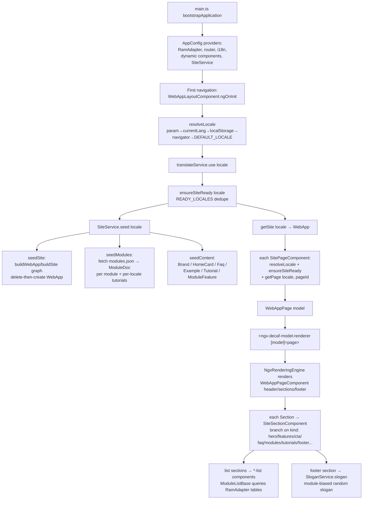
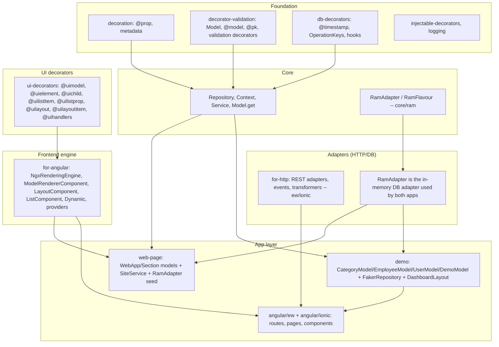

# 10 — Apps & Demos (`web-page`, `demo`)

This chapter covers the two top-of-stack application modules in the decaf-ts monorepo:
the `web-page` marketing website and the `demo` reference project. Both are **consumers**
of the framework, not providers of framework capability. Together they exercise the full
decaf layering — foundation → core → adapters → HTTP/UI → frontend engine — and serve as
canonical proof that the layering composes end-to-end.

Because they sit at the very top, these apps are the integration surface: every
downstream layer is observable through them. They exist to demonstrate *that the stack
works as a whole*, not to expose reusable APIs.

---

## 10.1 Module inventory

| App | Directory | Package | Role | Layers exercised |
|-----|-----------|---------|------|------------------|
| `web-page` | `/workspaces/decaf-ts/web-page` | `@decaf-ts/ts-workspace` (published identity — see Inaccuracies) | The official decaf-ts marketing website; an Angular standalone app on Ionic 8 whose content is modelled as decaf models persisted in an in-memory `RamAdapter` and rendered by the for-angular `NgxRenderingEngine`. | `core` (RamAdapter, Repository, Context, Service), `for-angular` (rendering engine, providers, dynamic components), `ui-decorators`, `decorator-validation`, `decoration`, `db-decorators`, `injectable-decorators`, `logging`, `styles`. |
| `demo` | `/workspaces/decaf-ts/demo` | `@decaf-ts/demo` | A reference demo project: decorator-defined models/forms/layouts, fake-data seeding via `FakerRepository`, and two Angular apps (`ew`, `ionic`) rendering them through the for-angular engine. | `core`, `decorator-validation`, `ui-decorators`, `db-decorators`, `for-angular`, `logging`; the `ew` app additionally pulls `for-http`, `injectable-decorators`, `reflection`, `transactional-decorators`, `styles`. |

Both are **leaf modules**: nothing else in the monorepo imports them.

---

## 10.2 `web-page` — the decaf-ts website

### Purpose and why it exists

`web-page` is the framework's own marketing website, but it is deliberately built *as a
decaf app* rather than as hand-written HTML. Site content (pages, sections, items,
modules, brands, FAQs, tutorials, examples) is modelled as decaf `Model`s decorated with
`@model()`, `@pk()`, `@prop()`, `@list()`, `@uimodel()` / `@uilistmodel()`, seeded into an
in-memory `RamAdapter`, and rendered to the DOM by the for-angular `NgxRenderingEngine`
mapping `uimodel` tags to `@Dynamic()` components.

This makes the site the **canonical consumer of the for-angular + RamAdapter +
ui-decorators stack**. Its existence proves three things at once:

1. The model-decoration → rendering-engine pipeline can drive a real, multi-locale,
   routed content site — not just toy forms.
2. The `RamAdapter` is sufficient as a read-only content store for a static,
   client-side app (no backend required).
3. i18n (`ngx-translate` integration), routing, page transitions, and dynamic-component
   composition all compose cleanly through the decaf provider set
   (`provideDecafDbAdapter`, `provideDecafI18nConfig`, `provideDecafDynamicComponents`,
   `provideDecafPageTransition`).

### Architecture

The site is an Angular standalone app (Angular 21, Ionic 8 in `md` mode) with six routed
pages — `index`, `modules`, `features`, `tutorials`, `examples`, `community` — localized
in four locales (`en_en`, `en_us`, `pt_br`, `pt_pt`).

```
src/main.ts                         bootstrapApplication(AppComponent, AppConfig)
src/app/app.component.ts            root component; template is just <router-outlet>
src/app/app.config.ts               AppConfig providers (see Bootstrap below)
src/app/app.routes.ts               host route '' → WebAppLayoutComponent (lazy)
                                    + six lazy children → SitePageComponent
src/app/structure/                  site graph models: WebApp, WebAppPage, Section
src/app/models/                     content models: SiteItem, ModuleDoc, ModuleFeature,
                                    HomeCard, Faq, Brand, Tutorial, Example
src/app/seed/                       i18n-data.ts (per-locale content) + site.seed.ts
                                    (buildSite(locale) composing the graph)
src/app/services/                   SiteService (+ ensureSiteReady, isSiteLocale,
                                    DEFAULT_LOCALE), SloganService
src/app/components/                 web-app-layout, site-page, site-section,
                                    web-app-page, site-nav, and list components
                                    (brands/home-cards/faq/modules/module-features/
                                    tutorials/examples) extending ModuleListBase
src/assets/                         logos/icons, i18n/*.json, build-time data/
scripts/collect-data.cjs            build-time collector (slogans, module versions)
www-mock/                           static Tailwind-CDN mock for Playwright visual diffs
www/                                committed built output (see Consumer notes)
```

**Bootstrap (`AppConfig` providers):**

- `provideZoneChangeDetection({ eventCoalescing: true })`
- `provideIonicAngular({ mode: 'md' })`
- `provideDecafDbAdapter(RamAdapter, { user: 'user' })` with
  `DbAdapterFlavour = RamFlavour` (from `@decaf-ts/core/ram`)
- `provideRouter(routes)`
- `provideDecafPageTransition()`
- singleton `SiteService`
- `provideDecafI18nConfig({ fallbackLang: 'en_en', lang: 'en_en' }, [{ prefix: './assets/i18n/', suffix: '.json' }])`
- `provideDecafDynamicComponents(SiteSectionComponent, WebAppPageComponent)` — registers
  the two `@Dynamic()` render targets the engine dispatches to.

### Public API surface (barrel `src/index.ts`)

The barrel exposes only what is needed to rebuild/read the site graph — **not** the full
set of content models or the slogan service (see Inaccuracies).

| Export | Kind |
|--------|------|
| `WebApp`, `WebAppPage`, `Section` | site graph models |
| `SiteItem`, `ModuleDoc` | content models |
| `i18n-data` (`SITE_LOCALES`, `SiteLocale`, `SITE_SEED`, per-locale constants, seed item interfaces) | seed data |
| `site.seed` (`buildSite`, `SeedSiteData`, `SeedPage`, `SeedSection`, `SeedItem`) | seed builder |
| `site.service` (`SiteService`, `ensureSiteReady`, `isSiteLocale`, `DEFAULT_LOCALE`) | seeding service |
| `VERSION` (`"0.0.0"`, replaced at release build) | constant |

`ModuleFeature`, `HomeCard`, `Faq`, `Brand`, `Tutorial`, `Example`, and `SloganService`
are **not** re-exported and must be imported from their files.

### Key patterns

- **Model-driven static site.** Pages, sections and items are decaf `Model`s; the DOM is
  produced by the for-angular engine mapping `uimodel` tags to `@Dynamic()` components
  (`app-site-section`, `app-web-app-page`).
- **RamAdapter as content store.** Content is seeded into an in-memory adapter and read
  back through `Repository.forModel(...)`; there is no backend. `ModuleListBase` queries
  these tables (optionally filtered by `module`) for the list sections.
- **Per-locale seeding with dedupe.** `ensureSiteReady(locale)` keeps a module-scoped
  `READY_LOCALES` promise map so concurrent components seed a locale exactly once.
  Seeding is idempotent (delete-then-create per record).
- **i18n via ngx-translate.** Visible strings are locale keys (`titleKey`,
  `subtitleKey`, `kickerKey`) resolved at render time; locale assets live in
  `src/assets/i18n/*.json` and are loaded by `provideDecafI18nConfig`.
- **Locale resolution order.** `?lang=` URL param → `translateService.currentLang` →
  `localStorage['site-locale']` → `navigator.languages` prefix match → `DEFAULT_LOCALE`
  (`en_us`).
- **Build-time data collection.** `scripts/collect-data.cjs` (run via `prebuild:app*`
  hooks) scans `node_modules/@decaf-ts/*` and emits `assets/data/slogans.json` (per-module
  slogan catalogs) and `assets/data/module-versions.json`, which the app `fetch()`es at
  runtime. The site thus acts as a **live catalog of the framework**.
- **Slogan bias.** `SloganService.slogan(module?)` picks a random slogan with a
  `moduleBias = 0.7` probability of drawing from the named module's own catalog.

### Lifecycle and data/control flow



### Testing

Jest (node env; ignores `/tests/playwright/`) covers the seeding and model surfaces:

- `site.seed.test.ts` — `buildSite` per locale: identity, nav, page order, section kinds,
  slim footers, list-bearing body sections.
- `site.service.test.ts` — seed + read-back as model instances, per-locale isolation,
  empty module list.
- `iterable-tables.test.ts` — reads seeded `Brand`/`HomeCard`/`Faq`/`Tutorial`/`Example`/
  `ModuleFeature` rows back through `Repository.forModel`.
- `locale-structure.test.ts` — slogans excluded from seed, nav/page structure,
  hero/footer coupling, i18n-key discipline.
- `model-decoration.test.ts` — asserts `@uimodel`/`@uilistmodel` tags and `@list` clazz
  wiring via `Metadata`.
- `module-doc.test.ts` — `ModuleDoc` seeding for every module in `modules.json` (>=20),
  per-locale tutorials.
- `slogans.service.test.ts` — bias, fallbacks, null catalog.
- `unit/ts-workspace.test.ts` — barrel surface via `workspace-target.ts`
  (`TEST_TARGET` = src|lib|dist).

Playwright (`tests/playwright/`):

- `e2e.spec.ts` — six pages × four locales render with localized content, footer
  placement, no console/page errors.
- `visual-diff.spec.ts` — pixel-matches the built app against `www-mock` goldens,
  two-phase via `VISUAL_TARGET=mock|app`, per page × locale × breakpoint.

Notable gaps: no isolated tests for `WebAppLayoutComponent` / `SitePageComponent` locale
resolution; committed Playwright report/test-results artifacts (see Inaccuracies).

### Usage example

Derived from `tests/site.service.test.ts`:

```ts
import { RamAdapter } from '@decaf-ts/core/ram';
import { SiteService } from '../src/app/services/site.service';
import { WebApp } from '../src/app/structure/WebApp';

new RamAdapter({ user: 'site-service-test' });
const service = new SiteService();
await service.seed('en_us');

const site = await service.getSite('en_us');   // WebApp, 6 pages
const index = await service.getPage('en_us', 'index');
// index.sections[0] is a Section; index.footer[0].kind === 'footer'
```

And the seed-builder surface, from `tests/site.seed.test.ts`:

```ts
import { buildSite } from '../src/app/seed/site.seed';
const site = buildSite('en_us');
site.pages.map(p => p.id);
// ['index','modules','features','tutorials','examples','community']
```

### Consumer notes

- The package is published under the legacy name `@decaf-ts/ts-workspace`, not
  `@decaf-ts/web-page`; treat the name/description as template leftover.
- Content is 100% client-side in a `RamAdapter`; nothing persists across reloads — every
  page view re-seeds (deduped per locale per process).
- `modules.json`, `module-versions.json`, `slogans.json` are build-time assets; a stale
  `node_modules/@decaf-ts` set yields a stale site. `collect-data.cjs` no-ops if the
  `@decaf-ts` scope is missing.
- The barrel does not export all content models or `SloganService`; import those from
  their files if needed.
- `www/` (built output) and Playwright report artifacts are checked in — do not treat
  `www/` as source of truth.
- Maturity: this is the reference consumer for the for-angular + RamAdapter +
  ui-decorators stack, **not** a library meant to be imported by other apps.

---

## 10.3 `demo` — the reference demo project

### Purpose and why it exists

`demo` is the canonical "how to use decaf" sample. It shows how to define models, forms
and layouts with decorators, seed them with fake data via `FakerRepository`, and render
them in Angular through the for-angular engine. It is the reference example for
`@decaf-ts/decorator-validation`, `@decaf-ts/ui-decorators`, `@decaf-ts/db-decorators`,
`@decaf-ts/core` and `@decaf-ts/for-angular`.

It ships **two runnable Angular apps** under `angular/`, both consuming the shared `src/`
models via the `@shared/*` tsconfig path alias:

- **`ew`** (`@decaf-ts/demo-angular-ew`, private) — an Ionic CRUD/login dashboard with a
  split-pane menu, login page, dashboard, and a generic `ModelPage` driven by
  `modelName`/`operation`/`modelId` route params.
- **`ionic`** (`@decaf-ts/demo-angular-ionic`, private) — an Ionic marketing-style site
  (home/modules/examples/features/tutorials) built from static data and decaf layout
  models, with a `capacitor.config.json` for mobile.

Its existence proves that the decorator-driven model → form → layout → rendering-engine
pipeline is enough to build real CRUD and content apps with no hand-written form/template
plumbing.

### Architecture

```
src/index.ts                       barrel: re-exports utils, models, forms, layouts
src/models/                        CategoryModel, EmployeeModel, DemoModel, UserModel
                                    (@model + @uimodel('ngx-decaf-crud-form');
                                    DemoModel composes CategoryModel + UserModel via
                                    @uichild)
src/forms/                         FieldsetForm.ts (User + FieldSetForm),
                                    LoginForm.ts (LoginForm + @uihandlers({login:
                                    LoginHandler})), SteppedForm.ts (not barrel-exported)
src/layouts/                       Dashboard.ts (DashboardLayout, @uilayout grid with
                                    @uilayoutitem / @uichild / @uielement cells)
src/utils/                         FakerRepository.ts, handlers.ts (LoginHandler),
                                    constants.ts (SidebarMenu), types.ts (IMenuItem,
                                    IRawQuery)
src/bin/cli.ts                     template-leftover countdown CLI (see Inaccuracies)
angular/ew/                        Ionic CRUD/login dashboard app
angular/ionic/                     Ionic marketing-style site app
```

### Public API surface (barrel `src/index.ts`)

| Namespace | Exports |
|-----------|---------|
| `models` | `CategoryModel`, `EmployeeModel`, `DemoModel`, `UserModel` |
| `forms` | `User`, `FieldSetForm` (from `FieldsetForm.ts`), `LoginForm` |
| `layouts` | `DashboardLayout` |
| `utils` | `FakerRepository`, `getFakerData`, `LoginHandler`, `SidebarMenu`, `IMenuItem`, `IRawQuery` |

`SteppedForm` is defined in `src/forms/SteppedForm.ts` but **not** re-exported by
`src/forms/index.ts` (see Inaccuracies).

### Key patterns

- **Decorator-defined models.** `@model()` registers the class in the decaf model
  registry; `@pk({ type: 'Number' })` / `@id()` mark the primary key; validation
  decorators (`@required`, `@email`, `@password`, `@eq`, `@min`, `@max`, `@minlength`,
  `@date`, `@url`) attach rules; `@timestamp([OperationKeys.CREATE])` / `@hideOn(...)`
  attach db-decorator behaviour.
- **UI binding decorators.** `@uimodel('ngx-decaf-crud-form')` maps a model to a CRUD
  form renderer; `@uielement('ngx-decaf-crud-field', { label, placeholder, type, options,
  page })` maps fields to inputs; `@uichild(ModelName, 'ngx-decaf-fieldset')` embeds
  child models; `@uilistitem` / `@uilistprop` / `@uilayout` / `@uilayoutitem` drive list
  and layout rendering.
- **FakerRepository.** A thin wrapper that resolves a model constructor by name
  (`Model.get(...)`), obtains `Repository.forModel(constructor, flavour)`, and on `init()`
  seeds 100 fake rows (employees or categories) via `getFakerData` + `faker` when the
  table is empty.
- **Event handlers.** `@uihandlers({ login: LoginHandler })` binds named handlers to a
  form; `LoginHandler.handle(event)` validates presence of username + password and
  returns a boolean the page uses to navigate/toast.
- **Generic model page.** `angular/ew` `ModelPage` takes `modelName`/`operation`/`modelId`
  as route inputs, resolves the model via `Model.get(modelName)`, and performs
  read/create/update/delete through `Repository.forModel`, rendering with
  `ngx-decaf-model-renderer`.
- **Shared source across apps.** Both Angular apps import the shared models/forms/utils
  via the `@shared/*` → `../../src/*` tsconfig path alias.

### Lifecycle and data/control flow

```mermaid
flowchart TD
  A["angular/ew main.ts<br/>bootstrapApplication(AppComponent, appConfig)"] --> B[appConfig providers:<br/>provideDbAdapter RamAdapter,<br/>provideIonicAngular, router,<br/>provideTranslateService + I18nLoader]
  B --> C[AppComponent.ngOnInit → initializeApp]
  C --> D{isDevelopmentMode?}
  D -- yes --> E[for each of<br/>new CategoryModel / new EmployeeModel:<br/>new FakerRepository adapter, model]
  E --> F[repo.init]
  F --> G{table empty?}
  G -- yes --> H[getFakerData 100 rows<br/>+ faker]
  H --> I[repository.createAll rows]
  G -- no --> I
  D -- no --> J[skip seeding]
  I --> J
  J --> K[router: login → dashboard → model/:modelName/:operation[/:modelId]]
  K --> L[LoginPage renders LoginForm via<br/>ngx-decaf-model-renderer]
  L --> M[submit → CrudFormEvent →<br/>handlers['login'] = LoginHandler.handle]
  M --> N["returns !!username && !!password"]
  N -- success --> O[navigate /dashboard + toast]
  K --> P[ModelPage: Model.get modelName →<br/>Repository.forModel → read/create/update/delete]
  P --> Q[refresh + navigate back + toast]
```

### Testing

- Jest (`jest.config.cjs`, node env, ts-jest): the only test is
  `tests/unit/ts-workspace.test.ts`, which is a **stale template test** importing symbols
  that do not exist in this package (see Inaccuracies). There is no real coverage of the
  models, forms, `FakerRepository` or handlers.
- Karma (`angular/ew/karma.conf.js`, `angular/ionic/karma.conf.js`): minimal
  "should create" specs.
- `tests/integration/` is empty (only `.gitlock`).

Notable gaps: no tests for `FakerRepository` seeding, `LoginHandler`, model validation,
or the generic `ModelPage` CRUD flow; the single jest unit test is broken.

### Usage example

Derived from `src/utils/FakerRepository.ts` + `angular/ew/app.component.ts`:

```ts
import { FakerRepository } from '@decaf-ts/demo';
import { CategoryModel } from '@decaf-ts/demo';

// adapter is the injected RamAdapter (DB_ADAPTER_PROVIDER_TOKEN)
const repo = new FakerRepository<CategoryModel>(adapter, new CategoryModel());
await repo.init(); // seeds 100 fake categories if the table is empty
```

And a decorated model (`src/models/CategoryModel.ts`):

```ts
@uilistitem('ngx-decaf-list-item', { icon: 'cafe-outline', className: 'testing' })
@uimodel('ngx-decaf-crud-form')
@model()
export class CategoryModel extends Model {
  @pk({ type: 'Number' }) id!: number;
  @required()
  @uielement('ngx-decaf-crud-field', { label: 'category.name.label' })
  @uilistprop('title')
  name!: string;
  // ...
}
```

### Consumer notes

- Version `0.0.1` — explicitly a sample, not a stable library; APIs may change.
- `SteppedForm` exists in `src/forms/` but is not exported from the barrel; import the
  file directly if needed.
- The `ew` app's `app.config.ts` imports `provideDbAdapter` and `provideI18nLoader` from
  `@decaf-ts/for-angular`, but the current for-angular exports are
  `provideDecafDbAdapter` / `provideDecafI18nLoader` (renamed) — the ew app config is
  stale against current for-angular (see Inaccuracies).
- `angular/ew` has no `node_modules` installed in this workspace (only `angular/ionic`
  does), so the ew app is not buildable as-is here without installing its deps.
- `FakerRepository` is generic over `Model` but its generator only special-cases
  `CategoryModel` (everything else is generated as employees); reuse for other models
  requires extending `getFakerData`.
- The `SidebarMenu` in `src/utils/constants.ts` lists routes the `ew` app's route table
  does not define (see Inaccuracies).
- `Dockerfile`, `src/bin/cli.ts`, `workdocs/` and `README.md` are `ts-workspace`
  template leftovers, not demo-specific.

---

## 10.4 How the apps wire the decaf layers

Both apps are vertical slices of the entire stack. The wiring is identical in shape even
though the content differs:



The key observation: the **app layer contributes only models, seed data, route tables and
page components**. Everything else — persistence, repository lookup, validation,
rendering, list/layout dispatch, i18n, dynamic-component registration — is provided by the
decaf layers below. This is exactly the separation the reference apps are meant to
demonstrate.

---

## 10.5 Relationships

- Both apps **consume** the full decaf stack; neither is consumed by anything else in the
  monorepo.
- `web-page` consumes `@decaf-ts/core` (`Repository`, `Context`, `Service`, `@pk`,
  `RamAdapter`/`RamFlavour` from `core/ram`), `@decaf-ts/for-angular` (the `provideDecaf*`
  providers, `ModelRendererComponent`, `ListComponent`, `NgxComponentDirective`,
  `Dynamic`, `KeyValue`), `@decaf-ts/ui-decorators`, `@decaf-ts/decorator-validation`,
  `@decaf-ts/decoration`, `@decaf-ts/logging`, `@decaf-ts/db-decorators`,
  `@decaf-ts/injectable-decorators`, `@decaf-ts/styles`. Its content (`modules.json`,
  slogans, versions) is **derived from the other decaf packages at build time**, so it
  acts as a live catalog of the framework.
- `demo` consumes `@decaf-ts/core`, `@decaf-ts/decorator-validation`,
  `@decaf-ts/ui-decorators`, `@decaf-ts/db-decorators`, `@decaf-ts/for-angular`,
  `@decaf-ts/logging`. The `angular/ew` app additionally depends on `@decaf-ts/for-http`,
  `@decaf-ts/injectable-decorators`, `@decaf-ts/reflection`,
  `@decaf-ts/transactional-decorators`, `@decaf-ts/styles`; `angular/ionic` adds
  `@decaf-ts/decoration`, `@decaf-ts/for-http`,
  `@decaf-ts/transactional-decorators`, `@decaf-ts/styles`, `@bwip-js/browser`.

---

## 10.6 Using the demos as templates

- **For a content-driven, model-rendered site** (marketing, docs, catalogs) use `web-page`
  as the template: define site-graph + content models, seed a `RamAdapter` per locale,
  register `@Dynamic()` section components, and let the for-angular engine render. Expect
  to bring your own i18n assets and a build-time data collector analogous to
  `collect-data.cjs`.
- **For a CRUD/dashboard app with login** use `demo/angular/ew`: copy the
  `provideDbAdapter(RamAdapter, ...)` + router + i18n provider pattern, the generic
  `ModelPage` driven by `modelName`/`operation`/`modelId`, and the `FakerRepository`
  seeding for dev mode. Swap `RamAdapter` for a real adapter (`for-pouch`, `for-couchdb`,
  `for-typeorm`) to persist.
- **For a marketing-style mobile-capable site** use `demo/angular/ionic`: static decaf
  layout models rendered through `LayoutComponent`, with a `capacitor.config.json` for
  mobile packaging.
- In all cases the shared `src/` library pattern (consumed via a tsconfig path alias)
  keeps models/forms/layouts decoupled from the Angular app shells and reusable across
  multiple app targets.

Both apps are samples, not published libraries: treat them as readable references, not
versioned dependencies.

---

## 10.7 Inaccuracies found

Recorded verbatim from the research brief. Nothing is fixed here.

**[web-page]** package identity — `package.json` name is `@decaf-ts/ts-workspace` and description is `"template for ts projects"`, but the directory/app is the decaf-ts website (`web-page`). The published identity does not match the module. | Evidence: `web-page/package.json:2` (`"name": "@decaf-ts/ts-workspace"`), `web-page/package.json:4` (`"description": "template for ts projects"`). | Suggested fix: rename to `@decaf-ts/web-page` and set a website-app description.

**[web-page]** README / workdocs describe the wrong thing — `README.md` and `workdocs/4-Description.md` are the `ts-workspace` template README ("Typescript Template … enterprise template for any standard Typescript project"), not the website app; they never mention the Angular site, its pages, locales, or the model-driven rendering. | Evidence: `web-page/README.md:2-4` ("## Typescript Template … enterprise template"); `web-page/workdocs/4-Description.md` ("No one needs the hassle of setting up new repos…"). | Suggested fix: rewrite README/workdocs for the website app.

**[web-page]** seed generation script missing — the auto-generated header tells readers to "Re-run scripts/data-transform.cjs", but no such script exists (only `scripts/collect-data.cjs`). | Evidence: `web-page/src/app/seed/i18n-data.ts:2-3` ("AUTO-GENERATED from www-mock/locales … Re-run scripts/data-transform.cjs"); `web-page/scripts/` contains only `collect-data.cjs`. | Suggested fix: add the transform script or correct the header to the real generator.

**[web-page]** stale generated docs — `docs/` (typedoc HTML) references source files that no longer exist (e.g. `app_components_site-pages_*`, `marquee.directive`, `doc-block.component`, `faq-entry.component`, `app_models_Section.ts.html`, `SeedSloganItem`, `app_app.module.config`), so the published API docs do not match the current `src/` tree. | Evidence: `web-page/docs/` listing (e.g. `app_components_site-pages_modules-page.component.ts.html`, `app_components_marquee_marquee.directive.ts.html`) vs. `web-page/src/app/components/` (no `site-pages/`, no `marquee.directive.ts`). | Suggested fix: regenerate `docs/` from current source or remove the stale output.

**[web-page]** barrel omits content models + slogan service — `src/index.ts` does not re-export `ModuleFeature`, `HomeCard`, `Faq`, `Brand`, `Tutorial`, `Example`, or `SloganService`, so the public API surface is smaller than the module's actual models/services. | Evidence: `web-page/src/index.ts` (exports only `SiteItem`, `Section`, `WebAppPage`, `WebApp`, `ModuleDoc`, `i18n-data`, `site.seed`, `site.service`, `VERSION`). | Suggested fix: export the content models and `SloganService` (or document per-file imports).

**[web-page]** committed build/test artifacts — the built app output (`www/`) and Playwright report + test-results artifacts are checked into the repo, which can mask source changes and bloat the tree. | Evidence: `web-page/www/index.html` + hashed bundles; `web-page/tests/playwright/playwright-report/` and `web-page/tests/playwright/test-results/`. | Suggested fix: gitignore and remove `www/` and Playwright report/test-results output.

**[web-page]** unused declared dev dependencies — `package.json` devDependencies include `@decaf-ts/for-couchdb`, `@decaf-ts/for-nano`, `@decaf-ts/for-pouch`, `@decaf-ts/for-typeorm`, but none are imported anywhere in `src/` and none are installed under `web-page/node_modules/@decaf-ts`. | Evidence: `web-page/package.json` devDependencies; `web-page/node_modules/@decaf-ts/` (no for-couchdb/for-nano/for-pouch/for-typeorm); no imports in `src/`. | Suggested fix: drop the unused dev deps.

**[web-page]** Dockerfile is the template leftover — it sets `WORKDIR="ts-workspace"`, `ENTRYPOINT ["node","lib/cli.cjs"]` (this app has no CLI entrypoint) and `LABEL … "Template Dockerfile for typescript projects"`, none of which fit a static website app. | Evidence: `web-page/Dockerfile` (`ENV WORKDIR="ts-workspace"`, `ENTRYPOINT ["node", "lib/cli.cjs"]`, `LABEL … Template Dockerfile`). | Suggested fix: replace with a static-site serving Dockerfile (or remove).

**[demo]** README / workdocs describe the wrong thing — `README.md` and `workdocs/4-Description.md` are the `ts-workspace` template README ("Typescript Template … enterprise template for any standard Typescript project"), not the demo project; they never mention the models, forms, `FakerRepository` or the two Angular apps. | Evidence: `demo/README.md:2-4` ("## Typescript Template … enterprise template"); `demo/workdocs/4-Description.md` ("No one needs the hassle of setting up new repos…"). | Suggested fix: rewrite README/workdocs for the demo project.

**[demo]** broken/stale unit test — `tests/unit/ts-workspace.test.ts` imports `{ ChildClass, Class, complexFunction, something }` from `../../src`, but none of those symbols exist anywhere in `demo/src` (the barrel only exposes utils/models/forms/layouts). The test is a template leftover that cannot pass. | Evidence: `demo/tests/unit/ts-workspace.test.ts:1` (`import {ChildClass, Class, complexFunction, something,} from "../../src";`); no such symbols in `demo/src/**` (grep). | Suggested fix: delete the stale test or replace it with real demo tests.

**[demo]** stale for-angular imports in the ew app — `angular/ew/src/app/app.config.ts` imports `provideDbAdapter` and `provideI18nLoader` from `@decaf-ts/for-angular`, but the current for-angular exports are `provideDecafDbAdapter` and `provideDecafI18nLoader` (the old names appear only in JSDoc examples). The ew app config references a renamed/removed API. | Evidence: `demo/angular/ew/src/app/app.config.ts:10` (`import { provideI18nLoader, I18nLoaderFactory, provideDbAdapter } from '@decaf-ts/for-angular';`); `for-angular/src/lib/engine/helpers.ts:119` (`export function provideDecafDbAdapter…`); `for-angular/src/lib/i18n/Loader.ts:228` (`export function provideDecafI18nConfig…`); no `provideDbAdapter`/`provideI18nLoader` export in `for-angular/src`. | Suggested fix: update the ew app imports to the current `provideDecafDbAdapter` / `provideDecafI18nLoader` names.

**[demo]** dead menu routes — `src/utils/constants.ts` `SidebarMenu` lists routes (`/fieldset`, `/steps-form`, `/crud/read`, `/crud/create`, `/crud/delete`, `/list/infinite`, `/list/paginated`, `/list-model/infinite`, `/list-model/paginated`) that the `ew` app's route table does not define (only `''`, `login`, `dashboard`, `model`, `model/:modelName/:operation`, `model/:modelName/:operation/:modelId`). | Evidence: `demo/src/utils/constants.ts:3-46` (SidebarMenu urls) vs. `demo/angular/ew/src/app/app.routes.ts` (defined routes). | Suggested fix: implement the missing pages or trim the menu to existing routes.

**[demo]** barrel omits SteppedForm — `src/forms/SteppedForm.ts` defines and exports `SteppedForm`, but `src/forms/index.ts` does not re-export it (only `FieldsetForm` and `LoginForm`), so `SteppedForm` is unreachable from the `@decaf-ts/demo` barrel even though the menu references a steps-form page. | Evidence: `demo/src/forms/index.ts:1-2` (`export * from './FieldsetForm'; export * from './LoginForm';`); `demo/src/forms/SteppedForm.ts` (defines `SteppedForm`). | Suggested fix: `export * from './SteppedForm';` in `src/forms/index.ts`.

**[demo]** template leftovers — `src/bin/cli.ts` is a 60-second countdown CLI ("This is a poor example of a cli") unrelated to the demo, and `Dockerfile` uses `WORKDIR="ts-workspace"` with `ENTRYPOINT ["node","lib/cli.cjs"]` (a template entrypoint). | Evidence: `demo/src/bin/cli.ts` (countdown `iterator()`); `demo/Dockerfile` (`ENV WORKDIR="ts-workspace"`, `ENTRYPOINT ["node", "lib/cli.cjs"]`). | Suggested fix: remove the template CLI/Dockerfile or replace them with demo-appropriate ones.

**[demo]** ew app dependencies not installed in workspace — `angular/ew/package.json` declares deps (including `@decaf-ts/reflection`, which has no source in this monorepo) but `angular/ew/` has no `node_modules`, so the ew app cannot be built as-is in this workspace (only `angular/ionic/` has `node_modules`, where `reflection` is present). | Evidence: `demo/angular/ew/package.json` dependencies; `demo/angular/ew/` (no `node_modules`); `demo/angular/ionic/node_modules/@decaf-ts/` (includes `reflection`). | Suggested fix: install the ew app deps or document the install step.
