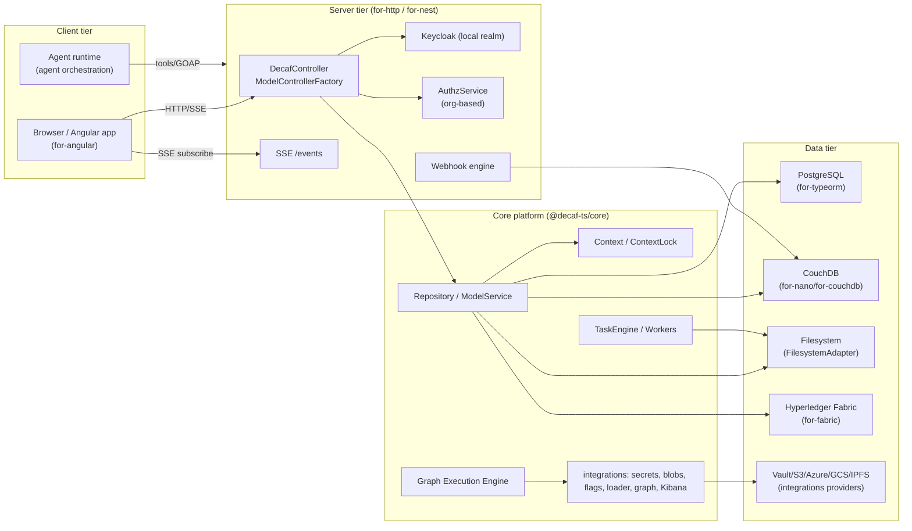

# 00 — Overview & System Context

## 1. What decaf-ts is

decaf-ts is a **decorator-first, metadata-driven, flavour-aware TypeScript application framework**. It provides a vertical stack — from model decoration and validation, through persistence adapters and repositories, to HTTP/SSE servers, transaction coordination, an org-based authorization model, a task engine, a graph workflow engine, and integrations (secrets, blobs, Keycloak, BI dashboards). The same decorated models drive backend persistence, HTTP controllers, and Angular UI rendering.

The design thesis, repeated across nearly every spec, is:

> **Define the contract once in `core` (or the most foundational package), expose an adapter/override point, route runtime behaviour through that point, and validate against live databases/services rather than mocks.**

## 2. System Context

## 3. Architectural Goals (derived from the specs)

- **Flavour-awareness.** A single model can be persisted/transported across multiple "flavours" (DB dialects, Fabric vs Couch, transport flavours). Decoration metadata and adapter override points carry flavour-specific behaviour. See DECAF-14 (flavour-targeted migrations), DECAF-7 (per-adapter `ContextLock`).
- **Contract-in-core, behaviour-in-adapter.** `core` owns `Adapter`, `Repository`, `ModelService`, `Context`, `ContextLock`, `@transactional`, `@sequence`, migrations, task engine. Concrete adapters (`for-typeorm`, `for-couchdb`, `for-nano`, `for-pouch`, `for-fabric`, `FilesystemAdapter`, `RamAdapter`) override the extension points.
- **Metadata-driven UI.** `ui-decorators` and `for-angular` render models and graph workflows from the same decorators the backend persists. The graph subsystem is the most complete expression of this (`@node`, `@port`, `@graph`).
- **Provider-agnostic infrastructure services.** Secrets (DECAF-26) and blobs (DECAF-30) share one `ClientBasedService` lifecycle so providers are interchangeable and cheap to learn.
- **Strict package boundaries.** `integrations` is DOM-free and backend-only; `for-angular` cannot import backend-only packages; the graph engine is split out of the browser bundle via `./shared` vs `./graph` (DECAF-35).
- **Real integration verification.** Specs repeatedly forbid mocking the database (DECAF-14, DECAF-15) and require live CouchDB/Postgres/Keycloak stacks.

## 4. Non-Goals / Explicit Boundaries

- The graph execution engine is a **reference interpreter**, not a production distributed orchestrator (DECAF-32 §1.2). Downstream projects (e.g. Mastra) reuse the definitions but compile separately; DECAF-32 §22 maps the Mastra-agnostic vs Mastra-specific split.
- The org-based authorization system (DECAF-33) is **domain-neutral**; it forbids product-specific concepts (`tenantKind`, `userKind`, `isFamily`, etc.) and models only neutral primitives.
- mcp-server packaging/tooling is out of scope for this workbook (DECAF-16, DECAF-31, and the mcp-server CLI boot parts of DECAF-17).

## 5. Status Snapshot

The specs are at varying maturity. Notable status notes that affect how much trust to place in each section:

- **Completed:** DECAF-3, 5, 6, 7, 9, 11, 13, 14, 23, 26, 30, 33, 42, 43 (and large parts of 1, 10, 32).
- **In Progress:** DECAF-1 (worker tests passing), DECAF-10, DECAF-32, DECAF-47.
- **Planned / Draft:** DECAF-18 (context transition semantics), DECAF-21 (ChannelManager — **Rejected/deferred**), DECAF-38 (object loader), DECAF-39 (feature flags).
- **Status inconsistencies:** DECAF-4 marks UI/crypto/for-nest builder tasks Pending in §5 yet claims completion in §7/§8; DECAF-6 is marked Completed but lists pending trigger/test/doc tasks. These are flagged in [Overlaps & Contradictions](./11-overlaps-contradictions.md).

Continue to [01 — Package & Layer Architecture](./01-package-architecture.md).
