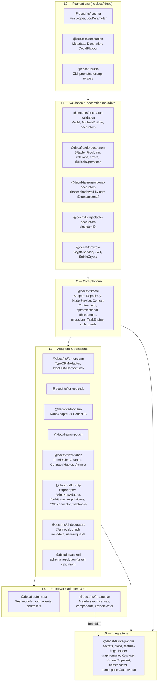

# 01 — Package & Layer Architecture

decaf-ts is a pnpm monorepo. Packages publish under the `@decaf-ts/*` scope. The dependency graph is layered: lower layers know nothing of higher layers; higher layers depend downward. Several specs enforce boundaries with ESLint `no-restricted-imports` and package `exports` maps, not just convention.

## 1. Layer Map

## 2. Key Boundary Rules

| Rule | Source | Enforcement |
|:-----|:-------|:------------|
| `integrations` is DOM-free (`lib: ["es2022"]`, no `window`/DOM types) | DECAF-40 | tsconfig `lib`; iframe/React plugin code lives under gitignored `integrations/plugins/*`, host code in `for-angular` |
| `for-angular` **cannot** import backend-only `integrations` | DECAF-45 (SAA-18 CTO decision) | package dependency edge forbidden; canonical user-requests source moved to `ui-decorators` |
| Browser bundle must not pull the graph engine | DECAF-35 | `exports` map `./shared` (frontend-safe) vs `./graph` (engine); ESLint `no-restricted-imports` in `for-angular` blocks bare `@decaf-ts/integrations/graph` |
| Provider SDKs are optional peer/optional deps; root entrypoint free of provider loads | DECAF-26, DECAF-30 | subpath exports (`/secrets/aws`, `/blob/s3`, …); `optionalDependencies` |
| `@transactional` is exported from `@decaf-ts/core`, not `transactional-decorators` | DECAF-7 | core shadows the base package's factory |

## 3. Package Responsibilities (summary)

| Package | Owns | Key specs |
|:--------|:-----|:-----------|
| `logging` | `MiniLogger`, `LogParameterRegistry`, `compileLogPattern` | DECAF-9 |
| `decorator-validation` | `Model`, `AttributeBuilder`, `ModelBuilder` runtime composition | DECAF-4 |
| `db-decorators` | persistence metadata, `@BlockOperations`, `InternalError`/`BaseError` | DECAF-10, 26, 30, 33 |
| `core` | `Adapter`, `Repository`, `ModelService`, `Context`, `ContextLock`, `@transactional`, `@sequence`, `@migration`, `MigrationService`, `TaskEngine`, `FilesystemAdapter`, `@throttle`, `@allowIf`/`@blockIf` | DECAF-1, 3, 7, 11, 12, 14, 18, 22, 23 |
| `for-typeorm` | `TypeORMAdapter`, `TypeORMContextLock`, `TypeORMStatement`, driver detection | DECAF-6, 7 |
| `for-couchdb` / `for-nano` / `for-pouch` | Couch-family adapters, sequence propagation | DECAF-11, 14, 15 |
| `for-fabric` | `FabricClientAdapter`, `FabricClientRepository`, `ContractAdapter`, `@mirror`, channel mgmt | DECAF-2, 5, 11, 21, 37, 47 |
| `for-http` | `HttpAdapter`/`AxiosHttpAdapter`, `for-http/server` primitives, `ServerEventConnector`, webhook engine | DECAF-10, 13, 15, 42 |
| `for-nest` | Nest module, `DecafAuthModule`, events module, controllers, CLI migrate | DECAF-10, 14, 33, 42, 43 |
| `ui-decorators` | `@uimodel`, graph metadata (`@node`/`@port`/`@graph`), `Metadata.nodes()`, user-requests | DECAF-24, 35, 45 |
| `for-angular` | graph canvas, node templates, save/undo, run feedback, cron-selector, webpage | DECAF-24, 25, 32, 34, 35, 36, 44, 48 |
| `integrations` | secrets, blobs, feature-flags, loader, graph engine, Keycloak, Kibana/Superset, namespaces, Nest auth handler | DECAF-26, 30, 32, 33, 38, 39, 40, 41, 43, 45 |
| `as-zod` | Zod schema resolution for graph port validation | DECAF-32 |
| `crypto` | `CryptoService`, encryption decorators | DECAF-26 |
| `utils` | CLI, release automation, `tests` export (Xray teardown) | DECAF-46 |

Continue to [02 — Core Persistence & Adapters](./02-core-persistence.md).
