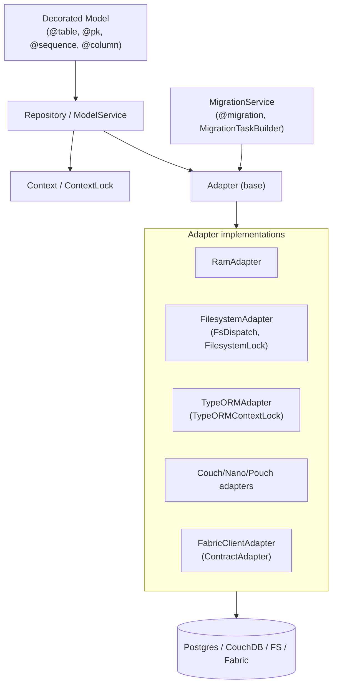
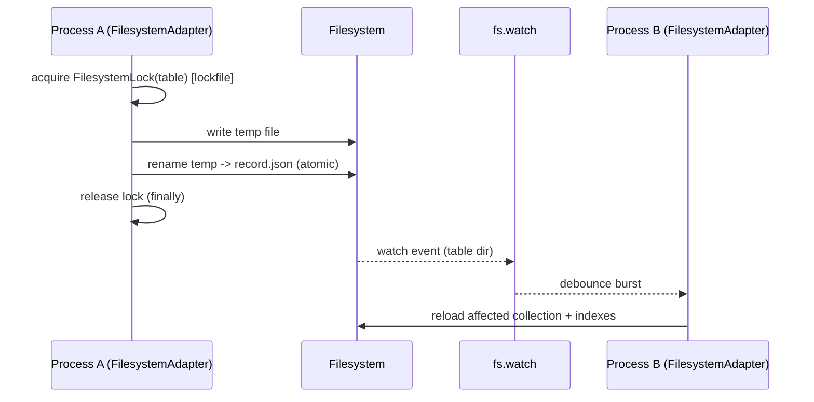
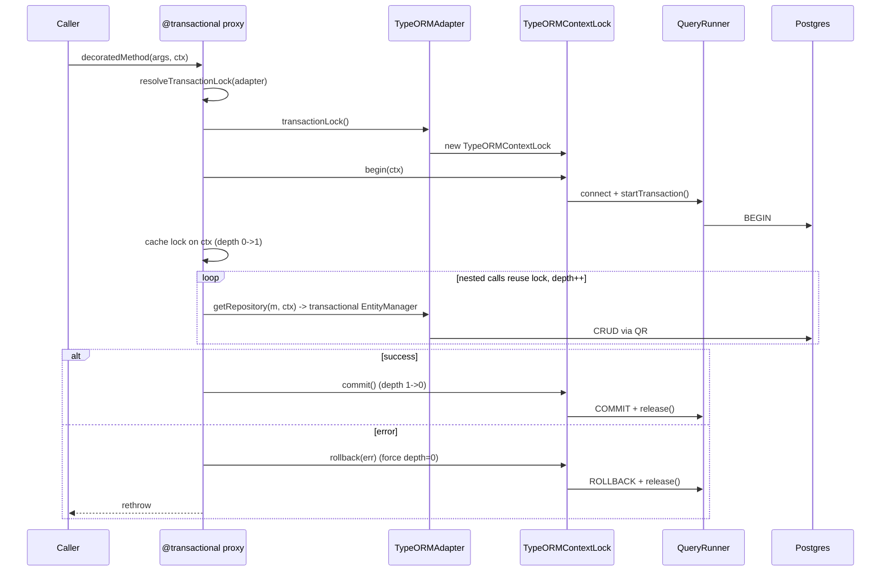
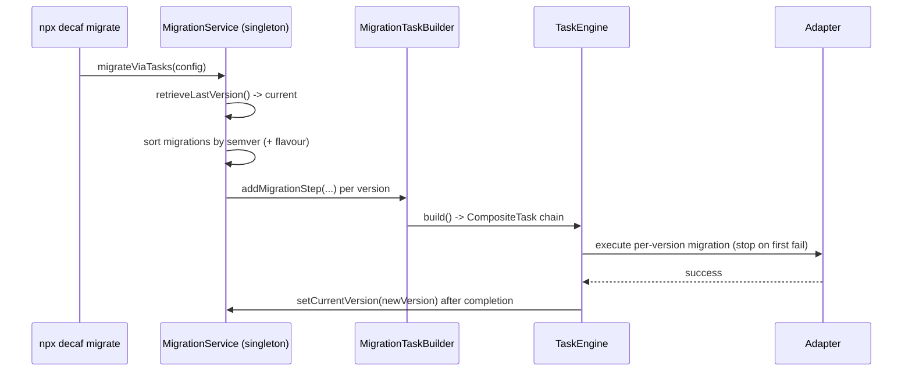

# 02 — Core Persistence & Adapters

**Specifications:** [DECAF-1](../specifications/DECAF_1.md) (Worker Task System), [DECAF-3](../specifications/DECAF_3.md) (Filesystem Adapter), [DECAF-6](../specifications/DECAF_6.md) (TypeORM Multi-DB), [DECAF-7](../specifications/DECAF_7.md) (Transaction Decorator + Lock Context), [DECAF-11](../specifications/DECAF_11.md) (Property-Scoped Sequences), [DECAF-14](../specifications/DECAF_14.md) (Migration Engine Hardening).

## 1. Subsystem Overview

The persistence subsystem is the spine of decaf-ts. A single `Adapter`/`Repository`/`ModelService`/`Context` contract lives in `@decaf-ts/core`; concrete adapters override the extension points. The contract is flavour-aware: the same model can be persisted to Postgres, CouchDB, Pouch, the filesystem, or Hyperledger Fabric world-state, with adapter-specific behaviour routed through override points (`Adapter.transactionLock()`, `@sequence`, `@migration` flavour targeting, `@mirror` routing).

## 2. Core Contracts

- **`Adapter`** (`core/src/persistence/Adapter.ts`) — CRUD/bulk/query base; exposes `transactionLock(...args): ContextLock<this>` override point; `context()`/`flags()` derive contexts.
- **`Repository<M>` / `ModelService<M, R>`** — query surface (`listBy`, `findBy`, `findOneBy`, `find`, `page`, statements, groupings); `logCtx()` propagation; operation blocking via `isOperationBlocked`.
- **`Context`** — operation-scoped state container; `toOverrides()`/`toConfig()` carry state across derivations; the transaction lock is cached on `ctx.cache`.
- **`ContextualLoggedClass`** — `logCtx()`/`.context()`/`.flags()` transition coordinator (formalized in DECAF-18, but already the contract every service relies on — see [08 — Platform Services](./08-platform-services.md)).

## 3. Local Persistence: RamAdapter & FilesystemAdapter

`RamAdapter` is the in-memory reference adapter. `FilesystemAdapter` (DECAF-3) is its on-disk twin — drop-in, same public API, persists each record as `{root}/{table}/{pk}.json` and each index as `{root}/{table}/indexes/{indexName}.json`. Atomic writes (temp + rename). `FsDispatch` installs `fs.watch`/`fs.watchFile` listeners so a second process/adapter instance reloads only affected collections. `FilesystemLock`/`FilesystemMultiLock` provide table-level lockfile mutual exclusion across processes.

`FilesystemAdapter` is also the **cross-thread coordination substrate** for the worker `TaskEngine` (DECAF-1): workers reconstruct `TaskContext` from the shared filesystem root with minimal payload transfer (IDs only).

### Filesystem write + cross-process reload

## 4. Relational Persistence: for-typeorm

`TypeORMAdapter` (DECAF-6) extends the family to real RDBMS via driver detection (`detectTypeORMDriver()` → POSTGRES/MYSQL/MARIA/SQLITE/SQLSERVER), driver-specific `createDatabase`/`createNotifyFunction`, and a unified `TypeORMStatement` over `SelectQueryBuilder`. Event dispatching has two modes: `SUBSCRIBER` (implemented, TypeORM subscribers) and `TRIGGER` (pending, database triggers + `TypeORMDispatch` for multi-instance coordination).

> **Status note (DECAF-6):** marked Completed, but TRIGGER mode, driver-specific tests, and docs are pending — see [Overlaps & Contradictions](./11-overlaps-contradictions.md).

## 5. Transactions: @transactional + ContextLock

DECAF-7 replaced the never-implemented `TransactionLockProxy`/hierarchical `LockLevel` design with a simpler model:

- `@transactional(...data)` (exported from **`@decaf-ts/core`**, not `transactional-decorators`) is a Proxy that owns nesting/depth bookkeeping.
- Each adapter overrides `Adapter.transactionLock(...)` → `ContextLock<A>`. Default `ContextLock` is a no-op with optional `maxConcurrentTransactions` semaphore (`-1` unlimited, `0` disabled, `N>0` caps).
- `TypeORMContextLock` (for-typeorm) backs it with a real Postgres `QueryRunner`: `begin()` → `startTransaction()`, `commit()`/`rollback()` → native + `release()`, exposing `manager()` (the transactional `EntityManager`).
- CRUD routing: `TypeORMAdapter.getRepository(m, ctx)` uses the active transactional `EntityManager` when a `TypeORMContextLock` with active `manager()` is on the context, else falls back to `this.client.getRepository(m)`.
- Nesting: depth counter; nested calls reuse the cached lock and increment depth; rollback-ends-transaction with a double-rollback guard; context derivation (`Adapter.context()`/`Service.flags()`) carries `transactionLock` through `toOverrides()`.

### Transactional method execution

> **Tension:** `maxConcurrentTransactions` is a **no-op for `for-typeorm`** because `TypeORMContextLock` overrides `begin`/`commit`/`rollback` without calling `super` — concurrency is delegated to Postgres. Resolved by documentation only (DECAF-7).

## 6. Identity: @pk and @sequence

DECAF-11 generalizes identity generation from PK-only `@pk` to any property via `@sequence(...)`. Per-property sequence metadata is keyed by model identity + property name (distinct properties never share a counter). `@pk` becomes a backwards-compatible wrapper that delegates to the sequence implementation while still marking the property as the model id. `Model.sequenceFor(model, property)` resolves sequence metadata; legacy callers fall back to `Model.pk(class, ...)`. Propagated consistently through `for-couchdb`/`for-nano`/`for-pouch`/`for-typeorm`/`for-fabric`, with Fabric respecting private/shared/mirror world-state routing.

## 7. Migrations: MigrationService + MigrationTaskBuilder

DECAF-14 hardens cross-adapter migrations:

- `@migration` decorator carries version + optional flavour targeting; semver ordering via `SemverMigrationVersioning` (npm semver). Flavour precedence conflicts throw an explicit error.
- `MigrationService` (singleton — TASK-256) owns `migrateAdapters` / `migrateNormally` / `migrateViaTasks`, with configurable `retrieveLastVersion`/`setCurrentVersion` handlers (adapter-agnostic, mockable). Migration logic moved **out of** `PersistenceService` into `MigrationService`.
- Task mode: `MigrationTaskBuilder` wraps `CompositeTaskBuilder`; `addMigrationStep(...)` builds per-version `CompositeTask`s with version-hop chaining via task dependencies; generic migrations excluded by default (`includeGenericInTaskMode` override). Reuses the TaskEngine surface (DECAF-1/12/22).
- `for-nest` exposes a headless CLI `npx decaf migrate ...` (flags `--to`/`--flavour`/`--adapter`/`--task-mode`/`--dry-run`) via `@decaf-ts/cli`; no Nest lifecycle hook, no route exposure.
- Fabric paired migrations: `FabricContractAdapter` path (`CrudContract.migrate`) and `FabricClientAdapter` task path share flavour + version.

> **Tension:** `--dry-run` is a **compatibility-only** flag — it survives CLI/config parsing precedence but no longer bypasses runtime persistence. Counter-intuitive; must be documented.

### Task-mode migration run

Continue to [03 — HTTP Server, Nest & SSE](./03-http-server-nest.md).
