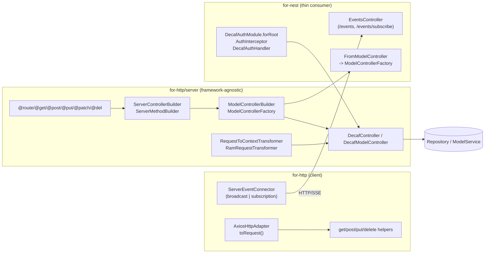
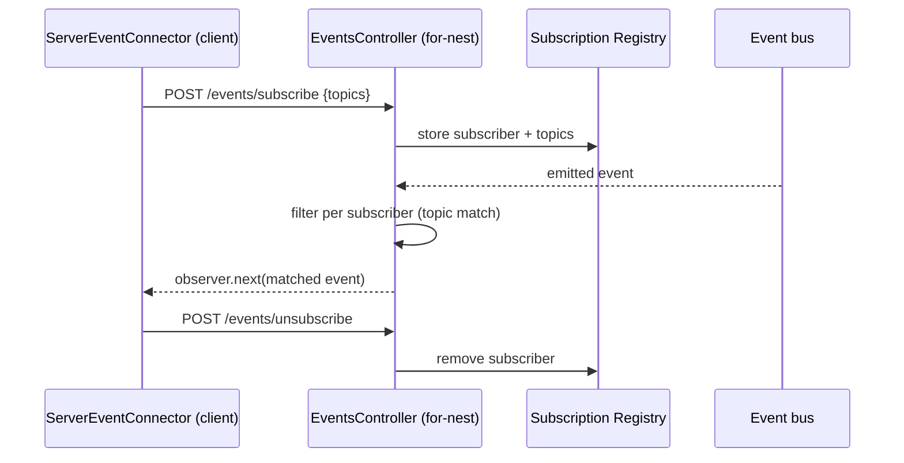

# 03 — HTTP Server, Nest & SSE

**Specifications:** [DECAF-10](../specifications/DECAF_10.md) (Backend Server Primitives & Model Controller Builder/Factory), [DECAF-13](../specifications/DECAF_13.md) (HttpAdapter REST Methods), [DECAF-42](../specifications/DECAF_42.md) (Controlled SSE Subscriptions), and the transport/identity parts of [DECAF-33](../specifications/DECAF_33.md) / [DECAF-43](../specifications/DECAF_43.md) (covered in detail in [04 — Authorization & Identity](./04-authorization.md)).

## 1. Subsystem Overview

The HTTP tier is split into a **framework-agnostic primitives layer** (`for-http/src/server/`, DECAF-10) and a **thin Nest consumer** (`for-nest`). The same primitives are intended to host future adapters (e.g. `for-express`). The client side (`for-http`) provides `HttpAdapter` REST helpers (DECAF-13) and the SSE connector. SSE gains an opt-in subscription/private mode (DECAF-42) alongside the broadcast default.

## 2. for-http/server Primitives (DECAF-10)

- **Route decorators:** `route(verb, path)` plus verb aliases `@get`/`@post`/`@put`/`@patch`/`@del` (capitalized to dodge the TS1359 `delete` reserved-word issue). Stored under `ServerKeys.ROUTE` metadata.
- **Builders:** `ServerControllerBuilder`/`ServerMethodBuilder` are pure framework-agnostic builders. `ServerRoute` now carries a handler slot (`withImplementation()`); `build()` materializes a class. **No** persistence/model logic lives here.
- **Model controller builders:** `ModelControllerBuilder` composes `ServerControllerBuilder` to add CRUD/bulk/statement/grouping/complex-query routes: `addCreateRoute`, `addReadRoute`, `addUpdateRoute`, `addDeleteRoute`, bulk variants, `addStatementRoute` + named shortcuts (`listBy`/`paginateBy`/`find`/`page`/`findOneBy`/`findBy`), `addGroupingQueryRoute` (`COUNT_OF`/`MAX_OF`/`MIN_OF`/`AVG_OF`/`SUM_OF`/`DISTINCT_OF`/`GROUP_OF`), `addComplexQueryRoute`. Each gated by `isOperationBlocked(ModelConstr, kind, value)` before registration.
- **`ModelControllerFactory.create(ModelConstr, persistence, config?)`** — granular config (`allowStatementlessQuery`, `allowGroupingQueries`, `allowBulkStatement` as bool or granular object), `@composed()`-PK path derivation + `filterEmpty` fallback routes. Defaults must reproduce today's for-nest route surface (TASK-172 parity tests).
- **`DecafController<REQ,RES,CTX>` / `DecafModelController<M,...>`** — framework-agnostic; own `persistence()` fallback (`Service.get` → `ModelService.getService` → `Repository.forModel`) and IP-header parsing.
- **Transformers** relocated from `for-nest` to `for-http/server/transformers/` (`RamRequestTransformer`, `RequestToContextTransformer`), re-exported from `for-nest`. `DecafRequestContext` (for-nest) extends `RequestContext` (for-http/server).
- **Auth hardening (core):** `@allowIf`/`@blockIf` throw `UnsupportedError` when `thisArg.logCtx` is missing; otherwise call the handler and throw `AuthorizationError` (or wrap thrower in `InternalError`).

> **Ownership seam:** `@allowIf`/`@blockIf` are byte-for-byte identical (TASK-169 open question: intentional readability vs latent bug). DECAF-33's `AuthzService.canAccess` does not reference them; their relationship is unresolved.

## 3. for-nest as Thin Consumer

- `FromModelController.create()` resolves persistence, calls `ModelControllerFactory.create(...)`, layers Nest `@Controller`/`@nestjs/swagger`/`@Param`/`@Query`/`@Auth()` on top.
- **Auth module (new):** `for-nest/src/auth/` consolidates `AuthInterceptor`, `DecafAuthHandler`, `@Auth()` decorator, `AUTH_META_KEY`/`AUTH_HANDLER`; `DecafAuthModule.forRoot({global})` controls `APP_INTERCEPTOR` (global) vs per-controller opt-in.
- CLI migration (`npx decaf migrate`) is headless — no Nest lifecycle hook (DECAF-14).

> **Ownership seam:** DECAF-10 creates the structural `DecafAuthModule`; DECAF-33 separately requires `KeycloakAuthHandler` to understand namespace roles and `for-nest` to consume namespace metadata. Neither cites the other → risk of two parallel auth-module stories. See [11 — Overlaps & Contradictions](./11-overlaps-contradictions.md).

## 4. Client REST Helpers (DECAF-13)

`HttpAdapter.get/post/put/delete(url, options?)` are thin wrappers over the existing request execution path. `HttpRequestOptions` mirrors Axios config (`timeout`, `headers`, `transformResponse`, `validateStatus`, `includeCredentials`, `params`, `responseType`, `baseURL`, `signal`, `auth`, `transformRequest`). `AxiosHttpAdapter.toRequest(...)` maps `includeCredentials` → Axios `withCredentials`. Additive, no breaking change.

> **Naming seam:** DECAF-13 ships `HttpAdapter.delete(...)` (a method — no reserved-word issue). DECAF-10 ships the decorator `@del` (because `@delete` mis-parses). Same concept name, two packages, two conventions.

## 5. Controlled SSE (DECAF-42)

The existing `/events` broadcast stream is preserved. A new opt-in subscription/private mode adds:

- `POST /events/subscribe` — register requested topics.
- `POST /events/unsubscribe` — unregister.
- Backend filters emitted events per subscriber before `observer.next(...)`.
- `ServerEventConnector` (for-http client) registers on open / unregisters on close in subscription mode; dispatches parsed events to listeners.
- Subscription state is ephemeral in-memory by default, optionally `RamAdapter`-backed. Identity model (per-connector vs per-auth-user vs both) and reconnect behaviour are open.

### SSE subscription lifecycle

SSE reappears in the graph subsystem as the run-feedback transport (DECAF-48 reuses DECAF-42 subscription mode keyed by `{runId, ownerUser}`) — see [06 — Graph](./06-graph.md).

Continue to [04 — Authorization & Identity](./04-authorization.md).
