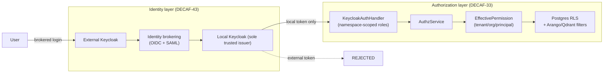

# 04 — Authorization & Identity

**Specifications:** [DECAF-33](../specifications/DECAF_33.md) (Org-Based Authorization System), [DECAF-43](../specifications/DECAF_43.md) (Keycloak Realm Brokering & End-to-End Auth Flow Matrix), plus the `@allowIf`/`@blockIf` and `DecafAuthModule` parts of [DECAF-10](../specifications/DECAF_10.md).

## 1. Two Layers That Compose (Not Compete)

A common reading mistake is to treat DECAF-33 and DECAF-43 as competing auth models. They are **complementary layers** that meet at `KeycloakAuthHandler`:



- **DECAF-43 = identity provisioning & brokering.** Guarantees a *local* Keycloak-issued token reaches Decaf services after a brokered external login; external tokens are never accepted directly. OIDC + SAML brokering with multiple client-auth variants, verified end-to-end over live HTTP (no token mocks).
- **DECAF-33 = authorization decisioning.** Consumes the local token's role claims (via `KeycloakAuthHandler`), recognizes namespace-scoped roles, and resolves them against the domain-neutral org/tenant/principal/permission/effective-permission model.

## 2. Org-Based Authorization Model (DECAF-33)

**Domain-neutral by design:** product-specific concepts (`tenantKind`, `userKind`, `isFamily`, `requiresGuardianConsent`, …) are explicitly forbidden; only neutral primitives are modelled.

### Models

`Tenant`, `TenantProfile`, `OrgUnit`, `OrgUnitProfile`, `OrgUnitClosure`, `User`, `Group`, `GroupMembership`, `Principal`, `TenantMembership`, `OrgUnitMembership`, `Permission`, `Role`, `RolePermission`, `RoleAssignment`, `InheritanceBlock`, `ProtectedResource`, `ResourceGrant`, `EffectivePermission`, `StorageBinding`.

Enums: `IsolationTier`, `MembershipStatus`, `PrincipalKind`, `ScopeKind`, `PermissionCategory`, `ResourceVisibility`, `StorageKind`, `StorageBindingKind`.

### Source of truth & enforcement surfaces

- **Postgres** is the source of truth (composite unique indexes: `uq_principals_tenant_kind_subject`, `uq_org_closure_pair`, `uq_resource_domain`, `uq_resource_grant`, `uq_storage_binding`).
- **Postgres RLS** on protected tables reads `effective_permissions` with session settings `app.tenant_id`/`app.principal_id` set only in trusted transactions.
- **Arango** vertex/edge payloads must include `tenant_id`/`org_unit_id`/`protected_resource_id`/`owner_principal_id`/`visibility`/`sensitivity`; AQL traversal filter pattern specified.
- **Qdrant** point payloads include the same plus `resource_type`/`resource_id`; `must` filter requires `tenant_id` + `should` over org_unit_id/protected_resource_id/owner_principal_id.

### Key flows

**Runtime access — `AuthzService.canAccess(input)`**

```mermaid
sequenceDiagram
    participant Caller
    participant Authz as AuthzService
    participant PR as ProtectedResource
    participant Grant as ResourceGrant
    participant EP as EffectivePermission
    Caller->>Authz: canAccess(input)
    Authz->>PR: load if resource-scoped
    alt tenant mismatch -> deny
    else owner -> allow
    else explicit time-valid grant -> allow
    else visibility ladder
        alt private -> deny unless owner/grant
        else resource_acl -> deny unless direct grant
        else org_unit -> require EP at resource.orgUnit
        else org_subtree -> require EP (expanded)
        else tenant -> require tenant-scope EP
        end
    end
    Authz->>EP: hasPermission(scope-direct check)
    Authz-->>Caller: boolean
```

**Effective permission rebuild — `rebuildForPrincipal(tenantId, principalId)`** (10-step): delete current → load direct `RoleAssignment`s → load group memberships + group role assignments → load `RolePermission`s → tenant scope materialization → resource scope materialization → org-unit non-inheriting materialization → org-unit `inheritDown=true` expand via `org_unit_closure` descendants → skip descendants blocked by `InheritanceBlock` for that `PermissionCategory` from the assigning ancestor → preserve time windows.

**Bootstrap — `bootstrapTenantFromTemplate(template)`:** create Tenant → recursive root OrgUnit tree → owner User → TenantMembership → owner Principal → template Permissions → Roles → RolePermissions → assign owner role at root with `inheritDown=true` → rebuild effective permissions.

### Services & UI

`BaseModelService<M>` extends `ModelService<M, Repository<M,any>>` with generic CRUD + helpers (`id()`, `relationId()`). Concrete services per model (TenantService, OrgUnitService, …, AuthzService, StorageBindingService, BootstrapService, SystemManagementService). UI: `@namespace(...)` decorator (reuses `@role()` contract) + `@hideFor`/`@showFor` namespace-aware visibility.

## 3. Keycloak Brokering (DECAF-43)

- `KeycloakService` base; `KeycloakIdentityProviderService` registers/manages external broker identity providers; `KeycloakRealmService`/`KeycloakRoleService`/`KeycloakAuthService` preserved.
- `KeycloakBrokerSetupConfig` is intentionally separate from `KeycloakSetupConfig` (provider alias/display, upstream URL/realm, OIDC/SAML type, client auth method, callback URIs, scopes/claim mapping, first-broker-login/account-linking policy, role/group/attribute mapping, logout/refresh/session).
- `keycloakAuthHandler.ts` (`integrations/src/nest/`) does local token verification + request-context extraction.
- Compose stack (`keycloak-broker-compose.yml`): Traefik file-provider, main Keycloak, external Keycloak, oauth2-proxy, protected service. Pinned Keycloak `24.0.0`.
- Stable identity derived from **upstream issuer + subject** pair (not email alone).

### Brokered login flow

```mermaid
sequenceDiagram
    participant U as User
    participant App as Protected app (Traefik)
    participant LK as Local Keycloak
    participant EK as External Keycloak
    participant S as Protected service
    U->>App: hit protected route
    App->>LK: redirect
    LK->>EK: redirect to identity provider
    U->>EK: authenticate
    EK->>LK: broker callback
    LK->>LK: create/link local user + normalize claims
    LK->>U: issue LOCAL token
    U->>S: request with local token
    S->>S: accept local token; reject external
```

## 4. The Ownership Seam

`KeycloakAuthHandler` appears in two places:

- DECAF-43: `integrations/src/nest/keycloakAuthHandler.ts` (local token verification + context extraction).
- DECAF-33: `nest/keycloakAuthHandler.ts` in its own `src/nest/`, extended (DECAF-33-10) to recognize namespace-scoped roles and translate to the Decaf auth data shape.

These must be reconciled (DECAF-33's is the consumer/extension of the integrations one) to avoid a second duplicate-handler situation like DECAF-10's audit finding. Full discussion in [11 — Overlaps & Contradictions](./11-overlaps-contradictions.md).

Continue to [05 — Task Engine & Workers](./05-task-engine.md).
