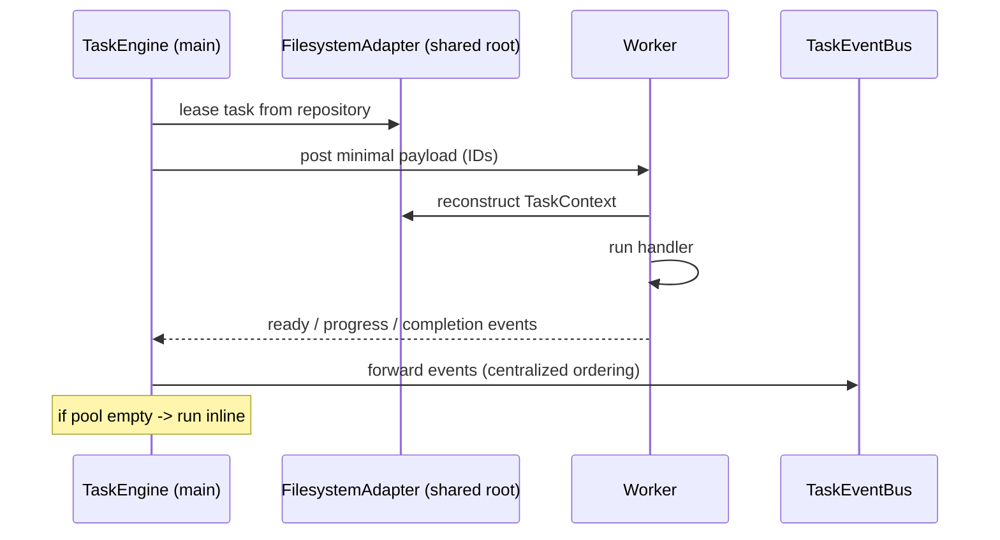

# 05 — Task Engine & Workers

**Specifications:** [DECAF-1](../specifications/DECAF_1.md) (Worker Task System), [DECAF-12](../specifications/DECAF_12.md) (TaskEngine Dynamic Steps, Dependencies, Locks, Handler Catch), [DECAF-22](../specifications/DECAF_22.md) (Step Insertion, Per-Step Retry, Concurrent Composite Steps).

## 1. Subsystem Overview

The `TaskEngine` (in `@decaf-ts/core`) is an in-process scheduler/arbitrator for composite tasks. It leases tasks from a repository, records `TaskEvent`s, emits through a `TaskEventBus`, and dispatches step execution — optionally to a pool of `worker_threads` (DECAF-1). DECAF-12 adds dynamic step insertion, dependency gating, lock-based mutual exclusion, and a `catch` failure hook. DECAF-22 extends with tail-insertion, per-step retry, and opt-in concurrent composite steps.

```mermaid
flowchart LR
    Repo[("Task repository\n(FilesystemAdapter)")]
    TE["TaskEngine (main thread)\nlease / track / emit"]
    Bus["TaskEventBus / TaskTracker"]
    Pool["Worker pool\n(worker_threads | Worker)"]
    Handler["TaskHandler.run / .catch"]
    subgraph Step["Step metadata"]
      Deps["dependencies / dependsOn"]
      Lock["lock"]
      Retry["maxAttempts / backoff"]
      Conc["allowConcurrent"]
    end
    Repo --> TE
    TE --> Bus
    TE -->|serialize payload (IDs)| Pool
    TE -->|inline fallback| Handler
    Pool -->|ready/job/progress/complete events| TE
    Handler --> Step
```

## 2. Workers (DECAF-1)

- `TaskService` config: `workerPool?: { size; mode?: 'node'|'browser' }`, plus adapter overrides and graceful-shutdown timeouts.
- The main-thread `TaskEngine` is the **single source of truth** for leasing, tracking, and emitting task events — workers are lightweight executors that reconstruct `TaskContext` via `FsAdapter` and stream events back.
- Cross-thread persistence coordination uses `FilesystemAdapter`/`FsDispatch`/`FilesystemMultiLock` (DECAF-3) — minimal payload (IDs) transfer; context reconstructed on the worker side.
- If workers unavailable, handlers run inline within `TaskEngine` (browser fallback via environment detection).

### Worker dispatch flow



## 3. Dynamic Steps, Dependencies, Locks, Catch (DECAF-12)

- `TaskContext.scheduleSteps().afterCurrent(ctx)` inserts steps after the currently running step; emits a status event of type `update`.
- `dependencies: string[]` (task-level) and `dependsOn: string[]` (step-level); encoded as `<taskId>` or `<taskId>:<stepIndex|stepReference>`; gate checks targets finished before dispatch.
- `lock: string` optional attribute ensures no two runnable units with the same lock run concurrently. **Lock scope is engine-instance local**; multi-process coordination is delegated to adapter-specific orchestration, not shared in-memory locks.
- `TaskHandler.catch(input, error, context)` — default no-op, overridable; invoked in the catch path of `taskHandler.run(...)`.

## 4. Tail Insertion, Per-Step Retry, Concurrency (DECAF-22)

- `ctx.scheduleSteps().afterCurrent(ctx)` / `atEnd(ctx)` now require an explicit `TaskContext` (scoped logging). `atEnd` appends cleanup/finalization at the queue tail so it is not displaced by other handlers' `afterCurrent` insertions.
- **Per-step retry:** `TaskStepSpecModel` gains `maxAttempts?`, `backoff?: TaskBackoffModel`; `TaskStepResultModel` gains `attempt?`. Retry is entirely in-process (no DB status changes); heartbeat extends the lease between retries. On attempt exhaustion, `handler.catch?.(...)` is called, then the error propagates to task-level retry (from `currentStep`).
- **Concurrent composite steps:** `TaskStepSpecModel.allowConcurrent: boolean` (default false); `TaskEngineConfig.maxConcurrentCompositeSteps` (default -1, no limit). `allowConcurrent=true` steps sharing a `lock` key run concurrently up to the cap; a **separate write lock** serializes shared task-context log/step-result persistence. `TaskFlags.scheduleCompositeStepsAtEnd` is an internal engine callback.

> `maxConcurrentCompositeSteps` is independent of the global runnable-task `concurrency` limit.

### Failing step with retry and catch

```mermaid
sequenceDiagram
    participant TE as TaskEngine
    participant Step as Step (maxAttempts, backoff)
    participant H as TaskHandler
    TE->>Step: dispatch
    Step->>H: run(input, ctx)
    H-->>Step: throw error
    Step->>Step: attempt < maxAttempts? heartbeat; backoff; retry
    Step->>H: run(input, ctx)
    H-->>Step: throw error (exhausted)
    Step->>H: handler.catch(input, error, ctx)
    Step->>TE: propagate to task-level retry (currentStep)
```

## 5. Relationship to the Graph Execution Engine

The TaskEngine and the Graph Execution Engine (DECAF-32) are **layered, not competing** — but the relationship is implicit. DECAF-32 §5.2 explicitly mirrors the `TaskEngine`/`TaskContext` pattern (`GraphExecutionContext extends Context`, `GraphNodeExecutor.execute(input, context)` parallels `TaskHandler.run`). They share orchestration primitives (dependency gating, locks, concurrency, retry) at different abstraction layers (task scheduling vs graph workflow), but **no spec declares how (or whether) the graph engine reuses the TaskEngine's arbitration/lock/dependency machinery**. DECAF-32 §3 lists "retry/backoff engine" as a V1 non-goal. See [06 — Graph](./06-graph.md) and [11 — Overlaps & Contradictions](./11-overlaps-contradictions.md).

Continue to [06 — Graph Subsystem](./06-graph.md).
