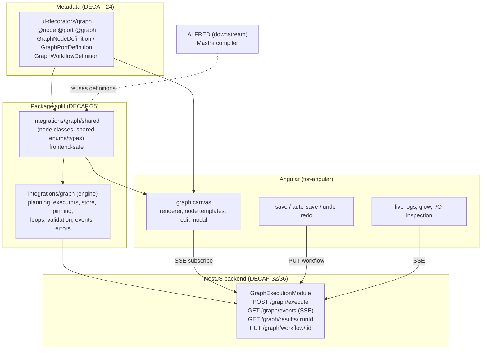
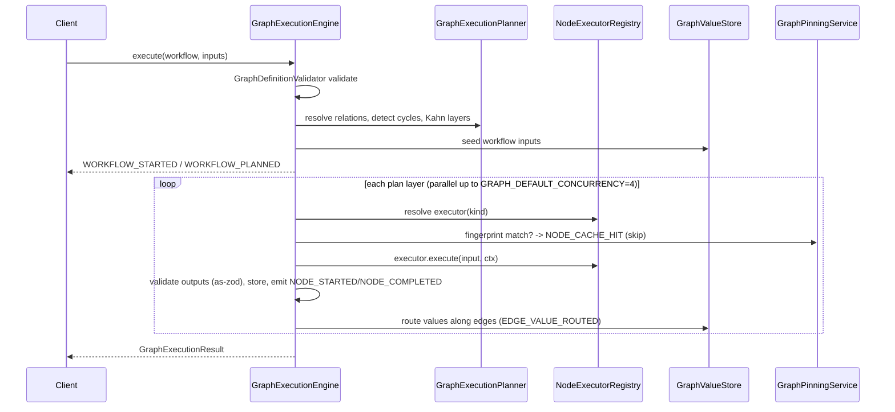

# 06 — Graph Subsystem

**Specifications:** [DECAF-24](../specifications/DECAF_24.md) (Graph Metadata Layer & Angular Adapter), [DECAF-32](../specifications/DECAF_32.md) (Graph Execution Engine), [DECAF-34](../specifications/DECAF_34.md) (Node Type Catalogue), [DECAF-35](../specifications/DECAF_35.md) (Metadata/Engine Split), [DECAF-36](../specifications/DECAF_36.md) (Canvas Save/Auto-Save & Undo/Redo), [DECAF-48](../specifications/DECAF_48.md) (Logging Display & Visual Run Feedback).

## 1. Subsystem Overview

The graph subsystem is the most complete expression of decaf-ts's metadata-driven thesis: a declarative graph contract (`@node`/`@port`/`@graph`) drives an Angular canvas editor, a reference execution engine, a NestJS backend, live run feedback, and a downstream compiler (ALFRED → Mastra). It is split across six specs along a clean metadata/engine/rendering/catalogue/canvas/feedback axis — with several boundary tensions (see [11](./11-overlaps-contradictions.md)).



## 2. Metadata Layer (DECAF-24)

- `ui-decorators/src/graph` is the **canonical** graph metadata layer: `@node(...)` (composes `@uimodel` + node metadata), `@port(...)` (enriches field metadata with direction, handle visibility, connection rules), `@graph(...)` (workflow root: inputs/outputs/nodes/relations).
- Canonical readers produce `GraphNodeDefinition` / `GraphPortDefinition` / `GraphWorkflowDefinition`.
- `for-angular/src/graph` is the Angular adapter mapping canonical definitions to `ngDiagram` (optional). Workflow inputs render in a left column as duplicateable value nodes.
- **Workflow snapshot** contract (`graphWorkflowSnapshotToJSON` / `FromJSON`): node positions, port states, edge links, input/output values. Extended by DECAF-32 §20.4 (per-node `portBindings`, literal `nodeValues`, output splits as multiple `GraphWorkflowRelation` entries) and reused by DECAF-36/48 unchanged.

## 3. Execution Engine (DECAF-32)

A **native reference interpreter** in `@decaf-ts/integrations/graph` — explicitly *not* a production distributed orchestrator. Downstream projects (Mastra) reuse definitions but stay separate (DECAF-32 §22 maps the Mastra-agnostic vs Mastra-specific split).

### Components

- `GraphExecutionContext` (extends `Context`, mirrors `TaskContext`).
- `GraphExecutionEngine` (implements `Observable`) — validates, plans, seeds inputs, executes layers with concurrency, routes values, emits events, returns `GraphExecutionResult`.
- `GraphNodeExecutor` interface — `execute(input, context)`. `GraphNodeExecutorRegistry`/`Resolver` — kind→executor.
- **Planning:** `GraphExecutionPlanner`, `GraphExecutionPlan` (nodes/edges/layers), `GraphRelationResolver`, `GraphTopology` (Kahn topological sort; cycles rejected).
- **Loops:** `ForeachGraphNodeExecutor`/`While`/`Until`, `GraphConditionEvaluator` (built-ins + `custom` ConditionExpression dispatch by `op`), `GraphLoopExecutionContext`. Loop bodies must be acyclic; `parentRunId`/`path = [...outer, loopNodeId, iteration:${i}]`.
- **Pinning:** `@pinnable()`, `GraphPinningService`, `GraphPinningPolicy`, `GraphPinningDependencyResolver`. All-or-nothing in v1; fingerprint match → `NODE_CACHE_HIT` (skip executor).
- **Store:** `GraphValueStore`, `GraphValueStoreAdapter`, `InMemoryGraphValueStoreAdapter`, `GraphCachedValue`, `GraphValueKey`.
- **Validation:** `GraphDefinitionValidator`, `GraphPortSchemaResolver` (uses `decaf-ts/as-zod`), `GraphValueValidator`.
- **Events:** `GraphExecutionEvent`/`Emitter`/`Factory`/`Observer`; `GraphExecutionEventType` (`WORKFLOW_*`, `NODE_*` incl. `NODE_CACHE_HIT`/`NODE_PINNED`/`NODE_UNPINNED`, `EDGE_VALUE_ROUTED`, `LOOP_*`, `VALIDATION_*`, `STORE_*`); `GraphExecutionStatus` (`PENDING|PLANNING|RUNNING|SUCCEEDED|FAILED|SKIPPED|CANCELLED|CACHED`).
- **Errors:** `GraphExecutionError` + `GraphCycleError`/`GraphInputError`/`GraphLoopLimitError`/`GraphPinningError`/`GraphPortError`/`GraphStoreError`/`GraphTopologyError`.
- **Snapshot:** `GraphExecutionSnapshotMapper` → `GraphExecutionSnapshotPatch` for `ui-decorators/graph`.
- **Angular bridge:** `GraphExecutionService`, `GraphExecutionEventSubjectObserver` (RxJS), `GraphExecutionStateMapper`.
- **NestJS:** `GraphExecutionModule`, `GraphExecutionResultModel` + `GraphExecutionResultRepository` (RamAdapter). Endpoints: `POST /graph/execute`, `GET /graph/events` (SSE), `GET /graph/results/:runId`.

### Execute/plan/pin/loop flow



### Loop execution

```mermaid
sequenceDiagram
    participant Eng as GraphExecutionEngine
    participant Loop as ForeachGraphNodeExecutor
    participant Cond as GraphConditionEvaluator
    Eng->>Loop: execute(node, ctx)
    loop each iteration
        Loop->>Cond: evaluate condition (while/until)
        Loop->>Eng: execute(body workflow, parentRunId, path+[iteration:i])
        Note over Eng,Loop: body must be acyclic
    end
    Loop->>Eng: LOOP_COMPLETED (broken:true if BreakFlowNode threw GraphBreakSignal)
```

## 4. Node Type Catalogue (DECAF-34)

Documentation-only reference consolidating every node type across DECAF-32 §22.2 + ALFRED-5/6/7/8 + UPSTREAM-1. 21 nodes: 6 triggers (`core.trigger.manual/webhook/schedule/event/form/chat`), flow-control (`core.flow.if/switch/parallel/merge/map/delay/errorBoundary/humanApproval/return/code`), loops (`core.loop.foreach/while/until`), `core.flow.break` (Decaf addition, no ALFRED alias), `core.agent`. Production declarations live in `integrations/src/graph/nodes/`.

**For-Each redesign (DECAF-34 re-open):** self-connected loop-closure port (BOTTOM, `connectionRules.allowSelf:true`), `items`/`slice` inputs (LEFT), `item` output (RIGHT) via mandatory ghost node, `completed` output (TOP). `BreakFlowNode` throws `GraphBreakSignal` caught by enclosing loop → `LOOP_COMPLETED` with `broken:true`.

> **Tension:** loop node declarations currently live in the **for-angular demo layer**, not `integrations/src/graph/nodes/`. Both DECAF-34 §12 and DECAF-35 §6 recommend promoting them to `shared/nodes/` — unresolved.

## 5. Metadata/Engine Split (DECAF-35)

Splits `@decaf-ts/integrations/graph` so the browser bundle can never transitively pull the engine or future backend deps (DB adapters, `isolated-vm`, Mastra):

- `integrations/src/graph/shared/` — node classes, `GraphNode` base, category styles, shared types/enums (`GraphExecutionEventType`, `GraphExecutionStatus`), `Metadata.nodes()`/`Metadata.workflows()` registries. Subpath `@decaf-ts/integrations/graph/shared`.
- `integrations/src/graph/engine/` — `index.ts` re-exports `../shared` + engine (planning, registry, store, loops, pinning, snapshots, errors, events). `@pinnable` moves to `engine/decorators.ts` (backend-only).
- `ui-decorators/src/graph/registry.ts` — node/workflow `Set<Constructor>` registries; `Metadata.nodes()`/`Metadata.workflows()` attached via declaration merging (private constructor ⇒ cannot subclass).
- `@node`/`@graph` gain `registerNode`/`registerWorkflow` side-effects (signatures unchanged).
- **Enforcement:** package `exports` map + ESLint `no-restricted-imports` in `for-angular` (blocks bare `@decaf-ts/integrations/graph` and `./graph/*` except `./shared`).
- **Open decision (TASK-232):** in-browser demo executors — Option A (migrate to NestJS SSE backend) vs Option B (dev-only quarantine entry).

> **Tension:** `@pinnable()` long-term home. DECAF-32 §5.6/§16 says preferred home `ui-decorators/graph`, temporarily in `integrations/graph`. DECAF-35 §4.1 moves it to `engine/decorators.ts` (backend-only). Unresolved.

## 6. Canvas Save/Auto-Save & Undo/Redo (DECAF-36)

- `GraphHistoryService` (`@service`) — in-memory per-workflow ring buffer (default limit 10); `push/undo/redo/canUndo/canRedo/clear/clearAll/setLimit`. **No persistence across reloads.**
- `GraphAutoSaveService` (`@service`) — debounced mutation listener → backend save (default 500ms); `enabled`, `onMutation/flush`.
- `GraphSaveService` — explicit save → `PUT /graph/workflow/:id`; `isSaving()`.
- `GraphMutationDetectorService` routes mutations to auto-save or history. `GraphKeyboardShortcutsService` (Ctrl/Cmd+Z, Shift+Z) with input-focus guard.
- **Auto-Save ON ⇒ Undo/Redo disabled** (default); Save button stays enabled either way. Single snapshot on drag-end (avoid flooding).
- Backend refactored to adapter-agnostic `@service(Model)` services (`GraphResultService`/`GraphWorkflowService`), `GraphWorkflowModel` (flavour-agnostic, no `@uses`); user propagated via `DecafRequestContext` (request → `AuthInterceptor` → `bindToContext(ctx,{user,roles,org})` → transformers (e.g. `UUID`) → controller passes `DecafRequestContext` as trailing arg → `ModelService.logCtx` → Repository → Adapter `@createdBy` reads `UUID`). Reuses `buildGraphRendererSnapshot()` from DECAF-32 §20.4 (no new format).

## 7. Logging Display & Visual Run Feedback (DECAF-48)

Three layers, all engine-agnostic (a Mastra/NestJS driver must satisfy the same event/attribute contract):

- **Live logs widget** (bottom docked, Chrome-console level filter) + `core.utility.log` node + executor (catalogue amendment to DECAF-34) logging input via `ctx.logger`.
- **Visual run feedback** — node/edge glow; new events `NODE_STATE_CHANGED`/`EDGE_STATE_CHANGED` on the existing Observable; extended `GraphExecutionStateMapper` (DECAF-35 §4.7) → faded glowing overlays. Execution-state enum in `shared`: `IDLE | RUNNING | BLOCKED | SUCCEEDED | FAILED | SKIPPED/DISABLED` (note `BLOCKED` not in engine's `GraphExecutionStatus` — derived from plan, no rewrite).
- **Node I/O inspection** — double-click already-ran node → inline I/O split view (right=inputs, left=outputs|error; JSON/table/raw); double-click not-ran node → existing edit modal (DECAF-32 §20/§21.11).
- **Transport:** SSE subscription mode (DECAF-42) keyed by `{ runId, ownerUser }` on `graph.run.log` / `graph.run.state` namespaces. Log attributes via DECAF-9 `LogParameterRegistry` / `logger.for({...})` (`nodeId`, `workflowId`, `runId`, `user`). `ctx.logger.for({nodeId,workflowId,runId,user})`.

### Run feedback over SSE

```mermaid
sequenceDiagram
    participant C as for-angular client
    participant Mod as GraphExecutionModule (Nest)
    participant Eng as GraphExecutionEngine
    participant Sub as SSE subscription registry
    C->>Mod: POST /graph/execute (auth user) -> runId
    C->>Mod: POST /events/subscribe {topic: graph.run.*, runId}
    Mod->>Sub: register {runId, ownerUser}
    Eng->>Eng: ctx carries runId/workflowId/user
    Eng->>Eng: ctx.logger.for({nodeId,workflowId,runId,user}).log(...)
    Eng-->>Mod: NODE_STATE_CHANGED / EDGE_STATE_CHANGED / log events
    Mod->>Mod: filter by ownership key {runId, ownerUser}
    Mod-->>C: SSE graph.run.log / graph.run.state
    C->>C: logs widget append + level filter; canvas glow
    C->>Mod: POST /events/unsubscribe (on close)
```

> **Colour contradiction:** DECAF-32 §21.9 defines running=amber, succeeded=green, failed=red, cached=indigo, pinned=purple. DECAF-48 brief mandates running=green, blocked=yellow, errored=red for the live overlay. DECAF-48 §4.5 flags this for CTO reconciliation (revise §21.9 vs layer the overlay); `cached`/`pinned` preserved. See [11](./11-overlaps-contradictions.md).

Continue to [07 — Fabric Integration](./07-fabric.md).
