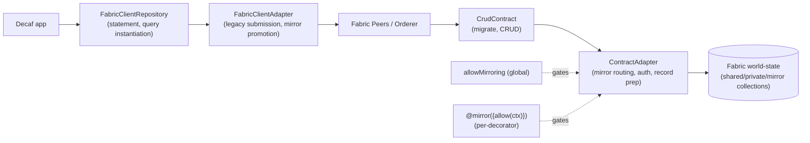
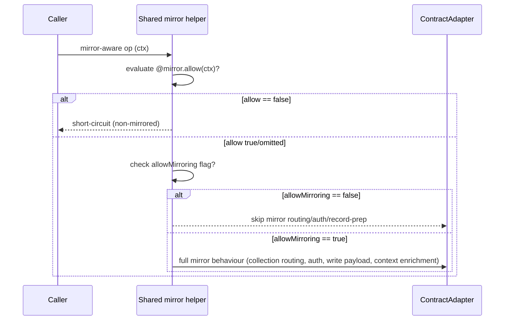

# 07 — Fabric Integration

**Specifications:** [DECAF-2](../specifications/DECAF_2.md) (Legacy Peer Selection), [DECAF-5](../specifications/DECAF_5.md) (FabricClientAdapter Object Instantiation), [DECAF-21](../specifications/DECAF_21.md) (Channel Manager Service), [DECAF-37](../specifications/DECAF_37.md) (Mirror Gating), [DECAF-47](../specifications/DECAF_47.md) (Mirror Allow Predicate). Also [DECAF-11](../specifications/DECAF_11.md) for sequence propagation through Fabric.

## 1. Subsystem Overview

`for-fabric` adapts the decaf-ts persistence contract to Hyperledger Fabric world-state. The `FabricClientAdapter`/`FabricClientRepository` pair is the integration spine; `ContractAdapter` handles the chaincode side. The subsystem handles peer selection for legacy gateway submission (DECAF-2), faithful model instantiation from chaincode responses (DECAF-5), a two-tier mirror-suppression model (DECAF-37 global flag + DECAF-47 per-decorator predicate), and sequence propagation honouring private/shared/mirror routing (DECAF-11). A deferred `ChannelManager` service (DECAF-21) would lift channel membership into a reusable service.

## 2. Legacy Peer Selection (DECAF-2)

Improves the legacy submission path so manually mapped peer selections respect a configurable `legacyMspCount` flag, randomly choosing up to N peers per MSP instead of always one. Default = 1 (backward compatible). Dedup by endpoint+alias; primary peer appended last. Throws if an MSP has no mapped peers (Req-2).

Helpers: `resolveLegacyMspCount(config)` (default 1), `pickLegacyCandidates(candidates, limit)`, `buildLegacyPeerConfigs(config, endorsingOrganizations)`, `normalizeLegacyPeers(peers)`. Flag plumbing via `FabricClientFlags`/`DefaultFabricClientFlags`; `PeerConfig.legacyMspCount?` and `PeerConfig.mspMap?`.

> **Tension:** DECAF-2 §3 ties legacy submission promotion to mirror/`allowGatewayOverride` behaviour, while DECAF-37 keeps `allowGatewayOverride` independent of `allowMirroring` — ambiguity over which gate owns legacy promotion when mirroring is disabled.

## 3. Model Instantiation from Chaincode (DECAF-5)

Audit (no code changes) confirming `FabricClientRepository` query methods consistently return instantiated model class objects. The `CouchDBKeys.TABLE = tableName` discriminator on chaincode responses distinguishes Fabric models from primitives/aggregates. Query methods (`listBy`/`findBy`/`findOneBy`/`find`/`page`) instantiate via `new this.class(record)` when the discriminator matches `Model.tableName(this.class)`; paginated results wrap `data` items. Aggregations (`countOf`/`maxOf`/`minOf`/`avgOf`/`sumOf`/`distinctOf`/`groupOf`) return raw primitives unchanged.

## 4. Mirror Gating — Two Tiers

Mirror metadata (`@mirror()` collection + MSP) is always preserved; behavioural effects are gated.

### Global flag (DECAF-37)

`allowMirroring: boolean` in `FabricClientFlags`/shared types. When `false`: shared mirror decorator helpers return immediately; `ContractAdapter` skips mirror collection routing, mirror authorization, and mirror-mode record prep; `FabricClientAdapter`/`FabricClientRepository` skip promotion to legacy submission. `FabricClientContext` whitelists `allowMirroring` for request-scoped forwarding. The existing `allowGatewayOverride` gate for legacy gateway submission stays independent and unchanged.

### Per-decorator predicate (DECAF-47)

`@mirror({ collection?, msp?, allow?(context): boolean })`. The predicate is evaluated **before** any other mirror work (including before `allowMirroring` checks). If `false`: short-circuit before collection reads/writes, context mutation, handlers/gates — downstream sees execution as non-mirrored. If `true` or omitted: existing mirror behaviour runs, subject to the global `allowMirroring`.

### Mirror bypass ordering

> **Tension:** two parallel mirror-suppression mechanisms (global flag vs per-decorator predicate) create an ordering/ownership question. DECAF-47 acknowledges bypass order must be deterministic and documented; the only fixed rule is "predicate first." The predicate is synchronous — an async guard would need a broader contract change.

## 5. Channel Manager (DECAF-21) — Deferred

A reusable `ChannelManager` service extending `Service` from `@decaf-ts/core`, encapsulating granular channel membership (add/remove a single peer or organization), aligned with `@decaf-ts/fabric-weaver` and PTP "Join Peers to the channel" patterns but more granular and independent of infra-only services.

> **Status: Rejected/deferred** — not pursued in workspace. Low-level mechanism may need to stay abstract until `fabric-weaver` integration is confirmed; org membership may need channel-config/orderer support beyond join/leave.

## 6. Sequences in Fabric (DECAF-11)

Property-scoped `@sequence` propagates to Fabric with world-state routing (shared/private/mirror) applied to sequence-backed properties exactly as for generated identifiers. `for-fabric` limited to unit coverage with explicit private/shared/mirror checks (DECAF-11 Req-6).

Continue to [08 — Cross-Cutting Platform Services](./08-platform-services.md).
