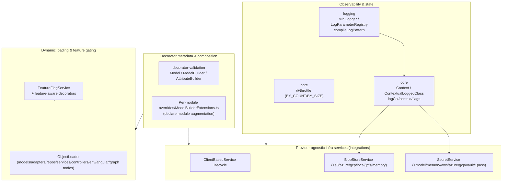
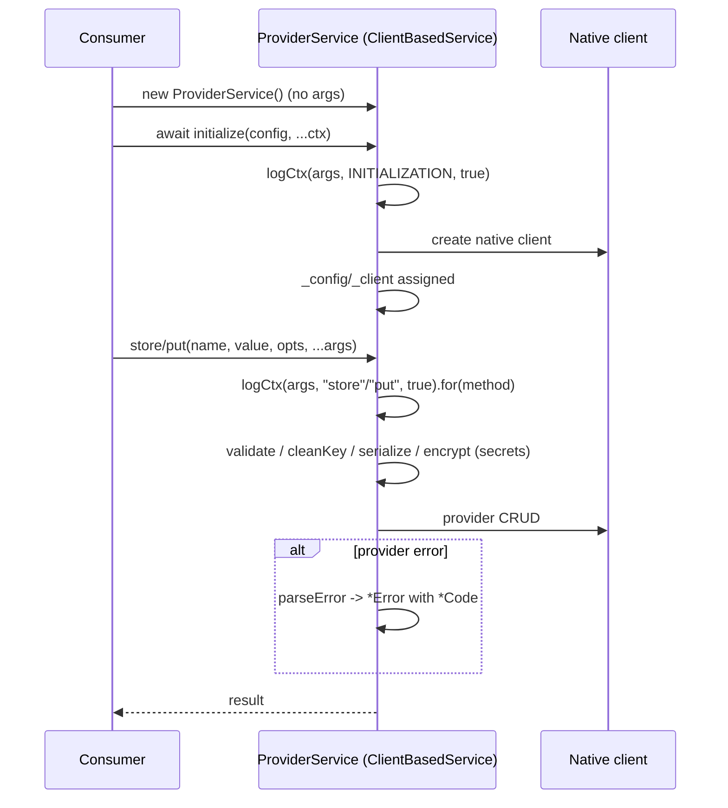

# 08 — Cross-Cutting Platform Services

**Specifications:** [DECAF-4](../specifications/DECAF_4.md) (Builder for Decorator Validation Models), [DECAF-9](../specifications/DECAF_9.md) (MiniLogger LogParameter Engine), [DECAF-18](../specifications/DECAF_18.md) (Context Transition Semantics), [DECAF-23](../specifications/DECAF_23.md) (@throttle Formalization), [DECAF-26](../specifications/DECAF_26.md) (SecretService), [DECAF-30](../specifications/DECAF_30.md) (BlobStoreService), [DECAF-38](../specifications/DECAF_38.md) (Object Loader), [DECAF-39](../specifications/DECAF_39.md) (Feature Flags).

## 1. The Cross-Cutting Backbone

These specs knit decorator metadata, scoped logging/context, provider-abstracted infrastructure services, dynamic loading, and feature gating into one coherent platform that every other subsystem relies on. The `logCtx → context → flags` chain (DECAF-18) is the contract every integrations service invokes (`this.logCtx(args, "store", true).for(this.store)` in DECAF-26/30).

## 2. Decorator Validation Builder (DECAF-4)

Every workspace module exposes its decorators through the central `ModelBuilder`/`AttributeBuilder` so models can be composed, decorated, and hydrated entirely at runtime — parity between decorator syntax and builder syntax, no manual registration.

- `ModelBuilder`/`AttributeBuilder` (in `decorator-validation`) store `_classDecorators`, expose `decorateClass()`, apply decorators before `description()`.
- Each module ships `overrides/ModelBuilderExtensions.ts` declaring fluent methods (`.table()`, `.column()`, `.encrypt()`, `.uimodel()`, …) via `declare module`; `overrides/index.ts` + module `src/index.ts` auto-load augmentation on import.
- `description()` triggers `decorateClass()` which applies registered decorators — metadata identical to decorator-syntax usage; downstream validators/serializers behave the same.

> **Status inconsistency:** DECAF-4 §5 marks UI/crypto/for-nest builder tasks Pending yet §7/§8 claim completion. See [11](./11-overlaps-contradictions.md).

## 3. MiniLogger LogParameter Engine (DECAF-9)

Replaces hardcoded log-line assembly with a composable `LogParameter` engine. Each field (context, correlationId, timestamp, message, stack, level, metadata) is a registered `LogParameterDescriptor` (`key`, `render(payload)`, `style(rendered)`, optional `actions`/`shouldInclude`). `LogParameterRegistry` (singleton) + `compileLogPattern(pattern)` parse `LoggingConfig.pattern` (`[ ... ]` optional segments, `{key}` tokens; cached ordered descriptor list per pattern). `MiniLogger.createLog` iterates descriptors, render→style, joins with separator. Default pattern: `"{level} [{timestamp}] {app} {context} {separator} {message} {stack}"`. Teams register new tokens (ip, tenant, feature flag) without touching `MiniLogger` (`for-nest` registers `{ip}` via `Logging.register`). Consumed by DECAF-41 (Kibana index builder) and DECAF-48 (graph log attributes).

## 4. Context Transition Semantics (DECAF-18)

Formalizes the contract used by `core/src/utils/ContextualLoggedClass.ts` and `core/src/persistence/Context.ts` — the contract every service/repository/adapter/task engine/graph engine relies on.

- `ContextualLoggedClass` owns `logCtx(args, op, true?)`, `.context()`, `.flags()`, `.for(...)`, `.override(...)`.
- `Context` exposes `toOverrides()` (→ `.override(...)`) and `toConfig()` (→ `.for(...)`), plus read APIs (current node, node+parents, node+children). `ContextFlags` carries `flavour` (defaults to `DecafFlavour`).
- Transition is **forced** when concrete context type, `flavour`, or `operation` differs; `.context()` derives a child preserving parent-child link; `.flags()` seeds state; logger (post-`.for(...)`) inherited from parent.
- `logCtx` inspects args for an existing `Context` via a lightweight non-`instanceof` heuristic.

> **Status: Planned (all tasks Pending).** Yet DECAF-26/30 services already call `this.logCtx(args, "store"/"put", true)` and `.for(this.method)` per-operation — they assume a stable `logCtx` contract that DECAF-18 has not yet locked. Tension flagged in [11](./11-overlaps-contradictions.md).

## 5. @throttle Formalization (DECAF-23)

Enum-driven API replacing raw-config `throttle`. Proxy-based method wrapper resolves the splitter at call-time inside `Proxy.apply`.

- `ThrottleMode` enum (`BY_COUNT`/`BY_SIZE`). `splitByCount<T>(count)` / `splitBySize<T>(maxBytes)` pure splitter factories returning `ThrottleSplitter<T> = (items: T[]) => T[][]`.
- `@throttle(count, options?)` (default BY_COUNT) / `@throttle(value, mode, options?)` / `@throttle(splitter, options?)`. `ThrottleOptions`: `delayMs?`, `argIndex?: number | number[]` (default 0; supports `[0,1]` co-chunking), `breakOnSingleFailure?` (resolves from options then `ctx.get("breakOnSingleFailureInBulk")`, default `true`).
- Metadata under `PersistenceKeys.THROTTLE`. Removed legacy types: `BseThrottlingConfig`, `ThrottlingConfig`, `buildChunkBounds`.

## 6. Provider-Agnostic Infrastructure Services

DECAF-26 (secrets) and DECAF-30 (blobs) share **one** `ClientBasedService` lifecycle — DECAF-30 explicitly quotes DECAF-26 as the template ("Reuse the patterns established by DECAF-26").

### Shared lifecycle contract

- No-arg constructor; `initialize(...args): Promise<{config, client}>` assigns `_config`/`_client` (DECAF-30 calls this "non-negotiable"); `@final()` config/client getters.
- Operations accept trailing `...args: MaybeContextualArg<any>`; log via `this.logCtx(args, op, true).for(this.method)`.
- `*Provider` string-literal union; `*Error extends InternalError` (from `db-decorators`) with `*Code` enum; each provider `protected parseError(error): Error`.
- Subpath-only provider exports; root entrypoint free of provider loads; provider SDKs as optional peer/optional dependencies; a `memory` provider for tests + a self-hosted default (`model`-backed encrypted for secrets; `local` filesystem for blobs).

### SecretService (DECAF-26)

`store`/`retrieve`/`delete`/`exists`/`list`/`metadata` (optional `rotate`). `ModelSecretService` + `Secret` model + `ModelSecretCrypto` (encrypted-at-rest); all crypto primitives in `@decaf-ts/crypto` (`CryptoService.deriveKeyFromSecret`/`encryptPayload`/`decryptPayload`). Providers: `model|memory|hashicorp-vault|aws-secrets-manager|azure-key-vault|gcp-secret-manager|onepassword`. `SerializedSecretPayload` (`encoding` utf8|json|base64 + `value`). Name validation centralized (trim, reject empty/control/`..`/whitespace, length cap).

> **Tension:** DECAF-26 §4.3 says `SecretService extends Service` while §4.2/example use `ClientBasedService`/`ClientBasedSecretService`. DECAF-30 resolves unambiguously (`BlobStoreService extends ClientBasedService`). The abstract base should extend `ClientBasedService`.

### BlobStoreService (DECAF-30)

`put`/`get`/`has`/`stat`/`delete`/`copy`/`list`/`url` (presigned/SAS). `BlobKey` normalization: `cleanKey` (strip leading slashes, reject empty/`.`/`..`/`../`), `physicalKey` applies trimmed `prefix`. `LocalBlobStoreService` atomic write (temp→fsync→rename) + path-traversal protection at `rootPath`. Providers: `s3|minio|r2|azure-blob|gcp|local|ipfs|memory`. `IpfsKeyIndex` maps `physicalKey → CID` (memory/local-json/postgres stubbed). `BlobStoreFactory.create(config)` returns uninitialized service. Integration tests via `DockerComposeService` (MinIO, Azurite, fake-gcs-server, Kubo).

### Provider service operation

## 7. Object Loader (DECAF-38)

Reusable dynamic object-loading layer in `@decaf-ts/integrations` (subpath `@decaf-ts/integrations/loader`). Resolves TS exports, selects named/default, preserves decorator metadata, runs composable post-load hooks in deterministic order. Concrete loaders per family: `ModelObjectLoader`, `AdapterObjectLoader`, `RepositoryObjectLoader`, `ServiceObjectLoader`, `ControllerObjectLoader`, `EnvironmentObjectLoader`, `AngularComponentObjectLoader`, `GraphNodeObjectLoader` (covers both `ui-decorators/graph` metadata-only and `integrations/graph` runtime consumers). Complements DECAF-4 builder parity (loader vs builder) and DECAF-39 feature-aware loading.

> **Status: Draft (flexible).** Open: sync vs async hook contract; whether hooks may replace exports vs mutate in place; environment-object loader targets config classes vs runtime env snapshots.

## 8. Feature Flags (DECAF-39)

Persisted, environment-driven, reader-pluggable control plane in `@decaf-ts/integrations` (named `feature-flags` surface).

- `FeatureFlag` model (key, enabled/disabled, rollout metadata, scoping, assignment rules) + separate feature-access assignment model, both queryable via repository predicates (no full-table scans). `ModelService` over `FeatureFlag`.
- `FeatureFlagService.initialize(config)` accepts a reader override; resolves registry once, merges persisted rows + assignments, caches → sync `isEnabled(feature)`. Default `EnvironmeFlagReader` over Decaf `Environment`; env vars `FEATURE_FLAG__FEATURE_NAME__*` normalize to `featureFlag: { featureName: { ...configs } }` (presence `true` or config object = enabled).
- Feature-aware decorators: model (positive/negative, analogous to `@roles`/`@namespace`), endpoint (expose-if-enabled / block-if-disabled, analogous to `@auth()`/`@blockOperations`), UI (`@renderIf`/`@hideOn`).

> **Status: Draft (all tasks Pending).** Open: global-only vs tenant/namespace/env/user-scoped overrides; annotate-only vs enforce-at-runtime; endpoint suppress-route-registration vs register+deny; UI omit-from-tree vs hidden-but-present; priority/conflict resolution.

Continue to [09 — Agent Orchestration](./09-agent-orchestration.md).
