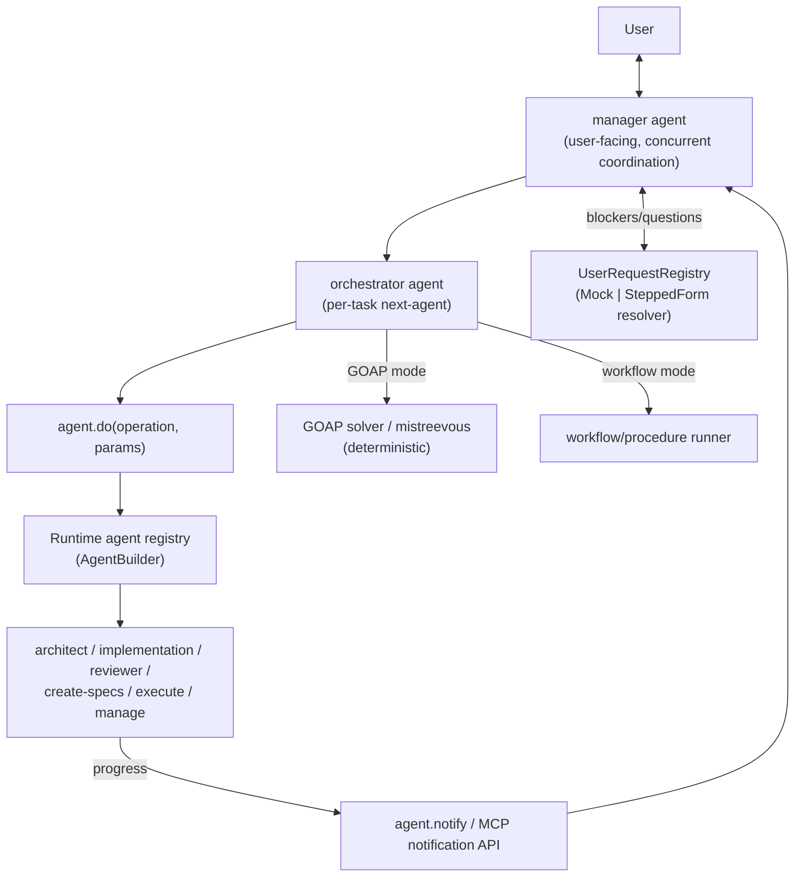
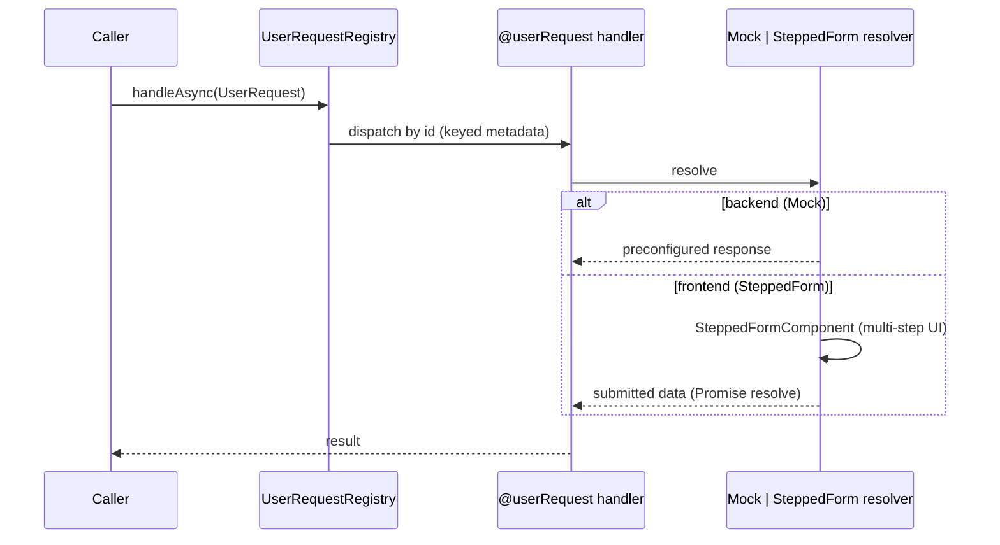

# 09 — Agent Orchestration

**Specifications:** [DECAF-17](../specifications/DECAF_17.md) (Agent-Namespace Orchestration, GOAP, Progress Relay), [DECAF-19](../specifications/DECAF_19.md) (Configurable Agent Execution Mode), [DECAF-20](../specifications/DECAF_20.md) (merged into DECAF-17), [DECAF-45](../specifications/DECAF_45.md) (User Request Handling Engine).

> **Scope note:** The mcp-server-specific artifacts of DECAF-17 — the `--agent` CLI boot path, the `mcp-server/toMigrate` resource directory, the `decaf-mcp` binary, compiled-`dist` inspector transport — are **excluded**. The agent orchestration model, GOAP, progress relay, and user-request handling are in scope.

## 1. Subsystem Overview

The agent orchestration cluster reworks agent mode into a tool-driven, `agent.do`-dispatched, confidence-gated system with a `manager`/`orchestrator` split and an optional deterministic GOAP/mistreevous path. DECAF-45 provides a symmetric backend/frontend User Request Resolution Engine that is the natural primitive for the manager's user-interaction relay — though no spec cross-references them.



## 2. Tool-Driven Orchestration (DECAF-17)

- `AgentBuilder` registers each built agent instance in a runtime registry **and** registers corresponding tool metadata — single source of truth for `agent.do` selection.
- `agent.do(operation, params)` is the canonical dispatcher (selects target agent by operation + params). Thin wrapper tools (`agent.plan`/`review`/`create-specs`/`implement`/`execute`/`manage`) forward to `agent.do`.
- Concrete agents: `manager`, `orchestrator`, `architect`, `implementation`, `reviewer`, `documentation` (deferred).
- `agent.notify` — progress helper for prompt-based mode. DECAF-20's progress-notification contract is **merged into DECAF-17** (DECAF-20 remains as a stub so older task links don't break).
- Structured JSON tool contract: `{ confidence: 1..100, summary, status, questions?, blockers? }`; `TASK COMPLETE` sentinel so the orchestrator detects stream end. Confidence threshold default = 50 (configurable); `confidence <= threshold` ⇒ run reported as blocked, routed back through manager/orchestrator.
- `manager` fans out multiple agent calls concurrently, aggregates JSON, relays blockers/questions back to the user, routes user replies into the waiting agent. `orchestrator` decides the next agent (LLM in prompt mode; deterministic GOAP/mistreevous in `--goap` mode — no LLM for branching/sequencing/tool-selection).
- When `JIRA_ENABLED=true`, SPEC/TASK updates mirrored to Jira tickets before stage transitions.

### agent.do dispatch flow

```mermaid
sequenceDiagram
    participant U as User
    participant Mgr as manager
    participant Orch as orchestrator
    participant Do as agent.do
    participant Reg as agent registry
    participant A as target agent
    U->>Mgr: "implement SPEC-XXX"
    Mgr->>Orch: decide next agent
    Orch->>Do: agent.do("implement", params)
    Do->>Reg: select by operation
    Reg->>A: spawn child (agent mode)
    A-->>Orch: progress (agent.notify) + structured JSON
    alt confidence > threshold
        Orch->>Mgr: aggregate; next step
    else confidence <= threshold
        Orch->>Mgr: blocked; route back
        Mgr<->U: surface blockers/questions
    end
    A-->>Orch: "TASK COMPLETE" sentinel
```

## 3. Configurable Execution Mode (DECAF-19)

A configurable execution-mode flag switches the agent runtime between default prompt-based behaviour and deterministic GOAP/workflow execution.

- Mode values: `default` (prompt), `GOAP`, `workflow`. Read early from the repository's **canonical runtime config** (shape intentionally left open — must not invent a second source of truth).
- In non-default modes the manager stops asking LLMs to decide next steps; it dispatches into the selected solver which resolves steps programmatically (LLM only for explicitly-required subtasks) and reports structured results **back to the manager** for user-facing reporting.
- Structured result shape returned to manager: `{ executionMode, terminalStatus, orderedActions/steps, managerFacingSummary, followUp/remediationHints, failureDetails? }`. Solvers never respond directly to the user.
- Verification must prove orchestration branching happens **before** any prompt-based decision in non-default modes.

> **Tensions:** (1) Ownership of non-default dispatch — DECAF-17 has the `orchestrator` own per-task orchestration and the `manager` own concurrent coordination; DECAF-19 insists the **manager** is the sole user-facing component and solvers return results *to the manager*. (2) Config source — DECAF-17 frames `--goap` as a CLI flag; DECAF-19 frames the same choice as a canonical-config flag. (3) Result contracts are not unified — DECAF-17 has a `confidence` field; DECAF-19's structured result has none. See [11](./11-overlaps-contradictions.md).

## 4. User Request Handling Engine (DECAF-45)

A backend/frontend-compatible User Request Resolution Engine published canonically from `@decaf-ts/ui-decorators` (exports `user-requests` and `user-requests/shared`), with `@decaf-ts/integrations` re-exporting the same subpaths as backward-compatible shims. Supersedes the legacy glass-toolkit `core/requests` engine.

- `UserRequest<T>` model (id/type/payload) — `shared`.
- `UserRequestHandler`/`BaseUserRequestHandler` (Promise-first `handle`/`handleAsync`) — `shared`.
- `UserRequestRegistry` — lookup + dispatch, multi-handler chaining — `shared`.
- `@userRequest('user-request-id')` decorator built on `@decaf-ts/decoration` (`Decoration.for(KEY).define({decorator,args}).apply()` + `Metadata.set`), modelled on `core/src/migrations/decorators.ts`.
- **Backend:** `MockUserRequestResolver` returns a preconfigured response per request type (mockable under Node Jest, no DOM) — successor to `getBackendInputHandler`.
- **Frontend:** `SteppedFormUserRequestResolver` (in `for-angular/src/lib/user-requests/`) wraps `SteppedFormComponent` UI execution in a Promise; user fills/clicks across steps; submit resolves the Promise with submitted data.
- **Symmetry:** the same handler code path executes in both backend (mocked) and frontend (UI) tests.
- **Canonical source = `ui-decorators`** (CTO decision SAA-18): `for-angular` cannot depend on backend-only `integrations` (forbidden dependency edge), so the canonical source moved from `integrations` to `ui-decorators`; `integrations` keeps re-export shims for backward compat.

### User request resolution



> **Implicit overlap:** DECAF-17's manager "surfaces blockers and questions back to the user and routes the user response back into the waiting agent." DECAF-45's `UserRequestRegistry`/`SteppedFormUserRequestResolver` is exactly that primitive — but DECAF-17 does not reference it. Ownership of the user-input primitive is implicit/duplicated. See [11](./11-overlaps-contradictions.md).

Continue to [10 — Integrations, UI, CI & Testing Extras](./10-integrations-extras.md).
