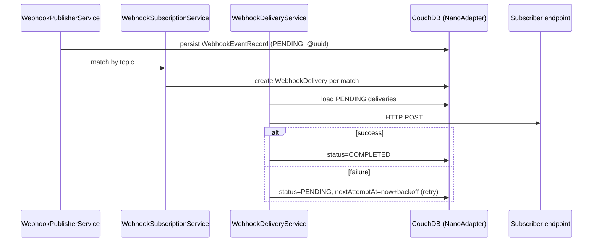

# 10 — Integrations, UI, CI & Testing Extras

**Specifications:** [DECAF-15](../specifications/DECAF_15.md) (Webhook Engine), [DECAF-25](../specifications/DECAF_25.md) (Webpage Refactor), [DECAF-27](../specifications/DECAF_27.md) (Reusable GitHub Actions), [DECAF-29](../specifications/DECAF_29.md) (GitHub Actions Inventory & Normalization), [DECAF-40](../specifications/DECAF_40.md) (BI Dashboard Embed Plugins), [DECAF-41](../specifications/DECAF_41.md) (Kibana Index Pattern Builder), [DECAF-44](../specifications/DECAF_44.md) (Cron Selector), [DECAF-46](../specifications/DECAF_46.md) (Jest Xray Teardown).

## 1. Webhook Engine (DECAF-15)

Integration-test spec for the `for-http`/`for-nest` webhook engine — publication → persistence → retry → delivery-status tracking against real CouchDB via `NanoAdapter` (no mocks).

- `WebhookPublisherService` publishes on topic `{entity}.{action}` (e.g. `user.created`).
- `WebhookEventRecord` persisted `status=PENDING` (`@uuid()` auto-generated).
- `WebhookSubscriptionService` matches subscriptions by topic → creates `WebhookDelivery` records per matching subscription.
- `WebhookDeliveryService` processes deliveries; transitions `PENDING → PROCESSING → COMPLETED/FAILED`; exponential backoff (30s,1m,2m,4m,8m,16m,30m…) updating `nextAttemptAt`.
- `WebhookSignatureMiddleware` (TASK-119) — signature extraction, lookup, timing-safe comparison for inbound signatures.
- Three CouchDB tables: `webhook_subscriptions`, `webhook_events`, `webhook_deliveries` (with declared `@index()` to prevent CouchDB warnings).

> **Tension:** webhook delivery (event→HTTP, persistent records, retry) vs agent progress (tool→MCP-notification, streaming) are conceptually parallel progress/delivery mechanisms never reconciled. Also a naming inconsistency: `for-http` uses `WebhookEventRecord.ts` while the `for-nest` mirror file is `WebHookEventRecord.ts` (camel-cased differently). See [11](./11-overlaps-contradictions.md).

## 2. BI Dashboard Embed Plugins (DECAF-40)

Two plugin subtrees under `@decaf-ts/integrations` — Kibana (reference, generated-source) and Superset (patch-and-build) — both implementing the same **DOM-free** `DashboardEmbedPlugin` contract. `integrations` stays DOM-free (`lib: ["es2022"]`); iframe/React plugin code lives under gitignored `integrations/plugins/*`; the Angular host lives in `for-angular`.

- Org-agnostic: no space switching inside the plugin; space comes from backend proxy/session. One stable iframe per org with `postMessage`-based dashboard switching.
- `EMBED_MESSAGE_TYPE`: `SWITCH`=`ORG_DASHBOARD_EMBED_SWITCH_DASHBOARD`, `READY`, `RENDERED`, `ERROR`.
- `DashboardEmbedPlugin`: `descriptor`, `manifest(targetVersion?)`, `buildEmbedUrl(options)`, `createSwitchDashboardMessage(payload)`, `sendSwitchDashboardMessage(...)`, `install(options)`.
- Kibana: `KibanaDashboardEmbedPlugin` (installer), `buildKibanaManifest`, `host.ts` (`buildKibanaEmbedUrl`, `sendKibanaSwitchDashboardMessage`). Reference React plugin `OrgDashboardEmbedApp` loads via `embeddable.getEmbeddableFactory('dashboard')`; parent origins validated against allowlist.
- Superset: `SupersetDashboardEmbedPlugin` (clone+patch+build), `apply_superset_6_1_patch.py` (regex-based, idempotent), `host.ts`. Switching: obtain guest token for target dashboard; `target.switchDashboard(dashboardId, guestToken)` over existing Switchboard MessageChannel; `DashboardPage` unmounts/remounts while iframe + React runtime + SDK channel stay alive.
- Subpath exports: `@decaf-ts/integrations/plugins`, `/plugins/kibana`, `/plugins/superset`. Runtime errors must be Decaf types (`InternalError`, `UnsupportedError`).

> **Risk:** Superset has no native plugin system — patch must be maintained per exact release; Kibana plugin APIs vary by minor (not backwards compatible); regex patch fragility.

## 3. Kibana Index Pattern Builder (DECAF-41)

Fluent `KibanaIndexBuilder extends Model` (project Builder Pattern: validation decorators, fluent `setX(): this`, terminal `build()`) replacing ad hoc `createDefaultKibanaDataViewConfigs`. Three match modes (`KibanaIndexMatchMode`: `EXACT`/`PREFIX`/`LOGGER_GENERATED`) plus compounding of logger-generated segments onto any base mode.

- Title composition: EXACT → `title = indexName` (no `*`); PREFIX → `prefix + sep + "*"`; LOGGER_GENERATED → `segments.join(sep) + sep + "*"`. Compound EXACT/PREFIX + logger segments → append rendered segments + trailing `*`.
- Logger compounding uses DECAF-9 `compileLogPattern(pattern)` + `logParameterRegistry.render(fullPayload, keys)`; `shouldInclude===false` params omitted.
- `KibanaIndexBuilderCollection.for(...builders)`/`.add(builder)`/`.build()` → `KibanaDataViewConfig[]`, pushed by `KibanaDataViewService.createDataView/createDataViews`.
- Cross-package dep on `@decaf-ts/logging` confirmed safe. Kibana supports only `*` (validate EXACT no `*`, PREFIX exactly one trailing `*`).

## 4. Cron Selector (DECAF-44)

Standalone Ionic web component `cron-selector` in `for-angular` — visually select a constrained cron schedule (daily times, every N hours, weekly weekdays) instead of typing raw cron. Emits a five-field cron string (or `;`-separated multi-schedule string) via `[(cron)]` and `ControlValueAccessor`. No Material/Bootstrap dependency.

- Daily: single cron when all times share the same minute; otherwise multiple five-field expressions joined by `;`.
- Hourly: `0 */N * * *`. Weekly: `<minute> <hour> * * <weekday-list>`.
- Downstream interprets `;`-separated strings as independent schedules (multiple `VEVENT`s or merged `RDATE`s). Timezone handling is downstream's responsibility.

## 5. Webpage Refactor (DECAF-25)

Refactor the `for-angular` webpage to full Decaf convention — removing page-level patterns that diverge from the decorator-first, metadata-driven, reusable-module approach. Audit shell/routes/pages → refactor shell/menu/routing → normalize page composition & shared services → regression coverage + docs. Open: which routes first wave; keep Ionic split-pane or different shell; preserve `NgxPageDirective`/`NgxComponentDirective` or replace; `src/app/ew` legacy/demo pages phased or together.

## 6. CI / Tooling Cluster (DECAF-27 + DECAF-29)

- **DECAF-27:** new `reusable-actions` repo centralizing reusable GitHub Actions workflows (`workflow_call` interface) for reuse across Decaf repos. Conservative reuse boundary initially; composite actions deferred.
- **DECAF-29:** next pass — inventory every workspace workflow, classify shared/repo-local/hybrid, migrate reusable logic into `reusable-actions`, normalize caller repos so trigger rules and guard conditions stay consistent. Treats workflow rules (triggers, filters, skip conditions) as first-class behaviour, not incidental YAML. Produces `reusable-actions/WORKFLOWS.md` rule matrix.
- Shared workflow set: `nodejs-build-prod`, `jest-coverage`, `release-on-tag`, `release-on-merge-pr`, `publish-on-release`, `codeql-analysis`, `snyk-analysis`, `trivy-scan`, `auto-merge-renovate`, `bug-in-progress-workflow`, `bug-pull-request-workflow`, `pages`/`static`. Repo-specific: `docker-couchdb`, `docker-couchdb-boot`, `release-alpha-on-tag`, `playwright`, `jest-test`.

> **Tension:** DECAF-27 keeps the reuse boundary conservative; DECAF-29 normalizes triggers/conditions action-by-action — tension between conservative migration and full rule replication (acknowledged in DECAF-29 risks).

## 7. Jest Xray Teardown (DECAF-46)

Ports Xray teardown from an external `jest-xray-teardown.cjs` into `@decaf-ts/utils` `tests` export (`runJestXrayTeardown`, named + default for CJS/ESM). Behaviour preserved exactly: `ENABLE_XRAY_REPORT` gate; `XRAY_CLIENT_ID`/`XRAY_CLIENT_SECRET` auth; junit XML parsing via `fast-xml-parser` (optional peer dep); evidence-file/payload collection; Xray import/GraphQL upload; response truncation; console output; failure semantics. Consumed via Jest `globalTeardown` pointing at transpiled `@decaf-ts/utils/tests`.

Continue to [11 — Overlaps & Contradictions](./11-overlaps-contradictions.md).
