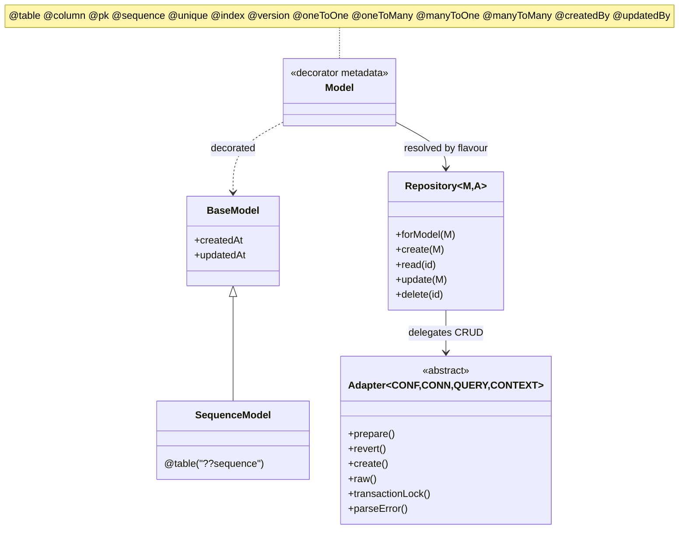
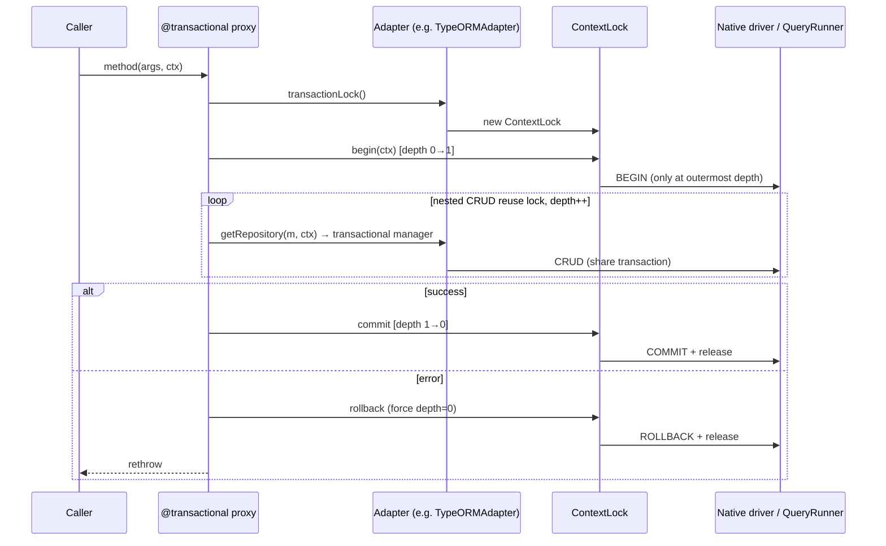
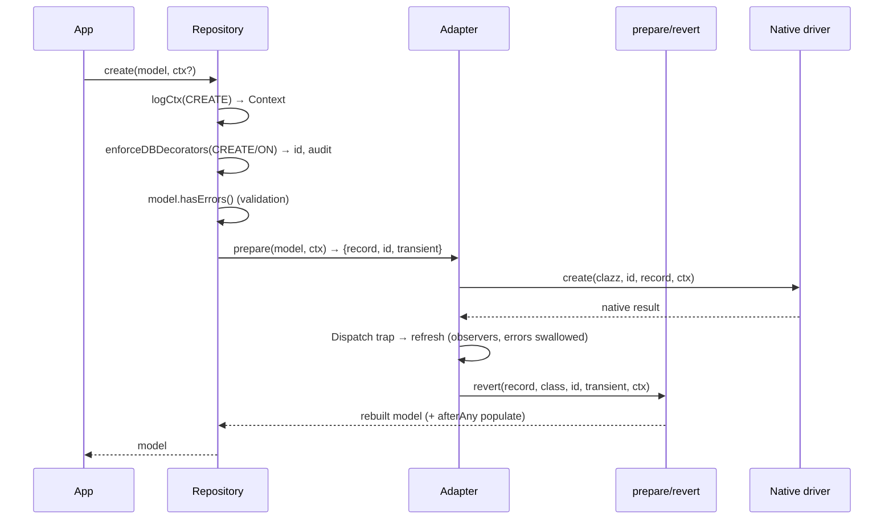

# 01 — Persistence Design

This section specifies the **design** of the decaf-ts persistence layer: the decorator-driven model, the `Adapter`/`Context`/`Dispatch`/`Sequence`/`Statement`/`Paginator` contract, the repository pattern, transactional coordination, and migrations. It is grounded in the research briefs for `@decaf-ts/core` and the SQL/NoSQL adapter packages (`for-couchdb`, `for-nano`, `for-pouch`, `for-typeorm`). The architecture (component map, layering, full flow traces) is detailed in the [Architecture Handbook](../architecture-handbook/03-persistence-core.md); this document covers the design rationale and per-operation contracts and does not restate the architecture.

No domain specification/bug/incident records are referenced here — the design is described directly from the grounded briefs.

## 1. Scope

In scope: the persistence contract in `@decaf-ts/core` and how the shipped concrete adapters implement it. Out of scope: the query DSL itself (see [02 — Query Design](./02-query-design.md)), the task engine, the service-layer HTTP exposure, and the Angular/UI consumption of model metadata. The cross-cutting `logging`/`crypto` libraries are referenced only where they participate in persistence behaviour (context logging, `@encrypt` field encryption).

## 2. Design Principles

Persistence-specific principles (the framework-wide principles live in [00 — Introduction](./00-introduction.md)):

- **P-P1 — Contract in core, behaviour in adapter.** The `Adapter`/`Context`/`Dispatch`/`Sequence`/`Statement`/`Paginator` spine is abstract in `core`; every concrete backend implements the same surface and overrides hooks (`prepare`/`revert`, `transactionLock`, `parseError`, `getClient`). *Why:* one repository/service API serves every backend, so application code is portable. *Enforced by:* the abstract method set on `Adapter` (`Adapter.ts` abstract members: `create`, `read`, `update`, `delete`, `raw`, `Statement`, `Paginator`, `parseError`, `getClient`).
- **P-P2 — Decorators are the configuration system.** Tables, columns, identity, relations, indexes, ownership, audit fields, transactions, migrations, and repositories are all declared with decorators built on `Decoration.for(KEY).define({decorator, args}).apply()` from `@decaf-ts/decoration`. *Why:* metadata drives persistence, validation, and UI rendering from a single source. *Enforced by:* `db-decorators` + `core` `overrides` (which monkey-patches `Metadata`/`Model`/`ModelBuilder`/`Injectables` with persistence-aware methods).
- **P-P3 — Flavour-awareness.** Each adapter instance carries a `flavour` (and optional `alias`); models bind via `@uses(flavour)`; decorations can be flavour-scoped via `Decoration.flavouredAs(...)`. `core` monkey-patches `Decoration.flavourResolver` at load so flavour lookups route through the adapter cache. *Why:* a single model can be persisted across multiple backends with backend-specific behaviour. *Enforced by:* `Adapter.ts:62-97` flavour resolver patch; `Repository.forModel` flavour chain (`Metadata.registeredFlavour` → `Metadata.flavourOf` → `Adapter.currentFlavour`).
- **P-P4 — Context is the cross-cutting backbone.** A `Context<F>` flag-bag is threaded as the trailing argument of every operation; `ContextualLoggedClass.logCtx(args, operation, allowCreate, overrides?)` extracts-or-creates it, binds a scoped logger, and returns `{ctx, log, ctxArgs}`. *Why:* correlation, affected-table tracking, write/transaction flags, and audit user identity propagate uniformly. *Enforced by:* `Adapter`/`Repository`/`Dispatch`/`Sequence`/`Statement`/`Service` all use `logCtx`; `isContextLike` duck-types (not `instanceof`) to survive duplicate `Context` constructors in linked monorepo builds.
- **P-P5 — Prepare/revert segregation.** Every CRUD op funnels through `Adapter.prepare(model, ctx)` → `{record, id, transient}` (column mapping, reserved-name refusal, `__metadata` carried) before native I/O, and `Adapter.revert(...)` to reconstruct the model afterward (reattaching transient props only when `ctx.get("rebuildWithTransient")`). *Why:* adapters exchange plain records with drivers while applications exchange typed models, and reserved/internal fields cannot be forged by model data. *Enforced by:* the CRUD `prefix`/`suffix` lifecycle in `Repository` and the constructor-woven `*Prefix` hooks in `CouchDBAdapter`.
- **P-P6 — Observer failures never fail CRUD.** `Dispatch` wraps the six mutating CRUD methods in Proxy traps that fire `adapter.refresh(...)` after success; observer errors are caught and logged. *Why:* side-effects (cache invalidation, projections) must not corrupt the primary write. *Enforced by:* `Dispatch.ts` Proxy traps and `ObserverHandler.updateObservers` (with a known misreporting bug — see §12).
- **P-P7 — Decaf-only error types.** Native driver errors are normalized through `Adapter.parseError` into `BaseError` subclasses (`NotFoundError`, `ConflictError`, `InternalError`, `ValidationError`, `ConnectionError`, `UnsupportedError`). *Why:* callers catch a stable taxonomy, not driver-specific exceptions. *Enforced by:* each adapter's `parseError`.
- **P-P8 — First adapter wins, explicit override required.** The first constructed `Adapter` becomes `Adapter.currentFlavour`; `Repository.forModel` falls back to it when a model has no explicit flavour. `Adapter.setCurrent(flavour)` changes it. *Why:* sensible defaults with deterministic override. *Enforced by:* `Adapter._cache` + `currentFlavour`.

## 3. Entity & Decoration Model

Models declare persistence metadata through `@decaf-ts/db-decorators` decorators, augmented by `core`'s `overrides` module (imported first in the barrel) which adds `Model.tableName`, `Model.sequenceFor`, `Model.merge`, `Model.indexes`, `Model.relations`, `Model.versionOf`, `Metadata.services()`, `Metadata.repositories()`, etc.

### 3.1 Tables, columns, identity

| Concern | Decorator / API | Notes |
|:--|:--|:--|
| Table | `@table(name)` | Sets the physical table name. `SequenceModel` uses the reserved name `??sequence`. |
| Primary key | `@pk(opts?)` | Defaults to `Number`, `generated: true`. Backwards-compatible wrapper over `@sequence`. |
| Sequence | `@sequence(opts?, update?)` | Per-property identity; metadata keyed by model identity + property name. `ensureSequenceOptions` normalizes. |
| Column mapping | `@column(name?)` | Maps a property to a physical column. |
| Uniqueness | `@unique()` | Column-level unique constraint. |
| Index | `@index(...)` | Composite-capable; carries directions and compositions. |
| Version | `@version(persistent?)` / `@persistentVersion` | Optimistic-concurrency / sequence versioning. |

`Sequence` supports `Number`/`BigInt`/`String`/`uuid`/`serial` generators backed by `SequenceModel`. Defaults: `DefaultSequenceOptions = NoneSequenceOptions` (`type: undefined`, `generated: false`, `startWith: 0`, `incrementBy: 1`, `cycle: false`); `Serial` zero-pads to 14 digits. The `UUID` generator uses `Math.random()` (non-cryptographic — fine for non-security IDs only).

### 3.2 Relations

`@oneToOne`, `@oneToMany`, `@manyToOne`, `@manyToMany`, `@relation`. Relation `onCreate` handlers persist nested models and set foreign keys; `afterAny` handlers (e.g. `populate`) rehydrate relations from `cacheForPopulate`.

> **Maturity caveat:** `@manyToMany` is explicitly under development — `manyToManyOnCreate`/`OnUpdate`/`OnDelete` emit `console.warn("DECORATOR manyToMany UNDER DEVELOPMENT")`. Only `manyToManyOnCreate` + junction construction are exercised. Use with caution.

### 3.3 Audit & ownership fields

`BaseModel` adds `createdAt`/`updatedAt`. Decorators: `@createdAt`, `@updatedAt`, `@createdBy`, `@updatedBy`.

> **Default behaviour:** `@createdBy`/`@updatedBy` throw `AuthorizationError` ("This adapter does not support user identification") unless the adapter overrides the handler. `RamAdapter`/`FilesystemAdapter` provide `createdByOnRamCreateUpdate` via `decoration()`; `NanoAdapter` provides `createdByOnNanoCreateUpdate` (reads `context.get("user")`, throws `UnsupportedError` if none); `PouchAdapter` provides `createdByOnPouchCreateUpdate` (copies `context.get("UUID")`); `TypeORMAdapter` provides `createdByOnTypeORMCreateUpdate` (`flags()` defaults `user` to `config.username`).

### 3.4 Entity relationships



## 4. Adapter Abstraction

`Adapter<CONF, CONN, QUERY, CONTEXT extends Context<AdapterFlags>>` is the central façade (note: generics are config / native connection / query / context — there is no `R` result parameter, despite some README claims). `core` exports `persistence` last in the barrel because `Repository`, `Dispatch`, and `Sequence` self-register their base classes back into `Adapter` at import time (`Adapter["_baseRepository"]`, `_baseDispatch`, `_baseSequence`), breaking what would otherwise be a circular dependency.

### 4.1 The contract an adapter implements

| Member | Purpose |
|:--|:--|
| `create(clazz, id, record, ...args)` | Insert one record. |
| `read(clazz, id, ...args)` | Fetch one by primary key. |
| `update(clazz, id, record, ...args)` | Replace/update one. |
| `delete(clazz, id, ...args)` | Remove one. |
| `raw(query, docsOnly, ...args)` | Execute a native query (`QUERY`); `docsOnly` selects docs vs full response. |
| `Statement<M,R,Q>` (factory) | Returns the adapter's `Statement` builder. |
| `Paginator<M,R,Q>` (factory) | Returns the adapter's `Paginator`. |
| `prepare(model, ctx)` | Segregate `{record, id, transient}`. |
| `revert(record, class, id, transient?, ctx)` | Reconstruct the model. |
| `parseError(err)` | Normalize a driver error to a Decaf `BaseError`. |
| `getClient()` | Lazily build/cache the native connection (`get client()`). |
| `transactionLock(...args)` | Return a `ContextLock` (default no-op). |
| `initialize()` | Optional boot (e.g. create indexes for registered models). |
| `shutdown()` | Tear down proxies/dispatch. |

Adapters typically also override `Context`, `flags()`, `repository()`, `Dispatch()`, `Sequence()`, and add native indexing.

### 4.2 Adapter families

- **`RamAdapter`** (`@decaf-ts/core/ram`, flavour `"ram"`): in-memory; `RamStatement` compiles `Condition`→predicate, `orderBy`→sort fn. **Not** in the main `@decaf-ts/core` barrel (commented out) — import from `@decaf-ts/core/ram`.
- **`FilesystemAdapter`** (`@decaf-ts/core/fs`, extends `RamAdapter`): persistent local store; records at `{root}/{table}/{pk}.json`, indexes at `{root}/{table}/indexes/{indexName}.json`; atomic writes (temp + rename); `FsDispatch` watch sync; `FilesystemLock`/`FilesystemMultiLock` cross-process locks. `rootDir` defaults to `path.join(os.tmpdir(), "decaf-fs-adapter")`; `watch` defaults to `true`. **Not** exported from the root barrel (the README example importing it from `@decaf-ts/core` is wrong) — import from `@decaf-ts/core/fs`. Does **not** override `shutdown()` (watchers/lockfiles not closed by base `shutdown`); call `stopWatching()` explicitly.
- **`CouchDBAdapter`** (`for-couchdb`, abstract): driver-agnostic CouchDB glue; bundles neither `nano` nor `pouchdb`. Discriminator multi-table-on-one-DB: every doc carries `??table = tableName`; `_id = ${tableName}__${pk}`; `raw()` force-scoped via `scopeToTable`. Revision (`_rev`) carried as non-enumerable `PersistenceKeys.METADATA`. Index planner attaches `use_index` (default `forceNamedIndexes: true`); strict mode throws `IndexPlanningError` with an `@index(...)` suggestion. `MangoQuery` default `limit` = `CouchDBQueryLimit` = **250** (not CouchDB's 25). Protected constructor — consumers must subclass.
- **`NanoAdapter`** (`for-nano`, flavour `"nano"`): `nano` client plugged into `CouchDBAdapter`; lazy `DocumentScope` via `wrapDocumentScope` (re-auths per op); `NanoDispatch` reads the continuous `_changes` feed; static admin helpers (`connect`/`createDatabase`/`createUser`/...). `Adapter.setCurrent(NanoFlavour)` on import.
- **`PouchAdapter`** (`for-pouch`, flavour `"pouch"`): PouchDB (local or remote CouchDB-compatible) plugged into `CouchDBAdapter`; lazy client + plugin registry (`pouchdb-find`/`mapreduce`/`replication` + user plugins); `flags()` seeds `config.user` with `randomUUID()` when unset. `package.json` `sideEffects: false` is **misleading** — import runs `decoration()` + `Adapter.setCurrent`.
- **`TypeORMAdapter`** (`for-typeorm`, flavour `"type-orm"`): SQL/relational over a TypeORM `DataSource`. Core contribution is `decoration()` which re-routes Decaf decorators into TypeORM metadata via local `overrides/` (so users write only Decaf decorators). `TypeORMContextLock` backs transactions with a `QueryRunner` (real `BEGIN`/`COMMIT`/`ROLLBACK`); CRUD inside `@transactional` resolves repos from `lock.manager()`. `TypeORMDispatch` supports SUBSCRIBER mode (implemented) and TRIGGER mode (Postgres-only viable; SQLite throws). **Postgres bias:** `TypeORMSequence` uses Postgres catalog SQL (`last_value`/`is_called`, `setval`, `CREATE SEQUENCE IF NOT EXISTS`, `to_regclass`); `parseError` maps SQLSTATE; `convertJsRegexToPostgres`. Multi-driver detection exists (mysql/mariadb/sqlite/mssql) but sequences and several helpers are Postgres-only. Peer dep declares only `pg`.

## 5. Repository Design

`Repository<M,A>` is the application-facing CRUD + query surface. Obtained via `Repository.forModel(M, flavour?)` (the static factory) — *not* `Repository.for` (an instance method, despite some README claims). `@repository(model, flavour?)` is a dual-purpose property-inject / class-register decorator. `InjectablesRegistry` (installed by `core` at `src/index.ts:14`) auto-resolves model→repository, falling back to `Repository.forModel` when an explicit registration is missing.

### 5.1 CRUD lifecycle (create)

`Repository.createPrefix` runs `logCtx(args, OperationKeys.CREATE, true)` → builds a `Context` (flags include `correlationId`, `affectedTables`, `writeOperation`), then:

1. Unless `ignoreHandlers`, runs `enforceDBDecorators(..., OperationKeys.CREATE, OperationKeys.ON)` — `@uuid`/`@pk`/`@sequence` generate ids; `@createdBy`/`@createdAt` populate audit fields; relation `onCreate` persists nested models and sets FKs.
2. Unless `ignoreValidation`, runs `model.hasErrors(...)` using `Metadata.validationExceptions` (combining `@noValidateOn*` and nested relations).
3. `adapter.prepare(model, ctx)` → `{record, id, transient}`.
4. `adapter.create(clazz, id, record, ctx)` (native I/O; `Dispatch` Proxy trap fires `adapter.refresh(...)` after success; observer errors swallowed).
5. `adapter.revert(...)` reconstructs the model; `afterAny` handlers (e.g. `populate`) rehydrate relations.
6. Returns the rebuilt model; `@transactional` (if present) commits at the outermost depth.

`CouchDBAdapter` weaves `createPrefix`/`updatePrefix`/etc. via `prefixMethod` *after* `Object.assign` so model data cannot forge `??table`/`_id` membership (security guard also enforced by `isReserved`). `CouchDBRepository.updatePrefix` validates the PK, optionally reads the old model, merges, runs decorators + validation, and carries the old `_rev` for optimistic concurrency (throws `InternalError("No revision number found...")` if absent). `TypeORMRepository.createAllPrefix` allocates ids via `adapter.Sequence(...).range` when `Model.generatedBySequence`.

> **Known defect:** `Repository.deleteAll` logs under the wrong operation key — it calls `this.logCtx(args, this.create, ...)` instead of `this.delete`, so bulk-delete observer/logging events are mislabelled as `create` (`Repository.ts:979`).

### 5.2 Bulk operations

`createAll`/`updateAll`/`readAll`/`deleteAll`. Default adapter flags: `breakOnSingleFailureInBulk = true`, `enforceUpdateValidation = true`, `allowRawStatements = true`, `observeFullResult = true`, `paginateByBookmark = false`. CouchDB-family bulk ops aggregate per-row errors into one `InternalError`. `PouchAdapter.deleteAll` marks docs with `CouchDBKeys.DELETED = true` and re-`bulkDocs`.

## 6. Transactional Design

`@transactional` (**must be imported from `@decaf-ts/core`**, not `@decaf-ts/transactional-decorators` — the base package re-registers its own decorator and would override core's, `transactions.ts:96-107`) wraps a method in a Proxy that:

1. Resolves the adapter's `ContextLock` via `resolveTransactionLock` (walks `ModelService` → `Repository` → `Adapter`).
2. Increments `lock.depth`; calls `begin`/`commit`/`rollback` only at the outermost depth.
3. Derives the context carrying `transactionLock` via `toOverrides()`; nested calls reuse the lock.

The default `ContextLock` is a **no-op** (`maxConcurrentTransactions = -1`, unbounded). `0` disables transactions (throws `UnsupportedError`); `>0` engages a per-adapter `SimpleConcurrencyLock` FIFO semaphore (`WeakMap`-keyed). Native adapters override `transactionLock()` to wrap real `BEGIN/COMMIT/ROLLBACK`:

- `TypeORMContextLock` fully overrides `begin(context)`/`commit(context)`/`rollback(err, context)` **without `super.*()`**, so it opts out of the core semaphore entirely — Postgres governs concurrency (`READ COMMITTED`). Nested CRUD resolves repos from `lock.manager()` so all writes share one transaction. Concurrent `@transactional` calls get independent `QueryRunner`s.
- CouchDB-family adapters rely on the `_rev` optimistic-concurrency model rather than native transactions.

Rollback ends the transaction with a double-rollback guard; on error the depth is forced to 0, `rollback` is called, and the error rethrown.

### 6.1 Transactional multi-write



## 7. Migrations Design (overview)

`@migration(reference, precedence?, flavour?, rules?)` registers migration classes; `MigrationService` orchestrates: `collectMigrations` → `sort` (by `versioning.compare` → precedence tokens → flavour → reference) → `buildExecutionPlan` (filtered by `fromVersion`/`toVersion`) → run inline or as per-version `CompositeTask`s through a `TaskService` (task mode), chaining dependencies and calling `setCurrentVersion` per completed version.

Two versioning strategies: `StandardMigrationVersioning` (lexical) and `SemverMigrationVersioning` (requires optional `semver`; falls back to lexical otherwise). Flavour-targeted migrations are supported; flavour precedence conflicts throw.

> The full migration design (task-mode orchestration, version-hop chaining, `MigrationTaskBuilder`, headless `npx decaf migrate`) lives in the dedicated migrations-design file (`migrations-design.md`, sibling). This document only notes the persistence-level integration point: migration logic lives in `MigrationService`, not `PersistenceService`; adapters expose `initialize()` (which creates indexes for registered models) and `setCurrentVersion`/`retrieveLastVersion` handlers.

## 8. Per-Operation Functional Requirements

### 8.1 Create

**FR-Create-1.** Given a valid model with a generated PK, when `repo.create(model)` is called, then the adapter generates the id (`@pk`/`@sequence`/`@uuid`), populates audit fields, validates, persists via `adapter.create`, and returns the rebuilt model with metadata attached.



### 8.2 Update

**FR-Update-1.** Given an existing record, when `repo.update(model)` is called, then the adapter validates, prepares, persists via `adapter.update`, and returns the rebuilt model. CouchDB-family updates require a carried `_rev` (optimistic concurrency); `TypeORMAdapter` reads-then-`save`.

### 8.3 Transactional multi-write

**FR-Tx-1.** Given a method decorated with `@transactional`, when it performs multiple writes, then all writes share one transaction; on any error the whole transaction rolls back; `begin`/`commit`/`rollback` fire only at the outermost depth (see §6.1 diagram).

### 8.4 Read / Delete

**FR-Read-1.** Given an existing id, when `repo.read(id)` is called, then the adapter fetches by generated id (`generateId` for CouchDB-family, pk for SQL) and returns the rebuilt model; on missing id, `parseError` yields `NotFoundError`.
**FR-Delete-1.** Given an existing id, when `repo.delete(id)` is called, then the adapter removes the record and returns the prior model (TypeORM) or a confirmation (CouchDB-family).

## 9. Acceptance Criteria

| ID | Given | When | Then |
|:--|:--|:--|:--|
| AC-Create-Success | A valid model with a generated PK | `repo.create(model)` | Returns the rebuilt model; id populated; audit fields set; observers fired (errors swallowed). |
| AC-Create-Validation | A model failing `@required`/validators | `repo.create(model)` (not `ignoreValidation`) | Throws `ValidationError`; no write occurs. |
| AC-Read-NotFound | A non-existent id | `repo.read(id)` | Throws `NotFoundError` (normalized via `parseError`). |
| AC-Update-Conflict | A stale `_rev` (CouchDB-family) | `repo.update(model)` | Throws `ConflictError`; no write. |
| AC-Update-NoRev | A CouchDB-family model without `_rev` | `repo.update(model)` | Throws `InternalError("No revision number found...")`. |
| AC-Delete-Success | An existing id | `repo.delete(id)` | Record removed; prior model returned (SQL) / confirmation (CouchDB). |
| AC-Tx-Rollback | A `@transactional` method where a later write fails | method executes | All prior writes in the transaction roll back; error rethrown; depth forced to 0. |
| AC-Tx-Nesting | Nested `@transactional` calls | inner calls execute | `begin`/`commit` fire once (outermost); inner calls reuse the lock (depth++). |
| AC-Tx-Disabled | `maxConcurrentTransactions = 0` | any `@transactional` call | Throws `UnsupportedError`. |
| AC-Reserved-Reject | Model data containing reserved attrs (`^_.*$`, `??table`, `??sequence`) | `adapter.prepare` | Reserved fields refused (cannot forge table membership). |
| AC-Observer-Isolation | An observer that throws | CRUD succeeds | Observer error caught/logged; CRUD result unaffected (wrong observer may be reported — see §12). |

## 10. Environment Variables

**The persistence runtime reads no required environment variables.** All connection/auth configuration flows through adapter constructor config (`RamAdapter({ user })`, `NanoAdapter({ couchUser, couchPassword, host, dbName, protocol })`, `TypeORMAdapter(dataSourceOptions)`, `PouchAdapter(config)`). `core` itself declares no env vars.

Notable env-var observations from the briefs (none of which are read by persistence `src/` at runtime):

- `@decaf-ts/crypto`'s `Obfuscation.getKeyMaterial()` reads `process.env.ENCRYPTION_KEY || ""` but it is **vestigial** — `obfuscate`/`deobfuscate` take an explicit `secret` and never call it.
- `@decaf-ts/logging`'s `LoggedEnvironment` seeds `env` from `NODE_ENV` (default `"development"`) at module load; this affects the logging context that `logCtx` binds, not persistence behaviour directly.
- Adapter **test harnesses** (not runtime) read: `NANO_ADMIN_USER`/`NANO_ADMIN_PASSWORD`/`NANO_HOST`/`NANO_PROTOCOL`/`NANO_CLEANUP_DELAY_MS` (for-nano); `POUCH_ADMIN_USER`/`POUCH_ADMIN_PASSWORD`/`COUCHDB_ADMIN_USER`/`COUCHDB_ADMIN_PASSWORD`/`POUCH_HOST`/`POUCH_PROTOCOL`/`POUCH_CLEANUP_DELAY_MS` (for-pouch); `POSTGRES_USER`/`POSTGRES_password`/`POSTGRES_VERSION`/`POSTGRES_PORT`/`POSTGRES_VECTOR`/`TZ` (for-typeorm docker-compose). CI gating uses `process.env.CI` in setup/teardown.

If a deployment needs env-driven config, it must read env vars itself and pass them to the adapter constructor.

## 11. Usage Examples

### 11.1 Minimal CRUD with the RAM runtime

```typescript
import { Repository } from "@decaf-ts/core";
import { RamAdapter } from "@decaf-ts/core/ram";
import { table, pk, prop, required } from "@decaf-ts/db-decorators";

@table("users")
class User {
  @pk() id!: string;
  @required() name!: string;
  @prop() age!: number;
}

const adapter = new RamAdapter({ user: "tester" });           // flavour "ram", becomes current
const repo = Repository.forModel(User);                        // resolves adapter + repo

const created = await repo.create({ name: "alice", age: 30 }); // @pk generates a uuid
const read = await repo.read(created.id);
await repo.update({ ...read, age: 31 });
await repo.delete(read.id);                                    // subsequent read throws NotFoundError
```

### 11.2 Nano adapter + CRUD

```typescript
import { Repository } from "@decaf-ts/core";
import { NanoAdapter, NanoRepository, NanoFlavour } from "@decaf-ts/for-nano";
import { uses, table, model } from "@decaf-ts/decoration";      // NOTE: `uses` is from decoration, not core
import { BaseModel, pk, column, unique, required, createdBy } from "@decaf-ts/core";

@uses(NanoFlavour) @table("tst_user") @model()
class TestModel extends BaseModel {
  @pk() id!: number;
  @column("tst_name") @required() name!: string;
  @column("tst_nif") @unique() @minlength(9) @maxlength(9) @required() nif!: string;
  @column("tst_created_by") @createdBy() createdBy!: string;
}

const adapter = new NanoAdapter({
  couchUser: "nano-user", couchPassword: "nano-pass",
  host: "localhost:10010", dbName: "mydb", protocol: "http",
}, "mydb");
await adapter.initialize();
const repo = Repository.forModel(TestModel) as NanoRepository<TestModel>;
const created = await repo.create(new TestModel({ id: 1, name: "Ada", nif: "123456789" }));
await adapter.shutdown();
```

### 11.3 TypeORM adapter + transactional CRUD

```typescript
import { Repository, transactional } from "@decaf-ts/core";
import { TypeORMAdapter, TypeORMRepository, TypeORMFlavour } from "@decaf-ts/for-typeorm";
import { uses, table, model } from "@decaf-ts/decoration";
import { Model, pk, column, createdAt, updatedAt } from "@decaf-ts/core";

@uses(TypeORMFlavour) @table("tst_user") @model()
class TestModelRepo extends Model {
  @pk({ type: "Number" }) id!: number;
  @column("created_on") @createdAt() createdAt!: Date;
  @column("updated_on") @updatedAt() updatedAt!: Date;
}

const adapter = new TypeORMAdapter({
  type: "postgres", host: "localhost", port: 5432,
  username: "repo_user_minimal", password: "password",
  database: "repository_db_minimal", synchronize: true, logging: false,
});
await adapter.initialize();
const repo: TypeORMRepository<TestModelRepo> = Repository.forModel(TestModelRepo);
const created = await repo.create(new TestModelRepo({ name: "test_name" }));
// A @transactional method forwarding `...args` across multiple create/update calls
// shares one TypeORMContextLock / Postgres transaction and rolls back together.
```

> **Convention note:** `OrderDirection` is `ASC`/`DSC` (not `DESC`) — using `OrderDirection.DESC` yields `undefined`.

## 12. Inaccuracies

Recorded exactly as found in the briefs (not fixed). Persistence/adapter-relevant subset; the full cross-module list is returned separately.

**[core]** README import path for `FilesystemAdapter` — README imports `FilesystemAdapter` from `@decaf-ts/core`, but `src/index.ts` does not re-export `./fs` (and `./ram` is commented out). `FilesystemAdapter` is only available via the `@decaf-ts/core/fs` subpath. | Evidence: `README.md:197` vs `src/index.ts:30` and absence of `./fs` in the main barrel. | Suggested fix: change the README import to `@decaf-ts/core/fs`.

**[core]** README `Adapter` generic parameters are wrong — README documents `Adapter<N, Q, R, Ctx>`; the actual signature is `Adapter<CONF, CONN, QUERY, CONTEXT extends Context<AdapterFlags>>`. There is no `R` (result) parameter. | Evidence: `README.md:108` vs `src/persistence/Adapter.ts:231-236`. | Suggested fix: update the README generic list to `<CONF, CONN, QUERY, CONTEXT>`.

**[core]** README "Extending the Adapter" example omits required abstract members — the example implements only `create` and says implement `read/update/delete/raw`; the code also requires `Statement`, `Paginator`, `parseError`, and `getClient`. The example would not compile. | Evidence: `README.md:304-320` vs abstract methods at `Adapter.ts:426-434, 473, 797-802, 857-861, 911-916, 969-973, 1021-1025, 1259`. | Suggested fix: list all abstract members in the example.

**[core]** README `create` example signature drops the required trailing `Context` arg — README shows `async create<M>(clazz, id, model): Promise<Record<string,any>>` but the abstract signature requires `...args: ContextualArgs<CONTEXT>`. | Evidence: `README.md:309-313` vs `Adapter.ts:797-802`. | Suggested fix: add `...args: ContextualArgs<any>` and forward it.

**[core]** README native-transaction example uses wrong `begin/commit/rollback` signatures — README shows `override async begin(): Promise<void>` (no args); actual methods are `begin(context)`, `commit(context)`, `rollback(err, context)`. | Evidence: `README.md:383-403` vs `ContextLock.ts:112, 141, 151`. | Suggested fix: add the `context` parameter (and `err` for `rollback`).

**[core]** README `FilesystemAdapter.shutdown()` comment is inaccurate — README says `await adapter.shutdown(); // closes open file handles when the app exits`, but `FilesystemAdapter` does not override `shutdown()`; base `Adapter.shutdown()` only shuts down proxies and closes the dispatch. `stopWatching()` must be called explicitly. | Evidence: `README.md:215` vs `FilesystemAdapter.ts` (no `shutdown` override) and `Adapter.ts:359-389`. | Suggested fix: correct the comment and document `stopWatching()`.

**[core]** README uses `OrderDirection.DESC` which is `undefined` — the enum is `ASC="asc"`, `DSC="desc"` (no `DESC` member). README examples at three places use `OrderDirection.DESC`. | Evidence: `README.md:662, 675, 704` vs `src/repository/constants.ts:12-15`. | Suggested fix: change `OrderDirection.DESC` to `OrderDirection.DSC`.

**[core]** README places `@prepared()` under `repository/decorators` — `@prepared` is exported from `src/query/decorators.ts:26`; `repository/decorators.ts` only exports `@repository`. | Evidence: `README.md:85-87` vs `src/query/decorators.ts:26-40`. | Suggested fix: move the `@prepared()` bullet to the query decorators section.

**[core]** README omits `findByPaginate` from the high-level query method list — `Repository.findByPaginate(key, value, ref?, ...args)` exists but is not listed. | Evidence: `README.md:66-76` vs `Repository.ts:1338`. | Suggested fix: add `findByPaginate(key, value, ref?)` to the list.

**[core]** README `Repository.for(config, ...args)` described as static but is an instance method — `for(conf, ...args)` is an instance method; the static factory is `Repository.forModel`. | Evidence: `README.md:81` vs `Repository.ts:393-402` (instance) and `:1730` (`forModel` static). | Suggested fix: describe `for` as an instance method and `forModel` as the static factory.

**[core]** `Adapter.static get` JSDoc says it returns `undefined` when missing; code throws `InternalError` — `static get<A>(flavour?)` JSDoc: "The adapter instance or undefined if not found", but the body throws `InternalError("No adapter...")`. | Evidence: `src/persistence/Adapter.ts:1207-1214`. | Suggested fix: correct the JSDoc to state it throws.

**[core]** `Adapter.repository()` error message is stale — message says the base "will be replaced lazily" but `repository()` only throws; there is no lazy replacement. | Evidence: `src/persistence/Adapter.ts:297`. | Suggested fix: remove the "replaced lazily" claim.

**[core]** `Dispatch.close()` JSDoc vs body mismatch — JSDoc says "Performs any necessary cleanup"; the body is an intentional no-op with a typo comment. | Evidence: `src/persistence/Dispatch.ts:307-314`. | Suggested fix: correct the JSDoc to note the base is a no-op that subclasses may override.

**[core]** `ObserverHandler.updateObservers` indexes the filtered list but logs against the unfiltered list — `results` comes from `observers.filter(...).map(...)`, but the error log uses `this.observers[i]` (unfiltered), so the wrong observer is reported when filters excluded some. | Evidence: `src/persistence/ObserverHandler.ts:147-170`. | Suggested fix: capture the filtered array and index into it.

**[core]** `errors.ts` `UnsupportedError` example references non-existent APIs — the JSDoc example uses `adapter.supportsTransactions()` and `adapter.beginTransaction()`, which do not exist (the API is `transactionLock()`). | Evidence: `src/persistence/errors.ts:11-23` vs `Adapter.ts`. | Suggested fix: rewrite the example using `transactionLock()`/`maxConcurrentTransactions`.

**[core]** `Repository.deleteAll` logs under the wrong operation key — `deleteAll` calls `this.logCtx(args, this.create, ...)` instead of `this.delete`, so bulk-delete events are mislabelled as `create`. | Evidence: `src/repository/Repository.ts:979`. | Suggested fix: change `this.create` to `this.delete`.

**[core]** `@manyToMany` JSDoc is copy-pasted from `@manyToOne` — says "Defines a many-to-one relationship" with a `@manyToOne` example. | Evidence: `src/model/decorators.ts:646-673`. | Suggested fix: rewrite the `manyToMany` JSDoc.

**[core]** `@manyToMany` runtime is under development with `console.warn` — `manyToManyOnCreate`/`OnUpdate`/`OnDelete` emit `console.warn("DECORATOR manyToMany UNDER DEVELOPMENT")` instead of using the context logger. | Evidence: `src/model/construction.ts:897, 1144, 1162`. | Suggested fix: complete the implementation or mark experimental; replace `console.warn` with the context logger.

**[core]** `SequenceModel` JSDoc says "@category Ram" / "RAM sequence model" but the class lives in the generic `model/` module and is used across adapters. | Evidence: `src/model/SequenceModel.ts:8,14`. | Suggested fix: correct the category/description to "model".

**[core]** `Sequence.parseValue` has unreachable `toLowerCase()` branches — `Number.name || Number.name.toLowerCase()` always returns `"Number"`, so the `toLowerCase()` fallbacks are dead. | Evidence: `src/persistence/Sequence.ts:475, 481, 483`. | Suggested fix: remove the dead `||` branches or invert the logic.

**[core]** `Sequence.range()` throws `UnsupportedError` for `uuid`/`serial` with a TODO — documented behaviour is incomplete. | Evidence: `src/persistence/Sequence.ts:259-262`. | Suggested fix: implement or clearly document the limitation.

**[core]** `interfaces/index.ts` omits `ContextuallyLogged` and `Paginatable` — both interface files exist but are not re-exported, so they are unreachable through `@decaf-ts/core`. | Evidence: `src/interfaces/index.ts:6-12`. | Suggested fix: add the re-exports or remove the unused files.

**[core]** `AdapterFlags.lock` field appears unused/dead — only `ContextFlags.transactionLock` is read by `@transactional`. | Evidence: `src/persistence/types.ts:189` vs `transactions.ts:46`. | Suggested fix: remove `lock` or document its intended use.

**[core]** `construction.ts` contains large blocks of dead/commented code and `console.*` calls — commented `createOrUpdateBulk` skeleton (with syntax errors), ~60 lines of commented `oneToManyOnCreateUpdate`, and `console.log`/`console.error` in `getOrCreateJunctionModel`. | Evidence: `src/model/construction.ts:114-175, 541-599, 1058, 1067, 1069`. | Suggested fix: remove dead code; replace `console.*` with the context logger.

**[core]** `RamAdapter.flags` UUID fallback has operator-precedence bug — `this.config.user || "" + Date.now()` evaluates `"" + Date.now()` first, so the `user` fallback never participates. | Evidence: `src/ram/RamAdapter.ts:133`. | Suggested fix: parenthesize as `this.config.user || ("" + Date.now())`.

**[core]** `FilesystemLock.release` is fire-and-forget and can race — `release(...)` does `void releaseLockFile().then(() => super.release(...))`; `super.release` is not awaited and runs after the lockfile is removed. | Evidence: `src/fs/locks/FilesystemLock.ts:54-56`. | Suggested fix: await the chain or reorder release vs lockfile removal.

**[core]** `Injectables.repositories<R>(flavour)` declared signature takes a `flavour` param but the implementation takes none — the `declare module` augmentation declares a `flavour` parameter; the runtime patch accepts none. | Evidence: `src/overrides/injectables.ts:9-11` vs `src/overrides/overrides.ts:310-317`. | Suggested fix: align the signature.

**[core]** `migrations/index.ts` does not re-export `SemverMigrationVersioning` — only reachable via the dedicated `./migrations/SemverMigrationVersioning` subpath. | Evidence: `src/migrations/index.ts:17` vs `package.json` subpath export. | Suggested fix: add it to the `./migrations` barrel or document the subpath-only support.

**[for-couchdb]** README/Description — claims a "Sequence Management" subsystem (`CouchDBSequence … Sequence Model`) that does not exist in `src/`. | Evidence: `README.md:56-59`, `workdocs/4-Description.md:18-20`; no `*sequence*` file in `src/`. | Suggested fix: remove the section or implement/export a `CouchDBSequence`.

**[for-couchdb]** README adapter example — generic-parameter names disagree with the class signature (`MyFlags` vs `CONN`). | Evidence: `README.md:100` vs `src/adapter.ts:74-78`. | Suggested fix: rename `MyFlags` to `MyConnection`.

**[for-couchdb]** README adapter example — method signatures use `tableName: string` but abstracts use `Constructor<M>` + `PrimaryKeyType`. | Evidence: `README.md:133,142,152,161` vs `src/adapter.ts:284-289,330-334`. | Suggested fix: update example signatures to `Constructor<M>`/`PrimaryKeyType`.

**[for-couchdb]** README repository example — wrong generic arity for `CouchDBRepository` (4 type params vs 2). | Evidence: `README.md:221` vs `src/repository.ts:17-20`. | Suggested fix: `CouchDBRepository<User, typeof adapter>`.

**[for-couchdb]** README error example imports `ConflictError`/`NotFoundError` from this package, but they are not re-exported — they come from `@decaf-ts/db-decorators`. | Evidence: `README.md:361` vs `src/index.ts:3-13`. | Suggested fix: import from `@decaf-ts/db-decorators` or re-export them.

**[for-couchdb]** README utility example calls `generateIndexName('email','users',['firstName'],'asc')` (utils signature) but the *exported* `generateIndexName` has signature `(name: string[], direction?, compositions?, separator?)`. | Evidence: `README.md:416` vs `src/indexes/generator.ts:20-32`. | Suggested fix: `generateIndexName(['email','users'],'asc',['firstName'])`.

**[for-couchdb]** README imports `* as nano from 'nano'` but `nano` is not a dependency. | Evidence: `README.md:86` vs `package.json`. | Suggested fix: state the driver must be installed by the consumer, or add `nano` as a peer.

**[for-couchdb]** README index example calls `adapter.db.createIndex(...)` but `db` is declared `private` in the same example. | Evidence: `README.md:101` vs `README.md:349-350`. | Suggested fix: expose `db` as `protected`/`readonly` or call `createIndex` inside `index()`.

**[for-couchdb]** `MangoQuery.limit` JSDoc says `@default 25`, but the applied default is 250. | Evidence: `src/types.ts:161` vs `src/query/constants.ts:9` + `src/query/Statement.ts:264-271`. | Suggested fix: change the JSDoc default to `250` (or reference `CouchDBQueryLimit`).

**[for-couchdb]** `parseError` — the 400 → `IndexError` branch is unreachable (matches `code.toString()` (`"400"`) against a message regex; `code` is the HTTP status string, never the message). | Evidence: `src/adapter.ts:568-571`. | Suggested fix: match against `reason`/`err.message` instead of `code`.

**[for-couchdb]** `utils.generateIndexDoc` builds `partialFilterSelector` but never attaches it (the line is commented out). | Evidence: `src/utils.ts:188-192` builds it; `:218` `// partial_filter_selector: partialFilterSelector,`. | Suggested fix: uncomment to enable partial indexes or delete the dead construction.

**[for-couchdb]** Production `console.log` left in the view generator. | Evidence: `src/views/generator.ts:292`. | Suggested fix: remove or route through the module logger.

**[for-couchdb]** JSDoc typo `ConuchDB`. | Evidence: `src/query/Paginator.ts:14`. | Suggested fix: spell "CouchDB".

**[for-couchdb]** `CouchDBKeys` JSDoc typedef is stale — missing `VIEW`. | Evidence: `src/constants.ts:11-23` (typedef omits `VIEW`) vs `:32-46` (runtime includes `VIEW: "view"`). | Suggested fix: add `VIEW` to the typedef.

**[for-couchdb]** README repository example asserts `CouchDBRepository<...>` type on `Repository.forModel(...)` without a cast — the factory returns `CouchDBRepository as unknown as Constructor<R>`. | Evidence: `README.md:221-222` vs `src/adapter.ts:121-125`. | Suggested fix: show the idiomatic lookup with a cast or document the registry contract.

**[for-nano]** package metadata — `repository.url`/`bugs.url`/`homepage` point at the `for-couchdb` repo. | Evidence: `package.json:59,85,87`. | Suggested fix: update to `decaf-ts/for-nano` URLs.

**[for-nano]** README "How to Use" imports `uses` from `@decaf-ts/core` — `uses` is exported by `@decaf-ts/decoration`. | Evidence: `README.md:91` vs `tests/TestModel.ts:11`. | Suggested fix: import `uses` from `@decaf-ts/decoration`.

**[for-nano]** README claims `NanoFlags extends RepositoryFlags` — actual `NanoFlags extends AdapterFlags`; no `RepositoryFlags` exists in core. | Evidence: `README.md:58` vs `src/types.ts:1,9`. | Suggested fix: state `extends AdapterFlags`.

**[for-nano]** `NanoConfig` JSDoc lists wrong property names (`user`/`password`/`host`/`dbName`) — actual are `couchUser`/`couchPassword`/`host`/`dbName`/`protocol`; README omits `protocol`. | Evidence: `src/types.ts:31-37` vs `:39-45`. | Suggested fix: correct `@property` names and add `protocol`.

**[for-nano]** `NanoRepository` JSDoc calls it a `@typedef` alias, but it is a class. | Evidence: `src/NanoRepository.ts:11-29`. | Suggested fix: document it as a class.

**[for-nano]** `NanoDispatch` is not part of the public barrel but is documented as first-class. | Evidence: `src/index.ts:7-11` does not re-export it; `README.md:48-52` documents it. | Suggested fix: re-export it or clarify it is internal (accessed via `repo.observe`).

**[for-nano]** README example uses string literal `"nano"` while tests/recommended usage use the `NanoFlavour` constant. | Evidence: `README.md:97` vs `tests/TestModel.ts:14`. | Suggested fix: use `@uses(NanoFlavour)`.

**[for-nano]** `index.ts` registers the library with placeholder strings (`##PACKAGE##`/`##VERSION##`) unless the build substitutes them. | Evidence: `src/index.ts:25-52`. | Suggested fix: confirm the `build-scripts --prod` flow replaces the placeholders.

**[for-nano]** `connect` JSDoc omits the optional `agent` parameter. | Evidence: `src/adapter.ts:685-699`. | Suggested fix: document `agent`.

**[for-pouch]** `PouchFlags` documented as `extends RepositoryFlags` — actual `extends AdapterFlags`. | Evidence: `README.md:62` vs `src/types.ts:10`. | Suggested fix: `extends AdapterFlags` and document optional `forceNamedIndexes`.

**[for-pouch]** `PouchRepository` documented as a type alias — actual is a class extending `CouchDBRepository<M, PouchAdapter>` with an `override()`. | Evidence: `README.md:75` vs `src/PouchRepository.ts:13`. | Suggested fix: document as a class.

**[for-pouch]** `PouchConfig` documented with only `user`/`password`/`host`/`protocol`/`port`/`dbName`/`storagePath`/`plugins` — actual also defines `couchUser`, `couchPassword`, `adminUser`, `adminPassword`. | Evidence: `README.md:65-72` vs `src/types.ts:36-55`. | Suggested fix: document preferred `couchUser`/`couchPassword` + admin creds; mark `user`/`password` deprecated.

**[for-pouch]** `index(models)` documented as returning `Promise<CreateIndexResponse[]>` — actual `protected override async index<M>(...models): Promise<void>`. | Evidence: `README.md:88` vs `src/adapter.ts:286-288`. | Suggested fix: `Promise<void>` + varargs form.

**[for-pouch]** `flags(...)` documented as returning `Context<PouchFlags>` synchronously — actual returns `Promise<PouchFlags>`. | Evidence: `README.md:86` vs `src/adapter.ts:249-267`. | Suggested fix: `Promise<PouchFlags>` (async).

**[for-pouch]** `raw(rawInput, process: boolean)` documented with a `process` param — actual `raw<V>(rawInput, docsOnly = true, ...args)`. | Evidence: `README.md:101` vs `src/adapter.ts:791-795`. | Suggested fix: rename to `docsOnly` with default `true`.

**[for-pouch]** `flags()` JSDoc says it "extracts the user ID from the database URL or generates a random UUID" — code only generates `randomUUID()` into `config.user` and never parses the URL. | Evidence: `src/adapter.ts:242-243` vs `:255`. | Suggested fix: rewrite to state it seeds `config.user` with `randomUUID()` when unset.

**[for-pouch]** `parseError` 400→`IndexError` branch is unreachable. | Evidence: `src/adapter.ts:913-916` (matches `code.toString()` against a message regex); `tests/integration/parse-error.test.ts:29-33`. | Suggested fix: match against `err.message`/`reason`, or remove the dead branch + `IndexError.ts`.

**[for-pouch]** `package.json` `"sideEffects": false` is inaccurate — `src/index.ts:4` calls `PouchAdapter.decoration()` and `src/adapter.ts:948` calls `Adapter.setCurrent(PouchFlavour)` at load. | Evidence: `for-pouch/package.json:22`. | Suggested fix: `"sideEffects": ["./src/index.ts"]`.

**[for-pouch]** README "Related" badge for "for nano" is mislabeled/mislinked. | Evidence: `README.md:462`. | Suggested fix: make the badge self-consistent and add a separate correct one.

**[for-pouch]** `IndexError` is internal but referenced by error-mapping behaviour — imported by `adapter.ts:43` but not re-exported by `index.ts`. | Evidence: `src/IndexError.ts`. | Suggested fix: re-export or document as internal.

**[for-pouch]** `PouchFlags.forceNamedIndexes` declared but never used. | Evidence: `src/types.ts:14`. | Suggested fix: implement in `index()` or remove the dead field.

**[for-pouch]** `getLocalPouch` is dead code referencing a browser-only adapter (`pouchdb-adapter-idb`); no caller. | Evidence: `tests/pouch.ts:47-57`. | Suggested fix: remove or convert to a Node-runnable adapter.

**[for-pouch]** `bin/releases/dist-pouchdb/package.json` pins `0.9.3` while source is `0.9.5`. | Evidence: `bin/releases/dist-pouchdb/package.json:44`. | Suggested fix: rebuild the bundle against the current version.

**[for-typeorm]** `nativeRepo()`/`queryBuilder()` reference a non-existent `adapter.dataSource` member — base `Adapter` only defines `get client()`; `TypeORMAdapter` adds no `dataSource` getter; no test calls them. | Evidence: `src/TypeORMRepository.ts:170` vs `core/src/persistence/Adapter.ts:1262`. | Suggested fix: use `this.adapter.client.getRepository(clazz)` (or add a `dataSource` alias getter).

**[for-typeorm]** README — raw Postgres types documented as exported but are not. | Evidence: README `:143` vs `src/index.ts` (no `export * from "./raw/postgres"`). | Suggested fix: add the export or remove the claim.

**[for-typeorm]** README — decorator overrides listed as exported are not; also claims a `JoinColumn` override that has no file. | Evidence: README `:138` vs `src/index.ts` and `src/overrides/` (no `JoinColumn`). | Suggested fix: state these are internal, or export them.

**[for-typeorm]** README — schema helpers reference non-existent Postgres-named methods + a commented-out `createTable`. | Evidence: README `:63` vs `TypeORMAdapter.ts:900,1008,1110` (`*ToDriver`) and `:1137-1346` (commented `createTable`). | Suggested fix: rename to `*ToDriver` and drop `createTable`.

**[for-typeorm]** README — `TypeORMEventSubscriber` example has the wrong constructor signature (omits required `adapter`). | Evidence: README `:625` vs `src/TypeORMEventSubscriber.ts:44-52`. | Suggested fix: pass an adapter as the first argument.

**[for-typeorm]** index generator docstrings incorrectly say "CouchDB"/`for-couchdb`. | Evidence: `src/indexes/generator.ts:9-10,12,33-39,70`. | Suggested fix: replace with "TypeORM"/`for-typeorm`.

**[for-typeorm]** index generator — `CREATE INDEX $1 ON $2 ($3)` uses Postgres parameter placeholders for identifiers, which Postgres does not support. | Evidence: `src/indexes/generator.ts:104-106` executed via `client.query(index.query, index.values)` (`TypeORMAdapter.ts:325`); the default-query branch correctly uses interpolation (`:125`). | Suggested fix: interpolate quoted identifiers directly.

**[for-typeorm]** index generator — first "table index" is an empty no-op query (`{ query: "", values: [] }`); `TypeORMAdapter.index()` will execute `client.query("")`. | Evidence: `src/indexes/generator.ts:82-87` vs `TypeORMAdapter.ts:322-328`. | Suggested fix: populate it or skip empty queries in the adapter loop.

**[for-typeorm]** `detectTypeORMDriver` — redundant equality checks against already-lowercased input. | Evidence: `src/types.ts:128-130`. | Suggested fix: simplify to the enum + genuinely distinct aliases.

**[for-typeorm]** `decorators.ts` is 310 lines of entirely commented-out dead code. | Evidence: `src/decorators.ts:1-310`. | Suggested fix: delete the file.

**[for-typeorm]** `TypeORMAdapter` contains a ~210-line commented-out `createTable` block. | Evidence: `src/TypeORMAdapter.ts:1137-1346`. | Suggested fix: remove the dead block.

**[for-typeorm]** README example — `UserProfile` declares `updatedAt` twice and puts `@createdAt()` on an `updatedAt`-named field. | Evidence: README `:310-316`. | Suggested fix: rename the first field to `createdAt`.

**[for-typeorm]** `package.json` description is stale/minimal vs README. | Evidence: `package.json:4` vs `src/index.ts:18-20`. | Suggested fix: update `description` to match the README summary.

**[for-typeorm]** `TypeORMDispatch` TRIGGER-mode MySQL/Maria/SQLServer DDL is untested and likely invalid (`JSON_OBJECTIFY(NEW)`, `GET_LOCK`, a non-built-in `sp_notify_db_change`); only SUBSCRIBER mode is covered. | Evidence: `src/TypeORMDispatch.ts:180-202`. | Suggested fix: test/validate against live MySQL/MSSQL, or mark TRIGGER Postgres-only and throw `UnsupportedError` for others.

Continue to [02 — Query Design](./02-query-design.md).
