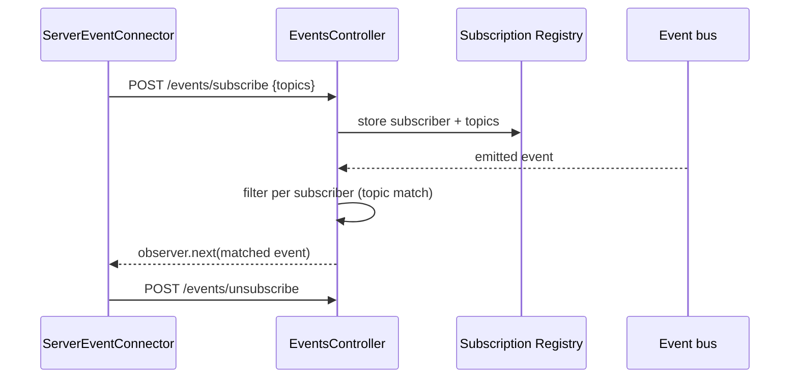

# 02 — HTTP Server, Nest & SSE Design

**Source specifications:** [DECAF-10](../specifications/DECAF_10.md), [DECAF-13](../specifications/DECAF_13.md), [DECAF-42](../specifications/DECAF_42.md); transport/identity parts of [DECAF-33](../specifications/DECAF_33.md)/[DECAF-43](../specifications/DECAF_43.md) (authz detail in [03](./03-authorization-design.md)).

## 1. Overview

A framework-agnostic primitives layer (`for-http/src/server/`) hosts route decorators, builders, model-controller factories, base controllers, and request transformers. `for-nest` is a thin consumer. The client side (`for-http`) provides typed REST helpers and an SSE connector with an opt-in subscription mode.

## 2. Goals

- G1 — Single home for backend/server primitives reusable by future adapters (e.g. `for-express`); reduce `for-nest` to a thin consumer.
- G2 — Model-driven controller generation (CRUD/bulk/statement/grouping/complex-query) gated by operation-blocking metadata.
- G3 — Typed, Axios-aligned client REST helpers with framework-level type ownership.
- G4 — Opt-in SSE subscription/private mode alongside the broadcast default, preserving the existing `/events` contract.

## 3. Requirements

- **Req-1 (DECAF-10):** `route(verb, path)` + verb aliases `@get`/`@post`/`@put`/`@patch`/`@del` (capitalized; `@delete` rejected for TS1359). Stored under `ServerKeys.ROUTE`.
- **Req-2 (DECAF-10):** `ServerControllerBuilder`/`ServerMethodBuilder` are pure framework-agnostic; `ServerRoute` carries a handler slot (`withImplementation()`); `build()` materializes a class. No persistence/model logic here.
- **Req-3 (DECAF-10):** `ModelControllerBuilder` adds CRUD/bulk/statement/grouping/complex-query routes, each gated by `isOperationBlocked(ModelConstr, kind, value)`. `ModelControllerFactory.create(ModelConstr, persistence, config?)` with granular config (`allowStatementlessQuery`, `allowGroupingQueries`, `allowBulkStatement` as bool or granular object); `@composed()`-PK path derivation + `filterEmpty` fallback. Defaults must reproduce today's for-nest route surface (TASK-172 parity tests).
- **Req-4 (DECAF-10):** `DecafController<REQ,RES,CTX>`/`DecafModelController<M,...>` framework-agnostic; `persistence()` fallback chain `Service.get → ModelService.getService → Repository.forModel`; IP-header parsing. `RequestContext` (for-http/server) base; `DecafRequestContext` (for-nest) extends it. Transformers relocated to `for-http/server/transformers/`, re-exported from `for-nest`.
- **Req-5 (DECAF-10):** `@allowIf`/`@blockIf` throw `UnsupportedError` when `thisArg.logCtx` missing; call handler; throw `AuthorizationError` or wrap thrower in `InternalError`. `for-nest/src/auth/` consolidates `AuthInterceptor`/`DecafAuthHandler`/`@Auth()`/`AUTH_META_KEY`/`AUTH_HANDLER`; `DecafAuthModule.forRoot({global})` controls `APP_INTERCEPTOR` vs per-controller opt-in.
- **Req-6 (DECAF-13):** `HttpAdapter.get/post/put/delete(url, options?)` thin wrappers; `HttpRequestOptions` Axios-aligned (`timeout`, `headers`, `transformResponse`, `validateStatus`, `includeCredentials`, `params`, `responseType`, `baseURL`, `signal`, `auth`, `transformRequest`); `AxiosHttpAdapter.toRequest()` maps `includeCredentials` → `withCredentials`. Additive, no breaking change.
- **Req-7 (DECAF-42):** Preserve `/events` broadcast default; add `POST /events/subscribe` + `POST /events/unsubscribe`; backend filters per subscriber before `observer.next(...)`. `ServerEventConnector` registers on open / unregisters on close in subscription mode. Subscription state ephemeral (optional `RamAdapter` backing).

## 4. Architecture & Design

See [Architecture Workbook §03](../architecture-workbook/03-http-server-nest.md). Key decisions:

- **`for-nest` reduced to a thin consumer** so the primitives layer is reusable. Transformer relocation is a breaking change for external imports — re-export shims required (duration undetermined).
- **`ModelControllerFactory` defaults are a compatibility contract** — parity tests (TASK-172) are the safety net.
- **SSE subscription identity model is open** (per-connector vs per-auth-user vs both); reconnect behaviour open. The graph subsystem (DECAF-48) already depends on subscription mode keyed by `{runId, ownerUser}`.

### SSE subscription lifecycle

## 5. Public Interfaces (selected)

- `route/get/post/put/patch/del` decorators; `ServerMethodBuilder.withMethod/.../withImplementation()`; `ServerControllerBuilder.addMethod/build()`.
- `ModelControllerBuilder.addCreateRoute/.../addComplexQueryRoute`; `ModelControllerFactory.create(ModelConstr, persistence, config?)`; `isOperationBlocked(ctor, kind, value)`.
- `DecafAuthModule.forRoot({global})`; `@allowIf(handler)` / `@blockIf(handler)`; `@Auth()`.
- `HttpAdapter.{get,post,put,delete}(url, options?)`; `HttpRequestOptions`.
- `POST /events/subscribe`, `POST /events/unsubscribe`, `/events` (broadcast).

## 6. Open Questions / Risks

- `@allowIf`/`@blockIf` byte-for-byte identical (TASK-169); zero callers in repo; relationship to DECAF-33 `AuthzService` unstated (B10).
- Two parallel `for-nest` auth stories (DECAF-10 `DecafAuthModule` vs DECAF-33 Keycloak+namespace handler) need merging (B8).
- `delete` naming split between client method and server decorator (B7).
- Transformer relocation re-export shim duration (B-section).
- `ModelControllerFactory` `sqaggre` annotation copy semantics; `ServerRoute`/`RouteResponse` must carry enough for `@nestjs/swagger` regeneration.

Continue to [03 — Authorization & Identity Design](./03-authorization-design.md).
