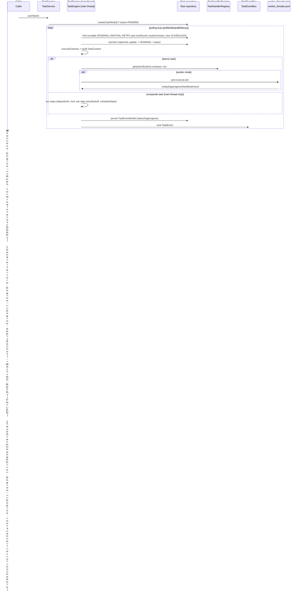

# 03 — Task Engine Design

**Source:** `@decaf-ts/core` task and worker subsystems, as documented in the
[`core` research brief](../_research-briefs/02-core.md). The architecture is
detailed in the [Architecture Handbook — Persistence Core](../architecture-handbook/03-persistence-core.md);
this document covers the design-level principles, functional requirements, and
runbook and does not restate the component map.

## 1. Overview

The task engine is an in-process scheduler and arbitrator for both atomic and
composite tasks. It is built on top of the persistence layer: tasks are
themselves `TaskModel` records persisted through a repository, so lease
ownership, retries, and progress are restart-safe. The engine polls for
runnable tasks, claims them with an optimistic-update lease, dispatches each to
a registered `TaskHandler`, persists `TaskEventModel` records, and fans the
events out over a `TaskEventBus`. A worker-thread variant (`./workers`
subpath) offloads the execution of *atomic* handlers to Node `worker_threads`
for CPU isolation while the main thread retains leasing, tracking, and event
emission.

Migrations (see [04 — Migrations Design](./04-migrations-design.md)) are
orchestrated as composite tasks, so the task engine is a foundational
dependency of the migration subsystem.

## 2. Design Principles

- **Poll-claim-dispatch over push-execute.** The engine does not invoke
  handlers directly on `push`; it persists the task and a polling loop claims
  it via optimistic update with a lease. *Why:* this makes ownership durable
  across restarts and allows multiple workers (separate processes or threads)
  to coordinate without a central dispatcher. *Enforced by:* the
  `tryClaim`/`executeClaimed` control flow and the lease timestamp on
  `TaskModel`; engine tests assert that claimed tasks transition to `RUNNING`
  only after a successful optimistic update.
- **Tasks are persisted models, not in-memory jobs.** Every task is a
  `TaskModel`; every status/log/progress change is a `TaskEventModel`. *Why:*
  restart-safety and observability — a crashed process resumes `PENDING` and
  `WAITING_RETRY` tasks on next poll, and the full event history is queryable.
  *Enforced by:* `TaskEventService` (a `ModelService` over `TaskEventModel`)
  and `TaskEventBus` (extends `ObserverHandler`) both writing through the
  repository.
- **Handler registration via decorator metadata.** Handlers register with
  `@task("type")`; `TaskHandlerRegistry` bootstraps from `Metadata.tasks()`.
  *Why:* keeps the discovery mechanism consistent with the rest of the
  decorator-driven framework and avoids a manual registry call site. *Enforced
  by:* `TaskHandlerRegistry` reading task metadata at boot; integration tests
  exercise `@task`-decorated handlers end to end.
- **Atomic vs. composite execution paths.** Atomic tasks dispatch to a single
  handler; composite tasks run a sequence of steps (with `dependsOn`,
  per-step `maxAttempts`/`backoff`/`canFail`, and dynamic `scheduleSteps`)
  optionally concurrently under a shared `lock`. *Why:* lets one engine serve
  both "run this one thing" and "orchestrate a multi-step workflow" without a
  second runtime. *Enforced by:* `CompositeTaskBuilder`/`TaskStepSpecBuilder`
  and the `TaskContext` flags (`stepWriteLock`, `scheduleCompositeSteps`).
- **Worker threads isolate CPU, not state.** The worker `TaskEngine` extends
  the base engine and dispatches *only atomic* handlers to `worker_threads`,
  posting `execute` jobs and receiving `ready`/`log`/`progress`/`heartbeat`/
  `result` messages; composite tasks still run on the main thread. *Why:*
  keeps the main thread responsive and the single source of truth (leasing,
  tracking, emitting) on one thread, while still allowing CPU-bound handlers
  to run off-thread. *Enforced by:* the worker `TaskContext` is built without
  `stepWriteLock`/`scheduleCompositeSteps`, so composite dispatch is
  structurally impossible in workers.
- **Structured error taxonomy drives state transitions.** Handlers throw
  `TaskControlError` subtypes (`TaskFailError`, `TaskRetryError`,
  `TaskCancelError`, `TaskRescheduleError`) to direct the engine; a
  `TaskStateChangeError` thrown from a handler triggers `cancel`/`retry`/
  `reschedule` rather than a generic failure. *Why:* makes recovery intent
  explicit and testable instead of inferred from message strings. *Enforced
  by:* the `isTaskError` guard and the routing branch in `executeClaimed`.

## 3. Architecture

The full component map and threading model live in the
[Architecture Handbook — Persistence Core](../architecture-handbook/03-persistence-core.md).
The design-relevant surfaces are:

| Component | Role |
| --- | --- |
| `TaskEngine<A,C>` | Polling engine; `push`/`schedule`/`track`/`cancel`/`start`/`stop`; composite steps, retries/backoff, dependencies, locks, auto-shutdown. |
| `TaskHandler<I,O>` | Abstract handler base; `@task(key)` registers an implementation; `TaskHandlerRegistry` resolves by task classification. |
| `TaskService<A>` | `ClientBasedService` wrapping an engine; auto-starts on `push`. |
| `TaskTracker<O>` | Await terminal status; attach log/status pipes; `onSucceed`/`onFailure`/`onCancel`/`onUpdate`. |
| `TaskEventBus` | Extends `ObserverHandler`; fans `TaskEventModel`s out to observers. |
| `TaskEventService` | `ModelService` over `TaskEventModel`; persists events. |
| `TaskContext` | Extends `Context`; carries step-write lock and composite-step scheduling flags. |
| Builder DSL | `TaskBuilder`, `TaskBackoffBuilder`, `CompositeTaskBuilder`, `TaskStepSpecBuilder`. |
| Models | `TaskModel`, `TaskEventModel`, `TaskStepSpecModel`, `TaskStepResultModel`, `TaskErrorModel`, `TaskBackoffModel`, `TaskLogEntryModel`, `TaskIOSerializer`. |
| Enums | `TaskStatus`, `TaskType`, `TaskEventType`, `BackoffStrategy`, `JitterStrategy`. |
| `CleanUpTask` | Built-in `@task("cleanup-task")`. |
| Worker engine | `./workers` subpath: `TaskEngine<A>` extends the base engine; `WorkThreadEnvironment`/`DefaultWorkThreadEnvironment`; `workerThread.ts` entry; `messages.ts` wire protocol. |

### Task lifecycle and control flow



## 4. Functional Requirements

Each requirement carries acceptance criteria in given/when/then form.

### FR-1 — Successful task execution

**Given** a registered `@task("echo")` handler and a started `TaskEngine`
persisting to a repository, **when** a caller `push`es an atomic task of
classification `"echo"`, **then** the polling loop claims the task (status
`RUNNING`, lease acquired), the handler `run` is invoked with the task input
and a `TaskContext`, a terminal `TaskEvent` of type success is persisted, the
task reaches `DONE`, and `TaskTracker.onSucceed` fires.

### FR-2 — Handler failure with retry/backoff

**Given** a handler that throws a non-control error on the first invocation
and succeeds on retry, with a backoff strategy configured, **when** the engine
dispatches the task, **then** the failure is persisted as a `TaskEvent`, the
task transitions to `WAITING_RETRY` with `nextRunAt` computed from the
configured `BackoffStrategy`/`JitterStrategy`, the polling loop re-claims it
once `nextRunAt` passes, and the task eventually reaches `DONE` (or `FAILED`
once `maxAttempts` is exhausted).

### FR-3 — Worker-thread execution error

**Given** the `./workers` `TaskEngine` and an atomic handler that throws,
**when** the handler is dispatched to a `worker_thread`, **then** the worker
posts a `result` message carrying the error, the main thread records the
failure `TaskEvent`, and the engine applies the same retry/backoff or `FAILED`
transition as the in-thread path. Composite tasks are *not* dispatched to
workers (they run on the main thread).

### FR-4 — `TaskStateChangeError` routing

**Given** a handler that throws a `TaskCancelError`/`TaskRetryError`/
`TaskRescheduleError`, **when** the engine catches it, **then** the engine
routes the task to `cancel`/`retry`/`reschedule` respectively rather than
marking it `FAILED`, and `isTaskError` distinguishes control errors from plain
handler errors.

### FR-5 — Composite step coordination

**Given** a composite task with steps declaring `dependsOn`, a shared `lock`,
per-step `maxAttempts`/`backoff`/`canFail`, and a `scheduleSteps` hook,
**when** the engine runs the composite, **then** steps execute in dependency
order, mutually exclusive steps serialize under the lock, failing steps retry
per their own backoff up to `maxAttempts`, `canFail` steps do not abort the
composite, and dynamically inserted steps are incorporated before completion.

### FR-6 — Lease recovery

**Given** a running engine whose process dies mid-execution, **when** a new
engine instance starts polling, **then** tasks whose leases have expired are
re-claimed and re-executed (no permanent `RUNNING` orphan), because
`PENDING`/`WAITING_RETRY`/expired-lease tasks are all part of the runnable
query.

## 5. Environment Variables

The task engine reads **no environment variables**. All tuning is supplied
through `DefaultTaskEngineConfig` (overridable per `TaskEngine`/`TaskService`
construction):

| Config key | Default | Meaning |
| --- | --- | --- |
| `workerId` | `"default-worker"` | Identity of this engine instance for lease ownership. |
| `concurrency` | `10` | Max simultaneously claimed atomic tasks. |
| `maxConcurrentCompositeSteps` | `-1` (Infinity) | Max concurrently running steps within a composite task. |
| `leaseMs` | `60000` | Lease duration before a task is considered abandoned. |
| `pollMsIdle` | `1000` | Poll interval when no runnable tasks are found. |
| `pollMsBusy` | `500` | Poll interval while work is in flight. |
| `logTailMax` | `100` | Max in-memory log entries retained on a tracker. |
| `gracefulShutdownMsTimeout` | `120000` | Wait for in-flight tasks on `stop()`. |
| `autoShutdown` | `{enabled:false, backoffStepMs:1000, maxIdleDelayMs:60000}` | Auto-stop after sustained idleness. |

## 6. Usage Example

The `core` research brief does not include a dedicated task usage snippet in
its "Usage example" section (the provided examples cover CRUD and query). The
minimal push/track shape, derived from the public API surface and the
documented control flow, is:

```typescript
import { TaskService, TaskTracker } from "@decaf-ts/core/tasks";
import { task, TaskHandler } from "@decaf-ts/core/tasks";

@task("echo")
class EchoHandler extends TaskHandler<string, string> {
  async run(input: string) { return input; }
}

const service = new TaskService(adapter);          // wraps a TaskEngine
const tracker: TaskTracker<string> = await service.push({
  classification: "echo",
  input: "hello",
});
const result = await tracker.onSucceed();          // resolves to "hello"
```

For worker-isolated execution, import the engine from the `./workers` subpath
instead of `./tasks`; the API is otherwise identical, but only atomic handlers
are dispatched to `worker_threads`.

## 7. Inaccuracies

The following inaccuracies are drawn from the `core` research brief's
"Inaccuracies found" and from observations in its API surface. None are fixed
here.

**[core]** task service — `TaskService.track` builds its logging context with
`.for(this.push)` instead of `.for(this.track)`, so the `track` operation is
logged under the `push` method name (copy-paste bug). | Evidence:
`src/tasks/TaskService.ts:128` | Suggested fix: change `this.push` to
`this.track`.

**[core]** task event bus — `TaskEventBus.listeners` is a `Set` field that is
declared but never read or written (dead code). | Evidence:
`src/tasks/TaskEventBus.ts:15` | Suggested fix: remove the field or wire it
into the observer fan-out.
