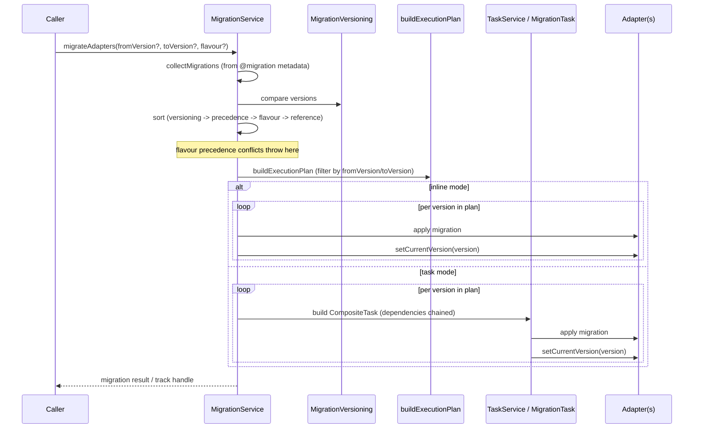

# 04 — Migrations Design

**Source:** `@decaf-ts/core` migration subsystem (subpaths `./migrations` and
`./migrations/SemverMigrationVersioning`), as documented in the
[`core` research brief](../_research-briefs/02-core.md). The migration
component map is part of the persistence layer; see the
[Architecture Handbook — Persistence Core](../architecture-handbook/03-persistence-core.md)
for the surrounding architecture (migrations are part of the persistence layer).
This document covers design principles, functional
requirements, and runbook and does not restate the component map.

## 1. Overview

The migration framework evolves persisted schemas from one version to the next.
It is built on two lower layers: the task engine (migrations run as
`CompositeTask`s in task mode, chaining dependencies and calling
`setCurrentVersion` per completed version) and the persistence/adapter layer
(`MigrationService` resolves adapters and flavour-targeted migration rules).
A migration is a class decorated with `@migration(reference, ...)`, collected
and sorted into an execution plan, then applied either inline or through a
`TaskService` depending on configuration. Two versioning strategies ship with
core: `StandardMigrationVersioning` (lexical) and `SemverMigrationVersioning`
(semver, requiring the optional `semver` dependency).

## 2. Design Principles

- **Migrations are classes decorated with `@migration`.** A migration declares
  its version `reference`, optional `precedence`, `flavour`, and `rules` via
  the decorator. *Why:* keeps migration definitions consistent with the
  decorator-driven model/repository vocabulary and lets `MigrationService`
  discover them through metadata rather than a manual registration list.
  *Enforced by:* `@migration(reference, precedence?, flavour?, rules?)` and
  `MigrationService.collectMigrations` reading decorated classes.
- **Versioning is a strategy, not a string compare.** Ordering is delegated to
  a `MigrationVersioning` implementation; core ships `StandardMigrationVersioning`
  (lexical) and `SemverMigrationVersioning` (semver, falls back to lexical
  ordering when `semver` is absent). *Why:* different adapters/projects use
  different version schemes; isolating comparison in a strategy avoids
  imposing semver on everyone while still offering it as an option. *Enforced
  by:* the `MigrationVersioning` interface and the dedicated
  `./migrations/SemverMigrationVersioning` subpath.
- **Deterministic sort.** Migrations are sorted by `versioning.compare`, then
  by precedence tokens, then by flavour, then by reference. *Why:* a total,
  stable order makes the execution plan reproducible across hosts and avoids
  non-deterministic schema drift. *Enforced by:* `MigrationService.sort`.
- **Flavour targeting.** A migration may target a specific adapter flavour;
  flavour precedence conflicts throw. *Why:* the same model may be persisted
  across multiple flavours (DB dialects, Fabric, etc.) and a migration that is
  valid for one flavour may be invalid or harmful for another. *Enforced by:*
  the `flavour` argument on `@migration` and the flavour-conflict check in the
  sort/plan phase.
- **Two execution modes, one orchestrator.** `MigrationService` runs the plan
  either inline or as per-version `CompositeTask`s through a `TaskService`
  (task mode). *Why:* inline mode is simplest for boot/CLI; task mode gives
  retries, leases, and observability for long or failure-prone migrations.
  *Enforced by:* `MigrationService.migrateAdapters`/`migrate` selecting task
  mode vs. inline from `MigrationConfig`, and `MigrationTaskBuilder`/
  `MigrationTask` (`@task("migration")`).
- **Version bookkeeping is overridable.** `setCurrentVersion` is called per
  completed version and `retrieveLastVersion`/`track`/`retry` are configurable
  handlers. *Why:* the "current version" may live in a metadata table, a
  dedicated model, or an external store depending on the adapter. *Enforced
  by:* `PersistenceMigrationConfig` / `AdapterMigrationHandlers` /
  `MigrationRule`.
- **Decaf-only errors.** Migration failures surface as `MigrationError`/
  `MigrationRuleError` (subclassing the core error hierarchy), never raw
  `Error`. *Why:* consistent with framework-wide error discipline and lets
  callers branch on migration-specific failure. *Enforced by:* the error
  classes exported from `core` persistence.

## 3. Architecture

Design-relevant surfaces (the full component map is in the Architecture
Workbook references above):

| Component | Role |
| --- | --- |
| `AbsMigration<A,R>` (`Migration` interface) | Base class for a single migration; declares the version-bound transformation. |
| `@migration(reference, ...)` | Registers a migration class with version/precedence/flavour/rules metadata. |
| `MigrationService<PERSIST,A,R>` | Orchestrator: `migrateAdapters`, `migrate`, `track`, `retry`, `sort`, `buildExecutionPlan`; chooses task mode vs. inline. |
| `MigrationTaskBuilder` / `MigrationTask` | `@task("migration")` composite task for task-mode execution. |
| `MigrationVersioning` | Strategy interface for version comparison. |
| `StandardMigrationVersioning` | Lexical ordering. |
| `SemverMigrationVersioning` | Semver ordering (requires optional `semver` dependency; falls back to lexical otherwise). |
| `DefaultMigrationConfig` / `PersistenceMigrationConfig` / `MigrationConfig` | Configuration shapes. |
| `MigrationRule` / `AdapterMigrationHandlers` | Per-adapter rules and handler hooks (e.g. `retrieveLastVersion`, `setCurrentVersion`). |

### Migration lifecycle and control flow



## 4. Functional Requirements

### FR-1 — Apply forward migrations

**Given** a set of `@migration`-decorated classes, a configured
`MigrationVersioning`, and an adapter whose current version is `fromVersion`,
**when** `migrateAdapters` is invoked with a `toVersion`, **then**
`collectMigrations` discovers all decorated migrations, `sort` orders them by
`versioning.compare` → precedence → flavour → reference, `buildExecutionPlan`
filters to the `(fromVersion, toVersion]` range, and each migration in the
plan is applied in order with `setCurrentVersion` called after each completed
version.

### FR-2 — Skip already-applied migrations

**Given** an adapter whose persisted current version is `V3` and a plan that
spans `V1..V5`, **when** migration runs, **then** `V1`, `V2`, and `V3` are
skipped (already at or below the current version) and execution begins at the
first version strictly greater than the current version, because
`buildExecutionPlan` filters by `fromVersion`/`toVersion` derived from the
adapter's tracked version.

### FR-3 — Failure mid-migration

**Given** a plan where migration `V4` throws, **when** the failure occurs,
**then** the failure surfaces as a `MigrationError` (or `MigrationRuleError`
for rule/config violations), `V3` remains the recorded current version
(`setCurrentVersion(V4)` is not called), and in task mode the failed
`MigrationTask` is retried per the task engine's retry/backoff policy via
`MigrationService.retry`/`track` until `maxAttempts` is exhausted, after which
the migration aborts and later versions in the plan are not applied.

### FR-4 — Flavour targeting and conflict

**Given** two migrations with the same version but different target flavours,
**when** `sort` runs, **then** both are retained (each applies to its own
flavour); but **given** two migrations with the same version *and* the same
flavour, **then** the flavour-precedence check throws rather than producing an
ambiguous order.

### FR-5 — Versioning strategy selection

**Given** `StandardMigrationVersioning`, **when** two versions are compared,
**then** lexical ordering is used; **given** `SemverMigrationVersioning` with
the `semver` optional dependency installed, **then** semver comparison is used;
**given** `SemverMigrationVersioning` without `semver` installed, **then** the
strategy falls back to lexical ordering (per the brief's note on the optional
`semver` dependency).

## 5. Environment Variables

The migration subsystem reads **no environment variables**. Configuration is
supplied programmatically through `MigrationConfig` /
`PersistenceMigrationConfig` (e.g. task-mode toggle, `retrieveLastVersion`/
`setCurrentVersion` handlers, versioning strategy, flavour filter). The
optional `semver` npm dependency gates `SemverMigrationVersioning` but is not
an environment variable.

## 6. Usage Example

The `core` research brief does not include a dedicated migration usage snippet
in its "Usage example" section (the provided examples cover CRUD and query).
The minimal shape, derived from the public API surface and the documented
control flow, is:

```typescript
import { MigrationService } from "@decaf-ts/core/migrations";
import { migration } from "@decaf-ts/core/migrations";
import { StandardMigrationVersioning } from "@decaf-ts/core/migrations";

@migration("0002")
class AddUsersTable { /* applies the V2 schema change */ }

@migration("0003")
class AddEmailIndex { /* applies the V3 schema change */ }

const service = new MigrationService(/* persistence */);
await service.migrateAdapters({
  versioning: new StandardMigrationVersioning(),
  // taskMode: true to run via MigrationTask composite tasks
});
```

For semver-ordered migrations, import `SemverMigrationVersioning` from the
dedicated `@decaf-ts/core/migrations/SemverMigrationVersioning` subpath (it is
not re-exported from the `./migrations` barrel — see Inaccuracies).

## 7. Inaccuracies

The following are drawn from the `core` research brief's "Inaccuracies found".
None are fixed here.

**[core]** migrations barrel — `src/migrations/index.ts` does not re-export
`SemverMigrationVersioning`; it is only reachable via the dedicated
`./migrations/SemverMigrationVersioning` subpath that `package.json` declares,
so the `./migrations` barrel omits it. | Evidence: `src/migrations/index.ts:17`
(omits `SemverMigrationVersioning`) vs `package.json` subpath export |
Suggested fix: add it to the `./migrations` barrel for discoverability, or
document that only the subpath is supported.

**[core]** migrations coverage — the generated
`workdocs/reports/coverage/lcov-report` references a
`src/migrations/LegacyMigrationVersioning.ts` that is not present in
`src/migrations/` (which contains only `StandardMigrationVersioning.ts` and
`SemverMigrationVersioning.ts`); the coverage HTML is stale. | Evidence:
`workdocs/reports/coverage/lcov-report/src/migrations/LegacyMigrationVersioning.ts.html`
vs `src/migrations/` listing | Suggested fix: regenerate the docs/coverage.
