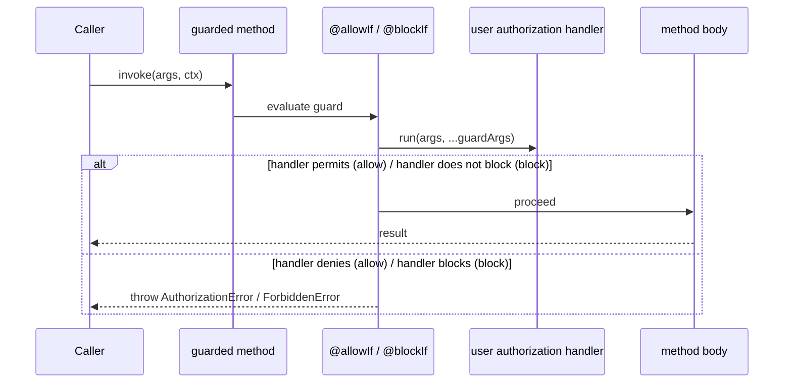

# 05 — Auth & Identity Design

**Source:** `@decaf-ts/core` `auth`, `identity`, and `utils` (operation guards)
subsystems, as documented in the [`core` research
brief](../_research-briefs/02-core.md). The broader authorization architecture
(org-based authorization, Keycloak brokering) is detailed in the
[Architecture Handbook — Persistence Core](../architecture-handbook/03-persistence-core.md)
(auth guards/identity) and [Integrations](../architecture-handbook/07-integrations.md)
(namespaces/Keycloak); this document is scoped to the in-`core` primitives — method auth guards,
allow/block predicates, contextual authorization handlers, and identity
metadata — and does not restate those layers.

## 1. Overview

`core` provides the lowest auth/identity primitives on which the higher
authorization layers (DECAF-33 org-based authorization, DECAF-43 Keycloak
brokering, `DecafAuthModule`) are built. There are three related but distinct
surfaces:

- **Method auth guards** — `@allowIf(handler, ...args)` and
  `@blockIf(handler, ...args)` decorate a method with a user-supplied
  predicate handler. The two decorators share the same mechanism; their
  *semantic* difference (allow-listing vs. deny-listing) is encoded entirely
  by the handler the caller supplies.
- **Operation guards** — `@create`, `@read`, `@update`, `@del` (plus
  `@service`, `@auth`, `@roles`, `@route`) in `utils` guard operations and
  annotate metadata; `AuthorizationError`/`ForbiddenError` are the canonical
  failure types.
- **Identity metadata** — `@pk` and `@sequence` declare identity-generating
  properties; audit-field handlers `@createdBy`/`@updatedBy` populate the
  acting principal. By default `@createdBy`/`@updatedBy` throw
  `AuthorizationError` ("This adapter does not support user identification")
  unless the adapter overrides the handler (RAM/FS provide
  `createdByOnRamCreateUpdate`).

> **Scope note.** The `core` research brief's auth coverage is thin: it lists
> the decorator signatures and notes that the `AuthKeys` enum is defined but
> unused, and provides no control-flow trace or usage example for auth. This
> document therefore states what the brief substantiates and explicitly flags
> the gaps rather than inventing APIs.

## 2. Design Principles

- **Guards are predicates the caller writes.** `@allowIf`/`@blockIf` take a
  handler plus arbitrary `args`; the framework does not impose an allow/deny
  model — it only invokes the handler. *Why:* keeps `core` auth-neutral so the
  org-based authorization layer (DECAF-33) and Keycloak handler (DECAF-43) can
  plug in their own decision logic without `core` taking a position on roles,
  namespaces, or principals. *Enforced by:* the handler-argument signature of
  the decorators; the `auth-decorators.test.ts` suite exercises handler
  invocation.
- **Allow vs. block is a convention, not a type.** The two decorators share
  one mechanism; the semantic difference lives in the handler. *Why:* avoids
  duplicating machinery for what is logically "run this predicate against the
  request" and lets callers compose allow/block lists from the same handler
  vocabulary. *Enforced by:* the identical decorator structure; documented
  behaviour that the semantic difference is encoded by the user handler.
- **Identity generation is per-property metadata.** `@pk` and `@sequence`
  decorate properties; `@pk` defaults to `Number`, `generated: true`, while
  `@sequence` honours `DefaultSequenceOptions` (`type`, `generated`,
  `startWith`, `incrementBy`, `cycle`). *Why:* identity is part of the model
  declaration, not an after-the-fact assignment, so it composes with the
  prepare/revert lifecycle and adapter sequence generation. *Enforced by:*
  `@pk`/`@sequence` decorators and `ensureSequenceOptions` normalization.
- **Audit fields fail closed by default.** `@createdBy`/`@updatedBy` throw
  `AuthorizationError` unless an adapter supplies a principal-identification
  handler. *Why:* silently stamping an empty/unknown principal onto audit
  columns would corrupt accountability; failing closed forces each adapter to
  decide how the acting user is identified. *Enforced by:* the default handler
  throwing `AuthorizationError`; RAM/FS override via
  `createdByOnRamCreateUpdate` through `decoration()`.
- **Decaf-only error types.** Authorization failures surface as
  `AuthorizationError`/`ForbiddenError` (subclassing the core error
  hierarchy), never raw `Error`. *Why:* consistent with framework-wide error
  discipline and lets upstream layers branch on auth-specific failure.
  *Enforced by:* the error classes exported from `core` `utils`.

## 3. Architecture

Design-relevant surfaces (the org/Keycloak layers are in the Architecture
Workbook reference above):

| Component | Role |
| --- | --- |
| `@allowIf(handler, ...args)` | Method auth guard; invokes a user-supplied allow predicate. |
| `@blockIf(handler, ...args)` | Method auth guard; invokes a user-supplied block predicate (same mechanism as `@allowIf`). |
| `AuthKeys` enum (`AUTH`, `ROLES`, `NAMESPACE`) | Defined but **unused** by the decorators (see Inaccuracies). |
| `@create` / `@read` / `@update` / `@del` | Operation guards in `utils`. |
| `@service` / `@auth` / `@roles` / `@route` | Metadata/auxiliary decorators in `utils`. |
| `@pk(opts?)` / `@sequence(opts?, update?)` / `ensureSequenceOptions` | Identity-generating property metadata. |
| `@createdBy` / `@updatedBy` / `@createdAt` / `@updatedAt` | Audit-field decorators; `@createdBy`/`@updatedBy` throw `AuthorizationError` by default. |
| `AuthorizationError` / `ForbiddenError` | Canonical auth failure error types. |

### Auth control flow

The `core` brief does not provide a control-flow trace for the auth guards.
The intended flow, reconstructed from the decorator signatures and the
operation-guard pattern, is:



> **Caveat.** The exact predicate return contract (boolean vs. thrown error)
> and the precise `Context`/principal argument shape passed to the handler are
> **not described in the `core` research brief**. The diagram above reflects
> the documented "guard → handler → allow/block → proceed/throw" shape; the
> handler argument signature should be confirmed against
> `src/auth` and `tests/unit/auth-decorators.test.ts` before implementation
> relies on it.

## 4. Functional Requirements

### FR-1 — Allowed request

**Given** a method decorated with `@allowIf(handler, ...args)` and a request
for which `handler` permits, **when** the method is invoked, **then** the
guard evaluates the handler and, on a permit, proceeds to execute the method
body and return its result.

### FR-2 — Blocked request

**Given** a method decorated with `@allowIf(handler, ...args)` and a request
for which `handler` denies, **when** the method is invoked, **then** the guard
short-circuits before the method body and throws `AuthorizationError` (or
`ForbiddenError`), without executing the body. The symmetric `@blockIf`
behaviour holds: when `handler` blocks, the guard throws; when it does not,
the body proceeds.

### FR-3 — Contextual allow

**Given** a handler whose decision depends on the request `Context` (e.g.
correlation/principal data threaded as the trailing context argument), **when**
the guard invokes the handler with the context, **then** the handler's
contextual decision determines allow/block. *(The precise context shape passed
to the handler is not specified by the `core` brief — see the caveat in §3.)*

### FR-4 — Missing identity on audit

**Given** a model with `@createdBy`/`@updatedBy` and an adapter that has *not*
overridden the principal-identification handler, **when** a create/update is
issued, **then** the audit handler throws `AuthorizationError` ("This adapter
does not support user identification") rather than stamping an empty
principal. Adapters that support user identification (e.g. RAM/FS via
`createdByOnRamCreateUpdate`) override the handler and populate the field.

## 5. Environment Variables

The `core` auth/identity primitives read **no environment variables**. Guard
handlers receive their decision inputs (principal, roles, context) as
arguments at invocation time, not from the process environment. Identity
generation (`@pk`/`@sequence`) is configuration-driven via decorator options
(`DefaultSequenceOptions`: `type`, `generated`, `startWith`, `incrementBy`,
`cycle`), not environment-driven.

## 6. Usage Example

The `core` research brief does not include an auth usage snippet in its
"Usage example" section (the provided examples cover CRUD and query). The
minimal guard shape, derived from the decorator signatures, is:

```typescript
import { allowIf, blockIf } from "@decaf-ts/core";

class Orders {
  @allowIf((ctx, role) => ctx.principal?.roles?.includes(role), "orders:read")
  async listOrders(args, ctx) { /* ... */ }

  @blockIf((ctx) => ctx.principal?.suspended)
  async placeOrder(args, ctx) { /* ... */ }
}
```

> **Caveat.** The exact handler argument signature (context shape, whether
> `...args` are passed before or after the context, and whether the handler
> returns a boolean or throws) is **not specified by the `core` research
> brief**. The snippet above illustrates the documented
> `@allowIf(handler, ...args)` / `@blockIf(handler, ...args)` shape only;
> confirm the precise contract against `src/auth` and
> `tests/unit/auth-decorators.test.ts` before relying on it.

## 7. Inaccuracies

The `core` research brief's "Inaccuracies found" section contains **no
auth-identity-tagged entries**. The following inaccuracy is recorded from the
brief's API-surface observation; none are fixed here.

**[core]** auth — the `AuthKeys` enum (`AUTH`, `ROLES`, `NAMESPACE`) is
defined but unused by the `@allowIf`/`@blockIf` decorators; the guards operate
purely through the caller-supplied handler and never read `AuthKeys`.
| Evidence: `src/auth` (`AuthKeys` enum) vs the `@allowIf`/`@blockIf`
decorators (no `AuthKeys` reference), per `core` brief §5 | Suggested fix:
wire `AuthKeys` into the guard decorators as the metadata key for recorded
auth decisions, or remove the unused enum.
