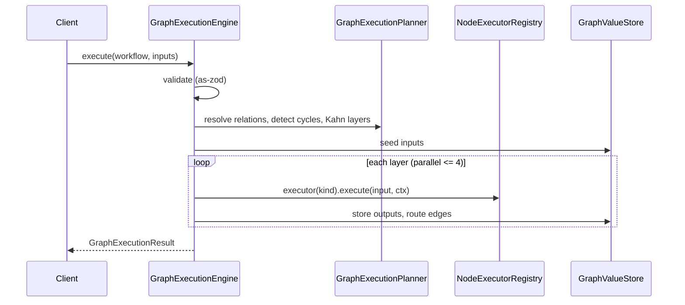

# 05 — Graph Subsystem Design

**Source specifications:** [DECAF-24](../specifications/DECAF_24.md), [DECAF-32](../specifications/DECAF_32.md), [DECAF-34](../specifications/DECAF_34.md), [DECAF-35](../specifications/DECAF_35.md), [DECAF-36](../specifications/DECAF_36.md), [DECAF-48](../specifications/DECAF_48.md).

## 1. Overview

A declarative graph contract (`@node`/`@port`/`@graph`) drives an Angular canvas editor, a reference execution engine, a NestJS backend, live run feedback, and a downstream compiler. The subsystem is split across six specs along metadata/engine/catalogue/canvas/feedback axes with a strict frontend/backend boundary.

## 2. Goals

- G1 — Declarative, framework-neutral graph metadata as the canonical contract (DECAF-24).
- G2 — Native reference execution engine with planning, executor registry, value store, pinning, structured loops, validation, events (DECAF-32) — not a distributed orchestrator.
- G3 — Strict frontend/backend boundary so the browser bundle never pulls the engine (DECAF-35).
- G4 — Canvas save/auto-save and undo/redo with adapter-agnostic backend services (DECAF-36).
- G5 — Engine-agnostic live run feedback (logs, glow, I/O inspection) over SSE (DECAF-48).

## 3. Requirements

- **Req-1 (DECAF-24):** `ui-decorators/src/graph` is canonical: `@node(...)` (composes `@uimodel`), `@port(...)` (direction, handle visibility, connection rules), `@graph(...)` (workflow root). Readers produce `GraphNodeDefinition`/`GraphPortDefinition`/`GraphWorkflowDefinition`. `for-angular/src/graph` maps to `ngDiagram` (optional). Workflow snapshot round-trip (`graphWorkflowSnapshotToJSON`/`FromJSON`).
- **Req-2 (DECAF-32):** `GraphExecutionEngine` (implements `Observable`) validates → plans (`GraphExecutionPlanner`, Kahn topological sort, cycles rejected) → seeds inputs into `GraphValueStore` → executes layers in parallel (cap `GRAPH_DEFAULT_CONCURRENCY=4`) → routes values (`EDGE_VALUE_ROUTED`) → returns `GraphExecutionResult`. `GraphNodeExecutor.execute(input, context)`; `GraphNodeExecutorRegistry`/`Resolver` (kind→executor). Pinning (`@pinnable()`, `GraphPinningService`, fingerprint match → `NODE_CACHE_HIT`, all-or-nothing v1). Loops (`foreach`/`while`/`until`, `GraphConditionEvaluator`, bodies acyclic, `parentRunId`/`path`). Validation (`as-zod`). Events (`GraphExecutionEventType`/`GraphExecutionStatus`). NestJS `GraphExecutionModule` with `POST /graph/execute`, `GET /graph/events` (SSE), `GET /graph/results/:runId`.
- **Req-3 (DECAF-34):** Node catalogue (documentation) consolidating 21 node types: 6 triggers, flow-control (`if`/`switch`/`parallel`/`merge`/`map`/`delay`/`errorBoundary`/`humanApproval`/`return`/`code`), loops, `core.flow.break` (Decaf addition), `core.agent`. For-Each redesign: self-connected loop-closure port (`allowSelf:true`), `items`/`slice` inputs, `item` output via ghost node, `completed` output; `BreakFlowNode` throws `GraphBreakSignal` → `LOOP_COMPLETED` with `broken:true`.
- **Req-4 (DECAF-35):** Split `integrations/graph` into `./shared` (frontend-safe: node classes, shared enums/types, `Metadata.nodes()`/`Metadata.workflows()`) and `./graph` (engine). `@node`/`@graph` gain `registerNode`/`registerWorkflow` side-effects (signatures unchanged). Enforcement via `exports` map + ESLint `no-restricted-imports` in `for-angular`. `@pinnable` moves to `engine/decorators.ts` (backend-only).
- **Req-5 (DECAF-36):** `GraphHistoryService` (in-memory ring buffer, default 10, no cross-reload persistence), `GraphAutoSaveService` (debounced, default 500ms), `GraphSaveService` (`PUT /graph/workflow/:id`), `GraphMutationDetectorService`, `GraphKeyboardShortcutsService`. Auto-Save ON ⇒ Undo/Redo disabled (default); Save stays enabled. Backend adapter-agnostic `@service(Model)` services; user propagated via `DecafRequestContext` (`@createdBy` reads `UUID`). Reuse `buildGraphRendererSnapshot()` from DECAF-32 §20.4.
- **Req-6 (DECAF-48):** `core.utility.log` node + executor (catalogue amendment). Log attributes via DECAF-9 `LogParameterRegistry`/`logger.for({nodeId,workflowId,runId,user})`. SSE subscription mode (DECAF-42) keyed by `{runId, ownerUser}` on `graph.run.log`/`graph.run.state`. New events `NODE_STATE_CHANGED`/`EDGE_STATE_CHANGED`; execution-state enum in `shared` (`IDLE|RUNNING|BLOCKED|SUCCEEDED|FAILED|SKIPPED|DISABLED`). Double-click already-ran → I/O split view (JSON/table/raw); not-ran → edit modal (DECAF-32 §20). Engine-agnostic contract.

## 4. Architecture & Design

See [Architecture Workbook §06](../architecture-workbook/06-graph.md). Key decisions:

- **Reference interpreter, not distributed orchestrator** — downstream compilers (Mastra/ALFRED) reuse definitions but stay separate; DECAF-32 §22 maps the split.
- **Strict boundary enforced by build tooling** (`exports` + ESLint), not convention (DECAF-35).
- **Snapshot contract is shared** (DECAF-32 §20.4; reused unchanged by DECAF-36/48).
- **Run feedback is engine-agnostic** — a future Mastra/NestJS driver must satisfy the same event/attribute contract.

### Graph execute/plan/loop flow

## 5. Public Interfaces (selected)

- `@node(...)` / `@port(...)` / `@graph(...)` / `@pinnable()` / `@connection({category})`.
- `GraphNodeDefinition` / `GraphPortDefinition` / `GraphWorkflowDefinition`.
- `engine.observe({refresh(event)})` / `engine.execute(workflow, inputs)` / `engine.pinNode(options)` / `engine.unpinNode(options)`.
- `GraphNodeExecutorRegistry.register(kind, executor)`.
- `GraphExecutionEventType` / `GraphExecutionStatus`.
- `Metadata.nodes(): Constructor[]` / `Metadata.workflows(): Constructor[]` / `graphNodes()` / `graphWorkflows()` / `resetGraphRegistries()`.
- Endpoints: `POST /graph/execute`, `GET /graph/events`, `GET /graph/results/:runId`, `PUT /graph/workflow/:id`.
- `GraphHistoryService.push/undo/redo` / `GraphAutoSaveService.onMutation/flush` / `GraphSaveService.save`.
- Subpaths: `@decaf-ts/integrations/graph/shared`, `@decaf-ts/integrations/graph`.

## 6. Open Questions / Risks

- `@pinnable()` long-term home (`ui-decorators/graph` vs `engine/decorators.ts`) — unresolved (B13).
- Colour semantics: DECAF-32 §21.9 (running=amber) vs DECAF-48 brief (running=green) — CTO reconciliation needed (B14).
- Execution-state enum: `BLOCKED`/`IDLE`/`DISABLED` extend or redefine DECAF-32's enum (B15).
- Double-click semantics overlap DECAF-32 edit modal (B16).
- Loop node declarations live in the for-angular demo layer; both DECAF-34/35 recommend promoting to `shared/nodes/` (B17).
- TASK-232 open: in-browser demo executors — Option A (NestJS SSE) vs Option B (dev-only quarantine).
- Parallel foreach with shared state unsafe in v1 (serial default).
- Fingerprint stability across serializer versions; hashing utility (Node `crypto` vs Decaf util, browser fallback).

Continue to [06 — Fabric Integration Design](./06-fabric-design.md).
