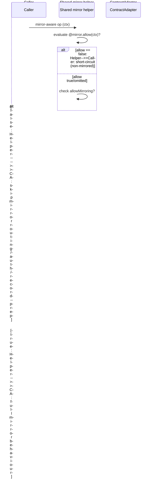

# 06 — Fabric Integration Design

**Source specifications:** [DECAF-2](../specifications/DECAF_2.md), [DECAF-5](../specifications/DECAF_5.md), [DECAF-21](../specifications/DECAF_21.md), [DECAF-37](../specifications/DECAF_37.md), [DECAF-47](../specifications/DECAF_47.md); sequence propagation from [DECAF-11](../specifications/DECAF_11.md).

## 1. Overview

`for-fabric` adapts the decaf-ts persistence contract to Hyperledger Fabric world-state. The `FabricClientAdapter`/`FabricClientRepository` pair is the integration spine; `ContractAdapter` handles the chaincode side. The subsystem covers peer selection, model instantiation from chaincode, a two-tier mirror-suppression model, and (deferred) channel management.

## 2. Goals

- G1 — Deterministic legacy peer selection as networks grow.
- G2 — Faithful model instantiation from chaincode responses.
- G3 — Two-tier mirror suppression (global flag + per-decorator predicate) preserving `@mirror()` metadata.
- G4 — Property-scoped sequences propagated through Fabric honouring private/shared/mirror routing.
- G5 — (Deferred) reusable granular channel membership service.

## 3. Requirements

- **Req-1 (DECAF-2):** `legacyMspCount` flag (default 1) randomly chooses up to N peers per MSP; dedup by endpoint+alias; primary appended last; throw if an MSP has no mapped peers. Helpers `resolveLegacyPeerCount`, `pickLegacyCandidates`, `buildLegacyPeerConfigs`, `normalizeLegacyPeers`.
- **Req-2 (DECAF-5):** Query methods return instantiated model objects when `CouchDBKeys.TABLE === Model.tableName(this.class)`; paginated results wrap `data` items; aggregations return raw primitives unchanged.
- **Req-3 (DECAF-37):** `allowMirroring: boolean` global flag; when false, mirror helpers return immediately, `ContractAdapter` skips mirror routing/auth/record-prep, `FabricClientAdapter`/`FabricClientRepository` skip legacy promotion. `FabricClientContext` whitelists `allowMirroring` for request-scoped forwarding. `allowGatewayOverride` stays independent.
- **Req-4 (DECAF-47):** `@mirror({ collection?, msp?, allow?(context): boolean })`; predicate evaluated before any other mirror work (including before `allowMirroring`); false ⇒ short-circuit; true/omitted ⇒ existing behaviour subject to global flag. Predicate is synchronous.
- **Req-5 (DECAF-11):** `@sequence` propagated to Fabric with world-state routing (shared/private/mirror) applied to sequence-backed properties; unit coverage with explicit private/shared/mirror checks.
- **Req-6 (DECAF-21):** (Deferred/Rejected) `ChannelManager extends Service` with granular `addPeer`/`removePeer`/`addOrganization`/`removeOrganization`, independent of infra-only services.

## 4. Architecture & Design

See [Architecture Workbook §07](../architecture-workbook/07-fabric.md). Key decisions:

- **Mirror metadata is always preserved; only behavioural effects are gated** — both tiers are suppression switches, not metadata removal.
- **Bypass order is "predicate first"** (per-decorator `allow` before global `allowMirroring`).
- **`allowGatewayOverride` is independent of `allowMirroring`** — separate gates for legacy gateway submission opt-in vs mirroring.

### Mirror bypass ordering

## 5. Public Interfaces (selected)

- `PeerConfig.legacyMspCount?` / `PeerConfig.mspMap?`; `resolveLegacyPeerCount(config)`; `pickLegacyCandidates(...)`; `buildLegacyPeerConfigs(...)`; `normalizeLegacyPeers(...)`.
- `FabricClientRepository.statement(...)` → `M[] | M | SerializedPage<M> | primitives`.
- `allowMirroring: boolean` (in `FabricClientFlags`/shared types); `FabricClientContext` override whitelist.
- `@mirror({ collection?, msp?, allow?(context): boolean })`.
- `CrudContract.migrate` (Fabric paired migrations, DECAF-14).

## 6. Open Questions / Risks

- Two parallel mirror-suppression mechanisms create ordering/ownership ambiguity; only "predicate first" is fixed (B18).
- Legacy promotion gate ownership: DECAF-2 ties it to mirror/`allowGatewayOverride`; DECAF-37 keeps `allowGatewayOverride` independent of `allowMirroring` (B19).
- `allow(context)` is synchronous — async guard would need a broader contract change.
- DECAF-21 (ChannelManager) is Rejected/deferred — channel management remains a gap.
- Randomness in deterministic CI (RNG injection/seeding for peer selection).

Continue to [07 — Cross-Cutting Platform Services Design](./07-platform-services-design.md).
