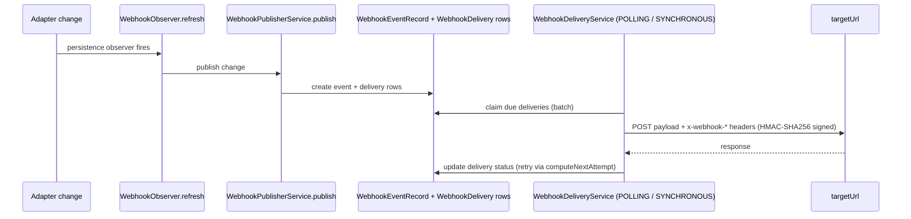
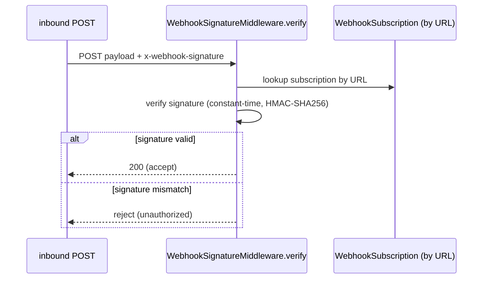
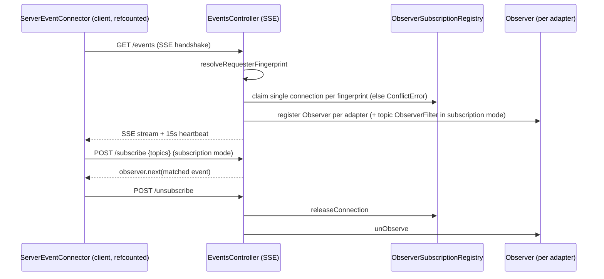

# 06 — HTTP & NestJS Design

The architecture is detailed in the [Architecture Handbook](../architecture-handbook/05-http-backend.md).

> Grounded in research brief `workdocs/ai/project/technical-docs/_research-briefs/06-http-nest.md` (read-only review; no tests/builds run; no source modified). Where the brief is thin, it says so explicitly rather than fabricating.

## 1. Scope

This specification covers the HTTP/NestJS backend layer of decaf-ts across two packages:

- **`for-http` (`@decaf-ts/for-http`)** — HTTP/REST integration layer: transport-agnostic REST adapters (client + server), Axios transport, server controller generation from models, auth handlers, webhook/hooks engine, request→context transformers, and SSE event bridging.
- **`for-nest` (`@decaf-ts/for-nest`)** — NestJS binding of `for-http`'s server abstractions: DecafModel controller factory, module wiring, request pipeline, auth module, SSE events module, webhooks module, OpenAPI tooling, exception filter, fluent bootstrap, and CLI.

`for-nest` is essentially the Nest-binding of `for-http`'s server abstractions; the split is intentional so server primitives stay reusable by future adapters (e.g. `for-express`).

## 2. Design Principles

**Transport-agnostic REST adapter.** *Why:* decouples REST semantics (CRUD/bulk, URL building, error parsing, SSE-aware `observe`) from any particular HTTP client, so the same repository/service contracts are reused across client SDKs and transports can be swapped (Axios today, fetch/node-fetch tomorrow) without forking the persistence model. *Enforcing test/spec:* `HttpAdapter` declares only `request`/`toRequest` abstract; CRUD + bulk are implemented on `HttpAdapter` and exercised by `tests/integration/http.adapter.integration.test.ts` and `rest.service*.integration.test.ts`.

**Prepared-statement-only queries over HTTP.** *Why:* HTTP is stateless — there is no SQL dialect to compile ad-hoc conditions against, so only the prepared-statement contract (a serialized query payload) is meaningful over the wire. *Enforcing test/spec:* `HttpStatement.build()`/`parseCondition()` throw `UnsupportedError`; `RestRepository.statement()` builds a `PreparedStatement` routed through `adapter.toRequest`; `allowRawStatements:false` on `RestRepository`; covered by `tests/unit/rest.test.ts` and `tests/integration/http-query.test.ts`.

**Server controllers generated from models.** *Why:* declarative CRUD/bulk/statement/listBy/paginate/grouping/complex-query routes are derived from model + persistence metadata, eliminating boilerplate and guaranteeing route surface parity across platforms. Route generation is gated by `isOperationBlocked`. *Enforcing test/spec:* `ModelControllerFactory.create(ModelConstr, persistence, config?)` is covered by `tests/unit/model-controller-factory.test.ts` and `tests/unit/server-model-controller-builder.test.ts`; for-nest parity by `tests/unit/model-controller-builder-parity.test.ts` and the e2e `decaf-model-controller-builder.e2e.test.ts`.

**Request→context normalization via per-flavour transformers.** *Why:* platform requests carry transport-specific shape (headers, IP, body) that must be normalized into a decaf `Context` before persistence runs; per-flavour registration (`requestToContextTransformer(flavour)`) keeps the mapping open for extension without touching the pipeline. *Enforcing test/spec:* `RamTransformer` registered for `"ram"`; covered by `tests/unit/server-ram-transformer.test.ts` and `tests/unit/request-contextualize.test.ts` (for-nest).

**SSE as the server-push channel for observer events.** *Why:* gives core's `Observer`/`Dispatch` machinery a server-push transport so client repositories/services stay reactive without each owning a socket; fingerprint-claiming prevents runaway connections and subscription mode enables per-subscriber topic filtering. *Enforcing test/spec:* `HttpDispatcher` start-listening test; `ServerEventConnector` (no dedicated test — see brief gaps); for-nest e2e `listen-server-events`, `listen-service-events(-multi-adapter)`, `events-subscriptions`, `sse-concurrency-regression`.

**Webhook observer + delivery engine separation.** *Why:* decouples "something changed" (observer) from "deliver it" (delivery engine with batching, retry via `computeNextAttempt`, replay, graceful shutdown), and signs payloads HMAC-SHA256 so receivers can verify authenticity; decaf can also *receive* webhooks safely via constant-time signature verification. *Enforcing test/spec:* `tests/integration/webhook-engine.test.ts`, `webhook-index.test.ts`, `webhook-signature-middleware.test.ts`.

**NestJS module composition via a single `forRootAsync`.** *Why:* a single import composes persistence, controllers, events, and DI registration so a Nest app boots decaf with one import; `DecafCoreModule` is `@Global()` to provide the request-context pipeline and global interceptor once. *Enforcing test/spec:* `tests/e2e/NestBootstraper.e2e.test.ts`, `DecafModelModule(-byAdapter)`/`(-openApi)`, `controller-persistence-binding.test.ts`.

## 3. REST Adapter Design

### 3.1 Client REST adapter

`HttpAdapter extends Adapter<CONF, CON, REQ, Q, C>` (per brief: actual generics `<CONF extends HttpConfig, CON, REQ, Q extends PreparedStatement, C extends Context<HttpFlags>>`). It implements CRUD + bulk (`createAll`/`readAll`/`updateAll`/`deleteAll` using `/bulk` segments), URL building (`writeUrl`, honors `idInUrl`, splits composed PKs via `extractIdArgs`), error parsing (`parseError` maps status codes to typed errors: 404→`NotFoundError`, 409→`ConflictError`, 400→`BadRequestError`, 422→`ValidationError`, plus `QueryError`/`PagingError`/`UnsupportedError`/`AuthorizationError`/`ForbiddenError`/`ConnectionError`/`SerializationError`, fallback `InternalError`), and SSE-aware `observe`/`unObserve`. Only `request`/`toRequest` are abstract. `HttpAdapter.repository()` returns `RestService` as the default repository.

`RestRepository extends Repository<M,A,Q>` provides statement-based find/page/listBy/findBy/findOneBy + aggregations (`countOf/maxOf/minOf/avgOf/sumOf/distinctOf/groupOf`), with `allowRawStatements:false`. `RestService extends RestRepository` adds `ignoreValidation:true`/`ignoreHandlers:true` overrides (server-side validation/decoration skipped by default).

`HttpConfig`: required `protocol`/`host`; optional `parsers`, `eventsListenerPath`, `headers`, `events`, `eventsSubscription`, `eventHeaderResolver`, `idInUrl` (default `true`). Constructor defaults `headers` and `events` to `true` when undefined.

### 3.2 Axios transport

`AxiosHttpAdapter` is the concrete adapter (`AxiosFlavour = "axios"`). `getClient()` returns `new Axios({ baseURL: `${protocol}://${host}` })` — uses the `Axios` class, not the shared default instance. `toRequest` has overloads; `request` merges context headers into the `AxiosRequestConfig` and calls `this.client.request(...)`. `parseResponse` normalizes the body (`res.body`/`res.data`/raw, JSON-string parsing), throws on `status>=400` via `parseError`, and for prepared statements hydrates models/pages. `TaskResponseParser` parses the `x-pending-task` header.

### 3.3 Server controllers

`ModelControllerFactory.create(Model, persistence, config)` chains `ModelControllerBuilder` route-adders; each route's `implementation` calls `resolvePersistenceTarget(...)` then `invokeDirectPersistenceMethod(...)`, using `this.ctx` from the platform `DecafModelController`/`RequestContext`. `DecafModelController.persistence(ctx)` resolves `ModelService`/`Repository.forModel` and applies ctx overrides. Route generation is gated by `isOperationBlocked(ModelConstr, kind, value)`. Builders: `ServerControllerBuilder`/`ServerMethodBuilder` (pure framework-agnostic; `ServerRoute` carries a handler slot via `withImplementation()`), `ModelControllerBuilder` (CRUD/bulk/statement/listBy/paginate/grouping/complex-query routes). Decorators: `route`/`get`/`post`/`put`/`patch`/`del`.

### 3.4 Request pipeline (for-nest)

```mermaid
sequenceDiagram
    participant Req as HTTP request
    participant MW as AuthMiddleware
    participant AuthInt as AuthInterceptor
    participant ReqInt as DecafRequestHandlerInterceptor
    participant Exec as DecafHandlerExecutor
    participant Route as route handler (matchRoute)
    participant Ctrl as DecafModelController.persistence(ctx)
    participant Persist as Adapter (Ram/Nano/TypeORM/Fabric)
    participant Resp as DecafResponseInterceptor
    Req->>MW: contextualize request context + authHandler.prime (best-effort)
    MW->>AuthInt: (skips on @Public())
    AuthInt->>AuthInt: authHandler.authorize(...) + applyTransformers()
    AuthInt->>ReqInt: pass through
    ReqInt->>ReqInt: contextualize(req) (once, guarded by __decafRequestContextContextualized)
    ReqInt->>Exec: executor.exec(req, res) runs DecafRequestHandler[]
    Exec->>Route: bound route.implementation (standard CRUD) or createComplexQueryHandler (@query)
    Note over Route: param decorators supply DecafBody (new ModelConstr(body)), DecafParams/OrderedParams, DecafQuery
    Route->>Ctrl: resolvePersistenceTarget(...) then invokeDirectPersistenceMethod(...)
    Ctrl->>Persist: ModelService / Repository.forModel (+ ctx.toOverrides())
    Persist-->>Ctrl: result
    Ctrl-->>Resp: response
    Resp->>Resp: ctx.toResponse(response) (monkey-patched; adds x-pending-task when pending)
    Note over Resp: on error → DecafExceptionFilter maps HttpException→BaseError and logs
```

## 4. Auth Handler Design

`AuthHandler` (for-http base) is abstract with `extractFromRequest(request: AuthRequestLike)`, `requestFromContext(ctx)`, `isPublicRequest(request)`, `authorize(...)`, and role/namespace checks. `AUTH_NAMESPACE_KEY` is the namespacing key. Auth types: `AuthRequestLike`, `UserData`, `AuthData`.

for-nest provides `DecafAuthHandler` (Bearer-as-role) and `DecafRoleAuthHandler` alias, overriding the for-http abstracts. `AuthInterceptor` is request-scoped: it reads reflector metadata, skips on `@Public()`, calls `authHandler.authorize(...)`, then `applyTransformers()` (iterating `Adapter.flavoursToTransform()` accumulating `transformer.from(requestContext)`). `AuthMiddleware` is request-scoped: it contextualizes the request context and best-effort calls `authHandler.prime`. `DecafAuthModule.forRoot` registers the interceptor/middleware and (when `global:true`) a global `APP_INTERCEPTOR`. Decorators: `Auth`/`Public`/`RequireRoles`/`RequireNamespaces`. Tokens: `AUTH_HANDLER`, `AUTH_META_KEY`, `IS_PUBLIC_KEY`, `REQUIRED_ROLES_KEY`, `REQUIRED_NAMESPACES_KEY`, `SKIP_MODEL_ROLES_KEY`, `SKIP_MODEL_NAMESPACES_KEY`.

Auth default: when `AuthConfig` is omitted on a model, `@Auth(Model)` is applied by default (auth + model-level role checks required). Logger binding occurs inside the for-http base `AuthHandler.authorize` (not in `AuthInterceptor`).

## 5. Webhook / Hooks Design

The webhook engine lives in `for-http/server/hooks/` and is bound to Nest by `for-nest/webhooks/`.

**Subscription / publisher / delivery services.** `WebhookSubscriptionService` manages `WebhookSubscription` rows. `WebhookPublisherService` (`PublishDto`) creates `WebhookEventRecord` + `WebhookDelivery` rows when an observed change fires. `WebhookDeliveryService` supports two modes (`POLLING`/`SYNCHRONOUS`), batch claiming, replay, and graceful shutdown; it POSTs payloads to `targetUrl` with `x-webhook-*` headers signed HMAC-SHA256 and updates delivery status (retry via `computeNextAttempt`).

**Observer.** `WebhookObserver implements PersistenceObserver`; `eventToTopic`, `getWebhookFilter` (requires the `observeFullResult` context flag), `matchesTopic`, `keyToTopic`.

**Signature middleware.** `WebhookSignatureMiddleware.verify` looks up the subscription by URL and verifies the signature (constant-time). Utils: `signWebhookPayload`, `verifyWebhookSignature`, `computeNextAttempt`, `collectPagedResults`. The `@hook` decorator registers topics under `HookKey`.

**Defaults:** `maxAttempts` 12; `pollIntervalMs` 5000; `batchSize` 50; `gracefulShutdownMsTimeout` 30000.

**Dead code note:** `WebhookWorkerService` is almost entirely commented out; only the `WebhookWorkerConfig` type is exported (and re-exported from the hooks barrel).

**for-nest binding.** `DecafWebhookModule` (`forRoot`/`forRootAsync`; alias `DecafWebhooksModule`; `./webhooks` subpath only — webhooks are commented out of the main barrel) boots its own `PersistenceService` (separate from `DecafModule`), mutates `Adapter._cache` with webhook keys, registers transformers, and builds `FromModelController` CRUD for the three webhook models plus action controllers (`WebhookSubscriptionActionsController` deactivate/reactivate, `WebhookEventActionsController` replay), mounted under `webhookApiPath` (default `/webhooks`). `runWebhooksMigrations` is an empty stub.

### Webhook delivery flow



### Inbound webhook verification flow



## 6. SSE Event Design

**Client side (for-http).** `HttpDispatcher extends Dispatch` opens a `ServerEventConnector` (refcounted `EventSourcePlus` connection with heartbeat), forwards SSE events to local observers, and syncs topic subscriptions via `subscribe`/`unsubscribe` POSTs when `observe`/`unObserve` fire. `HttpDispatcher.initialize()`→`startListening()` requires `eventsListenerPath` (else throws `InternalError`); `events:false` disables SSE; `eventsSubscription` gates subscription mode; `close()` unsubscribes + closes the connector. Event types: `ServerEventType`, `ServerEvent`, `SingleServerEvent`, `BulkServerEvent`, `EventHandlers`. `DecafHeaders.CORRELATION_ID` = `x-correlation-id`.

**Server side (for-nest).** `DecafStreamModule.forFlavours(flavours, path, options)` registers `EventsController` (+ `EventsSubscriptionController` in subscription mode) under a `RouterModule` prefix (`observerApiPath` default `/events`). `EventsController.listen()` (`@Sse()`) resolves a requester fingerprint (`resolveRequesterFingerprint`), claims a single connection per fingerprint via `ObserverSubscriptionRegistry` (else `ConflictError`), registers an `Observer` per adapter (with a topic `ObserverFilter` in subscription mode), merges a 15s heartbeat, and tears down `unObserve`+`releaseConnection`. `listenForModel(model)` (`@Sse("/:model")`) scopes events to a model. `EventsSubscriptionController` exposes `POST subscribe`/`unsubscribe`. Tokens: `LISTENING_ADAPTERS_FLAVOURS`, `OBSERVER_EVENTS_OPTIONS`. `ObserverEventsOptions` includes `enableObserverEvents`/`observerFlavours`/`observerApiPath`/`subscriptionMode`.

### SSE subscription lifecycle



## 7. Functional Requirements

- **FR-1** — `HttpAdapter` shall implement CRUD + bulk over a transport, with only `request`/`toRequest` abstract.
- **FR-2** — `parseError` shall map HTTP status codes to typed decaf errors (404→`NotFoundError`, 409→`ConflictError`, 400→`BadRequestError`, 422→`ValidationError`, … fallback `InternalError`).
- **FR-3** — `RestRepository`/`RestService` shall support prepared statements only; `HttpStatement.build()`/`parseCondition()` shall throw `UnsupportedError`.
- **FR-4** — `ModelControllerFactory.create` shall generate CRUD/bulk/statement/listBy/paginate/grouping/complex-query routes from a model, gated by `isOperationBlocked`.
- **FR-5** — `RequestContext` shall derive the request IP from `x-forwarded-for`/`x-real-ip` and bind a request-IP-enriched logger.
- **FR-6** — `AuthHandler.authorize` shall bind a context logger and run role/namespace checks; `AuthInterceptor` shall skip on `@Public()` and call `applyTransformers()` after `authorize`.
- **FR-7** — `WebhookDeliveryService` shall sign outbound payloads HMAC-SHA256 and retry via `computeNextAttempt`; `WebhookSignatureMiddleware` shall verify inbound signatures constant-time.
- **FR-8** — `HttpDispatcher.startListening` shall throw `InternalError` when `eventsListenerPath` is absent; `events:false` shall disable SSE; `eventsSubscription` shall gate subscription mode.
- **FR-9** — `DecafStreamModule` shall claim a single SSE connection per requester fingerprint (else `ConflictError`) and merge a 15s heartbeat.
- **FR-10** — `DecafModule.forRootAsync` shall boot persistence, register transformers, register the global `DecafRequestHandlerInterceptor`, and (when `autoControllers`) build per-flavour controller modules.

## 8. Acceptance Criteria

- **Successful CRUD** — *Given* a model exposed via `@expose("ram")` and a booted `DecafModule.forRootAsync({ conf: [[RamAdapter, {}, new RamTransformer()]], autoControllers: true })`, *when* a client POSTs a valid body to the generated CRUD route, *then* the route handler invokes `persistence` against the `RamAdapter` and the response is the created model with the correct `Content-Type`.
- **Auth failure** — *Given* a model with `@Auth(Model)` (the default when `AuthConfig` is omitted) and a request without valid credentials, *when* the request reaches `AuthInterceptor`, *then* `authHandler.authorize(...)` throws an authorization error and `DecafExceptionFilter` maps it to an HTTP error response; `@Public()` routes bypass `authorize`.
- **Webhook signature mismatch** — *Given* a `WebhookSubscription` for a `targetUrl` and an inbound POST with an `x-webhook-signature` that does not match the HMAC-SHA256 of the payload, *when* `WebhookSignatureMiddleware.verify` runs, *then* the request is rejected (constant-time comparison) and no delivery is accepted.
- **Event subscription lifecycle** — *Given* `DecafStreamModule` in subscription mode and a client `ServerEventConnector`, *when* the client calls `GET /events` and `POST /subscribe {topics}`, *then* the server claims one connection per fingerprint, registers an `Observer` per adapter with a topic `ObserverFilter`, forwards only matched events to `observer.next`, and on `POST /unsubscribe`/disconnect releases the connection and `unObserve`s; a second concurrent connection with the same fingerprint receives `ConflictError`.

## 9. Environment Variables

Read from `process.env` in `src/` (per brief):

| Variable | Reader | Default | Purpose |
|:---------|:-------|:--------|:--------|
| `PORT` | `NestBootstraper.start` | `3000` | HTTP listen port |
| `MANUAL_INSPECT` | `test:manual` runner | — | Gates manual Swagger inspection in the controller-builder e2e |
| `MANUAL_INSPECT_TIMEOUT` | `test:manual` runner | — | Manual inspection timeout |

Additional env reads (not `process.env`): `DecafExceptionFilter` reads `LoggedEnvironment.env === "production"` (via decaf logging env); CLI migrate reads `package.json` `decaf.migration` config. **`for-http` reads no `process.env` anywhere in `src/`.**

## 10. Secrets

Per brief, no literal secrets are referenced. Secret-relevant artifacts (never literal values):

- **Webhook signing secret** — used by `signWebhookPayload` / `verifyWebhookSignature` (HMAC-SHA256) for outbound and inbound webhook signatures. Stored on `WebhookSubscription`.
- **Auth bearer material** — handled by `DecafAuthHandler` (Bearer-as-role) and the for-http `AuthHandler.authorize` flow; the brief does not document a specific secret store.

The brief documents no other secrets (e.g. no API-key/credential reading in `src/`). If a deployment injects additional secrets, they are outside this layer's documented surface.

## 11. Usage Examples (real, from brief)

```ts
// tests/app.ts:18-32 (abridged) — minimal Nest bootstrap (auto controllers + Swagger)
const app = await NestFactory.create(
  DecafModule.forRootAsync({
    conf: [[RamAdapter, {}, new RamTransformer()]],
    autoControllers: true,
    autoServices: false,
  })
);
const documentFactory = () => SwaggerModule.createDocument(app, config);
SwaggerModule.setup("api", app, documentFactory);
app.useGlobalFilters(new DecafExceptionFilter(app.get(ModuleRef, { strict: false })));
await app.init();
```

```ts
// tests/e2e/NestBootstraper.e2e.test.ts:27-41 (abridged) — fluent bootstrap
const nest = await NestBootstraper.initialize(app)
  .enableLogger().enableCors("*").useHelmet()
  .setupSwagger({ title: "Test API", description: "Test Swagger setup", version: "1.0.0",
                  path: "api", openApiJsonPath: "api-json", openApiYamlPath: "/api-yaml" })
  .useGlobalFilters();
nest.start(3000, "0.0.0.0");
```

```ts
// tests/integration/axios.adapter.integration.test.ts:9-30 (abridged) — AxiosHttpAdapter with a mocked client
class TestAxiosAdapter extends AxiosHttpAdapter {
  private impl: any;
  constructor(config: HttpConfig, impl: any, alias?: string) {
    super(config, alias);
    this.impl = impl;
  }
  protected override getClient(): any { return this.impl; }
}
const config: HttpConfig = { protocol: "https", host: "example.com" };
const adapter = new TestAxiosAdapter(
  config,
  { request: async (d: any) => ({ ok: true, d }) },
  `axios-${Math.random()}`
);
const ctx = new Context().accumulate({ logger: Logging.get() });
const res = await adapter.request<any>({ url: "https://example.com" } as any, ctx);
expect(res.ok).toBe(true);
```

## 12. Inaccuracies (from brief, not fixed)

Recorded exactly as the brief lists them. Nothing was fixed. (Full list with evidence is in the [Architecture Handbook](../architecture-handbook/05-http-backend.md#4-inaccuracies-from-brief-not-fixed).)

### for-http (20)

1. **[for-http] HttpAdapter generic signature wrong in docs** — README/Description list `HttpAdapter<Y, CON, Q, F, C>`. Actual is `<CONF extends HttpConfig, CON, REQ, Q extends PreparedStatement, C extends Context<HttpFlags>>` (`adapter.ts:116-122`); docs omit `REQ`, mislabel `Q`, and invent a standalone `F`. | Evidence: `README.md:48`; `workdocs/4-Description.md:14`; `src/adapter.ts:116-122` | Suggested fix: document generics as `<CONF, CON, REQ, Q, C>`, drop `F`.
2. **[for-http] RestService/RestRepository generic signature wrong in docs** — README lists `RestService<M, Q, A, F, C>` / `RestRepository<M, Q, A, F, C>`. Actual is `<M, A, Q>` only. | Evidence: `README.md:55,59`; `src/RestService.ts:54-58`; `src/RestRepository.ts:51-55` | Suggested fix: update to `<M, A, Q>`.
3. **[for-http] "Declares abstract request(), create(), read(), update(), delete()" is false** — only `request`/`toRequest` are abstract; CRUD + bulk are implemented in `HttpAdapter`. | Evidence: `README.md:52`; `src/adapter.ts:403-417,579-770` | Suggested fix: state only `request`/`toRequest` are abstract; CRUD is implemented/overridable.
4. **[for-http] "parseError() currently returns the error unchanged" is false** — `parseError` maps messages to typed errors (404→`NotFoundError`, 409→`ConflictError`, 400→`BadRequestError`, 422→`ValidationError`, plus `QueryError`/`PagingError`/`UnsupportedError`/`AuthorizationError`/`ForbiddenError`/`ConnectionError`/`SerializationError`, fallback `InternalError`). | Evidence: `README.md:79`; `src/adapter.ts:853-886` | Suggested fix: describe the actual mapping.
5. **[for-http] HttpFlags base class wrong in docs** — docs say "Extends RepositoryFlags". Actual `HttpFlags extends AdapterFlags`. | Evidence: `README.md:47`; `src/types.ts:86` | Suggested fix: replace `RepositoryFlags` with `AdapterFlags`.
6. **[for-http] AuthHandler example uses non-existent method `extractFromAuth`** — the abstract method is `extractFromRequest(request: AuthRequestLike)`; the example also omits required abstracts `requestFromContext` and `isPublicRequest`, so it would not compile. | Evidence: `README.md:289`; `src/server/auth/AuthHandler.ts:45,57,115` | Suggested fix: rename to `extractFromRequest`, add the missing abstracts.
7. **[for-http] README subclassing example passes wrong generics/signatures** — declares `extends HttpAdapter<HttpConfig, MyClient, MyRequestConfig, MyFlags, MyContext>` (4th generic is `Q`, not flags) and overrides `create(table: string, …)` with `string` tables, but real signatures use `Constructor<M>`. | Evidence: `README.md:327`; `src/adapter.ts:116-122,579-701` | Suggested fix: use correct generics and `Constructor<M>` table param.
8. **[for-http] "RestService manages observers" overstates RestService** — `RestService` adds no observer logic; those are inherited from core `Repository`/`Adapter` + `HttpDispatcher`. | Evidence: `README.md:58`; `src/RestService.ts` | Suggested fix: clarify observers are inherited, not implemented by `RestService`.
9. **[for-http] "Bulk ops delegate to base Adapter (expected to exist)" is misleading** — bulk methods are concretely implemented on `HttpAdapter` (`createAll`/`readAll`/`updateAll`/`deleteAll`) using `/bulk` segments. | Evidence: `README.md:82`; `src/adapter.ts:595-758` | Suggested fix: state bulk ops are implemented on `HttpAdapter`.
10. **[for-http] `fastify` is a keyword but only a devDependency** — there is no runtime Fastify adapter; `fastify` appears only in devDependencies and test helpers. | Evidence: `package.json:103,122`; `tests/integration/FastifyAdapter.ts` | Suggested fix: remove `"fastify"` from keywords (or add a runtime adapter + dependency).
11. **[for-http] Duplicated "## Constants and Types (axios)" header** — same heading twice. | Evidence: `README.md:842-843` | Suggested fix: remove the duplicate line.
12. **[for-http] Unreplaced build placeholder in README** — `Minimal size: ##PACKAGE_SIZE## kb gzipped`. | Evidence: `README.md:32` | Suggested fix: substitute at build time or remove.
13. **[for-http] `package.json` `sideEffects` references non-existent `overrides` paths** — `./lib/{esm,cjs}/overrides/*` are listed but no `src/overrides/` exists and nothing builds there. | Evidence: `package.json:146-149`; no `src/overrides/` dir | Suggested fix: remove the four stale `overrides` `sideEffects` entries.
14. **[for-http] Stale coverage HTML references files that no longer exist in `src/`** — `workdocs/reports/coverage/lcov-report/` contains `src/ResponseParser.ts.html`, `src/context-utils.ts.html`, `src/server/overrides/Model.ts.html`, etc., none of which exist. | Evidence: `workdocs/reports/coverage/lcov-report/` HTML files | Suggested fix: regenerate coverage or remove stale HTML.
15. **[for-http] Stale release reports inconsistent with version 0.19.0** — `RELEASE_NOTES.md` "Last tag: v0.3.2", `CHANGELOG.md` "v0.3.2 → next", `DEPENDENCIES.md` "@decaf-ts/for-http@0.3.37", all contradict `package.json:3` (`0.19.0`). | Evidence: `workdocs/reports/RELEASE_NOTES.md:3`, `workdocs/reports/CHANGELOG.md:3`, `workdocs/reports/DEPENDENCIES.md:7` | Suggested fix: regenerate release reports at publish.
16. **[for-http] `WebhookWorkerService` is dead code but still re-exported** — the file is ~95% commented out (only `WebhookWorkerConfig` type exported) yet `src/server/hooks/index.ts:21` re-exports it. | Evidence: `src/server/hooks/WebhookWorkerService.ts`; `src/server/hooks/index.ts:21` | Suggested fix: finish the worker or remove the file + barrel export.
17. **[for-http] `HttpStatement` error-message typo** — "This method is only called is prepared statements are not used." should be "…if prepared statements are not used." | Evidence: `src/HttpStatement.ts:20,31` | Suggested fix: correct the typo.
18. **[for-http] `url()` query-param encoding claim is wrong** — README says spaces encoded as `%20`; implementation uses `URLSearchParams` which encodes spaces as `+`. | Evidence: `README.md:78`; `src/adapter.ts:386-398` | Suggested fix: drop the `%20` claim or switch to explicit `%20` encoding.
19. **[for-http] SSE/Dispatcher machinery is undocumented** — `HttpDispatcher`, `ServerEventConnector`, `DecafHeaders.CORRELATION_ID`, `eventsListenerPath`/`eventsSubscription`/`eventHeaderResolver`, and the `./event` module are not mentioned anywhere in README/workdocs. | Evidence: absence in `README.md` vs `src/HttpDispatcher.ts`, `src/event/*` | Suggested fix: add an SSE event-bridge section.
20. **[for-http] `./event` has no subpath export** — `src/index.ts:20` re-exports `./event` but `package.json` `exports` defines only `.`, `./axios`, `./server`, `./hooks`. | Evidence: `src/index.ts:20`; `package.json:6-51` | Suggested fix: add an `./event` subpath export or document that event symbols are reachable only via the root barrel.

### for-nest (14)

1. **[for-nest] README "Description" section is generic template boilerplate** — `## Typescript Template` / "This repository is meant to provide an enterprise template…", contradicting `package.json:4` "NestJS decaf integration". | Evidence: `README.md:2,4-5`; `workdocs/4-Description.md:3-5` | Suggested fix: replace with the actual module purpose.
2. **[for-nest] `DecafWebhookModule` documented as importable from the main barrel, but webhooks are commented out of `src/index.ts`** — README example `import { DecafWebhookModule } from "@decaf-ts/for-nest";`, but `src/index.ts:41` is `// export * from "./webhooks";` (the `./webhooks` subpath exists). | Evidence: `README.md:330`; `src/index.ts:41`; `package.json:29-39` | Suggested fix: change the import to `@decaf-ts/for-nest/webhooks`.
3. **[for-nest] `DecafCoreModule.migrate` is documented but does not exist in source** — README documents `DecafCoreModule.migrate(...)` in multiple places; `src/core-module.ts` defines only `forRoot`/`bootPersistence`/`onApplicationShutdown`. Migration actually lives in the CLI (`cli-module.ts` `migrateCommand` calling `MigrationService.migrateAdapters`). | Evidence: `README.md:357,360,392,407`; `src/core-module.ts:55,90,143` | Suggested fix: replace with the CLI `migrate` command / `MigrationService.migrateAdapters`, or implement the static.
4. **[for-nest] README claims the CLI migrate "creates a `RamAdapter` task engine (`decaf-cli-task-engine`)"** — `cli-module.ts` only does `Service.get(TaskModel)` and throws if none is registered; it creates no `RamAdapter`/`decaf-cli-task-engine`. | Evidence: `README.md:405`; `src/cli-module.ts:293-304` | Suggested fix: correct to state the CLI resolves an already-registered `TaskService` via `Service.get(TaskModel)`.
5. **[for-nest] README Auth Handler method `extractFromAuth(ctx: EC)` does not match the actual abstract method `extractFromRequest(request)`** — the for-http base defines `extractFromRequest` plus `requestFromContext(ctx)`; for-nest's `DecafAuthHandler` overrides those, not `extractFromAuth`. | Evidence: `README.md:255,266-271`; `for-http/src/server/auth/AuthHandler.ts:45,57`; `src/auth/DecafAuthHandler.ts:23-36` | Suggested fix: rename to `extractFromRequest(request)` and show `requestFromContext(ctx)`.
6. **[for-nest] README attributes logger enrichment to `AuthInterceptor`, but it does no logger enrichment** — `AuthInterceptor` only calls `authHandler.authorize(...)` and `applyTransformers()`; logger binding occurs inside the for-http base `AuthHandler.authorize`. | Evidence: `README.md:314-315`; `src/auth/AuthInterceptor.ts:38-98` | Suggested fix: move the logger-enrichment note to the auth-handler flow.
7. **[for-nest] README `ObserverEventsOptions` table omits `subscriptionMode`** — table lists only `enableObserverEvents`/`observerFlavours`/`observerApiPath`; `subscriptionMode?: boolean` exists and gates the subscription controller + per-subscriber filtering. | Evidence: `README.md:138-142`; `src/types.ts:26-28`; `src/events-module/DecafStreamModule.ts:52-54` | Suggested fix: add a `subscriptionMode` row.
8. **[for-nest] README "Minimal size" placeholder is unreplaced** — `Minimal size: ##PACKAGE_SIZE## kb gzipped`. | Evidence: `README.md:31` | Suggested fix: substitute at build time or remove.
9. **[for-nest] Stale coverage report references files that no longer exist in `src/`** — lcov HTML references `src/decaf-model/DecafModelControllerBuilder.ts`, `src/decaf-model/decorators/route.ts`, `src/decaf-model/query-routes.ts`, `src/events-module/events.controller.ts`, `src/hooks/*`, `src/migrations/*`, `src/ram/RamRequestTransformer.ts`, `src/nest-decorators.ts`, `src/nest-service.ts`, `src/overrides/Model.ts`, `src/request/RamRequestTransformer.ts`, etc. — none of which exist. | Evidence: `workdocs/reports/coverage/lcov-report/` HTML | Suggested fix: regenerate coverage to match the current source layout; delete stale HTML.
10. **[for-nest] E2E test file name references a class that no longer exists** — file is `decaf-model-controller-builder.e2e.test.ts` but the builder class is `FromModelController` (no `DecafModelControllerBuilder` symbol exists). | Evidence: `tests/e2e/decaf-model-controller-builder.e2e.test.ts` (filename); `src/decaf-model/FromModelController.ts:73` | Suggested fix: rename the test file (and update `package.json:69` `test:manual` path).
11. **[for-nest] `ToManyRequestsError` is not re-exported through `factory/errors`** — `src/factory/errors/index.ts` only re-exports `./cors`; `throttling.ts` defines `ToManyRequestsError` used internally by `DecafErrorFilter`. | Evidence: `src/factory/errors/index.ts:1`; `src/factory/errors/throttling.ts:3`; `src/factory/exceptions/DecafErrorFilter.ts:26` | Suggested fix: add `export * from "./throttling";` or document it as internal.
12. **[for-nest] README CLI invocation `npx decaf nest migrate` does not match this package's published bin** — this package's bin is `for-nest` (`package.json:42`) running the `nest` program; `decaf` is a separate package (`@decaf-ts/cli`). The `extract:api` script uses `node ./lib/bin/cli.cjs export-api`. | Evidence: `README.md:373,389,407`; `package.json:42,63` | Suggested fix: document `npx for-nest migrate …` / `for-nest export-api …`; clarify the relationship to the `decaf` CLI only if it proxies it.
13. **[for-nest] `runMigrations` / `runWebhooksMigrations` are exported empty stubs** — both are no-op functions yet appear in the public surface. | Evidence: `src/module.ts:61`; `src/webhooks/DecafWebhookModule.ts:149` | Suggested fix: implement (delegating to `MigrationService`) or remove to avoid misleading consumers.
14. **[for-nest] README "Auth Interceptor Flow" diagram omits `AuthMiddleware`** — README shows `Request → AuthInterceptor → DecafRequestHandlerInterceptor → Controller`, but `AuthMiddleware` runs first (bound to all routes). | Evidence: `README.md:306`; `src/auth/DecafAuthModule.ts:47-49`; `src/auth/AuthMiddleware.ts:22-32` | Suggested fix: update to `Request → AuthMiddleware → AuthInterceptor → DecafRequestHandlerInterceptor → Controller`.
