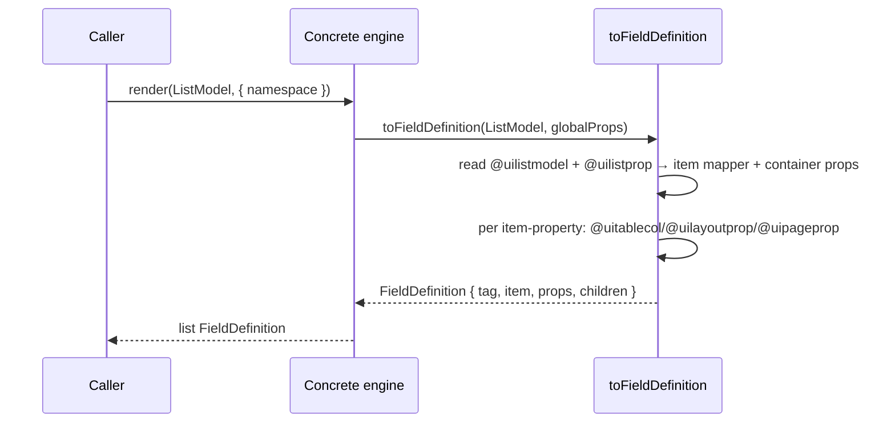

# 07 — UI Rendering Design

The architecture is detailed in the [Architecture Handbook](../architecture-handbook/06-ui-layer.md).

## 1. Overview

`@decaf-ts/ui-decorators` provides a framework-neutral, metadata-driven UI rendering layer. Renderable `Model`s carry UI metadata applied by class/property decorators; an abstract `RenderingEngine` converts that metadata plus validation metadata into a framework-neutral `FieldDefinition` tree, and four abstract targets (`getModal`, `getToast`, `getSpinner`, `router`) expose overlay/navigation surfaces. Concrete engines (Angular, React, HTML5, …) register under a free-form flavour and are selected per model via `@renderedBy`.

## 2. Design Principles

- **Model is the single source of UI truth.** *Why:* forms, persistence, transport, and domain logic all bind to the same validated `Model`; expressing UI as decorators on that model eliminates parallel UI schemas that drift from the data contract. *Enforcing test/spec:* `rendering-engine.test.ts` asserts that a decorated `DemoModel` produces a `FieldDefinition` whose tag, props, children, ordering, and validation attributes derive solely from the model's decorators — there is no separate UI schema input.
- **Framework neutrality via a single conversion pipeline.** *Why:* the `toFieldDefinition` walk is shared; only leaf rendering is framework-specific, so a model rendered in Angular and React yields the same definition tree. *Enforcing test/spec:* `TestEngine extends RenderingEngine<void>` exercises the shared `toFieldDefinition` directly without any framework imports.
- **Engine abstraction is split from targets.** *Why:* the conversion core is reusable, while the four target methods (`getModal`/`getToast`/`getSpinner`/`router`) form the narrow surface a backend `UserRequestHandler` needs via `RenderingFacade`, with no DOM dependency. *Enforcing test/spec:* `MockRenderingEngine` in `user-requests` tests satisfies the contract with `Pick<RenderingEngine, 4 methods>` only.
- **Exactly one element decorator per property.** *Why:* `@uiprop`, `@uichild`, and `@uielement` describe mutually exclusive rendering intents; ambiguity would produce non-deterministic trees. *Enforcing test/spec:* `toFieldDefinition` throws `RenderingError` when more than one is present, asserted in `rendering-engine.test.ts`.
- **Visibility is data-driven, not template-driven.** *Why:* `@hideOn(OperationKeys)` and `@hideFor`/`@showFor`/`@renderIf` filter against `globalProps.operation`/`namespaces` at render time, so the same model renders correctly across CRUD modes and tenants. *Enforcing test/spec:* namespace hide/show filtering is asserted in `rendering-engine.test.ts`.

## 3. Renderable Model Design

A renderable model is a `Model` (from `decorator-validation`) decorated with UI metadata. The root barrel patches `Model.prototype.render` and `Model.uiXxxOf` static readers at import time (side-effect), and declares the typed surface via `declare module "@decaf-ts/decorator-validation"`.

- **Class decorators:** `@uimodel(tag?, props?)` (required for `toFieldDefinition` — missing ⇒ `RenderingError`), `@renderedBy(engine)` (flavour binding), `@uilistmodel(name?, props?)` (list container), `@uihandlers(props?)`, `@uilayout(tag, colsMode?, rows?, props?)`, `@uisteppedmodel(tag, pages?, paginated?, props?)`.
- **Property decorators (exactly one element decorator per property):**
  - `@uielement(tag|props, props?, serialize?)` — a leaf child `FieldDefinition`.
  - `@uiprop(propName?, stringify?)` — extra prop folded into the parent's `childProps`.
  - `@uichild(clazz, tag, props?, isArray?, serialize?)` — recursive `toFieldDefinition` on a nested model.
- **Auxiliary property decorators:** `@uilistprop(propName?, props?)` (list item mapper + container props), `@uilayoutprop(col?, row?)`, `@uipageprop(page?)`, `@uiorder(order?)` (`first` → numeric → `last`), `@hidden()`, `@hideOn(...ops)`, `@hideFor`/`@showFor`/`@renderIf(...namespaces)`, `@uion`/`@uionclick`/`@uionrender`, `@uitablecol(sequence?, valueParserFn?)`.

### List item mapping

`@uilistmodel` designates a model as a list container; `@uilistprop` builds the `item` mapper and container `props` on the resulting `FieldDefinition`. Per-item rendering inputs come from `@uitablecol` (column sequence, value parser), `@uilayoutprop` (col/row slot), and `@uipageprop` (stepped-form page). The brief documents the slot-mapping inputs and the one-element-decorator-per-property rule; the detailed list-item renderer component contract (slot names, default templates) is implemented in the framework adapters and is not enumerated by this brief.

## 4. Rendering Engine Design

`RenderingEngine<T,R>` is an abstract class with:

- A static `cache: flavour → engine | constructor` and a `current` engine. `register(this)` is called from the protected constructor and throws `InternalError` on a duplicate flavour.
- Static `get(flavour?)` returns the cached instance, or boots a cached constructor (instantiating it and fire-and-forgetting `engine.initialize()`; the `initialized` flag is the intended gate but is not awaited — consumers needing async init should `await engine.initialize()` themselves).
- Static `render(model, ...args)` resolves the constructor (`Model.get(name) || Model.fromObject(model)`, throws `InternalError` if none), reads `Model.renderedBy(constructor)` for the flavour, and dispatches to `RenderingEngine.get(flavour).render(...)`.
- Protected `toFieldDefinition(model, globalProps)` — the single conversion pipeline (see §6).
- Abstract `initialize`, `render`, `getModal`, `getToast`, `getSpinner`, `router`.

`@renderedBy(engine)` is required for dispatch only when more than one engine is registered; with a single engine, `RenderingEngine.get()` falls back to `current`.

## 5. Target Design (modal / toast / spinner / router)

The four abstract instance methods return framework-neutral contracts declared as interfaces:

| Method | Contract | Purpose |
|:------|:---------|:--------|
| `getModal(options: DecafModalOptions)` | `IDecafModal` | Modal dialog with confirm/cancel; used by `UserRequestHandler.getInput`/`awaitDismissal`. |
| `getToast(options: DecafToastOptions)` | `IDecafToast` | Transient toast. (`DecafToastOptions.duration` is typed as the literal `3000` — see Inaccuracies in the handbook.) |
| `getSpinner(options: DecafSpinnerOptions)` | `IDecafSpinner` | Loading spinner. |
| `router` | `IDecafRouter` | Navigation. |

These four are the `RenderingFacade` (`Pick<RenderingEngine, 4 methods>`) consumed by `./user-requests`, keeping backend user-request handlers free of any DOM/Angular dependency. Concrete implementations live in the framework adapters.

## 6. `toFieldDefinition` Pipeline

1. Gather class decorators (`getClassDecoratorsMetadata`); throw `RenderingError` if `@uimodel` is missing.
2. Merge `inheritProps` (for nested children).
3. Iterate `Model.uiPropertiesOf`; for each property, `Model.uiDecorationOf` returns all UI entries, sorted so `ELEMENT`/`CHILD` process first. `Model.uiTypeOf` enforces exactly one of `@uiprop`/`@uichild`/`@uielement` (else `RenderingError`); `hideOn` requires a `@uielement`.
4. Per decorator: `@uiprop` → `childProps`; `@uichild` → recursive `toFieldDefinition` on the nested model (instantiating via `Model.get(clazzName)` if undefined; `@uichild` on a non-model throws); `@uilistprop` → `item` mapper + container props; `@uielement` (+ `@uion`/`@uipageprop`/`@uilayoutprop`/`@hideFor`/`@showFor`) → child `FieldDefinition`, folding validation decorators (`ValidatableByAttribute` → HTML attr; `ValidatableByType` → input type + date format; custom → `subType` + `validationMessage`), defaulting `type` from `Metadata.type(...)`, formatting the value via `formatByType`.
5. `sortChildrenByOrder`: `first` → numeric → `last`.
6. Filter by `hidden` (vs `globalProps.operation`) and `hideFor`/`showFor`/`renderIf` (vs `globalProps.namespaces`/`namespace`).
7. Return `{ tag, item, props, children, rendererId? }`; `rendererId` is added only at the top level via `generateUIModelID(model)`.

## 7. Functional Requirements

- **FR-1 (Render a model).** Calling `engine.render(model, globalProps)` returns a `FieldDefinition` whose `tag` is the `@uimodel` tag, `props` carry class decorator metadata, and `children` are ordered/filtered per §6.
- **FR-2 (Unknown / missing component).** A property without exactly one of `@uiprop`/`@uichild`/`@uielement`, or a model without `@uimodel`, or `@uichild` on a non-model, causes `RenderingEngine.render`/`toFieldDefinition` to throw `RenderingError` (a subclass of `InternalError`).
- **FR-3 (Visibility hidden).** A property decorated `@hideOn(OperationKeys.UPDATE)` is absent from `children` when `globalProps.operation === "update"`; `@hideFor(ns)` drops the property when `globalProps.namespaces`/`namespace` matches; `@showFor`/`@renderIf` is the inverse (alias of `showFor`).
- **FR-4 (Stepped-form navigation).** `@uisteppedmodel(tag, pages?, paginated?, props?)` marks a multi-page form; `@uipageprop(page?)` (default `1`) assigns a property to a page; `@uilayoutprop(col?, row?)` (default `1`/`1`) assigns a layout slot. The `FieldDefinition` tree carries page/slot metadata so the framework adapter can paginate.
- **FR-5 (List rendering).** `@uilistmodel` + `@uilistprop` produce a `FieldDefinition` with an `item` mapper and container `props`; `@uitablecol(sequence?, valueParserFn?)` (default `UIKeys.LAST`) supplies column rendering inputs.

### Render a model in a modal

```mermaid
sequenceDiagram
    participant Caller
    participant RE as RenderingEngine.render
    participant RG as RenderingEngine.get(flavour)
    participant CE as Concrete engine
    participant TFD as toFieldDefinition
    participant Modal as engine.getModal
    Caller->>RE: render(model, globalProps)
    RE->>RE: resolve ctor; read Model.renderedBy → flavour
    RE->>RG: get(flavour)
    RG-->>RE: engine
    RE->>CE: engine.render(model, globalProps)
    CE->>TFD: toFieldDefinition(model, globalProps)
    TFD-->>CE: FieldDefinition
    Caller->>Modal: getModal({ props: { model, def } })
    Modal-->>Caller: IDecafModal (confirm/cancel)
```

### Render a list



## 8. Acceptance Criteria

| Criterion | Expected behaviour |
|:----------|:-------------------|
| Successful render | `engine.render(decoratedModel, { operation: "create" })` returns a `FieldDefinition` with `tag === @uimodel tag`, ordered children, and validation attributes folded from `ValidatableByAttribute`/`ValidatableByType`. |
| Unknown / missing component | A property with zero or more than one of `@uiprop`/`@uichild`/`@uielement`, or a model lacking `@uimodel`, or `@uichild` on a non-model class, throws `RenderingError`. |
| Visibility hidden | `@hideOn(OperationKeys.UPDATE)` ⇒ property absent when `globalProps.operation === "update"`; `@hideFor(ns)` ⇒ absent when `globalProps.namespaces`/`namespace` matches `ns`; `@showFor`/`@renderIf` ⇒ present only for matching namespaces. |
| Stepped-form navigation | `@uisteppedmodel` + `@uipageprop(page)` + `@uilayoutprop(col,row)` ⇒ `FieldDefinition` carries page/slot metadata so the adapter can partition and navigate pages. |

## 9. Environment Variables

**None.** The `ui-decorators` package reads no environment variables. Notable defaults: `HTML5DateFormat = "yyyy-MM-dd"`; `uilayout` breakpoint defaults to `UIMediaBreakPoints.LARGE`; `uiorder` defaults to `UIKeys.FIRST`; `uitablecol` sequence defaults to `UIKeys.LAST`; `uipageprop` page defaults to `1`; `uilayoutprop` col/row default to `1`.

## 10. Usage Example

```typescript
import { Model, model, required, minlength } from "@decaf-ts/decorator-validation";
import { RenderingEngine, FieldDefinition, uimodel, uielement, uiorder, hideOn } from "@decaf-ts/ui-decorators";
import { OperationKeys, id } from "@decaf-ts/db-decorators";

class TestEngine extends RenderingEngine<void> {
  constructor(flavour: string) { super(flavour); }
  async initialize(..._a: any[]): Promise<void> { this.initialized = true; }
  render<M extends Model>(m: M, globalProps: Record<string, unknown>): FieldDefinition<void> {
    return this.toFieldDefinition(m, globalProps);
  }
}

@uimodel("decaf-crud-form", { test: "1" })
@model()
class DemoModel extends Model {
  @id()
  @uielement("decaf-crud-field", { label: "translation.demo.id.label" })
  @uiorder(0)
  id!: number;

  @required()
  @minlength(5)
  @uielement("decaf-crud-field", { label: "translation.demo.name.label" })
  @hideOn(OperationKeys.UPDATE)
  name!: string;
}

const engine = new TestEngine("test");
const def = engine.render(new DemoModel({ id: 1, name: "name" }), { operation: "create" });
// def.tag === "decaf-crud-form"; def.children[0].props.order === 0
```

## 11. Open Questions / Risks

- `RenderingEngine.get` does not `await engine.initialize()` on boot (acknowledged in source comments); concrete engines requiring async init must be initialized explicitly before render. See Inaccuracies in the handbook.
- `DecafToastOptions.duration` is typed as the literal `3000`, forcing casts for any other duration.
- Dead validator-override paths (`UIValidator`, `ui/validator.ts`, `ui/overrides.ts`) are exported but never wired; the `Validator.getMessage` override is also self-recursive if re-enabled.
- The detailed list-item renderer slot contract is implemented in framework adapters and is not enumerated by the source brief.
