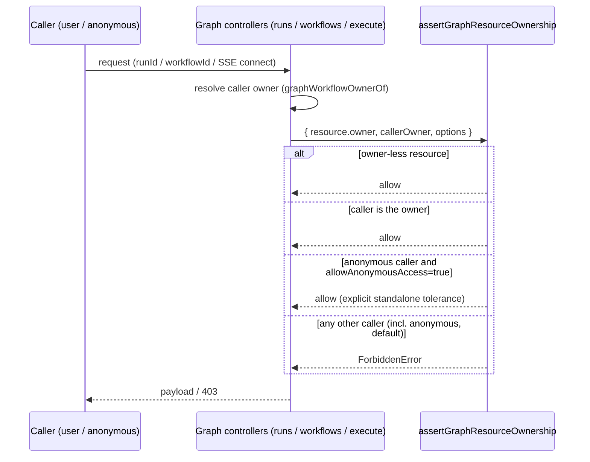
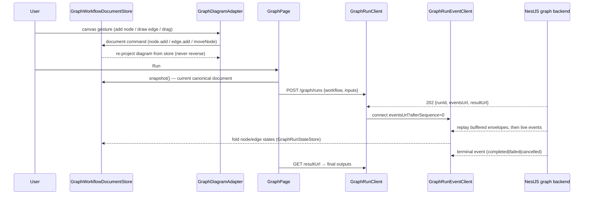

# 08 — Graph Design (Canonical Documents, Node Catalogue & Execution Engine)

The architecture is detailed in the [Architecture Handbook](../architecture-handbook/06-ui-layer.md) (metadata layer), [../architecture-handbook/07-integrations.md](../architecture-handbook/07-integrations.md) (engine/catalogue surface), and [../architecture-handbook/08-frontend-engines.md](../architecture-handbook/08-frontend-engines.md) (Angular editor).

> **Scope note.** This design covers four related subsystems of the graph feature.
> (1) The `./graph` subpath of `@decaf-ts/ui-decorators`: the decorated
> **authoring metadata layer** (`@node`/`@graph`/`@port`/`@input`/`@output`/`@connection`/`@pinnable`)
> plus — since the canonical cutover — the **canonical document model**
> (`src/graph/document/`) and the **manifest/parameter contracts**
> (`src/graph/catalog/`). (2) The **backend node catalogue, nine-stage
> validation gate, execution engine, and run lifecycle** in
> `integrations/graph`. (3) The **NestJS graph backend** in
> `integrations/nest/graph`. (4) The **canonical Angular frontend** in
> `for-angular/src/graph`. The specification of record is
> [DECAF_50.md](../../specifications/DECAF_50.md) (owned by the Delivery
> Documentation Specialist); this document describes the delivered system and
> references, never restates, that record.

## 1. Overview

The graph system operates from **one canonical, serializable
`GraphWorkflowDocument`**. The same document instance is the source for
projecting the editor canvas, persisting workflows, history/undo-redo,
autosave, backend validation, and execution; the ng-diagram canvas model is a
**projection** of the document, never an independent source of workflow
semantics.

Three representations existed before the cutover — decorated model classes +
`GraphWorkflowDefinition`, the mutable ng-diagram canvas + `GraphNodeConfigStore`,
and `GraphWorkflowSnapshot` — and execution rebuilt the workflow from the
decorated class rather than the canvas. That split is gone:

- Decorated workflow classes remain an **authoring/compatibility input**:
  `GraphDecoratedWorkflowCompiler` compiles them into a canonical document at
  initialization/restore time only — never on every Run.
- `GraphWorkflowSnapshot` is a `{ document, editor, metadata }` wrapper over
  the canonical document; legacy persisted snapshots load through the lossless
  `graphWorkflowDocumentFromLegacySnapshot` converter on the read path (no
  destructive migration job).
- `GraphNodeConfigStore` is removed; literal values and port/value modes live
  on `GraphNodeInstance.parameters` and `inputBindings`/`outputBindings`.

Node behavior is **backend-authoritative**. The frontend may choose which
registered node `kind` to instantiate, set literal parameter values, binding
modes, connections, layout state, and manifest-allowed metadata — never
executor implementations, functions, trusted port definitions, credential
values, or manifests. The backend resolves every node kind against its own
`GraphNodeCatalogue` (one kind → registration map: serializable manifest +
backend-only executor + declared methods), validates the whole document
through a nine-stage gate, and only then plans and executes. The frontend
palette renders `GraphNodeManifest[]` fetched from the catalogue HTTP API —
node constructors no longer ship to the browser.

Execution is **asynchronous and run-scoped**: `POST /graph/runs` returns
`202 Accepted` with `eventsUrl`/`resultUrl` before completion; events stream
over a run-scoped, authorized, replayable SSE endpoint with monotonic
per-run sequence numbers; status, result, cancellation, events, and inspection
are all ownership-checked server-side against the run's recorded owner.
Ownership **fails closed**: a resource that carries an owner is denied to
every other caller — including callers with no resolved identity — unless
the host explicitly enables the standalone anonymous tolerance
(`allowAnonymousAccess`, default `false`).

## 2. Design Principles

- **One source of truth.** *Why:* displayed state and executed state can never
  silently diverge if there is exactly one mutable representation. *Enforcing
  tests:* document⇄diagram round-trip suites in `for-angular`
  (`GraphRunLifecycle.spec.ts`, canvas-run E2E) and builder invariant tests in
  `ui-decorators` (`tests/unit/graph/document-builder.test.ts`).
- **Trusted catalogue, untrusted workflow instances.** *Why:* client input must
  not be able to mislead execution dispatch. *Enforcing tests:* the planner
  accepts only `GraphResolvedWorkflow`; a named test proves `graphDefinitionOf()`
  absent from the planner and raw `GraphNodeDefinition` objects rejected
  (`tests/unit/graph/GraphExecutionPlanner.test.ts`).
- **Co-located authoring, separated runtime artifacts.** *Why:* a node author
  writes manifest + executor in one module while only the serializable manifest
  crosses the wire. *Enforcing structure:* `GraphNodeRegistration` pairs them;
  built-in manifests re-export through `@decaf-ts/integrations/graph/shared`
  (re-exports only, no divergent copies).
- **Backend validation before execution.** *Why:* untrusted documents must be
  fully resolved against trusted manifests before planning. *Enforcing source:*
  `GraphWorkflowDocumentValidator.validate()` runs stages 1→9 inside
  `GraphExecutionEngine.execute()` and at every persistence boundary.
- **Run-scoped transport.** *Why:* long runs must be observable, reconnectable,
  and race-free. *Enforcing source:* `GraphRunService`/`GraphRunController`
  operate on a run resource; no global unfiltered event subject serves run
  events.
- **Fail-closed resource ownership.** *Why:* an ownership check that
  tolerates a missing caller identity is an open door — any unauthenticated
  request would slip past it. *Enforcing source:* the centralized
  `assertGraphResourceOwnership` check denies owned resources to absent
  identities; anonymous access is an explicit, default-off option
  (`allowAnonymousAccess`) reserved for standalone module runs.
- **Engine-free shared contracts.** *Why:* browser bundles must carry no
  engine/executor code. *Enforcing test:* `for-angular/src/graph/bundle-wall.spec.ts`
  (static import wall + runtime symbol wall over the production bundle).
- **Graph as decorators, not a separate schema language** (authoring layer).
  *Why:* reusing `Model`/`Metadata`/`@uimodel` means ports, validation,
  ordering, and visibility reuse the exact same machinery as forms.
- **Schema-flattening decouples the visual contract from the data contract**
  (authoring layer). *Why:* `@input`/`@output` splice a nested model's
  matching-direction ports **unprefixed** into the parent so a structured
  payload exposes connectable ports while the model stays nested and validated.
- **Snapshots are idempotent and now document-derived.** *Why:* workflow state
  must round-trip across JSON losslessly. *Enforcing:* `graphWorkflowSnapshotOf`
  deep-clones and idempotently merges; canonical snapshots wrap the document.
- **Subpath isolation for augmentations.** *Why:* `Metadata.nodes()`/
  `Metadata.workflows()` and `RenderingEngine#renderAsNode` patch foreign
  prototypes; importing the root barrel must not pull graph.

## 3. Package Ownership & Boundary Wall

```text
┌────────────────────────────────────────────────────────────────────┐
│ @decaf-ts/ui-decorators/graph  (browser-safe contracts)            │
│   src/graph/document/  GraphWorkflowDocument, GraphNodeInstance,   │
│                        GraphEdgeInstance, GraphEndpoint, bindings, │
│                        builder, reader, serializer,                │
│                        GraphDecoratedWorkflowCompiler               │
│   src/graph/catalog/   GraphNodeManifest, GraphPortManifest,       │
│                        GraphParameterDefinition, GraphValueSchema, │
│                        GraphVisibilityExpression,                  │
│                        GraphDynamicPortRule, manifest compiler,    │
│                        serializability helpers                     │
└───────────────────────────┬────────────────────────────────────────┘
                            │ frontend-safe contracts only
          ┌─────────────────┴──────────────────┐
          │                                    │
┌─────────▼─────────────────────┐  ┌──────────▼──────────────────────┐
│ for-angular/src/graph         │  │ integrations/src/graph          │
│  catalog/  (Angular services) │  │  shared/nodes/  built-in        │
│  document/ (store + adapter)  │  │    manifests (re-exported       │
│  parameters/ (renderers)      │  │    through graph/shared only)   │
│  runs/     (run clients)      │  │  engine/catalog/   catalogue    │
│  components/ (editor UI)      │  │  engine/validation/ nine-stage   │
│                               │  │  engine/runs/      run lifecycle│
│  never imports engine/nest    │  │  engine/execution/ engine+plan   │
└─────────┬─────────────────────┘  └──────────┬──────────────────────┘
          │ HTTP/SSE (manifests, documents,   │
          │ runs, events)                     │ backend-only
          └─────────────────┬─────────────────┘
                            ▼
              integrations/src/nest/graph
                catalogue / workflow / run controllers
```

Boundary rules (all lint- or test-enforced):

- The `ui-decorators` `document/` and `catalog/` modules must not import
  Angular, NestJS, Node-only APIs, the engine, or executors; the DECAF-35
  ESLint `no-restricted-imports` wall extends to them.
- `for-angular` production graph sources may import only
  `@decaf-ts/ui-decorators/graph` and `@decaf-ts/integrations/graph/shared`.
  Forbidden specifiers (asserted by `bundle-wall.spec.ts`):
  `@decaf-ts/integrations/graph/engine`, `@decaf-ts/integrations/nest`,
  `@decaf-ts/for-nest`, `@decaf-ts/for-server`, `node:`, `isolated-vm`, `vm:`.
- The production browser bundle must contain no engine-side executable
  symbols (`GraphExecutionEngine`, catalogue runtime, validators, run stores);
  the bundle wall rebuilds `www/` when stale and self-attests its scanner with
  probe symbols so a blind scan cannot silently pass.
- Built-in manifests live in `integrations/src/graph/shared/nodes/` and reach
  the frontend only through the `./graph/shared` re-export — no divergent
  copies.

## 4. Graph Decorator Design (authoring layer)

| Decorator | Target | Role |
|:----------|:-------|:-----|
| `@node(tag, { kind, category, icon?, color?, ... })` | class | Marks a `Model` as a graph node; composes `@uimodel`; registers the constructor in the in-module `NODE_REGISTRY` `Set`. |
| `@graph(tag, props?)` | class | Marks a `Model` as a workflow root; registers in `WORKFLOW_REGISTRY`. |
| `@port(direction, { handle?, ... })` | property | Declares a port (INPUT/OUTPUT). On a Schema-typed property → legacy composite (prefixed children). |
| `@input(opts?)` / `@output(opts?)` | property | Declares a Schema-flattened port: nested model's matching-direction ports splice **unprefixed** into the parent (carrier property is not a port); sets `graph.schema = true`. Primitive `@input` is a no-op. |
| `@connection({ category, ... })` | property | Declares connection rules / category. |
| `@pinnable({ enabled?, strategy?, includeDependencies? })` | class/property | Pinning metadata (defaults `enabled: true`, `strategy: "manual"`, `includeDependencies: true`). |

Decorators register with the `Decoration.for(...).define(...).apply()` DSL and
write raw `Metadata` under `GraphKeys` for runtime lookup. Registries:
`registerNode`, `registerWorkflow`, `graphNodes`, `graphWorkflows`,
`resetGraphRegistries`. Since the cutover these registries drive **authoring
and backend registration/compat flows only** — the Angular palette no longer
derives from constructors.

### Port direction & groups

`PortDirection` is `INPUT` | `OUTPUT`. `portGroups` carries the one-vs-all
rendering toggle (default `"all"`). Leaf-port helpers: `graphLeafPortsOf`,
`graphWorkflowInputLeafPortsOf`, `graphWorkflowOutputLeafPortsOf`.

### Category style registry

`registerGraphCategoryStyle(category, style)` feeds `graphCategoryStyleOf`/
`resolveEffectiveColor`/`resolveEffectiveIcon`. `GRAPH_VISUAL_STATE_STYLES` and
`graphVisualStyleOf` provide visual-state styling. `GRAPH_DEFAULT_CATEGORY_STYLE`
is the fallback.

## 5. Reader Design (authoring/compatibility)

`graphDefinitionOf(model)` reads `Model.uiModelOf` + `graphNodeMetadataOf`,
then `graphPortsOf(model)`:

- For `@input`/`@output` Schema ports → `schemaGroupPorts` splices the nested
  model's matching-direction ports **unprefixed** into the parent (carrier
  property is not a port), with a `visited` cycle guard.
- For `@port` Schema ports → expands into prefixed composite children (legacy
  behaviour).
- For primitive `@input` → no-op.
- Resolves `portGroups` (declared + defaulted `"all"`) and
  `effectiveColor`/`effectiveIcon` (node > category > default).

Returns a `GraphNodeDefinition`; `graphWorkflowDefinitionOf(model)`
additionally splits ports into inputs/outputs/connections and attaches
`nodes`/`relations` → `GraphWorkflowDefinition`.

**Post-cutover role:** these definitions feed the `graphNodeManifest`
compiler (decorated class → published manifest shape) and the
`GraphDecoratedWorkflowCompiler` (decorated workflow → canonical document).
They are *not* execution inputs: the planner no longer calls `graphDefinitionOf`
and rejects raw definition objects.

## 6. Canonical Workflow Document

### 6.1 Document shape

`GraphWorkflowDocument` (`ui-decorators/src/graph/document/GraphWorkflowDocument.ts`)
is a pure JSON contract — no class constructors, functions,
`GraphNodeDefinition`/`GraphWorkflowDefinition`, or Angular component
references may appear anywhere in it:

```ts
interface GraphWorkflowDocument {
  id: string;
  name: string;
  inputs: GraphWorkflowPortInstance[];   // workflow-owned boundary ports
  outputs: GraphWorkflowPortInstance[];
  nodes: GraphNodeInstance[];            // kind-referencing instances
  edges: GraphEdgeInstance[];            // data | connection, explicit endpoints
  settings?: Record<string, GraphJsonValue>;
  metadata?: Record<string, GraphJsonValue>;
  ui?: GraphWorkflowUiState;             // editor-only; engine ignores
}
```

Node instances reference the trusted catalogue by `kind` and carry only
instance state:

```ts
interface GraphNodeInstance {
  id: string;                       // unique inside one document
  kind: string;                     // catalogue lookup key, e.g. "core.flow.switch"
  label?: string;
  parameters: Record<string, GraphJsonValue>;        // literals + operation choices
  inputBindings?: Record<string, GraphInputBinding>; // edge | literal | expression
  outputBindings?: Record<string, GraphOutputBinding>;
  disabled?: boolean;
  metadata?: Record<string, GraphJsonValue>;         // manifest-allowed keys only
  loop?: GraphLoopConfiguration;                     // nested body is a document
  ui?: GraphNodeUiState;                              // position/size/tabs; engine ignores
}
```

Edges connect explicit `GraphEndpoint`s — `{ scope: "workflow", port }` or
`{ scope: "node", nodeId, port }` — replacing the legacy `"$workflow"` string
sentinel. Layout/presentation (`ui.*`) is document-carried but engine-ignored,
excluded from pinning fingerprints, and asserted absent from semantic equality.

**JSON safety:** every wire-crossing field uses `GraphJsonValue`
(`string | number | boolean | null | arrays | objects` thereof — not
`unknown`). Dates serialize as ISO strings; binaries are references, never
embedded runtime objects. Document parsing rejects the prototype-pollution
keys `__proto__`, `prototype`, and `constructor`.

### 6.2 Bindings

```ts
type GraphInputBinding =
  | { mode: "edge" }                                 // requires an incoming edge unless optional
  | { mode: "literal"; value: GraphJsonValue }       // value stored on the instance
  | { mode: "expression"; expression: string };      // engine's allowed-expression machinery
```

Binding rules: a port cannot simultaneously use an incoming edge and a
literal unless explicitly allowed; literal values are never redundantly
stored in both `parameters` and `inputBindings`; non-port
operation/configuration fields belong in `parameters`; data inputs
switchable between connection and manual entry belong in `inputBindings`.
Input bindings replace the old `GraphNodeConfigStore.values`/`.portModes`
split. Output bindings record instance-level enablement/aliases (e.g.
enabled Switch branches), not output-schema redefinition.

### 6.3 Nested loop bodies

`GraphLoopConfiguration.body` is itself a `GraphWorkflowDocument`; nested
documents run through the same nine-stage catalogue resolution and validation
as the root (issues merge with a path prefix). Loop bodies are never embedded
`GraphWorkflowDefinition`s.

### 6.4 Builder

`GraphWorkflowDocumentBuilder` composes documents fluently
(`addInput`/`addOutput`/`addNode`/`addEdge`/`setSettings`/`setMetadata`/`build`).
`build()` performs local structural validation and throws a Decaf
`ValidationError` on unique-ID violations or non-JSON-safe values, and omits
`settings`/`metadata`/`ui` keys entirely when unset so raw `build()` output is
JSON-safe without `undefined` values.

### 6.5 Decorated-workflow compiler

`GraphDecoratedWorkflowCompiler.compile()` converts member constructors to
`{id, kind}`, relations to explicit endpoints, boundaries to workflow ports,
defaults to parameters/bindings, layout to UI state, and nested workflows
recursively — removing functions and constructors and verifying JSON
serializability. Legacy loop metadata blocks (`graph.metadata.loop`) split:
`body`/`maxIterations`/`timeoutMs`/`concurrency` become
`GraphLoopConfiguration`, while operation keys (`condition`, `inputPort`,
`outputPort`, `itemPort`, `resultPort`, `statePort`, `slice`) carry into
`parameters` so legacy round-trips stay lossless. The compiler serves
initialization and compatibility/restore only — it must not run on every Run
press.

### 6.6 Snapshot transition

`GraphWorkflowSnapshot` is a `{ document, editor, metadata }` wrapper; the
canonical document is the executable payload. Legacy (pre-cutover) snapshots
load through `graphWorkflowDocumentFromLegacySnapshot` on the read/compile
path — lossless, no destructive migration: legacy `node.data` maps into
instance `parameters`, legacy `node.metadata` into instance `metadata`,
canvas boundary badges (`input-{port}`) fold back onto the workflow port they
were drawn for, and edge rows merged from canvas clones restore the relation's
document-carried `label` instead of dropping it.

## 7. Node Manifests & Parameter Schemas

### 7.1 Manifest contract

`GraphNodeManifest` (`ui-decorators/src/graph/catalog/GraphNodeManifest.ts`)
is the serializable, frontend-safe description of a node kind:

```ts
interface GraphNodeManifest {
  kind: string;
  display: GraphNodeDisplayManifest;      // name, description, category, icon, size
  inputs: GraphPortManifest[];
  outputs: GraphPortManifest[];
  connections?: GraphPortManifest[];      // structural @connection ports stay distinct
  parameters: GraphParameterDefinition[];
  dynamicPorts?: GraphDynamicPortRule[];
  credentials?: GraphCredentialRequirement[];
  capabilities?: GraphNodeCapability[];
  methods?: GraphNodeMethodManifest[];    // loadOptions | listSearch | resourceLocator | resourceMapping | validateParameter | action
  policies?: GraphNodePolicyManifest;
  metadata?: Record<string, GraphJsonValue>;
}
```

Ports carry optional `schema` (`GraphValueSchema`: any/string/number/boolean/
array/object/enum/model), `required`, `hidden`, `category`, `handle`,
`connectionPolicy` (allowSelf/allowMultiple/allowedNodeKinds/blockedNodeKinds/
allowedPortCategories/maxConnections — enforced by the backend, applied
optimistically by the frontend only), `configurable`, and
`defaultMode: "edge" | "literal" | "expression"`. Icon references are
`catalogue | url | data` — arbitrary filesystem paths are never exposed.
Existing Decaf validation metadata compiles into `GraphValueSchema` where
possible (`GraphValueSchemaDerivation`).

### 7.2 Parameter schema system

`GraphParameterDefinition` is a discriminated union over
`GraphParameterBase` (id/label/description/required/defaultValue/placeholder/
visibility/validation/metadata): `string` (multiline, length, pattern),
`number` (integer/min/max/step), `boolean`, `options` (static list or
`loadOptionsMethod`), `collection`, `object`, `code` (language +
`validateMethod`), `expression`, `resourceLocator` (modes), `credential`,
`notice`, `hidden`. Forms retain JSON types end-to-end.

**Conditional visibility** is a serializable DSL only — no function-valued
visibility ever crosses the wire:

```ts
type GraphVisibilityExpression =
  | { op: "eq"|"neq"|"gt"|"gte"|"lt"|"lte"; parameter: string; value: GraphJsonPrimitive }
  | { op: "in"|"notIn"; parameter: string; values: GraphJsonPrimitive[] }
  | { op: "exists"; parameter: string }
  | { op: "and"|"or"; expressions: GraphVisibilityExpression[] }
  | { op: "not"; expression: GraphVisibilityExpression };
```

Backend validation of security-sensitive fields is invariant under visibility
state — visibility cannot suppress backend validation.

**Dynamic ports** are declarative rules (`repeatFromParameter` with
`portIdTemplate`/`itemIdPath`, or `togglePort` on a parameter value); the
frontend never executes class methods such as `GraphNode.applyMetadata()`.
Cases that cannot be represented declaratively resolve through the backend
(`POST /graph/node-types/{kind}/resolve`), which stays authoritative; the
frontend may cache resolved results.

**Credentials:** workflow documents store `GraphCredentialReference`s
(`credentialId` + `credentialType`) only; secrets are resolved and authorized
server-side and never appear in documents, manifests, method responses, logs,
or error/inspection payloads.

## 8. Backend Node Catalogue

`integrations/src/graph/engine/catalog/` owns the trusted kind registry:

```ts
interface GraphNodeRegistration {
  manifest: GraphNodeManifest;
  executor: GraphNodeExecutor;                          // backend-only
  methods?: Record<string, GraphNodeMethod>;
  resolveManifest?: GraphResolvedManifestProvider;
}

class GraphNodeCatalogue {
  register(registration): this;            // fail-fast validation
  unregister(kind): this;
  has(kind): boolean;
  getManifest(kind): GraphNodeManifest;
  getExecutor(kind): GraphNodeExecutor;
  getMethod(kind, method): GraphNodeMethod;
  listManifests(context?): GraphNodeManifest[];         // kind-sorted (deterministic)
  resolveManifest(kind, instance, context?): Promise<GraphResolvedNodeManifest>;
}
```

`GraphNodeExecutorRegistry` delegates to the catalogue — there is exactly one
kind→registration map; two independently maintained kind maps are forbidden
(the drift vector the cutover eliminates). The `defineGraphNode` helper lets
node authors co-locate manifest + executor while the registration (with the
executor) stays backend-only and the manifest remains separately exportable.

**Registration validation fails fast with Decaf errors when:** `manifest.kind`
is empty; the kind is already registered without an explicit replacement
policy; the manifest is not JSON-serializable or contains
functions/constructors; a declared backend method has no implementation or an
implementation is not declared; duplicate parameter or static-port IDs exist;
a static port has an invalid default binding mode; a dynamic-port rule
references a missing parameter; credential requirements are malformed; the
executor is absent; a port/parameter id is a prototype-pollution key.

**Built-in registrations** (`GraphBuiltInRegistrations.ts`) pair every shipped
kind: `core.flow.map|delay|return|merge|if|parallel|errorBoundary|humanApproval|break|code|log|switch`,
`core.agent`, `core.trigger.manual|webhook|schedule|event|form|chat`, and
`core.utility.log`. `GraphNodeManifestResolver` resolves per-instance
effective manifests (dynamic ports applied); `GraphNodeMethodRegistry` pairs
declared methods with implementations.

## 9. Backend Validation — the Nine-Stage Gate

`GraphWorkflowDocumentValidator`
(`integrations/src/graph/engine/validation/`) is the only door from a client
document to an executable workflow. It runs nine stages in the exact
normative order and accumulates structured `GraphValidationIssue`s
(`code`, `path`, `message`, `nodeId?`, `edgeId?`, `details?`) instead of
failing abruptly:

1. **Workflow structure** — non-empty id; unique node/edge/workflow-input/
   workflow-output IDs; JSON-safe values; prototype-key rejection;
   configurable document-size, nesting-depth, node/edge-count limits
   (`GraphWorkflowDocumentLimits`); nested loop bodies recurse through the
   full gate with path-merged issues.
2. **Kind resolution** — every `kind` exists in the backend catalogue
   (trusted resolution; unknown kinds are issues, not lookups of client data).
3. **Parameters** — declared-ness unless allowed, required presence, typing
   against the parameter schemas; visibility cannot bypass
   security-sensitive validation.
4. **Dynamic ports** — binding IDs refer to effective (post-resolution) ports.
5. **Edge endpoints** — endpoints and referenced nodes/ports exist; directions
   valid; data and structural edges use compatible ports; duplicate/conflicting
   edges rejected.
6. **Connection policies** — policy rules and max-connection counts enforced.
7. **Topology** — acyclicity preserved (Kahn's algorithm; loop constructs
   excepted, loop bodies independently acyclic); boundary routing valid;
   required values satisfiable.
8. **Credential-reference authorization** — references exist, are authorized,
   and match the manifest's credential types; plain credentials never appear.
   Authorization runs through the host-supplied `GraphCredentialAuthorizer`
   (engine config → stage-8 validator); without one the stage is
   shape/type-only — a well-formed, type-matched reference is accepted
   without verifying that the credential exists or that the run may use it,
   so production hosts MUST wire one through
   `GraphExecutionModule.forRoot({ credentialAuthorizer })`. The
   plain-secret scan walks node parameters and metadata recursively
   (objects and arrays, depth cap 8, cycle-guarded) — deny-listed keys are
   issues at any nesting depth, not just at the top level.
9. **Capability validation** — declared manifest capabilities hold.

The output is a `GraphWorkflowValidationResult`
(`{ valid, issues, resolved? }`); `GraphResolvedWorkflow` (instances paired
with resolved manifests + executors, adjacency maps) is **backend-only** and
the only input the planner accepts. Validation runs server-side at every
boundary: inside `GraphExecutionEngine.execute()` before planning, and in
`GraphWorkflowService` before persistence. The normative error hierarchy is
Decaf-only: `GraphDocumentValidationError extends ValidationError`,
`GraphNodeNotFoundError extends NotFoundError`,
`GraphNodeRegistrationError extends InternalError`,
`GraphConnectionValidationError extends ValidationError`,
`GraphCredentialAuthorizationError extends AuthorizationError`,
`GraphRunNotFoundError extends NotFoundError`,
`GraphRunAuthorizationError extends AuthorizationError`,
`GraphRunStateError extends InternalError`.

## 10. Planner & Execution Engine

### 10.1 Planner

`GraphExecutionPlanner.plan(workflow: GraphResolvedWorkflow)` builds
topological layers with Kahn cycle detection. It no longer accepts
`GraphWorkflowDefinition`, no longer calls `graphDefinitionOf()`, and rejects
inline raw `GraphNodeDefinition` objects — the deleted `GraphRelationResolver`
and raw-definition fallback are gone. Workflow-boundary edges
(`GRAPH_WORKFLOW_BOUNDARY`) are excluded from inter-node dependency counting.

### 10.2 Engine

```ts
class GraphExecutionEngine {
  async execute(
    document: GraphWorkflowDocument,
    inputs: GraphExecutionValues = {},
    options: GraphExecutionOptions = {}
  ): Promise<GraphExecutionResult>;
}
```

The public engine accepts a canonical document and performs resolution
internally: it emits `VALIDATION_STARTED`, runs the nine-stage gate, and on
failure emits `VALIDATION_FAILED` (with the structured issues) and throws
`GraphDocumentValidationError` carrying every issue. Execution then proceeds
layer-by-layer with bounded concurrency (`concurrency=4` default), routing
values through the `GraphValueStore` and emitting the event types preserved
from DECAF-32/DECAF-48 (`WORKFLOW_*`, `NODE_*`, `EDGE_VALUE_ROUTED`,
`NODE_STATE_CHANGED`, `GRAPH_RUN_LOG`, `LOOP_*`, …).

**Executor contract (§4.9):** `GraphNodeExecutor.execute(request, context)`
receives a `GraphNodeExecutionRequest` that separates `inputs` (routed edge
values, literals, allowed expressions, manifest defaults) from `parameters`,
`credentials` (resolved server-side), and `metadata`. The legacy input-only
executor adapter was removed at cutover. Outputs are validated against the
effective output manifest — unknown outputs rejected by default, missing
required outputs fail the node. Disabled nodes use the explicit
`GraphDisabledNodeBehavior` enum (`skip | passThroughFirstInput |
emitDefaults`). Loop executors (`Foreach`/`While`/`Until`) receive nested
canonical documents and re-enter the same validation/resolution/planning/
execution pipeline with `parentRunId`/`path` propagation; `maxIterations`
limits and the `core.flow.break` `GraphBreakSignal` behave as before.

**Value store & pinning.** Runtime values live in memory per run; cached/
pinned values delegate to a `GraphValueStoreAdapter`. Pinning stays
all-or-nothing across upstream pin sets with TTL'd entries, but fingerprints
now derive from the canonical instance — node kind, parameters, bindings,
effective inputs, relevant metadata, and dependency fingerprints.
Presentation-only UI state is excluded: the instance `ui` record is never
read and a `ui` key inside metadata is stripped, so moving a node on the
canvas never invalidates its pin.

**Code sandbox.** Code/Switch node bodies run through the pluggable
`CodeSandboxEvaluator`; `IsolatedVmCodeSandboxEvaluator` transpiles TS,
validates the AST (rejecting `import`/`export`/`eval`/`new Function` and a
blocked-identifier set), and runs in an `isolated-vm` isolate with
timeout/memory limits. The engine still does not wire a sandbox by default —
consumers pass `codeSandboxEvaluator` or Code/Switch nodes throw
`GRAPH_CODE_SANDBOX_NOT_CONFIGURED`. Code values are parameters, never
manifest methods.

## 11. Run Lifecycle (Asynchronous Execution)

### 11.1 Run creation

`POST /graph/runs` accepts either an unsaved canonical document plus inputs,
or a saved `workflowId` plus inputs — supplying both is rejected as
ambiguous, as is a request with neither. The endpoint authenticates, checks
size and the per-caller concurrent-run limit, allocates the run, records
initial state, and returns **`202 Accepted` before completion**:

```json
{
  "runId": "run-123",
  "workflowId": "workflow-1",
  "status": "queued",
  "eventsUrl": "/graph/runs/run-123/events",
  "resultUrl": "/graph/runs/run-123"
}
```

Validation and execution then proceed asynchronously
(`GraphRunExecutor.schedule`). `GraphRun` carries `runId`, `workflowId`,
`ownerUser`, `status` (`queued | validating | running | succeeded | failed |
cancelled`), timestamps, `result?`, `error?`, and the executed document's
`documentFingerprint` (SHA-256 over a stable key-sorted serialization) for
audit/reproducibility.

The concurrent-run limit (`maxConcurrentRuns`) is enforced **per caller**:
`GraphRunService` buckets in-flight runs by a caller key — the run's owner
user for authenticated callers, a per-IP key (`ip:{address}`) supplied by
the HTTP layer for anonymous callers, or a shared `"anonymous"` bucket when
neither is available. A caller whose bucket is exhausted receives a Decaf
`ValidationError` on run creation.

### 11.2 Events

```http
GET /graph/runs/{runId}/events?afterSequence={n}
```

Every event rides a `GraphRunEventEnvelope` (`runId`, `workflowId`,
monotonic `sequence`, `type`, `timestamp`, optional `nodeId`/`edgeId`/
`payload`/`error`). Sequence numbers are assigned by a single writer per run
(`GraphRunEventPublisher`) — incremented atomically at publish, so no gaps or
reordering under concurrency. The event store (`GraphRunEventStore`:
`append`/`listAfter`/`subscribe`; `InMemoryGraphRunEventStore` is the
reference implementation with retention enforcement) buffers for replay:
clients replay from sequence 0 (initial subscription), from `afterSequence`
(reconnect mid-run, duplicates excluded after acknowledged sequences), and
terminal events replay after the run finishes. Cancellation emits a
replayable terminal event. Nested runs carry parent/path information. The
SSE endpoint replays the buffered prefix, then streams live envelopes.

Event state is bounded by an auto-release cycle: when a run finishes,
`GraphRunService` schedules release of the run's retained bookkeeping —
caller-bucket membership, executor/publisher sequencing, and the event
store's replay buffers (via the optional `GraphRunEventStore.release(runId)`
hook) — after `eventReplayWindowMs` (`DEFAULT_GRAPH_RUN_LIMITS`: 5 minutes).
Clients can reconnect and replay the terminal sequence inside that window;
afterwards the state is gone. In-memory stores drop the retained events on
release; durable stores may no-op the hook and keep events for audit.

There is **no global unfiltered subject** for run events: the run-scoped
endpoint is the canonical transport. The legacy global `GET /graph/events`
stream (DECAF-42 subscription mode, broadcast default) is deprecated and
**disabled by default** — the route answers `404` unless the host
explicitly sets `GraphExecutionControllerOptions.enableGlobalEventStream`
(transition aid only). When enabled, every event is ownership-gated at
emit: the controller resolves each event's run and only forwards events
for runs the connected caller owns. No new features route through the
global stream.

### 11.3 Ownership & authorization

Every run records an owner from `DecafRequestContext`
(`ownerUser: string | null`). Ownership is enforced **server-side** on
status, result, cancellation, events, and inspection — client-side filtering
is a convenience, never a security control — through the single centralized
`assertGraphResourceOwnership` check (`engine/runs/ownership.ts`), shared by
the run service, the workflow service, the persisted-result read path, and
the opt-in global stream:

- **Fail-closed default.** A resource that carries an owner is accessible
  only to that owner. An absent caller identity (null/undefined/empty) is
  **denied** on owned resources — the check never falls back to "tolerate
  missing identity". Owner-less resources remain accessible to everyone.
- **Explicit standalone tolerance.** `allowAnonymousAccess` (default
  `false`) admits anonymous callers on owned resources for standalone
  module runs — the DECAF-50 §4.15 tolerance following the DECAF-48
  pattern. Hosts opt in per API surface (`runs`/`workflows` module
  options, wired through to the owning service); the standalone `main.ts`
  demo profile pairs `auth: "optional"` with `allowAnonymousAccess: true`,
  while the controller defaults are `auth: "required"` with the tolerance
  off.



### 11.4 Cancellation & status

`DELETE /graph/runs/{runId}` is authorized, idempotent for terminal runs,
signals the executor's abort controller, marks the run `cancelled`, and emits
the replayable terminal event. `GET /graph/runs/{runId}` returns status
(and `result` once terminal). Execution duration is bounded by a configurable
timeout armed per run.

### 11.5 Run persistence (DECAF-36 Req-B1–B7)

Runs persist through `GraphRunModel` (`@table("graph_run")`: runId,
workflowId, owner, status, documentFingerprint, inputs, result, error,
timestamps) via `GraphRunModelService` — a `@service(GraphRunModel)`
`ModelService` with constructor DI, automatic context propagation, no
repository injection tokens, and `@Optional()` request context. The engine
module is adapter-agnostic: `GraphRunStore`/`GraphRunEventStore` are ports
with in-memory reference implementations.

Execution results persist separately through `GraphResultService` into
`GraphExecutionResultModel` (`runId`, `workflowId`, `owner`, `status`,
`inputs`, `outputs`, …). `saveResult` stamps the owning user resolved from
the request context onto the row — absent for legacy/anonymous results,
which carry no enforceable ownership — and the result read path gates
`GET /graph/results/{runId}` through the centralized run ownership check
before the row is returned.

### 11.6 Deprecated synchronous path

`POST /graph/execute` is deprecated, not removed: it accepts **canonical
documents only** (legacy definition/snapshot shapes and inline
`node`/`definition`/`executor`/`execute`/`ports`/`component` fields are
rejected with a Decaf `ValidationError` before the engine sees them) and
delegates to the run service (`executeAndWait`) so old clients keep working.
It is not the primary Angular path.

## 12. NestJS HTTP API Surface

All controllers live in `integrations/src/nest/graph/` under `@Controller("graph")`.

**Catalogue** (`GraphNodeCatalogueController`; authenticated context required
by default, `DecafRequestContext` propagated; rate-limit identity prefers
the authenticated owner — `graphWorkflowOwnerOf` — over raw request user/IP
fields, so the expensive `resolve`/`methods` quotas bucket by real
identity first):

| Route | Behaviour |
|:------|:----------|
| `GET /graph/node-types` | Deterministic kind-sorted manifest list; `ETag` = manifest digest, `If-None-Match` → `304` so catalogue caching stays stable. |
| `GET /graph/node-types/{kind}` | Single manifest. |
| `GET /graph/node-types/{kind}/icon` | Manifest-resolved icon. |
| `POST /graph/node-types/{kind}/resolve` | Resolved manifest for an instance subset; rate-limited; client input is never definition material. |
| `POST /graph/node-types/{kind}/methods/{method}` | Invokes a declared, registered method; verifies declaration + type; rate-limited; credentials resolved server-side. |

**Workflows** (`GraphWorkflowController`; authenticated by default —
`auth` defaults to `"required"`, `"optional"` tolerates anonymous callers
for standalone runs — with the `allowAnonymousAccess` fail-closed tolerance
defaulting to `false`):

| Route | Behaviour |
|:------|:----------|
| `PUT /graph/workflows/{workflowId}` | Saves a canonical document (or a `{document, …}` wrapper); validates before persistence; asserts ownership; path/document IDs must match. |
| `GET /graph/workflows/{workflowId}` | Returns the persisted canonical document (ownership-checked). |
| `POST /graph/workflows/validate` | Runs the nine-stage gate; returns structured issues (`code`/`path`/`nodeId`/`edgeId`/`message`/safe details). |

**Runs** (`GraphRunController`; `auth` defaults to `"required"` —
SAA-595 secure-defaults alignment, `"optional"` admits anonymous callers
for standalone runs — and `allowAnonymousAccess` defaults to `false`):
`POST /graph/runs` (202, per-caller concurrency-bucketed), `GET
/graph/runs/{runId}`, `DELETE /graph/runs/{runId}` (cancel), `@Sse GET
/graph/runs/{runId}/events?afterSequence=` — as specified in §11.

**Execution & results** (`GraphExecutionController`; deprecated
synchronous surface kept for transition):

| Route | Behaviour |
|:------|:----------|
| `POST /graph/execute` | Deprecated; canonical documents only; delegates to the run service (`executeAndWait`) under the same ownership and per-caller concurrency rules. |
| `GET /graph/results/{runId}` | Gated through the centralized run ownership check before the persisted result row is returned — cross-user/anonymous callers get `403` on owned runs. |
| `GET /graph/events` (SSE) | Deprecated global stream, **disabled by default (`404`)**. The opt-in `enableGlobalEventStream` option re-exposes it with per-event ownership gating at emit. |
| `PUT /graph/workflow/{id}` | Legacy workflow save path delegating to `GraphWorkflowService`. |

`GraphExecutionModule.forRoot` bundles the controllers with the catalogue,
engine, run services, and persistence services, and takes per-surface
options — `catalogue`, `workflows`, `runs`, `execution`
(`enableGlobalEventStream`) — plus the engine-level `credentialAuthorizer`,
wired into the engine config so the stage-8 validator can check credential
references against the host credential store. Because `@service`-decorated
classes resolve through the injectable-decorators singleton registry, which
does not forward constructor arguments, the module applies
`GRAPH_WORKFLOW_OPTIONS` to `GraphWorkflowService` via its `configure()`
method in the provider factory — the deterministic path by which
`allowAnonymousAccess` and document limits actually reach the service.
`GraphExecutorRegistryFactory`
(`createGraphNodeCatalogue`, the `createGraphExecutorRegistry` compatibility
facade, `createDemoEngineConfig`) builds a populated catalogue with the
built-in registrations and wires `IsolatedVmCodeSandboxEvaluator` (loops,
Code, and Switch executors are engine-bound and registered through
`createDemoEngineConfig`'s `onEngineCreated` hook). The standalone `main.ts`
boots on `GRAPH_BACKEND_PORT` / `argv[2]` / default `3000`, binds
`127.0.0.1` only, admits only `http://localhost`/`http://127.0.0.1` CORS
origins, and runs its demo surfaces under the explicit standalone profile
(`auth: "optional"` + `allowAnonymousAccess: true`).

## 13. Angular Canonical Frontend

The editor in `for-angular/src/graph` is manifest-driven and document-native
— no node constructors, no legacy config store, no rollout-flag mechanics
reach the browser.

- **Catalogue (`catalog/`).** `GraphNodeCatalogService` (`@service()` registry
  singleton paired with an Angular root `Injectable` via
  `graphAngularServiceShare`) loads/refreshes `GraphNodeManifest[]`; the
  palette consumes manifests and `GraphNodePaletteFactory` turns a palette
  pick into a `GraphNodeInstance` plus a `node.add` command. Sources compose
  through `GraphNodeCatalogCompositeSource`: the backend
  `GraphNodeCatalogApi` plus offline `GraphNodeManifestFixtures` (compiled
  from the demo's decorated classes with the ui-decorators manifest
  compiler).
- **Document layer (`document/`).** `GraphWorkflowDocumentStore` holds the
  canonical document; **every semantic mutation is a command**
  (`GraphDocumentCommands`: node.add/remove/update, edge.add/remove,
  moveNode, viewport, replace, reset). `GraphDiagramAdapter` is the *only*
  component translating between the document and ng-diagram: projection
  (`toDiagram`/`reconcile`) is a pure function of (document, manifest
  reader); canvas gestures go through `GraphDiagramMutationTranslator` and
  become document commands — the diagram is re-projected from the store,
  never the reverse. Positions commit on drag-end only; the viewport lives in
  the document's `ui` block; canvas-only artifacts (ghost nodes, selection,
  run overlays) project from the document without constructor copies.
  Divergence controls: command-only mutation policy, dev-mode diagram⇄document
  assertions, semantic round-trip tests per built-in kind, and
  restore-invariance on semantic hash even when UI deltas differ.
- **Parameter renderers (`parameters/`).** `GraphParameterRendererRegistry`
  resolves a typed renderer per `GraphParameterDefinition` type — text,
  multiline, number, boolean, static/dynamic options, collection, object,
  code, expression, resource locator, credential selector, notice, hidden —
  with generic fallback rendering. `GraphParameterFormBuilder`,
  `GraphParameterVisibilityEvaluator` (the declarative DSL), and
  `GraphParameterValidationMapper` apply manifest validation, evaluate
  visibility, preserve hidden values, and reload dynamic options when
  dependencies change.
- **Runs (`runs/`).** `GraphRunClient` (create/status/result/cancel),
  `GraphRunEventClient` (SSE), and `GraphRunStateStore` wire the editor
  document to the run API. The event client connects after the `202`
  response, replays from sequence zero, reconnects from the last received
  sequence under a bounded retry budget, falls back to run-status polling
  when SSE is unavailable, and stops after the terminal event; the SSE
  implementation is injectable so jsdom tests can drive it. The graph demo
  page runs the canonical path: `runClient.createRun({ workflow: document,
  inputs })` from the current document-store snapshot.
- **Editing (`components/`).** The node edit modal, switch case editor, and
  node templates seed from the document's `GraphNodeInstance`/canvas data
  and save through the store (`GraphNodeEditResult`: nodeId, parameters,
  inputBindings, optional outputBindings/metadata).

### Canvas → run sequence



## 14. Functional Requirements

- **FR-1 (Author a workflow).** Decorating a `Model` with
  `@node`/`@graph`/`@port`/`@input`/`@output` and compiling via
  `GraphDecoratedWorkflowCompiler` (or building via
  `GraphWorkflowDocumentBuilder`) yields a canonical, JSON-safe
  `GraphWorkflowDocument`; `build()` rejects duplicate IDs and non-JSON-safe
  values with a Decaf `ValidationError`.
- **FR-2 (Edit on canvas).** Every canvas mutation becomes a document command;
  the diagram is a pure projection of (document, manifest reader); the
  persisted/executed workflow is exactly the displayed workflow.
- **FR-3 (Discover nodes).** The palette renders `GraphNodeManifest[]` from
  the catalogue API (ETag-cached); adding a node instantiates a
  `GraphNodeInstance` referencing a registered `kind` — no constructors in
  the browser path.
- **FR-4 (Validate).** `POST /graph/workflows/validate` (and every save and
  execution) runs the nine-stage gate and returns structured
  `GraphValidationIssue`s in stage order.
- **FR-5 (Execute).** `POST /graph/runs` returns `202` with
  `eventsUrl`/`resultUrl` before completion; the engine resolves kinds,
  credentials, ports, and behavior exclusively from the trusted catalogue.
- **FR-6 (Observe).** Run events are run-scoped, authorized, ordered
  (single-writer monotonic sequences), replayable from 0 or `afterSequence`,
  and terminal events replay; cancellation emits a terminal event.
- **FR-7 (Persist).** `PUT/GET /graph/workflows/{id}` persist and restore the
  canonical document (plus editor state) without functions; legacy snapshots
  load losslessly; runs persist via `GraphRunModelService`.
- **FR-8 (Trust boundary).** Client-provided node definitions, executors,
  functions, authoritative ports, and component references are rejected at
  the boundary; prototype-pollution keys are rejected; documents carry
  credential references only.

## 15. Acceptance Criteria

| Criterion | Expected behaviour |
|:----------|:-------------------|
| Canonical state | Exactly one `GraphWorkflowDocument` represents current semantics; canvas mutations, Save, autosave, history, undo/redo, and Run all use it; the diagram is a projection. |
| Added/removed node & edges | A node added from the palette executes with its edited literal; a removed node and its edges disappear from execution; drawn/deleted edges route data accordingly (12-step canvas→run E2E). |
| Node catalogue | Every executable kind has a manifest+executor registration; the frontend receives serializable manifests without constructors; client definitions are rejected; manifest/executor drift fails fast at registration. |
| Parameter forms | All parameter control types render generically with JSON types retained end-to-end; visibility is declarative; dynamic options use authorized backend methods; binding modes are canonical instance state. |
| Async runs | Run creation returns before completion (`202` + `eventsUrl`/`resultUrl`); events are live, ordered, replayable, reconnectable, and ownership-filtered server-side; cancellation emits a terminal event. |
| Nested loops | Loop bodies are canonical documents recursing the same validation/resolution pipeline; loop bodies are independently acyclic. |
| Pinning | Pinned cache hits short-circuit execution; moving a node (UI state) never changes its fingerprint. |
| Bundle wall | Production browser bundles contain no engine/executor/catalogue-runtime/validator/run-store code (bundle-wall spec, self-attested scan). |
| Legacy restore | Any pre-cutover saved workflow loads, restores, and executes with zero user-visible data loss (lossless read-path conversion). |

## 16. Environment Variables

| Variable | Reader | Purpose |
|:---------|:-------|:--------|
| `GRAPH_BACKEND_PORT` (or `argv[2]`) | `src/nest/graph/main.ts` | Overrides the default graph backend port `3000`. |
| `GRAPH_BACKEND_URL` | `for-angular/src/graph/execution/GraphExecutionService` | Base URL of the graph backend for browser clients. |

The engine itself reads no environment variables. Run limits
(`DEFAULT_GRAPH_RUN_LIMITS`: per-caller concurrent runs, execution timeout,
event retention, payload bounds, event replay window) and document limits
(`GraphWorkflowDocumentLimits`: size, depth, node/edge counts) are
configurable through their option objects and enforced backend-side.
`maxConcurrentRuns` counts per caller bucket (owner user, per-IP anonymous,
shared `"anonymous"` fallback); `eventReplayWindowMs` (default 5 minutes)
bounds how long a terminal run's event state stays replayable before
auto-release. Run-option
defaults: `concurrency=4`, `failFast=true`, `usePinnedValues=true`.
`GRAPH_WORKFLOW_BOUNDARY` (`"$workflow"`) remains the synthetic boundary id in
the value store and plan; documents use the explicit `GraphEndpoint` union.

## 17. Usage Examples

```typescript
import {
  GraphWorkflowDocumentBuilder,
  GraphDecoratedWorkflowCompiler,
} from "@decaf-ts/ui-decorators/graph";

// Build a canonical document (fails fast on invalid input)
const document = new GraphWorkflowDocumentBuilder("wf-1", "Demo")
  .addInput({ id: "a" })
  .addNode({ id: "n1", kind: "core.flow.map", parameters: { expression: "$input.a" } })
  .addNode({ id: "n2", kind: "core.flow.log", parameters: { message: "mapped" } })
  .addEdge({
    id: "e1", type: "data",
    source: { scope: "workflow", port: "a" },
    target: { scope: "node", nodeId: "n1", port: "value" },
  })
  .build();
```

```typescript
import {
  GraphNodeCatalogue,
  GraphNodeExecutorRegistry,
  GraphExecutionEngine,
  registerBuiltInGraphNodes,
} from "@decaf-ts/integrations/graph";

const catalogue = new GraphNodeCatalogue();
registerBuiltInGraphNodes(catalogue); // pairs every built-in kind's manifest
// with its backend-only executor (fail-fast on drift); loops/Code/Switch are
// engine-bound and registered via createDemoEngineConfig's onEngineCreated hook
const engine = new GraphExecutionEngine({
  registry: new GraphNodeExecutorRegistry(catalogue), // facade over the catalogue
});
const result = await engine.execute(document, { a: 2 }); // nine-stage gate runs first
engine.observe({ refresh: async (event) => console.log(event.type, event.nodeId) });
```

```typescript
// Angular run path (for-angular/src/graph/runs)
const created = await runClient.createRun({ workflow: document, inputs });
// → 202 { runId, eventsUrl, resultUrl }
runEventClient.listen(created.runId, {
  onEvent: (envelope) => runStateStore.apply(envelope),
  onTerminal: (envelope) => runClient.fetchRunResult(created.runId),
});
```

## 18. Open Questions / Risks

- **`@pinnable` long-term home.** The metadata layer declares `@pinnable` in
  `ui-decorators/graph`; pinning is a backend concern. Still unresolved.
- **Code sandbox not wired by default.** By design, `IsolatedVmCodeSandboxEvaluator`
  must be supplied by the consumer; Code/Switch nodes throw
  `GRAPH_CODE_SANDBOX_NOT_CONFIGURED` out of the box. `isolated-vm` is a
  native addon requiring a build toolchain.
- **Stage-8 credential authorization needs a host authorizer.** With no
  host-supplied `credentialAuthorizer`, stage 8 validates only reference
  shape and credential type: it cannot confirm a referenced credential
  exists or that the run is authorized to use it. Production hosts must
  wire one through `GraphExecutionModule.forRoot({ credentialAuthorizer })`
  — the engine ships no default, mirroring the code-sandbox rule.
- **`GraphTopology.isBoundary` hard-codes `"$workflow"`** instead of the
  `GRAPH_WORKFLOW_BOUNDARY` constant (recorded inaccuracy, still present).
- **Dead import in `GraphPinningService`.** `GRAPH_PINNING_METADATA_KEY` is
  imported only to be `void`-ed (recorded inaccuracy, still present).
- **`GraphWorkflowModel.updatedAt` undeclared.** The service sets
  `updatedAt` via an inherited `BaseModel` field without an explicit
  `@column()` declaration (recorded inaccuracy, still present).
- **In-memory run stores are the reference implementation.** Production
  deployments needing durable run/event history across restarts must provide
  a persistent `GraphRunStore`/`GraphRunEventStore`; retention bounds and
  backpressure are configurable but bounded. Terminal runs' event state
  auto-releases after `eventReplayWindowMs` (default 5 minutes); a durable
  store can keep events for audit by no-oping the optional `release()` hook.
