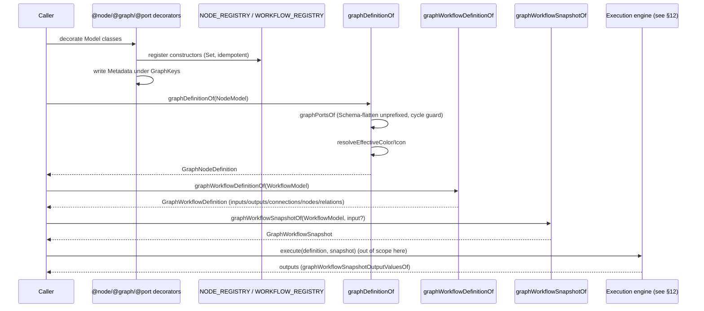
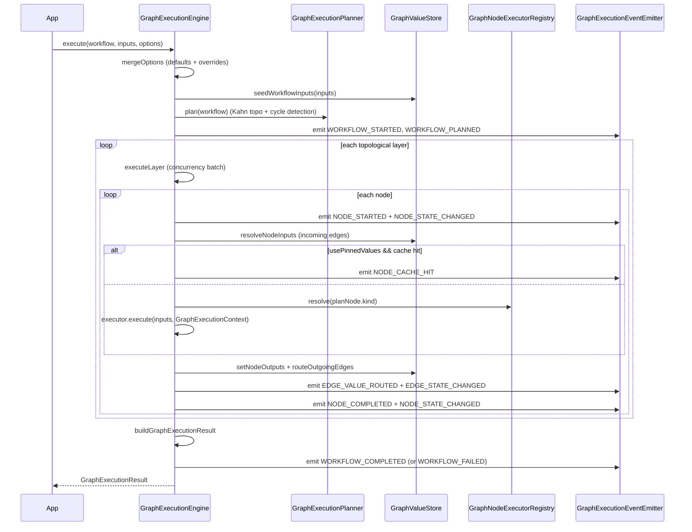

# 08 — Graph Design (Metadata, Snapshot & Execution Engine)

The architecture is detailed in the [Architecture Handbook](../architecture-handbook/06-ui-layer.md).

> **Scope note.** This design covers two related subsystems of the graph feature.
> (1) The `./graph` subpath of `@decaf-ts/ui-decorators`: the framework-neutral
> **graph metadata layer** (`@node`/`@graph`/`@port`/`@input`/`@output`/`@connection`/`@pinnable`),
> the reader that derives `GraphNodeDefinition`/`GraphPortDefinition`/`GraphWorkflowDefinition`,
> the category style registry, and the workflow snapshot serialization/round-trip
> (§§1–7). (2) The **graph execution engine** — planning, `GraphNodeExecutor`/
> `GraphNodeExecutorRegistry`, `GraphValueStore`, pinning service, loops, the
> code sandbox, the event pipeline, and the NestJS execution backend — which
> lives in `integrations/graph` and is specified in [§12 — Graph Execution
> Engine](#12-graph-execution-engine) below. The execution *bridge*
> (`RenderingEngine#renderAsNode`) that connects the two is covered in §6.

## 1. Overview

The graph layer reuses the same `Model` + `Metadata` + `@uimodel` backbone as form rendering to describe visual workflow nodes, ports, and workflows. A graph node *is* a renderable model carrying extra `GraphKeys` metadata; a workflow composes nodes the way `@uichild` composes nested models. The reader flattens Schema-typed `@input`/`@output` ports and resolves effective colors/icons from a category registry; the snapshot module serializes/restores workflow state with a JSON round-trip. The for-angular graph workflow editor is the primary frontend consumer, mapping these definitions and snapshots to a canvas editor.

## 2. Design Principles

- **Graph as decorators, not a separate schema language.** *Why:* reusing `Model`/`Metadata`/`@uimodel` means ports, validation, ordering, and visibility reuse the exact same machinery as forms; one reflection backbone, one render path. *Enforcing test/spec:* `graph.test.ts` composes `@node` over `@model()` and reads node metadata through the same `Metadata` readers used for UI.
- **Schema-flattening decouples the visual contract from the data contract.** *Why:* `@input`/`@output` mark a property as a Schema-typed port whose nested model's matching-direction ports are spliced **unprefixed** into the parent, so a structured payload exposes individual connectable ports on the canvas while the underlying model stays nested and validated. *Enforcing test/spec:* `graph.test.ts` asserts unprefixed splicing, that the carrier property is not itself a port, and `portGroups` one-vs-all (default `"all"`); `@port` on a Schema-typed property keeps the legacy prefixed-composite behaviour, and primitive `@input` is a no-op.
- **Cycle-safe flattening.** *Why:* nested Schema ports could recurse; a `visited` guard in the reader prevents infinite expansion. *Enforcing test/spec:* the reader's `schemaGroupPorts` carries a `visited` set.
- **Category style registry with explicit override.** *Why:* consistent visual identity per category with per-node escape hatches. *Enforcing spec:* resolution order is explicit node `color`/`icon` → category style → `GRAPH_DEFAULT_CATEGORY_STYLE`, via `resolveEffectiveColor`/`resolveEffectiveIcon` consumed by `graphDefinitionOf`/`graphWorkflowDefinitionOf`.
- **Snapshots are versioned and idempotent.** *Why:* workflow state must round-trip across JSON, restore against the current definition, and merge caller overrides without duplication. *Enforcing test/spec:* `graphWorkflowSnapshotOf` deep-clones and idempotently merges; `GRAPH_WORKFLOW_SNAPSHOT_VERSION = 1`; `graph.test.ts` asserts snapshot serialization, restore, and JSON round-trip.
- **Subpath isolation for augmentations.** *Why:* `Metadata.nodes()`/`Metadata.workflows()` and `RenderingEngine#renderAsNode` patch foreign prototypes; importing the root barrel must not pull graph. *Enforcing spec:* the augmentations are attached only when `@decaf-ts/ui-decorators/graph` is imported.

## 3. Graph Decorator Design

| Decorator | Target | Role |
|:----------|:-------|:-----|
| `@node(tag, { kind, category, icon?, color?, ... })` | class | Marks a `Model` as a graph node; composes `@uimodel`; registers the constructor in the in-module `NODE_REGISTRY` `Set`. |
| `@graph(tag, props?)` | class | Marks a `Model` as a workflow root; registers in `WORKFLOW_REGISTRY`. |
| `@port(direction, { handle?, ... })` | property | Declares a port (INPUT/OUTPUT). On a Schema-typed property → legacy composite (prefixed children). |
| `@input(opts?)` / `@output(opts?)` | property | Declares a Schema-flattened port: nested model's matching-direction ports splice **unprefixed** into the parent (carrier property is not a port); sets `graph.schema = true`. Primitive `@input` is a no-op. |
| `@connection({ category, ... })` | property | Declares connection rules / category. |
| `@pinnable({ enabled?, strategy?, includeDependencies? })` | class/property | Pinning metadata (defaults `enabled: true`, `strategy: "manual"`, `includeDependencies: true`). |

Decorators register with the `Decoration.for(...).define(...).apply()` DSL (discoverable/introspectable) and also write raw `Metadata` under `GraphKeys` (`graph`, `graph.node`, `graph.edge`, `graph.port`) for runtime lookup. Registries: `registerNode`, `registerWorkflow`, `graphNodes`, `graphWorkflows`, `resetGraphRegistries`. Re-decoration idempotency relies on the underlying `Set`.

### Port direction & groups

`PortDirection` is `INPUT` | `OUTPUT`. `portGroups` carries the one-vs-all rendering toggle (default `"all"`); declared groups are merged with the default. Leaf-port helpers: `graphLeafPortsOf`, `graphWorkflowInputLeafPortsOf`, `graphWorkflowOutputLeafPortsOf`.

### Category style registry

`registerGraphCategoryStyle(category, style)` feeds `graphCategoryStyleOf`/`resolveEffectiveColor`/`resolveEffectiveIcon`. `GRAPH_VISUAL_STATE_STYLES` and `graphVisualStyleOf` provide visual-state styling. `GRAPH_DEFAULT_CATEGORY_STYLE` is the fallback.

## 4. Reader Design

`graphDefinitionOf(model)` reads `Model.uiModelOf` + `graphNodeMetadataOf`, then `graphPortsOf(model)`:

- For `@input`/`@output` Schema ports → `schemaGroupPorts` splices the nested model's matching-direction ports **unprefixed** into the parent (carrier property is not a port), with a `visited` cycle guard.
- For `@port` Schema ports → expands into prefixed composite children (legacy behaviour).
- For primitive `@input` → no-op.
- Resolves `portGroups` (declared + defaulted `"all"`).
- Resolves `effectiveColor`/`effectiveIcon` (node > category > default).

Returns `GraphNodeDefinition` (`tag`, `ports: GraphPortDefinition[]`, metadata, resolved style).

`graphWorkflowDefinitionOf(model)` additionally splits ports into inputs/outputs/connections and attaches `nodes`/`relations` → `GraphWorkflowDefinition`.

Accessors: `graphNodeMetadataOf`, `graphWorkflowMetadataOf`, `graphPortMetadataOf`, `graphPortDefinitionOf`, `graphPortsOf`.

## 5. Snapshot Design

`graphWorkflowSnapshotOf(model, input?)` normalizes a `GraphWorkflowDefinition` plus caller-supplied state into a versioned `GraphWorkflowSnapshot`:

- `definition` — derived workflow definition.
- `state` — inputs/outputs keyed by path, nodes by id/ref, edges by relation.
- Deep cloning and idempotent merge of supplied overrides.
- `GRAPH_WORKFLOW_SNAPSHOT_VERSION = 1`.

Helpers:

| Helper | Role |
|:-------|:-----|
| `graphWorkflowSnapshotDefinitionOf` | Extract the definition from a snapshot. |
| `graphWorkflowSnapshotRestore` | Re-derive a snapshot against the current definition. |
| `graphWorkflowSnapshotToJSON` / `graphWorkflowSnapshotFromJSON` | JSON round-trip. |
| `graphWorkflowSnapshotInputValuesOf` / `graphWorkflowSnapshotOutputValuesOf` | Extract input/output value maps. |

## 6. Graph Execution Bridge

The brief documents a single, narrow bridge between the graph metadata layer and execution/rendering: `RenderingEngine#renderAsNode` (attached by `graph/overrides/overrides.ts` when the `./graph` subpath is imported) lets a concrete engine render a model *as a graph node*. The full graph execution engine — planning, `GraphNodeExecutor`/`GraphNodeExecutorRegistry`, `GraphValueStore`, pinning service, SSE feedback, NestJS endpoints — lives in `integrations/graph` and is specified in [§12 — Graph Execution Engine](#12-graph-execution-engine) below. This section does not duplicate that surface; it only guarantees that the metadata produced here is the canonical input the execution engine consumes (`GraphNodeDefinition`/`GraphWorkflowDefinition`/`GraphWorkflowSnapshot`).

## 7. Functional Requirements

- **FR-1 (Build a workflow).** Decorating a `Model` with `@node`/`@graph`/`@port`/`@input`/`@output` and calling `graphDefinitionOf`/`graphWorkflowDefinitionOf` yields a `GraphNodeDefinition`/`GraphWorkflowDefinition` with ports split by direction, Schema-flattened ports spliced unprefixed, and effective color/icon resolved.
- **FR-2 (Invalid port connection).** Port/connection rules are carried as `GraphConnectionRule` metadata on `@connection`/`@port`; the reader exposes them so the editor/execution layer can reject invalid connections. (Connection-rule *enforcement* is the editor/execution layer's responsibility; this layer only declares and exposes the rules.)
- **FR-3 (Snapshot restore).** `graphWorkflowSnapshotRestore` re-derives a snapshot against the current definition; `graphWorkflowSnapshotToJSON` → `graphWorkflowSnapshotFromJSON` round-trips without loss.
- **FR-4 (Execution result).** The execution engine (out of scope here) consumes `GraphWorkflowDefinition` + `GraphWorkflowSnapshot` inputs and produces outputs accessible via `graphWorkflowSnapshotOutputValuesOf`. This layer provides the canonical input/output value maps.

### Build workflow → execute → snapshot



### Snapshot round-trip

```mermaid
sequenceDiagram
    participant Caller
    participant Snap as graphWorkflowSnapshotOf
    participant ToJSON as graphWorkflowSnapshotToJSON
    participant FromJSON as graphWorkflowSnapshotFromJSON
    participant Restore as graphWorkflowSnapshotRestore
    Caller->>Snap: graphWorkflowSnapshotOf(model, input)
    Snap->>Snap: normalize definition + state; deep clone; idempotent merge
    Snap-->>Caller: GraphWorkflowSnapshot (v1)
    Caller->>ToJSON: ToJSON(snapshot)
    ToJSON-->>Caller: JSON string
    Caller->>FromJSON: FromJSON(json)
    FromJSON-->>Caller: GraphWorkflowSnapshot
    Caller->>Restore: Restore(snapshot)
    Restore->>Restore: re-derive against current definition
    Restore-->>Caller: restored GraphWorkflowSnapshot
```

## 8. Acceptance Criteria

| Criterion | Expected behaviour |
|:----------|:-------------------|
| Valid workflow | `graphWorkflowDefinitionOf(WorkflowModel)` returns a definition with ports split into inputs/outputs/connections, `nodes`/`relations` attached, Schema-flattened `@input`/`@output` ports spliced unprefixed, and effective color/icon resolved. |
| Invalid port connection | `@connection`/`@port` carry `GraphConnectionRule` metadata exposed by the reader; an invalid connection is rejected by the editor/execution layer using that metadata. (This layer declares and exposes rules; it does not enforce them.) |
| Snapshot restore | `graphWorkflowSnapshotRestore` re-derives a snapshot against the current definition; `graphWorkflowSnapshotToJSON` → `graphWorkflowSnapshotFromJSON` round-trips without loss; `graphWorkflowSnapshotInputValuesOf`/`OutputValuesOf` extract value maps. |
| Execution result | The execution engine (out of scope) consumes the `GraphWorkflowDefinition` + snapshot inputs and produces outputs accessible via `graphWorkflowSnapshotOutputValuesOf`. |

## 9. Environment Variables

**None.** The `./graph` subpath reads no environment variables. Notable defaults: `GRAPH_WORKFLOW_SNAPSHOT_VERSION = 1`; `pinnable` defaults `enabled: true`, `strategy: "manual"`, `includeDependencies: true`; `portGroups` default `"all"`.

## 10. Usage Example

```typescript
import { Model, model, required } from "@decaf-ts/decorator-validation";
import { uielement } from "@decaf-ts/ui-decorators";
import { node, graph, port, input, output, graphDefinitionOf,
         graphWorkflowDefinitionOf, PortDirection } from "@decaf-ts/ui-decorators/graph";

@node("graph-tool", { kind: "tool", category: "AI", icon: "tool", color: "#2196f3" })
@model()
class GraphToolModel extends Model {
  @required()
  @uielement("input", { label: "Prompt" })
  @port(PortDirection.INPUT, { handle: "prompt" })
  prompt!: string;

  @uielement("textarea", { label: "Result" })
  @port(PortDirection.OUTPUT)
  result!: string;
}

const def = graphDefinitionOf(GraphToolModel);
// def.tag === "graph-tool"
// def.ports = [{ property: "prompt", direction: INPUT }, { property: "result", direction: OUTPUT }]
```

## 11. Open Questions / Risks

- **`@pinnable` long-term home.** The brief records `@pinnable` in `ui-decorators/graph`, while [§12 — Graph Execution Engine](#12-graph-execution-engine) recommends moving `@pinnable` to a backend-only `engine/decorators.ts`. Unresolved (cross-referenced as a pinning open question in §12).
- **Connection-rule enforcement.** This layer declares `GraphConnectionRule` metadata but does not enforce it; enforcement is the editor/execution layer's job. Consumers must not assume the reader rejects invalid connections.
- **Category-style registry coverage.** `registerGraphCategoryStyle`, the resolvers, and `GRAPH_VISUAL_STATE_STYLES` are not directly asserted by `graph.test.ts` (per the brief's coverage-gap notes).
- **`@connection` and `@pinnable` test coverage.** Both are present in the API but not directly asserted in `graph.test.ts`.
- **Execution engine boundary.** Only `RenderingEngine#renderAsNode` is the documented bridge here; the rest of the execution surface is owned by `integrations/graph` (see [§12 — Graph Execution Engine](#12-graph-execution-engine)).

## 12. Graph Execution Engine

The execution engine lives in `@decaf-ts/integrations/graph` (`integrations/src/graph/engine/`)
and consumes the metadata layer defined in §§1–7 as its canonical input. This
section is grounded in the research brief (`_research-briefs/08-integrations.md`,
graph section) and the live source under `integrations/src/graph/` (plus the
NestJS backend in `integrations/src/nest/graph/`). Where the brief is thin on a
detail, the gap is stated explicitly rather than inventing an API.

### 12.1 Overview

`GraphExecutionEngine` is a reference, backend-agnostic execution engine for
graph workflows. It takes a `GraphWorkflowDefinition` plus workflow inputs,
plans it into topological layers, seeds inputs into a `GraphValueStore`,
executes layer-by-layer with configurable concurrency, routes values along
edges, emits structured events through Decaf's `Observable` pipeline, and
returns a `GraphExecutionResult`. The engine is constructed from injected
dependencies — a `GraphNodeExecutorRegistry`, a `GraphValueStoreAdapter`, an
optional `GraphExecutionEventEmitter`, an optional `CodeSandboxEvaluator`, and
default `GraphExecutionOptions` — so the same graph definitions run in-process
for tests and behind a Nest controller in production (`GraphExecutionEngine.ts:53-104`).

Public surface (`./graph`): `GraphExecutionEngine` + config; planning
(`GraphExecutionPlanner`/`GraphExecutionPlan`/`GraphTopology`/`GraphRelationResolver`);
pinning (`GraphPinningService`/`GraphPinningPolicy`/`GraphPinningDependencyResolver`);
store (`GraphValueStore`/`GraphValueStoreAdapter`/`InMemoryGraphValueStoreAdapter`);
loops (`Foreach`/`While`/`UntilGraphNodeExecutor`, `GraphConditionEvaluator`/
`ConditionExpressionEvaluator`); executors (`CodeGraphNodeExecutor`/
`SwitchGraphNodeExecutor`/`LogGraphNodeExecutor`/`BreakGraphNodeExecutor`,
`CodeSandboxEvaluator`/`IsolatedVmCodeSandboxEvaluator`); registry
(`GraphNodeExecutorRegistry`/`GraphNodeExecutorResolver`); events
(`GraphExecutionEventEmitter`/`GraphExecutionEventFactory`/`GraphExecutionObserver`);
snapshots (`GraphExecutionSnapshotMapper`); validation
(`GraphDefinitionValidator`/`GraphPortSchemaResolver`/`GraphValueValidator`);
errors; engine constants. `./graph/shared` exposes frontend-safe node
declarations, `GraphExecutionStateMapper`, and visual-state styles.

### 12.2 Design principles

- **Engine is a registry + value store + sandbox evaluator, injected.** *Why:* the engine never wires its own executors or sandbox by default; consumers (e.g. `createDemoEngineConfig`) register what they need. This keeps executor wiring explicit and avoids import-order surprises. *Enforcing source:* `GraphExecutionEngineConfig.registry` is required; `codeSandboxEvaluator` is optional (`GraphExecutionEngine.ts:54-65,93-101`).
- **Imperative executor registry, dispatched by `kind`.** *Why:* there is no `@executor` decorator; executors are plain objects implementing `GraphNodeExecutor` and registered via `registry.register(kind, executor)`. The engine resolves the executor at run time with `registry.resolve(planNode.kind)` (`GraphExecutionEngine.ts:420`; `GraphNodeExecutorRegistry.ts:13-49`). Resolution throws `GRAPH_EXECUTOR_NOT_FOUND` when no executor is registered for a kind.
- **Topological planning with Kahn cycle detection.** *Why:* a workflow must execute in dependency order; cycles are unsupported and rejected at plan time. *Enforcing source:* `GraphExecutionPlanner.plan` validates unique node ids, resolves node definitions (decorated Model via `graphDefinitionOf`, or a raw `GraphNodeDefinition` stub), resolves relations via `GraphRelationResolver`, then builds layers with Kahn's algorithm; un-plannable nodes throw `GraphCycleError`, duplicate ids throw `GraphTopologyError` (`GraphExecutionPlanner.ts:40-244`). Workflow-boundary edges (`GRAPH_WORKFLOW_BOUNDARY = "$workflow"`) are excluded from inter-node dependency counting.
- **Layer execution with bounded concurrency.** *Why:* nodes within a layer are independent and may run in parallel; layers run sequentially. *Enforcing source:* `executeLayer` slices the layer into batches of `concurrency` and runs each batch with `Promise.all` (`GraphExecutionEngine.ts:314-333`).
- **Value store separates runtime values from persistent cache.** *Why:* runtime values (workflow inputs, node outputs, workflow outputs) live in memory for the run; cached/pinned values are delegated to a `GraphValueStoreAdapter` so a run can be replayed or persisted. *Enforcing source:* `GraphValueStore` keeps an in-memory `runtimeValues` map keyed by node id (workflow boundary keyed by `GRAPH_WORKFLOW_BOUNDARY`) and forwards `readCached`/`writeCached`/`deleteCached` to the adapter (`GraphValueStore.ts:19-87`); the default adapter is `InMemoryGraphValueStoreAdapter`.
- **Pinning is all-or-nothing across upstream pin sets, fingerprint-keyed, TTL'd.** *Why:* a pinned node must stay valid only if every upstream dependency that produced its inputs is also pinned and unchanged. *Enforcing source:* `GraphPinningService.pinNode` builds the pin set via `GraphPinningDependencyResolver.getPinSet`, validates every member is pinnable (`GraphPinningPolicy.canPin`), pins in topological order, and writes a `GraphCachedValue` keyed by `{workflowId, nodeId, fingerprint, namespace}`; `readPinnedValue` returns `undefined` when the cached entry is expired (`GraphPinningService.ts:40-121`). Fingerprints are computed by `computeFingerprint` over `workflowId`/`nodeId`/`nodeKind`/definition version/inputs/dependency fingerprints, using a deterministic non-cryptographic `simpleHash` (browser/Node portable) and stable key-sorted serialization (`GraphPinningService.ts:144-239`).
- **Loops re-enter the engine with `parentRunId` propagation.** *Why:* a loop body is itself a workflow executed through the same engine, so its events carry the parent run id and a path. *Enforcing source:* `ForeachGraphNodeExecutor` (constructed with the engine) calls `engine.execute(bodyWorkflow, ..., { parentRunId, path })` per item/slice, collects results in order, honours a `maxIterations` limit (`GRAPH_DEFAULT_MAX_FOREACH_ITERATIONS = 1000`), and terminates early on a `GraphBreakSignal` from a `core.flow.break` node (`ForeachGraphNodeExecutor.ts:38-60`; `While`/`Until` executors follow the same re-entry pattern). The brief records that `While`/`Until` executors are not unit-tested — a known gap, not a verified guarantee.
- **Code execution is sandboxed and opt-in.** *Why:* Code/Switch node bodies are user-authored; the engine does *not* wire a sandbox by default — consumers pass `codeSandboxEvaluator` in config or Code/Switch nodes throw `GRAPH_CODE_SANDBOX_NOT_CONFIGURED`. *Enforcing source:* `CodeSandboxEvaluator` is a pluggable interface (`evaluate(ctx)`) enforcing no system-API access, placeholder syntax (`{{ $input.foo }}`, `{{ $node["Name"].output }}`, `{{ $vars.bar }}`), and static validation (`CodeSandboxEvaluator.ts`). `IsolatedVmCodeSandboxEvaluator` is the reference implementation: it transpiles TS via `typescript`, validates the AST with `acorn`/`acorn-walk` (rejecting `import`/`export`/`eval`/`new Function` and a blocked-identifier set including `process`/`require`/`global`/`fetch`/`module`/`exports`), and runs the code in an `isolated-vm` V8 isolate with a timeout (default `1000ms`) and memory limit (default `32MB`) (`IsolatedVmCodeSandboxEvaluator.ts:1-70`). `isolated-vm` is a native addon requiring a build toolchain.
- **Events ride a single `Observable` pipeline.** *Why:* one observer pipeline serves execution progress, visual-state updates, and run logs; there is no second out-of-band channel. *Enforcing source:* `GraphExecutionEngine implements Observable<[GraphExecutionObserver], [GraphExecutionEvent]>` with `observe`/`unObserve`/`updateObservers` delegating to `GraphExecutionEventEmitter` (`GraphExecutionEngine.ts:86-134`). Event types (`GraphExecutionEventType`) cover workflow lifecycle (`WORKFLOW_STARTED`/`PLANNED`/`COMPLETED`/`FAILED`/`CANCELLED`), node lifecycle (`NODE_STARTED`/`OUTPUT`/`COMPLETED`/`FAILED`/`SKIPPED`/`CACHE_HIT`/`PINNED`/`UNPINNED`), edges (`EDGE_VALUE_ROUTED`), visual state (`NODE_STATE_CHANGED`/`EDGE_STATE_CHANGED`), run logs (`GRAPH_RUN_LOG`), loops (`LOOP_*`), validation, and store ops (`shared/constants.ts:104-144`). SSE topics are derived by `graphRunTopicOf`: `graph.run`, `graph.run.log`, `graph.run.state`.

### 12.3 Execution sequence



### 12.4 Functional requirements

- **FR-E1:** `GraphExecutionEngine.execute(workflow, inputs, options)` plans the workflow into topological layers (Kahn cycle detection), seeds inputs into a `GraphValueStore`, executes layer-by-layer with concurrency, routes values along edges, and emits structured events.
- **FR-E2:** Executors are registered imperatively in a `GraphNodeExecutorRegistry` (no `@executor` decorator) and resolved by node `kind`; an unregistered kind throws `GRAPH_EXECUTOR_NOT_FOUND`.
- **FR-E3:** Pinning is all-or-nothing across upstream pin sets with TTL'd cached values; when `usePinnedValues` is set and a valid pinned value exists, the node is short-circuited and emits `NODE_CACHE_HIT`.
- **FR-E4:** Loops re-enter the engine via `engine.execute(bodyWorkflow, ...)` with `parentRunId` propagation; `Foreach` honours `maxIterations` and terminates early on a `GraphBreakSignal`.
- **FR-E5:** Code/Switch nodes throw `GRAPH_CODE_SANDBOX_NOT_CONFIGURED` when no `codeSandboxEvaluator` is supplied; when `IsolatedVmCodeSandboxEvaluator` is supplied, user code is transpiled, AST-validated, and run in an `isolated-vm` isolate with timeout/memory limits.
- **FR-E6:** All execution and visual-state events flow through the single `Observable` pipeline (`observe`/`updateObservers`); run logs resolve to the `graph.run.log` SSE topic and node/edge state to `graph.run.state`.
- **FR-E7 (NestJS backend):** `GraphExecutionController` exposes `POST /graph/execute` (runs the engine and persists the result), `GET /graph/events` (SSE stream of all engine events), `GET /graph/results/:runId` (retrieves a persisted result), and `PUT /graph/workflow/:id` (saves a workflow snapshot).

### 12.5 Acceptance criteria

| Criterion | Expected behaviour |
|:----------|:-------------------|
| Linear workflow | A registry with `math.add`/`math.multiply` executors and a linear workflow yields `result.outputs.result === 10` for `execute(linearWorkflow(), {a:2,b:3})`. |
| Cycle | A workflow with a cycle is rejected by the planner with a `GraphCycleError`. |
| Code node, no sandbox | Execution reaching a Code node with no `codeSandboxEvaluator` throws `GRAPH_CODE_SANDBOX_NOT_CONFIGURED`. |
| Pinned cache hit | With `usePinnedValues` and a valid pinned value, the node emits `NODE_CACHE_HIT` and skips executor invocation. |
| SSE backend | `GET /graph/events` streams engine events as SSE `message` frames; `POST /graph/execute` returns `{runId, status, outputs}`. |

### 12.6 NestJS execution backend

`@decaf-ts/integrations/nest/graph` wires the engine behind a Nest controller
(`integrations/src/nest/graph/`):

- `GraphExecutionController` (`@Controller("graph")`) subscribes to the engine's event pipeline in its constructor and exposes:
  - `POST /graph/execute` — calls `engine.execute(workflow, inputs)`, persists the result via `GraphResultService` (persistence failures are swallowed so they never mask a successful execution), and returns `{runId, status, outputs}`.
  - `@Sse("events") GET /graph/events` — streams every engine event through an RxJS `Subject` as a `MessageEvent` whose `data` is a JSON array `["graph", eventType, runId, {...}]`.
  - `GET /graph/results/:runId` — returns a persisted result or `NotFoundException`.
  - `PUT /graph/workflow/:id` — saves a workflow snapshot via `GraphWorkflowService`.
- `GraphExecutionModule` bundles the controller, the engine, `GraphResultService`, and `GraphWorkflowService`.
- `GraphExecutorRegistryFactory` (`createGraphExecutorRegistry`, `createDemoEngineConfig`) builds a populated registry: demo `math.*`/`core.flow.*`/`core.agent` executors, plus loop/Code/Switch/Break executors registered in `onEngineCreated` (they need an engine back-reference), and wires `IsolatedVmCodeSandboxEvaluator` so the Code node runs in a real isolate.
- `main.ts` bootstraps the backend on `GRAPH_BACKEND_PORT` / `argv[2]` / default `3000`.
- Result/workflow persistence uses `GraphExecutionResultModel`/`GraphWorkflowModel` via `GraphResultService`/`GraphWorkflowService`.

### 12.7 Environment variables

| Variable | Reader | Purpose |
|:---------|:-------|:--------|
| `GRAPH_BACKEND_PORT` (or `argv[2]`) | `src/nest/graph/main.ts` | Overrides the default graph backend port `3000`. |

The engine itself reads no environment variables. Run-option defaults:
`concurrency=4` (`GRAPH_DEFAULT_CONCURRENCY`), `failFast=true`,
`usePinnedValues=true`, `validateInputs=true`, `validateOutputs=true`,
`writeThroughCache=false` (`GraphExecutionEngine.ts:726-741`). The
`GRAPH_WORKFLOW_BOUNDARY` constant (`"$workflow"`) is the synthetic node id used
for workflow-level inputs/outputs in the value store and plan.

### 12.8 Usage example

```typescript
import { GraphNodeExecutorRegistry, GraphExecutionEngine } from "@decaf-ts/integrations/graph";

const registry = new GraphNodeExecutorRegistry();
registry.register("math.add", { execute: (i) => ({ sum: Number(i.a) + Number(i.b) }) });
registry.register("math.multiply", { execute: (i) => ({ product: Number(i.x) * 2 }) });
const engine = new GraphExecutionEngine({ registry });
const result = await engine.execute(linearWorkflow(), { a: 2, b: 3 }); // outputs.result === 10
engine.observe({ refresh: async (event) => console.log(event.type, event.nodeId) });
```

### 12.9 Open questions / risks

- **`@pinnable` long-term home.** The metadata layer declares `@pinnable` in `ui-decorators/graph`, but pinning is a backend concern; the recommended long-term home is a backend-only `engine/decorators.ts`. Unresolved (cross-referenced from §11).
- **Validation options are silently ignored.** `mergeOptions` defaults `validateInputs`/`validateOutputs` to `true`, but `execute()` never invokes `GraphValueValidator`/`GraphDefinitionValidator`/`GraphPortSchemaResolver` — the validators exist but are not wired (recorded inaccuracy, see the handbook Integrations chapter `§17` `[graph]` entries).
- **Code sandbox not wired by default.** `IsolatedVmCodeSandboxEvaluator` is described as "the default" in some shared node declarations, but the engine leaves `codeSandboxEvaluator` `undefined` unless supplied; Code/Switch nodes throw out of the box (recorded inaccuracy).
- **Event `nodeId` inconsistency.** Engine node events use `planNode.id`, but executor-emitted events go through `GraphExecutionContext.emit` which hard-codes `nodeId: this.node.name`; when a node id differs from its definition `name`, `NODE_STARTED`/`NODE_COMPLETED` carry a different `nodeId` than `LOOP_*`/`NODE_OUTPUT` events (recorded inaccuracy).
- **`GraphTopology.isBoundary` hard-codes `"$workflow"`** instead of the `GRAPH_WORKFLOW_BOUNDARY` constant, and `GraphPinningService` imports `GRAPH_PINNING_METADATA_KEY` only to `void` it (recorded inaccuracies).
- **Untested execution paths.** The brief records that `While`/`Until` executors, the validators, the snapshot mapper, `LogGraphNodeExecutor`, `GraphNodeExecutorResolver`, the pinned cache-hit path, and the `validateInputs/Outputs` options are not covered by unit tests; requirements depending on those paths are stated against documented source behaviour and flagged as gaps, not verified guarantees.
