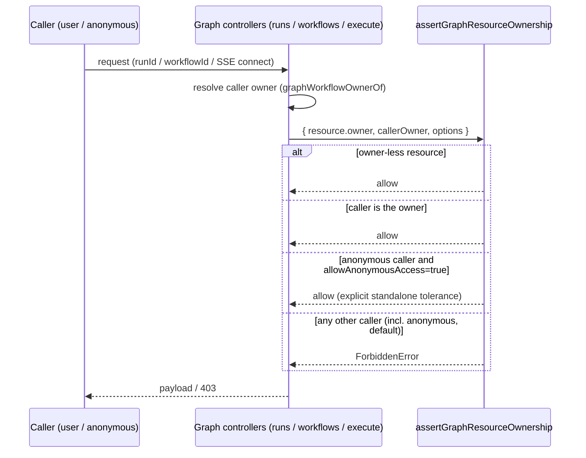
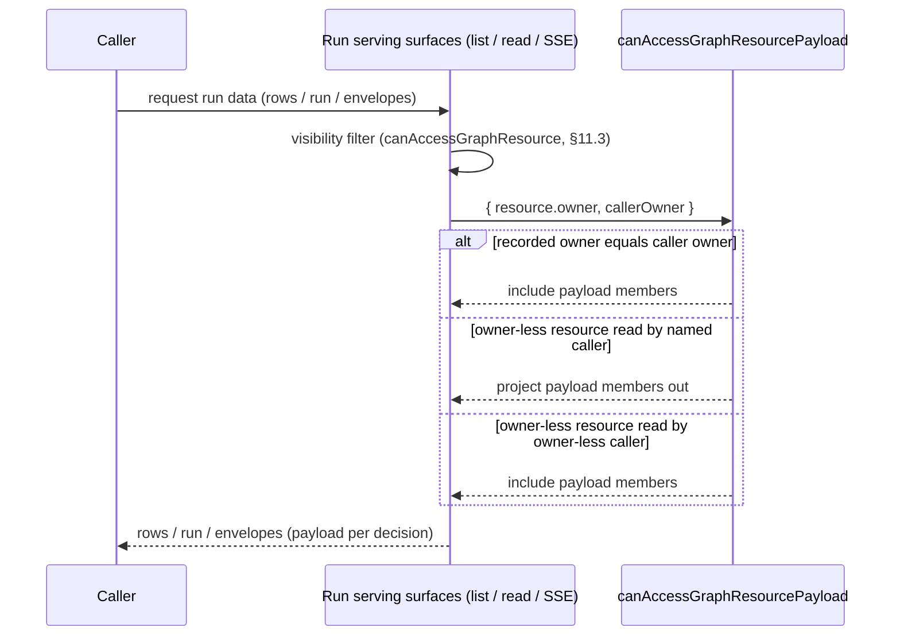
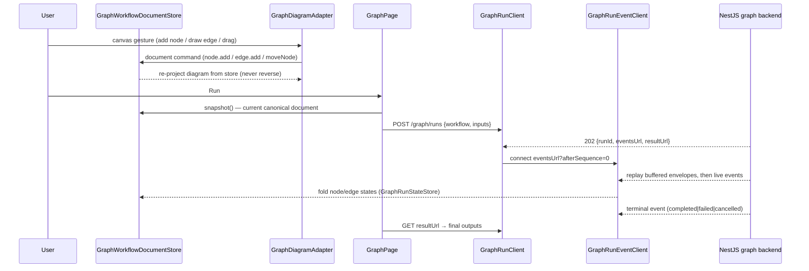

# 08 — Graph Design (Canonical Documents, Node Catalogue & Execution Engine)

The architecture is detailed in the [Architecture Handbook](../architecture-handbook/06-ui-layer.md) (metadata layer), [../architecture-handbook/07-integrations.md](../architecture-handbook/07-integrations.md) (engine/catalogue surface), and [../architecture-handbook/08-frontend-engines.md](../architecture-handbook/08-frontend-engines.md) (Angular editor).

> **Scope note.** This design covers the graph feature. The whole backend
> lives in the dedicated, backend-only module **`as-graph`**
> (`@decaf-ts/as-graph`, git submodule at the umbrella repo root); the
> decorated authoring metadata layer and the canonical document/manifest
> contracts live in its `shared` subpath, and the **NestJS graph backend** in
> its `nest` subpath. **§0** is normative for the **node rules taxonomy**,
> the **locale-key structure**, the **auth model**, the complete
> **serialized workflow format**, and the two supported **workflow authoring
> paths**. The specification of record is
> [DECAF_50.md](../../specifications/DECAF_50.md) (owned by the Delivery
> Documentation Specialist); this document describes the delivered system and
> references, never restates, that record.

## 0. Node rules, locale-key structure, auth model & the serialized workflow format

> **Scope.** The node rules in this section are binding and reflect the
> implementation on the `as-graph` working tree. Paths are relative to
> `as-graph/` unless prefixed otherwise. This module is **backend-only**: no
> Angular/storybook/UI imports anywhere (`src/shared` holds frontend-safe
> *declarations* only — no components, no engine code).

### 0.1 Module layout & exports

| Surface | Location | Contents |
|:--------|:---------|:---------|
| Package root | `@decaf-ts/as-graph` (`src/index.ts`) | Engine + node re-exports (backend convenience surface). |
| `shared` subpath | `@decaf-ts/as-graph/shared` (`src/shared/graph/`) | Frontend-safe contracts: decorators, reader, constants, catalog (manifest/parameter schemas), document (canonical document model), persisted `GraphRunModel`/`GraphWorkflowModel`. |
| `nest` subpath | `@decaf-ts/as-graph/nest` (`src/nest/graph/`) | `GraphExecutionModule.forRoot`, catalogue/workflow/run controllers, `GraphExecutorRegistryFactory`. |
| Engine | `src/engine/` | `auth`, `catalog`, `errors`, `events`, `execution`, `loops`, `pinning`, `planning`, `registry`, `runs`, `snapshots`, `store`, `validation`, services. |
| Node declarations | `src/node/` | `@node`-decorated built-in node classes per category (`triggers/`, `flow/`, `utility/`, `agents/`, `boundary/`), `base.ts`, `manifests.ts` (structural overlays). |
| Locale assets | `assets/i18n/en.json` | Repo-root `assets/`; shipped via `package.json` `files`. |
| Executor pairing | `src/engine/catalog/GraphBuiltInRegistrations.ts` | `registerBuiltInGraphNodes(catalogue)` pairs every built-in kind's compiled manifest with the executor derived from the node class (`executorOf` → `instantiate(graphNodeConfig(context.node))`). |

Node kinds shipped (one `@node` class each, `src/node/**`): triggers
`core.trigger.manual|webhook|schedule|event|form|chat`, flow
`core.flow.if|switch|delay|log|errorBoundary|humanApproval|break`, loops
`graph-foreach-loop-node|graph-while-loop-node|graph-until-loop-node`,
utility `core.utility.map|code|utility-log`, agent `core.agent`, boundary
`graph-input-value-node|graph-output-value-node`.

### 0.2 Node rules (normative taxonomy)

These rules are binding for every existing and future node class.

**R1 — `@node()` metadata is graphical only.** The `@node(tag, meta)`
decorator (`src/shared/graph/decorators.ts`) composes `@uimodel` + graph
metadata under `GraphKeys.NODE` and registers the constructor; the metadata
(kind, category, color, icon, width/height, shape, sizeRules, labels,
connectionRules, inspection, … — `src/shared/graph/constants.ts`
`GraphNodeMetadata`) feeds the **compiled `GraphNodeManifest`** — listing,
categorization and rendering control only. It is **never read for
execution**: executors hydrate the node instance from the workflow
document's instance state (`graphNodeConfig(instance)` = instance
`metadata` + `parameters` + `loop`, `src/node/base.ts`) and read their own
hydrated properties via `this.*` (`GraphNode` base class; concrete example:
`CodeNode.execute` reads `this.timeoutMs`, `this.defaultCode`,
`config.code`; loop nodes read `this.*` through `extractLoopMetadata`).
Execution-relevant values must therefore be node **properties**, not
`@node` metadata (e.g. If
`condition`/`else`, Switch `cases`/`hasDefault`/`defaultPort`, loops
`maxIterations`/`condition`/`*Port`, Log `level`, Code
`defaultCode`/`timeoutMs`).

**R2 — every node has a default `@input()` property, except the input
boundary node.** The default input is properly typed (with the expected
`Model` class when known) and represents both the default connection for
data arriving from the workflow and the main flow of the graph. Implemented
on all non-entry nodes (`CodeNode.input` typed `CodeInputSchema`,
`GraphOutputValueNode.value`, `core.agent`, loops, …); triggers and
`graph-input-value-node` are entry nodes and declare none.

**R3 — every node has at least one default `@output()` property, with
declared exceptions.** Analogous to R2: properly typed with the expected
output `Model` when known and represents the flow of the graph. Exceptions
are the output boundary node (`graph-output-value-node` — receives,
produces nothing) and other terminal/exception nodes (`core.flow.break` has
a `value` input only). Declared carve-outs recorded here: **output boundary
node** and **break node**.

**R4 — every port type has its own decorator wrapping `@port()`.**
`@input(opts)` / `@output(opts)` / `@connection(opts)` each call
`port(direction, { ...graph, ...flags })`
(`src/shared/graph/decorators.ts`). `@input`/`@output` set `schema: true`
(Schema-flattening: a Model-typed carrier splices the nested model's
matching-direction ports **unprefixed** — e.g. `CodeInputSchema.code`/`.data`
splice into `CodeNode`; the carrier itself is not a port); primitive-typed
`@input`/`@output` properties are plain ports. `@connection` declares a
third port kind — structural dependency ports (rendered on the bottom side
of the node, colored by `category`: `model`/`memory`/`workspace` via
`registerGraphCategoryStyle`; carry no workflow data; e.g. the Agent node's
`model`/`memory`/`workspace`). The node's analog properties are decorated
as such. `@pinnable({...})` is node metadata (pinning strategy), not a
port.

**R5 — property taxonomy (exhaustive).** A node class's properties are
**only** one of the following; there are no other options:

| # | Category | Decoration | Persisted | Execute reads |
|:--|:---------|:-----------|:----------|:--------------|
| 1 | Ports (default data-in, default data-out, additional) | `@input` / `@output` / `@connection` (wrapping `@port`) | connection state in the document's `edges`; literal/expression values in `inputBindings`/`parameters` | `request.inputs` (routed edge values) |
| 2 | User-changeable properties | `@uielement(...)` (no `@input`) | with the workflow (node instance `parameters`) | `this.<prop>` |
| 3 | Expose-as-port properties (user may fill-and-save **or** expose as a port) | `@uielement` **and** `@input({ userControlled: true })` | filled value with the workflow (serialized in `parameters`) | `this.<prop>` when filled; `request.inputs` when connected via the port |
| 4 | Extra output ports the user has **no** control over | `@output` (optional or required) | — | produced by `execute` |
| 5 | Extra output ports the user **has** control over | `@output` + `@uielement` (enablement/expose choice; e.g. Switch branches via `outputBindings`) | choice with the workflow (`outputBindings`) | produced by `execute` |
| 6 | Private internal properties | private class members | never | internally only — **avoid in general** |

`userControlled: true` is implemented as `GraphPortMetadata.userControlled`
(`src/shared/graph/constants.ts`); the manifest compiler marks such ports
`configurable: true` so the renderer offers the fill-vs-expose choice
(`src/shared/graph/catalog/GraphManifestCompiler.ts`). Applied to
`If.condition`/`If.else`, loops' `maxIterations`/`condition`/`*Port`,
Log/UtilityLog `level`, Code `defaultCode`. A `@uielement` property
**without** `@input` (e.g. `CodeInputSchema.language`) is category 2 only.

**R6 — validation decoration.** Node properties carry Decaf validation
decorators as needed (`@required`, `@option([...])`, `@type(String)`,
`@hidden()`, …) so the model validation mechanism still works and the
graph validation stages can validate instances against the compiled
schemas. When set, values are stored as part of the workflow (node
instance `parameters`).

**R7 — code-expression / text-template alternatives for user-controlled
properties.** Every user-controlled property value (categories 2, 3, 5)
may be provided, instead of a straight literal, as a `GraphValueTemplate`
(`src/shared/graph/document/GraphValueTemplate.ts`): either
`mode: "expression"` — code evaluated with the code-evaluator VM under its
default settings (the pluggable `CodeSandboxEvaluator`; the shipped default
is `IsolatedVmCodeSandboxEvaluator`, `src/engine/execution/`) — or
`mode: "template"` — a text template evaluated through the same evaluation
machinery to produce a template string with the necessary replacements.
Templates are JSON-safe, guarded (`isGraphValueTemplate`), declare an
optional `language` (`GRAPH_VALUE_TEMPLATE_LANGUAGES`:
`javascript`/`typescript` for expressions, `json`/`text` for templates;
mode defaults via `graphValueTemplateDefaultLanguage`), and are **persisted
in the node instance's `parameters`**, so they survive save/load
round-trips with the workflow. Resolution contract:
`resolveGraphValueTemplate(value, evaluate)`.

**R8 — node defaults are property default values.** A node's default
configuration is expressed as TypeScript property initializers, not
`@node` metadata (e.g. `language: string = GRAPH_CODE_DEFAULT_LANGUAGE`;
`GRAPH_CODE_DEFAULT_TIMEOUT_MS` applied when `timeoutMs` is unset).

**R9 — hydration & instantiation.** Concrete node classes extend
`GraphNode<INPUT, OUTPUT>` (`src/node/base.ts`), which extends `Model` and
runs `Model.fromModel(this, arg)` in its constructor, so a node created via
`instantiate(graphNodeConfig(instance))` has all decorated configuration
properties populated from the document — plain `new NodeXXX({...})`
behaviour without a separate hydration step. `execute` is an **instance**
method (reads `this.*`); `applyMetadata` is the single kept `static`
helper (genuinely stateless). A kind that forgets to implement `execute`
fails fast with `GRAPH_NODE_EXECUTE_NOT_IMPLEMENTED`.

**R10 — worked example: the Code node** (`src/node/utility/code/node.ts`,
kind `core.utility.code`) — the reference application of R1–R9:

- `input!: CodeInputSchema` with `@input({ handle: "input", model:
  CodeInputSchema })` — the **default input** is a schema group; the nested
  model's `@input` members splice unprefixed. The schema separates the
  board's required distinction between the **default data input** and the
  **optional port-provided property**:
  - `data?: unknown` — `@input({ handle: "data" })` + `@hidden()`, **no
    `@uielement`**: the default data input (canvas port only, never a CRUD
    field).
  - `code!: string` — `@required` + `@input({ handle: "code" })` +
    `@uielement("code-editor")`: appears as a port **and** in the CRUD
    modal (an optional port-provided property).
- `timeoutMs?: number` — `@uielement` (number field) + `@input({ handle:
  "timeoutMs" })`: **user-controllable sandbox timeout**, read via
  `this.timeoutMs ?? GRAPH_CODE_DEFAULT_TIMEOUT_MS` and forwarded to the
  `CodeSandboxContext` (R1 in action: the timeout left `@node` metadata and
  became a property).
- `defaultCode?: string` — `@uielement("code-editor")` +
  `@input({ handle: "defaultCode", userControlled: true })`: the
  fill-or-expose category (R5 #3).
- `language` — inside `CodeInputSchema`: `@required` +
  `@option([...GRAPH_CODE_LANGUAGES])` (`["javascript","typescript"]`) +
  `@type(String)` + `@uielement` select labelled
  `graph.node.utility.code.fields.language.label`; defaults to
  `"javascript"` (R6 + R8). `execute` forwards it to the sandbox evaluator.
- `result!: unknown` — `@required` + `@output({ handle: "result" })`: the
  default output.
- `@node` metadata carries only graphical fields (category `Utility`,
  color, icon, size, labels) plus locale-keyed `title`/`description`.

### 0.3 Locale-key structure (normative)

All node string metadata is **locale keys**, never literal user-facing
text. The JSON source of truth is `assets/i18n/en.json`; its organization
**mirrors the node category organization** (board rule: "the strings for
the nodes must keep the same node category organization as the node
itself"):

```jsonc
{
  "graph": {
    "node": {
      "categories": { "trigger": "Trigger", "flow_control": "Flow Control",
                       "utility": "Utility", "loop": "Loop",
                       "agent": "Agent", "boundary": "Boundary" },
      "connectionCategories": { "model": "Model", "memory": "Memory",
                                 "workspace": "Workspace" },
      "<category>": {                       // same grouping as src/node/<category>/
        "<node>": {
          "name": "…localized…",
          "description": "…localized…",
          "ports": { "<port-category>": { "<portId>": { "label": "…",
                                                          "placeholder": "…" } } },
          "fields": { "<prop>": { "label": "…", "placeholder": "…",
                                   "options?": { … } } }
        }
      }
    }
  }
}
```

Rules (all enforced on the working tree — 126 referenced `graph.node.*` keys,
0 missing):

1. **`ports: { <category>: { … } }`** — port wrapper locale keys are
   grouped under the node's `ports` object **by connection category**:
   `input`/`output` direction groups, plus connection categories
   (`model`/`memory`/`workspace`) for `@connection` ports (e.g. the agent
   node has `ports: { input, output, model, memory, workspace }`).
   Uncategorized connection ports (the foreach loop body) stay under
   `connection`.
2. **Categories are snake_case** (`flow_control`; snake_case node ids such
   as `utility_log`) **and still have a localized string assigned** (the
   `categories` map).
3. **Every string metadata field is a locale key**: `@node` metadata
   `title`/`description`, `@uielement` `label`/`placeholder`, port labels,
   option labels — across all node files and the hand-authored
   loop/switch structural overlays in `src/node/manifests.ts` (whose
   docblock states the rule).
4. `fields: { <prop>: { label, placeholder?, options? } }` carries the
   CRUD-field strings for user-changeable properties.

### 0.4 Auth model (optional, automatic under Keycloak, namespace-decomposition enforcement)

Implemented in `src/engine/auth/` (`GraphAuth.ts`, `GraphAuthValidator.ts`,
`GraphNamespace.ts`) and `src/nest/graph/GraphExecutionModule.ts`:

- **Optional.** `GraphAuthValidatorOptions.enabled` defaults to `false`;
  `validate()` no-ops when disabled. The engine wires it through
  `authEnabled`/`authMatch` config.
- **Automatic under Keycloak.** `GraphExecutionModule` option
  `auth?: "auto" | "enabled" | "disabled"` (default `"auto"`): auto mode
  enables enforcement exactly when the bound `AuthHandler` is a Keycloak
  handler (`isKeycloakAuthHandler` — static `authProvider === "keycloak"`
  marker or `/keycloak/i` constructor name), overridable.
- **Enforcement is namespace decomposition.** Namespaces have the grammar
  `<organization>.<department>(,<sub-departments>...).<role>` — exactly two
  `.` segments, a comma-separated department list
  (`decomposeGraphNamespace`, `composeGraphNamespace`). A workflow's
  required namespaces (document `metadata` via `graphAuthMetadataOf`) and
  each node's required namespaces (`manifest.namespaces`) are checked
  against the principal's granted namespace strings with
  `findUngrantedGraphNamespaces`. Match modes (`GraphNamespaceMatchMode`):
  **`inherit` (default)** — a broader (shorter) department grant covers a
  narrower (longer) requirement — and `exact` (component-for-component;
  opt-in via `authMatch` / `GraphNamespaceMatchOptions`).
- **Roles are derived from namespaces** (`graphRolesFromNamespaces` — the
  trailing `.role` segment). A standalone `roles` list on `GraphAuthData`
  is **never an enforcement source**; it is retained as a principal fact
  for run-log binding only.
- **Fail closed.** Malformed namespace strings (grammar violations,
  `findMalformedGraphNamespaces`) contribute no grant and fail closed; a
  denial is logged as a failed access attempt (run-scoped logger, fallback
  `Logging.for("GraphAuth")`) before `ForbiddenError` is thrown. Matching
  is whitespace-normalized but case-sensitive.
- **`GraphAuthData.namespaceCache` is a performance cache only.** The
  cache holds pre-computed decompositions (`GraphNamespaceCacheEntry`);
  the validator never trusts it blindly — an absent or inconsistent entry
  is re-derived from the raw namespace string
  (`isGraphNamespaceCacheEntryValid`, `graphNamespacePartsOf`).

### 0.5 The serialized workflow format (complete)

The canonical, serializable workflow is a `GraphWorkflowDocument`
(`src/shared/graph/document/GraphWorkflowDocument.ts`) — pure JSON, no
constructors/functions/component references. Complete shape as implemented:

```jsonc
{
  "id": "string (required)",
  "name": "string (required)",
  "inputs":  [ { "id": "string", "label?": "string", "schema?": GraphValueSchema,
                 "required?": true, "defaultValue?": GraphJsonValue,
                 "metadata?": {} } ],          // workflow-owned boundary ports
  "outputs": [ …same shape… ],
  "nodes": [ {
    "id": "string (unique in document)",
    "kind": "string (catalogue lookup key)",
    "label?": "string",
    "parameters": { "<key>": GraphJsonValue },  // literals, operation choices, GraphValueTemplate values
    "inputBindings?": { "<portId>": { "mode": "edge" }
                                        | { "mode": "literal", "value": GraphJsonValue }
                                        | { "mode": "expression", "expression": "string" } },
    "outputBindings?": { "<portId>": { "enabled?": bool, "alias?": "string", "metadata?": {} } },
    "disabled?": true,
    "metadata?": { "<key>": GraphJsonValue },   // manifest-allowed keys only
    "loop?": {                                   // GraphLoopConfiguration — nested body is a full document
      "body": GraphWorkflowDocument,
      "maxIterations?": number, "timeoutMs?": number, "concurrency?": number,
      "inputMappings?":  { "<key>": GraphValueReference },
      "outputMappings?": { "<key>": GraphValueReference }
    },
    "ui?": { …position/size/tabs… },             // editor-only; engine ignores
    "pinned?": { "parameters": { … }, "pinnedAt?": "ISO-8601" }  // UI data-pinning state
  } ],
  "edges": [ {
    "id": "string (unique in document)",
    "type": "data" | "connection",
    "source": { "scope": "workflow", "port": "string" }
              | { "scope": "node", "nodeId": "string", "port": "string" },
    "target": { …same endpoint union… },
    "label?": "string",
    "metadata?": {}, "ui?": {}
  } ],
  "settings?": { "<key>": GraphJsonValue },
  "metadata?": { "<key>": GraphJsonValue },     // auth namespaces live here (graphAuthMetadataOf)
  "ui?": { …editor state… }                     // engine ignores; excluded from fingerprints
}
```

`GraphValueReference` (`GraphLoopConfiguration.ts`): `{ source: "workflow",
port }` | `{ source: "node", nodeId, port }` | `{ source: "literal", value
}` | `{ source: "expression", expression }`.

Format invariants (enforced by the builder, the deserializer, and the
nine-stage gate):

- **JSON safety.** Every wire-crossing value is `GraphJsonValue`
  (`string | number | boolean | null | arrays | objects` thereof — never
  `unknown`); dates are ISO strings; binaries are references; the keys
  `__proto__`, `prototype`, `constructor` are rejected.
- **Node instances reference the trusted catalogue by `kind`** and carry
  only instance state — no executors, no definitions, no functions.
- **Binding rules.** A port cannot simultaneously use an incoming edge and
  a literal unless explicitly allowed; literal values are never stored
  redundantly in both `parameters` and `inputBindings`; non-port
  operation/configuration fields belong in `parameters`; data inputs
  switchable between connection and manual entry belong in
  `inputBindings`.
- **Nested loop bodies are full documents** recursing the same
  validation/resolution pipeline (issues merge with a path prefix).
- **`ui.*` is document-carried but engine-ignored** (excluded from pinning
  fingerprints and semantic equality); `pinned` freezes a parameter
  snapshot that downstream runs reuse.

Serialization surface (`src/shared/graph/document/`):

- `graphWorkflowDocumentSerializer(document)` → pretty-printed JSON after a
  shape check; `graphWorkflowDocumentDeserializer(serialised)` → parse +
  JSON-safety + shape check + builder-level validation
  (`GraphWorkflowDocumentSerializer.ts`).
- `GraphWorkflowDocumentBuilder` composes documents fluently
  (`addInput`/`addOutput`/`addNode`/`addEdge`/`setSettings`/`setMetadata`/
  `build()`), validating locally (unique IDs, JSON-safety) and throwing a
  Decaf `ValidationError`.
- Persistence: `GraphWorkflowModel` (`@table("graph_workflow")`:
  `workflowId`, `name`, `document`, `owner`, legacy `snapshot`) via
  `GraphWorkflowService` (`src/engine/services/`), which validates every
  submitted document at the boundary (forbidden fields, resource limits,
  `validateGraphWorkflowDocumentAtBoundary` → catalogue-backed nine-stage
  gate) before persisting and enforces per-user ownership
  (`assertGraphResourceOwnership`). Legacy `{document, editor, metadata}`
  snapshot wrappers convert on read.
- Execution accepts exactly this document shape: `engine.execute(document)`
  and `POST /graph/runs` (inline document or saved `workflowId`; supplying
  both is rejected as ambiguous).

### 0.6 Defining workflows

**Via code — two authoring paths:**

1. **Decorated workflow classes.** Decorate a `Model` with `@graph(tag,
   { inputs, outputs, … })` (`src/shared/graph/decorators.ts`; the
   decorator derives workflow-level inputs/outputs/connections from the
   class's ports when not supplied) whose members are node instances, then
   compile once via `GraphDecoratedWorkflowCompiler.compile()`
   (`src/shared/graph/document/`) into a canonical document (constructors →
   `{id, kind}`, relations → explicit endpoints, boundaries → workflow
   ports, defaults → parameters/bindings, layout → `ui`, nested workflows
   recursively). Compilation serves initialization/restore only — it must
   not run on every Run.
2. **`GraphWorkflowDocumentBuilder`.** Compose the document fluently and
   `build()` it (validated, JSON-safe output). Preferred for programmatic
   construction and tests.

**Via the serialized format:**

3. Author the JSON document (shape in §0.5) directly, or export it from
   the editor; load it with `graphWorkflowDocumentDeserializer(serialised)`
   (shape + JSON-safety + validation on the way in), persist it with
   `PUT /graph/workflows/{workflowId}` (validated before persistence), and
   execute it with `POST /graph/runs` (inline `workflow` document plus
   optional `inputs`, or a saved `workflowId`). The persisted document is
   the single source of truth — `GET /graph/workflows/{workflowId}`
   returns it unchanged.

Every path converges on the same nine-stage backend validation gate before
execution (§9). The editor's option surface is fully mirrored by these
authoring paths — see the declarative/builder coverage rule in §13.

---

## 1. Overview

The graph system operates from **one canonical, serializable
`GraphWorkflowDocument`**. The same document instance is the source for
projecting the editor canvas, persisting workflows, history/undo-redo,
autosave, backend validation, and execution; the ng-diagram canvas model is a
**projection** of the document, never an independent source of workflow
semantics.

The graph backend (contracts, engine, persistence) lives in the dedicated
backend-only `as-graph` module (§0). The Angular editor in
`for-angular/src/graph` imports the graph layer **only from
`@decaf-ts/as-graph/shared`** and reaches the engine exclusively over
HTTP/SSE.

The three authoring/persistence representations converge on the canonical
document:

- Decorated workflow classes are an **authoring/compatibility input**:
  `GraphDecoratedWorkflowCompiler` compiles them into a canonical document at
  initialization/restore time only — never on every Run.
- `GraphWorkflowSnapshot` is a `{ document, editor, metadata }` wrapper over
  the canonical document; legacy persisted snapshots load through the lossless
  `graphWorkflowDocumentFromLegacySnapshot` converter on the read path (no
  destructive migration job).
- There is no canvas-side config store: literal values and port/value modes
  live on `GraphNodeInstance.parameters` and `inputBindings`/`outputBindings`.

Node behavior is **backend-authoritative**. The frontend may choose which
registered node `kind` to instantiate, set literal parameter values, binding
modes, connections, layout state, and manifest-allowed metadata — never
executor implementations, functions, trusted port definitions, credential
values, or manifests. The backend resolves every node kind against its own
`GraphNodeCatalogue` (one kind → registration map: serializable manifest +
backend-only executor + declared methods), validates the whole document
through a nine-stage gate, and only then plans and executes. The frontend
palette renders `GraphNodeManifest[]` fetched from the catalogue HTTP API —
node constructors never reach the browser.

Execution is **asynchronous and run-scoped**: `POST /graph/runs` returns
`202 Accepted` with `eventsUrl`/`resultUrl` before completion; events stream
over a run-scoped, authorized, replayable SSE endpoint with monotonic
per-run sequence numbers; status, result, cancellation, events, and inspection
are all ownership-checked server-side against the run's recorded owner.
Ownership **fails closed**: a resource that carries an owner is denied to
every other caller — including callers with no resolved identity — unless
the host explicitly enables the standalone anonymous tolerance
(`allowAnonymousAccess`, default `false`).

## 2. Design Principles

- **One source of truth.** *Why:* displayed state and executed state can never
  silently diverge if there is exactly one mutable representation. *Enforcing
  tests:* document⇄diagram round-trip suites in `for-angular`
  (`GraphRunLifecycle.spec.ts`, canvas-run E2E) and builder invariant tests in
  `as-graph` (`tests/unit/graph/document-builder.test.ts`).
- **Trusted catalogue, untrusted workflow instances.** *Why:* client input must
  not be able to mislead execution dispatch. *Enforcing tests:* the planner
  accepts only `GraphResolvedWorkflow`; a named test proves `graphDefinitionOf()`
  absent from the planner and raw `GraphNodeDefinition` objects rejected
  (`tests/unit/graph/GraphExecutionPlanner.test.ts`).
- **Co-located authoring, separated runtime artifacts.** *Why:* a node author
  writes manifest + executor against one kind contract while only the
  serializable manifest crosses the wire. *Enforcing structure:*
  `GraphNodeRegistration` pairs them; built-in node declarations and compiled
  manifests live in `as-graph/src/node/` (exported through the engine root,
  re-exports only, no divergent copies) and the backend pairs them with
  executors in `as-graph/src/engine/catalog/` (`registerBuiltInGraphNodes`).
- **Backend validation before execution.** *Why:* untrusted documents must be
  fully resolved against trusted manifests before planning. *Enforcing source:*
  `GraphWorkflowDocumentValidator.validate()` runs stages 1→9 inside
  `GraphExecutionEngine.execute()` and at every persistence boundary.
- **Run-scoped transport.** *Why:* long runs must be observable, reconnectable,
  and race-free. *Enforcing source:* `GraphRunService`/`GraphRunController`
  operate on a run resource; no global unfiltered event subject serves run
  events.
- **Fail-closed resource ownership.** *Why:* an ownership check that
  tolerates a missing caller identity is an open door — any unauthenticated
  request would slip past it. *Enforcing source:* the centralized
  `assertGraphResourceOwnership` check denies owned resources to absent
  identities; anonymous access is an explicit, default-off **service-level**
  option (`allowAnonymousAccess`) reserved for standalone module runs.
  Visibility and payload access are separately fail-closed:
  `canAccessGraphResource` governs whether a row is visible at all,
  `canAccessGraphResourcePayload` governs whether its sensitive payload
  members are served (§11.3).
- **Engine-free shared contracts.** *Why:* browser bundles must carry no
  engine/executor code. *Enforcing test:* `for-angular/src/graph/bundle-wall.spec.ts`
  (static import wall + runtime symbol wall over the production bundle).
- **Graph as decorators, not a separate schema language** (authoring layer).
  *Why:* reusing `Model`/`Metadata`/`@uimodel` means ports, validation,
  ordering, and visibility reuse the exact same machinery as forms.
- **Schema-flattening decouples the visual contract from the data contract**
  (authoring layer). *Why:* `@input`/`@output` splice a nested model's
  matching-direction ports **unprefixed** into the parent so a structured
  payload exposes connectable ports while the model stays nested and validated.
- **Snapshots are idempotent and document-derived.** *Why:* workflow state
  must round-trip across JSON losslessly. *Enforcing:* `graphWorkflowSnapshotOf`
  deep-clones and idempotently merges; canonical snapshots wrap the document.
- **Subpath isolation for augmentations.** *Why:* `Metadata.nodes()`/
  `Metadata.workflows()` and `RenderingEngine#renderAsNode` patch foreign
  prototypes; importing the root barrel must not pull graph.

## 3. Package Ownership & Boundary Wall

```text
┌────────────────────────────────────────────────────────────────────┐
│ @decaf-ts/as-graph/shared  (browser-safe contracts)                │
│   src/shared/graph/document/  GraphWorkflowDocument,               │
│                        GraphNodeInstance, GraphEdgeInstance,       │
│                        GraphEndpoint, bindings, builder, reader,   │
│                        serializer, GraphDecoratedWorkflowCompiler  │
│   src/shared/graph/catalog/   GraphNodeManifest,                   │
│                        GraphPortManifest,                          │
│                        GraphParameterDefinition, GraphValueSchema, │
│                        GraphVisibilityExpression,                  │
│                        GraphDynamicPortRule, manifest compiler,    │
│                        serializability helpers                     │
│   src/shared/ui/              GraphNodeView/GraphRunView/          │
│                        GraphWorkflowView view-model projections    │
│   src/node/         built-in @node classes, category styles,       │
│                        compiled manifests (also published via the  │
│                        engine root)                                │
└───────────────────────────┬────────────────────────────────────────┘
                            │ frontend-safe contracts only
          ┌─────────────────┴──────────────────┐
          │                                    │
┌─────────▼─────────────────────┐  ┌──────────▼──────────────────────┐
│ for-angular/src/graph         │  │ as-graph/src/engine             │
│  catalog/  (Angular services) │  │  catalog/          catalogue    │
│  document/ (store + adapter)  │  │  validation/       nine-stage   │
│  parameters/ (renderers)      │  │  runs/             run lifecycle│
│  runs/     (run clients)      │  │  execution/        engine+plan  │
│  components/ (editor UI)      │  │  auth/loops/pinning/snapshots   │
│                               │  │                                 │
│  never imports engine/nest    │  │  backend-only engine            │
└─────────┬─────────────────────┘  └──────────┬──────────────────────┘
          │ HTTP/SSE (manifests, documents,   │
          │ runs, events)                     │ backend-only
          └─────────────────┬─────────────────┘
                            ▼
              as-graph/src/nest/graph
                catalogue / workflow / run controllers
```

Boundary rules (all lint- or test-enforced):

- The `as-graph` `shared/` modules must not import Angular, NestJS,
  Node-only APIs, the engine, or executors; the DECAF-35 ESLint
  `no-restricted-imports` wall extends to them.
- `for-angular` production graph sources may import the graph layer **only
  from `@decaf-ts/as-graph/shared`**; the `@decaf-ts/ui-decorators/graph`
  surface must not be used or extended in `for-angular` (see §13). Forbidden
  specifiers (asserted by `bundle-wall.spec.ts`): every
  `@decaf-ts/integrations` specifier (all subpaths — the lib never depends
  on integrations; only the app provisions the backend), `@decaf-ts/for-nest`,
  `@decaf-ts/for-server`, `node:`, `isolated-vm`, `vm:`; the as-graph root,
  `/nest`, and `/ram` entries are backend-only and equally out of bounds.
- The production browser bundle must contain no engine-side executable
  symbols (`GraphExecutionEngine`, catalogue runtime, validators, run stores);
  the bundle wall rebuilds `www/` when stale and self-attests its scanner with
  probe symbols so a blind scan cannot silently pass.
- Built-in node declarations and compiled manifests live in
  `as-graph/src/node/`; the backend pairs them with executors in
  `as-graph/src/engine/catalog/` (`registerBuiltInGraphNodes`) —
  no divergent copies.

## 4. Graph Decorator Design (authoring layer)

| Decorator | Target | Role |
|:----------|:-------|:-----|
| `@node(tag, { kind, category, icon?, color?, ... })` | class | Marks a `Model` as a graph node; composes `@uimodel`; registers the constructor in the in-module `NODE_REGISTRY` `Set`. |
| `@graph(tag, props?)` | class | Marks a `Model` as a workflow root; registers in `WORKFLOW_REGISTRY`. |
| `@port(direction, { handle?, ... })` | property | Declares a port (INPUT/OUTPUT). On a Schema-typed property → legacy composite (prefixed children). |
| `@input(opts?)` / `@output(opts?)` | property | Declares a Schema-flattened port: nested model's matching-direction ports splice **unprefixed** into the parent (carrier property is not a port); sets `graph.schema = true`. Primitive `@input` is a no-op. |
| `@connection({ category, ... })` | property | Declares connection rules / category. |
| `@pinnable({ enabled?, strategy?, includeDependencies? })` | class/property | Pinning metadata (defaults `enabled: true`, `strategy: "manual"`, `includeDependencies: true`). |

Decorators register with the `Decoration.for(...).define(...).apply()` DSL and
write raw `Metadata` under `GraphKeys` for runtime lookup. Registries:
`registerNode`, `registerWorkflow`, `graphNodes`, `graphWorkflows`,
`resetGraphRegistries`. These registries drive **authoring
and backend registration/compat flows only** — the Angular palette derives
from the published manifests, not from constructors.

### Port direction & groups

`PortDirection` is `INPUT` | `OUTPUT`. `portGroups` carries the one-vs-all
rendering toggle (default `"all"`). Leaf-port helpers: `graphLeafPortsOf`,
`graphWorkflowInputLeafPortsOf`, `graphWorkflowOutputLeafPortsOf`.

### Category style registry

`registerGraphCategoryStyle(category, style)` feeds `graphCategoryStyleOf`/
`resolveEffectiveColor`/`resolveEffectiveIcon`. `GRAPH_VISUAL_STATE_STYLES` and
`graphVisualStyleOf` provide visual-state styling. `GRAPH_DEFAULT_CATEGORY_STYLE`
is the fallback.

## 5. Reader Design (authoring/compatibility)

`graphDefinitionOf(model)` reads `Model.uiModelOf` + `graphNodeMetadataOf`,
then `graphPortsOf(model)`:

- For `@input`/`@output` Schema ports → `schemaGroupPorts` splices the nested
  model's matching-direction ports **unprefixed** into the parent (carrier
  property is not a port), with a `visited` cycle guard.
- For `@port` Schema ports → expands into prefixed composite children (legacy
  behaviour).
- For primitive `@input` → no-op.
- Resolves `portGroups` (declared + defaulted `"all"`) and
  `effectiveColor`/`effectiveIcon` (node > category > default).

Returns a `GraphNodeDefinition`; `graphWorkflowDefinitionOf(model)`
additionally splits ports into inputs/outputs/connections and attaches
`nodes`/`relations` → `GraphWorkflowDefinition`.

**Role in the delivered design:** these definitions feed the `graphNodeManifest`
compiler (decorated class → published manifest shape) and the
`GraphDecoratedWorkflowCompiler` (decorated workflow → canonical document).
They are *not* execution inputs: the planner does not call `graphDefinitionOf`;
it rejects raw definition objects.

## 6. Canonical Workflow Document

### 6.1 Document shape

`GraphWorkflowDocument` (`as-graph/src/shared/graph/document/GraphWorkflowDocument.ts`)
is a pure JSON contract — no class constructors, functions,
`GraphNodeDefinition`/`GraphWorkflowDefinition`, or Angular component
references may appear anywhere in it:

```ts
interface GraphWorkflowDocument {
  id: string;
  name: string;
  inputs: GraphWorkflowPortInstance[];   // workflow-owned boundary ports
  outputs: GraphWorkflowPortInstance[];
  nodes: GraphNodeInstance[];            // kind-referencing instances
  edges: GraphEdgeInstance[];            // data | connection, explicit endpoints
  settings?: Record<string, GraphJsonValue>;
  metadata?: Record<string, GraphJsonValue>;
  ui?: GraphWorkflowUiState;             // editor-only; engine ignores
}
```

Node instances reference the trusted catalogue by `kind` and carry only
instance state:

```ts
interface GraphNodeInstance {
  id: string;                       // unique inside one document
  kind: string;                     // catalogue lookup key, e.g. "core.flow.switch"
  label?: string;
  parameters: Record<string, GraphJsonValue>;        // literals + operation choices
  inputBindings?: Record<string, GraphInputBinding>; // edge | literal | expression
  outputBindings?: Record<string, GraphOutputBinding>;
  disabled?: boolean;
  metadata?: Record<string, GraphJsonValue>;         // manifest-allowed keys only
  loop?: GraphLoopConfiguration;                     // nested body is a document
  ui?: GraphNodeUiState;                              // position/size/tabs; engine ignores
}
```

Edges connect explicit `GraphEndpoint`s — `{ scope: "workflow", port }` or
`{ scope: "node", nodeId, port }`. Layout/presentation (`ui.*`) is document-carried but engine-ignored,
excluded from pinning fingerprints, and asserted absent from semantic equality.

**JSON safety:** every wire-crossing field uses `GraphJsonValue`
(`string | number | boolean | null | arrays | objects` thereof — not
`unknown`). Dates serialize as ISO strings; binaries are references, never
embedded runtime objects. Document parsing rejects the prototype-pollution
keys `__proto__`, `prototype`, and `constructor`.

### 6.2 Bindings

```ts
type GraphInputBinding =
  | { mode: "edge" }                                 // requires an incoming edge unless optional
  | { mode: "literal"; value: GraphJsonValue }       // value stored on the instance
  | { mode: "expression"; expression: string };      // engine's allowed-expression machinery
```

Binding rules: a port cannot simultaneously use an incoming edge and a
literal unless explicitly allowed; literal values are never redundantly
stored in both `parameters` and `inputBindings`; non-port
operation/configuration fields belong in `parameters`; data inputs
switchable between connection and manual entry belong in `inputBindings` —
input bindings are the document-native binding surface for these data inputs.
Output bindings record instance-level enablement/aliases (e.g.
enabled Switch branches), not output-schema redefinition.

### 6.3 Nested loop bodies

`GraphLoopConfiguration.body` is itself a `GraphWorkflowDocument`; nested
documents run through the same nine-stage catalogue resolution and validation
as the root (issues merge with a path prefix). Loop bodies are never embedded
`GraphWorkflowDefinition`s.

### 6.4 Builder

`GraphWorkflowDocumentBuilder` composes documents fluently
(`addInput`/`addOutput`/`addNode`/`addEdge`/`setSettings`/`setMetadata`/`build`).
`build()` performs local structural validation and throws a Decaf
`ValidationError` on unique-ID violations or non-JSON-safe values, and omits
`settings`/`metadata`/`ui` keys entirely when unset so raw `build()` output is
JSON-safe without `undefined` values.

### 6.5 Decorated-workflow compiler

`GraphDecoratedWorkflowCompiler.compile()` converts member constructors to
`{id, kind}`, relations to explicit endpoints, boundaries to workflow ports,
defaults to parameters/bindings, layout to UI state, and nested workflows
recursively — removing functions and constructors and verifying JSON
serializability. Legacy loop metadata blocks (`graph.metadata.loop`) split:
`body`/`maxIterations`/`timeoutMs`/`concurrency` become
`GraphLoopConfiguration`, while operation keys (`condition`, `inputPort`,
`outputPort`, `itemPort`, `resultPort`, `statePort`, `slice`) carry into
`parameters` so legacy round-trips stay lossless. The compiler serves
initialization and compatibility/restore only — it must not run on every Run
press.

### 6.6 Snapshots & legacy conversion

`GraphWorkflowSnapshot` is a `{ document, editor, metadata }` wrapper; the
canonical document is the executable payload. Legacy snapshots
load through `graphWorkflowDocumentFromLegacySnapshot` on the read/compile
path — lossless, no destructive migration: legacy `node.data` maps into
instance `parameters`, legacy `node.metadata` into instance `metadata`,
canvas boundary badges (`input-{port}`) fold back onto the workflow port they
were drawn for, and edge rows merged from canvas clones restore the relation's
document-carried `label` instead of dropping it.

## 7. Node Manifests & Parameter Schemas

### 7.1 Manifest contract

`GraphNodeManifest` (`as-graph/src/shared/graph/catalog/GraphNodeManifest.ts`)
is the serializable, frontend-safe description of a node kind:

```ts
interface GraphNodeManifest {
  kind: string;
  display: GraphNodeDisplayManifest;      // name, description, category, icon, size
  inputs: GraphPortManifest[];
  outputs: GraphPortManifest[];
  connections?: GraphPortManifest[];      // structural @connection ports stay distinct
  parameters: GraphParameterDefinition[];
  dynamicPorts?: GraphDynamicPortRule[];
  credentials?: GraphCredentialRequirement[];
  capabilities?: GraphNodeCapability[];
  methods?: GraphNodeMethodManifest[];    // loadOptions | listSearch | resourceLocator | resourceMapping | validateParameter | action
  policies?: GraphNodePolicyManifest;
  metadata?: Record<string, GraphJsonValue>;
}
```

Ports carry optional `schema` (`GraphValueSchema`: any/string/number/boolean/
array/object/enum/model), `required`, `hidden`, `category`, `handle`,
`connectionPolicy` (allowSelf/allowMultiple/allowedNodeKinds/blockedNodeKinds/
allowedPortCategories/maxConnections — enforced by the backend, applied
optimistically by the frontend only), `configurable`, and
`defaultMode: "edge" | "literal" | "expression"`. Icon references are
`catalogue | url | data` — arbitrary filesystem paths are never exposed.
Existing Decaf validation metadata compiles into `GraphValueSchema` where
possible (`GraphValueSchemaDerivation`).

### 7.2 Parameter schema system

`GraphParameterDefinition` is a discriminated union over
`GraphParameterBase` (id/label/description/required/defaultValue/placeholder/
visibility/validation/metadata): `string` (multiline, length, pattern),
`number` (integer/min/max/step), `boolean`, `options` (static list or
`loadOptionsMethod`), `collection`, `object`, `code` (language +
`validateMethod`), `expression`, `resourceLocator` (modes), `credential`,
`notice`, `hidden`. Forms retain JSON types end-to-end.

**Conditional visibility** is a serializable DSL only — no function-valued
visibility ever crosses the wire:

```ts
type GraphVisibilityExpression =
  | { op: "eq"|"neq"|"gt"|"gte"|"lt"|"lte"; parameter: string; value: GraphJsonPrimitive }
  | { op: "in"|"notIn"; parameter: string; values: GraphJsonPrimitive[] }
  | { op: "exists"; parameter: string }
  | { op: "and"|"or"; expressions: GraphVisibilityExpression[] }
  | { op: "not"; expression: GraphVisibilityExpression };
```

Backend validation of security-sensitive fields is invariant under visibility
state — visibility cannot suppress backend validation.

**Dynamic ports** are declarative rules (`repeatFromParameter` with
`portIdTemplate`/`itemIdPath`, or `togglePort` on a parameter value); the
frontend never executes class methods such as `GraphNode.applyMetadata()`.
Cases that cannot be represented declaratively resolve through the backend
(`POST /graph/node-types/{kind}/resolve`), which stays authoritative; the
frontend may cache resolved results.

**Credentials:** workflow documents store `GraphCredentialReference`s
(`credentialId` + `credentialType`) only; secrets are resolved and authorized
server-side and never appear in documents, manifests, method responses, logs,
or error/inspection payloads.

## 8. Backend Node Catalogue

`as-graph/src/engine/catalog/` owns the trusted kind registry:

```ts
interface GraphNodeRegistration {
  manifest: GraphNodeManifest;
  executor: GraphNodeExecutor;                          // backend-only
  methods?: Record<string, GraphNodeMethod>;
  resolveManifest?: GraphResolvedManifestProvider;
}

class GraphNodeCatalogue {
  register(registration): this;            // fail-fast validation
  unregister(kind): this;
  has(kind): boolean;
  getManifest(kind): GraphNodeManifest;
  getExecutor(kind): GraphNodeExecutor;
  getMethod(kind, method): GraphNodeMethod;
  listManifests(context?): GraphNodeManifest[];         // kind-sorted (deterministic)
  resolveManifest(kind, instance, context?): Promise<GraphResolvedNodeManifest>;
}
```

`GraphNodeExecutorRegistry` delegates to the catalogue — there is exactly one
kind→registration map; two independently maintained kind maps are forbidden
by construction. The `defineGraphNode` helper lets
node authors co-locate manifest + executor while the registration (with the
executor) stays backend-only and the manifest remains separately exportable.

**Registration validation fails fast with Decaf errors when:** `manifest.kind`
is empty; the kind is already registered and no explicit `{ replace: true }`
policy was passed; the manifest is not JSON-serializable or contains
functions/constructors; a declared backend method has no implementation or an
implementation is not declared; duplicate parameter or static-port IDs exist;
a static port has an invalid default binding mode; a dynamic-port rule
references a missing parameter; credential requirements are malformed; the
executor is absent; a port/parameter id is a prototype-pollution key.

**Built-in registrations** (`GraphBuiltInRegistrations.ts`) pair every shipped
kind: `core.flow.map|delay|return|merge|if|parallel|errorBoundary|humanApproval|break|code|log|switch`,
`core.agent`, `core.trigger.manual|webhook|schedule|event|form|chat`, and
`core.utility.log`. `GraphNodeManifestResolver` resolves per-instance
effective manifests (dynamic ports applied); `GraphNodeMethodRegistry` pairs
declared methods with implementations.

## 9. Backend Validation — the Nine-Stage Gate

`GraphWorkflowDocumentValidator`
(`as-graph/src/engine/validation/`) is the only door from a client
document to an executable workflow. It runs nine stages in the exact
normative order and accumulates structured `GraphValidationIssue`s
(`code`, `path`, `message`, `nodeId?`, `edgeId?`, `details?`) instead of
failing abruptly:

1. **Workflow structure** — non-empty id; unique node/edge/workflow-input/
   workflow-output IDs; JSON-safe values; prototype-key rejection;
   configurable document-size, nesting-depth, node/edge-count limits
   (`GraphWorkflowDocumentLimits`); nested loop bodies recurse through the
   full gate with path-merged issues.
2. **Kind resolution** — every `kind` exists in the backend catalogue
   (trusted resolution; unknown kinds are issues, not lookups of client data).
3. **Parameters** — declared-ness unless allowed, required presence, typing
   against the parameter schemas; visibility cannot bypass
   security-sensitive validation.
4. **Dynamic ports** — binding IDs refer to effective (post-resolution) ports.
5. **Edge endpoints** — endpoints and referenced nodes/ports exist; directions
   valid; data and structural edges use compatible ports; duplicate/conflicting
   edges rejected.
6. **Connection policies** — policy rules and max-connection counts enforced.
7. **Topology** — acyclicity preserved (Kahn's algorithm; loop constructs
   excepted, loop bodies independently acyclic); boundary routing valid;
   required values satisfiable.
8. **Credential-reference authorization** — references exist, are authorized,
   and match the manifest's credential types; plain credentials never appear.
   Authorization runs through the host-supplied `GraphCredentialAuthorizer`
   (engine config → stage-8 validator); without one the stage is
   shape/type-only — a well-formed, type-matched reference is accepted
   without verifying that the credential exists or that the run may use it,
   so production hosts MUST wire one through
   `GraphExecutionModule.forRoot({ credentialAuthorizer })`. The
   plain-secret scan walks node parameters and metadata recursively
   (objects and arrays, depth cap 8, cycle-guarded) — deny-listed keys are
   issues at any nesting depth, not just at the top level.
9. **Capability validation** — declared manifest capabilities hold.

The output is a `GraphWorkflowValidationResult`
(`{ valid, issues, resolved? }`); `GraphResolvedWorkflow` (instances paired
with resolved manifests + executors, adjacency maps) is **backend-only** and
the only input the planner accepts. Validation runs server-side at every
boundary: inside `GraphExecutionEngine.execute()` before planning, and in
`GraphWorkflowService` before persistence. The normative error hierarchy is
Decaf-only: `GraphDocumentValidationError extends ValidationError`,
`GraphNodeNotFoundError extends NotFoundError`,
`GraphNodeRegistrationError extends InternalError`,
`GraphConnectionValidationError extends ValidationError`,
`GraphCredentialAuthorizationError extends AuthorizationError`,
`GraphRunNotFoundError extends NotFoundError`,
`GraphRunAuthorizationError extends AuthorizationError`,
`GraphRunStateError extends InternalError`.

## 10. Planner & Execution Engine

### 10.1 Planner

`GraphExecutionPlanner.plan(workflow: GraphResolvedWorkflow)` builds
topological layers with Kahn cycle detection. It accepts only
`GraphResolvedWorkflow`, does not call `graphDefinitionOf()`, and rejects
inline raw `GraphNodeDefinition` objects — there is no raw-definition
fallback. Workflow-boundary edges
(`GRAPH_WORKFLOW_BOUNDARY`) are excluded from inter-node dependency counting.

### 10.2 Engine

```ts
class GraphExecutionEngine {
  async execute(
    document: GraphWorkflowDocument,
    inputs: GraphExecutionValues = {},
    options: GraphExecutionOptions = {}
  ): Promise<GraphExecutionResult>;
}
```

The public engine accepts a canonical document and performs resolution
internally: it emits `VALIDATION_STARTED`, runs the nine-stage gate, and on
failure emits `VALIDATION_FAILED` (with the structured issues) and throws
`GraphDocumentValidationError` carrying every issue. Execution then proceeds
layer-by-layer with bounded concurrency (`concurrency=4` default), routing
values through the `GraphValueStore` and emitting the event types preserved
from DECAF-32/DECAF-48 (`WORKFLOW_*`, `NODE_*`, `EDGE_VALUE_ROUTED`,
`NODE_STATE_CHANGED`, `GRAPH_RUN_LOG`, `LOOP_*`, …).

**Executor contract (§4.9):** `GraphNodeExecutor.execute(request, context)`
receives a `GraphNodeExecutionRequest` that separates `inputs` (routed edge
values, literals, allowed expressions, manifest defaults) from `parameters`,
`credentials` (resolved server-side), and `metadata`. Outputs are validated against the
effective output manifest — unknown outputs rejected by default, missing
required outputs fail the node. Disabled nodes use the explicit
`GraphDisabledNodeBehavior` enum (`skip | passThroughFirstInput |
emitDefaults`). Loop executors (`Foreach`/`While`/`Until`) receive nested
canonical documents and re-enter the same validation/resolution/planning/
execution pipeline with `parentRunId`/`path` propagation; `maxIterations`
limits and the `core.flow.break` `GraphBreakSignal` behave unchanged across
both configurations.

**Value store & pinning.** Runtime values live in memory per run; cached/
pinned values delegate to a `GraphValueStoreAdapter`. Pinning stays
all-or-nothing across upstream pin sets with TTL'd entries, but fingerprints
derive from the canonical instance — node kind, parameters, bindings,
effective inputs, relevant metadata, and dependency fingerprints.
Presentation-only UI state is excluded: the instance `ui` record is never
read and a `ui` key inside metadata is stripped, so moving a node on the
canvas never invalidates its pin.

**Code sandbox.** Code/Switch node bodies run through the pluggable
`CodeSandboxEvaluator`; `IsolatedVmCodeSandboxEvaluator` transpiles TS,
validates the AST (rejecting `import`/`export`/`eval`/`new Function` and a
blocked-identifier set), and runs in an `isolated-vm` isolate with
timeout/memory limits. The engine still does not wire a sandbox by default —
consumers pass `codeSandboxEvaluator` or Code/Switch nodes throw
`GRAPH_CODE_SANDBOX_NOT_CONFIGURED`. Code values are parameters, never
manifest methods.

## 11. Run Lifecycle (Asynchronous Execution)

### 11.1 Run creation

`POST /graph/runs` accepts either an unsaved canonical document plus inputs,
or a saved `workflowId` plus inputs — supplying both is rejected as
ambiguous, as is a request with neither. The endpoint authenticates, checks
size and the per-caller concurrent-run limit, allocates the run, records
initial state, and returns **`202 Accepted` before completion**:

```json
{
  "runId": "run-123",
  "workflowId": "workflow-1",
  "status": "queued",
  "eventsUrl": "/graph/runs/run-123/events",
  "resultUrl": "/graph/runs/run-123"
}
```

Validation and execution then proceed asynchronously
(`GraphRunExecutor.schedule`). `GraphRun` carries `runId`, `workflowId`,
`ownerUser`, `status` (`queued | validating | running | succeeded | failed |
cancelled`), timestamps, `result?`, `error?`, and the executed document's
`documentFingerprint` (SHA-256 over a stable key-sorted serialization) for
audit/reproducibility.

The concurrent-run limit (`maxConcurrentRuns`) is enforced **per caller**:
`GraphRunService` buckets in-flight runs by a caller key — the run's owner
user for authenticated callers, a per-IP key (`ip:{address}`) supplied by
the HTTP layer for anonymous callers, or a shared `"anonymous"` bucket when
neither is available. A caller whose bucket is exhausted receives a Decaf
`ValidationError` on run creation.

### 11.2 Events

```http
GET /graph/runs/{runId}/events?afterSequence={n}
```

Every event rides a `GraphRunEventEnvelope` (`runId`, `workflowId`,
monotonic `sequence`, `type`, `timestamp`, optional `nodeId`/`edgeId`/
`payload`/`error`). Sequence numbers are assigned by a single writer per run
(`GraphRunEventPublisher`) — incremented atomically at publish, so no gaps or
reordering under concurrency. The event store (`GraphRunEventStore`:
`append`/`listAfter`/`subscribe`; `InMemoryGraphRunEventStore` is the
reference implementation with retention enforcement) buffers for replay:
clients replay from sequence 0 (initial subscription), from `afterSequence`
(reconnect mid-run, duplicates excluded after acknowledged sequences), and
terminal events replay after the run finishes. Cancellation emits a
replayable terminal event. Nested runs carry parent/path information. The
SSE endpoint replays the buffered prefix, then streams live envelopes.

**Envelope payload projection (SAA-93 F1).** A caller that may *see* an
owner-less run by the ownership contract but does not own it receives
envelopes with the sensitive `payload`/`error` members projected out before
streaming — the event stream cannot be used to read an owner-less run's
execution payloads that the list and single-read projections already strip.
A caller that owns the run receives the full envelopes.

Event state is bounded by an auto-release cycle: when a run finishes,
`GraphRunService` schedules release of the run's retained bookkeeping —
caller-bucket membership, executor/publisher sequencing, and the event
store's replay buffers (via the optional `GraphRunEventStore.release(runId)`
hook) — after `eventReplayWindowMs` (`DEFAULT_GRAPH_RUN_LIMITS`: 5 minutes).
Clients can reconnect and replay the terminal sequence inside that window;
afterwards the state is gone. In-memory stores drop the retained events on
release; durable stores may no-op the hook and keep events for audit.

There is **no global unfiltered subject** for run events: the run-scoped
endpoint is the canonical transport. The legacy global `GET /graph/events`
stream (DECAF-42 subscription mode, broadcast default) is deprecated and
**disabled by default** — the route answers `404` unless the host
explicitly sets `GraphExecutionControllerOptions.enableGlobalEventStream`
(transition aid only). When enabled, every event is ownership-gated at
emit: the controller resolves each event's run and only forwards events
for runs the connected caller owns. No new features route through the
global stream.

### 11.3 Ownership & authorization

Every run records an owner from `DecafRequestContext`
(`ownerUser: string | null`). Ownership is enforced **server-side** on
status, result, cancellation, events, and inspection — client-side filtering
is a convenience, never a security control — through the single centralized
`assertGraphResourceOwnership` check (`engine/runs/ownership.ts`), shared by
the run service, the workflow service, the persisted-result read path, and
the opt-in global stream. Its boolean companion `canAccessGraphResource`
backs **list filtering**: the list endpoints
(`GET /graph/workflows`, `GET /graph/workflows/{workflowId}/runs`) filter
their collections row-by-row instead of aborting on the first foreign row,
so a caller sees only their own plus owner-less rows; a second companion,
`canAccessGraphResourcePayload`, gates the **payload projection** described
below:

- **Fail-closed default.** A resource that carries an owner is accessible
  only to that owner. An absent caller identity (null/undefined/empty) is
  **denied** on owned resources — the check never falls back to "tolerate
  missing identity". Owner-less resources remain accessible to everyone.
  In `auth: "required"` mode the run/workflow controllers additionally
  reject a request whose context carries no resolved owner user with
  **`401`** (SAA-93 F2) — previously such a request fell through to the
  ownership checks and could surface as `403`; in a host that installs the
  request-context machinery a context exists for every request, so gating
  on context existence alone would admit unauthenticated callers as
  anonymous. `"optional"` mode is unchanged and still relies on the
  ownership checks between distinct users.
- **Explicit standalone tolerance — service-level option (SAA-93 F3).**
  `allowAnonymousAccess` (default `false`) admits anonymous callers on
  owned resources for standalone module runs — the DECAF-50 §4.15 tolerance
  following the DECAF-48 pattern. It lives on the **service options**
  (`GraphWorkflowServiceOptions`, `GraphRunServiceOptions`) and has been
  **removed from the controller option interfaces**
  (`GraphWorkflowControllerOptions`, `GraphRunControllerOptions`); the
  `GraphExecutionModule` per-surface options intersect the controller and
  service interfaces and forward the tolerance to the owning service.
  Standalone profiles pair `auth: "optional"` with
  `allowAnonymousAccess: true`, while the controller defaults are
  `auth: "required"` with the tolerance off.
- **Payload projection is separate from visibility (SAA-93 F1).** Read
  *visibility* of an owner-less resource is intentionally open to every
  caller, but the sensitive payload members are not:
  `canAccessGraphResourcePayload` (same module, `engine/runs/ownership.ts`)
  is the fail-closed companion predicate — a caller may see a resource's
  payload only when the resource's recorded owner equals the caller's
  resolved owner. An owner-less row therefore exposes its payload only to
  an owner-less (anonymous/standalone) caller; a named caller — even one
  allowed to see the row by `canAccessGraphResource` — receives the
  summary-only projection. This closes the cross-caller exposure where an
  unrelated authenticated caller could read another anonymous caller's
  execution payloads. Applied on three serving surfaces:
  `GET /graph/workflows/{workflowId}/runs` rows (`inputs`/`result`/`error`
  projected out), `GET /graph/runs/{runId}` and
  `DELETE /graph/runs/{runId}` responses (`result`/`error` projected out),
   and the `GET /graph/runs/{runId}/events` SSE stream (`payload`/`error`
   projected out of every envelope). Owner-less *visibility* is unchanged —
   only the payload is projected.
- **Write authorization is strict owner equality (SAA-105, closing SAA-98
   R3).** Mutating an *existing* graph resource — run cancellation
   (`DELETE /graph/runs/{runId}`) and workflow overwrite
   (`saveDocument`/`saveSnapshot` on an existing row) — gates on
   `canAccessGraphResourcePayload`: the recorded owner must equal the
   caller's resolved owner. `allowAnonymousAccess` is a
   **read-visibility tolerance only and never grants writes**. Normative
   effects: (a) owner-less resource + owner-less (anonymous) caller →
   **allow** — the standalone single-principal profile (`auth: "optional"`
   + `allowAnonymousAccess: true`, above) is unaffected, since its callers
   and resources are owner-less; (b) owner-less resource + named caller →
   **`ForbiddenError` (403)** — closes the hole where an unrelated
   authenticated caller could abort another anonymous caller's in-flight
   run or overwrite its workflow document/snapshot; (c) owned resource +
   its owner → **allow**; (d) owned resource + anonymous caller (with or
   without the tolerance) → **`ForbiddenError` (403) on writes** — an
   **intentional narrowing** of the tolerance branch, which previously let
   a tolerant-mode anonymous caller write a named user's resource;
   standalone single-principal deployments are unaffected because their
   resources are owner-less; (e) `auth: "required"` mode is unchanged —
   anonymous callers are rejected `401` before ownership checks (SAA-93
   F2). Rationale: the contract is fail-closed and single-knob — a write is
   the strongest payload-affecting action (it destroys in-flight work and
   the run's terminal record), so it gates on the strictest predicate
   already in the codebase, consistent with the SAA-93 F1 read semantics
   under which named callers may *see* owner-less rows summary-only; an
   explicit write-tolerance option would re-open exactly the cross-principal
   hole being closed, and its only legitimate use (standalone
   single-principal) is already covered by equality.


```mermaid
sequenceDiagram
    participant C as Caller (user / anonymous)
    participant API as Graph controllers (runs / workflows / execute)
    participant Own as assertGraphResourceOwnership
    C->>API: request (runId / workflowId / SSE connect)
    API->>API: resolve caller owner (graphWorkflowOwnerOf)
    API->>Own: { resource.owner, callerOwner, options }
    alt owner-less resource
        Own-->>API: allow
    else caller is the owner
        Own-->>API: allow
    else anonymous caller and allowAnonymousAccess=true
        Own-->>API: allow (explicit standalone tolerance)
    else any other caller (incl. anonymous, default)
        Own-->>API: ForbiddenError
    end
    API-->>C: payload / 403
```

The payload-projection companion applies after visibility, per served
member, on the run-serving surfaces:


```mermaid
sequenceDiagram
    participant C as Caller
    participant API as Run serving surfaces (list / read / SSE)
    participant Pay as canAccessGraphResourcePayload
    C->>API: request run data (rows / run / envelopes)
    API->>API: visibility filter (canAccessGraphResource, §11.3)
    API->>Pay: { resource.owner, callerOwner }
    alt recorded owner equals caller owner
        Pay-->>API: include payload members
    else owner-less resource read by named caller
        Pay-->>API: project payload members out
    else owner-less resource read by owner-less caller
        Pay-->>API: include payload members
    end
    API-->>C: rows / run / envelopes (payload per decision)
```

### 11.4 Cancellation & status

`DELETE /graph/runs/{runId}` is authorized, idempotent for terminal runs,
signals the executor's abort controller, marks the run `cancelled`, and emits
the replayable terminal event. Cancellation is a **write** and gates on
strict owner equality (§11.3, SAA-105): an owner-less run is cancellable
only by an owner-less caller — a named caller attempting
`DELETE /graph/runs/{runId}` on an owner-less run receives **`403`**.
`GET /graph/runs/{runId}` returns status (and `result` once terminal) — the
`result`/`error` payload members are served only to the run's owner
(§11.3, SAA-93 F1): an owner-less run *read* by a named caller still
returns the summary-only record. Execution
duration is bounded by a configurable timeout armed per run.

### 11.5 Run persistence (DECAF-36 Req-B1–B7)

Runs persist through `GraphRunModel` (`@table("graph_run")`: runId,
workflowId, owner, status, documentFingerprint, inputs, result, error,
timestamps) via `GraphRunModelService` — a `@service(GraphRunModel)`
`ModelService` with constructor DI, automatic context propagation, no
repository injection tokens, and `@Optional()` request context. The engine
module is adapter-agnostic: `GraphRunStore`/`GraphRunEventStore` are ports
with in-memory reference implementations. The persisted `inputs`/`result`/
`error` columns are storage-side only — the HTTP serving boundary projects
them per the payload-ownership rule (§11.3, SAA-93 F1).

Execution results persist separately through `GraphResultService` into
`GraphExecutionResultModel` (`runId`, `workflowId`, `owner`, `status`,
`inputs`, `outputs`, …). `saveResult` stamps the owning user resolved from
the request context onto the row — absent for legacy/anonymous results,
which carry no enforceable ownership — and the result read path gates
`GET /graph/results/{runId}` through the centralized run ownership check
before the row is returned.

### 11.6 Deprecated synchronous path

`POST /graph/execute` is deprecated, not removed: it accepts **canonical
documents only** (legacy definition/snapshot shapes and inline
`node`/`definition`/`executor`/`execute`/`ports`/`component` fields are
rejected with a Decaf `ValidationError` before the engine sees them) and
delegates to the run service (`executeAndWait`) so old clients keep working.
It is not the primary Angular path.

## 12. NestJS HTTP API Surface

All controllers live in `as-graph/src/nest/graph/` under `@Controller("graph")`.

**Catalogue** (`GraphNodeCatalogueController`; authenticated context required
by default, `DecafRequestContext` propagated; rate-limit identity prefers
the authenticated owner — `graphWorkflowOwnerOf` — over raw request user/IP
fields, so the expensive `resolve`/`methods` quotas bucket by real
identity first):

| Route | Behaviour |
|:------|:----------|
| `GET /graph/node-types` | Deterministic kind-sorted manifest list; `ETag` = manifest digest, `If-None-Match` → `304` so catalogue caching stays stable. |
| `GET /graph/node-types/{kind}` | Single manifest. |
| `GET /graph/node-types/{kind}/icon` | Manifest-resolved icon. |
| `POST /graph/node-types/{kind}/resolve` | Resolved manifest for an instance subset; rate-limited; client input is never definition material. |
| `POST /graph/node-types/{kind}/methods/{method}` | Invokes a declared, registered method; verifies declaration + type; rate-limited; credentials resolved server-side. |

**Workflows** (`GraphWorkflowController`; authenticated by default —
`auth` defaults to `"required"`, and in that mode a request context with no
resolved owner user is rejected with `401` (SAA-93 F2); `"optional"`
tolerates anonymous callers for standalone runs. Controller options are
only `auth`/`limits` — the `allowAnonymousAccess` tolerance is a
service-level option on `GraphWorkflowServiceOptions` (SAA-93 F3)):

| Route | Behaviour |
|:------|:----------|
| `PUT /graph/workflows/{workflowId}` | Saves a canonical document (or a `{document, …}` wrapper); validates before persistence; asserts ownership — overwriting an existing row is a write and is owner-equality gated (§11.3, SAA-105): an owner-less workflow row is overwritable only by an owner-less caller, a named caller receives `403`; path/document IDs must match. |
| `GET /graph/workflows/{workflowId}` | Returns the persisted canonical document (ownership-checked). |
| `GET /graph/workflows` | Lists the caller's visible workflows as serving summaries `{ workflowId, name?, updatedAt }` (dates ISO-8601), newest update first; ownership-filtered via `canAccessGraphResource` (§11.3) — anonymous callers without the explicit tolerance see only owner-less workflows. Rows whose `updatedAt` cannot be projected to ISO-8601 are skipped per row so a single corrupt persisted date never 500s the collection, and a workflow-list store failure propagates instead of being swallowed as `[]` (SAA-93 F4). |
| `POST /graph/workflows/validate` | Runs the nine-stage gate; returns structured issues (`code`/`path`/`nodeId`/`edgeId`/`message`/safe details). |

**Runs** (`GraphRunController`; `auth` defaults to `"required"` (secure
default) — a request with no request context, or with a context carrying no
resolved owner user, is rejected with `401` (SAA-93 F2); `"optional"`
admits anonymous callers for standalone runs. Controller options are only
`auth`/`limits` — `allowAnonymousAccess` is a service-level option on
`GraphRunServiceOptions` (SAA-93 F3)):
`POST /graph/runs` (202, per-caller concurrency-bucketed), `GET
/graph/runs/{runId}`, `DELETE /graph/runs/{runId}` (cancel — a write, gated
on owner equality per §11.3/SAA-105: a named caller cancelling an
owner-less run receives `403`), `@Sse GET
/graph/runs/{runId}/events?afterSequence=` — as specified in §11. The run
read/cancel responses and every streamed envelope carry the payload only
for the run's owner (`result`/`error` and `payload`/`error` projected out
otherwise, SAA-93 F1).
The workflow-scoped listing `GET /graph/workflows/{workflowId}/runs`
access-checks the workflow first (unknown → `404`, foreign owner → `403`),
then returns that workflow's ownership-filtered persisted `GraphRunModel`
rows, newest update first; each row carries `runId`, `workflowId`,
`owner?`, `status`, `documentFingerprint?`, `inputs?`, `result?`,
`error?`, `createdAt`, `updatedAt`, `startedAt?`, `finishedAt?` (dates
ISO-8601; optional members are omitted when unset). Owner-less rows stay
*visible* to every caller, but the `inputs`/`result`/`error` payload
members are served only to the row's recorded owner — a named caller
receives summary-only rows (SAA-93 F1). Rows whose required
`createdAt`/`updatedAt` cannot be projected are skipped per row so a
single corrupt persisted date never 500s the collection, and corrupt
optional dates are omitted (SAA-93 F4); a run-list store failure
propagates instead of being swallowed as `[]` (SAA-93 F4).

**Execution & results** (`GraphExecutionController`; deprecated
synchronous surface kept for transition):

| Route | Behaviour |
|:------|:----------|
| `POST /graph/execute` | Deprecated; canonical documents only; delegates to the run service (`executeAndWait`) under the same ownership and per-caller concurrency rules. |
| `GET /graph/results/{runId}` | Gated through the centralized run ownership check before the persisted result row is returned — cross-user/anonymous callers get `403` on owned runs. |
| `GET /graph/events` (SSE) | Deprecated global stream, **disabled by default (`404`)**. The opt-in `enableGlobalEventStream` option re-exposes it with per-event ownership gating at emit. |
| `PUT /graph/workflow/{id}` | Legacy workflow save path delegating to `GraphWorkflowService`. |

`GraphExecutionModule.forRoot` bundles the controllers with the catalogue,
engine, run services, and persistence services, and takes per-surface
options — `catalogue`, `workflows`, `runs`, `execution`
(`enableGlobalEventStream`) — plus the engine-level `credentialAuthorizer`,
wired into the engine config so the stage-8 validator can check credential
references against the host credential store. Per surface, the module
options intersect the controller and service option interfaces —
`workflows?: GraphWorkflowControllerOptions & GraphWorkflowServiceOptions`,
`runs?: GraphRunControllerOptions & GraphRunServiceOptions` (SAA-93 F3).
Controller options reach the controllers through their DI tokens
(`GRAPH_WORKFLOW_OPTIONS`, `GRAPH_RUN_OPTIONS`); because `@service`-decorated
classes resolve through the injectable-decorators singleton registry, which
does not forward constructor arguments, the service options take the
deterministic non-injectable path: workflow service options (`limits`,
`allowAnonymousAccess`) are accumulated into the `GraphEnvironment` before
the providers are built (the services read them from the accumulated
environment at call time), and run service options (`limits`,
`allowAnonymousAccess`, `documentResolver`) are passed straight to the
`GraphRunService` provider factory — the path by which the tolerance and
limits actually reach the services.
`GraphExecutorRegistryFactory`
(`createGraphNodeCatalogue`, the `createGraphExecutorRegistry` compatibility
facade, `createDemoEngineConfig`) builds a populated catalogue with the
built-in registrations and wires `IsolatedVmCodeSandboxEvaluator` (loops,
Code, and Switch executors are engine-bound and registered through
`createDemoEngineConfig`'s `onEngineCreated` hook). The standalone `main.ts`
boots on `GRAPH_BACKEND_PORT` / `argv[2]` / default `3000`, binds
`127.0.0.1` only, admits only `http://localhost`/`http://127.0.0.1` CORS
origins, and runs its demo surfaces under the explicit standalone profile
(`auth: "optional"` + `allowAnonymousAccess: true`).

**Serving error mapping (SAA-116).** Each controller maps thrown Decaf
errors to HTTP centrally, once per controller rather than per endpoint:
`GraphWorkflowDocumentRejectedError` → `422` with structured issues,
ownership/authorization (`ForbiddenError`/`AuthorizationError`) → `403`
(naming the resource when the id is known), `NotFoundError` → `404`,
`ValidationError` → `400`, and Nest `HttpException`s pass through
unchanged. Any **unmapped** error is served as a **constant generic `500`**
body — never `e.message` or `String(e)`, which would leak adapter internals
(connection strings, credentials, table/column names, driver text) to the
client. The underlying error message/stack plus the request correlation ids
(`runId`/`workflowId`, when known) are logged **server-side only** through
`@decaf-ts/logging` in `src/nest/graph/servingErrors.ts`; the log never
reaches the response body.

## 13. Angular Canonical Frontend

The editor in `for-angular/src/graph` is manifest-driven and document-native
— no node constructors, no legacy config store, no rollout-flag mechanics
reach the browser.

- **Catalogue (`catalog/`).** `GraphNodeCatalogService` (`@service()` registry
  singleton paired with an Angular root `Injectable` via
  `graphAngularServiceShare`) loads/refreshes `GraphNodeManifest[]`; the
  palette consumes manifests and `GraphNodePaletteFactory` turns a palette
  pick into a `GraphNodeInstance` plus a `node.add` command. Sources compose
  through `GraphNodeCatalogCompositeSource`: the backend
  `GraphNodeCatalogApi` plus offline `GraphNodeManifestFixtures` (compiled
  from the demo's decorated classes with the shared manifest
  compiler).
- **Document layer (`document/`).** `GraphWorkflowDocumentStore` holds the
  canonical document; **every semantic mutation is a command**
  (`GraphDocumentCommands`: node.add/remove/update, edge.add/remove,
  moveNode, viewport, replace, reset). `GraphDiagramAdapter` is the *only*
  component translating between the document and ng-diagram: projection
  (`toDiagram`/`reconcile`) is a pure function of (document, manifest
  reader); canvas gestures go through `GraphDiagramMutationTranslator` and
  become document commands — the diagram is re-projected from the store,
  never the reverse. Positions commit on drag-end only; the viewport lives in
  the document's `ui` block; canvas-only artifacts (ghost nodes, selection,
  run overlays) project from the document without constructor copies.
  Divergence controls: command-only mutation policy, dev-mode diagram⇄document
  assertions, semantic round-trip tests per built-in kind, and
  restore-invariance on semantic hash even when UI deltas differ.
- **Parameter renderers (`parameters/`).** `GraphParameterRendererRegistry`
  resolves a typed renderer per `GraphParameterDefinition` type — text,
  multiline, number, boolean, static/dynamic options, collection, object,
  code, expression, resource locator, credential selector, notice, hidden —
  with generic fallback rendering. `GraphParameterFormBuilder`,
  `GraphParameterVisibilityEvaluator` (the declarative DSL), and
  `GraphParameterValidationMapper` apply manifest validation, evaluate
  visibility, preserve hidden values, and reload dynamic options when
  dependencies change.
- **Runs (`runs/`).** `GraphRunClient` (create/status/result/cancel),
  `GraphRunEventClient` (SSE), and `GraphRunStateStore` wire the editor
  document to the run API. The event client connects after the `202`
  response, replays from sequence zero, reconnects from the last received
  sequence under a bounded retry budget, falls back to run-status polling
  when SSE is unavailable, and stops after the terminal event; the SSE
  implementation is injectable so jsdom tests can drive it. The graph demo
  page runs the canonical path: `runClient.createRun({ workflow: document,
  inputs })` from the current document-store snapshot.
- **Editing (`components/`).** The node edit modal, switch case editor, and
  node templates seed from the document's `GraphNodeInstance`/canvas data
  and save through the store (`GraphNodeEditResult`: nodeId, parameters,
  inputBindings, optional outputBindings/metadata). The component set also
  includes the boundary-node template, the `+ Add node` ghost template
  (loop-body aware), the run-state edge template, the toolbar (undo/redo/
  autosave/run), the header bar (workflow name/tags/version), the node I/O
  viewer, the run-logs widget, and the node inspection/inline-editor panes.

### Canonical import rule

`for-angular` production graph sources import the graph layer **only from
`@decaf-ts/as-graph/shared`** — the frontend-safe contracts (decorators,
readers, constants, catalog/manifest and document types, execution-state
projections). The `@decaf-ts/ui-decorators/graph`
surface must not be used or extended anywhere in `for-angular`. The as-graph root, `/nest`, and `/ram`
entries, and every `@decaf-ts/integrations` specifier, are backend-only and
never reach an Angular bundle (`bundle-wall.spec.ts` asserts the wall). The
editor reaches the graph backend exclusively over HTTP/SSE.

### Angular editor UI rules (normative)

> Binding rule set for the graph editor. The backend node rules (§0) govern
> node classes; these rules govern the editor surface that renders and edits
> them. Any code change to the graph editor must observe and update these
> rules in the same change (`for-angular/AGENTS.md`). Rules not yet reflected
> in the current working tree are the implementation contract the Phase-2
> graph work is gated against.

#### Base node webcomponent & metadata-driven presentation

- There is **one base node webcomponent** (`graph-node-template`), which,
  given all config options from the node's metadata (the projected
  `GraphNodeView` over the manifest + instance + run state), presents itself
  and exposes the functionality intended by the backend. Node size
  (`sizeRules`), color/icon (category styles, icon references, letter
  fallback), shape, corner radius, ports, and port visibility are
  manifest-authoritative — never hardcoded per node.
- This base component must be sufficient for the vast majority of nodes.
  Known special cases — **switch** (adds/removes case output ports), **loops**
  (force the existence of a self-connection back-edge) — must be expressible
  as a matter of **node configuration** (manifest `sizeRules`,
  `dynamicPorts` rules, `connectionPolicy.allowSelf`, `static applyMetadata`
  patches), not new webcomponents. Current state: switch routes to a
  dedicated edit modal for case management and writes a dual-shaped
  `parameters` payload (backend `switch` block + shared dynamic-port keys);
  loops render through the generic template with the ghost/body machinery and
  the `allowSelf` connection policy. Extra node webcomponents are allowed but
  the need must be **minimal and confirmed with the user**.
- Other port types can be sensitive to on/off/add/remove like
  inputs/outputs but have **no CRUD representation**.

#### Locale rule — no hardcoded strings

- There can be **NO hardcoded user-facing strings** in graph UI code.
  Everything comes from the locale files, and the keys/values for each node
  type are organized following the node's categories (§0.3 —
  `graph.node.<category_snake_case>.<node_snake_case>.…`, e.g. the loop
  family under `graph.node.loop.…`). Graph UI strings (buttons, titles,
  tooltips, placeholders, notices, action labels) resolve through the
  application translation (`@ngx-translate`); backend-side node strings are
  locale keys into `assets/i18n/en.json` by construction (§0.3). (The current
  working tree still contains hardcoded editor strings — eliminating them is
  part of the Phase-2 contract.)

#### Port placement & action-icon areas

- Ports have specific placement per connection type:
  - **`@input`** — left side, evenly distributed; the **default input port is
    always on top** and visually distinct from the other input ports.
  - **`@output`** — right side, evenly distributed; the **default output port
    is always on top** and visually distinct from the other output ports.
  - **Other connection types** — already defined: `@connection` ports
    (structural dependencies: `model`/`memory`/`workspace`) render on the
    **bottom side** of the node, colored by their category
    (`registerGraphCategoryStyle`); §0.2 R4 is the backend rule and the
    Angular template carries the matching sides (`side="left"|"right"|"bottom"`).
  - Default-port identification (which port is "the" default) comes from the
    projected node view/metadata, not from a per-node branch in the template.
- Nodes also have specific placement for the **action icons** (e.g. `x`
  delete, pin). All placement areas must be represented in the HTML
  accordingly; each area — and each individual connection/button inside it —
  can have different UI rules applied to it.

#### Validation failure presentation

- A node that fails its validation (e.g. unconnected required ports,
  unfilled user values) while **not in execution mode** must show a **red
  outer glow** and a red **`!` icon** on the top left (offset from the corner
  of the node, like the `x` action icon). Hovering the `!` icon tooltips the
  error. Validation is the model-backed machinery: node properties carry
  Decaf validation decorators, and node/workflow validation is backed by the
  model's `hasErrors` API plus the manifest's required-port metadata.

#### Node CRUD screen (opens on node double click)

- Shows the config options for that node using its **ui-decorated
  properties** (`@uielement`), rendered through the parameter-renderer
  registry. Component references in ui-decorators MUST correctly point to
  **existing for-angular webcomponents** — a widget tag with no registered
  Angular component is a defect.
- The default input/output ports, when the workflow has run and has data to
  populate either side, render as **side panels** of the CRUD screen. If an
  error occurred in the node execution, the output panel shows the error
  instead of a valid output. The panels offer the same data views as the node
  I/O inspection (`json`/`table`/`raw` per the node's `inspection` metadata).
- **Delegate-to-port.** `@input`/`@output` properties that the metadata
  allows to be transformed into ports (the `userControlled` /
  `configurable` port contract, §0.2 R5 #3) MUST present a
  **"delegate to port" checkbox** that disables the input itself, shows the
  corresponding port, makes it available for connections, and makes values
  received on that port the value used. In edit mode the delegated field is
  limited to the checkbox (to go back to a user-defined value, which re-renders
  the component non-read-only) and a disabled label ("value from port") —
  unless the workflow has run and a value was received, in which case it shows
  the received value in a disabled field.
- **Value input modes.** In user-defined-value mode, a line with small
  buttons at the top right of the input selects the input mode; the code
  input (sized per whether the intended input was a normal field or a text
  area), depending on the selected option:
  - accepts actual code (JavaScript/TypeScript);
  - accepts a string (uses JS string-template formatting to let the user
    return a templated string from the input);
  - accepts a formula (button kept, no functionality for now);
  - accepts a JSON definition (also fillable graphically).
  All of these are **sensitive to `$input`** and provide code sense and
  syntax highlighting like a modern IDE. These alternatives are the editor
  face of the persisted `GraphValueTemplate` contract (§0.2 R7).
- **Gating.** All these input possibilities must be gated: the properties
  defined in the model control which options are available in the UI (the
  declarative visibility DSL and the manifest's parameter definitions —
  visibility cannot suppress backend validation).

#### Declarative/builder coverage rule (normative)

Every workflow/node option exposed in the editor UI **MUST** also be settable
through the as-graph declarative/builder APIs. Coverage lives at two tiers,
matching where the options are defined — the rule does not imply per-instance
coverage where none exists:

- **Workflow/document tier** — `GraphWorkflowDocumentBuilder` +
  `GraphFlowBuilder` + the serialized JSON document. All three authoring
  paths converge on the same validated document (§0.5, §0.6).
- **Node-authoring tier** — the decoration API (`@node`, `@graph`,
  `@input`/`@output`/`@connection`, `@required()`, `@state()`, `@uielement`,
  `@hidden()`, `@namespace([...])`, parameter definitions), which produces
  the `GraphNodeManifest` the editor renders. Manifest-tier options are
  declared on the node class (compiled, or via structural manifest overlays)
  and are therefore available declaratively, but by design they are not
  per-instance overridable in the document — they live in the manifest.

Mapping (editor-exposed option → declarative/builder path):

| Editor-exposed option | Declarative/builder path |
|:---|:---|
| Add node / per-instance overrides (id, label, parameters, metadata, state, disabled, loop, errorBoundary, ui) | `GraphNodeOverrideOptions` on `GraphWorkflowDocumentBuilder.addNode(class\|instance, overrides)` and the `GraphFlowBuilder` facade (`as-graph/src/shared/graph/document/GraphWorkflowDocumentBuilder.ts`, `GraphFlowBuilder.ts`) |
| Input value mode: delegate-to-port | `inputBindings[portId] = { mode: "edge" }` |
| Input value mode: string / JSON literal | `inputBindings[portId] = { mode: "literal", value }` (`GraphNodeBinding.ts`); all three binding modes are executed at runtime (engine input resolution in `GraphExecutionEngine.ts`) |
| Input value mode: code (JS/TS) / formula / templated string | persisted `GraphValueTemplate` in `parameters` — `mode: "expression"\|"template"`, `language: javascript\|typescript\|json\|text` (`GraphValueTemplate.ts`), evaluated through the pluggable `CodeSandboxEvaluator` (`GraphExecutionEngine.resolveNodeParameters`) |
| Output bindings (alias/enabled/metadata) | `outputBindings` override |
| Switch cases CRUD + dynamic case output ports + per-case condition graphical OR code | `SwitchCaseCondition = Condition = ConditionExpression \| CodeCondition` (`as-graph/src/shared/graph/types.ts`) accepted by `GraphFlowBuilder.switch/.case`; `parameters.cases` + `metadata.switch` dual carrier; `CodeCondition` executed by the switch node (`as-graph/src/node/flow/switch/node.ts`) |
| if/elseIf/else (`withElse`), switch `hasDefault`/`defaultPort`, loops (`.map`/`.while`/`.until` incl. maxIterations, ports), error boundary (`.onError`), connection-type resource edges (`.connect(type: "connection")`), canvas position (`.position`), state (`.state`), pinning (`.pin`) | `GraphFlowBuilder` surface (`as-graph/src/shared/graph/document/GraphFlowBuilder.ts`) |
| if/elseIf/while/until condition graphical OR code | `Condition = ConditionExpression \| CodeCondition` accepted by `GraphFlowBuilder.if/.elseIf/.while/.until`, carried in `parameters.condition`; `CodeCondition` executed by the if node and the loop condition evaluator through the registered `CodeSandboxEvaluator` (`as-graph/src/node/flow/if/node.ts`, `as-graph/src/engine/loops/GraphConditionEvaluator.ts`, `as-graph/src/engine/loops/ConditionEvaluator.ts`) |
| Boundary ports (inputs/outputs, required, defaultValue, schema) | `.inputs/.outputs/.boundary` + `GraphWorkflowPortInstance` |
| Port required-ness | `@required()` folded by the shared reader into the manifest `required` flag (node-authoring tier; not per-instance) |
| Port visibility (`hidden`) / parameter visibility + gating | `hidden` port metadata, `type: "hidden"` parameters, and the declarative `visibility` DSL (`GraphVisibilityExpression`) on `GraphParameterDefinition` — evaluated by `for-angular/src/graph/parameters/GraphParameterVisibilityEvaluator.ts` (node-authoring tier) |
| Port capability / connection rules | `GraphConnectionPolicy` on `@input`/`@output`/`@connection` — `allowSelf`, `allowMultiple`, `allowedNodeKinds`, `blockedNodeKinds`, `allowedPortCategories`, `maxConnections` (`as-graph/src/shared/graph/catalog/GraphConnectionPolicy.ts`) |
| Delegate-to-port eligibility (`userControlled`/`configurable`) | `userControlled` port metadata (`as-graph/src/shared/graph/constants.ts`; §0.2 R5 #3) |
| Dynamic port rules (`repeatFromParameter`) | manifest `dynamicPorts` (node-authoring tier) |

Phase-2 frontend contract now delivered (was previously flagged as honest
gaps); the backend halves were already delivered:

1. **if/while/until condition graphical OR code — both halves delivered.**
   `CodeCondition` is accepted on every flow-control carrier:
   `GraphFlowBuilder.if`/`.elseIf`/`.while`/`.until` take the shared
   `Condition = ConditionExpression | CodeCondition`, the if node executor and the
   loop condition evaluator dispatch `type: "code"` conditions through the
   registered `CodeSandboxEvaluator` (same
   `GRAPH_CODE_SANDBOX_NOT_CONFIGURED` failure mode as switch, shared via
   `as-graph/src/engine/loops/ConditionEvaluator.ts`), and the serialized
   if/while/until condition carriers accept the same union. The editor now wires
   the same graphical|code `GraphConditionEditorComponent` into the switch modal
   **and** into the if/while/until surfaces of both the node edit modal
   (`graph-node-edit-modal.component`) and the split-view inline editor
   (`graph-node-inline-editor.component`); the condition is persisted into
   `parameters.condition` on save (FE-1 closed).
2. **Value input modes — both halves delivered.** The editor's port field
   (`graph-port-field.component` + `graph-port-value.ts`) writes the full
   contract: `edge` (`{ mode: "edge" }`), `literal`
   (`{ mode: "literal", value }`), and `expression` bindings plus persisted
   `GraphValueTemplate` parameters (`mode: "expression"|"template"`, `language`)
   through `graphPortValuePatchOf`. The available modes are gated by the port's
   own metadata (`graphPortValueModesOf`), the code editor reuses
   `CodeEditorComponent`, and non-port parameter rows honor the declarative
   visibility DSL before writing literal bindings. Both the node edit modal and the
   inline editor consume the shared helper, so the two edit surfaces stay at
   parity.

#### Port metadata & connection rules

- All ports declare, via metadata, **which kinds of other ports they can
  connect to** (`GraphConnectionPolicy`: `allowSelf`, `allowMultiple`,
  `allowedNodeKinds`, `blockedNodeKinds`, `allowedPortCategories`,
  `maxConnections`). The frontend applies the policy optimistically (the
  mutation translator rejects policy-violating connections); the backend
  nine-stage gate enforces it authoritatively (stage 6).
- Workflow validation must validate that there are **no open, unconnected
  required ports** (ports are required by default for this check). Declaring a
  port required is done with the `@required()` decorator
  (`@decaf-ts/decorator-validation`), which the shared reader folds into the
  manifest's `required` flag; workflow/node validation is backed by the
  model's `hasErrors` API.

#### Connections

- **Arrows between output and input** (default) — unidirectional.
- **Arrows between output and other port types** — typically unidirectional.
- When creating a connection, if the mouse-up lands on **empty canvas space**,
  the **add-node popup** must appear; selecting a node adds it at that place,
  already connected.
- **Connection styling/options are global**, defined by input/output port
  combinations: default output → default input has one setting
  (unoverridable); other specific port types may have different global
  configurations. The styling system must account for this (a per-combination
  style table, not per-edge overrides).

#### Execution representation

The workflow's nodes/connections must animate during execution and reset when
it finishes:

- **Nodes.** Running: fade toward black/white (lose contrast) to indicate
  busy, with a spinner. Not yet run: faded. Succeeded: green glow. Failed:
  red glow.
- **Connections.** Faded (but clearly visible) while their start node has not
  completed successfully; a slight green glow and a representation of the
  data passed once their start node finished successfully. Node/edge visual
  states come from the run-state projection (`GraphRunView` /
  `GraphRunStateStore` over the run events), never from ad-hoc component
  state.

#### Panels

- **Workflow inputs panel.** Dynamically generated from the workflow's open
  input fields and user-defined inputs (the same model-builder machinery used
  for schema definition in the inputs). Uses the same minimal inputs the
  node CRUD screens use (or the same feel). Individual workflow inputs can be
  **dragged into the canvas** to become boundary input nodes.
- **Log panel.** Open/closable (starts closed; opens automatically on
  workflow logs). Must allow filtering by log level; when the user clicks a
  node's "logs" option it filters to that node's individual logs (fed by the
  run log channel).
- **Info panel.** Small informative panel under the log panel, **cannot be
  closed**; shows the selected node, a zoom-level slider, and `+`/`-` zoom
  controls.
- **Output panel.** Shows the result of the workflow (or the error if it
  failed); offers various views on the data (same views as the input/output
  panels on the node CRUD screen).
- **Top bar.** Dedicated areas for:
  - **Workflow control** (right): undo/redo, autosave toggle, save/reset,
    start/replay/pause. When in replay, a slider slides down from the button;
    the timeline animates along the progress of the workflow.
  - **Add node** (center): opens the add-node modal.
  - **Workflow navigation breadcrumbs** (left): allows navigating back to the
    list; clicking an individual step shows a popup with the options available
    in that step (the same breadcrumb component family used by non-graph
    for-angular pages).
- **Input/output panels must be foldable** so the user can maximize canvas
  size.
- The **input panel must have a red outside glow when the model inside is
  invalid** — even when collapsed.

#### Modals & popups

- **Node right-click popup** (below, under mouse interactions).
- **Node CRUD screen** (plus its inputs/outputs side panels) occupies **at
  most 75% of the screen when in execution mode**; **100%** otherwise.
- **Add-node modal.** When the modal opens the **search bar comes into
  focus**; it allows complex filtering using the existing search components
  and quick filtering by category; it is also sensitive to `Enter` when only
  one option is left.

#### Canvas

- The canvas must show a **light red outer glow when the workflow is not
  valid**.
- Opening a node's CRUD screen must **never obstruct its view**: in execution
  mode the canvas keeps the node fully visible above the CRUD screen;
  outside execution mode the node sits to the left of the 100% CRUD screen.

#### Mouse interactions

- **Selection of multiple nodes** using the AutoCAD method: dragging
  **left→right** (window) selects all nodes completely inside the selection
  area; dragging **right→left** (crossing) selects all nodes the area
  touches.
- **Double-clicking a node** opens its CRUD screen.
- **Right-clicking** opens a popup menu with the node options (include
  remove/pin/copy/cut, and logs).
- **Middle mouse button** zooms to fit.
- **Double-clicking empty canvas** zooms in slightly.
- **Dragging** repositions nodes or establishes connections between ports —
  only output ports connect to input ports (connection policy permitting).

#### Keyboard shortcuts

- Copy/cut/paste/duplicate of nodes/connections according to the selection.
- `Cmd` (hold) adds/removes items to/from the selection.
- `Cmd` + scroll zooms in and out; `Shift` + scroll scrolls right/left.
- `Delete` deletes nodes/connections.

#### Mobile compatibility

- Keyboard shortcuts and double-clicking are replaced, on touch devices, by a
  **popup menu shown on prolonged press** (long-press) offering the same
  options.

#### Saving & validation

- **Autosave, even when on, can never persist an invalid graph.** An invalid
  graph blocks the autosave and must trigger the red canvas glow together
  with the node(s)/workflow-inputs panel responsible for the errors.
- The graph breadcrumbs component (ending in the current workflow) must allow
  **renaming** that workflow.
- **Saving for the first time** (autosave cannot do this — autosave can only
  be turned on for an existing workflow) must show a **workflow create modal**
  (the same components as the workflow create page) which must include:
  - name (required),
  - tags (optional),
  - category (optional),
  - description (required, with a minimum length),
  - namespace (defaults to the private user namespace; settable to
    department, project, company, etc. — the `namespaces` decomposition
    grammar of §0.4).

#### Look & feel, animations & component reuse

- The overall look and feel is **minimalist to maximize canvas space**, where
  the user actually spends most of their time.
- All behaviour is properly animated and follows the best available UI/UX
  rules, including micro-interactions — the system should feel alive to the
  user.
- All input fields extend `CrudInputField` from for-angular; lists use the
  for-angular list component; layouts are achieved with the layout
  decoration. **Avoid creating new components when subclassing is
  preferable**, and rely as much as possible on existing decaf code (backend
  and UI) — no wheel re-invention.

### Planned editor surfaces (Phase 2)

The following are part of the same rule set and are scheduled for the
implementation phase (no storybook/implementation changes precede the
user's approval of this documentation):

- **Storybook coverage.** Extensive graph storybook coverage: panels (all
  variations); modals (all variations); inputs (all variations); nodes (the
  base component with many variations covering all possible options);
  individual existing nodes (individual tests with all possible options,
  grouped by node category).
- **Workflow list.** A for-angular workflow list from which **all test
  workflows from as-graph** are visible; searchable with complex search (the
  existing search components). Each list item has an **open** button (loads
  the graph in edit mode) and a **past-executions** button (an appropriate
  icon opening that workflow's past executions list).
- **Workflow execution list.** Each list item has a **play** button to replay
  that execution. This requires the backend to store and serve past
  executions (the persisted `GraphRunModel`/`GraphExecutionResultModel` rows
  already provide the records; the HTTP surface for listing past executions
  per workflow is part of the phase's backend work).
- **CRUD-mode sensitivity.** This behaviour maps directly onto the overall
  graph/workflow/canvas component, which is sensitive to CRUD operation:
  *create* shows an empty canvas ready to create a workflow; *read* shows
  replay mode/edit mode; *update* edits.

### Canvas → run sequence


```mermaid
sequenceDiagram
    participant User
    participant Store as GraphWorkflowDocumentStore
    participant Adapter as GraphDiagramAdapter
    participant Page as GraphPage
    participant RC as GraphRunClient
    participant EC as GraphRunEventClient
    participant BE as NestJS graph backend
    User->>Adapter: canvas gesture (add node / draw edge / drag)
    Adapter->>Store: document command (node.add / edge.add / moveNode)
    Store-->>Adapter: re-project diagram from store (never reverse)
    User->>Page: Run
    Page->>Store: snapshot() — current canonical document
    Page->>RC: POST /graph/runs {workflow, inputs}
    BE-->>RC: 202 {runId, eventsUrl, resultUrl}
    RC->>EC: connect eventsUrl?afterSequence=0
    BE-->>EC: replay buffered envelopes, then live events
    EC-->>Store: fold node/edge states (GraphRunStateStore)
    BE-->>EC: terminal event (completed|failed|cancelled)
    Page->>RC: GET resultUrl → final outputs
```

## 14. Functional Requirements

- **FR-1 (Author a workflow).** Decorating a `Model` with
  `@node`/`@graph`/`@port`/`@input`/`@output` and compiling via
  `GraphDecoratedWorkflowCompiler` (or building via
  `GraphWorkflowDocumentBuilder`) yields a canonical, JSON-safe
  `GraphWorkflowDocument`; `build()` rejects duplicate IDs and non-JSON-safe
  values with a Decaf `ValidationError`.
- **FR-2 (Edit on canvas).** Every canvas mutation becomes a document command;
  the diagram is a pure projection of (document, manifest reader); the
  persisted/executed workflow is exactly the displayed workflow.
- **FR-3 (Discover nodes).** The palette renders `GraphNodeManifest[]` from
  the catalogue API (ETag-cached); adding a node instantiates a
  `GraphNodeInstance` referencing a registered `kind` — no constructors in
  the browser path.
- **FR-4 (Validate).** `POST /graph/workflows/validate` (and every save and
  execution) runs the nine-stage gate and returns structured
  `GraphValidationIssue`s in stage order.
- **FR-5 (Execute).** `POST /graph/runs` returns `202` with
  `eventsUrl`/`resultUrl` before completion; the engine resolves kinds,
  credentials, ports, and behavior exclusively from the trusted catalogue.
- **FR-6 (Observe).** Run events are run-scoped, authorized, ordered
  (single-writer monotonic sequences), replayable from 0 or `afterSequence`,
  and terminal events replay; cancellation emits a terminal event.
- **FR-7 (Persist).** `PUT/GET /graph/workflows/{id}` persist and restore the
  canonical document (plus editor state) without functions; legacy snapshots
  load losslessly; runs persist via `GraphRunModelService`.
- **FR-8 (Trust boundary).** Client-provided node definitions, executors,
  functions, authoritative ports, and component references are rejected at
  the boundary; prototype-pollution keys are rejected; documents carry
  credential references only.

## 15. Acceptance Criteria

| Criterion | Expected behaviour |
|:----------|:-------------------|
| Canonical state | Exactly one `GraphWorkflowDocument` represents current semantics; canvas mutations, Save, autosave, history, undo/redo, and Run all use it; the diagram is a projection. |
| Added/removed node & edges | A node added from the palette executes with its edited literal; a removed node and its edges disappear from execution; drawn/deleted edges route data accordingly (12-step canvas→run E2E). |
| Node catalogue | Every executable kind has a manifest+executor registration; the frontend receives serializable manifests without constructors; client definitions are rejected; manifest/executor drift fails fast at registration. |
| Parameter forms | All parameter control types render generically with JSON types retained end-to-end; visibility is declarative; dynamic options use authorized backend methods; binding modes are canonical instance state. |
| Async runs | Run creation returns before completion (`202` + `eventsUrl`/`resultUrl`); events are live, ordered, replayable, reconnectable, and ownership-filtered server-side; cancellation emits a terminal event. |
| Nested loops | Loop bodies are canonical documents recursing the same validation/resolution pipeline; loop bodies are independently acyclic. |
| Pinning | Pinned cache hits short-circuit execution; moving a node (UI state) never changes its fingerprint. |
| Bundle wall | Production browser bundles contain no engine/executor/catalogue-runtime/validator/run-store code (bundle-wall spec, self-attested scan). |
| Legacy restore | Any legacy saved workflow loads, restores, and executes with zero user-visible data loss (lossless read-path conversion). |

## 16. Environment Variables

| Variable | Reader | Purpose |
|:---------|:-------|:--------|
| `GRAPH_BACKEND_PORT` (or `argv[2]`) | `src/nest/graph/main.ts` | Overrides the default graph backend port `3000`. |
| `GRAPH_BACKEND_URL` | `for-angular/src/graph/execution/GraphExecutionService` | Base URL of the graph backend for browser clients. |

The engine itself reads no environment variables. Run limits
(`DEFAULT_GRAPH_RUN_LIMITS`: per-caller concurrent runs, execution timeout,
event retention, payload bounds, event replay window) and document limits
(`GraphWorkflowDocumentLimits`: size, depth, node/edge counts) are
configurable through their option objects and enforced backend-side.
`maxConcurrentRuns` counts per caller bucket (owner user, per-IP anonymous,
shared `"anonymous"` fallback); `eventReplayWindowMs` (default 5 minutes)
bounds how long a terminal run's event state stays replayable before
auto-release. Run-option
defaults: `concurrency=4`, `failFast=true`, `usePinnedValues=true`.
`GRAPH_WORKFLOW_BOUNDARY` (`"$workflow"`) remains the synthetic boundary id in
the value store and plan; documents use the explicit `GraphEndpoint` union.

## 17. Usage Examples

```typescript
import {
  GraphWorkflowDocumentBuilder,
  GraphDecoratedWorkflowCompiler,
} from "@decaf-ts/as-graph/shared";

// Build a canonical document (fails fast on invalid input)
const document = new GraphWorkflowDocumentBuilder("wf-1", "Demo")
  .addInput({ id: "a" })
  .addNode({ id: "n1", kind: "core.flow.map", parameters: { expression: "$input.a" } })
  .addNode({ id: "n2", kind: "core.flow.log", parameters: { message: "mapped" } })
  .addEdge({
    id: "e1", type: "data",
    source: { scope: "workflow", port: "a" },
    target: { scope: "node", nodeId: "n1", port: "value" },
  })
  .build();
```

```typescript
import {
  GraphNodeCatalogue,
  GraphNodeExecutorRegistry,
  GraphExecutionEngine,
  registerBuiltInGraphNodes,
} from "@decaf-ts/as-graph";

const catalogue = new GraphNodeCatalogue();
registerBuiltInGraphNodes(catalogue); // pairs every built-in kind's manifest
// with its backend-only executor (fail-fast on drift); loops/Code/Switch are
// engine-bound and registered via createDemoEngineConfig's onEngineCreated hook
const engine = new GraphExecutionEngine({
  registry: new GraphNodeExecutorRegistry(catalogue), // facade over the catalogue
});
const result = await engine.execute(document, { a: 2 }); // nine-stage gate runs first
engine.observe({ refresh: async (event) => console.log(event.type, event.nodeId) });
```

```typescript
// Angular run path (for-angular/src/graph/runs)
const created = await runClient.createRun({ workflow: document, inputs });
// → 202 { runId, eventsUrl, resultUrl }
runEventClient.listen(created.runId, {
  onEvent: (envelope) => runStateStore.apply(envelope),
  onTerminal: (envelope) => runClient.fetchRunResult(created.runId),
});
```

## 18. Open Questions / Risks

- **`@pinnable` long-term home.** The metadata layer declares `@pinnable` in
  `@decaf-ts/as-graph/shared`; pinning is a backend concern. Still unresolved.
- **Code sandbox not wired by default.** By design, `IsolatedVmCodeSandboxEvaluator`
  must be supplied by the consumer; Code/Switch nodes throw
  `GRAPH_CODE_SANDBOX_NOT_CONFIGURED` out of the box. `isolated-vm` is a
  native addon requiring a build toolchain.
- **Stage-8 credential authorization needs a host authorizer.** With no
  host-supplied `credentialAuthorizer`, stage 8 validates only reference
  shape and credential type: it cannot confirm a referenced credential
  exists or that the run is authorized to use it. Production hosts must
  wire one through `GraphExecutionModule.forRoot({ credentialAuthorizer })`
  — the engine ships no default, mirroring the code-sandbox rule.
- **`GraphTopology.isBoundary` hard-codes `"$workflow"`** instead of the
  `GRAPH_WORKFLOW_BOUNDARY` constant (recorded inaccuracy, still present).
- **Dead import in `GraphPinningService`.** `GRAPH_PINNING_METADATA_KEY` is
  imported only to be `void`-ed (recorded inaccuracy, still present).
- **`GraphWorkflowModel.updatedAt` undeclared.** The service sets
  `updatedAt` via an inherited `BaseModel` field without an explicit
  `@column()` declaration (recorded inaccuracy, still present).
- **In-memory run stores are the reference implementation.** Production
  deployments needing durable run/event history across restarts must provide
  a persistent `GraphRunStore`/`GraphRunEventStore`; retention bounds and
  backpressure are configurable but bounded. Terminal runs' event state
  auto-releases after `eventReplayWindowMs` (default 5 minutes); a durable
  store can keep events for audit by no-oping the optional `release()` hook.
