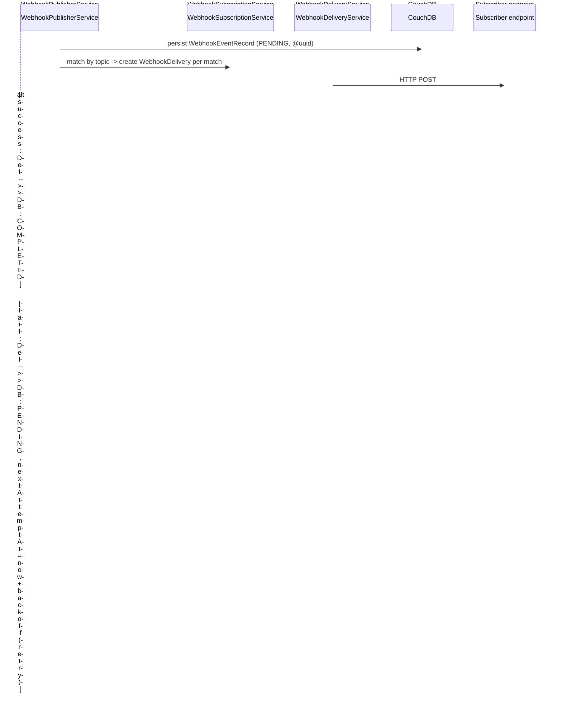

# 09 — Integrations, UI, CI & Testing Design

**Source specifications:** [DECAF-15](../specifications/DECAF_15.md), [DECAF-25](../specifications/DECAF_25.md), [DECAF-27](../specifications/DECAF_27.md), [DECAF-29](../specifications/DECAF_29.md), [DECAF-40](../specifications/DECAF_40.md), [DECAF-41](../specifications/DECAF_41.md), [DECAF-44](../specifications/DECAF_44.md), [DECAF-46](../specifications/DECAF_46.md).

## 1. Overview

A heterogeneous set: a webhook delivery engine with CouchDB persistence and retry (DECAF-15); a DOM-free BI dashboard embed plugin contract for Kibana/Superset + a Kibana index-pattern builder (DECAF-40/41); an Ionic cron-selector component and a webpage convention refactor (DECAF-44/25); a CI consolidation cluster (DECAF-27/29); and a Jest Xray teardown port (DECAF-46).

## 2. Webhook Engine (DECAF-15)

### Goals / Requirements
- Publication → persistence → retry → delivery-status tracking against real CouchDB via `NanoAdapter` (no mocks); >80% coverage.
- Topic convention `{entity}.{action}`. Three CouchDB tables (`webhook_subscriptions`, `webhook_events`, `webhook_deliveries`) with declared `@index()`. `WebhookEventRecord` `@uuid()`.
- `WebhookDeliveryService` transitions `PENDING → PROCESSING → COMPLETED/FAILED`; exponential backoff (30s,1m,2m,4m,8m,16m,30m…). `WebhookSignatureMiddleware` (TASK-119) timing-safe comparison.

### Design

### Open Questions / Risks
- Webhook (event→HTTP, persistent) vs agent progress (tool→MCP-notification, streaming) never reconciled (B26).
- Naming: `for-http` `WebhookEventRecord.ts` vs `for-nest` mirror `WebHookEventRecord.ts` (B27).

## 3. BI Dashboard Embed Plugins (DECAF-40)

### Goals / Requirements
- Two plugins (Kibana reference/generated-source; Superset patch-and-build) implementing the same DOM-free `DashboardEmbedPlugin` contract. `integrations` stays DOM-free; iframe/React plugin code under gitignored `integrations/plugins/*`; Angular host in `for-angular`.
- Org-agnostic (no space switching in plugin; space from backend proxy/session); one stable iframe per org; `postMessage`-based dashboard switching. `EMBED_MESSAGE_TYPE`: `SWITCH`/`READY`/`RENDERED`/`ERROR`.
- `DashboardEmbedPlugin`: `descriptor`, `manifest(targetVersion?)`, `buildEmbedUrl(options)`, `createSwitchDashboardMessage(payload)`, `sendSwitchDashboardMessage(...)`, `install(options)`. Runtime errors are Decaf types. Subpaths `@decaf-ts/integrations/plugins{,/kibana,/superset}`.

### Open Questions / Risks
- Superset has no native plugin system — patch maintained per exact release; Kibana plugin APIs vary by minor (not backwards compatible); regex patch fragility; Playwright e2e gated by env.

## 4. Kibana Index Pattern Builder (DECAF-41)

### Goals / Requirements
- Fluent `KibanaIndexBuilder extends Model` (Builder Pattern: validation decorators, `setX(): this`, `build()`). `KibanaIndexMatchMode` (`EXACT`/`PREFIX`/`LOGGER_GENERATED`) + compounding of logger-generated segments onto any base mode.
- Title composition: EXACT `indexName` (no `*`); PREFIX `prefix + sep + "*"`; LOGGER_GENERATED `segments.join(sep) + sep + "*"`. Logger compounding via DECAF-9 `compileLogPattern` + `logParameterRegistry.render`. `KibanaIndexBuilderCollection.for(...builders).build()` → `KibanaDataViewConfig[]` pushed by `KibanaDataViewService`.

### Open Questions / Risks
- Kibana supports only `*` (validate EXACT no `*`, PREFIX exactly one trailing `*`); separator conflicts if a log param value contains the separator (documented, not escaped).

## 5. Cron Selector (DECAF-44)

Standalone Ionic `cron-selector` component (no Material/Bootstrap). Emits five-field cron or `;`-separated multi-schedule string via `[(cron)]` + `ControlValueAccessor`. Daily (single cron if all times share minute, else `;`-joined), hourly `0 */N * * *`, weekly `<min> <hour> * * <weekday-list>`. Downstream interprets `;`-separated as independent schedules; timezone is downstream's responsibility.

## 6. Webpage Refactor (DECAF-25)

Refactor `for-angular` webpage to full Decaf convention: audit shell/routes/pages → refactor shell/menu/routing → normalize page composition & shared services → regression coverage + docs. Open: first-wave routes; keep Ionic split-pane; preserve `NgxPageDirective`/`NgxComponentDirective` or replace; `src/app/ew` legacy/demo phased or together.

## 7. CI Cluster (DECAF-27 + DECAF-29)

### Goals / Requirements
- DECAF-27: `reusable-actions` repo centralizing reusable workflows (`workflow_call` interface); conservative reuse boundary initially; composite actions deferred.
- DECAF-29: inventory every workspace workflow, classify shared/repo-local/hybrid, migrate reusable logic, normalize caller repos so trigger rules and guard conditions stay consistent; produce `reusable-actions/WORKFLOWS.md` rule matrix. Shared set: `nodejs-build-prod`, `jest-coverage`, release/security/pages workflows; repo-specific: `docker-couchdb`, `for-angular` Playwright, `integrations` alpha.

### Open Questions / Risks
- Tension between conservative migration (DECAF-27) and full rule replication (DECAF-29) (B28).

## 8. Jest Xray Teardown (DECAF-46)

Port Xray teardown into `@decaf-ts/utils` `tests` export (`runJestXrayTeardown`, named + default, CJS/ESM). `ENABLE_XRAY_REPORT` gate; `XRAY_CLIENT_ID`/`XRAY_CLIENT_SECRET` auth; junit XML via `fast-xml-parser` (optional peer dep); evidence/payload collection; Xray import/GraphQL upload; response truncation; console output; failure semantics preserved. Consumed via Jest `globalTeardown` pointing at transpiled `@decaf-ts/utils/tests`.

Continue to [10 — Overlaps & Contradictions](./10-overlaps-contradictions.md).
