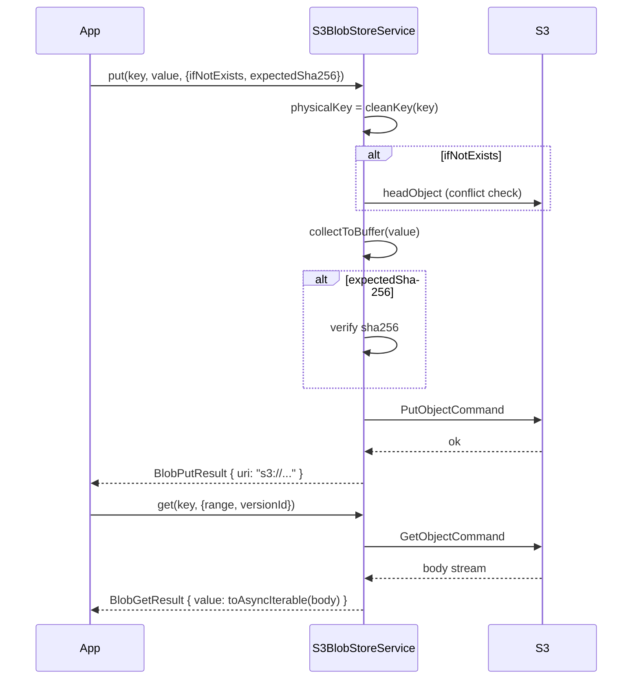
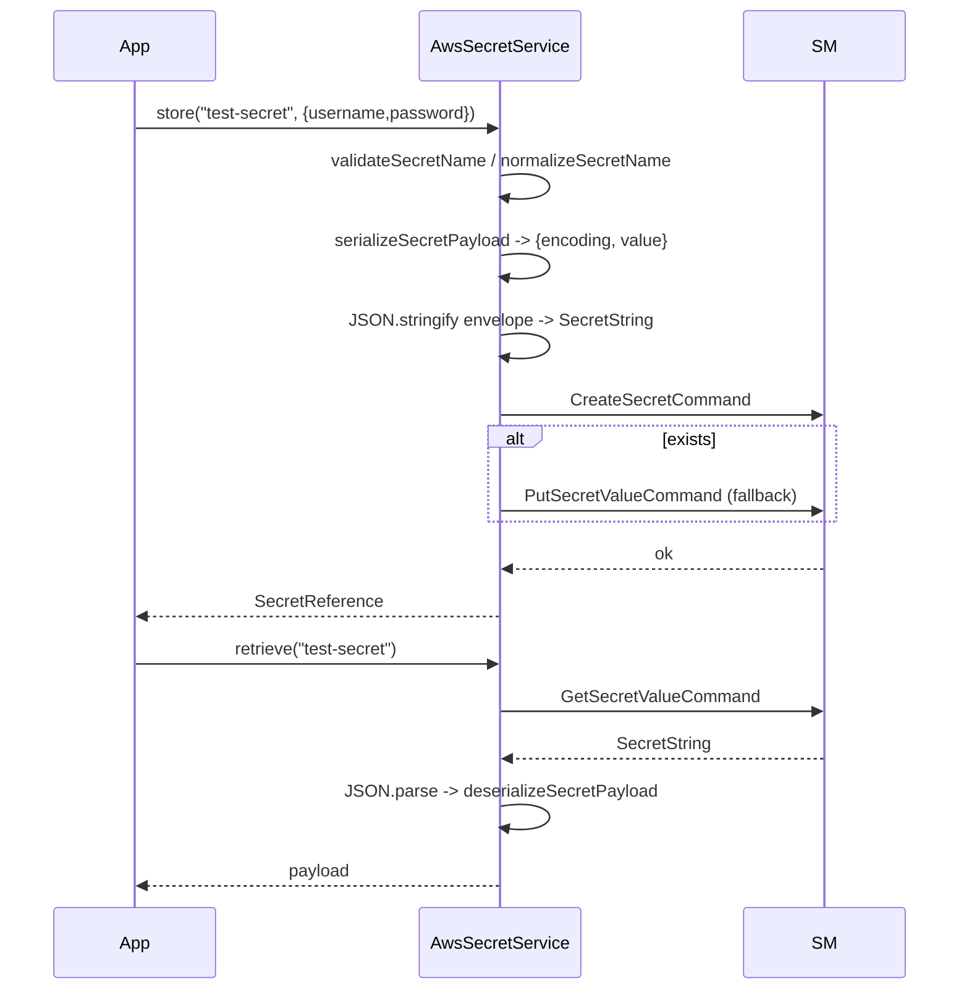
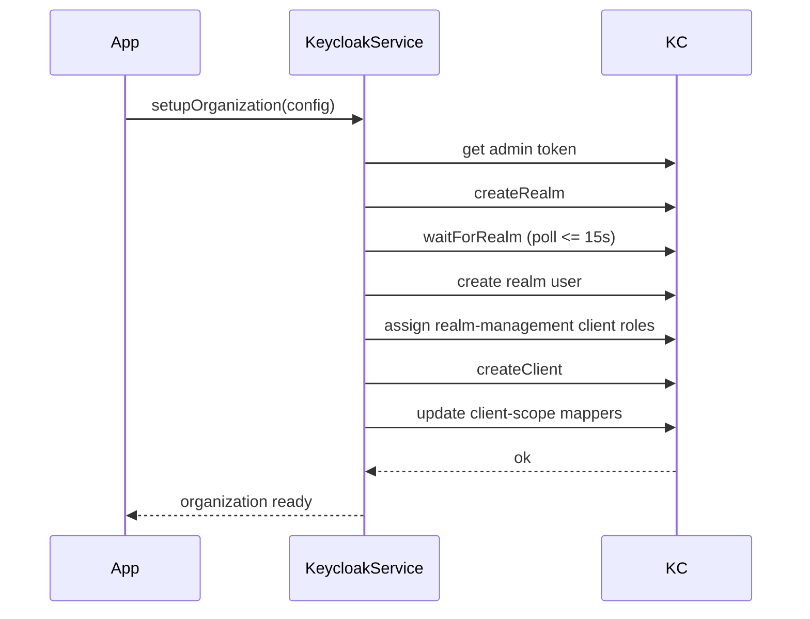
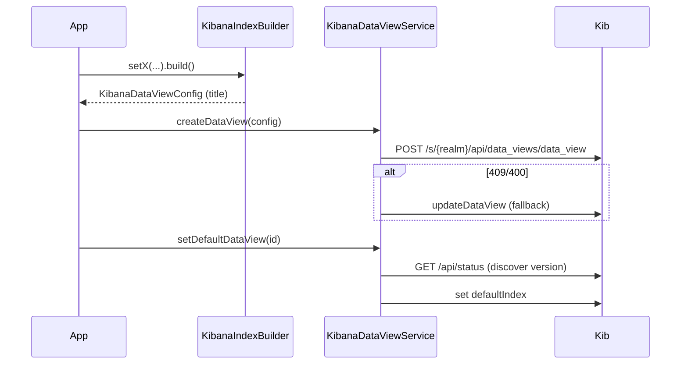
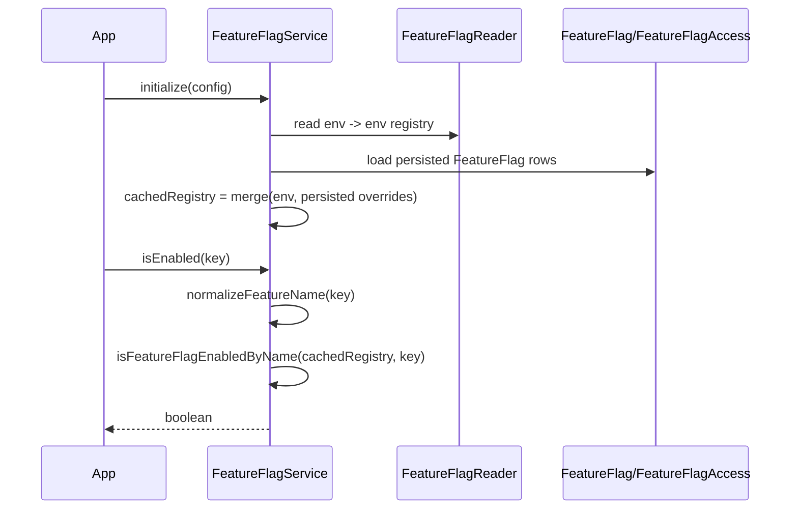
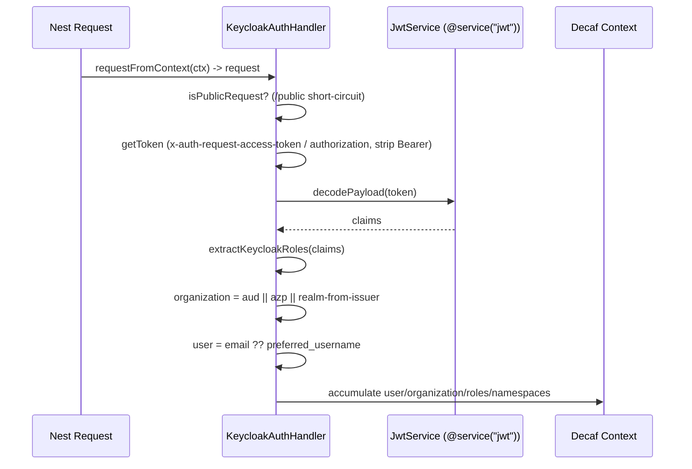
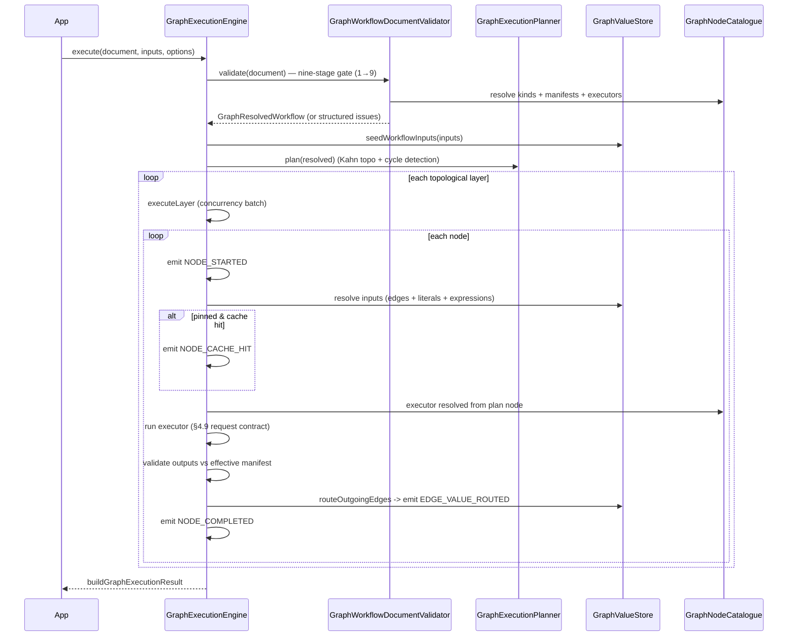
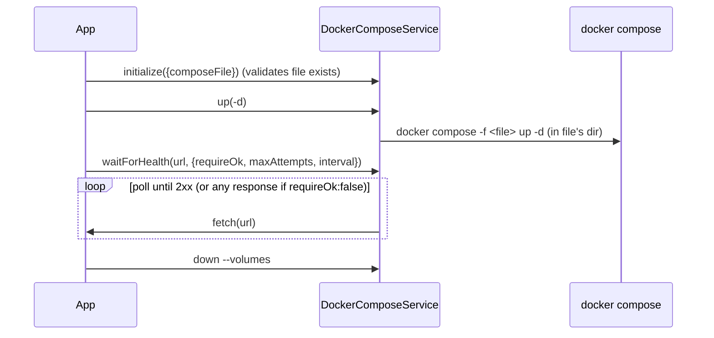

# 09 — Integrations Design

**Scope:** the `@decaf-ts/integrations` package — provider-agnostic blob store, model-backed + cloud secrets, Keycloak provisioning + auth, Kibana provisioning, feature flags, namespaces authorization scaffold, dynamic object loader, BI dashboard embed plugins, and Docker compose orchestration.

The architecture is detailed in the [Architecture Handbook](../architecture-handbook/07-integrations.md).

> This design is grounded in the read-only research brief `workdocs/ai/project/technical-docs/_research-briefs/08-integrations.md`. Where the brief is thin on a subsystem, this document says so explicitly rather than fabricating. The package is pre-1.0 (`0.7.0`); several subsystems carry stubs and divergent error models (consolidated in the handbook's inaccuracies section).

---

## 1. Design Principles

**Provider-agnostic abstractions over concrete SDKs.** Why: application code must not be coupled to a specific cloud vendor; blob and secret operations should be expressible against a single interface so backends can be swapped by configuration. Enforcing: blob exposes the abstract `BlobStoreService` and a `BlobStoreFactory.create(config)` dispatch; secrets expose the abstract `SecretService` (documentary only today — no provider extends it). Spec: every backend implements the same operation set; the root blob/secrets barrels re-export only the abstract + helpers, never concrete provider classes.

**Uniform `ClientBasedService` lifecycle.** Why: every infrastructure provider should boot identically — construct with no args, `await initialize(config)`, then use — so application bootstrap and tests treat all providers the same. Enforcing: blob, secret, Keycloak, and Kibana providers extend `ClientBasedService<TClient, TConfig>`. Spec: providers accept no constructor args; `initialize` assigns `_config`/`_client` and returns `{config, client}`.

**Optional dependencies, subpath-only provider exports.** Why: an application should pay the install cost only for the providers it uses; importing the root entry must not pull cloud SDKs. Enforcing: cloud SDKs are `optionalDependencies`; providers are exported only via dedicated subpaths. Spec: root entry is free of provider loads. *(Known violation: the blob core barrel re-exports `BlobStoreFactory`, which statically imports every provider — see handbook inaccuracies §blob-1.)*

**Repository-agnostic policy engines.** Why: authorization decisions and feature-flag resolution must be answerable against any backing store, not embedded in a specific repository. Enforcing: `AuthzService.canAccess` operates over `AuthzDataSources` and emits backend-specific contexts (`AccessContext`/`ArangoAuthContext`/`QdrantAuthFilter`); `FeatureFlagService.isEnabled` answers from a cached, reader-fed registry. Spec: policy engines never read fixtures; they consume repository-backed data sources.

**Encrypted-at-rest secrets, all crypto in `@decaf-ts/crypto`.** Why: secret material must never persist in plaintext, and crypto primitives must not drift into `integrations`. Enforcing: `ModelSecretService` encrypts `serialized.value` via `CryptoService` and persists `{encryptedPayload, encryption:{keyId,iv}}` on the `Secret` model. Spec: no symmetric/asymmetric primitive is implemented in `integrations`.

**Sandboxed execution of untrusted code.** Why: graph Code/Switch nodes run author-supplied bodies; unsafe execution would be an arbitrary-code-execution vector. Enforcing: `IsolatedVmCodeSandboxEvaluator` transpiles TS, validates the AST (blocking `eval`/`new Function`/imports/exports/blocked identifiers), and runs in an `isolated-vm` isolate with timeout/memory limits. Spec: Code/Switch nodes throw `GRAPH_CODE_SANDBOX_NOT_CONFIGURED` when no `codeSandboxEvaluator` is supplied — the engine does not wire a default.

**DOM-free `integrations`; iframe/React code confined to plugin output.** Why: the package must stay usable from non-browser runtimes and must not ship iframe/React code in its published artifacts. Enforcing: `lib: ["es2022"]`; BI plugin host code is DOM-free; iframe/React plugin code lives under gitignored `integrations/plugins/*` and the Angular host in `for-angular`. Spec: no DOM access from `@decaf-ts/integrations`.

---

## 2. Blob Store Design

### 2.1 Backends

| Provider key | Class | Notes |
|:-------------|:------|:------|
| `memory` | `MemoryBlobStoreService` | In-process; tests/self-hosted default. |
| `local` | `LocalBlobStoreService` | Atomic write + path-traversal protection. |
| `s3` | `S3BlobStoreService` | AWS S3 / S3-compatible via `endpoint`. |
| `minio` | `MinioBlobStoreService` | Marker subclass of S3. |
| `r2` | `R2BlobStoreService` | Marker subclass of S3. |
| `azure-blob` | `AzureBlobStoreService` | Azure Blob Storage. |
| `gcs` | `GcsBlobStoreService` | Google Cloud Storage. |
| `ipfs` | `IpfsBlobStoreService` | Content-addressed; logical keys→CIDs via `IpfsKeyIndex` (`Memory` implemented; `Postgres`/`LocalJson` are stubs). |

### 2.2 Public API

- `BlobStoreService` (abstract): `initialize/put/get/has/stat/delete/copy/list/url`.
- `BlobStoreFactory.create(config)` dispatches on `config.provider`.
- `BlobKey` (`cleanKey`, `physicalKey` with prefix), `BlobValue` (`collectToBuffer`, `computeSha256`, `toAsyncIterable`), `BlobTypes` (configs/results/options + `BlobProvider` union), `BlobErrors` + `translateBlobError`.
- Provider subpaths export concrete services; the core barrel does **not** re-export providers.

### 2.3 Functional requirements

- **FR-B1:** `BlobStoreFactory.create({provider, ...})` returns a `BlobStoreService` for any `BlobProvider` literal; an unknown provider is rejected.
- **FR-B2:** `put(key, value, {ifNotExists, expectedSha256})` normalizes the key via `cleanKey`, optionally conflict-checks, collects the value to a buffer, optionally verifies sha256, and returns a `BlobPutResult` with a backend-specific `uri`.
- **FR-B3:** `get(key, {range, versionId})` returns a `BlobGetResult` whose `value` is an async iterable drained by `collectToBuffer`.
- **FR-B4:** `has`/`stat`/`delete`/`copy`/`list` behave as CRUD over the normalized key namespace.
- **FR-B5:** Provider errors are translated through `translateBlobError` to Decaf error types.
- **FR-B6:** The IPFS provider maps logical keys to CIDs via an `IpfsKeyIndex` and streams `client.cat(cid)`.

### 2.4 Blob upload/retrieve sequence (S3)



### 2.5 Acceptance criteria

- **Given** a memory store initialized via the factory, **when** `put("k", Buffer.from("v"))` is called, **then** `has("k")` returns `true`.
- **Given** an S3-compatible backend initialized with `endpoint`/`credentials`, **when** `store("test-secret", payload)` (secret analog) succeeds and `get` is called, **then** the retrieved buffer equals the uploaded bytes.
- **Given** `expectedSha256` supplied to `put` and a value whose sha256 does not match, **then** `put` rejects with a validation error.
- **Given** the IPFS provider, **when** `get` is called with `range`/`versionId`, **then** the options are currently ignored (known limitation — handbook §blob-6); this is a documented gap, not a passing criterion.

### 2.6 Usage example

```ts
const factory = new BlobStoreFactory();
const store = factory.create({ provider: "memory", sourceId: "factory-test" });
await store.initialize({ provider: "memory", sourceId: "factory-test" });
await store.put("k", Buffer.from("v"));
expect(await store.has("k")).toBe(true);
```

---

## 3. Secrets Design

### 3.1 Providers

| Provider key | Class | Storage | Notes |
|:-------------|:------|:--------|:------|
| `model` | `ModelSecretService` | Decaf model row, encrypted at rest via `CryptoService` | Persists `{encryptedPayload, encryption:{keyId,iv}}`. |
| `aws-secrets-manager` | `AwsSecretService` | AWS Secrets Manager | LocalStack-compatible via `endpoint`. |
| `azure-key-vault` | `AzureKeyVaultSecretService` | Azure Key Vault | `exists` implemented. |
| `gcp-secret-manager` | `GcpSecretManagerService` | Google Secret Manager | |
| `hashicorp-vault` | `VaultSecretService` | Vault HTTP API (raw `fetch`) | `hashicorp-vault` npm dep unused. |
| `1password` | `OnePasswordSecretService` | 1Password | Export path misspelled `oneppassword` in `package.json`. |
| `memory` | — | — | Literal present, no implementation. |

There is **no secret factory**; each provider is constructed directly. No provider `extends SecretService` — the abstract is documentary only (handbook §secrets-11).

### 3.2 Public API

- `SecretService` (abstract): `store/retrieve/delete/exists/list/metadata` + optional `rotate`.
- `SecretName`/`SecretReference`/`SecretSerialization`, `SecretErrors`/`translateError`, `SecretTypes`.
- `model/` → `ModelSecretService`, `Secret` model, `ModelSecretServiceConfig`.
- Per-provider subpaths export cloud services + config types.

### 3.3 Secrets state, storage & access

Secrets are never persisted in plaintext. The envelope is `SecretSerialization = {encoding, value}`; providers JSON-stringify the full envelope into a `SecretString` for storage. For the model provider, `serialized.value` is encrypted via `CryptoService` and the `Secret` row stores `{encryptedPayload, encryption:{keyId, iv}}`. Access is gated by the provider's own auth (cloud IAM / Vault token / 1Password credentials) supplied via the provider config object — never via `process.env` reads inside the integrations code. Names are validated/normalized through `validateSecretName`/`normalizeSecretName`. `SecretReference` carries `{provider, name}`; `parseSecretReference` parses `secrets/<provider>/<name>` strings.

### 3.4 Functional requirements

- **FR-S1:** `store(name, payload)` validates the name, serializes the payload to `{encoding, value}`, JSON-stringifies the envelope, and persists via the provider; returns a `SecretReference`.
- **FR-S2:** `retrieve(name)` reads the stored envelope, JSON-parses, and deserializes back to the original payload type.
- **FR-S3:** `exists`/`list`/`metadata`/`delete` behave as CRUD over the secret namespace.
- **FR-S4:** The model provider encrypts `serialized.value` via `CryptoService` and persists `{encryptedPayload, encryption:{keyId,iv}}`.
- **FR-S5:** Names are validated via `validateSecretName` and normalized via `normalizeSecretName`.

### 3.6 Secret resolution sequence (AWS)



### 3.7 Acceptance criteria

- **Given** an initialized `AwsSecretService` against LocalStack, **when** `store("test-secret", {username:"testuser", password:"password123"})` then `retrieve("test-secret")` is called, **then** the returned object's `username` equals `"testuser"`.
- **Given** a missing secret name, **when** `retrieve("does-not-exist")` is called, **then** the provider rejects with a not-found error.
- **Given** the model provider, **when** a secret is stored then retrieved, **then** the persisted row contains `encryptedPayload` (not plaintext) and `encryption.{keyId,iv}`. *(Known correctness gap: `ModelSecretService.retrieve` hardcodes `encoding:"utf8"`, dropping the original encoding — handbook §secrets-14; binary/JSON secrets may come back as strings. This is a documented defect.)*

### 3.8 Usage example

```ts
const secrets = new AwsSecretService();
await secrets.initialize({ provider: "aws-secrets-manager", region: "us-east-1",
  endpoint: "http://localhost:4566", credentials: { accessKeyId: "test", secretAccessKey: "test" } });
await secrets.store("test-secret", { username: "testuser", password: "password123" });
const data = await secrets.retrieve("test-secret") as Record<string, unknown>;
expect(data.username).toBe("testuser");
```

---

## 4. Keycloak Design

### 4.1 Public API

- `KeycloakService` orchestrator; `KeycloakAuthService`/`ClientService`/`IdentityProviderService`/`RealmService`/`RoleService`/`UserService`.
- `buildBrokerIdentityProviderPayload`; broker helpers `getBrokerExternalIdentityKey`, `isLocalKeycloakIssuer`.
- Config types `KeycloakSetupConfig`, `KeycloakBrokerSetupConfig`, etc.

### 4.2 Functional requirements

- **FR-K1:** `KeycloakService.setupOrganization(config)` creates a realm, waits for it to be ready (poll ≤ 15s), creates a realm user, assigns `realm-management` client roles, creates a client, and updates client-scope mappers.
- **FR-K2:** `setupKeycloak` adds the admin user and grants the `admin` realm role.
- **FR-K3:** Role grants resolve role UUIDs and POST to the user's role-mappings.
- **FR-K4:** Each request toggles `https.Agent.rejectUnauthorized` via the runtime resolver based on `isProduction()`.

### 4.3 Provisioning sequence



### 4.4 Acceptance criteria

- **Given** a reachable Keycloak admin endpoint and a type-valid `KeycloakSetupConfig`, **when** `setupOrganization` completes, **then** the realm exists, the realm user exists with `realm-management` client roles, and the client exists with updated scope mappers.
- **Given** `isProduction: () => false`, **then** TLS verification is relaxed for the configured endpoint.

> The `KeycloakSetupConfig` type does not declare `isProduction` even though tests supply it (handbook §keycloak-30). Config examples in prior docs are not type-valid (handbook §keycloak-29). HTTP 401/403 are mis-mapped to `NotFoundError` (handbook §keycloak-33).

---

## 5. Kibana Design

### 5.1 Public API

- `KibanaService` orchestrator; `KibanaSpaceService`/`DataViewService`/`RoleService`/`UserService`/`DashboardService`/`AuthService`.
- `KibanaIndexBuilder`/`KibanaIndexBuilderCollection`; `createDefaultKibana*` helpers; `KibanaIndexMatchMode` enum (`EXACT`/`PREFIX`/`LOGGER_GENERATED`).

### 5.2 Index pattern builder

- `KibanaIndexBuilder extends Model`: fluent `setX(): this` setters, terminal `build()`.
- Title composition: `EXACT` → `indexName` (no `*`); `PREFIX` → `prefix + sep + "*"` (exactly one trailing `*`); `LOGGER_GENERATED` → `segments.join(sep) + sep + "*"`. Optional compounding appends logger-rendered segments (uses `@decaf-ts/logging` `compileLogPattern` + `logParameterRegistry.render`).
- `KibanaIndexBuilderCollection.build()` validates and maps many builders → `KibanaDataViewConfig[]`.

### 5.3 Functional requirements

- **FR-Ki1:** `KibanaIndexBuilder.build()` validates the combination of mode + inputs and rejects `*` in `EXACT` and non-trailing `*` in `PREFIX`.
- **FR-Ki2:** `KibanaDataViewService.createDataView` POSTs `/s/{realm}/api/data_views/data_view`, falling back to `updateDataView` on 409/400.
- **FR-Ki3:** `setDefaultDataView` discovers the Kibana version via `/api/status` then sets `defaultIndex`.
- **FR-Ki4:** `KibanaSpaceService` creates, updates, and deletes spaces.

### 5.4 Data view sequence



### 5.5 Acceptance criteria

- **Given** an `EXACT` builder with `indexName = "logs"`, **when** `build()` is called, **then** the title is `"logs"` and contains no `*`.
- **Given** a `PREFIX` builder with `prefix = "app"`, `sep = "-"`, **when** `build()` is called, **then** the title is `"app-*"`.
- **Given** a `LOGGER_GENERATED` builder with segments `["a","b"]`, `sep = "-"`, **then** the title is `"a-b-*"`.
- **Given** an `EXACT` builder whose `indexName` contains `*`, **then** `build()` rejects with a validation error.

> `KibanaSetupConfig` omits required `id` in doc examples (handbook §kibana-35) and does not declare `isProduction` (handbook §kibana-36). A doc-advertised `deleteDataView` does not exist (handbook §kibana-34).

---

## 6. Feature Flags Design

### 6.1 Public API

- `FeatureFlagService` + config; `FeatureFlag`/`FeatureFlagAccess` models.
- `FeatureFlagReader`/`EnvironmeFlagReader`; `FeatureFlagEnvironment` + env loaders.
- Decorators `featureFlags`/`featureAuth`/`blockFeatureOperations`/`renderIfFeature`/`hideOnFeature` + `getFeatureGateMetadata`/`shouldExposeForFeatures`/`shouldHideForFeatures`.
- Utils `normalizeFeatureRegistry`, `isFeatureFlagEnabledByName`.

### 6.2 Functional requirements

- **FR-F1:** `FeatureFlagService.initialize(config)` accepts a reader override (default `EnvironmeFlagReader`), reads the environment registry, loads persisted `FeatureFlag` rows, and builds a cached registry where persisted rows override environment defaults.
- **FR-F2:** `isEnabled(key)` synchronously answers from the cached registry via `normalizeFeatureName` → `isFeatureFlagEnabledByName`.
- **FR-F3:** `isEnabledForSubject(subject, key)` resolves subject-scoped flags via `resolveFeatureFlagsForSubject` (lists enabled `FeatureFlagAccess` rows, collects `featureKey`s, queries enabled `FeatureFlag` rows, returns `{key: config??true}`).
- **FR-F4:** Decorators store `FeatureFlagRule` metadata on model members.

### 6.3 Feature flag evaluation sequence



### 6.4 Acceptance criteria

- **Given** a flag `featureX` enabled in the environment registry and no persisted override, **when** `isEnabled("featureX")` is called, **then** it returns `true`.
- **Given** a flag `featureX` enabled in the environment but a persisted `FeatureFlag` row disabling it, **when** `isEnabled("featureX")` is called, **then** the persisted override wins and it returns `false`.
- **Given** `featureX` disabled (flag off), **when** a `featureFlags`/`renderIfFeature`-decorated member is evaluated, **then** the member is suppressed per the decorator's rule.
- **Given** a subject with a `FeatureFlagAccess` row enabling `featureY`, **when** `isEnabledForSubject(subject, "featureY")` is called, **then** it returns `true`.

> The reader class is misspelled `EnvironmeFlagReader` (handbook §feature-flags-40). `FEATURE_FLAG_ENV_PREFIX` is declared but never wired (handbook §feature-flags-41). `grantFeatureAccess`/`revokeFeatureAccess` ignore the feature key on lookup (handbook §feature-flags-42).

---

## 7. Namespaces (Authorization Scaffold) Design

### 7.1 Public API

- **Types:** enums `IsolationTier`/`MembershipStatus`/`PrincipalKind`/`ScopeKind`/`PermissionCategory`/`ResourceVisibility`/`StorageKind`/`StorageBindingKind`; DTOs; `AuthzDataSources`/`AccessContext`/`ArangoAuthContext`/`QdrantAuthFilter`.
- **Utils:** `BaseModelService`, `buildAccessContext`/`buildArangoContext`/`buildQdrantFilter`, `sameTenant`, relation policy constants.
- **Models:** 21 authorization models (tenants, org-unit closure, principals/memberships, roles/permissions, role-assignments, protected resources/resource-grants, effective permissions, inheritance blocks).
- **Services:** 24 repository-backed services incl. `AuthzService`, `BootstrapService`, `EffectivePermissionService`, `OrgUnitService`, `SystemManagementService`, `ResourceLifecycleService`.

### 7.2 Functional requirements

- **FR-N1:** `AuthzService.canAccess(input)` short-circuits on owner → explicit `ResourceGrant`s → visibility-driven effective-permission lookup, and emits a backend-specific context (`AccessContext`/`ArangoAuthContext`/`QdrantAuthFilter`).
- **FR-N2:** `EffectivePermissionService.rebuildForPrincipal(principal)` deletes existing rows, collects direct + group-derived `RoleAssignment`s, expands scopes (Tenant → tenant; Resource → resource; OrgUnit non-inheriting → single scope; inheriting → all closure descendants, skipping `InheritanceBlock` categories), and writes `EffectivePermission` rows.
- **FR-N3:** `BootstrapService.bootstrapTenantFromTemplate` templates a full tenant setup transactionally (tenant + root org unit + permissions + roles + owner user + owner role assignment).
- **FR-N4:** Postgres RLS (`sql/002_rls.sql`) enforces tenant isolation; `app.principal_id` scopes reads.
- **FR-N5:** Multi-write services are `@transactional`.

### 7.3 Effective-permission rebuild sequence

```mermaid
sequenceDiagram
    participant App
    participant Eps as EffectivePermissionService
    participant Repo as RoleAssignment repository
    participant EP as EffectivePermission repository
    App->>Eps: rebuildForPrincipal(principal)
    Eps->>EP: delete existing rows for principal
    Eps->>Repo: collect direct + group-derived RoleAssignments
    loop each assignment
        Eps->>Eps: expand scope
        alt Tenant
            Eps->>Eps: -> tenant
        alt Resource
            Eps->>Eps: -> resource
        alt OrgUnit non-inheriting
            Eps->>Eps: -> single scope
        alt OrgUnit inheriting
            Eps->>Eps: -> all closure descendants (skip InheritanceBlock categories)
        end
    end
    Eps->>EP: write EffectivePermission rows
```

### 7.4 Acceptance criteria

- **Given** a principal with no direct or group-derived `RoleAssignment` for resource `R`, **when** `canAccess({principal, action:"read", resource:R, tenant:T})` is called, **then** it denies access.
- **Given** a principal who is the owner of resource `R`, **when** `canAccess` is called, **then** it short-circuits and permits.
- **Given** a `RoleAssignment` on an inheriting org unit granting `resource.read`, **when** `rebuildForPrincipal` runs, **then** `EffectivePermission` rows are written for all closure descendants except categories blocked by an `InheritanceBlock`.
- **Given** a request whose `tenantId` differs from the matched permission's `tenantId` on the resource branch, **then** access is denied. *(Known gap: the scope branch does not enforce tenant scoping — handbook §namespaces-48.)*
- **Given** an unregistered resource, **when** `ResourceLifecycleService.unregisterResource` runs, **then** grants and the resource are deleted. *(Known gap: this sequence is not `@transactional` — handbook §namespaces-49.)*

### 7.5 Provisioning prerequisites

Provision the Postgres schema plus `sql/001_constraints.sql`, `sql/002_rls.sql` (RLS), and `sql/003_indexes.sql`; set `app.principal_id` for RLS-scoped reads. `sql/003_indexes.sql` is currently an empty placeholder (handbook §namespaces-47). `AuthzService` must be fed by repository-backed data sources, never fixtures.

### 7.6 Usage example

```ts
const { tenantId } = await new BootstrapService().bootstrapTenantFromTemplate({
  tenant: { slug: "acme", name: "Acme" }, rootOrgUnit: { name: "Root" },
  permissions: [{ key: "resource.read", category: PermissionCategory.ContentRead }],
  roles: [{ key: "owner", name: "Owner", permissionKeys: ["resource.read"] }],
  ownerUser: { displayName: "Admin", email: "admin@acme.example" }, ownerRoleKey: "owner",
});
```

---

## 8. Object Loader Design

### 8.1 Public API

- `ObjectLoader` + `createLoaderHookContext`.
- Family loaders: `ModelObjectLoader`/`AdapterObjectLoader`/`RepositoryObjectLoader`/`ServiceObjectLoader`/`ControllerObjectLoader`/`EnvironmentObjectLoader`/`AngularComponentObjectLoader`/`GraphNodeObjectLoader`.
- `ObjectLoaderFamily`/`ObjectLoaderHook`/options types.

### 8.2 Functional requirements

- **FR-L1:** `ObjectLoader.load(source, selection?)` normalizes the source (paths → `file:` URLs; bare specifiers passed through), performs ESM dynamic `import()`, and selects the export (`default` by default; named on request; single-named-export fallback).
- **FR-L2:** `withHooks([...])` and `withOptions({...})` return a **new** immutable instance; the original loader is unaffected.
- **FR-L3:** Post-load hooks run in deterministic order and may transform the loaded value; decorator metadata is preserved.
- **FR-L4:** Family subclasses fix the `family` and expose a family-verb loader.

### 8.3 Loader discovery sequence

```mermaid
sequenceDiagram
    participant App
    participant L as ObjectLoader
    participant Mod
    App->>L: new ObjectLoader({family:"service"}) or family subclass
    App->>L: withHooks([...]) -> new immutable loader
    App->>L: withOptions({...}) -> new immutable loader
    App->>L: load(source, selection?)
    L->>L: normalize source (path -> file: URL; bare specifier passthrough)
    L->>Mod: import(normalized)
    Mod-->>L: module namespace
    L->>L: select export (default | named | single-named fallback)
    loop ordered hooks
        L->>L: hook(value, ctx)
    end
    L-->>App: loaded value (+ preserved metadata)
```

### 8.4 Acceptance criteria

- **Given** a module with a default export, **when** `load("./path")` is called without a selection, **then** the default export is returned.
- **Given** a module with a named export `Foo`, **when** `load("./path", {named:"Foo"})` is called, **then** `Foo` is returned.
- **Given** a loader `L1` and `L2 = L1.withHooks([h])`, **when** `L1.load(...)` is called, **then** `h` is **not** invoked (immutability).
- **Given** a source that cannot be resolved/imported, **when** `load(source)` is called, **then** the loader rejects with a not-found/error (loader not-found).

> `ObjectLoaderExportSelection` is exported twice from the loader barrel (handbook §loader-60). `withOptions`/`createLoaderHookContext` and URL/`data:` sources are untested (handbook §loader testing gaps).

---

## 9. Nest Auth Integration Design

### 9.1 Public API

- `KeycloakAuthHandler`/`KeycloakNamespaceAuthHandler`/`KeycloakAuthData`.
- `KeycloakModule`/`AuthModule` (plain classes, not Nest `@Module()`-decorated; `create()` returns a `KeycloakNamespaceAuthHandler`).
- `namespace()` decorator + `AUTH_NAMESPACE_KEY`.
- Utils `extractKeycloakRoles`/`extractKeycloakNamespaces`/`getRealmFromIssuer`/`getClientRoles`.
- `./nest/graph`: `GraphExecutionController`/`GraphExecutionModule` (deprecated synchronous path), `GraphNodeCatalogueController` (manifests API with ETag digest), `GraphRunController`/`GraphRunModel`/`GraphRunModelService` (async run lifecycle), `GraphWorkflowController`/`GraphWorkflowService`/`GraphWorkflowModel`/`GraphWorkflowDocumentLimits` (canonical document persistence), `GraphResultService`/`GraphExecutionResultModel`, `GraphExecutorRegistryFactory` (`createGraphNodeCatalogue`, `createGraphExecutorRegistry`, `createDemoEngineConfig`).

### 9.2 Functional requirements

- **FR-NA1:** `KeycloakAuthHandler` extends Decaf `AuthHandler`, injects `JwtService` via `@service("jwt")`, has a no-arg constructor.
- **FR-NA2:** On each request, `requestFromContext` adapts ctx→request; `/public` routes short-circuit via `isPublicRequest`.
- **FR-NA3:** `getToken` reads `x-auth-request-access-token`/`authorization` (strips `Bearer `); the payload is decoded via `jwt().decodePayload`.
- **FR-NA4:** `extractKeycloakRoles` derives roles; `organization = aud || azp || realm-from-issuer`; `user = email ?? preferred_username`; these are accumulated onto the Decaf `Context` along with `namespaces`.
- **FR-NA5:** `validateAuth(data, _request)` calls `this.jwt().decodeAuthToken(...)`.
- **FR-NA6:** Importing `./nest` registers logging side-effects adding `user`/`organization` log params.

### 9.3 Request → context sequence



### 9.4 Acceptance criteria

- **Given** a request with a valid Keycloak bearer token, **when** the handler runs, **then** the Decaf `Context` carries `user`, `organization`, `roles`, and `namespaces` derived from the token.
- **Given** a request to a `/public` route, **when** the handler runs, **then** it short-circuits without requiring a token.
- **Given** a request with no token on a non-public route requiring auth, **then** the handler rejects.
- **Given** a `namespace()`-decorated handler, **when** the request's namespaces do not include the required namespace, **then** the handler rejects.

> A doc-claimed `AuthService` does not exist (handbook §nest-50). `KeycloakModule`/`AuthModule` are plain wrappers, not Nest modules (handbook §nest-56). `getClientRoles` is redundantly re-exported (handbook §nest-58).

---

## 10. Graph Engine Design (integrations surface)

The full graph design is specified in [08 — Graph Design](./08-graph-design.md) (canonical documents & manifests §6–§7, backend catalogue §8, nine-stage validation §9, planner & engine §10, run lifecycle §11, NestJS API §12). This section records only the integrations-package surface and consumer contracts.

### 10.1 Public API (integrations)

- `./graph`: `GraphExecutionEngine` + config; catalogue (`GraphNodeCatalogue`/`GraphNodeRegistration`/`GraphNodeManifestResolver`/`GraphNodeMethodRegistry`, built-in registrations via `registerBuiltInGraphNodes`); planning (`GraphExecutionPlanner`/`GraphExecutionPlan`/`GraphTopology` — accepts `GraphResolvedWorkflow` only); validation (the nine-stage `GraphWorkflowDocumentValidator` + per-scope validators + `GraphResolvedWorkflow`); runs (`GraphRunService`/`GraphRunExecutor`/`GraphRunEventPublisher`/`GraphRunEventStore`/`GraphRunStore` + in-memory reference implementations); pinning (`GraphPinningService`/`GraphPinningPolicy`/`GraphPinningDependencyResolver` — fingerprints exclude UI state); store (`GraphValueStore`/`GraphValueStoreAdapter`/`InMemoryGraphValueStoreAdapter`); loops (`Foreach/While/UntilGraphNodeExecutor`, `GraphConditionEvaluator`/`ConditionExpressionEvaluator`); executors (`CodeGraphNodeExecutor`/`SwitchGraphNodeExecutor`/`LogGraphNodeExecutor`/`BreakGraphNodeExecutor`, `CodeSandboxEvaluator`/`IsolatedVmCodeSandboxEvaluator`); registry (`GraphNodeExecutorRegistry` facade over the catalogue/`GraphNodeExecutorResolver`); events (`GraphExecutionEventEmitter`/`GraphExecutionEventFactory`/`GraphExecutionObserver`); snapshots (`GraphExecutionSnapshotMapper`); errors (incl. `GraphDocumentValidationError`, `GraphRunCancelledError`); engine constants.
- `./graph/shared`: frontend-safe built-in node manifests (`shared/nodes/`), `GraphExecutionStateMapper`, run wire contracts (`GraphRunStatus`/`GraphRunEventEnvelope`), visual-state styles.

### 10.2 Functional requirements (integrations-specific)

- **FR-G1:** `GraphExecutionEngine.execute(document, inputs, options)` takes a canonical `GraphWorkflowDocument`, runs the nine-stage validation gate (resolving every kind against the trusted catalogue), plans the resolved workflow into topological layers (Kahn cycle detection), seeds inputs into a `GraphValueStore`, executes layer-by-layer with concurrency, routes values along edges, and emits structured events.
- **FR-G2:** Executors are registered as manifest+executor pairs in the `GraphNodeCatalogue` (no `@executor` decorator); registration fails fast on drift (duplicate kinds, functions/constructors in manifests, undeclared/unimplemented methods, duplicate IDs, missing executors). The `GraphNodeExecutorRegistry` is a facade over the catalogue — one kind map.
- **FR-G3:** Pinning is all-or-nothing across upstream pin sets with TTL'd cached values; a cache hit emits `NODE_CACHE_HIT`; fingerprints derive from kind/parameters/bindings/effective inputs and exclude presentation-only UI state.
- **FR-G4:** Loops re-enter the engine via `engine.execute(bodyDocument, ...)` with `parentRunId` propagation; nested documents recurse the same validation/resolution pipeline.
- **FR-G5:** Code/Switch nodes throw `GRAPH_CODE_SANDBOX_NOT_CONFIGURED` when no `codeSandboxEvaluator` is supplied.
- **FR-G6:** `IsolatedVmCodeSandboxEvaluator` transpiles TS, validates the AST, and runs in an `isolated-vm` isolate with timeout/memory limits.
- **FR-G7:** Run creation (`POST /graph/runs`) returns `202` with `eventsUrl`/`resultUrl` before completion; run events are run-scoped, ownership-checked server-side, monotonically sequenced by a single writer per run, and replayable via `afterSequence`.

### 10.3 Execution sequence



### 10.4 Acceptance criteria

- **Given** a catalogue with `math.add` and `math.multiply` registrations and a linear canonical document, **when** `execute(linearDocument(), {a:2, b:3})` is called, **then** `result.outputs.result === 10`.
- **Given** a document with a cycle, **when** `execute` is called, **then** stage-7 topology validation rejects it with a structured issue.
- **Given** a document referencing an unregistered kind or carrying an inline node definition, **when** `execute` is called, **then** the nine-stage gate rejects it before planning.
- **Given** a Code node and no `codeSandboxEvaluator` configured, **when** execution reaches the node, **then** it throws `GRAPH_CODE_SANDBOX_NOT_CONFIGURED`.

### 10.5 Usage example

```ts
import {
  GraphNodeCatalogue, GraphNodeExecutorRegistry, GraphExecutionEngine,
  registerBuiltInGraphNodes,
} from "@decaf-ts/integrations/graph";

const catalogue = new GraphNodeCatalogue();
registerBuiltInGraphNodes(catalogue);            // built-in manifest+executor pairs
catalogue.registerExecutor("math.add", { execute: (r) => ({ sum: Number(r.inputs.a) + Number(r.inputs.b) }) });
catalogue.registerExecutor("math.multiply", { execute: (r) => ({ product: Number(r.inputs.x) * 2 }) });
const engine = new GraphExecutionEngine({ registry: new GraphNodeExecutorRegistry(catalogue) });
const result = await engine.execute(linearDocument(), { a: 2, b: 3 }); // outputs.result === 10
```

> Defaults `concurrency=4`, `failFast=true`, `usePinnedValues=true`. Validation is wired: the nine-stage gate runs on every `execute()` and at every persistence boundary (the legacy `validateInputs/Outputs` silently-ignored gap was fixed by the canonical cutover). `IsolatedVmCodeSandboxEvaluator` is still not wired by default (handbook §graph-72).

---

## 11. BI Dashboard Embed Plugins Design

### 11.1 Public API

- `./plugins`: `DashboardEmbedPlugin` contract (`descriptor`, `manifest(targetVersion?)`, `buildEmbedUrl(options)`, `createSwitchDashboardMessage(payload)`, `sendSwitchDashboardMessage(...)`, `install(options)`) + message helpers/guards.
- `./plugins/kibana`: `KibanaDashboardEmbedPlugin`, `buildKibanaEmbedUrl`, `sendKibanaSwitchDashboardMessage`, manifest builder, plugin files.
- `./plugins/superset`: `SupersetDashboardEmbedPlugin`, `buildSupersetEmbedUrl`, `sendSupersetSwitchDashboardMessage`, manifest, patch files, `SupersetInstallOptions`.

### 11.2 Functional requirements

- **FR-P1:** Both plugins are org-agnostic (no space switching); space comes from the backend proxy/session.
- **FR-P2:** Kibana uses a generated-source + installer strategy; `buildKibanaEmbedUrl` → `//<host>/<basePath>/app/org_dashboard_embed?dashboardId=...&parentOrigin=...`; switching via `postMessage`.
- **FR-P3:** Superset uses a patch-and-build strategy; `buildSupersetEmbedUrl` → `//<host>/<basePath>/embedded/<dashboardId>?parentOrigin=...`; switching via the SDK handle's `switchDashboard(dashboardId, guestToken)`.
- **FR-P4:** Runtime errors are Decaf types (`InternalError`, `UnsupportedError`).
- **FR-P5:** `integrations` stays DOM-free; iframe/React plugin code lives under gitignored `integrations/plugins/*`.

### 11.3 Acceptance criteria

- **Given** a Kibana host + dashboard id, **when** `buildKibanaEmbedUrl` is called, **then** the URL follows the `org_dashboard_embed` shape with `dashboardId` and `parentOrigin`.
- **Given** a Superset host + dashboard id, **when** `buildSupersetEmbedUrl` is called, **then** the URL follows the `/embedded/<id>` shape with `parentOrigin`.
- **Given** `install(options)` for either plugin, **then** plugin files are materialized without DOM access from `integrations`.

> Superset is pinned to `6.1.x` via a hard-named patch script; Kibana target is `8.14.3`. `boot:plugins:*` only materializes files; the real build happens inside `docker compose build` (handbook §plugins-78). The Superset manifest still carries stale "stub" wording (handbook §plugins-76).

---

## 12. Docker Compose Orchestration Design

### 12.1 Public API

`./docker`: `DockerComposeService` with `up`/`down`/`restart`/`waitForHealth`/`execInContainer`/`getLogs`/`isRunning`.

### 12.2 Functional requirements

- **FR-D1:** `initialize({composeFile})` validates the compose file exists.
- **FR-D2:** `up(-d)` runs `docker compose -f <file> up -d` in the file's directory.
- **FR-D3:** `waitForHealth(url, {requireOk, maxAttempts, interval})` polls `fetch(url)` until HTTP 2xx (or any response when `requireOk:false`), up to `maxAttempts×interval`.
- **FR-D4:** `down` runs `docker compose -f <file> down --volumes`.

### 12.3 Lifecycle sequence



### 12.4 Acceptance criteria

- **Given** an existing compose file, **when** `initialize` is called, **then** it succeeds.
- **Given** a missing compose file, **when** `initialize` is called, **then** it rejects.
- **Given** `requireOk:false`, **when** `waitForHealth` receives any HTTP response, **then** it considers the service healthy (emulator use case).

> `DockerComposeServiceConfig`/`DockerHealthCheckOptions` are not exported (handbook §docker-65); `waitForHealth` options are undocumented (handbook §docker-66); no tests exist (handbook §docker-67).

---

## 13. Environment Variables

The integrations code reads `process.env` directly in only two places:

| Variable | Reader | Purpose |
|:---------|:-------|:--------|
| `NODE_ENV` | Keycloak/Kibana `isProduction()` default | Decides `https.Agent.rejectUnauthorized` when no explicit `isProduction` is supplied; production unless `NODE_ENV` is in `["development","local"]`. |
| `GRAPH_BACKEND_PORT` (or `argv[2]`) | `src/nest/graph/main.ts` | Overrides the default graph backend port `3000`. |

Feature flags read environment through `FeatureFlagEnvironment.featureFlag` (env root `featureFlag`), **not** through direct `process.env` reads. The constant `FEATURE_FLAG_ENV_PREFIX = "FEATURE_FLAG"` is declared but never wired — no `process.env.FEATURE_FLAG_*` reading exists (handbook §feature-flags-41).

**Blob and secret code read no `process.env` directly.** Credentials come via config objects or the cloud SDKs' default credential chains (e.g. AWS `credentials`, Azure `DefaultAzureCredential`, GCP ADC). Any environment-based credential resolution is therefore the SDK's responsibility, not `integrations`'.

---

## 14. Secrets Handling

This section describes secret state, storage, and access — no literal secret values appear anywhere in this document.

- **State:** secrets are modeled as a `SecretSerialization` envelope `{encoding, value}`. On store, the full envelope is JSON-stringified into a `SecretString` and handed to the provider.
- **Storage (model provider):** `serialized.value` is encrypted via `CryptoService`; the `Secret` row persists `{encryptedPayload, encryption:{keyId, iv}}`. Plaintext is never written to the database.
- **Storage (cloud providers):** the `SecretString` is stored in the cloud secret manager (AWS Secrets Manager, Azure Key Vault, GCP Secret Manager, Vault, 1Password) under the provider's own naming and access controls.
- **Access:** provider authentication is supplied via the provider config object (`credentials`, `endpoint`, tokens, etc.) at `initialize(config)` time; access is governed by the provider's IAM/ACL model. `integrations` never logs secret values; contextual logging uses `logCtx(...)` over operation metadata only.
- **Reference:** `SecretReference {provider, name}` is the handle returned by `store` and accepted by `retrieve`/`delete`/`exists`/`metadata`.
- **Rotation:** `rotate` is declared as an optional abstract method on `SecretService` but is not implemented by any provider (handbook §secrets-17).

---

## 15. Thin / Under-documented Areas

The brief is explicit about coverage limits. The following are under-documented relative to a full design and should not be treated as fully specified:

- **Azure / 1Password / model secret integration tests** do not exist; their runtime behavior beyond the unit-level `SecretServiceContract` is documented from source reading only (handbook §secrets testing gaps).
- **`KibanaAuthService`, dashboard clone/embed/`verifySpaceSetup`, `setDefaultDataView`, and `setupOrganization` end-to-end** have no tests; their behavior is described from source, not verified (handbook §kibana testing gaps).
- **Namespaces `BootstrapService`, `EffectivePermissionService.rebuildForPrincipal` (incl. inheritance-block + group expansion), `OrgUnitService` closure ops, `RoleAssignmentService`, `SystemManagementService`, `ResourceLifecycleService`** have no unit tests (handbook §namespaces testing gaps).
- **Loader URL/`data:` sources, single-named-export fallback, `withOptions`, `createLoaderHookContext`** are untested (handbook §loader testing gaps).
- **Graph catalogue/validation/run suites** cover registrations, the nine-stage gate, the engine, the planner, pinning, loops, and the Nest run lifecycle; the `While`/`Until` executors and the snapshot mapper remain lightly covered (handbook §graph testing gaps).
- **Superset `build:true` in-process path and `boot-plugin.mjs`** are unverified by automated tests (handbook §plugins testing gaps).

Where a requirement above depends on an untested path, the acceptance criteria are stated against the documented source behavior and flagged as a known gap rather than a verified guarantee.

---

## 16. Inaccuracies

The complete inaccuracies list (79 entries) is reproduced in the [Architecture Handbook — Integrations, §17 Inaccuracies Found](../architecture-handbook/07-integrations.md#17-inaccuracies-found). Representative entries per subsystem:

- **[blob]** core entry eagerly loads all provider SDKs despite documented intent — `src/blob/index.ts:4-5` claims the core entry "does not eagerly load optional provider SDKs", but `src/blob/core/BlobStoreFactory.ts:9-16` statically imports every provider implementation. | Evidence: src/blob/index.ts:4-5, src/blob/core/BlobStoreFactory.ts:9-16 | Suggested fix: make `BlobStoreFactory` lazy-load providers per case, or move the factory out of the core barrel.
- **[secrets]** `SecretService` abstract is never implemented by any provider — every provider extends `ClientBasedService`, not `SecretService`. | Evidence: AwsSecretService.ts:48, AzureKeyVaultSecretService.ts:30, GcpSecretManagerService.ts:26, VaultSecretService.ts:113, OnePasswordSecretService.ts:22, ModelSecretService.ts:36 | Suggested fix: have providers extend `SecretService` or drop the unused abstract.
- **[keycloak]** `KeycloakSetupConfig` does not declare `isProduction`, yet tests/users supply it. | Evidence: src/keycloak/types.ts:162-183, tests/integration/keycloak.test.ts:36 | Suggested fix: add optional `isProduction?: () => boolean`.
- **[kibana]** workdoc advertises a `deleteDataView` method that doesn't exist. | Evidence: workdocs/services/kibana.md:73, KibanaService.ts:178-228 | Suggested fix: remove it or implement it.
- **[feature-flags]** public API typo — the concrete reader class is named `EnvironmeFlagReader` (missing `nt`). | Evidence: src/feature-flags/readers/FeatureFlagReader.ts:29 | Suggested fix: rename to `EnvironmentFlagReader`.
- **[namespaces]** `AuthzService.canAccess` scope branch doesn't enforce tenant scoping. | Evidence: authz.service.ts:31-43, authz.service.ts:52 | Suggested fix: add the tenant predicate.
- **[nest]** workdocs claim `AuthService` exists in `src/nest` — it does not. | Evidence: workdocs/services/nest.md:7 | Suggested fix: document `JwtService` injection.
- **[loader]** `ObjectLoaderExportSelection` exported twice from the same barrel. | Evidence: src/loader/index.ts:8, src/loader/ObjectLoader.ts:193 | Suggested fix: drop line 193.
- **[graph]** `GraphTopology.isBoundary` hard-codes the `"$workflow"` literal instead of the `GRAPH_WORKFLOW_BOUNDARY` constant. | Evidence: src/graph/engine/planning/GraphTopology.ts:63-65 | Suggested fix: import and compare against the constant. (The former "validation options silently ignored" entry was fixed by the DECAF-50 canonical cutover — the nine-stage gate now runs on every execute.)
- **[plugins]** Superset manifest doc/comment is stale — says "stub" but the plugin is fully implemented. | Evidence: src/plugins/superset/manifest.ts:3-7, src/plugins/superset/installer.ts:127-271 | Suggested fix: drop the stub wording and `status:"stub"` field.
- **[docker]** `DockerComposeServiceConfig` and `DockerHealthCheckOptions` are declared without `export`. | Evidence: src/docker/DockerComposeService.ts:13, src/docker/DockerComposeService.ts:18 | Suggested fix: add `export` to both interfaces.
- **[package]** `package.json` has no `description` field, so the npm registry description will be empty. | Evidence: package.json (no description) | Suggested fix: add a `description`.
