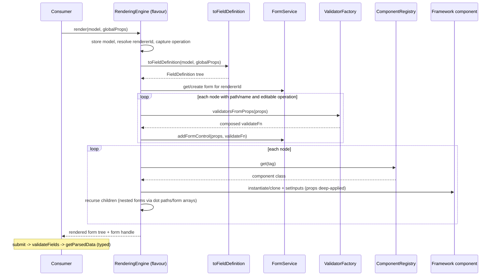
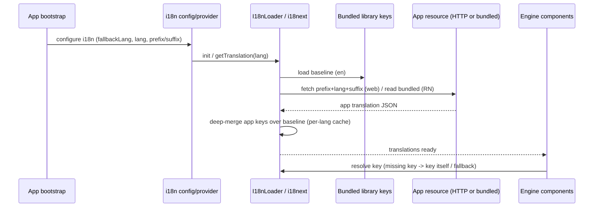
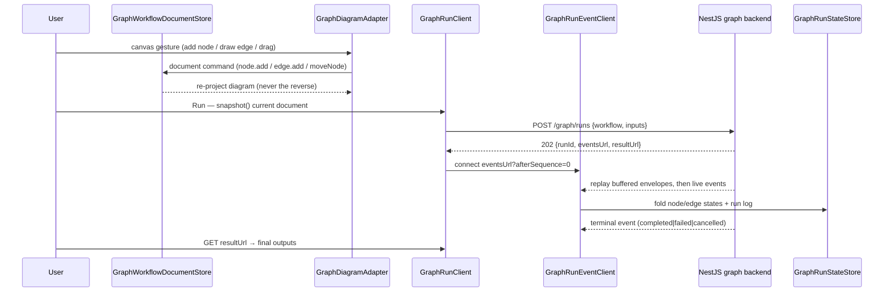

# 10 — Frontend Engines Design

**Source:** research briefs [11 — for-angular](../_research-briefs/11-angular.md), [12 — React/Next/styles](../_research-briefs/12-react-next-styles.md), [13 — React Native](../_research-briefs/13-react-native.md).

> The architecture is detailed in the [Architecture Handbook](../architecture-handbook/08-frontend-engines.md).

## 1. Overview

The decaf frontend layer turns decorated `Model` instances into UIs through
per-framework *rendering engines*. A single framework-agnostic contract
(`RenderingEngine` / `FieldDefinition` / `Renderable` in `@decaf-ts/ui-decorators`)
is implemented by four flavours: Angular/Ionic (`for-angular`, mature), React
(`for-react`, early), React Native (`for-react-native`, scaffold/app), and a
Next.js slot (`for-nextjs`, scaffold only). A shared SCSS design system
(`styles`) provides `dcf-*` tokens and utility classes consumed at the app level.
The Angular engine additionally hosts an in-repo graph workflow editor that is a
document-native HTTP/SSE client of the `integrations` NestJS graph backend: it
edits a canonical `GraphWorkflowDocument`, discovers nodes from backend
manifests, and drives the asynchronous run lifecycle.

This document specifies the design goals, principles, requirements, and
acceptance criteria for the frontend engines. Maturity varies sharply across
flavours; where a flavour is not yet a consumable library, that is stated
explicitly and the design describes the intended target, not a fabricated
reality.

## 2. Design Principles

**One contract, many flavours.**
*Why:* model-driven rendering must create real framework components and bind real
form state; only leaf resolution ("which component for this tag", "which form
primitive for this control") is framework-specific. Sharing `toFieldDefinition`
and the decorator metadata across flavours keeps the UI from drifting from the
model and avoids duplicating metadata/validation logic per framework.
*Enforcing test/spec:* every engine must extend `RenderingEngine` from
`@decaf-ts/ui-decorators` and pass its flavour string to the base; a test must
assert `RenderingEngine.get()` returns the booted engine of the declared flavour.

**String-tagged component registries.**
*Why:* the `FieldDefinition` tree only knows tags (from `@uielement`/`@uichild`),
not concrete component classes, so apps can swap/extend rendering without
touching model metadata, and the same model can render on multiple frameworks.
*Enforcing test/spec:* a test must register a component under a tag, render a
definition with that tag, and assert the registered component is used; a missing
tag must produce a defined miss behaviour (Angular throws on duplicate
registration; React warns + returns null; RN warns).

**Model-driven forms with typed extraction.**
*Why:* the form is derived from the same metadata that drives validation and the
UI, and submitted values must be typed (numbers parsed, dates converted, strings
escaped) rather than raw strings.
*Enforcing test/spec:* `getParsedData()` must convert numeric fields to numbers,
date/datetime-local fields to `Date`, and escape other strings; validation must
run before submit and block invalid submits.

**i18n via translation loading over a bundled baseline.**
*Why:* library components always have translatable strings (errors, default
buttons, empty states); apps layer their own resources on top and the loader
deep-merges so app keys override library keys without forking the bundle.
*Enforcing test/spec:* a missing key resolves to the key itself (or a configured
fallback); app resources override library keys of the same name.

**Remote graph execution, local graph editing.**
*Why:* the workflow is one canonical `GraphWorkflowDocument` shared by editor,
persistence, and backend; the editor projects it onto the canvas and ships the
exact same document over the run API, so displayed state and executed state
cannot diverge. Keeping execution remote and node discovery manifest-driven
also keeps the browser bundle free of engine code and node constructors.
*Enforcing test/spec:* the executed document must be the current document-store
snapshot (12-step canvas→run E2E); the diagram must be a pure projection with
command-only mutation; the bundle-wall spec must prove no engine/executor/
catalogue-runtime code reaches the production bundle; run events must fold
into frontend state through the run state store.

## 3. Engine Design

### 3.1 Angular (`for-angular`)

The Angular engine is the reference implementation and the only production-ready
flavour. It exposes `NgxRenderingEngine` (extends `RenderingEngine`, flavour
`'angular'`), a `@Dynamic()` component registry keyed by selector, a directive
inheritance chain (`DecafComponent` → `NgxRepositoryDirective` →
`NgxComponentDirective` → page/parent/form/field branches), a static
`NgxFormService` (Angular `FormGroup`/`FormArray`), and `injectService()`/
`injectRepository()` bridging decaf singletons into Angular property
initializers. It also ships `ForAngularCommonModule` (boots the engine on import)
and a full component set (CRUD form/field, list/table, modal, fieldset, stepped
form, model builder, cron selector, etc.).

Boot is idempotent via a window flag set at module-evaluation time. The DB
adapter flavour is read from `window` (`getDbAdapterFlavour`).

### 3.2 React (`for-react`)

The React engine (`RgxRenderingEngine`, flavour `'react'`) mirrors the Angular
design: a static `RgxComponentRegistry` (`Map<tag, ReactComponent>`), a static
`RgxFormService` (dot-path controls, nested children, typed `getParsedData`),
`ValidatorFactory` bridging `decorator-validation`, `RgxEventEmitter` (React
replacement for `EventEmitter`), directive base classes ported as plain TS
abstract classes, and `I18nLoader` (HTTP fetch merged over built-in `en.json`).
Built-in components register under `ngx-decaf-*` tags for API parity.

*Status:* v0.0.1, broken packaging (`exports`/`types` point at a non-existent
`lib/`; `files` excludes source), components not exported from the barrel,
missing `@faker-js/faker` dependency, and version drift against workspace
`ui-decorators` (missing abstract `getModal`/`getToast`/`getSpinner`/`router`).
Not consumable as a library today.

### 3.3 Next.js (`for-nextjs`)

*Status:* scaffold only. `src/` is an unmodified `create-next-app` shell
(App Router, Tailwind v4, React Compiler). There is no engine code, no library
entry point, and no decaf patterns. The design target is a Next.js rendering
flavour sibling to `for-angular`/`for-react`, but no design is implemented yet;
this section records the gap rather than specifying an unimplemented design.

### 3.4 React Native (`for-react-native`)

The RN engine (`RnRenderingEngine`, flavour `'react-native'`) uses
`react-hook-form` (rather than a custom static registry) as its form primitive:
`RnFormService` wraps `UseFormReturn`, `RnRenderingEngine.render` wraps the tree
in `<FormProvider>`, and `RnDecafCrudField` uses `<Controller>` with
`rules.validate` built by `ValidatorFactory`. Nested forms use dot paths plus a
`../` parent token (`PARENT_TOKEN`); comparison validators read sibling values
through a `PathProxy`. i18n is synchronous via `i18next` + `TranslateService`.
UI primitives are Gluestack UI v2 wrapped with NativeWind/Tailwind. Components
must be manually registered against `ngx-*` tags before rendering.

*Status:* structured as an Expo *app* (no library barrel; `main` is
`expo-router/entry`), one demo screen, no real tests. Consumed via path aliases,
not as an installable library.

## 4. Model-driven Form Design

A form is produced from a model in three stages:

1. **Definition.** The inherited `toFieldDefinition(model, globalProps)` reads
   `@uimodel`/`@uilayout`/`@uielement`/`@uichild` metadata and produces a
   `FieldDefinition` tree whose nodes carry `tag`, `props`, `path`/`name`, and
   children.
2. **Form construction.** The engine resolves a `rendererId` (or generates one),
   fetches/creates the form service for that id, and for every node with a
   `path`/`name` calls `addFormControl`, attaching validators built from the
   field props. Children recurse; nested fieldsets create child form services via
   dot paths (RN/React) or form arrays (Angular).
3. **Rendering.** Each node's `tag` is resolved through the component registry
   to a concrete component; inputs are applied (only inputs present in the
   component mirror for Angular; `props` deep-applied); children render
   recursively. Read-only operations (`READ`/`DELETE`) suppress control
   registration.

Validation composes per-key validators first-error-wins; comparison validators
(`eq`, `diff`, `lessThan`, …) read sibling/parent values via a path proxy (RN)
or form-group traversal (Angular). `email`/`password`/`url` remap to `pattern`
validators with `DEFAULT_PATTERNS`.

### 4.1 Render a model-driven form



## 5. Component Design

- **Tag-keyed registry.** Each engine maintains a registry mapping the string
  `tag` (written by `@uielement`/`@uichild`) to a concrete component. Angular
  uses `@Dynamic()` + selector; React/RN use a static `Map` with explicit
  `register(tag, Comp)`. Built-in tags use the `ngx-decaf-*` family across all
  flavours for parity.
- **Shared directive/component base.** A single inheritance spine carries
  shared inputs (model, mapper, pk, props, operations, handlers/events, locale,
  dark mode) and shared behaviour (`handleEvent`, `parseProps`,
  `changeOperation`), so dynamic components do not re-implement lifecycle or
  event dispatch.
- **Event contract.** Components accept `handlers`/`events` (functions or event
  handler subclasses); a single `handleEvent` dispatches to a handler or re-emits
  on a bubbled output (`listenEvent` in Angular, `RgxEventEmitter` in React).
  `ComponentEventNames` names standard events (Render, Submit, BackButtonClick,
  ValidationError, …).
- **Modal/router/spinner/toast.** Each engine implements the `IDecafRouter`/
  `Spinner`/`Toast`/`Modal` contracts from `ui-decorators` (Angular via
  `NgxRouterService`, `NgxSpinner`/`NgxToast`, modal factory functions).

## 6. i18n Design

- **Bundled baseline.** Each engine ships a small set of library keys
  (`for-angular`: `i18n/data/{en,pt}.json`; `for-react`: built-in `en.json`;
  `for-react-native`: bundled `en`/`pt` JSON) so library components always have
  translatable strings.
- **Loading model.**
  - *Angular/React:* an `I18nLoader` HTTP-fetches `{prefix}{lang}{suffix}` per
    resource and deep-merges app keys over the bundled baseline, caching per
    language. A custom parser keeps decaf `sf` interpolation consistent.
  - *React Native:* `i18next` is initialized synchronously with the bundled
    keys; `TranslateService` wraps it and `useTranslate` re-renders on language
    change.
- **Locale derivation.** Locale keys are derived from component class names
  (camelCase → dot-separated, reversed when <3 parts) where the engine computes
  keys automatically.
- **Error namespace.** Field validation errors resolve through an `errors.*`
  namespace; a validator returns `{key, message}` and the field looks up the
  translated string.

### 6.1 Load translations



## 7. Graph Editor Design (Angular only)

The graph editor is an in-repo subsystem of `for-angular` (`src/graph`), not
published. Since the canonical cutover it is **document-native and
manifest-driven**: it edits a `GraphWorkflowDocument` held by
`GraphWorkflowDocumentStore` and runs it against the remote backend's
asynchronous run lifecycle. No node constructors, legacy config-store state,
or engine code reach the browser (asserted by `src/graph/bundle-wall.spec.ts`).

- **Catalogue.** `GraphNodeCatalogService` loads/refreshes `GraphNodeManifest[]`
  (backend `GraphNodeCatalogApi` merged with offline
  `GraphNodeManifestFixtures` via `GraphNodeCatalogCompositeSource`); the
  palette renders manifests and `GraphNodePaletteFactory` turns a pick into a
  `GraphNodeInstance` + `node.add` command.
- **Canvas.** `GraphDiagramAdapter` is the only document⇄ng-diagram bridge:
  projection is a pure function of (document, manifest reader); every canvas
  gesture goes through `GraphDiagramMutationTranslator` and becomes a document
  command (`GraphDocumentCommands`) — the diagram is re-projected from the
  store, never the reverse. Positions commit on drag-end; viewport lives in
  the document's `ui` block; ghost nodes/selection/run overlays project from
  the document without constructor copies.
- **Parameters.** `GraphParameterRendererRegistry` resolves typed renderers
  per `GraphParameterDefinition` (text, multiline, number, boolean, static and
  dynamic options, collection, object, code, expression, resource locator,
  credential, notice, hidden) with generic fallback;
  `GraphParameterVisibilityEvaluator` evaluates the declarative visibility
  DSL; `GraphParameterValidationMapper` applies manifest validation.
- **Execution bridge.** The run path is remote and asynchronous:
  `GraphRunClient.createRun({workflow: document, inputs})` → `202` with
  `eventsUrl`/`resultUrl`; `GraphRunEventClient` replays run events from
  sequence zero, reconnects from the last sequence, falls back to run-status
  polling, and stops after the terminal event; `GraphRunStateStore` folds
  envelopes into node/edge UI states. The deprecated
  `GraphExecutionService.executeDocument` path (`POST /graph/execute`) is
  retained for compatibility only.
- **Persistence.** `GraphSaveService`/`GraphHistoryService`/
  `GraphAutoSaveService`/`GraphMutationDetectorService` read from the document
  store; history stores canonical documents (snapshot round-trip via the
  `{document, editor}` wrapper), and legacy snapshots load through lossless
  read-path conversion.

### 7.1 Canvas → run sequence



## 8. Functional Requirements

- **FR-1 (all engines):** An engine MUST extend `RenderingEngine` from
  `@decaf-ts/ui-decorators` and pass a unique flavour string to the base. The
  base MUST self-register the instance so `RenderingEngine.get()` returns the
  booted engine. Boot MUST be idempotent.
- **FR-2 (all engines):** `render(model, globalProps)` MUST produce a
  `FieldDefinition` tree via the inherited `toFieldDefinition` and resolve each
  node's `tag` through a component registry. A missing tag MUST produce defined
  miss behaviour (Angular: throw on duplicate registration; React/RN: warn).
- **FR-3 (all engines):** For every editable field with a `path`/`name`, the
  engine MUST register a form control with validators built from the field
  props. Read-only operations (`READ`/`DELETE`) MUST suppress control
  registration.
- **FR-4 (all engines):** `getParsedData()` MUST type-convert values (numbers
  parsed, date/datetime-local converted to `Date`, other strings HTML-escaped)
  and recurse into nested child forms.
- **FR-5 (all engines):** Validation MUST run before submit; invalid submits
  MUST be blocked and controls re-enabled. Validators compose first-error-wins;
  comparison validators read sibling/parent values via a path proxy or form
  traversal.
- **FR-6 (all engines):** Each engine MUST implement the host-service contracts
  (`IDecafRouter`/`Spinner`/`Toast`/`Modal`) declared in `ui-decorators`.
  - *Caveat (for-react):* against workspace `ui-decorators`, `RgxRenderingEngine`
    does not implement the abstract `getModal`/`getToast`/`getSpinner`/`router`
    members; this is a known gap (see Inaccuracies).
- **FR-7 (i18n):** Engines MUST ship a bundled baseline of library keys and
  deep-merge app-supplied resources over the baseline per language. A missing
  key MUST resolve to the key itself or a configured fallback.
- **FR-8 (i18n):** Field validation errors MUST resolve through an `errors.*`
  namespace using the validator's `{key, message}` result.
- **FR-9 (graph, Angular only):** The editor MUST hold the current workflow as
  a canonical `GraphWorkflowDocument`; every semantic mutation MUST be a
  document command, and the diagram MUST be a pure projection of the store.
  Execution MUST be remote and asynchronous (`POST /graph/runs` → `202`, then
  run-scoped SSE with replay/reconnect); events MUST fold into frontend state
  via the run state store; the executed document MUST be exactly the displayed
  document.
- **FR-10 (graph, Angular only):** The editor MUST preserve runtime state
  (drags, viewport, selection) across re-renders via the document's `ui` state
  and the `{document, editor}` snapshot wrapper; positions commit on drag-end
  only. Node discovery MUST come from backend-provided manifests — never
  constructors.

## 9. Acceptance Criteria

```gherkin
Feature: Frontend engine model-driven rendering

  Scenario: Form renders successfully from a decorated model
    Given a Model decorated with @uimodel, @uielement, and @uichild metadata
    And concrete components are registered for each tag in the definition tree
    And a booted RenderingEngine of the target flavour
    When the engine renders the model with global props
    Then a form tree is produced with one control per editable field
    And each rendered node uses the component registered for its tag
    And read-only operations suppress control registration

  Scenario: Validation errors are displayed on invalid submit
    Given a rendered form with fields carrying validation metadata
    When the user submits with invalid values
    Then validateFields runs and returns false
    And controls are re-enabled
    And the submit is blocked
    And each invalid field displays a translated error from the errors.* namespace

  Scenario: Missing i18n key resolves to the key
    Given an engine with i18n configured
    When a component resolves a key that is absent from both the app resource and the bundled baseline
    Then the resolved string equals the key itself (or the configured fallback)

  Scenario: Graph snapshot restores runtime state across re-render
    Given a loaded workflow document with user drags, viewport, and selection
    When the diagram model is re-projected from the document store
    Then the editor restores the document's ui state (positions, viewport)
    And drags, viewport, and selection are preserved
    And the persisted/executed document equals the displayed document

  Scenario: Engine not initialized returns no engine
    Given no RenderingEngine has been booted for a flavour
    When RenderingEngine.get() is called for that flavour
    Then no engine is returned (or the engine is booted on first import per the flavour's idempotent boot)
```

## 10. Environment Variables

Only the variables actually read by the engines (per the briefs) are listed.
Where a flavour reads none, that is stated.

| Variable | Engine | Purpose | Default |
|:--|:--|:--|:--|
| `GRAPH_BACKEND_URL` | for-angular (graph) | Graph execution backend base URL | `http://localhost:3000` |
| `GRAPH_HISTORY_LIMIT` | for-angular (graph) | Graph undo history depth | `10` |
| `GRAPH_AUTOSAVE_DEBOUNCE_MS` | for-angular (graph) | Graph auto-save debounce | `500` |
| `process.env.NODE_ENV` (+ `window.env.CONTEXT`/hostname) | for-angular / for-react (indirectly, via `isDevelopmentMode`) | Dev-mode detection | n/a |
| `DARK_MODE` | for-react-native | Set to `media` by the `start` script | `media` |
| (none) | for-react | No env vars consumed; config is window-global (`DB_ADAPTER_PROVIDER`) | n/a |
| (none) | for-nextjs | No engine env vars; Next.js defaults only | n/a |
| (none) | styles | No env vars; theming is class/variable based | n/a |

Note: `for-angular`'s `src/environments/environment.ts` reads `window.ENV`, but
that file is dead/broken (imported nowhere; see Inaccuracies). `CI/release`
tokens (`.npmtoken`, `.token`) referenced by helper scripts are out of scope for
engine runtime.

## 11. Usage Examples

### Angular — render a model in a page

```html
<ngx-decaf-model-renderer
  [model]="model"
  (listenEvent)="handleSubmit($event)"
  [globals]="globals"
></ngx-decaf-model-renderer>
```

### Angular — application bootstrap

```typescript
provideIonicAngular({ mode: 'md' }),
provideDecafDbAdapter(RamAdapter, { user: 'user', dbName: 'for-angular' }),
provideRouter(routes, withComponentInputBinding()),
provideDecafPageTransition(),
provideDecafDynamicComponents(AppExpiryDateFieldComponent, AppSwitcherComponent,
  AppSelectFieldComponent, CronSelectorFieldComponent),
provideDecafI18nConfig({ fallbackLang: 'en', lang: 'en' },
  [{ prefix: './assets/i18n/', suffix: '.json' }]),
```

### React — render a field definition through the engine + registry

```tsx
const Tag = ({ children }: { children?: React.ReactNode }) => (
  <div data-testid="rendered">{children}</div>
);
RgxComponentRegistry.register("demo", Tag);
const engine = new RgxRenderingEngine();
engine.initialize();
const node = (engine as any).fromFieldDefinition({
  tag: "demo",
  props: { name: "demoField" },
  children: [],
});
```

### React Native — register, build, and render a model

```tsx
import "reflect-metadata";
import { ComponentRegistry, RnRenderingEngine } from "@/src/engine";
import { RnDecafCrudField, RnDecafCrudForm, RnFieldset } from "@/src/components";
import { UserProfileModel, ProfessionalInfoModel } from "@/src/models";

ComponentRegistry.register("ngx-decaf-crud-form", RnDecafCrudForm);
ComponentRegistry.register("ngx-decaf-crud-field", RnDecafCrudField);
ComponentRegistry.register("ngx-decaf-fieldset", RnFieldset);

const model = new UserProfileModel({
  fullName: "John Smith", age: 18, birthDate: "1985-05-15",
  email: "john.smith@example.com", password: "P@ssw0rd01",
  phone: "(11) 98765-4321", gender: "male",
  address: { street: "Main Street", complement: "Apt 101", zipCode: "12345-000", city: "New York" },
  professionalInfo: new ProfessionalInfoModel({ position: 3, company: "Tech Solutions Inc." }),
  acceptTerms: true,
});

const renderingEngine = new RnRenderingEngine();
export default function Home() {
  return <ScrollView><Center>{renderingEngine.render(model)}</Center></ScrollView>;
}
```

### React Native — i18n

```ts
import { TranslateService, useTranslate } from "@/src/core";
await TranslateService.changeLanguage("pt");
const msg = TranslateService.get("user.fullName.label");
const label = useTranslate("user.email.label", "Email");
```

### styles — consumption and dark-mode toggle

```scss
// Global styles of for-angular
@forward "@decaf-ts/styles/dist/main.css";
```

```ts
element.classList.toggle("dcf-palette-dark", shouldEnable);
```

## 12. Open Questions / Risks

- **for-react / for-nextjs / for-react-native are not consumable libraries.**
  for-react has broken packaging and an unexported component barrel; for-nextjs
  has no engine code; for-react-native is an Expo app with no library barrel.
  Building on any of these as an installable engine is not viable today.
- **Version drift.** for-react/for-nextjs resolve old published `@decaf-ts/*`
  versions unrelated to workspace source; for-react would not compile against
  workspace `ui-decorators` (missing abstract members).
- **Angular `@decaf-ts/overrides/ui-decorators` bare import** is unresolvable
  outside the monorepo (no npm package; tsconfig `paths` alias only).
- **Graph subsystem is not published.** Consumers must work from the monorepo;
  documented graph import paths (`@decaf-ts/for-angular/graph`) do not exist.
- **Hardcoded JWT** in `DecafAxiosHttpAdapter.token` (for-angular) shipped in
  source and dist — security risk; do not reuse the pattern.
- **i18n default prefix mismatch** (for-angular) — `./app/assets/i18n/` vs the
  demo's `./assets/i18n/`; omitting the resource config 404s.
- **styles undefined CSS variables** (`--dfc-*` typo, `--dcf-font-family`) —
  some utility rules silently fall back; prod-only root entry; remote font
  dependency; stale `lib/`.
- **RN Rules-of-Hooks violations** in `RnDecafCrudField` (`useTranslate` called
  in loops/conditionals); `<form>` rendered in RN; `date` field renders nothing;
  `minlength`/`maxlength` casing mismatch; select `selectedValue` uses
  translated text — see Inaccuracies.
- **Low test coverage.** for-angular core engine has no direct unit test; the
  `@Dynamic()` spec is skipped. for-react tests only the engine core. for-nextjs
  and for-react-native have zero real tests.

Continue to the next design section.
