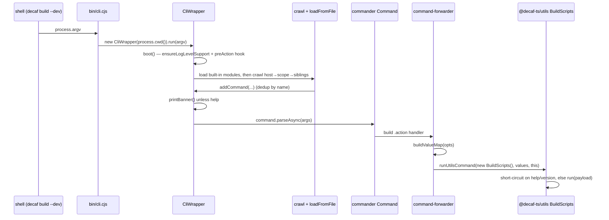
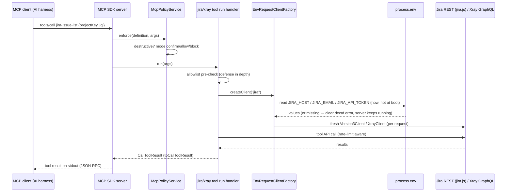

# 11 — Tooling, CLI & MCP Server Design

The architecture is detailed in the [Architecture Handbook](../architecture-handbook/09-tooling-infra.md).

This specification covers the design of the decaf-ts tooling layer
(`@decaf-ts/utils`, `@decaf-ts/cli`) and the MCP server + CLI surface
delivered in `@decaf-ts/with-ai` (the legacy `@decaf-ts/mcp-server` is
retired — its capability surface was redesigned and ported into `with-ai`
under specification DECAF-51), plus the operational infra packages that the
research briefs document (`with-ai`'s Paperclip bundle, `reusable-actions`,
`ts-template`, `as-infra`, `bin`, `docker`). It is grounded in the research
briefs and in direct source review of the delivered `with-ai`
CLI/MCP/crypto/skills code. The approved DECAF-51 scope, goals, and
requirements live in the specification record
[`workdocs/ai/project/specifications/DECAF_51.md`](../../specifications/DECAF_51.md)
(domain root [SAA-560](/SAA/issues/SAA-560)) and are referenced, not
restated, here. Where a brief is thin, this spec says so.

## 1. Design Principles

**Tooling is a leaf, not a framework dependency.** — Why: keeping `utils`/
`cli`/`with-ai` free of imports from the persistence/HTTP/UI layers means the
tooling can evolve and release independently of the runtime frameworks.
Enforcing test/spec: `utils` declares only `@decaf-ts/logging` as a runtime dep;
`with-ai` (now home of the MCP server and CLI commands) consumes only the
decaf-ts foundation (`logging`, `core`, `crypto`, `db-decorators`, `cli`) and
has no in-monorepo runtime dependents (verified by dependency inspection in
the brief and by the DECAF-51 source review).

**One CLI framework on top of one command framework.** — Why: `utils`
`Command<I,R>` (Template Method) is the single substrate for every CLI command,
and `cli` `CliWrapper` is the single discovery + dispatch layer on top of
Commander; avoiding a second command abstraction prevents divergent arg/help/
dry-run semantics. Enforcing test/spec: built-in `build`/`release`/`utils`
modules forward to `@decaf-ts/utils` command classes via
`runUtilsCommand`; discovered modules must resolve to a commander `Command`.

**Discoverable extensibility over central registration.** — Why: any decaf-ts
package can extend the `decaf` CLI by shipping a `cli-module.cjs`/`.mjs` without
editing a central registry; the with-ai MCP server likewise uses per-module
self-registration — each module under `src/mcp/{jira,xray,common}`
self-registers via the `@mcpModule()` decorator at import time, and the server
core (`McpServerService`) only iterates the registry, so adding a module
requires no core changes. Enforcing test/spec: `CliWrapper` crawls host →
`@decaf-ts/*` scope → siblings for `${CLI_FILE_NAME}\.[cm]js$` and dedups by
resolved path; `McpServerService.load()` imports the `src/mcp/modules.ts`
manifest for its side effects and iterates `defaultMcpModuleRegistry`.

**MCP runtime fully detached from the CLI.** — Why: the MCP server process
reserves stdout for JSON-RPC under the stdio transport and must not share
process-lifecycle state with CLI commands; an ESLint `no-restricted-imports`
rule scoped to `src/mcp/**` forbids imports of `**/cli/**`/`**/cli-module*`,
making the detachment mechanical rather than conventional. Enforcing test/spec:
all decaf logging is routed to stderr via a `Logging` factory swap before boot
does anything else; the `mcp` CLI command is a thin launcher over
`bootMcpServer` only.

**Clients per request, credentials lazily.** — Why: boot must never read
credentials and must never fail on missing or invalid credentials (user hard
requirement, DECAF-51); building Jira/Xray clients inside each tool request
with environment credentials read at that moment confines credential failures
to the individual tool call. Enforcing test/spec: `EnvRequestClientFactory.
createClient` is invoked only from tool `run` handlers; registration-time code
paths read no credentials.

**Build-time token substitution keeps metadata out of source.** — Why:
`##...##` placeholders (`VERSION`/`COMMIT`/`FULL_VERSION`/`PACKAGE_NAME`) are
injected by `build-scripts` at bundle time so published artifacts carry the
real `package.json` version without source edits. Enforcing test/spec: the
placeholder constants are literal in source and only meaningful in a built
`build-scripts` bundle.

**Validation at the boundary.** — Why: tool definitions are registered through
a single surface that normalizes the zod schema (raw shape extraction for the
MCP SDK) and applies the destructive-tool policy before any module handler
runs; this guarantees every registered tool is well-formed, its argument
schema is advertised to clients, and destructive calls are gated. Enforcing
test/spec: `McpServerService.registerTool` extracts the raw zod shape and
wraps every handler with `McpPolicyService.enforce`.

**One canonical skip-CI token across local release and CI.** — Why:
`bin/tag-release.sh` normalizes `-no-ci`/`[skip ci]``/`[ci skip]`/… to a single
`[skip ci]` before commit/tag, matching the assumption baked into
`reusable-actions` publish/release workflows. Enforcing test/spec:
`publish-on-release.yaml` explicitly checks
`!endsWith(github.event.release.body, '[skip ci]')`.

## 2. CLI Design — `@decaf-ts/cli`

### 2.1 CliWrapper

`CliWrapper` extends `LoggedClass` and lazily builds a root commander `Command`
(`command` getter), initialized via `CLIUtils.initialize` which hard-codes
`command.name("decaf")`.

- Constructor: `(basePath?, crawlLevels=4)`; the bin passes `process.cwd()`.
- `run(args?)`: awaits `boot()` then `command.parseAsync(args)`.
- Static `accumulateEnvironment(obj)` / `getEnv()` for the accumulated
  `DecafCLieEnvironment`.
- `boot()`: `ensureLogLevelSupport` adds `--logLevel` + a `preAction` hook
  (default `LogLevel.info`); loads built-in modules then crawls
  host/scope/sibling paths.

### 2.2 Command dispatch

Built-in modules (`INCLUDED_MODULE_FACTORIES = [buildModule, releaseModule,
utilsModule]`) load first. For `build`, the `.action` handler builds a value
map (`buildValueMap`) then `runUtilsCommand(new BuildScripts(), values, this)`
which merges `DefaultCommandValues`, short-circuits on help/version, else calls
`BuildScripts.run(payload)`. The `preAction` hook applies any `--logLevel`
override.



### 2.3 Module discovery

- `crawl(basePath, levels)` recursively scans for
  `${CLI_FILE_NAME}\.[cm]js$` (i.e. `cli-module.cjs`/`.mjs`; **not** `.js`).
- Each hit is `import()`-ed via `CLIUtils.loadFromFile`/`normalizeImport` (handles
  CJS `default` unwrapping); loaded modules may be a `Function` (invoked) or
  `Promise` (awaited) and must resolve to a commander `Command`.
- Discovery scope: host path → `@decaf-ts/*` scope roots → sibling packages in
  the enclosing `node_modules`; a `seen` set dedups by resolved path.

### 2.4 CLI module creation

A package extends the `decaf` CLI by authoring `cli-module.cjs` (or `.mjs`)
exporting a factory that resolves to a commander `Command`. The factory is
loaded by `CLIUtils.loadFromFile`/`normalizeImport`, invoked/awaited, and the
resulting `Command` is added via `addCommand` (dedup by name). No central
registry edit is required.

### 2.5 Environment

- `DefaultCliEnvironment = { banner: true, cliModuleRoot, style: true }`.
- `cliModuleRoot` defaults to `process.cwd()` unless env var `CLI_MODULE_TOOT`
  is set (the env var name is a documented typo for `CLI_MODULE_ROOT`).
- Banner suppressed for `-h`/`--help`/`help`; disable globally via
  `DecafCLieEnvironment.banner = false`.

## 3. utils Design — `@decaf-ts/utils`

### 3.1 Command framework

`Command<I,R>` is the abstract Template-Method base. Subclasses implement
`run(answers)` and optionally `help()`; `execute()` orchestrates parsing →
help/version short-circuit → prompt for missing answers (via `UserInput`) →
`run`. Concrete commands (`BuildScripts`, `ReleaseScript`,
`ReleaseChainCommand`, `ModulesCommand`, `NpmLinkCommand`, `NpmTokenCommand`,
`RunAllCommand`, `TagReleaseCommand`, `CredentialsCommand`,
`CompileMatrixCommand`, `MirrorRepoCommand`) are re-exported from
`src/cli/commands/index.ts`.

### 3.2 Output strategy

`OutputWriter` (interface), `StandardOutputWriter` (logs+accumulates),
`RegexpOutputWriter` (resolves the executor on the first regex match) form a
Strategy family over process output. `spawnCommand`/`runCommand` route
stdout/stderr chunks to an `OutputWriter`; on exit the executor resolves/
rejects.

### 3.3 Credentials

`CredentialsCommand` (+ `resolveSecret`/`hasSecret`) resolves credentials via a
Chain-of-Responsibility: env var (CI) → OS keychain (local) → deprecated legacy
plaintext file (with warning). `credentials --action setup --rm` enrolls
built-in secrets in the OS keychain and removes legacy files.

### 3.4 Release chain

`ReleaseChainRunner`/`runReleaseChain`/`dispatchReleaseChainWorkflow` encode
multi-step release pipelines as composable, abortable units
(`chainAbortController` composes AbortControllers; `lockify` is a mutex
wrapper).

### 3.5 Build placeholders

`VERSION`/`COMMIT`/`FULL_VERSION`/`PACKAGE_NAME` are literal `"##...##"` in
source, substituted by `build-scripts` at bundle time. They are only meaningful
in a built `build-scripts` bundle.

### 3.6 Secondary entrypoint

`@decaf-ts/utils/tests` exposes `TestReporter`, `Consumer`, `jestPerformanceRunner`,
and helpers via a separate export map (not reachable from the main import).

## 4. MCP Server & CLI Design — `@decaf-ts/with-ai`

The legacy `@decaf-ts/mcp-server` design is retired; its capability surface is
redesigned into `with-ai` under specification DECAF-51 (see the
[architecture handbook chapter 09](../architecture-handbook/09-tooling-infra.md)
§4 for the capability mapping). This section specifies the delivered design.

### 4.1 Detached boot & transports

`bootMcpServer(options)` (`src/mcp/McpBoot.ts`) is the single boot routine,
invoked by the thin `decaf with-ai mcp` launcher or the standalone
`with-ai-mcp` bin:

1. If the transport is stdio (the default), `applyStderrOnlyLogging()` swaps
   the decaf `Logging` factory to a stderr-writing logger for every logging
   context in the process — stdout carries only MCP JSON-RPC frames.
2. `McpServerService.load()` creates the SDK server and registers every
   module (below). No credentials are read at boot.
3. Transport connect: `StdioServerTransport` (the CLI action stays pending
   until the transport closes so the CLI wrapper's stdout farewell cannot
   pollute the channel), or `StreamableHTTPServerTransport` for
   `"http"` (JSON-response mode, UUID session ids, default port 3111;
   the bin reads `MCP_PORT`). Any other transport value throws a clear
   decaf error.

`McpBootOptions`: `transport` (`"stdio" | "http"`), `port`, `endpoint`.

### 4.2 Per-module self-registration

- `McpModule` is the module contract: a `name` plus
  `register(context: McpModuleContext)`. The `@mcpModule()` class decorator
  instantiates a module and registers it in the shared
  `defaultMcpModuleRegistry` at import time.
- `src/mcp/modules.ts` is the manifest (common, jira, xray);
  `McpServerService.load()` imports it for its side effects and iterates the
  registry. The core never references concrete modules — **adding a module
  means creating `src/mcp/<name>/`, implementing `McpModule`, decorating it
  with `@mcpModule()`, and adding one export line to the manifest** (Req-2).
- `McpModuleContext` is the registration surface: `registerTool`,
  `registerPrompt`, `registerTemplate`, and the shared per-request
  `clientFactory`. Modules never touch the SDK server directly.
- Failure isolation: a module whose `register()` throws is logged and
  skipped; it never takes the server down.
- Per the DECAF-51 scope amendment, modules register **tools/templates only —
  no prompts**; dropped prompt/command capabilities are covered by the
  with-ai skills catalog plus Paperclip orchestration.

Tool registration (`McpServerService.registerTool`) normalizes the module's
zod `inputSchema` to a raw zod shape, applies the destructive-tool policy to
the advertised description, and wraps every handler so the policy gate runs
before the module handler. Templates are stored in-memory and exposed as MCP
resources under `with-ai://templates/{id}` with `text/markdown` content.

### 4.3 Destructive-tool policy

`McpPolicyService` (US-5) implements the industry-standard MCP policy
pattern: SDK tool annotations (`readOnlyHint`, `destructiveHint`,
`idempotentHint`, `openWorldHint`) plus server-level enforcement.

- **Display:** destructive tools (`destructiveHint: true`) carry a
  `[DESTRUCTIVE]` prefix and a policy note in their advertised description,
  so they are clearly flagged even in clients that ignore annotations.
- **Enforcement:** every tool invocation passes `enforce(definition, args)`
  before the module handler runs. In the default `confirm` mode a
  destructive call must pass `confirm: true` in its arguments;
  `MCP_DESTRUCTIVE_POLICY=allow` disables the gate and `block` hard-fails
  every destructive call. The mode is resolved per call, never cached.

### 4.4 Per-request clients & the Jira allowlist

**Per-request client construction with lazy credentials** (user hard
requirement, DECAF-51): `EnvRequestClientFactory` maps each client kind
(`jira`, `xray`) to a builder registered by the module at boot — registering
a builder reads no credentials. `createClient(kind)` runs inside each tool's
`run` handler, reads the kind's credential variables from the environment at
that moment (`JIRA_HOST`/`JIRA_EMAIL`/`JIRA_API_TOKEN`;
`XRAY_HOST`/`XRAY_CLIENT_ID`/`XRAY_CLIENT_SECRET`), throws a clear decaf
error naming the missing variables, and builds a fresh client
(`jira.js` `Version3Client` with basic auth, or the GraphQL `XrayClient`).
Boot never invokes it; a credential failure fails only the tool call while
the server keeps running. Optional per-kind credential providers can override
environment resolution. The xray module resolves its jira client even more
lazily — only when a step request must resolve an issue key to an id.

**Multi-project Jira access** (US-4): the legacy single-project
`JIRA__PROJECT_KEY` restriction is removed. `JIRA_PROJECT_KEYS` is an
optional comma/whitespace-separated project-key allowlist (unset/empty =
unrestricted). The jira module pre-checks project-sensitive arguments
against the allowlist before the client is built (a disallowed project fails
even when credentials are also missing) and the tools re-check internally —
defense in depth. JQL arguments are scanned for `project =`/`project in (…)`
clauses and each referenced project is checked. `JIRA_DEFAULT_PROJECT_KEY`
(allowlist-checked) and `JIRA_DEFAULT_ISSUE_TYPE` provide create-time
fallbacks; `JIRA_RATE_LIMIT_RETRY_DELAY_MS` (default 3000) governs
rate-limit retries.

### 4.5 Encryption pipeline & skill installation

- **Encryption (`src/crypto/EncryptionService.ts`)** wraps `@decaf-ts/crypto`'s
  `CryptoService.encrypt/decrypt` (AES-256-GCM + PBKDF2-SHA256), replacing the
  legacy raw-node-crypto obfuscation. Each encrypted file is a JSON envelope
  `{v, alg, kdf, salt, data}`; the key is the out-of-band `ENCRYPTION_KEY`.
  `encryptTree`/`decryptTree` walk content trees preserving structure;
  `decaf with-ai encrypt-assets` drives the build-time flow (default: copy to
  `dist/content` and remove plaintext; `--in-place` writes `.enc` next to
  sources). `build:public` = `build:prod` + encrypt `skills,agents` into
  `dist/content`. `.enc` outputs and `.decrypted/` are gitignored; plaintext
  markdown stays committed (Req-6).
- **Skill installation (`src/skills/SkillInstaller.ts`)** installs skills into
  a harness (claude/codex/opencode) by decrypting the packaged content at
  install time inside the installed package and symlinking harness skill
  directories to the decrypted trees. Gated on `ENCRYPTION_KEY`; refuses to
  overwrite real (non-symlink) directories.
- **Content resolution (`src/mcp/McpContentResolver.ts`)** resolves packaged
  content from `WITH_AI_CONTENT_ROOT` → `dist/content` → `lib/content` → the
  repo package root, trying plaintext then `.enc` per candidate. Ticket
  templates single-source from the canonical skills assets
  (`skills/common/maintain-domain-docs/assets/*-template.md`); no duplicate
  copies exist (Req-3).

### 4.6 MCP tool invocation flow



## 5. with-ai Design

`with-ai` is the authoritative skills/agents/markdown source and, since the
DECAF-51 port, the decaf CLI/MCP tooling package: its command modules
(`src/cli/`) are auto-picked-up by the `decaf` CLI (`decaf with-ai mcp |
encrypt-assets | install-skills`), and it hosts the detached MCP server
(`src/mcp/`, §4), the `@decaf-ts/crypto`-based encryption pipeline
(`src/crypto/`, §4.5), and the symlinking skill installer (`src/skills/`,
§4.5). The template scaffold (`src/index.ts`, `src/namespace/`) ships
alongside the real product code. The operational Paperclip bundle design
follows.

- **Skills packaging** — each skill is a directory with a `SKILL.md` carrying
  YAML frontmatter (`name`, `description`, optional explicit `key:` for
  `common/*` and `paperclipai/*`, `categories`) plus optional `references/`/
  `scripts/`/`assets/` siblings. `decaf-ts/*` skills have no explicit key; their
  live slug is the repo path with `/` flattened to `-`, with a `SLUG_EXCEPTIONS`
  map for legacy divergences.
- **Agents packaging** — each agent dir has `AGENTS.md` (frontmatter: `name`,
  `title`, `reportsTo`, `skills:` list) plus `SOUL.md`/`HEARTBEAT.md`/
  `TOOLS.md`; frontmatter is consumed at import time, only the body is stored
  as the agent prompt; the active harness manifest supplies
  `adapter.type`/`config`, `runtime`, `permissions` per agent slug.
- **MCP server integration** — `docker/mcp/managed-mcp.json` is baked into the
  image at `/etc/claude-code/managed-mcp.json` and is the exclusive, zero-trust
  MCP allowlist for in-container agents; it defines read/write-split servers
  (github, google, microsoft mail/calendar/teams), single `playwright`, and
  `@decaf-ts/mcp-server`-routed `xray`/`jira` entries; credentials resolve from
  container env via `${VAR:-}`.
- **CLI init (`bin/init.mjs`)** — parses `.env.secret.template`/
  `.env.projects.template`, generates `openssl rand -hex 32` secrets, fills
  `USER_GID`/`USER_UID`, rewrites `PAPERCLIP_DATA_DIR`/
  `COMPANY_REPOSITORY_PATH`, prompts for a harness, runs `npm run boot:<harness>`,
  waits for health, scrapes the board-claim URL from `docker logs`, and tries to
  open a browser.

## 6. reusable-actions / templates / docker / bin Design

### 6.1 reusable-actions

Composite-by-`workflow_call`: every shared workflow uses `on: workflow_call`
(+ `workflow_dispatch`); callers invoke with `uses: ...@main` and
`secrets: inherit`. Skip-CI normalization pairs
`bin/tag-release.sh` (canonical `[skip ci]`) with `publish-on-release.yaml`'s
explicit `[skip ci]` check. Trivy→Renovate pairing: `trivy-scan.yml` uploads
`trivy-report.json` then dispatches `renovate-trigger`/`renovate-dep-trigger`;
`renovate.yml` reads that report to scope `matchPackageNames` to vulnerable
packages at the configured severity and to prune stale `package.json`
`overrides` entries. Concurrency groups keyed by
`${{ github.repository }}-${{ github.ref }}` with `cancel-in-progress` (except
`pages.yaml` which sets it `false`).

### 6.2 ts-template (scaffold)

Scaffolding conventions: barrel `src/index.ts` re-exports submodules; nested
`namespace`/`children` demonstrates the recommended folder hierarchy; every
export carries heavy JSDoc with `@mermaid`/`@example` blocks consumed by the
docs pipeline. Multi-target testing via `tests/workspace-target.ts` +
`TEST_TARGET` lets the same unit tests run against `src`/`lib`/`dist`. Script
contract: `build`/`build:prod`/`test:all`/`coverage`/`docs`/`prepare-pr`/
`prepare-release`/`release` are the shared lifecycle every decaf-ts package
inherits.

### 6.3 as-infra (IaC)

One chart, three value files: `values.yaml` (cloud/AWS-shaped defaults) +
`values-local.yaml` (Minikube overrides) + `values-aws.yaml` (explicit cloud
overrides); environment differences live in overrides/`--set`, never as a
second copy of templates. Portable secrets model: charts never own secret
material; AWS profile renders an ESO `SecretStore` (IRSA) + `ExternalSecret`
syncing from AWS Secrets Manager; local profile sets `secretStore.enabled=false`
and pre-creates the `<release>-secrets` Secret out-of-band (Terraform writes
them into LocalStack Secrets Manager, ESO mirrors them). Terraform drives Helm
in dependency order; two-step bootstrap (`scripts/bootstrap-cluster.sh` then
`terraform apply`); Argo CD GitOps with manual sync.

### 6.4 docker (local dev)

Traefik label-driven routing with oauth2-proxy as a `forwardAuth` middleware;
ELK TLS-from-setup (the `setup` service generates CA + instance certs via
`elasticsearch-certutil` and bootstraps the `kibana_system` password); host-mount
observability (metricbeat/filebeat mount host `/proc`, `/sys/fs/cgroup`, `/`,
`/var/run/docker.sock`); fully env-var parameterized (a `.env` is required but
not committed). These compose files are the local-dev originals that `as-infra`
Helm charts re-derive for Kubernetes. Insecure defaults (`FLEET_INSECURE=true`,
`FLEET_SERVER_INSECURE_HTTP=true`,
`OAUTH2_PROXY_INSECURE_OIDC_ALLOW_UNVERIFIED_EMAIL: true`,
`OAUTH2_PROXY_SSL_INSECURE_SKIP_VERIFY: true`) are appropriate only for local
dev.

### 6.5 bin (workspace orchestration)

Submodule-driven orchestration (`modules.js` is the single source of truth);
local linking instead of publishing for dev (`npm-link.js` symlinks
`node_modules/@decaf-ts/<dep>/lib` to workspace source, skipping `utils` and
`logging` because they cross-reference each other); aggregate dist bundling
(`bundle.js` + `releases/bundles.json` produce `@decaf-ts/dist-*`
meta-packages); vendored tooling (`build-scripts.cjs`/`update-scripts.cjs` are
committed bundled artifacts so submodules can `npx` them without a separate
install).

## 7. Functional Requirements

### 7.1 CLI dispatch

- **FR-CLI-1** — `decaf` shall resolve the bin to `lib/cjs/bin/cli.cjs`, which
  constructs `new CliWrapper(process.cwd())` and calls `run(process.argv)`.
- **FR-CLI-2** — `boot()` shall add `--logLevel` support with a `preAction`
  hook (default `LogLevel.info`), load built-in modules, then crawl host →
  `@decaf-ts/*` scope → siblings for `cli-module.[cm]js`.
- **FR-CLI-3** — Discovered modules shall be loaded via
  `CLIUtils.loadFromFile`/`normalizeImport` (CJS `default` unwrapping), invoked
  or awaited, and added via `addCommand` with name dedup.
- **FR-CLI-4** — For built-in `build`, the action handler shall call
  `runUtilsCommand(new BuildScripts(), values, this)`, short-circuiting on
  help/version, else calling `BuildScripts.run(payload)`.
- **FR-CLI-5** — A random ASCII banner + slogan shall be rendered on `run()`
  when banner is enabled and the invocation is not a help request.

### 7.2 MCP server & CLI (`with-ai`)

- **FR-MCP-1** — `bootMcpServer` shall swap the decaf `Logging` factory to a
  stderr-only logger before anything else when booting over stdio, so stdout
  carries only MCP JSON-RPC frames.
- **FR-MCP-2** — `McpServerService.load()` shall import the `src/mcp/modules.ts`
  manifest for its side effects and register every module found in the
  `defaultMcpModuleRegistry`; a module whose `register()` throws shall be
  logged and skipped, never taking the server down.
- **FR-MCP-3** — Each tool's zod `inputSchema` shall be normalized to a raw
  zod shape before reaching the MCP SDK, and every registered handler shall
  be wrapped so `McpPolicyService.enforce` runs before the module handler.
- **FR-MCP-4** — Destructive tools (`destructiveHint: true`) shall carry a
  `[DESTRUCTIVE]` description prefix and require `confirm: true` per call
  (or an operator `MCP_DESTRUCTIVE_POLICY` of `allow`/`block`), with the mode
  resolved per call.
- **FR-MCP-5** — Clients (jira/xray) shall be constructed per tool request
  via `EnvRequestClientFactory.createClient`; boot and module registration
  shall read no credentials, and missing credentials shall fail only the
  individual tool call with a clear decaf error naming the missing variables.
- **FR-MCP-6** — Jira project access shall be governed by the optional
  `JIRA_PROJECT_KEYS` allowlist (unset = unrestricted multi-project access),
  enforced before per-request client construction and re-checked inside the
  tools (defense in depth), including projects referenced in JQL clauses.
- **FR-MCP-7** — Modules shall register tools/templates only — no prompts
  (DECAF-51 scope amendment); dropped prompt/command capabilities are covered
  by the with-ai skills catalog plus Paperclip orchestration.
- **FR-MCP-8** — Build-time encryption shall use `@decaf-ts/crypto`
  `CryptoService.encrypt/decrypt` (AES-256-GCM + PBKDF2) with a JSON envelope
  and the out-of-band `ENCRYPTION_KEY`; `.enc` outputs and `.decrypted/`
  shall be gitignored and never committed, while plaintext markdown stays
  committed.
- **FR-MCP-9** — Skill installation shall decrypt the packaged content at
  install time inside the installed package and symlink harness skill
  directories to the decrypted trees, gated on `ENCRYPTION_KEY`, refusing to
  overwrite real (non-symlink) target directories.
- **FR-MCP-10** — MCP code shall not import CLI command modules (enforced by
  an ESLint `no-restricted-imports` rule scoped to `src/mcp/**`); the `mcp`
  CLI command shall be a thin launcher over `bootMcpServer` only.

## 8. Acceptance Criteria

### CLI command success

```gherkin
Given a host with a discovered cli-module.cjs exporting a commander Command "foo"
When the operator runs `decaf foo --bar baz`
Then CliWrapper.run boot loads built-in modules and crawls host→scope→siblings
And the discovered "foo" Command is added via addCommand (dedup by name)
And commander.parseAsync routes to the "foo" action handler
And the action handler receives the parsed --bar=baz value
```

### Unknown CLI command

```gherkin
Given no discovered or built-in module named "nope"
When the operator runs `decaf nope`
Then commander.parseAsync does not match a subcommand
And CliWrapper prints the decaf help/usage output (banner suppressed for help)
```

### MCP tool success

```gherkin
Given a booted with-ai MCP server over stdio with JIRA_HOST/JIRA_EMAIL/JIRA_API_TOKEN set
When the MCP client invokes the "jira-issue-list" tool with valid args
Then the policy gate passes (the tool is non-destructive)
And the allowlist pre-check passes (no allowlist configured, or the project is allowed)
And a fresh jira.js Version3Client is built for this request with lazily-read credentials
And the tool returns a CallToolResult via toCallToolResult on stdout, with all logging on stderr
```

### MCP tool error (missing Jira credentials)

```gherkin
Given a booted with-ai MCP server over stdio without JIRA_HOST/JIRA_EMAIL/JIRA_API_TOKEN
When the MCP client invokes any Jira tool
Then the tool was registered at load() time despite the missing env (boot never read credentials)
And the tool call fails with a clear decaf error naming the missing variables
And the MCP server keeps running and serving other requests
```

### MCP destructive tool gated

```gherkin
Given a booted with-ai MCP server with MCP_DESTRUCTIVE_POLICY unset (confirm mode)
When the MCP client invokes "jira-issue-delete" without confirm: true
Then the invocation is rejected by the server-level policy gate before the module handler runs
And the tool's advertised description carries the [DESTRUCTIVE] prefix and policy note
```

### Jira allowlist violation

```gherkin
Given a booted with-ai MCP server with JIRA_PROJECT_KEYS=ALPHA,BRAVO
When the MCP client invokes a jira tool referencing project "CHARLIE"
Then the allowlist pre-check rejects the call before any client is built
And the error names the configured allowlist, even when credentials are also missing
```

## 9. Environment Variables

Only env vars actually read by the tooling packages (per the briefs) are
listed. No others are invented.

### 9.1 utils

| Env var | Purpose |
|---|---|
| `NPM_TOKEN` | token-authenticated install/publish (via `CredentialsCommand` / `bundle.js` / `bin/tag-release.sh`) |

Credentials resolution order: env var → OS keychain → deprecated legacy file
(with warning). No other `utils`-owned env vars are documented in the brief.

### 9.2 cli

| Env var | Purpose |
|---|---|
| `CLI_MODULE_TOOT` | overrides `cliModuleRoot` (the env var name is a documented typo for `CLI_MODULE_ROOT`) |

### 9.3 with-ai MCP/CLI surface

Credentials are read lazily, per tool request — never at boot. The live-suite
npm scripts additionally accept the legacy `JIRA__*`/`XRAY__*` variable names
as fallbacks for operator convenience.

| Area | Env vars |
|---|---|
| Jira credentials | `JIRA_HOST`, `JIRA_EMAIL`, `JIRA_API_TOKEN` |
| Jira policy | `JIRA_PROJECT_KEYS` (multi-project allowlist; unset/empty = unrestricted), `JIRA_DEFAULT_PROJECT_KEY`, `JIRA_DEFAULT_ISSUE_TYPE`, `JIRA_RATE_LIMIT_RETRY_DELAY_MS` (default 3000) |
| Xray credentials | `XRAY_HOST` (default `https://eu.xray.cloud.getxray.app`), `XRAY_CLIENT_ID`, `XRAY_CLIENT_SECRET` |
| MCP policy | `MCP_DESTRUCTIVE_POLICY` (`confirm` default / `allow` / `block`); resolved per call, never cached |
| Content / crypto | `WITH_AI_CONTENT_ROOT` (override the packaged-content root), `ENCRYPTION_KEY` (out-of-band; required for encrypt-assets / install-skills / packaged `.enc` reads) |
| Transport | `MCP_PORT` (HTTP port for the `with-ai-mcp` bin; `decaf with-ai mcp --port` defaults to 3111) |
| Inspector | `DANGEROUSLY_OMIT_AUTH` (for the inspector scripts) |

Defaults: stdio transport; HTTP endpoint `/mcp`; xray host
`https://eu.xray.cloud.getxray.app`; rate-limit retry delay 3000ms;
destructive policy `confirm`.

### 9.4 with-ai

| Area | Env vars |
|---|---|
| CLI/MCP surface | see §9.3 (the with-ai MCP/CLI surface lives in this package) |
| Tracked `.env` | `PAPERCLIP_HARNESS` (default `opencode` in compose, `claude` in bootstrap fallback), `USER_UID`/`USER_GID` (default 1001), `PAPERCLIP_PORT` (3110 host → 3100 container), `PAPERCLIP_STALE_ALIVE_GRACE_MS` (300000), `PAPERCLIP_ISOLATED_WORKSPACES_ALLOWED`, `JIRA_ENABLED`/`PR_ENABLED`/`DIRECT_RELEASE_ENABLED` (default `false`), `ENV_TARGET`, `BETTER_AUTH_TRUSTED_ORIGINS` (must match `PAPERCLIP_PORT`) |
| Gitignored `.env.secret` | `BETTER_AUTH_SECRET`, `PAPERCLIP_AGENT_JWT_SECRET`, `PAPERCLIP_TOOL_ACTION_SIGNING_SECRET`, `DECAF_MCP_ENCRYPTION_KEY`, external MCP tokens |
| Gitignored `.env.projects` | `PAPERCLIP_DATA_DIR`, `COMPANY_REPOSITORY_PATH`, `DECAF_TS_PATH`, personal workspace paths |

### 9.5 as-infra

Terraform vars (`variables.tf`): `kube_context` (default `minikube`),
`localstack_namespace`, `localstack_repository_url`, `localstack_chart_name`,
`localstack_services` (`s3,secretsmanager`), `auth_namespace`,
`observability_namespace`, `ptp_backend_namespace`, `ptp_frontend_namespace`,
`paperclip_namespace`, `paperclip_extra_secrets` (sensitive, default `{}`),
`ptp_backend_extra_secrets` (sensitive). Bootstrap env:
`MINIKUBE_PROFILE`/`DRIVER`/`CPUS`/`MEMORY`/`CNI`, `TRAEFIK_VERSION`,
`TRAEFIK_CRD_URL`, `TRAEFIK_RBAC_URL`. No `terraform.tfvars` committed;
sensitive extra-secrets supplied via `-var`/`TF_VAR_`.

### 9.6 docker

`auth/`: `KEYCLOAK_IMAGE_TAG`, `KEYCLOAK_ADMIN_USERNAME`,
`KEYCLOAK_ADMIN_PASSWORD`, `KEYCLOAK_HOSTNAME`, `TRAEFIK_IMAGE_TAG`,
`TRAEFIK_LOG_LEVEL`, `TRAEFIK_HOSTNAME`, `TRAEFIK_BASIC_AUTH`,
`TRAEFIK_ACME_EMAIL` (commented), `OAUTH2_PROXY_IMAGE_TAG`,
`OAUTH2_PROXY_COOKIE_SECRET`, `OAUTH2_PROXY_COOKIE_DOMAINS`,
`OAUTH2_PROXY_WHITELIST_DOMAINS`, `OAUTH2_PROXY_PROVIDER`,
`OAUTH2_PROXY_CLIENT_ID`, `OAUTH2_PROXY_CLIENT_SECRET`,
`OAUTH2_PROXY_EMAIL_DOMAINS`, `OAUTH2_PROXY_REALM`, `ORG_DOMAIN`.
`elk/`: `STACK_VERSION`, `ELASTIC_PASSWORD`, `KIBANA_PASSWORD`,
`CLUSTER_NAME`, `ES_PORT`, `ES_MEM_LIMIT`, `LICENSE`, `KIBANA_PORT`,
`KB_MEM_LIMIT`, `ENCRYPTION_KEY`, `FLEET_PORT`, `APMSERVER_PORT`,
`ELASTIC_APM_SECRET_TOKEN`. Compose expects a `.env` file (referenced in
`setup` error messages) but no `.env`/`.env.example` is committed.

### 9.7 bin

| Env var | Purpose |
|---|---|
| `DRY_RUN=1` | dry-run `bundle.js` manifest generation without publishing |
| `TIMEOUT` | seconds to wait between bundle publishes (default 20) |
| `TOKEN` / `NPM_TOKEN` | publish credentials for `bundle.js` |
| `VERSION` | docker tag override |

`tag-release.sh` reads `.token` (git push) and `.npmtoken` (npm publish);
requires branch `master`/`main`.

### 9.8 reusable-actions / ts-template

`reusable-actions` has no boot/init code; configuration is purely declarative
YAML inputs/secrets (`GH_PAT`, `RENOVATE_TOKEN` where applicable). `ts-template`
reads `NPM_TOKEN` (`npm run do-install` reads `NPM_TOKEN=$(cat .npmtoken)`)
and `TEST_TARGET` ∈ {`src`,`lib`,`dist`}; secrets files `.token`, `.npmtoken`,
`.dockertoken`, `.dockeruser`, `.confluence-token` are read by scripts.

## 10. Secrets

Secrets relevant to the tooling packages (per the briefs). No literal values
are recorded.

- **utils / cli / bin** — npm publish token (`NPM_TOKEN` / `.npmtoken`) and git
  push token (`.token`) used by `CredentialsCommand`, `bundle.js`, and
  `bin/tag-release.sh`. Credentials resolution prefers env (CI) → OS keychain
  (local) → deprecated legacy plaintext file (with warning).
- **with-ai (MCP/CLI surface)** — `ENCRYPTION_KEY` for AI-content
  encrypt/decrypt and skill installation (out-of-band; never logged, never
  committed); Jira credentials (`JIRA_HOST`, `JIRA_EMAIL`, `JIRA_API_TOKEN`)
  and Xray credentials (`XRAY_CLIENT_ID`, `XRAY_CLIENT_SECRET`), read lazily
  per tool request. `DANGEROUSLY_OMIT_AUTH` is an inspector escape hatch, not
  a secret.
- **with-ai** — `.env.secret` (gitignored, chmod 0600) holds
  `BETTER_AUTH_SECRET`, `PAPERCLIP_AGENT_JWT_SECRET`,
  `PAPERCLIP_TOOL_ACTION_SIGNING_SECRET`, `DECAF_MCP_ENCRYPTION_KEY`, and
  external MCP tokens. `.env` is tracked and must not contain secrets.
- **as-infra** — local: all credentials randomly generated by Terraform
  (`random_password`); cloud: secrets must pre-exist in AWS Secrets Manager and
  are pulled via ESO/IRSA (account-specific role ARNs are deliberately not
  committed).
- **docker** — `KEYCLOAK_ADMIN_PASSWORD`, `OAUTH2_PROXY_COOKIE_SECRET`,
  `OAUTH2_PROXY_CLIENT_SECRET`, `ELASTIC_PASSWORD`, `KIBANA_PASSWORD`,
  `ENCRYPTION_KEY`, `ELASTIC_APM_SECRET_TOKEN` are read from a `.env` file that
  is not committed.
- **ts-template** — committed credential files `.token` and `.npmtoken` (40
  bytes each) exist in the working tree (a flagged secret-leak risk; see
  Inaccuracies); ensure `.gitignore`/`.npmignore` exclude them and rotate if
  real.

## 11. Minimal Usage Examples

### CLI

```ts
import { CliWrapper } from '@decaf-ts/cli';
const cli = new CliWrapper('./');
await cli.run(['node', 'cli', '-h']); // prints "Usage: decaf [options] [command]"
```

```bash
decaf utils print-all-banners
```

### utils

```ts
class MyCommand extends Command<MyCommandOptions, string> {
  constructor() { super('my-command', { /* CommandOptions map */ }); }
  async run(answers: MyCommandOptions): Promise<string> { return 'ok'; }
}
await new MyCommand().execute();
```

```bash
credentials --action get --name npm
credentials --action setup --rm
```

```ts
import { patchFile, getAllFiles } from '@decaf-ts/utils';
patchFile(path, { '{{name}}': 'John' });
getAllFiles(dir, filter);
```

### MCP server (`with-ai`)

```bash
decaf with-ai mcp                                # stdio transport (default)
with-ai-mcp                                      # standalone bin, no CLI wrapper
decaf with-ai mcp --transport http --port 3111   # Streamable HTTP transport
```

```ts
import { bootMcpServer } from '@decaf-ts/with-ai';
await bootMcpServer({ transport: 'stdio' });
// stdout carries only JSON-RPC; all logging goes to stderr; boot reads no
// credentials — jira/xray clients are built per tool request.
```

### with-ai encryption & skills

```bash
npm run build:public                             # build + encrypt skills,agents → dist/content
decaf with-ai encrypt-assets --in-place          # .enc next to sources (gitignored)
decaf with-ai install-skills --harness claude    # decrypt + symlink skills (needs ENCRYPTION_KEY)
```

### with-ai

```bash
npm run init            # initialize env files and boot a harness interactively
npm run boot:opencode   # boot the opencode harness directly
npm run company:sync    # reconcile repo skills/agents onto the live instance
```

### reusable-actions (caller)

```yaml
name: "Test Coverage"
on:
  pull_request:
    branches: [ master, main ]
  workflow_dispatch:
jobs:
  coverage:
    uses: decaf-ts/reusable-actions/.github/workflows/jest-coverage.yaml@main
    secrets: inherit
```

### as-infra

```sh
minikube start --driver=docker --cni=calico
MINIKUBE_CPUS=8 MINIKUBE_MEMORY=12288 ./scripts/bootstrap-cluster.sh
terraform init
terraform apply
```

### bin

```sh
node bin/run-all.js npm run build:prod
node bin/npm-link.js --link
DRY_RUN=1 node bin/bundle.js
./bin/tag-release.sh --public patch "fix auth bug -bug"
```

### docker

```sh
docker compose -f docker/auth/docker-compose.yml up -d
docker compose -f docker/elk/docker-compose.yml up -d
```

## 12. Inaccuracies

Recorded verbatim (with module tag) from the research briefs' own "Inaccuracies
found" sections. No fixes were applied. (The full list is mirrored in the
[Architecture Handbook](../architecture-handbook/09-tooling-infra.md#11-inaccuracies);
it is reproduced here for spec-self-containment.)

> **DECAF-51 note.** `[mcp-server]` entries describe the retired package
> (historical record); `[with-ai]` entries describe the state at
> brief-authoring time, and the DECAF-51 port resolves at least the
> "`src/` is the unmodified `ts-workspace` template" and "no `bin` field
> despite shebang-injecting build scripts" findings. The entries remain
> untouched below.

### mcp-server

- **[mcp-server]** README — The README is the generic `ts-workspace` template,
  not a description of the MCP server. | Evidence: `README.md:2-14`,
  `README.md:30-34`; vs `package.json:2-3` and `package.json:78`. | Suggested
  fix: Author an mcp-server-specific README.
- **[mcp-server]** `package.json` keywords — `["template","typescript","ts"]`,
  inherited from the template. | Evidence: `package.json:88-92`. | Suggested
  fix: Replace with MCP-relevant keywords.
- **[mcp-server]** `package.json` `files` vs `exports` — `exports`/`main`/
  `module`/`types` resolve to `./lib/...` but `files` only ships `dist` and
  `workdocs/assets/slogans.json`; `lib/` is not published. | Evidence:
  `package.json:8-23` vs `package.json:84-87`. | Suggested fix: Add `lib` to
  `files` or drop the `lib`-based `exports`.
- **[mcp-server]** Unused dependency `ts-morph` — declared but never imported in
  `src/`; expected AST/JSDoc tooling absent and tests `test.skip`/`describe.skip`.
  | Evidence: `package.json:124`; `tests/integration/ast-jsdoc-tools/apply.test.ts:14`,
  `repoRunner.test.ts:12`; no `src/**` import. | Suggested fix: Remove `ts-morph`
  or implement the feature.
- **[mcp-server]** `main.ts` uses `require.main` in an ESM package —
  `package.json:4` `"type": "module"` vs `main.ts:20` `require.main === module`.
  | Suggested fix: Use an ESM guard or remove the self-invocation block.
- **[mcp-server]** CLI cannot select HTTP transport — `start --transport`
  defaults to `"stdio"`; `runStandardServer` throws for any other value even
  though `McpServer.boot` implements the http branch. | Evidence:
  `cli-module.ts:84-90` vs `mcp-server.ts:287-299`. | Suggested fix: Wire
  `--transport http` through or document stdio-only.
- **[mcp-server]** `registerJiraTools` passes full `ZodObject` instead of raw
  shape. | Evidence: `modules/jira/register-utils.ts:356-363` vs
  `builders/tool-builder.ts:75-83` and
  `modules/agent/runtime/register.ts:166-172`. | Suggested fix: Pass
  `tool.inputSchema.shape` (or `extractShape`).
- **[mcp-server]** Dead/commented Jira tool modules — `search-jql.ts`,
  `project-list.ts`, `agile-board-list.ts` are 100% commented and reference
  non-existent source paths. | Suggested fix: Delete the stubs or implement
  them.
- **[mcp-server]** Dead `example-resource` and `template-module` — unused
  scaffolding exporting nothing/empty arrays. | Suggested fix: Remove or
  document as extension points.
- **[mcp-server]** Stale commented code in `McpServer.load()` —
  `mcp-server.ts:135-224` large commented block. | Suggested fix: Delete the
  commented block.
- **[mcp-server]** Vestigial `prompts/jsdocs/*.ts` stubs — not wired into the
  runtime `Prompts` array; smoke test still imports them. | Suggested fix:
  Remove the stubs or replace with real named-prompt wiring.
- **[mcp-server]** `mcp-server.ts` reassigns a union-typed parameter to an
  object. | Evidence: `mcp-server.ts:228` vs `:285,288,345`. | Suggested fix: Use
  a local `let transport: Transport`.
- **[mcp-server]** `Prompts` array casts hide builder typing —
  `prompts/index.ts:13-14` casts `as unknown as PromptBuilder`. | Suggested fix:
  Drop the casts and align prompt builder types.
- **[mcp-server]** `agent-cache/` contains committed build artifacts
  (`dist-inspector-pdm-*`). | Suggested fix: Add `agent-cache/` to `.gitignore`
  and remove the committed directories.

### utils

- **[utils]** Text Processing exports — `padEnd`, `patchPlaceholders`,
  `toCamelCase`, `toSnakeCase`, `toKebabCase`, `toPascalCase`, `toENVFormat`
  advertised in docs but not defined in `src/`. | Evidence:
  `workdocs/5-HowToUse.md:420-459` vs grep of `src/`. | Suggested fix:
  implement+export these or remove the section.
- **[utils]** `md.ts` and `timeout.ts` are orphaned — defined but not
  re-exported from `src/utils/index.ts:1-6`. | Suggested fix: re-export or
  document as internal.
- **[utils]** `TagReleaseCommand` has no bin — re-exported but `package.json:40`
  routes `tag-release` to `ReleaseScript`. | Suggested fix: add a distinct bin
  or stop re-exporting.
- **[utils]** `src/tests` subpath is undocumented. | Evidence:
  `package.json:19-29` vs `README.md:35-69`. | Suggested fix: document the
  `./tests` subpath.
- **[utils]** `patchString` is private but imported by docs. | Evidence:
  `src/utils/fs.ts:18` vs `workdocs/5-HowToUse.md:446-450`. | Suggested fix:
  export `patchString` or change the example to use `patchFile`.
- **[utils]** Skipped release tests — multiple `ReleaseScript` suites `.skip`ped.
  | Suggested fix: re-enable or rewrite the release tests.
- **[utils]** `timeout.test.ts` couples to a non-shipped helper
  (`../module-router`). | Suggested fix: keep the router test-only and document
  it.
- **[utils]** Dependency hygiene — all build/test/lint tooling in
  `dependencies` not `devDependencies`; `@decaf-ts/logging` and
  `typed-object-accumulator` use floating `latest`. | Evidence:
  `package.json:125-164,126,161`. | Suggested fix: move tooling to
  `devDependencies` and pin internal deps.
- **[utils]** README size claim — `README.md:31` "Minimal size: 28.5 KB kb
  gzipped" (redundant "KB kb"). | Suggested fix: remove or regenerate the size
  badge.

### cli

- **[cli]** Public API — `CLIUtils` documented as exported but the barrel does
  not re-export `./utils`. | Evidence: `README.md:171`/`workdocs/5-HowToUse.md:89`
  vs `src/index.ts:1-3`. | Suggested fix: re-export `CLIUtils` or remove the
  examples.
- **[cli]** Public API — `VERSION`/`COMMIT`/`FULL_VERSION`/`PACKAGE_NAME`
  claimed exported but unreachable; `src/version.ts` never imported. | Suggested
  fix: add `export * from "./version"` or remove the JSDoc claim.
- **[cli]** `version.ts` is orphaned dead code; `@decaf-ts/cli` never
  self-registers with `Metadata`. | Suggested fix: import `./version` from
  `src/index.ts` or `src/bin/cli.ts`, or delete the file.
- **[cli]** README/workdocs advertise `npx decaf list` but no `list` command
  exists. | Suggested fix: remove the `list` examples or implement the command.
- **[cli]** README/workdocs advertise `npx decaf demo command "hello world"` but
  no `demo` module exists. | Suggested fix: remove the demo section or add the
  module.
- **[cli]** Module-discovery extension mismatch — docs say `cli-module.js` but
  the crawler regex only matches `.cjs`/`.mjs`. | Evidence: `README.md:60` vs
  `src/CliWrapper.ts:553`. | Suggested fix: update docs or extend the regex.
- **[cli]** Environment variable name typo `CLI_MODULE_TOOT` (should be
  `CLI_MODULE_ROOT`). | Evidence: `src/environment.ts:10-11`. | Suggested fix:
  rename to `CLI_MODULE_ROOT` (or accept both).
- **[cli]** Exported `Command` subclass is broken and unused — `initCliCommand`
  drops the action handler; no internal module uses it. | Evidence:
  `src/Command.ts:14-54`. | Suggested fix: remove from the barrel/exports or
  fix `initCliCommand` to invoke `fn`.
- **[cli]** JSDoc default mismatch for `crawl` — JSDoc says `[levels=2]` but the
  default is `crawlLevels = 4`. | Evidence: `src/CliWrapper.ts:540,135,342`. |
  Suggested fix: align JSDoc/default with 4.
- **[cli]** `DecafCLieEnvironment` identifier typo (should be
  `DecafCliEnvironment`). | Evidence: `src/environment.ts:20`. | Suggested fix:
  rename (provide a deprecated alias if needed).
- **[cli]** README badge/size claims are not derived from this package. |
  Evidence: `README.md:33-34,38`. | Suggested fix: point badges at this
  package's metadata or remove the size line.
- **[cli]** `tests/unit/module-loading.test.ts` has a duplicate/conflicting
  `path` import. | Evidence: `tests/unit/module-loading.test.ts:1,4`. |
  Suggested fix: remove the redundant `import * as path` line.
- **[cli]** Test fixture coverage gaps — empty `esm-package`/`transpiled-default`
  fixture dirs; no test exercises the ESM `default` unwrapping path. | Evidence:
  `tests/unit/__fixtures__` vs `src/utils.ts:38-52`. | Suggested fix: add an ESM
  fixture + test or remove the empty dirs.

### with-ai

- **[with-ai]** package.json `types` paths disagree — `exports.types` →
  `./lib/types/index.d.ts` but top-level `types` → `./lib/types/index.d.mts`. |
  Evidence: `package.json:7` vs `package.json:14`. | Suggested fix: reference
  the same declaration file consistently.
- **[with-ai]** README "What's Inside" agent/skill counts are stale — README
  reports 22 Agents / 141 Skills; actual 43 agent dirs / 244 `SKILL.md` files.
  | Suggested fix: regenerate the table from `agents/` and `skills/`.
- **[with-ai]** README agent roster omits the majority of shipped agents (lists
  22 of 43 dirs). | Suggested fix: regenerate the agent table from
  `agents/*/AGENTS.md` frontmatter.
- **[with-ai]** `workdocs/4-Description.md` is template boilerplate unrelated to
  with-ai. | Suggested fix: replace with a real summary.
- **[with-ai]** `src/` is the unmodified `ts-workspace` template, contradicting
  the package description. | Suggested fix: implement the advertised MCP/CLI in
  `src/` or document that the npm package ships only the template scaffold.
- **[with-ai]** `bin/init.mjs`/bootstrap default harness fallback (`claude`)
  disagrees with `.env`/compose (`opencode`). | Suggested fix: align the
  bootstrap fallback.
- **[with-ai]** `package.json` `build` scripts prepend a shebang implying a CLI
  artifact, yet there is no `bin` field. | Suggested fix: add a `bin` mapping or
  drop the shebang-injection step.
- **[with-ai]** devDependency pin (`^1.15.2`) vs in-container invocation pin
  (`@latest`) diverge for `@decaf-ts/mcp-server`. | Suggested fix: pin
  `managed-mcp.json` to a specific version.
- **[with-ai]** README "Getting Started" uses `pnpm` while the repo is
  npm-only. | Suggested fix: document the repo's own `npm run init`/`npm run
  boot:*` flow as primary.
- **[with-ai]** `docker/README.md` port instructions say `http://localhost:3100`
  while `.env` publishes 3110. | Suggested fix: state the host URL as
  `http://localhost:${PAPERCLIP_PORT}`.
- **[with-ai]** README references `.claude/mcp.json`/`.codex/config.toml` not
  present in the tree. | Suggested fix: ship templates or document exact
  contents.
- **[with-ai]** Staged deletions of `xray-reader`/`xray-writer` agent dirs and
  `common/xray-ops` skill linger (`git status` `AD`). | Suggested fix: commit
  the deletions.

### reusable-actions

- **[reusable-actions]** README vs workflow input parity — README `trivy-scan.yml`
  table omits the `target-branch` input. | Suggested fix: add a `target-branch`
  row.
- **[reusable-actions]** `release-on-merge-pr.yml:51` references undefined
  `${TAG_NAME}` instead of `${TAG}`. | Suggested fix: use `${TAG}` (or export
  `TAG_NAME`).
- **[reusable-actions]** Node matrix inconsistency — `release-on-merge-pr.yml:22`
  uses `22.x`; others use bare `22`. | Suggested fix: standardize on `22`.

### ts-template

- **[ts-template]** README `src/bin` shebang claim vs reality — `cli.ts` has no
  shebang; it is injected at build. | Suggested fix: clarify in JSDoc or add the
  shebang to source.
- **[ts-template]** `cli.ts:42` logs a fixed `60` instead of the `counter`
  variable. | Suggested fix: interpolate `${counter}`.
- **[ts-template]** `cli.ts:56` exits with code `1` on normal countdown
  completion. | Suggested fix: `process.exit(0)`.
- **[ts-template]** `package.json:96` lists `@decaf-ts/utils` under
  `devDependencies` as `"latest"` — non-reproducible. | Suggested fix: pin to a
  concrete version.
- **[ts-template]** Committed credential files `ts-template/.token` and
  `ts-template/.npmtoken` exist in the working tree (secret-leak risk). |
  Suggested fix: confirm ignores and rotate if real.

### as-infra

- **[as-infra]** `package.json` name/description mismatch (primary finding) —
  declares `@decaf-ts/ts-workspace` / `"template for ts projects"` but the
  content is Terraform/Helm/Argo IaC. | Suggested fix: set `name` to
  `@decaf-ts/as-infra`, fix `description`, drop/replace TS-template
  `scripts`/`exports`/`files`/`keywords`.
- **[as-infra]** `package.json` metadata points at the wrong repo
  (`ts-workspace.git`). | Suggested fix: update `repository`/`bugs`/`homepage`.
- **[as-infra]** `README.md` is byte-identical to `ts-template/README.md`. |
  Suggested fix: replace with an as-infra README.
- **[as-infra]** `Dockerfile` is the template's and is broken for this repo
  (`COPY ./src/`, `.mpmrc` typo, `lib/cli.cjs` entrypoint). | Suggested fix:
  remove or replace with an IaC-appropriate image.
- **[as-infra]** `tests/workspace-target.ts` resolves to nonexistent `../src`;
  `jest.config.cjs` covers nothing. | Suggested fix: replace with IaC validation
  tests.
- **[as-infra]** `package.json` scripts are all TS-template scripts that do not
  apply to an IaC repo. | Suggested fix: replace with IaC scripts or remove.
- **[as-infra]** `.gitlab-ci.yml` is the TS-template publish pipeline. |
  Suggested fix: replace with IaC CI or remove.
- **[as-infra]** Version `3.10.17` is a TS semver unrelated to the IaC content
  or chart `version: 0.1.0`s. | Suggested fix: give as-infra its own versioning
  scheme.
- **[as-infra]** `infrastructure/auth/application.yaml:14` comment is stale
  (paperclip chart now lives in this repo, not with-ai). | Suggested fix: update
  the comment.

### bin

- **[bin]** `copy-ai-docs.sh:71` ends with a stray `mpts` token. | Suggested
  fix: delete the trailing line.
- **[bin]** `modules.js:3` regex likely returns URLs/empty instead of local
  paths, breaking `run-all.js`/`npm-link.js`/`npm-token.js`. | Suggested fix:
  parse `.gitmodules` properly (grep `path = ` lines).
- **[bin]** `npm-token.js` log messages say "linking .token"/"linking .npmtoken"
  but the name implies npm-only. | Suggested fix: rename to `link-tokens.js` or
  document that it links both.
- **[bin]** `bundle.js:248` sets a generic `description` for every bundle. |
  Suggested fix: allow `entry.description` override in `bundles.json`.
- **[bin]** `tag-release.sh:135` unconditionally runs `npm run prepare-release`,
  which fails for `as-infra` (no `src`). | Suggested fix: guard with
  `--if-present` semantics or make the script repo-aware.

### docker

- **[docker]** `auth/docker-compose.yml:172` typo `PathPrefix(\`/oauht2/\`)`
  (dead branch). | Suggested fix: remove the typo'd alternative.
- **[docker]** `auth/docker-compose.yml:9-12` declares a bind volume
  `keycloak-data` but `docker/auth/volumes/` contains only `oauth2proxy-templates`.
  | Suggested fix: create `keycloak-data/` (with `.gitkeep`) or use a named
  volume.
- **[docker]** Inconsistent Traefik service naming (`auth2proxy` vs
  `oauth2proxy`). | Suggested fix: align the names.
- **[docker]** `elk/docker-compose.yml:13,16` instructs a `.env` file but none
  is committed. | Suggested fix: commit a `.env.example`.
- **[docker]** `elk/metricbeat.yml:54-57` enables a `couchdb` module pointing at
  `localhost:5984` (the beat container, not a CouchDB host). | Suggested fix:
  point at a real CouchDB service or remove the module.
